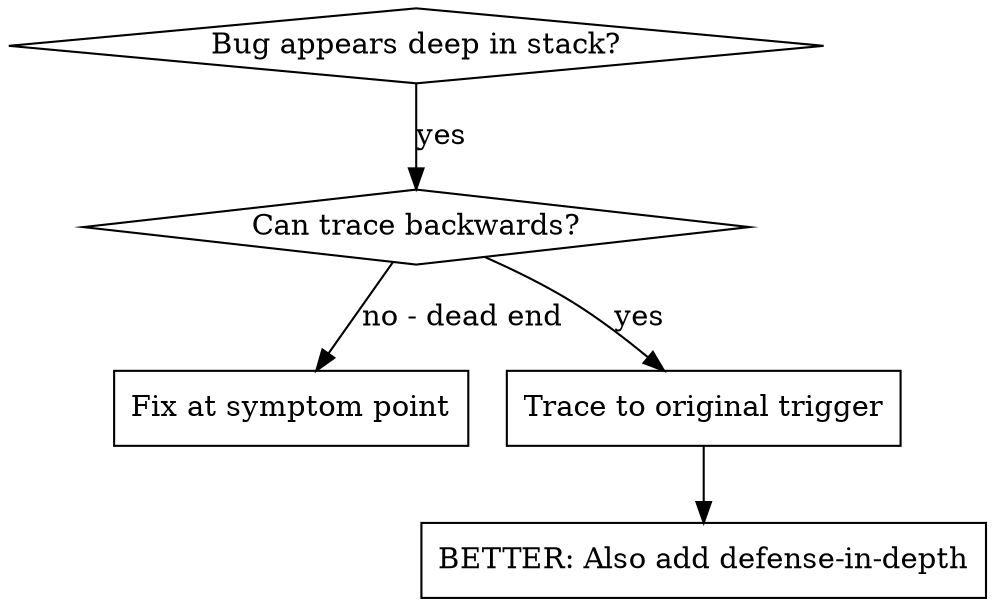

# Skills Guide

> **2480 skills** documentadas · Actualizado: 2026-06-28

> Extraído automáticamente de los frontmatter y secciones `## When to Use` de cada `SKILL.md`.

## Índice de categorías

- [Agent-Behavior (2)](#agent-behavior)
- [Agent-Orchestration (1)](#agent-orchestration)
- [Ai-Agents (6)](#ai-agents)
- [Ai-Research (1)](#ai-research)
- [Ai-Testing (1)](#ai-testing)
- [Andruia (3)](#andruia)
- [Api-Integration (3)](#api-integration)
- [Architecture (2)](#architecture)
- [Automation (1)](#automation)
- [Backend (1)](#backend)
- [Blockchain (1)](#blockchain)
- [Browser-Automation (1)](#browser-automation)
- [Business (2)](#business)
- [Business-Strategy (2)](#business-strategy)
- [Code (1)](#code)
- [Code-Quality (1)](#code-quality)
- [Coding (1)](#coding)
- [Collaboration (1)](#collaboration)
- [Consulting (1)](#consulting)
- [Content (12)](#content)
- [Context-Optimization (1)](#context-optimization)
- [Core-Dev (1)](#core-dev)
- [Creative (1)](#creative)
- [Data (7)](#data)
- [Data-Ai (3)](#data-ai)
- [Database-Processing (1)](#database-processing)
- [Design (13)](#design)
- [Developer-Tools (3)](#developer-tools)
- [Development (25)](#development)
- [Development-And-Testing (1)](#development-and-testing)
- [Devops (7)](#devops)
- [Document-Processing (1)](#document-processing)
- [Documentacion-De-Codigo (10)](#documentacion-de-codigo)
- [Ecommerce (1)](#ecommerce)
- [Education (4)](#education)
- [Finance (2)](#finance)
- [Framework (3)](#framework)
- [Frontend (15)](#frontend)
- [Fullstack (1)](#fullstack)
- [Game-Development (1)](#game-development)
- [General (1)](#general)
- [Granular-Workflow-Bundle (14)](#granular-workflow-bundle)
- [Graphics-Processing (1)](#graphics-processing)
- [Growth (3)](#growth)
- [Knowledge-Management (1)](#knowledge-management)
- [Marketing (5)](#marketing)
- [Mcp (2)](#mcp)
- [Media (2)](#media)
- [Media-Processing (1)](#media-processing)
- [Memory (1)](#memory)
- [Meta (2)](#meta)
- [Ml-Ops (1)](#ml-ops)
- [Orchestration (1)](#orchestration)
- [Personal-Development (1)](#personal-development)
- [Planning (1)](#planning)
- [Presentation-Processing (1)](#presentation-processing)
- [Product-Management (1)](#product-management)
- [Productivity (6)](#productivity)
- [Project-Management (3)](#project-management)
- [Prompt-Engineering (1)](#prompt-engineering)
- [Quality (1)](#quality)
- [Reliability (1)](#reliability)
- [Research (4)](#research)
- [Security (9)](#security)
- [Seo (4)](#seo)
- [Skill-Authoring (2)](#skill-authoring)
- [Spreadsheet-Processing (1)](#spreadsheet-processing)
- [Test-Automation (1)](#test-automation)
- [Testing (4)](#testing)
- [Tool-Quality (1)](#tool-quality)
- [Tools (1)](#tools)
- [Uncategorized (2237)](#uncategorized)
- [Video (1)](#video)
- [Voice-Agents (1)](#voice-agents)
- [Workflow (6)](#workflow)
- [Workflow-Bundle (10)](#workflow-bundle)
- [Writing (2)](#writing)

---

## Agent-Behavior

_2 skills_

### `codex-fable5`

Apply Fable-inspired discipline to Codex work: inspect first, track goals and findings, ground conclusions in evidence, verify before completion, and adapt Claude/Fable prompt guidance without identity or provider claims.

**Cuándo usar:**

- Use when the user asks Codex to work in a Fable-like, Fable5, VFF, evidence-first, or strict verification style.
- Use when converting Claude, Anthropic, or Fable-flavored prompt guidance into Codex-safe project instructions.
- Use when a coding task needs explicit goal tracking, investigation before edits, review-finding closure, or final verification gates.
- Use when setting up optional FableCodex plugin workflows for users who want reusable local goal and findings ledgers.

_source: `community` · risk: `critical` · tags: `codex`, `fable-style`, `agent-workflow`, `verification`, `prompt-adaptation`_

---
### `zipai-optimizer`

Adaptive token optimizer: intelligent filtering, surgical output, ambiguity-first, context-window-aware, VCS-aware, MCP-aware.

**Cuándo usar:**

Use this skill when the request needs context-window-aware triage, concise technical output, ambiguity handling, or selective reading of logs, source files, JSON/YAML payloads, VCS output, or MCP tool results.

_source: `community` · risk: `safe`_

---

---

## Agent-Orchestration

_1 skills_

### `multi-agent-task-orchestrator`

Route tasks to specialized AI agents with anti-duplication, quality gates, and 30-minute heartbeat monitoring

**Cuándo usar:**

- Use when you have 3+ specialized agents that need to coordinate on complex tasks
- Use when agents are doing duplicate or conflicting work
- Use when you need audit trails showing who did what and when
- Use when agent output quality is inconsistent and needs verification gates

_source: `community` · risk: `safe` · tags: `multi-agent`, `orchestration`, `task-routing`, `quality-gates`, `anti-duplication`_

---

---

## Ai-Agents

_6 skills_

### `accint-solve`

Route agent work through AccInt's MCP memory loop: retrieve prior outcomes, resolve frames, and close commitments with evidence.

**Cuándo usar:**

- Use when starting non-trivial coding-agent work where prior decisions,
  debugging history, repo-specific habits, or maintainer feedback may matter.
- Use when a task may require multiple attempts and you want an explicit
  commitment ID that can later receive a real outcome.
- Use when AccInt returns a continuation frame and the agent must reason locally
  before submitting a proposal back to the memory loop.
- Use after verification, merge, deployment, maintainer response, or other
  reality signal to close the commitment with an honest outcome.
_[...]_

_source: `community` · risk: `safe` · tags: `mcp`, `memory`, `ai-agents`, `coding-agents`, `workflow`_

---
### `lambda-lang`

Native agent-to-agent language for compact multi-agent messaging. A shared tongue agents speak directly, not a translation layer. 340+ atoms across 7 domains; 3x smaller than natural language.

**Cuándo usar:**

- Use for agent-to-agent messaging in A2A protocols, orchestrators, task delegation, or handoff pipelines.
- Use when logging structured coordination signals where every token costs money (heartbeats, acknowledgements, error classes, session state).
- Use when both sides of a channel speak Λ — do not use against humans or any surface requiring legal/exact natural language.

_source: `community` · risk: `safe` · tags: `agent-to-agent`, `communication`, `protocol`, `compression`, `multi-agent`_

---
### `llm-council`

Run Fireworks-hosted open-weight model councils that compare responses and synthesize a final answer.

**Cuándo usar:**

Use when this workflow matches the user request: Use this skill for its documented workflow.


_Source: [dair-ai/dair-academy-plugins](https://github.com/dair-ai/dair-academy-plugins) (MIT)._

This skill implements Karpathy's LLM Council concept where multiple open-weight LLMs deliberate on a query, powered entirely by Fireworks AI:

1. **Phase 1**: All models respond to the query independently (parallel)
2. **Phase 2**: Models rank each other's anonymized responses
3. **Phase 3**: A Chairman LLM synthesizes the final answer

_[...]_

_source: `official` · risk: `safe` · tags: `dair-academy`, `ai`, `workflow`_

---
### `loop-library`

Find, compare, adapt, and design bounded AI-agent feedback loops with explicit checks, stop rules, guardrails, and handoffs.

**Cuándo usar:**

Use when the user asks for a loop, recurring agent workflow, automation cadence,
iterative improvement process, existing Loop Library recommendation, or help
turning an outcome into a bounded copy-ready loop through a short question-led
design session.

_Source: [Forward-Future/loop-library](https://github.com/Forward-Future/loop-library) (MIT)._

_source: `official` · risk: `safe` · tags: `ai-agents`, `workflows`, `loops`, `automation`, `evaluation`_

---
### `open-dynamic-workflows`

Plan, orchestrate, and adversarially verify parallel AI coding agents with a dynamic multi-agent workflow engine.

**Cuándo usar:**

- Use when you need to decompose a coding task into independent subtasks and run multiple agents in parallel.
- Use when working across more than one AI coding tool (OpenCode, Codex, Antigravity, VS Code) and want a single orchestration layer.
- Use when the user asks for adversarial review or verification of agent-generated changes before merging.

_source: `community` · risk: `critical` · tags: `multi-agent`, `orchestration`, `workflow`, `adversarial-verification`, `coding-agents`_

---
### `pydantic-ai`

Build production-ready AI agents with PydanticAI — type-safe tool use, structured outputs, dependency injection, and multi-model support.

**Cuándo usar:**

- Use when building Python AI agents that call tools and return structured data
- Use when you need validated, typed LLM outputs (not raw strings)
- Use when you want to write unit tests for agent logic without hitting a real LLM
- Use when switching between LLM providers without rewriting agent code
- Use when the user asks about `Agent`, `@agent.tool`, `RunContext`, `ModelRetry`, or `result_type`

_source: `community` · risk: `safe` · tags: `pydantic-ai`, `ai-agents`, `llm`, `openai`, `anthropic`_

---

---

## Ai-Research

_1 skills_

### `bdistill-knowledge-extraction`

Extract structured domain knowledge from AI models in-session or from local open-source models via Ollama. No API key needed.

**Cuándo usar:**

- Use when you need structured reference data on any domain (medical, legal, finance, cybersecurity)
- Use when building lookup tables, Q&A datasets, or research corpora
- Use when generating training data for traditional ML models (regression, classification — NOT competing LLMs)
- Use when you want cross-model comparison on domain knowledge

_source: `community` · risk: `safe` · tags: `ai`, `knowledge-extraction`, `domain-specific`, `data-moat`, `mcp`_

---

---

## Ai-Testing

_1 skills_

### `bdistill-behavioral-xray`

X-ray any AI model's behavioral patterns — refusal boundaries, hallucination tendencies, reasoning style, formatting defaults. No API key needed.

**Cuándo usar:**

- Use when you want to understand how your AI model actually behaves (not how it claims to)
- Use when choosing between models for a specific task
- Use when debugging unexpected refusals, hallucinations, or formatting issues
- Use for compliance auditing — documenting model behavior at deployment boundaries
- Use for red team assessments — systematic boundary mapping across safety dimensions

_source: `community` · risk: `safe` · tags: `ai`, `testing`, `behavioral-analysis`, `model-evaluation`, `red-team`_

---

---

## Andruia

_3 skills_

### `00-andruia-consultant`

Arquitecto de Soluciones Principal y Consultor Tecnológico de Andru.ia. Diagnostica y traza la hoja de ruta óptima para proyectos de IA en español.

**Cuándo usar:**

Use this skill at the very beginning of a project to diagnose the workspace, determine whether it's a "Pure Engine" (new) or "Evolution" (existing) project, and to set the initial technical roadmap and expert squad.

# 🤖 Andru.ia Solutions Architect - Hybrid Engine (v2.0)

_source: `personal` · risk: `safe`_

---
### `10-andruia-skill-smith`

Ingeniero de Sistemas de Andru.ia. Diseña, redacta y despliega nuevas habilidades (skills) dentro del repositorio siguiendo el Estándar de Diamante.

**Cuándo usar:**

Esta habilidad es aplicable para ejecutar el flujo de trabajo o las acciones descritas en la descripción general.

_source: `personal` · risk: `safe`_

---
### `20-andruia-niche-intelligence`

Estratega de Inteligencia de Dominio de Andru.ia. Analiza el nicho específico de un proyecto para inyectar conocimientos, regulaciones y estándares únicos del sector. Actívalo tras definir el nicho.

**Cuándo usar:**

Use this skill once the project's niche or industry has been identified. It is essential for injecting domain-specific intelligence, regulatory requirements, and industry-standard UX patterns into the project.

# 🧠 Andru.ia Niche Intelligence (Dominio Experto)

_source: `personal` · risk: `safe`_

---

---

## Api-Integration

_3 skills_

### `2slides-ppt-generator`

AI-powered presentation generation via the 2slides API — create slides from text, match a reference image style, summarize documents into decks, add AI voice narration, and export pages/audio. Use for any "make slides", "create a deck", or "slides from this document" request.

**Cuándo usar:**

- Use when the user asks to "create a presentation", "make slides", or "generate a deck" from text or an outline.
- Use when the user wants slides that match the style of a reference image ("create slides like this image").
- Use when the user wants custom-designed PDF slides without a reference image.
- Use when the user uploads a document and asks to "create slides from this document".
- Use when the user wants to add AI voice narration to generated slides, or export slides as PNG images and narration as WAV audio.
_[...]_

_source: `community` · risk: `safe` · tags: `presentations`, `slides`, `powerpoint`, `ai`, `api-integration`_

---
### `pakistan-payments-stack`

Design and implement production-grade Pakistani payment integrations (JazzCash, Easypaisa, bank/PSP rails, optional Raast) for SaaS with PKR billing, webhook reliability, and reconciliation.

**Cuándo usar:**

Use this skill when:
- Building PKR-first SaaS/B2B billing for Pakistan.
- Adding JazzCash/Easypaisa/bank-PSP rails to an existing product.
- Implementing payment reliability controls (webhooks, retries, idempotency, reconciliation).
- Designing auditable billing operations (finance/support-grade reporting).

_source: `community` · risk: `safe` · tags: `saas`, `payments`, `pakistan`, `nextjs`, `b2b`_

---
### `youtube-full`

Fetch YouTube transcripts, search videos, browse channels, and extract playlists via TranscriptAPI — no yt-dlp, no Google API key, works from any cloud server.

**Cuándo usar:**

- User asks to get, fetch, or retrieve a YouTube video transcript
- User asks to search YouTube for videos on a topic
- User wants to monitor a channel for new uploads
- User needs channel metadata, video lists, or playlist contents
- Agent is deployed on a cloud server where yt-dlp calls fail (YouTube blocks cloud IPs)
- Building a research corpus from YouTube conference talks, tutorials, or interviews
- Competitive intelligence: monitoring competitor channels for new content

Do NOT use for:
- Downloading actual video or audio files (use yt-dlp directly with `-f best`)
_[...]_

_source: `community` · risk: `safe` · tags: `youtube`, `transcripts`, `video-search`, `channels`, `playlists`_

---

---

## Architecture

_2 skills_

### `codebase-design`

Shared vocabulary for designing deep modules. Use when the user wants to design or improve a module's interface, find deepening opportunities, decide where a seam goes, make code more testable or AI-navigable, or when another skill needs the deep-module vocabulary.

**Cuándo usar:**

Use when this workflow matches the user request: Shared vocabulary for designing deep modules. Use when the user wants to design or improve a module's interface, find deepening opportunities, decide where a seam goes, make code more testable or AI-navigable, or when another skill needs the deep-module vocabulary.


_Source: [mattpocock/skills](https://github.com/mattpocock/skills) (MIT)._

_[...]_

_source: `community` · risk: `safe` · tags: `architecture`, `workflow`, `coding-agents`_

---
### `domain-modeling`

Build and sharpen a project's domain model. Use when the user wants to pin down domain terminology or a ubiquitous language, record an architectural decision, or when another skill needs to maintain the domain model.

**Cuándo usar:**

Use when this workflow matches the user request: Build and sharpen a project's domain model. Use when the user wants to pin down domain terminology or a ubiquitous language, record an architectural decision, or when another skill needs to maintain the domain model.


_Source: [mattpocock/skills](https://github.com/mattpocock/skills) (MIT)._

_[...]_

_source: `community` · risk: `safe` · tags: `architecture`, `workflow`, `coding-agents`_

---

---

## Automation

_1 skills_

### `flowhunt-skill`

Automation discovery audit skill. Walks through a 5-question workflow intake, then audits Gmail/Calendar/Slack/task trackers to identify automation opportunities. Use when a user wants to discover what processes in their business can be automated.

**Cuándo usar:**

- Use when the user asks "what can I automate in my business?"
- Use when the user wants a workflow audit across Gmail, Calendar, Slack, or task tools
- Use when starting an automation engagement and need structured discovery before recommending solutions
- Use when the user says "show me automation opportunities" or "FlowHunt"

_source: `community` · risk: `safe` · tags: `automation`, `discovery`, `audit`, `gmail`, `calendar`_

---

---

## Backend

_1 skills_

### `hono`

Build ultra-fast web APIs and full-stack apps with Hono — runs on Cloudflare Workers, Deno, Bun, Node.js, and any WinterCG-compatible runtime.

**Cuándo usar:**

- Use when building a REST or RPC API for edge deployment (Cloudflare Workers, Deno Deploy)
- Use when you need a minimal but type-safe server framework for Bun or Node.js
- Use when building a Backend for Frontend (BFF) layer with low latency requirements
- Use when migrating from Express but wanting better TypeScript support and edge compatibility
- Use when the user asks about Hono routing, middleware, `c.req`, `c.json`, or `hc()` RPC client

_source: `community` · risk: `safe` · tags: `hono`, `edge`, `cloudflare-workers`, `bun`, `deno`_

---

---

## Blockchain

_1 skills_

### `goldrush-api`

Query blockchain data across 100+ chains: wallet balances, token prices, transactions, DEX pairs, and real-time OHLCV streams via the GoldRush API by Covalent.

**Cuándo usar:**

- Retrieving wallet token balances or total portfolio value across any chain
- Fetching transaction history or decoded event logs for an address
- Getting current or historical token prices (USD or native)
- Monitoring DEX pairs, liquidity events, and real-time OHLCV candles via WebSocket
- Building block explorers, portfolio dashboards, tax tools, or DeFi analytics
- Accessing on-chain data with no signup via x402 pay-per-request

_source: `community` · risk: `safe` · tags: `blockchain`, `crypto`, `web3`, `api`, `defi`_

---

---

## Browser-Automation

_1 skills_

### `skyvern-browser-automation`

AI-powered browser automation — navigate sites, fill forms, extract structured data, log in with stored credentials, and build reusable workflows.

**Cuándo usar:**

- Use when you need AI-assisted browser automation for navigation, extraction, form filling, login flows, or reusable website workflows.
- Use when deterministic selectors are unavailable and Skyvern's visual/a11y reasoning can identify page controls.
- Use when a one-off browser task should become a repeatable workflow with run history and verification.

_source: `community` · risk: `safe` · tags: `browser-automation`, `mcp`, `web-scraping`, `form-filling`, `ai-agents`_

---

---

## Business

_2 skills_

### `crossframe-org`

Use when CrossFrame Suite routes explicit Chinese analysis of teams, projects, organizations, responsibility chains, feedback write-back, repair, or retrospectives.

**Cuándo usar:**

- Use when `crossframe-suite` routes an explicit CrossFrame task about teams, projects, organizations, responsibility chains, authority chains, feedback write-back, retrospectives, or repair.
- Use when an organizational failure needs mechanism candidates rather than personality judgment.
- Do not use independently unless the user explicitly names this sibling skill.

_source: `community` · risk: `safe` · tags: `crossframe`, `chinese`, `organization`, `retrospective`, `repair`_

---
### `lex`

Centralized 'Truth Engine' for cross-jurisdictional legal context (US, EU, CA) and contract scaffolding.

**Cuándo usar:**

- Use when you need to cross-reference or compare legal requirements between different territories, such as verifying the compliance gap between an **EU SARL** and a **US LLC**.
- Use when working with foundational business or employment documents that require specific, jurisdiction-compliant clauses to be inserted into a professional scaffold.
- Use when the user asks about the specific regulatory nuances, formation steps, or "truth-based" definitions of legal entities within the **29 supported jurisdictions** (USA, Canada, and the EU).

_source: `community` · risk: `safe` · tags: `legal`, `context`, `cross-jurisdictional`, `compliance`, `scaffolding`_

---

---

## Business-Strategy

_2 skills_

### `kotler-macro-analyzer`

Professional PESTEL/SWOT analysis agent based on Kotler's methodology for strategic market audits.

**Cuándo usar:**

- Use when conducting market entry research or a periodic strategic audit.
- Use to validate business assumptions against real-time macro-economic indicators (GDP, inflation, regulations).
- Use when preparing for high-level business planning sessions.

_source: `self` · risk: `safe` · tags: `marketing`, `economics`, `strategy`, `kotler`, `pestel`_

---
### `osterwalder-canvas-architect`

Iterative consultant agent for building and validating logically consistent 9-block Business Model Canvases.

**Cuándo usar:**

- Use when designing a new business architecture from scratch.
- Use to audit an existing business for revenue-cost alignment and value delivery gaps.
- Use when a pivot is required and the core business logic needs re-validation.

_source: `self` · risk: `safe` · tags: `business-model`, `osterwalder`, `strategy`, `bmc`_

---

---

## Code

_1 skills_

### `sankhya-dashboard-html-jsp-custom-best-pratices`

This skill should be used when the user asks for patterns, best practices, creation, or fixing of Sankhya dashboards using HTML, JSP, Java, and SQL.

**Cuándo usar:**

This skill should be used when:
- The user asks about "boas praticas do sankhya" or "Sankhya best practices".
- The user mentions "dashboard sankhya" or is working on a Sankhya BI dashboard.
- The user asks for anything related to the word "Sankhya".
- The user wants to create or modify code files for Sankhya dashboards.

_source: `community` · risk: `safe` · tags: `sankhya`, `dashboard`, `jsp`, `html`, `sql`_

---

---

## Code-Quality

_1 skills_

### `uncle-bob-craft`

Use when performing code review, writing or refactoring code, or discussing architecture; complements clean-code and does not replace project linter/formatter.

**Cuándo usar:**

- **Code review**: Apply Dependency Rule, boundaries, SOLID, and smell heuristics; suggest concrete refactors.
- **Refactoring**: Decide what to extract, where to draw boundaries, and whether a design pattern is justified.
- **Architecture discussion**: Check layer boundaries, dependency direction, and separation of concerns.
- **Design patterns**: Assess correct use vs cargo-cult or overuse before introducing a pattern.
- **Estimation and professionalism**: Apply Clean Coder ideas (saying no, sustainable pace, three-point estimates).
_[...]_

_source: `community` · risk: `safe` · tags: `clean-code`, `clean-architecture`, `solid`, `code-review`, `craftsmanship`_

---

---

## Coding

_1 skills_

### `faf-expert`

Advanced .faf (Foundational AI-context Format) specialist. IANA-registered format, MCP server config, championship scoring, bi-directional sync.

**Cuándo usar:**

Use FAF Expert when you need:

| Scenario | What FAF Expert Provides |
|----------|---------------------------|
| **Complex project setup** | Expert configuration of .faf files and MCP servers |
| **Championship scoring** | Achieve 85%+ AI-readiness scores for production projects |
| **Multi-AI workflows** | Universal context that works across Claude, Cursor, Gemini, Windsurf |
| **Legacy codebase revival** | Transform archaeology into AI-readable project DNA |
| **Team collaboration** | Standardized context format for consistent AI assistance |
_[...]_

_source: `community` · risk: `safe` · tags: `faf`, `ai-context`, `project-management`, `mcp`, `iana`_

---

---

## Collaboration

_1 skills_

### `viboscope`

Psychological compatibility matching — find cofounders, collaborators, and friends through validated psychometrics

**Cuándo usar:**

- Use when looking for a cofounder or project collaborator
- Use when wanting to find people with compatible work style and values
- Use when checking compatibility with a specific person via invite link

_source: `community` · risk: `safe` · tags: `matching`, `psychology`, `compatibility`, `networking`, `collaboration`_

---

---

## Consulting

_1 skills_

### `web-project-brainstorming`

Masterclass framework for brainstorming web development projects and page designs. Outlines structural phases for concept, UX flow, styling aesthetics, technical architecture, and SEO.

**Cuándo usar:**

- Use at the start of any new web development project or page redesign.
- Use when scoping feature sets, user roles, and interaction patterns for web applications.
- Use when establishing design systems, color tokens, and layout guidelines.
- Use when evaluating tech stacks (e.g., Next.js vs. Vanilla JS, CSS Grid vs. Tailwind).

_source: `self` · risk: `safe` · tags: `brainstorming`, `project-planning`, `web-development`, `product-scoping`, `design-system`_

---

---

## Content

_12 skills_

### `audio-transcriber`

Transform audio recordings into professional Markdown documentation with intelligent summaries using LLM integration

**Cuándo usar:**

Invoke this skill when:

- User needs to transcribe audio/video files to text
- User wants meeting minutes automatically generated from recordings
- User requires speaker identification (diarization) in conversations
- User needs subtitles/captions (SRT, VTT formats)
- User wants executive summaries of long audio content
- User asks variations of "transcribe this audio", "convert audio to text", "generate meeting notes from recording"
- User has audio files in common formats (MP3, WAV, M4A, OGG, FLAC, WEBM)

_source: `community` · risk: `safe`_

---
### `crossframe-casebook`

Use when CrossFrame Suite routes explicit Chinese casebook work: turning materials into reusable cases, anonymized entries, mechanisms, and retrieval indexes.

**Cuándo usar:**

- Use when `crossframe-suite` routes explicit CrossFrame materials into reusable casebook entries, anonymized case records, mechanism extraction, or retrieval indexes.
- Use when the goal is future reuse rather than immediate advice.
- Do not use independently unless the user explicitly names this sibling skill.

_source: `community` · risk: `safe` · tags: `crossframe`, `chinese`, `casebook`, `case-study`, `knowledge-base`_

---
### `crossframe-critical`

Use only when the user explicitly names crossframe-critical for a Chinese structural critique dossier, article plan, or long-form critical essay.

**Cuándo usar:**

- Use only when the user explicitly names `crossframe-critical`, `$crossframe-critical`, or asks to test this critical parallel skill.
- Use for Chinese structural critique dossiers, critique matrices, article plans, and long-form critical essays.
- Do not include it in the default `crossframe-suite` route.

_source: `community` · risk: `safe` · tags: `crossframe`, `chinese`, `critique`, `essay`, `structural-analysis`_

---
### `crossframe-debate`

Use when CrossFrame Suite routes explicit Chinese proposition testing, debate analysis, hidden-premise review, rebuttal design, or withdrawal condition checks.

**Cuándo usar:**

- Use when `crossframe-suite` routes an explicit CrossFrame task about propositions, debate, hidden premises, rebuttals, strongest opposing arguments, evidence requirements, or withdrawal conditions.
- Use to test claims before they become strong judgments.
- Do not use independently unless the user explicitly names this sibling skill.

_source: `community` · risk: `safe` · tags: `crossframe`, `chinese`, `debate`, `argument`, `proposition`_

---
### `crossframe-dialogue`

Use when CrossFrame Suite routes explicit Chinese reader replies, editor responses, consultation-style short answers, or boundary-aware structural advice.

**Cuándo usar:**

- Use when `crossframe-suite` routes an explicit CrossFrame task into a reader reply, editor response, consultation-style short answer, or boundary-aware advice.
- Use when the answer should first translate structural judgment into plain Chinese before optional term mapping.
- Do not use independently unless the user explicitly names this sibling skill.

_source: `community` · risk: `safe` · tags: `crossframe`, `chinese`, `dialogue`, `reader-reply`, `consultation`_

---
### `crossframe-essay`

Use when explicit CrossFrame work needs a Chinese critical insight essay, commentary, concept essay, public piece, or structure-to-article draft after diagnosis.

**Cuándo usar:**

- Use only after explicit CrossFrame Essay invocation or after `crossframe-suite` routes a CrossFrame task into article output.
- Use for Chinese critical insight essays, public commentary, concept essays, long-form reader replies, and structure-to-article drafting.
- Do not use as a generic writing skill outside explicit CrossFrame context.

_source: `community` · risk: `safe` · tags: `crossframe`, `chinese`, `essay`, `writing`, `commentary`_

---
### `crossframe-notebook`

Use when CrossFrame Suite routes explicit Chinese notes for books, theories, articles, excerpts, bidirectional reading, absorption, or conflict mapping.

**Cuándo usar:**

- Use when `crossframe-suite` routes explicit CrossFrame work into notes for books, theories, articles, excerpts, bidirectional reading, absorption, or conflict mapping.
- Use when original text and CrossFrame concepts must be kept distinct.
- Do not use independently unless the user explicitly names this sibling skill.

_source: `community` · risk: `safe` · tags: `crossframe`, `chinese`, `notebook`, `research`, `reading`_

---
### `crossframe-teach`

Use when CrossFrame Suite routes explicit Chinese teaching of CrossFrame concepts, misreading boundaries, plain-language examples, signals, or exercises.

**Cuándo usar:**

- Use when `crossframe-suite` routes explicit CrossFrame work into concept teaching, misreading correction, plain-language examples, observable signals, or exercises.
- Use when the user wants to understand a CrossFrame concept without turning terms into slogans.
- Do not use independently unless the user explicitly names this sibling skill.

_source: `community` · risk: `safe` · tags: `crossframe`, `chinese`, `teaching`, `concepts`, `plain-language`_

---
### `cv-generator`

Generate professional, ATS-optimized CVs for FlowCV, Canva, Google Docs, or Word. Handles multi-source merging, JD targeting, seniority adaptation, and humanized rewriting. Outputs paste-ready text with an ATS flaw report and improvement suggestions.

**Cuándo usar:**

Use this skill when you need to:
- Generate a professional, ATS-optimized CV from multiple sources (LinkedIn, GitHub, Portfolio).
- Tailor an existing CV for a specific Job Description (JD).
- Improve the language, metrics, and structure of a draft resume.
- Prepare a paste-ready version of your CV for tools like FlowCV or Canva.

Turns raw profile data into a polished, ATS-ready CV. Outputs a paste-ready plain-text
version formatted for FlowCV, Canva, Google Docs, or Word — with a flaw report and
missing-info checklist.

---

_source: `community` · risk: `safe` · tags: `cv`, `resume`, `ats`, `career`, `job-application`_

---
### `humanize-chinese`

Detect and rewrite AI-like Chinese text with a practical workflow for scoring, humanization, academic AIGC reduction, and style conversion. Use when the user asks to 去AI味, 降AIGC, 去除AI痕迹, 论文降重, 知网检测, 维普检测, humanize chinese, detect AI text, or make Chinese text sound more natural.

**Cuándo usar:**

- Use when the user says `去AI味`, `降AIGC`, `去除AI痕迹`, `让文字更自然`, `改成人话`, or `降低AI率`
- Use when the user wants a Chinese text checked for AI-writing patterns or suspicious phrasing
- Use when the user wants academic-paper-specific AIGC reduction for CNKI, VIP, or Wanfang-style checks
- Use when the user wants Chinese text rewritten into a different style such as `zhihu`, `xiaohongshu`, `wechat`, `weibo`, `literary`, or `academic`

_source: `community` · risk: `safe` · tags: `chinese`, `writing`, `editing`, `aigc`, `academic`_

---
### `wordpress-centric-high-seo-optimized-blogwriting-skill`

Generate clean, human-sounding, SEO-optimized WordPress blog posts with optional Yoast metadata, JSON-LD schema markup, and image SEO planning. Supports modular batch output.

**Cuándo usar:**

- Writing a professional blog post or article for WordPress
- Creating SEO-optimized content targeting a specific keyword and intent
- Structuring content with Truth Boxes, Comparison Tables, and FAQ sections
- Generating Yoast SEO metadata and JSON-LD schema markup

---

_source: `self` · risk: `safe` · tags: `writing`, `blog`, `seo`, `content`, `wordpress`_

---
### `youtube-summarizer`

Extract transcripts from YouTube videos and generate comprehensive, detailed summaries using intelligent analysis frameworks

**Cuándo usar:**

This skill should be used when:

- User provides a YouTube video URL and wants a detailed summary
- User needs to document video content for reference without rewatching
- User wants to extract insights, key points, and arguments from educational content
- User needs transcripts from YouTube videos for analysis
- User asks to "summarize", "resume", or "extract content" from YouTube videos
- User wants comprehensive documentation prioritizing completeness over brevity

_source: `community` · risk: `safe`_

---

---

## Context-Optimization

_1 skills_

### `geminiignore-finops`

Configure and optimize .geminiignore files for AI context window efficiency and token cost reduction (FinOps).

**Cuándo usar:**

- Use when initializing a new repository or workspace for pair-programming with AI agents.
- Use when the AI context window is reaching its limits or when billing optimization (FinOps) is a priority.
- Use when the AI agent is accidentally reading build outputs, lock files, databases, or binary media.

_source: `community` · risk: `safe` · tags: `finops`, `context-management`, `token-optimization`, `geminiignore`_

---

---

## Core-Dev

_1 skills_

### `vscode-extension-guide-en`

Guide for VS Code extension development from scaffolding to Marketplace publication

**Cuándo usar:**

- Use when creating a new VS Code extension from scratch
- Use when adding commands, keybindings or settings to an extension
- Use when building TreeView or Webview UI in an extension
- Use when publishing an extension to the VS Code Marketplace
- Use when troubleshooting extension activation or packaging issues

_source: `community` · risk: `safe` · tags: `vscode`, `extension`, `ide`, `typescript`, `marketplace`_

---

---

## Creative

_1 skills_

### `article-illustrations`

Generate hand-drawn 16:9 article illustrations with the Grav character IP, sparse annotations, and absurd but clear visual metaphors.

**Cuándo usar:**

- Use when writing articles, blog posts, or documentation that need inline illustrations
- Use when you want to turn abstract concepts into concrete visual metaphors
- Use when you want a consistent visual language across multiple articles
- Use when you need hand-drawn explanation sketches, not PPT infographics

_source: `community` · risk: `safe` · tags: `illustration`, `article-graphics`, `visual-metaphors`, `image-generation`, `whiteboard-sketch`_

---

---

## Data

_7 skills_

### `arrowspace`

Spectral vector search using graph Laplacian eigenstructure. Use when cosine/L2 similarity misses latent structure in your embeddings.

**Cuándo usar:**

- Cosine or L2 similarity misses latent structure in your embeddings
- You want graph-based retrieval with spectral awareness
- You need to characterise the spectral properties of an embedding space
- You are building RAG pipelines where contextual role matters alongside semantic content

_source: `community` · risk: `safe` · tags: `vector-search`, `spectral-analysis`, `graph-laplacian`, `embeddings`, `lambda-tau`_

---
### `monte-carlo-monitor-creation`

Guides creation of Monte Carlo monitors via MCP tools, producing monitors-as-code YAML for CI/CD deployment.

_source: `community` · risk: `safe` · tags: `data-observability`, `monitoring`, `monte-carlo`, `monitors-as-code`_

---
### `monte-carlo-prevent`

Surfaces Monte Carlo data observability context (table health, alerts, lineage, blast radius) before SQL/dbt edits.

_source: `community` · risk: `safe` · tags: `data-observability`, `dbt`, `schema`, `monte-carlo`, `lineage`_

---
### `monte-carlo-push-ingestion`

Expert guide for pushing metadata, lineage, and query logs to Monte Carlo from any data warehouse.

**Cuándo usar:**

Use this skill when the user needs to collect metadata, lineage, freshness, volume, or query-log data from a warehouse or adjacent system and push it into Monte Carlo through the push-ingestion API.

Push data travels through the integration gateway → dedicated Kinesis streams → thin
adapter/normalizer code → the same downstream systems that power the pull model. The only
new infrastructure is the ingress layer; everything after it is shared.

_source: `community` · risk: `safe` · tags: `data-observability`, `ingestion`, `monte-carlo`, `pycarlo`, `metadata`_

---
### `monte-carlo-validation-notebook`

Generates SQL validation notebooks for dbt PR changes with before/after comparison queries.

**Cuándo usar:**

Use this skill when the user wants to validate dbt model or snapshot changes with Monte Carlo SQL Notebook queries, either from a GitHub PR or a local dbt repository.

Parse the arguments:
- **Target** (required): first argument — a GitHub PR URL or local dbt repo path
- **MC Base URL** (optional): `--mc-base-url <URL>` — defaults to `https://getmontecarlo.com`
_[...]_

_source: `community` · risk: `safe` · tags: `data-observability`, `validation`, `dbt`, `monte-carlo`, `sql-notebook`_

---
### `sql-sentinel`

Audit SQL for the cost & performance anti-patterns that burn warehouse credits. Scores warehouse health 0-100 and outputs a prioritized cost-reduction plan for BigQuery, Snowflake, Redshift, and Postgres.

**Cuándo usar:**

- A user writes or reviews a query for BigQuery, Snowflake, Redshift, Postgres, or Spark SQL.
- A user asks "why is this query so slow?" or "why is my warehouse bill so high?"
- A user is about to promote a dashboard query or dbt model to production.
- A data engineer wants a second pair of eyes before a code review or a cost-optimization sweep.
- A team is running a "reduce cloud spend" or FinOps initiative.

_source: `community` · risk: `safe` · tags: `sql`, `bigquery`, `snowflake`, `redshift`, `postgres`_

---
### `x-twitter-scraper`

X (Twitter) data platform skill — tweet search, user lookup, follower extraction, engagement metrics, giveaway draws, monitoring, webhooks, 19 extraction tools, MCP server.

**Cuándo usar:**

- User needs to search X/Twitter for tweets by keyword, hashtag, or user
- User asks for advanced Twitter search, profile tweets, or user timeline data
- User wants to look up a user profile (bio, follower counts, etc.)
- User needs engagement metrics for a specific tweet (likes, retweets, views)
- User wants to check if one account follows another
- User needs to extract followers, replies, retweets, quotes, or community members in bulk
- User wants to download tweet media, export results, or connect an official SDK
_[...]_

_source: `community` · risk: `critical`_

---

---

## Data-Ai

_3 skills_

### `ai-engineering-toolkit`

6 production-ready AI engineering workflows: prompt evaluation (8-dimension scoring), context budget planning, RAG pipeline design, agent security audit (65-point checklist), eval harness building, and product sense coaching.

**Cuándo usar:**

- Use when evaluating or optimizing LLM system prompts before production deployment
- Use when designing a RAG pipeline and need structured architecture decisions (not just boilerplate code)
- Use when planning token budget allocation across context window zones
- Use when running pre-launch security audits on AI agents
- Use when building evaluation frameworks for LLM applications
- Use when thinking through product strategy before writing code

_source: `community` · risk: `offensive` · tags: `prompt-engineering`, `rag`, `security`, `evaluation`, `ai-engineering`_

---
### `local-llm-expert`

Master local LLM inference, model selection, VRAM optimization, and local deployment using Ollama, llama.cpp, vLLM, and LM Studio. Expert in quantization formats (GGUF, EXL2) and local AI privacy.

**Cuándo usar:**

This skill is applicable to execute the workflow or actions described in the overview.

_source: `community` · risk: `safe`_

---
### `seek-and-analyze-video`

Seek and analyze video content using Memories.ai Large Visual Memory Model for persistent video intelligence

**Cuándo usar:**

Use this skill when the user wants to search for, import, or analyze video content from TikTok, YouTube, or Instagram, summarize meetings or lectures from recordings, build a searchable knowledge base from video content, or research social media trends and creators.

# Seek and Analyze Video

_source: `https://github.com/kennyzheng-builds/seek-and-analyze-video` · risk: `safe` · tags: `video`, `ai`, `memories`, `social-media`, `youtube`_

---

---

## Database-Processing

_1 skills_

### `base`

Database management, forms, reports, and data operations with LibreOffice Base.

**Cuándo usar:**

Use this skill when:
- Creating new databases in ODB format
- Connecting to external databases (MySQL, PostgreSQL, etc.)
- Automating database operations and reports
- Creating forms and reports
- Building database applications

_source: `personal` · risk: `safe`_

---

---

## Design

_13 skills_

### `rayden-use`

Build and maintain Rayden UI components and screens in Figma via Figma MCP with full design token enforcement

**Cuándo usar:**

- You need to build a new Rayden UI component with all its variants in Figma
- You're composing a full screen (dashboard, landing page, auth form, settings, data table) from Rayden patterns
- You want to audit an existing Figma file for design system compliance
- You need to add new variants to an existing Figma component
- You're syncing React component updates back to Figma

_source: `https://github.com/playbookTV/rayden-ui-design-skill` · risk: `safe`_

---
### `ui-a11y`

Audit a StyleSeed-based component or page for WCAG 2.2 AA issues and apply practical accessibility fixes where the code makes them safe.

**Cuándo usar:**

- Use when reviewing a page or component for accessibility regressions
- Use when a StyleSeed UI looks polished but has uncertain keyboard or contrast behavior
- Use when adding new interactive controls to a mobile-first screen
- Use when you want a prioritized list of issues and fixable items

_source: `community` · risk: `safe` · tags: `ui`, `accessibility`, `wcag`, `audit`, `styleseed`_

---
### `ui-component`

Generate a new UI component that follows StyleSeed Toss conventions for structure, tokens, accessibility, and component ergonomics.

**Cuándo usar:**

- Use when you need a new UI primitive or composed component inside a StyleSeed-based project
- Use when you want a component to match the existing Toss seed conventions
- Use when a component should be reusable, typed, and design-token driven
- Use when the AI might otherwise invent spacing, colors, or interaction patterns

_source: `community` · risk: `safe` · tags: `ui`, `components`, `design-system`, `frontend`, `styleseed`_

---
### `ui-page`

Scaffold a new mobile-first page using StyleSeed Toss layout patterns, section rhythm, and existing shell components.

**Cuándo usar:**

- Use when you need a new page in a Toss-seed app
- Use when you want a consistent page shell, spacing, and navigation structure
- Use when you are adding a new product flow and need a solid starting layout
- Use when you want to stay mobile-first even if the project later expands to larger breakpoints

_source: `community` · risk: `safe` · tags: `ui`, `page-design`, `mobile`, `layout`, `styleseed`_

---
### `ui-pattern`

Generate reusable UI patterns such as card sections, grids, lists, forms, and chart wrappers using StyleSeed Toss primitives.

**Cuándo usar:**

- Use when you need a reusable layout pattern rather than a one-off page section
- Use when a page repeats the same arrangement of cards, rows, filters, or data blocks
- Use when you want to build from existing StyleSeed primitives instead of copying markup
- Use when you want a pattern component with props for dynamic content

_source: `community` · risk: `safe` · tags: `ui`, `patterns`, `design-system`, `reuse`, `styleseed`_

---
### `ui-review`

Review UI code for StyleSeed design-system compliance, accessibility, mobile ergonomics, spacing discipline, and implementation quality.

**Cuándo usar:**

- Use when a component or page should follow the StyleSeed Toss design language
- Use when reviewing a UI-heavy PR for consistency and design-system violations
- Use when the output looks "mostly fine" but feels off in subtle ways
- Use when you need a structured review with concrete fixes

_source: `community` · risk: `safe` · tags: `ui`, `review`, `design-system`, `accessibility`, `styleseed`_

---
### `ui-setup`

Interactive StyleSeed setup wizard for choosing app type, brand color, visual style, typography, and the first screen scaffold.

**Cuándo usar:**

- Use when you are starting a new app with the StyleSeed Toss seed
- Use when you copied the seed into an existing project and need to personalize it
- Use when you want the AI to ask one design decision at a time instead of guessing
- Use when you need a first page scaffold after selecting colors, font, and app type

_source: `community` · risk: `safe` · tags: `ui`, `design-system`, `setup`, `frontend`, `styleseed`_

---
### `ui-tokens`

List, add, and update StyleSeed design tokens while keeping JSON sources, CSS variables, and dark-mode values in sync.

**Cuándo usar:**

- Use when you need to inspect the current token set
- Use when you want to add a new color, shadow, radius, spacing, or typography token
- Use when you need to update a token and propagate the change safely
- Use when the project has both JSON token files and CSS variables that must stay aligned

_source: `community` · risk: `safe` · tags: `ui`, `tokens`, `design-system`, `theming`, `styleseed`_

---
### `ux-audit`

Audit screens against Nielsen's heuristics and mobile UX best practices using the StyleSeed Toss design language as the implementation context.

**Cuándo usar:**

- Use when a screen feels awkward even though the code and styling seem correct
- Use when evaluating a flow before or after implementation
- Use when reviewing a mobile-first product for usability regressions
- Use when you want findings framed as user experience problems with remediation

_source: `community` · risk: `safe` · tags: `ux`, `audit`, `usability`, `mobile`, `styleseed`_

---
### `ux-copy`

Generate UX microcopy in StyleSeed's Toss-inspired voice for buttons, empty states, errors, toasts, confirmations, and form guidance.

**Cuándo usar:**

- Use when you need button labels, helper text, toasts, empty states, or error messages
- Use when a feature has functional UI but weak or robotic wording
- Use when you want consistent product voice across a flow
- Use when confirmation dialogs or state feedback need better phrasing

_source: `community` · risk: `safe` · tags: `ux`, `copywriting`, `microcopy`, `frontend`, `styleseed`_

---
### `ux-feedback`

Add loading, empty, error, and success feedback states to StyleSeed components and pages with practical mobile-first rules.

**Cuándo usar:**

- Use when a component or page fetches, mutates, or depends on async data
- Use when a flow currently renders only the success path
- Use when a card, list, or page needs better state communication
- Use when the product needs clear recovery and confirmation behavior

_source: `community` · risk: `safe` · tags: `ux`, `states`, `loading`, `error-handling`, `styleseed`_

---
### `ux-flow`

Design user flows and screen structure using StyleSeed UX patterns such as progressive disclosure, hub-and-spoke navigation, and information pyramids.

**Cuándo usar:**

- Use when planning onboarding, checkout, account management, dashboards, or drill-down flows
- Use when a new feature spans multiple screens or modal states
- Use when users need a clear path through a task instead of a single isolated page
- Use when the UI needs navigation logic before components are built

_source: `community` · risk: `safe` · tags: `ux`, `flows`, `navigation`, `product-design`, `styleseed`_

---
### `uxui-principles`

Evaluate interfaces against 168 research-backed UX/UI principles, detect antipatterns, and inject UX context into AI coding sessions.

**Cuándo usar:**

- Auditing an existing interface for UX issues
- Checking if a UI follows research-backed best practices
- Detecting antipatterns and UX smells in designs
- Reviewing AI-powered interfaces for trust, transparency, and safety
- Getting UX guidance before or during implementation

_source: `community` · risk: `safe` · tags: `ux`, `ui`, `design`, `evaluation`, `principles`_

---

---

## Developer-Tools

_3 skills_

### `gh-image`

Upload local images to GitHub and get canonical user-attachments embed URLs; use when asked to attach a screenshot to a PR, issue, or comment, or to embed before/after images in a README.

**Cuándo usar:**

Use this skill when asked to:

- "Attach a screenshot to the PR" or "add an image to the PR description"
- "Put this image in the issue" / "comment with these screenshots"
- "Show the test results / before-and-after in the PR"
- Embed any local image into GitHub Markdown without leaving the terminal

_source: `community` · risk: `safe` · tags: `github`, `images`, `screenshots`, `gh-extension`, `cli`_

---
### `mcp-tool-developer`

Build Model Context Protocol (MCP) servers and tools from scratch. Full-stack MCP development with TypeScript/Python, testing, deployment, and registry publishing.

**Cuándo usar:**

- Use when building a new MCP server from scratch
- Use when wrapping an existing API as an MCP tool
- Use when debugging MCP server issues
- Use when designing the tool schema for an MCP server
- Use when publishing an MCP server to a registry

_source: `community` · risk: `safe` · tags: `mcp`, `ai-agent`, `tool-development`, `typescript`, `python`_

---
### `tokenwise`

Measurement-driven model router for Claude Code. Routes Haiku/Sonnet/Opus per task class, logs every routed task with real $ numbers, and A/B tests cheaper tiers before you trust the savings.

**Cuándo usar:**

- Cutting Claude Code token spend without sacrificing output quality
- Validating whether Haiku/Sonnet is "good enough" for a specific task class before trusting auto-routing
- Auditing where Opus tokens are actually being burned
- Logging per-session cost data for finance or chargeback

_source: `community` · risk: `critical` · tags: `model-routing`, `token-optimization`, `cost-reduction`, `anthropic`, `haiku`_

---

---

## Development

_25 skills_

### `agenttrace-session-audit`

Audit local AI coding-agent sessions with agenttrace for cost, tool failures, latency, anomalies, health, diffs, and CI gates.

**Cuándo usar:**

- Use when a user asks why an AI coding run was slow, expensive, shallow, or unreliable.
- Use when reviewing local agent logs before retrying a failed or suspicious task.
- Use when building a lightweight CI health gate for AI-assisted coding sessions.
- Use when comparing two attempts and looking for changed tool paths, retries, or cost patterns.

_source: `community` · risk: `safe` · tags: `ai-coding`, `observability`, `cost-tracking`, `session-analysis`_

---
### `api-endpoint-builder`

Builds production-ready REST API endpoints with validation, error handling, authentication, and documentation. Follows best practices for security and scalability.

**Cuándo usar:**

- User asks to "create an API endpoint" or "build a REST API"
- Building new backend features
- Adding endpoints to existing APIs
- User mentions "API", "endpoint", "route", or "REST"
- Creating CRUD operations

_source: `community` · risk: `safe`_

---
### `ax-extract-workflow`

Reconstruct workflow behind a past coding-agent artifact using local ax sessions/commits/skills/tool traces. Use when asked how X was built.

**Cuándo usar:**

- Use when the user asks "how did we build X?", "what made X work?", or "extract the workflow behind this artifact."
- Use when the anchor is a commit SHA, date, feature name, PR, session, or repo-local artifact.
- Use when the user wants the sequence of agent skills, prompts, commands, decisions, and checks that led to a result.
- Do not use for a generic activity summary; use normal session listing instead.

_source: `community` · risk: `safe` · tags: `ai-coding`, `workflow-reconstruction`, `session-analysis`, `observability`_

---
### `brooks-lint`

AI code reviewer grounded in classic software engineering books for catching design smells, coupling issues, and architectural risks.

**Cuándo usar:**

- Use when you want architectural feedback beyond what linters provide
- Use before major refactors to identify structural debt
- Use when reviewing code that "works but feels wrong"
- Use when onboarding to a codebase to quickly map risk areas
- Use for design reviews before starting a new module or service

_source: `community` · risk: `safe` · tags: `code-review`, `architecture`, `software-design`, `refactoring`, `claude-code`_

---
### `bug-hunter`

Systematically finds and fixes bugs using proven debugging techniques. Traces from symptoms to root cause, implements fixes, and prevents regression.

**Cuándo usar:**

- User reports a bug or error
- Something isn't working as expected
- User says "fix the bug" or "debug this"
- Intermittent failures or weird behavior
- Production issues need investigation

_source: `community` · risk: `safe`_

---
### `codebase-audit-pre-push`

Deep audit before GitHub push: removes junk files, dead code, security holes, and optimization issues. Checks every file line-by-line for production readiness.

**Cuándo usar:**

- User requests "audit the codebase" or "review before push"  
- Before making the first push to GitHub  
- Before making a repository public  
- Pre-production deployment review  
- User asks to "clean up the code" or "optimize everything"

_source: `community` · risk: `safe`_

---
### `diagnosing-bugs`

Diagnosis loop for hard bugs and performance regressions. Use when the user says "diagnose"/"debug this", or reports something broken/throwing/failing/slow.

**Cuándo usar:**

Use when this workflow matches the user request: Use this skill for its documented workflow.


_Source: [mattpocock/skills](https://github.com/mattpocock/skills) (MIT)._

A discipline for hard bugs. Skip phases only when explicitly justified.

When exploring the codebase, read `CONTEXT.md` (if it exists) to get a clear mental model of the relevant modules, and check ADRs in the area you're touching.

_source: `community` · risk: `safe` · tags: `engineering`, `workflow`, `coding-agents`_

---
### `ecl-harness-engineer`

Create or audit ECL Agent Harness infrastructure: AGENTS.md, change tracking, repository guidance, lint checks, CI gates, and agent handoff docs.

**Cuándo usar:**

- Use when a repository needs AI-agent collaboration infrastructure such as `AGENTS.md`, `docs/ECL.md`, `docs/STATUS.md`, harness change tracking, or mechanical validation gates.
- Use when auditing an existing Agent Harness for missing ECL lifecycle docs, change templates, lint checks, environment contracts, or CI integration.
- Use when converting repeated agent workflow failures into repository-local documentation, tests, lint rules, or lightweight auto-evolution checks.
_[...]_

_source: `community` · risk: `safe` · tags: `codex`, `agent-harness`, `ecl`, `workflow`, `ci`_

---
### `gdb-cli`

GDB debugging assistant for AI agents - analyze core dumps, debug live processes, investigate crashes and deadlocks with source code correlation

**Cuándo usar:**

- Analyze core dumps or crash dumps
- Debug running processes with GDB attach
- Investigate crashes, deadlocks, or memory issues
- Get intelligent debugging assistance with source code context
- Debug multi-threaded applications

_source: `community` · risk: `critical` · tags: `debugging`, `gdb`, `core-dump`, `crash-analysis`, `c++`_

---
### `global-chat-agent-discovery`

Discover and search 18K+ MCP servers and AI agents across 6+ registries using Global Chat's cross-protocol directory and MCP server.

**Cuándo usar:**

- Use when you need to find an MCP server for a specific capability (e.g., database access, file conversion, API integration)
- Use when evaluating which agent registries carry tools for your use case
- Use when you want to search across multiple protocols (MCP, A2A, agents.txt) simultaneously
- Use when setting up agent-to-agent communication and need to discover available endpoints

_source: `community` · risk: `safe` · tags: `mcp`, `ai-agents`, `agent-discovery`, `agents-txt`, `a2a`_

---
### `improve-codebase-architecture`

Scan a codebase for deepening opportunities, present them as a visual HTML report, then grill through whichever one you pick.

**Cuándo usar:**

Use when this workflow matches the user request: Scan a codebase for deepening opportunities, present them as a visual HTML report, then grill through whichever one you pick.


_Source: [mattpocock/skills](https://github.com/mattpocock/skills) (MIT)._

Surface architectural friction and propose **deepening opportunities** — refactors that turn shallow modules into deep ones. The aim is testability and AI-navigability.

This command is _informed_ by the project's domain model and built on a shared design vocabulary:

_[...]_

_source: `community` · risk: `safe` · tags: `engineering`, `workflow`, `coding-agents`_

---
### `jq`

Expert jq usage for JSON querying, filtering, transformation, and pipeline integration. Practical patterns for real shell workflows.

**Cuándo usar:**

- Use when parsing JSON output from APIs, CLI tools (AWS, GitHub, kubectl, docker), or log files
- Use when transforming JSON structure (rename keys, flatten arrays, group records)
- Use when the user needs `jq` inside a bash script or one-liner
- Use when explaining what a complex `jq` expression does

_source: `community` · risk: `safe` · tags: `jq`, `json`, `shell`, `cli`, `data-transformation`_

---
### `logic-lens`

AI-powered Claude Code skill that performs deep code review using formal logic and reasoning frameworks to detect bugs, anti-patterns, and security risks beyond what linters catch.

**Cuándo usar:**

- Use when you want a thorough logic review before merging a PR
- Use when a bug seems hard to find and standard linters aren't helping
- Use when reviewing security-sensitive code paths (auth, payments, file access)
- Use when refactoring complex business logic
- Use when onboarding to a new codebase and need to understand risk areas

_source: `community` · risk: `safe` · tags: `code-review`, `logic-analysis`, `debugging`, `security-review`, `claude-code`_

---
### `performance-optimizer`

Identifies and fixes performance bottlenecks in code, databases, and APIs. Measures before and after to prove improvements.

**Cuándo usar:**

- App is slow or laggy
- User complains about performance
- Page load times are high
- API responses are slow
- Database queries take too long
- User mentions "slow", "lag", "performance", or "optimize"

_source: `community` · risk: `safe`_

---
### `prototype`

Build a throwaway prototype to flesh out a design — a runnable terminal app for state/business-logic questions, or several radically different UI variations toggleable from one route.

**Cuándo usar:**

Use when this workflow matches the user request: Build a throwaway prototype to flesh out a design — a runnable terminal app for state/business-logic questions, or several radically different UI variations toggleable from one route.


_Source: [mattpocock/skills](https://github.com/mattpocock/skills) (MIT)._

A prototype is **throwaway code that answers a question**. The question decides the shape.

_source: `community` · risk: `safe` · tags: `engineering`, `workflow`, `coding-agents`_

---
### `python-pptx-generator`

Generate complete Python scripts that build polished PowerPoint decks with python-pptx and real slide content.

**Cuándo usar:**

- Use when the user wants a Python script that generates a `.pptx` file automatically
- Use when the user needs slide content drafted and encoded directly into `python-pptx`
- Use when the user wants a quick presentation generator for demos, classes, or internal briefings

_source: `self` · risk: `safe` · tags: `python`, `powerpoint`, `python-pptx`, `presentations`, `slide-decks`_

---
### `rayden-code`

Generate React code with Rayden UI components using correct props, tokens, and premium layout patterns

**Cuándo usar:**

- You're building a new page or feature using Rayden UI components
- You want to scaffold a dashboard, landing page, auth screen, settings page, or data table
- You need to generate React code that follows a specific design system precisely
- You want to prototype UI quickly with correct component usage and premium aesthetics
- You're vibe coding and want design-system-compliant output

_source: `https://github.com/playbookTV/rayden-ui-design-skill` · risk: `safe`_

---
### `runapi-cli`

Generate AI images, videos, and music/audio from agents using the RunAPI CLI.

**Cuándo usar:**

- Use when the user asks to run a RunAPI model from an agent.
- Use when the user needs to inspect RunAPI CLI auth or account status.
- Use when the user wants to pass JSON request bodies to RunAPI services.
- Use when the user wants to submit async RunAPI tasks and wait for completion.
- Use when the user wants to install the RunAPI CLI on a local machine, server, or CI runner.

_source: `official` · risk: `critical` · tags: `runapi`, `cli`, `models`, `automation`, `codex`_

---
### `setup-matt-pocock-skills`

Configure this repo for the engineering skills — set up its issue tracker, triage label vocabulary, and domain doc layout. Run once before first use of the other engineering skills.

**Cuándo usar:**

Use when this workflow matches the user request: Configure this repo for the engineering skills — set up its issue tracker, triage label vocabulary, and domain doc layout. Run once before first use of the other engineering skills.


_Source: [mattpocock/skills](https://github.com/mattpocock/skills) (MIT)._

Scaffold the per-repo configuration that the engineering skills assume:

- **Issue tracker** — where issues live (GitHub by default; local markdown is also supported out of the box)
- **Triage labels** — the strings used for the five canonical triage roles
_[...]_

_source: `community` · risk: `safe` · tags: `engineering`, `workflow`, `coding-agents`_

---
### `skill-check`

Validate Claude Code skills against the agentskills specification. Catches structural, semantic, and naming issues before users do.

**Cuándo usar:**

- Use when user says "check skill", "skillcheck", or "validate SKILL.md"
- Use when reviewing a skill before publishing to a marketplace
- Use when debugging why a skill doesn't trigger correctly
- Use when onboarding a team to skill authoring standards
- Do NOT use for anti-slop detection, security scanning, or token analysis; use [SkillCheck Pro](https://getskillcheck.com) for those

_source: `https://github.com/olgasafonova/SkillCheck-Free` · risk: `safe` · tags: `validation`, `linter`, `agentskills`, `skill-authoring`, `code-quality`_

---
### `squirrel`

Full-cycle AI coding skill: plans, builds, tests, lints, fixes bugs, and writes production-grade docs. Auto-detects project state and adapts its 8-phase pipeline.

**Cuándo usar:**

- Use when starting a new project from scratch (greenfield)
- Use when improving an existing codebase (in-progress or mature)
- Use when fixing bugs, adding features, or refactoring
- Use when adding tests, linting, or CI/CD to a project
- Use when writing production-grade documentation
- Use when the user says "build me", "fix this", "squirrel this project", or any multi-step development task

_source: `community` · risk: `safe` · tags: `development`, `testing`, `planning`, `code-review`, `documentation`_

---
### `technical-change-tracker`

Track code changes with structured JSON records, state machine enforcement, and AI session handoff for bot continuity

**Cuándo usar:**

- Use when you need structured change tracking across AI coding sessions
- Use when a bot session expires mid-task and the next session needs full context to resume
- Use when onboarding a project with undocumented change history

_source: `community` · risk: `safe` · tags: `change-tracking`, `session-handoff`, `documentation`, `accessibility`, `state-machine`_

---
### `tmux`

Expert tmux session, window, and pane management for terminal multiplexing, persistent remote workflows, and shell scripting automation.

**Cuándo usar:**

- Use when setting up or managing persistent terminal sessions on remote servers
- Use when the user needs to run long-running processes that survive SSH disconnects
- Use when scripting multi-pane terminal layouts (e.g., logs + shell + editor)
- Use when automating `tmux` commands from bash scripts without user interaction

_source: `community` · risk: `safe` · tags: `tmux`, `terminal`, `multiplexer`, `sessions`, `shell`_

---
### `triage`

Move issues and external PRs through a state machine of triage roles — categorise, verify, grill if needed, and write agent-ready briefs.

**Cuándo usar:**

Use when this workflow matches the user request: Move issues and external PRs through a state machine of triage roles — categorise, verify, grill if needed, and write agent-ready briefs.


_Source: [mattpocock/skills](https://github.com/mattpocock/skills) (MIT)._

Move issues on the project issue tracker through a small state machine of triage roles.

_[...]_

_source: `community` · risk: `safe` · tags: `engineering`, `workflow`, `coding-agents`_

---
### `unship`

Compare AI agent-made UI variants locally in a real app, then keep one and clean up unused temporary code.

**Cuándo usar:**

- Use when the user wants to compare multiple UI, layout, copy, state, flow, or design-system alternatives.
- Use when a coding agent should create several temporary options in real source code and let the user judge them in the running local app.
- Use when the user chooses a visible option and wants the losing temporary code removed before shipping.

_source: `community` · risk: `critical` · tags: `ui-variants`, `frontend`, `local-first`, `coding-agents`_

---

---

## Development-And-Testing

_1 skills_

### `openclaw-github-repo-commander`

7-stage super workflow for GitHub repo audit, cleanup, PR review, and competitor analysis

**Cuándo usar:**

- Use when you need to audit a repository for secrets, junk files, or low-quality content
- Use when the user says "clean up my repo", "optimize my GitHub project", or "audit this library"
- Use when reviewing or creating pull requests with structured analysis
- Use when comparing your project against competitors on GitHub
- Use when running `/super-workflow` or `/openclaw-github-repo-commander` on a repo URL

_source: `community` · risk: `safe` · tags: `github`, `git`, `repository`, `audit`, `cleanup`_

---

---

## Devops

_7 skills_

### `cron-doctor`

Diagnose and validate cron expressions before they ship. Catches the five silent death-traps: impossible dates that never fire, OR-semantics that fire too often, midnight spikes, uneven step drift, and leap-year February 29.

**Cuándo usar:**

- Use when a user writes, edits, reviews, or deploys a cron expression — in a
  crontab, a Kubernetes `CronJob`, a GitHub Actions `schedule`, an Airflow DAG,
  a Celery beat schedule, a systemd timer, or any scheduled task.
- Use when debugging a job that "didn't fire" or "fired at the wrong time."
- Use when a user asks "what does this cron expression mean?" or "when will this
  run next?" or "how often does this run per year?"
- Use when reviewing a CI/CD pipeline or infrastructure config that contains a
  `schedule` field.
_[...]_

_source: `community` · risk: `safe` · tags: `cron`, `crontab`, `scheduling`, `devops`, `debugging`_

---
### `docker-expert`

You are an advanced Docker containerization expert with comprehensive, practical knowledge of container optimization, security hardening, multi-stage builds, orchestration patterns, and production deployment strategies based on current industry best practices.

**Cuándo usar:**

This skill is applicable to execute the workflow or actions described in the overview.

_source: `community` · risk: `offensive`_

---
### `github-actions-advanced`

Design, debug, and harden GitHub Actions CI/CD workflows, including reusable workflows, matrix builds, self-hosted runners, OIDC authentication, caching, environments, secrets, and release automation.


**Cuándo usar:**

- User mentions GitHub Actions, `.github/workflows`, CI/CD pipelines, runners, jobs, steps, or actions
- User wants to automate builds, tests, deployments, or releases via GitHub
- User asks about matrix builds, reusable workflows, composite actions, or self-hosted runners
- User needs help with OIDC authentication, caching strategies, or secrets management
- User says "my GitHub pipeline is failing" or "set up CI for my repo"
- User asks about workflow security, hardening, or environment protection rules

_source: `community` · risk: `safe`_

---
### `github-actions-debugger`

Specialized skill for diagnosing, analyzing, and fixing failing GitHub Actions workflows by parsing run logs and pipeline definitions.

**Cuándo usar:**

- Use when a GitHub Actions workflow fails unexpectedly and the error log is long, obscure, or misleading.
- Use when debugging dependency mismatch errors, missing secrets, caching issues, or runner environment problems in CI.
- Use to optimize slow pipelines by identifying bottlenecks in workflow steps.
- Use to update and modernize deprecated actions or workflow syntax.

_source: `community` · risk: `safe` · tags: `github-actions`, `ci-cd`, `devops`, `debugging`, `workflows`_

---
### `kubestellar-console`

Multi-cluster Kubernetes dashboard with AI-powered operations via MCP server and 10+ built-in agent skills

**Cuándo usar:**

- Use when managing multiple Kubernetes clusters across edge and cloud
- Use when you need AI-assisted Kubernetes troubleshooting and debugging
- Use when running performance tests, cache compliance checks, or CI debugging on a Kubernetes dashboard
- Use when integrating with CNCF projects (Argo, Kyverno, Istio, and 20+ others)

_source: `community` · risk: `critical` · tags: `kubernetes`, `multi-cluster`, `mcp`, `dashboard`, `cncf`_

---
### `mise-configurator`

Generate production-ready mise.toml setups for local development, CI/CD pipelines, and toolchain standardization.

**Cuándo usar:**

- Use when you need to create or update a `mise.toml`
- Use when working with Node.js, Python, Go, Rust, Java, Bun, Terraform, or mixed stacks
- Use when the user asks about CI/CD runtime setup using mise
- Use when migrating from `.tool-versions`, `asdf`, `nvm`, or `pyenv`
- Use when standardizing tool versions across teams or monorepos

_source: `self` · risk: `safe` · tags: `mise`, `devops`, `ci-cd`, `toolchain`, `runtimes`_

---
### `vibecode-production-qa-validator`

End-to-end production QA, build verification, and launch-readiness checklist for fullstack Next.js apps. Covers TypeScript, linting, tests, build, SEO tags, route regression, and sitemap validation.

**Cuándo usar:**

- Use before deploying a vibe-coded or fast-built app to production.
- Use when validating build output, SEO tags, sitemap routes, API routes, git diff cleanliness, and post-deploy smoke checks.
- Use when you need a concrete definition of done for release readiness across code, runtime behavior, and public URLs.

---

_source: `self` · risk: `safe` · tags: `qa`, `testing`, `nextjs`, `production`, `build-validation`_

---

---

## Document-Processing

_1 skills_

### `writer`

Document creation, format conversion (ODT/DOCX/PDF), mail merge, and automation with LibreOffice Writer.

**Cuándo usar:**

Use this skill when:
- Creating new documents in ODT format
- Converting documents between formats (ODT <-> DOCX, PDF, HTML, RTF, TXT)
- Automating document generation workflows
- Performing batch document operations
- Creating templates and standardized document formats

_source: `personal` · risk: `safe`_

---

---

## Documentacion-De-Codigo

_10 skills_

### `doc-adr-template`

Genera documentos ADR (Architectural Decision Record) para registrar decisiones arquitectónicas del proyecto.

**Cuándo usar:**

This skill is applicable to execute the workflow or actions described in the overview.

_source: `personal` · risk: `safe`_

---
### `doc-bdd-gherkin-template`

Genera especificaciones BDD en formato Gherkin para definir comportamiento esperado del sistema.

**Cuándo usar:**

This skill is applicable to execute the workflow or actions described in the overview.

_source: `personal` · risk: `safe`_

---
### `doc-dora-metrics-template`

Genera reportes de métricas DORA y salud del ecosistema de desarrollo.

**Cuándo usar:**

This skill is applicable to execute the workflow or actions described in the overview.

_source: `personal` · risk: `safe`_

---
### `doc-fsd-template`

Genera documentos FSD (Functional Specification Document) con especificaciones funcionales detalladas.

**Cuándo usar:**

This skill is applicable to execute the workflow or actions described in the overview.

_source: `personal` · risk: `safe`_

---
### `doc-infra-cicd-template`

Genera especificaciones de infraestructura y pipelines CI/CD.

**Cuándo usar:**

This skill is applicable to execute the workflow or actions described in the overview.

_source: `personal` · risk: `safe`_

---
### `doc-prd-template`

Genera documentos PRD (Product Requirements Document) para requisitos de producto.

**Cuándo usar:**

This skill is applicable to execute the workflow or actions described in the overview.

_source: `personal` · risk: `safe`_

---
### `doc-rfc-template`

Genera documentos RFC (Request for Comments) para propuestas técnicas.

**Cuándo usar:**

This skill is applicable to execute the workflow or actions described in the overview.

_source: `personal` · risk: `safe`_

---
### `doc-system-prompt-template`

Genera system prompts profesionales para agentes orquestadores de ingeniería.

**Cuándo usar:**

This skill is applicable to execute the workflow or actions described in the overview.

_source: `personal` · risk: `safe`_

---
### `doc-tdd-testing-template`

Genera planes de pruebas unitarias y TDD para el proyecto.

**Cuándo usar:**

This skill is applicable to execute the workflow or actions described in the overview.

_source: `personal` · risk: `safe`_

---
### `doc-user-story-template`

Genera historias de usuario estructuradas con criterios de aceptación.

**Cuándo usar:**

This skill is applicable to execute the workflow or actions described in the overview.

_source: `personal` · risk: `safe`_

---

---

## Ecommerce

_1 skills_

### `buywhere-product-catalog`

Use BuyWhere's MCP and API surfaces to add product search, price comparison, and deal discovery to AI shopping agents.

**Cuándo usar:**

- Use when you want to add structured product search to an AI shopping or recommendation agent.
- Use when the user asks for BuyWhere MCP setup in Cursor, Claude Desktop, or a custom agent runtime.
- Use when you need a concrete onboarding path for BuyWhere API keys, MCP configuration, or plugin discovery.

_source: `official` · risk: `safe` · tags: `buywhere`, `ecommerce`, `shopping`, `mcp`, `api`_

---

---

## Education

_4 skills_

### `learn`

Help a user learn a topic through adaptive tutoring, lesson planning, practice, retrieval checks, explanations, study guides, or exercises. Use when the user asks to learn, understand, practice, drill, review, study, or be tutored on something.

**Cuándo usar:**

Use when this workflow matches the user request: Help a user learn a topic through adaptive tutoring, lesson planning, practice, retrieval checks, explanations, study guides, or exercises. Use when the user asks to learn, understand, practice, drill, review, study, or be tutored on something.


_[...]_

_source: `official` · risk: `safe` · tags: `dair-academy`, `ai`, `workflow`_

---
### `lesson-generator`

Build compact, standalone multi-lesson course artifacts with lesson navigation, objectives, flashcards, quizzes, and source links.

**Cuándo usar:**

Use when this workflow matches the user request: Build compact, standalone multi-lesson course artifacts with lesson navigation, objectives, flashcards, quizzes, and source links.


_Source: [dair-ai/dair-academy-plugins](https://github.com/dair-ai/dair-academy-plugins) (MIT)._Use this skill when the user asks for an interactive lesson, mini-course, study guide, course module, flashcards, quizzes, knowledge checks, or a learning artifact.

Build a standalone multi-lesson course as a self-contained browser artifact. Do not assume any backend, database, or external service.

_[...]_

_source: `official` · risk: `safe` · tags: `dair-academy`, `ai`, `workflow`_

---
### `puzzle-activity-planner`

Plan puzzle-based activities for classrooms, parties, and events with pre-configured generator links

**Cuándo usar:**

- Planning a classroom lesson with puzzle activities
- Organizing party games involving puzzles
- Creating team-building sessions with multiple puzzle types
- Preparing educational activities for kids, students, or adults

_source: `community` · risk: `safe` · tags: `education`, `puzzle`, `classroom`, `activity-planning`, `event`_

---
### `teach`

Teach the user a new skill or concept, within this workspace.

**Cuándo usar:**

Use when this workflow matches the user request: Teach the user a new skill or concept, within this workspace.


_Source: [mattpocock/skills](https://github.com/mattpocock/skills) (MIT)._The user has asked you to teach them something. This is a stateful request - they intend to learn the topic over multiple sessions.

_source: `community` · risk: `safe` · tags: `education`, `workflow`, `coding-agents`_

---

---

## Finance

_2 skills_

### `longbridge`

125+ agent skills for Longbridge Securities — real-time quotes, charts, fundamentals, portfolio analysis, options, and more for HK/US/A-share/SG markets. Trilingual: Simplified Chinese, Traditional Chinese, English.

**Cuándo usar:**

- Use when the user asks about stock prices, charts, or market data for HK/US/A-share/SG markets
- Use when the user wants company fundamentals, earnings, or analyst ratings
- Use when the user asks about their portfolio, positions, or account P&L via Longbridge
- Use when the user wants options analysis, sector rankings, capital flow, or news
- Use when the user asks in Chinese (Simplified or Traditional) or English about any securities topic

_source: `official` · risk: `critical` · tags: `finance`, `stocks`, `trading`, `portfolio`, `market-data`_

---
### `options-flow-analyzer`

Real vs lottery call separation for options P/C ratio analysis — prevents signal inversion from deep OTM noise

**Cuándo usar:**

- Use when raw put/call ratios appear bullish or bearish but may be distorted by cheap deep OTM contracts.
- Use when comparing options flow across watchlists, holdings, sectors, or event-driven names.
- Use when you need to separate institutional hedging from speculative lottery-ticket activity.
- Use when tracking options anomalies against a recent baseline.

_source: `community` · risk: `safe` · tags: `options`, `sentiment-analysis`, `trading`, `polygon`, `market-analysis`_

---

---

## Framework

_3 skills_

### `nestjs-expert`

You are an expert in Nest.js with deep knowledge of enterprise-grade Node.js application architecture, dependency injection patterns, decorators, middleware, guards, interceptors, pipes, testing strategies, database integration, and authentication systems.

**Cuándo usar:**

This skill is applicable to execute the workflow or actions described in the overview.

_source: `community` · risk: `offensive`_

---
### `trpc-fullstack`

Build end-to-end type-safe APIs with tRPC — routers, procedures, middleware, subscriptions, and Next.js/React integration patterns.

**Cuándo usar:**

- Use when building a TypeScript full-stack app (Next.js, Remix, Express + React) where the client and server share a single repo
- Use when you want end-to-end type safety on API calls without REST/GraphQL schema overhead
- Use when adding real-time features (subscriptions) to an existing tRPC setup
- Use when designing multi-step middleware (auth, rate limiting, tenant scoping) on tRPC procedures
- Use when migrating an existing REST/GraphQL API to tRPC incrementally

_source: `community` · risk: `none` · tags: `typescript`, `trpc`, `api`, `fullstack`, `nextjs`_

---
### `typescript-expert`

TypeScript and JavaScript expert with deep knowledge of type-level programming, performance optimization, monorepo management, migration strategies, and modern tooling.

**Cuándo usar:**

This skill is applicable to execute the workflow or actions described in the overview.

_source: `community` · risk: `safe`_

---

---

## Frontend

_15 skills_

### `astro`

Build content-focused websites with Astro — zero JS by default, islands architecture, multi-framework components, and Markdown/MDX support.

**Cuándo usar:**

- Use when building a blog, documentation site, marketing page, or portfolio
- Use when performance and Core Web Vitals are the top priority
- Use when the project is content-heavy with Markdown or MDX files
- Use when you want SSG (static) output with optional SSR for dynamic routes
- Use when the user asks about `.astro` files, `Astro.props`, content collections, or `client:` directives

_source: `community` · risk: `safe` · tags: `astro`, `ssg`, `ssr`, `islands`, `content`_

---
### `design-it`

Routes frontend design tasks to 48 specific UI styles. Triggers for websites, app screens, or UI components requesting a specific aesthetic.

**Cuándo usar:**

Use this skill when a user requests building any frontend interface (website, app screen, UI component) and you want to apply a specific, opinionated design aesthetic instead of generic defaults.

_source: `self` · risk: `safe` · tags: `design`, `ui`, `frontend`_

---
### `design-taste-frontend`

Use when building high-agency frontend interfaces with strict design taste, calibrated color, responsive layout, and motion rules.

**Cuándo usar:**

- Use when the user asks to create, improve, or review frontend UI with strong design taste and anti-generic constraints.
- Use when React, Next.js, Tailwind, motion, component states, typography, spacing, color, or responsive behavior need senior-level design judgment.
- Use when the output must override common LLM UI biases such as centered heroes, purple gradients, card overuse, poor states, and fragile layouts.

_source: `community` · risk: `safe` · tags: `frontend`, `design`, `ui`, `react`_

---
### `emil-design-eng`

Use when designing or reviewing polished product UI with Emil Kowalski-inspired animation, interaction, and component craft guidance.

**Cuándo usar:**

- Use when the user asks for UI polish, product design critique, animation direction, or high-craft component decisions.
- Use when reviewing frontend code for motion quality, easing, duration, physicality, interaction feedback, or subtle interface details.
- Use when building or refining React, Tailwind, CSS, or Framer Motion interfaces where taste and perceived quality matter.

_source: `community` · risk: `safe` · tags: `frontend`, `design`, `ui`, `animation`, `motion`_

---
### `frontend-api-integration-patterns`

Production-ready patterns for integrating frontend applications with backend APIs, including race condition handling, request cancellation, retry strategies, error normalization, and UI state management.

**Cuándo usar:**

* Connecting frontend apps (React, React Native, Vue, etc.) to backend APIs
* Integrating ML/AI endpoints (`/predict`, `/recommend`)
* Handling asynchronous data in UI
* Fixing stale data, flickering UI, or duplicate requests
* Designing scalable frontend API layers

---

_source: `community` · risk: `safe` · tags: `frontend`, `api-integration`, `javascript`, `react`, `async`_

---
### `full-output-enforcement`

Use when a task requires exhaustive unabridged output, complete files, or strict prevention of placeholders and skipped code.

**Cuándo usar:**

- Use when the user explicitly asks for full files, complete implementations, exhaustive lists, or unabridged deliverables.
- Use when placeholder code, skipped sections, TODO stubs, or descriptions in place of implementation would break the request.
- Use when a long answer may need clean continuation chunks without losing completeness or structural integrity.

_source: `community` · risk: `safe` · tags: `output`, `code-generation`, `quality`_

---
### `gpt-taste`

Use when generating elite GSAP-heavy frontend pages with strict AIDA structure, wide hero typography, and gapless bento grids.

**Cuándo usar:**

- Use when the user asks for an award-level landing page, marketing page, or creative frontend with cinematic motion.
- Use when GSAP, pinned scroll, scrubbing, card stacking, horizontal motion, or other advanced animation is appropriate.
- Use when the output must avoid narrow six-line hero headings, cheap meta labels, empty bento cells, and generic left-right sections.

_source: `community` · risk: `safe` · tags: `frontend`, `design`, `gsap`, `motion`_

---
### `high-end-visual-design`

Use when designing expensive agency-grade interfaces with premium fonts, spatial rhythm, soft depth, and fluid microinteractions.

**Cuándo usar:**

- Use when the user wants a high-end agency, Awwwards-tier, Apple-like, Linear-like, luxury, or polished visual design.
- Use when building a landing page, portfolio, SaaS UI, consumer product page, or app surface that needs premium depth and motion.
- Use when the design must avoid generic fonts, harsh shadows, static layouts, default navbars, and ordinary Bootstrap-style grids.

_source: `community` · risk: `safe` · tags: `frontend`, `visual-design`, `motion`, `ui`_

---
### `industrial-brutalist-ui`

Use when creating raw industrial or tactical telemetry UIs with rigid grids, stark typography, CRT effects, and high-density data.

**Cuándo usar:**

- Use when the user wants a brutalist, industrial, Swiss-print, CRT terminal, or tactical telemetry interface.
- Use when building data-heavy dashboards, portfolios, editorial pages, or command-center UIs that should feel raw and mechanical.
- Use when a design must reject soft gradients, rounded consumer UI, glassmorphism, and generic SaaS card layouts.

_source: `community` · risk: `safe` · tags: `frontend`, `design`, `brutalism`, `ui`_

---
### `minimalist-ui`

Use when creating clean editorial interfaces with warm monochrome palettes, crisp borders, restrained motion, and flat bento layouts.

**Cuándo usar:**

- Use when the user wants a refined minimalist UI inspired by tools like Notion, Linear, or editorial workspace products.
- Use when designing warm monochrome interfaces with crisp borders, generous whitespace, muted pastel accents, and quiet motion.
- Use when the task should avoid gradients, heavy shadows, saturated colors, pill-heavy components, and generic SaaS visuals.

_source: `community` · risk: `safe` · tags: `frontend`, `design`, `minimalism`, `ui`_

---
### `premium-3d-website`

Guidelines for building premium 3D websites, focusing on custom WebGL shaders, post-processing, physics-based interactions, smooth animations, preloaders, and device optimization.

**Cuándo usar:**

- Use when designing premium or award-winning creative websites with 3D elements.
- Use when integrating Three.js, React Three Fiber (R3F), or Spline with custom shaders (GLSL).
- Use when implementing post-processing effects like bloom, depth-of-field, or custom film grain.
- Use when designing interactive preloaders and high-performance asset loading strategies.
- Use when optimizing complex 3D scenes for mobile responsiveness and performance.

_source: `self` · risk: `safe` · tags: `threejs`, `webgl`, `shaders`, `post-processing`, `creative-coding`_

---
### `redesign-existing-projects`

Use when upgrading existing websites or apps by auditing generic UI patterns and applying premium design fixes without rewrites.

**Cuándo usar:**

- Use when the user asks to redesign, restyle, modernize, polish, or improve an existing website or app UI.
- Use when the task is to audit current frontend code and make targeted visual improvements without changing the product architecture.
- Use when the design feels generic, AI-generated, poorly spaced, visually flat, or missing responsive, interactive, loading, empty, or error states.

_source: `community` · risk: `safe` · tags: `frontend`, `redesign`, `design-audit`, `ui`_

---
### `review-animations`

Use when reviewing animation and motion code against a strict craft, performance, accessibility, and interaction-quality bar.

**Cuándo usar:**

- Use when the user asks for an animation, motion, or interaction review.
- Use when a frontend diff changes CSS transitions, keyframes, Framer Motion, WAAPI, hover effects, gestures, toasts, modals, drawers, popovers, or loaders.
- Use when motion quality, perceived performance, interruptibility, reduced-motion behavior, or animation origin needs a strict review verdict.

_source: `community` · risk: `safe` · tags: `frontend`, `animation`, `motion`, `review`, `accessibility`_

---
### `stitch-design-taste`

Use when generating Google Stitch DESIGN.md systems for premium typography, color, layout, motion intent, and anti-generic UI rules.

**Cuándo usar:**

- Use when the user wants a Google Stitch-compatible DESIGN.md or semantic design system for AI screen generation.
- Use when translating premium frontend taste rules into Stitch-friendly visual descriptions, color roles, typography specs, and component behavior.
- Use when the design system must prevent generic AI UI patterns before screens are generated.

_source: `community` · risk: `safe` · tags: `stitch`, `design-system`, `frontend`, `ui`_

---
### `sveltekit`

Build full-stack web applications with SvelteKit — file-based routing, SSR, SSG, API routes, and form actions in one framework.

**Cuándo usar:**

- Use when building a new full-stack web application with Svelte
- Use when you need SSR or SSG with fine-grained control per route
- Use when migrating a SPA to a framework with server capabilities
- Use when working on a project that needs file-based routing and collocated API endpoints
- Use when the user asks about `+page.svelte`, `+layout.svelte`, `load` functions, or form actions

_source: `community` · risk: `safe` · tags: `svelte`, `sveltekit`, `fullstack`, `ssr`, `ssg`_

---

---

## Fullstack

_1 skills_

### `vibe-code-cleanup`

Safe production cleanup and hardening for vibe-coded fullstack apps (Next.js, React, Node.js, etc.). Removes dead imports, unused files, and broken references without breaking routes or APIs.

**Cuándo usar:**

- Use when a rapidly built app works but has broken imports, duplicated logic, dead code, unclear environment variables, or fragile release hygiene.
- Use before launch or handoff to convert exploratory code into a maintainable production baseline.
- Use when cleanup must preserve existing behavior and avoid broad rewrites of routes, APIs, auth, data models, or integrations.

_source: `self` · risk: `safe` · tags: `cleanup`, `refactor`, `nextjs`, `production`, `vibe-code`_

---

---

## Game-Development

_1 skills_

### `unity-ai-game-creator`

Transform raw game ideas into complete Unity projects with AI-powered asset generation, scene blueprints, music/SFX prompts, and step-by-step development procedures using Unity 6+ and modern AI tools.

**Cuándo usar:**

- Use when a user describes a game idea and wants a complete development plan
- Use when generating AI prompts for 3D models, textures, music, sound effects, or UI assets
- Use when setting up a new Unity project from scratch with modern architecture
- Use when creating Scene Blueprints from a concept description
- Use when building a Game Design Document (GDD) from a rough idea
- Use when leveraging Unity AI Assistant, MCP server, or external AI tools in a game workflow
- Use when planning monetization, performance budgets, or app store deployment

_source: `community` · risk: `safe` · tags: `unity`, `game-development`, `ai-generation`, `asset-pipeline`, `scene-design`_

---

---

## General

_1 skills_

### `antigravity-agent-manager`

Configure and orchestrate parallel agents using the standalone Antigravity 2.0 Agent Manager and Antigravity IDE.

**Cuándo usar:**

- Use when you need to coordinate multiple front-end, back-end, or QA agents working on the same codebase simultaneously.
- Use when setting up the dual-window workspace (Antigravity IDE + Antigravity 2.0 Agent Manager).
- Use to resolve conflicts or obsolete tutorial steps that mention the integrated "Open Agent Manager" button.

_source: `self` · risk: `critical` · tags: `agent-manager`, `orchestration`, `multi-agent`, `setup`_

---

---

## Granular-Workflow-Bundle

_14 skills_

### `ai-agent-development`

AI agent development workflow for building autonomous agents, multi-agent systems, and agent orchestration with CrewAI, LangGraph, and custom agents.

**Cuándo usar:**

Use this workflow when:
- Building autonomous AI agents
- Creating multi-agent systems
- Implementing agent orchestration
- Adding tool integration to agents
- Setting up agent memory

_source: `personal` · risk: `safe`_

---
### `api-documentation`

API documentation workflow for generating OpenAPI specs, creating developer guides, and maintaining comprehensive API documentation.

**Cuándo usar:**

Use this workflow when:
- Creating API documentation
- Generating OpenAPI specs
- Writing developer guides
- Adding code examples
- Setting up API portals

_source: `personal` · risk: `safe`_

---
### `api-security-testing`

API security testing workflow for REST and GraphQL APIs covering authentication, authorization, rate limiting, input validation, and security best practices.

**Cuándo usar:**

Use this workflow when:
- Testing REST API security
- Assessing GraphQL endpoints
- Validating API authentication
- Testing API rate limiting
- Bug bounty API testing

_source: `personal` · risk: `safe`_

---
### `bash-scripting`

Bash scripting workflow for creating production-ready shell scripts with defensive patterns, error handling, and testing.

**Cuándo usar:**

Use this workflow when:
- Creating automation scripts
- Writing system administration tools
- Building deployment scripts
- Developing backup solutions
- Creating CI/CD scripts

_source: `personal` · risk: `safe`_

---
### `kubernetes-deployment`

Kubernetes deployment workflow for container orchestration, Helm charts, service mesh, and production-ready K8s configurations.

**Cuándo usar:**

Use this workflow when:
- Deploying to Kubernetes
- Creating Helm charts
- Configuring service mesh
- Setting up K8s networking
- Implementing K8s security

_source: `personal` · risk: `safe`_

---
### `linux-troubleshooting`

Linux system troubleshooting workflow for diagnosing and resolving system issues, performance problems, and service failures.

**Cuándo usar:**

Use this workflow when:
- Diagnosing system performance issues
- Troubleshooting service failures
- Investigating network problems
- Resolving disk space issues
- Debugging application errors

_source: `personal` · risk: `safe`_

---
### `postgresql-optimization`

PostgreSQL database optimization workflow for query tuning, indexing strategies, performance analysis, and production database management.

**Cuándo usar:**

Use this workflow when:
- Optimizing slow PostgreSQL queries
- Designing indexing strategies
- Analyzing database performance
- Tuning PostgreSQL configuration
- Managing production databases

_source: `personal` · risk: `safe`_

---
### `python-fastapi-development`

Python FastAPI backend development with async patterns, SQLAlchemy, Pydantic, authentication, and production API patterns.

**Cuándo usar:**

Use this workflow when:
- Building new REST APIs with FastAPI
- Creating async Python backends
- Implementing database integration with SQLAlchemy
- Setting up API authentication
- Developing microservices

_source: `personal` · risk: `safe`_

---
### `react-nextjs-development`

React and Next.js 14+ application development with App Router, Server Components, TypeScript, Tailwind CSS, and modern frontend patterns.

**Cuándo usar:**

Use this workflow when:
- Building new React applications
- Creating Next.js 14+ projects with App Router
- Implementing Server Components
- Setting up TypeScript with React
- Styling with Tailwind CSS
- Building full-stack Next.js applications

_source: `personal` · risk: `safe`_

---
### `terraform-infrastructure`

Terraform infrastructure as code workflow for provisioning cloud resources, creating reusable modules, and managing infrastructure at scale.

**Cuándo usar:**

Use this workflow when:
- Provisioning cloud infrastructure
- Creating Terraform modules
- Managing multi-environment infra
- Implementing IaC best practices
- Setting up Terraform workflows

_source: `personal` · risk: `safe`_

---
### `web-security-testing`

Web application security testing workflow for OWASP Top 10 vulnerabilities including injection, XSS, authentication flaws, and access control issues.

**Cuándo usar:**

Use this workflow when:
- Testing web application security
- Performing OWASP Top 10 assessment
- Conducting penetration tests
- Validating security controls
- Bug bounty hunting

_source: `personal` · risk: `safe`_

---
### `wordpress-plugin-development`

WordPress plugin development workflow covering plugin architecture, hooks, admin interfaces, REST API, and security best practices.

**Cuándo usar:**

Use this workflow when:
- Creating custom WordPress plugins
- Extending WordPress functionality
- Building admin interfaces
- Adding REST API endpoints
- Integrating third-party services
- Implementing WordPress 7.0 AI/Collaboration features

_source: `personal` · risk: `safe`_

---
### `wordpress-theme-development`

WordPress theme development workflow covering theme architecture, template hierarchy, custom post types, block editor support, and responsive design.

**Cuándo usar:**

Use this workflow when:
- Creating custom WordPress themes
- Converting designs to WordPress themes
- Adding block editor support
- Implementing custom post types
- Building child themes
- Implementing WordPress 7.0 design features

_source: `personal` · risk: `safe`_

---
### `wordpress-woocommerce-development`

WooCommerce store development workflow covering store setup, payment integration, shipping configuration, and customization.

**Cuándo usar:**

Use this workflow when:
- Setting up WooCommerce stores
- Integrating payment gateways
- Configuring shipping methods
- Creating custom product types
- Building subscription products
- Implementing AI-powered features (WP 7.0)

_source: `personal` · risk: `safe`_

---

---

## Graphics-Processing

_1 skills_

### `draw`

Vector graphics and diagram creation, format conversion (ODG/SVG/PDF) with LibreOffice Draw.

**Cuándo usar:**

Use this skill when:
- Creating vector graphics and diagrams in ODG format
- Converting between ODG, SVG, PDF, PNG formats
- Automating diagram and flowchart generation
- Creating technical drawings and schematics
- Batch processing graphics operations

_source: `personal` · risk: `safe`_

---

---

## Growth

_3 skills_

### `indexing-issue-auditor`

High-level technical SEO and site architecture auditor. Invoke to scan local or live environments for indexing, crawl budget, and structural errors.

**Cuándo usar:**

- Use when preparing or auditing a site for **Google Search Console** health.
- Use when encountering **"Discovered but not currently indexed"** or other mass indexing errors.
- Use to audit **Sitemaps, Robots.txt, and URL structures** for crawl budget waste.
- Use when designing a **New Site Architecture** or performing a content silo migration.
- Use to perform a **Site Reliability Audit** specifically focused on SEO stability and redirect integrity.

_source: `self` · risk: `safe` · tags: `seo`, `architecture`, `indexing`, `crawler`, `sitemap`_

---
### `linkedin-profile-optimizer`

High-intent expert for LinkedIn profile checks, authority building, and SEO optimization. Invoke to audit, rewrite, and enhance profiles for top 1% positioning.

**Cuándo usar:**

- Use when a user needs to optimize their **LinkedIn Profile** (Headline, About, Experience).
- Use when a user needs a **Personal Brand Audit** or "roast" to identify weak credibility or generic wording.
- Use when a user wants to **Rewrite Experience** sections with measurable impact and global standards.
- Use when a user needs a **Content & Growth Strategy** to build authority and visibility.
- Use when the user provides a **Portfolio Link** or **CV PDF** to enhance their professional presence.

_source: `self` · risk: `safe` · tags: `linkedin`, `branding`, `career`, `growth`, `personal-brand`_

---
### `social-post-writer-seo`

Social Media Strategist and Content Writer. Creates clear, engaging social media posts for Instagram, LinkedIn, and Facebook.

**Cuándo usar:**

- Use this skill when you need a clear, engaging, and accurate social media post for Instagram, LinkedIn, or Facebook.
- Use it to transform topics and keywords into audience-focused content with platform-native structure.

_source: `self` · risk: `safe` · tags: `social-media`, `marketing`, `content-writing`, `seo`, `growth`_

---

---

## Knowledge-Management

_1 skills_

### `wiki-builder`

Create and maintain reusable research wikis with source provenance, configurable structure, and local markdown outputs.

**Cuándo usar:**

Use this skill when the user asks to:

- Start a new wiki or knowledge base.
- Create a wiki for research notes, papers, products, people, organizations, domains, projects, or events.
- Ingest source material into an existing wiki.
- Generate wiki pages, source pages, concept pages, maps, timelines, briefs, or indexes.
- Query a wiki and file the answer back into the wiki.
- Refactor or evolve a wiki's structure, requirements, or flavor.
- Maintain provenance, source notes, and update logs for a wiki.

_source: `official` · risk: `safe` · tags: `dair-academy`, `ai`, `workflow`_

---

---

## Marketing

_5 skills_

### `competitor-analysis`

Research competitors with Browserbase discovery, enrichment lanes, screenshots, matrices, and HTML reports.

**Cuándo usar:**

Use when the user needs structured competitor research with Browserbase discovery, enrichment lanes, screenshots, comparison matrices, and a final HTML report.


_Source: [browserbase/skills](https://github.com/browserbase/skills) (MIT)._

Analyze a user's competitors. Uses Browserbase Search API for discovery and a 4-lane Plan→Research→Synthesize pattern for enrichment — outputting an HTML report with overview, per-competitor deep dives, a side-by-side feature/pricing matrix, and a chronological mentions feed.

_[...]_

_source: `official` · risk: `safe` · tags: `competitor-analysis`, `browserbase`, `market-research`, `browser-automation`_

---
### `linkedin-content-generator`

AI-powered LinkedIn content suite: generate posts, carousels, newsletters, and 30-day calendars with niche-specific SEO rules and a reinforcement-learning personal memory system.

**Cuándo usar:**

- Use when you need a ready-to-paste LinkedIn post with SEO-optimised hooks and hashtags.
- Use when building a multi-slide carousel deck for LinkedIn Documents.
- Use when writing a long-form LinkedIn Newsletter edition with structured sections.
- Use when planning an entire month of content with format variety and pacing rules.
- Use when you want content that adapts to your personal voice over time via saved feedback.
- Use when working in any niche (AI, SaaS, Marketing, Finance, Healthcare, etc.) and need
  platform-native formatting that avoids common LinkedIn algorithmic pitfalls.

_source: `community` · risk: `safe` · tags: `linkedin`, `content-creation`, `social-media`, `marketing`, `newsletter`_

---
### `socialclaw`

Agent-first social media publishing skill — schedule and publish posts across 13 platforms (X, LinkedIn, Instagram, Facebook Pages, TikTok, Discord, Telegram, YouTube, Reddit, WordPress, Pinterest) via a single workspace API key.

**Cuándo usar:**

- Use when the user wants to plan, schedule, or publish a social media campaign across multiple platforms.
- Use when the user has a SocialClaw workspace API key and wants one workflow for X, LinkedIn, Instagram, Facebook, TikTok, Discord, Telegram, YouTube, Reddit, WordPress, or Pinterest.
- Use when the user asks for social publishing automation that can validate schedules, attach media, and retrieve post performance metrics.

_source: `community` · risk: `critical` · tags: `social-media`, `publishing`, `scheduling`, `marketing`, `twitter`_

---
### `wechat-official-account-strategist`

Grow WeChat Official Accounts (微信公众号) with high-conversion content strategy, title formulas, article architecture, and Mini-Program integration.

**Cuándo usar:**

- Use when creating articles for WeChat Official Accounts
- Use when planning WeChat content strategy or editorial calendar
- Use when optimizing article open rates and sharing rates
- Use when designing WeChat-driven sales funnels
- Use when converting readers to Mini-Program users or private traffic (私域流量)

_source: `community` · risk: `safe` · tags: `wechat`, `chinese-market`, `content-strategy`, `marketing`, `公众号`_

---
### `xiaohongshu-content-strategist`

Create viral Xiaohongshu (小红书) content with platform-native strategy, save-rate optimization, trending formats, and search SEO for China's #1 lifestyle platform.

**Cuándo usar:**

- Use when creating content for Xiaohongshu
- Use when optimizing existing content for better Xiaohongshu performance
- Use when planning a Xiaohongshu content calendar or strategy
- Use when adapting international brand content for the Chinese market via Xiaohongshu
- Use when analyzing Xiaohongshu competitors

_source: `community` · risk: `safe` · tags: `xiaohongshu`, `chinese-market`, `content-strategy`, `social-media`, `marketing`_

---

---

## Mcp

_2 skills_

### `ai-dev-jobs-mcp`

Search 8,400+ AI and ML jobs across 489 companies, inspect listings and employers, match roles, and view salary and market stats via AI Dev Jobs MCP

**Cuándo usar:**

- Use when helping a user search for AI or ML engineering jobs
- Use when an agent needs to look up which companies are hiring for specific AI roles
- Use when building recruiting or talent-matching workflows
- Use when analyzing the AI job market (open positions, top companies, role distribution)

_source: `https://aidevboard.com` · risk: `safe` · tags: `mcp`, `jobs`, `ai-jobs`, `ml-jobs`, `recruiting`_

---
### `not-human-search-mcp`

Search AI-ready websites, inspect indexed site details, verify MCP endpoints, and discover tools and APIs using the Not Human Search MCP server

**Cuándo usar:**

- Use when an AI agent needs to discover tools, APIs, or MCP servers for a specific task
- Use when you want to check whether a website exposes machine-readable endpoints (llms.txt, OpenAPI, MCP)
- Use when verifying that an MCP endpoint is actually responding to JSON-RPC
- Use when building agent workflows that need to find and connect to external services dynamically

_source: `https://nothumansearch.ai` · risk: `safe` · tags: `mcp`, `search`, `ai-discovery`, `api-discovery`, `mcp-verification`_

---

---

## Media

_2 skills_

### `image-generator`

Generate and edit images using Gemini's Nano Banana Pro model (gemini-3-pro-image-preview). Use this skill when the user asks you to generate images, create visuals, edit photos, create logos, generate product mockups, or perform any image generation/editing task.

**Cuándo usar:**

Use when this workflow matches the user request: Generate and edit images using Gemini's Nano Banana Pro model (gemini-3-pro-image-preview). Use this skill when the user asks you to generate images, create visuals, edit photos, create logos, generate product mockups, or perform any image generation/editing task.


_Source: [dair-ai/dair-academy-plugins](https://github.com/dair-ai/dair-academy-plugins) (MIT)._

This skill generates and edits images using Google's Gemini Nano Banana Pro model (`gemini-3-pro-image-preview`).

_source: `official` · risk: `safe` · tags: `dair-academy`, `ai`, `workflow`_

---
### `videodb-skills`

Upload, stream, search, edit, transcribe, and generate AI video and audio using the VideoDB SDK.

**Cuándo usar:**

- User wants to upload and process videos from YouTube, URLs, or local files
- User needs to search for moments by speech or visual scenes
- User asks for transcription, subtitles, or subtitle styling
- User wants to edit clips — trim, combine, add text/image/audio overlays
- User needs AI-generated media (images, video, music, sound effects, voiceovers)
- User wants to transcode, change resolution, or reframe for social platforms
- User needs real-time screen or audio capture with AI transcription
- User asks for playable streaming links for any video output

_source: `community` · risk: `safe`_

---

---

## Media-Processing

_1 skills_

### `video-content-extractor`

Extract key frames from MP4 videos at configurable intervals, run Tesseract OCR, and generate structured Markdown reports with video metadata and timestamped text transcripts.

**Cuándo usar:**

- Use when you need to extract text content from video presentations, lectures, or screencasts.
- Use when you want to create searchable transcripts from video files without embedded subtitles.
- Use when you need to analyze video content programmatically and generate structured summaries.
- Use when the user asks to "read what is on screen" or "extract the content from this video."

_source: `community` · risk: `safe` · tags: `video`, `ocr`, `ffmpeg`, `tesseract`, `frame-extraction`_

---

---

## Memory

_1 skills_

### `recallmax`

FREE — God-tier long-context memory for AI agents. Injects 500K-1M clean tokens, auto-summarizes with tone/intent preservation, compresses 14-turn history into 800 tokens.

**Cuándo usar:**

- Use when your agent loses context in long conversations (50+ turns)
- Use when injecting large RAG/external documents into agent context
- Use when you need to compress conversation history without losing meaning
- Use when fact-checking claims across a long thread
- Use for any agent that needs to remember everything

_source: `community` · risk: `safe` · tags: `memory`, `context`, `rag`, `summarization`, `compression`_

---

---

## Meta

_2 skills_

### `antigravity-skill-orchestrator`

A meta-skill that understands task requirements, dynamically selects appropriate skills, tracks successful skill combinations using agent-memory-mcp, and prevents skill overuse for simple tasks.

**Cuándo usar:**

- Use when tackling a complex, multi-step problem that likely requires multiple domains of expertise.
- Use when you are unsure which specific skills are best suited for a given user request, and need to discover them from the broader ecosystem.
- Use when the user explicitly asks to "orchestrate", "combine skills", or "use the best tools for the job" on a significant task.
- Use when you want to look up previously successful combinations of skills for a specific type of problem.

_source: `community` · risk: `safe`_

---
### `skill-issue`

Find out why a coding-agent skill won't fire — grade each SKILL.md A–F on activation, simulate which skill a prompt triggers, and flag collisions where one silently shadows another.

**Cuándo usar:**

- Use when a skill you wrote never seems to trigger and you don't know why
- Use when the user says "why isn't my skill firing", "which skill fires for X", or "audit my skills"
- Use after writing or installing a new SKILL.md, to confirm it will actually be picked
- Use in CI to fail a PR that adds a skill with empty/duplicate/colliding metadata

_source: `community` · risk: `safe` · tags: `skills`, `linter`, `activation`, `meta`, `ci`_

---

---

## Ml-Ops

_1 skills_

### `remote-gpu-trainer`

Deploy, monitor, and debug long GPU jobs on RENTED/remote instances (AutoDL, RunPod, vast.ai, Lambda, Slurm, K8s): teardown/billing safety, spot resilience, resumable checkpointing, OOM/NaN triage.

**Cuándo usar:**

Use whenever the user deploys, trains, monitors, or troubleshoots a long-running GPU job on a **RENTED
or remote instance they do not own** — training, eval, ablation sweeps, batch inference, or large data
processing — on AutoDL, RunPod, vast.ai, Lambda, Paperspace, Chinese platforms (恒源云/矩池云/Featurize/
揽睿星舟), a bare SSH box, Slurm, or Kubernetes; single OR multi-instance. Triggers (multilingual):
"远程 GPU 训练", "GPU 租赁", "GPU rental", "租卡", "spot 抢占", "spot preemption", "断点续训",
"resumable training", "tmux 训练守护", "防 SSH 断线", "scp/rsync 上传", "多实例 ablation",
_[...]_

_source: `community` · risk: `safe`_

---

---

## Orchestration

_1 skills_

### `polis-protocol`

Coordinate multi-vendor AI agents as a self-improving team — a learning router assigns work by track record and citizens can amend the protocol's own rules.

**Cuándo usar:**

- Use when 2+ agents (especially across vendors) work on one project and "who should do this" is a real question.
- Use when you want the team to measurably improve over time — routing that adapts from outcomes, not static role labels.
- Use when you need a durable, git-auditable record of who did what, what was learned, and which rules changed.
- Use when Antigravity's default orchestration is too rigid and you want routing + governance on top of it.

_source: `community` · risk: `safe` · tags: `multi-agent`, `coordination`, `routing`, `orchestration`, `governance`_

---

---

## Personal-Development

_1 skills_

### `satori`

Clinically informed wisdom companion blending psychology and philosophy into a structured thinking partner

**Cuándo usar:**

- When seeking a structured philosophical or psychological conversation partner
- When exploring internal conflicts through IFS or Jungian frameworks
- When working through difficult emotions using DBT-informed approaches
- When needing presence-based support during periods of deep despair (Dark Night protocol)

_source: `community` · risk: `safe` · tags: `mental-health`, `psychology`, `wisdom`, `philosophy`, `ifs`_

---

---

## Planning

_1 skills_

### `decision-navigator`

Guide stuck or overwhelmed users through targeted branching questions until they reach concrete next steps.

**Cuándo usar:**

Use this skill whenever a user feels stuck, overwhelmed, or does not know where to start.
Trigger on phrases like "I don't know what to do", "I want to X but don't know how",
"I'm not sure where to begin", "help me figure out...", "I feel lost about...", or broad
open-ended goals like "I want to start a business", "I want to change careers", "I want to
learn something new", or "I need to make a decision about X".

Do not wait for the user to ask a precise question. If they seem stuck or overwhelmed, use
this skill.

_source: `community` · risk: `safe`_

---

---

## Presentation-Processing

_1 skills_

### `impress`

Presentation creation, format conversion (ODP/PPTX/PDF), slide automation with LibreOffice Impress.

**Cuándo usar:**

Use this skill when:
- Creating new presentations in ODP format
- Converting between ODP, PPTX, PDF formats
- Automating slide generation from templates
- Batch processing presentation operations
- Creating presentation templates

_source: `personal` · risk: `safe`_

---

---

## Product-Management

_1 skills_

### `idea-os`

Five-phase pipeline (triage → clarify → research → PRD → plan) that turns a raw idea into four linked files: clarifying questions, deep research, a PRD with non-goals and metrics, and a phased execution plan with mermaid user journey and kill criteria.

**Cuándo usar:**

- Use when a user shares a raw product idea or problem statement and wants a structured pipeline from clarifying questions through deep research, PRD, and a phased execution plan.
- Use when the user says "I have an idea for…", "help me build X", "validate and plan this concept", or "what should I build?" — and wants files they can take forward, not a one-shot answer.
- Use when a non-technical founder, PM, or hobbyist needs structure to bridge the gap between "idea" and "Monday morning's build queue".
_[...]_

_source: `community` · risk: `safe` · tags: `product-management`, `prd`, `market-research`, `mvp`, `idea-validation`_

---

---

## Productivity

_6 skills_

### `ask-matt`

Ask which skill or flow fits your situation. A router over the user-invoked skills in this repo.

**Cuándo usar:**

Use when this workflow matches the user request: Ask which skill or flow fits your situation. A router over the user-invoked skills in this repo.


_Source: [mattpocock/skills](https://github.com/mattpocock/skills) (MIT)._

You don't remember every skill, so ask.

A **flow** is a path through the skills. Most paths run along one **main flow**, and two **on-ramps** merge onto it. Everything else is standalone.

_source: `community` · risk: `safe` · tags: `productivity`, `workflow`, `coding-agents`_

---
### `daily-gift`

Relationship-aware daily gift engine with five-stage creative pipeline — editorial judgment, synthesis, concept generation, visual strategy, and rendering in H5, image, or video

**Cuándo usar:**

- Use when the agent should autonomously decide whether today deserves a personalized gift
- Use when a milestone, anniversary, or emotionally meaningful moment should be marked with a creative artifact
- Use when the user manually requests a visual gift from a quote, poem, or creative brief
- Use when you want a daily cron-triggered creative output that avoids repetition and template fatigue

_source: `community` · risk: `unknown` · tags: `creative`, `gift`, `personalization`, `h5`, `image-generation`_

---
### `faf-wizard`

Done-for-you .faf generator. One-click AI context for any project - new, legacy, or famous. Auto-detects stack, scores readiness, works everywhere.

**Cuándo usar:**

Use `faf-wizard` for:
- ✅ Quick project onboarding
- ✅ Automatic everything
- ✅ "Just make it work"
- ✅ Time-constrained scenarios

Use `faf-expert` for:
- 🎯 Fine-tuned championship scoring (95%+)
- 🎯 Complex MCP server configuration
- 🎯 Multi-platform sync management  
- 🎯 Enterprise deployment patterns

_source: `community` · risk: `safe` · tags: `faf`, `automation`, `project-setup`, `ai-context`, `productivity`_

---
### `grilling`

Interview the user relentlessly about a plan or design. Use when the user wants to stress-test a plan before building, or uses any 'grill' trigger phrases.

**Cuándo usar:**

Use when this workflow matches the user request: Interview the user relentlessly about a plan or design. Use when the user wants to stress-test a plan before building, or uses any 'grill' trigger phrases.


_Source: [mattpocock/skills](https://github.com/mattpocock/skills) (MIT)._Interview me relentlessly about every aspect of this plan until we reach a shared understanding. Walk down each branch of the design tree, resolving dependencies between decisions one-by-one. For each question, provide your recommended answer.

_[...]_

_source: `community` · risk: `safe` · tags: `productivity`, `workflow`, `coding-agents`_

---
### `interview-coach`

Full job search coaching system — JD decoding, resume, storybank, mock interviews, transcript analysis, comp negotiation. 23 commands, persistent state.

**Cuándo usar:**

- Use when starting a job search and need a structured system
- Use when preparing for a specific interview (company research, mock, hype)
- Use when you want to analyze a past interview transcript
- Use when negotiating an offer or handling comp questions on recruiter screens
- Use when building or maintaining a storybank of interview-ready stories

_source: `community` · risk: `safe` · tags: `interview`, `job-search`, `coaching`, `career`, `storybank`_

---
### `rich-elicitation`

Asks clarifying questions in multiple rounds before starting ambiguous tasks. Fires when 2+ task dimensions each have 3+ viable answers.

**Cuándo usar:**

- Use when a request has 2 or more dimensions that are ambiguous and each has 3+ viable options
- Use when the user's likely intent is unclear across scope, audience, tone, format, or strategy
- Use when an early answer would meaningfully change the structure or direction of the output
- Use when working on writing, planning, design, recommendations, or creative tasks with open-ended scope
- Use when a Round 1 answer unlocks a new set of meaningful choices that need resolving before proceeding

Do **not** trigger for:
- Simple factual lookups or math
_[...]_

_source: `self` · risk: `none` · tags: `elicitation`, `clarifying-questions`, `ambiguity`, `multi-round`, `prompt-engineering`_

---

---

## Project-Management

_3 skills_

### `progressive-estimation`

Estimate AI-assisted and hybrid human+agent development work with research-backed PERT statistics and calibration feedback loops

**Cuándo usar:**

- Estimating development tasks where AI agents handle part of the work
- Sprint planning with hybrid human+agent teams
- Batch sizing a backlog (handles 5 or 500 issues)
- Staffing and capacity planning with agent multipliers
- Release date forecasting with confidence intervals

_source: `community` · risk: `safe` · tags: `estimation`, `project-management`, `pert`, `sprint-planning`, `ai-agents`_

---
### `to-issues`

Break a plan, spec, or PRD into independently-grabbable issues on the project issue tracker using tracer-bullet vertical slices.

**Cuándo usar:**

Use when this workflow matches the user request: Break a plan, spec, or PRD into independently-grabbable issues on the project issue tracker using tracer-bullet vertical slices.


_Source: [mattpocock/skills](https://github.com/mattpocock/skills) (MIT)._

Break a plan into independently-grabbable issues using vertical slices (tracer bullets).

The issue tracker and triage label vocabulary should have been provided to you — run `/setup-matt-pocock-skills` if not.

_source: `community` · risk: `safe` · tags: `project-management`, `workflow`, `coding-agents`_

---
### `to-prd`

Turn the current conversation into a PRD and publish it to the project issue tracker — no interview, just synthesis of what you've already discussed.

**Cuándo usar:**

Use when this workflow matches the user request: Turn the current conversation into a PRD and publish it to the project issue tracker — no interview, just synthesis of what you've already discussed.


_Source: [mattpocock/skills](https://github.com/mattpocock/skills) (MIT)._This skill takes the current conversation context and codebase understanding and produces a PRD. Do NOT interview the user — just synthesize what you already know.

The issue tracker and triage label vocabulary should have been provided to you — run `/setup-matt-pocock-skills` if not.

_source: `community` · risk: `safe` · tags: `project-management`, `workflow`, `coding-agents`_

---

---

## Prompt-Engineering

_1 skills_

### `recursive-context-pruning-token-budgeting`

Optimizes AI agent performance by pruning redundant context, managing token usage, and enforcing ultra-concise, direct-to-value responses.

**Cuándo usar:**

- Use when building multi-step agents to prevent repetition and "memory drift" in long conversations.
- Use when working with large document sets or codebases to avoid dumping entire files into the prompt.
- Use when you need purely functional output (code/logic) without "Sure! Here is your..." intros.

_source: `self` · risk: `safe` · tags: `efficiency`, `token-optimization`, `brevity`, `context-management`_

---

---

## Quality

_1 skills_

### `dos-verify-done-claims`

Before accepting an agent's 'done / shipped / fixed' claim, verify it against ground truth (git ancestry + the commit's own diff) using the DOS kernel's `dos verify` and `dos commit-audit` — never the agent's own narration.

**Cuándo usar:**

- Use when an agent reports a task/phase/feature as **complete** and you want
  that "done" confirmed from evidence before building on it.
- Use right after a commit, to confirm the commit's **message matches its diff**
  (catch a `fix:` that only touched a README, or a "tests pass" that deleted the
  assertions).
- Use when folding many sub-agents' results — verify each claimed effect instead
  of trusting the return string.
- **Do not** use it to judge whether code is *correct* — that is what the test
  suite is for. This skill checks did-the-claimed-thing-actually-ship.

_source: `community` · risk: `critical` · tags: `verification`, `git`, `ai-agents`, `trust`, `quality-gate`_

---

---

## Reliability

_1 skills_

### `tool-use-guardian`

FREE — Intelligent tool-call reliability wrapper. Monitors, retries, fixes, and learns from tool failures. Auto-recovers from truncated JSON, timeouts, rate limits, and mid-chain failures.

**Cuándo usar:**

- Use when tool calls return truncated or malformed JSON
- Use when APIs timeout or rate-limit your agent mid-task
- Use when a multi-step chain breaks partway through
- Use when you need automatic retry logic without writing it yourself
- Use for any agent workflow that depends on external tool reliability

_source: `community` · risk: `safe` · tags: `reliability`, `tool-use`, `error-handling`, `retries`, `recovery`_

---

---

## Research

_4 skills_

### `ii-commons`

Deterministic search across arXiv, PubMed/PMC, and US policy corpora with daily freshness cutoffs.

**Cuándo usar:**

- Use when searching arXiv, PubMed/PMC, or supported US policy corpora for evidence.
- Use when the user asks for latest or recent research and corpus freshness matters.
- Use when you need stable identifiers, metadata, or full-document Markdown for downstream analysis.
- Use when comparing evidence across scientific literature and policy documents.

_source: `community` · risk: `safe` · tags: `research`, `arxiv`, `pubmed`, `pmc`, `policy`_

---
### `news-sentiment-engine`

Multi-source RSS news aggregation with Claude-powered sentiment analysis and structured briefing output

**Cuándo usar:**

- Use when preparing a concise AI or technology news briefing from multiple RSS sources.
- Use when you need ranked article summaries with sentiment, tags, and impact scoring.
- Use when monitoring industry changes across product launches, policy moves, and infrastructure shifts.
- Use when deduplicating overlapping coverage before writing a daily or weekly briefing.

_source: `community` · risk: `critical` · tags: `news`, `rss`, `sentiment-analysis`, `briefing`, `research`_

---
### `papers-skill`

Skill for academic research workflows: search Semantic Scholar (200M+ papers), inspect citations, download arXiv PDFs, and extract PDF text. Bundles a self-contained Python CLI.

**Cuándo usar:**

- Use when the user asks to search academic papers by topic, author, or venue.
- Use when the user names a specific paper (by DOI, arXiv ID, or title) and
  wants metadata, the abstract, the TL;DR, or its reference list.
- Use when the user wants to find work that **cites** a known paper (impact
  analysis, follow-up tracking).
- Use when the user wants to download an arXiv PDF and have it summarized.
- Use when the user asks to build a reading list around a topic.

_source: `community` · risk: `safe` · tags: `research`, `academic`, `papers`, `citations`, `arxiv`_

---
### `survey-generator`

Generate source-backed AI/ML survey paper artifacts with curated bibliographies and Fireworks/Kimi HTML rendering.

**Cuándo usar:**

Use when this workflow matches the user request: Use this skill for its documented workflow.


_Source: [dair-ai/dair-academy-plugins](https://github.com/dair-ai/dair-academy-plugins) (MIT)._

Generate an academic-style survey paper as a single self-contained HTML file.

_source: `official` · risk: `safe` · tags: `dair-academy`, `ai`, `workflow`_

---

---

## Security

_9 skills_

### `audit-skills`

Expert security auditor for AI Skills and Bundles. Performs non-intrusive static analysis to identify malicious patterns, data leaks, system stability risks, and obfuscated payloads across Windows, macOS, Linux/Unix, and Mobile (Android/iOS).

**Cuándo usar:**

- Use when you need to audit AI skills and bundles for security vulnerabilities
- Use when working with cross-platform security analysis
- Use when the user asks about verifying skill legitimacy or performing security reviews
- Use when scanning for mobile threats in AI skills

_source: `community` · risk: `safe` · tags: `security`, `audit`, `skills`, `bundles`, `cross-platform`_

---
### `aws-compliance-checker`

Automated compliance checking against CIS, PCI-DSS, HIPAA, and SOC 2 benchmarks

**Cuándo usar:**

Use this skill when you need to validate AWS compliance against industry standards, prepare for audits, or maintain continuous compliance monitoring.

_source: `community` · risk: `safe`_

---
### `aws-iam-best-practices`

IAM policy review, hardening, and least privilege implementation

**Cuándo usar:**

Use this skill when you need to review IAM policies, implement least privilege access, or harden IAM security.

_source: `community` · risk: `safe`_

---
### `aws-secrets-rotation`

Automate AWS secrets rotation for RDS, API keys, and credentials

**Cuándo usar:**

Use this skill when you need to implement automated secrets rotation, manage credentials securely, or comply with security policies requiring regular key rotation.

_source: `community` · risk: `safe`_

---
### `aws-security-audit`

Comprehensive AWS security posture assessment using AWS CLI and security best practices

**Cuándo usar:**

Use this skill when you need to audit AWS security posture, identify vulnerabilities, or prepare for compliance assessments.

_source: `community` · risk: `safe`_

---
### `bumblebee`

Run Bumblebee supply-chain inventory and exposure scans on macOS/Linux to detect compromised packages, extensions, and MCP host configs.

**Cuándo usar:**

Use this skill when an advisory, incident report, or exposure catalog names compromised packages,
developer tools, browser/editor extensions, or MCP host configuration that may exist on a local
macOS or Linux developer endpoint.

Use it for read-only inventory and exposure checks. Do not use it to patch, uninstall, quarantine,
or otherwise mutate the scanned machine.

_source: `community` · risk: `safe` · tags: `security`, `supply-chain`, `incident-response`, `npm`, `pypi`_

---
### `container-security-hardening`

Harden Docker/container images and runtime deployments with secure base images, non-root users, CVE scanning, SBOM/signing, seccomp/AppArmor, and Kubernetes pod security controls. Use for Dockerfile security reviews, container CVEs, image scanning, distroless images, or production hardening.


**Cuándo usar:**

- User mentions Docker security, container hardening, or Dockerfile security review
- User asks about distroless images, non-root containers, or read-only filesystems
- User wants to scan images for CVEs with Trivy, Grype, or Snyk
- User mentions seccomp, AppArmor, Linux capabilities, or runtime security
- User asks "is my Dockerfile secure?" or "how do I reduce my image attack surface?"
- User wants to sign/verify images with Cosign or generate SBOMs
- User asks about Kubernetes pod security, NetworkPolicy, or RBAC hardening
_[...]_

_source: `community` · risk: `safe`_

---
### `fsi-compliance-checker`

Maps code, architecture, and infrastructure changes to specific control IDs in PCI-DSS v4.0 and MAS TRM (Singapore financial regulator), producing an audit-traceable findings report with per-control remediation.

**Cuándo usar:**

- Use when a change touches payment card data (PAN, CVV, track data) and needs a PCI-DSS check
- Use when reviewing changes at a Singapore-regulated financial institution against MAS TRM expectations
- Use when someone asks "is this compliant", "does logging this violate PCI", or requests a banking-regulation review of a diff, design, or Terraform change
- Do NOT use for generic security review (no framework involved), GDPR/SOC2/HIPAA (out of bundled scope), or legal advice

_source: `community` · risk: `safe` · tags: `compliance`, `pci-dss`, `mas-trm`, `fintech`, `banking`_

---
### `skill-audit`

Pre-install security scanner for AI agent skills. 7.5% of 14,706 skills are malicious. Audit before you trust.

**Cuándo usar:**

- Use when you're about to install a third-party skill from GitHub, ClawHub, or any registry
- Use when you want to verify a skill's security before adding it to your agent
- Use when the user says "install this skill" or "add this skill"
- Use when reviewing skills for potential security issues

_source: `community` · risk: `safe` · tags: `security`, `audit`, `pre-install`, `malicious-detection`, `supply-chain`_

---

---

## Seo

_4 skills_

### `nextjs-seo-indexing`

Fix SEO indexing issues, crawl budget problems, and Search Console coverage errors for Next.js apps. Covers canonical tags, noindex audits, sitemap health, static rendering, and internal linking.

**Cuándo usar:**

- Use when a Next.js site has Google Search Console coverage issues such as duplicate canonicals, accidental noindex, crawl waste, or discovered-but-not-indexed URLs.
- Use when auditing sitemap, robots.txt, redirect, internal-linking, or static-rendering problems before an SEO release.
- Use when you need framework-specific examples for Next.js App Router metadata, `generateMetadata`, `robots.js`, and sitemap routes.

---

_source: `self` · risk: `safe` · tags: `seo`, `indexing`, `nextjs`, `search-console`, `crawl-budget`_

---
### `schema-markup-generator`

Generate and implement JSON-LD structured data for web apps, blogs, FAQs, and SaaS sites. Supports WebSite, SoftwareApplication, BlogPosting, FAQPage, HowTo, and more.

**Cuándo usar:**

- Use when adding or auditing JSON-LD schema for websites, SaaS apps, tools, articles, FAQs, breadcrumbs, or organization pages.
- Use when schema must be implemented in Next.js App Router or validated against Google Rich Results and Schema.org tooling.
- Use when a page has strong content but lacks structured data for search engines and rich-result eligibility.

---

_source: `self` · risk: `safe` · tags: `seo`, `schema`, `json-ld`, `structured-data`, `rich-results`_

---
### `social-metadata-hardening`

Fix social sharing previews so URLs render as rich cards on Facebook, LinkedIn, X/Twitter, WhatsApp, Telegram, and more. Covers OG tags, Twitter cards, absolute image URLs, and debugging.

**Cuándo usar:**

- Use when shared links show missing, stale, cropped, or incorrect previews on social and chat platforms.
- Use when auditing Open Graph, Twitter/X card, image URL, alt text, or `metadataBase` coverage in a web app.
- Use before launch when every public page needs predictable rich previews across LinkedIn, X, Facebook, WhatsApp, Slack, Discord, and Telegram.

---

_source: `self` · risk: `safe` · tags: `seo`, `open-graph`, `twitter-card`, `social-sharing`, `og-image`_

---
### `tools-page-seo-optimizer`

Framework-agnostic SEO workflow for any site with multiple tool, product, or feature pages. Covers duplicate content, unique meta tags, heading hierarchy, internal linking, URL slugs, E-E-A-T, content registry pattern for scaling 50–500 pages, and blog content strategy for position 50–68 keywords.

**Cuándo usar:**

This skill is applicable to execute the workflow or actions described in the overview.
Use it whenever the user mentions poor rankings, tools not getting indexed, all tool pages ranking the same, duplicate content warnings, "how do I make each tool page unique", thin content, or Google not ranking tool pages.

_source: `community` · risk: `safe` · tags: `seo`, `tools-pages`, `product-pages`, `duplicate-content`, `content-registry`_

---

---

## Skill-Authoring

_2 skills_

### `writing-great-skills`

Reference for writing and editing skills well — the vocabulary and principles that make a skill predictable.

**Cuándo usar:**

Use when this workflow matches the user request: Reference for writing and editing skills well — the vocabulary and principles that make a skill predictable.


_Source: [mattpocock/skills](https://github.com/mattpocock/skills) (MIT)._A skill exists to wrangle determinism out of a stochastic system. **Predictability** — the agent taking the same _process_ every run, not producing the same output — is the root virtue; every lever below serves it.

**Bold terms** are defined in [`GLOSSARY.md`](GLOSSARY.md); look them up there for the full meaning.

_source: `community` · risk: `safe` · tags: `skill-authoring`, `workflow`, `coding-agents`_

---
### `yao-meta-skill`

Create, refactor, evaluate, and package agent skills from workflows, prompts, transcripts, docs, or notes. Use for skill creation, reusable workflow packaging, skill improvement, evals, and team-ready distribution.

**Cuándo usar:**

Use when this workflow matches the user request: Create, refactor, evaluate, and package agent skills from workflows, prompts, transcripts, docs, or notes. Use for skill creation, reusable workflow packaging, skill improvement, evals, and team-ready distribution.


_Source: [yaojingang/yao-meta-skill](https://github.com/yaojingang/yao-meta-skill) (MIT)._

_source: `community` · risk: `safe` · tags: `skill-authoring`, `agent-skills`, `evaluation`, `packaging`_

---

---

## Spreadsheet-Processing

_1 skills_

### `calc`

Spreadsheet creation, format conversion (ODS/XLSX/CSV), formulas, data automation with LibreOffice Calc.

**Cuándo usar:**

Use this skill when:
- Creating new spreadsheets in ODS format
- Converting between ODS, XLSX, CSV, PDF formats
- Automating data processing and analysis
- Creating formulas, charts, and pivot tables
- Batch processing spreadsheet operations

_source: `personal` · risk: `safe`_

---

---

## Test-Automation

_1 skills_

### `playwright-java`

Scaffold, write, debug, and enhance enterprise-grade Playwright E2E tests in Java using Page Object Model, JUnit 5, Allure reporting, and parallel execution.

**Cuándo usar:**

- Use when scaffolding a new Playwright Java project from scratch
- Use when writing Page Object classes or JUnit 5 test classes
- Use when the user asks about cross-browser testing, parallel execution, or Allure reports
- Use when fixing flaky tests or replacing `Thread.sleep()` with proper waits
- Use when setting up Playwright in CI/CD pipelines (GitHub Actions, Jenkins, Docker)
- Use when combining API calls and UI assertions in a single test (hybrid testing)
- Use when the user mentions "POM pattern", "BrowserContext", "Playwright fixtures", or "traces"

---

_source: `community` · risk: `safe` · tags: `playwright`, `java`, `e2e-testing`, `junit5`, `page-object-model`_

---

---

## Testing

_4 skills_

### `android-ui-journey-testing`

XML-specified Android UI journey testing, interactive step execution, assertion verification, and JSON outcome reporting.

**Cuándo usar:**

- Use when evaluating an Android application's UI behavior against an XML test specification.
- Use when automating multi-step user flows (e.g., login, checkout, navigation) and verifying expectations.
- Use when running verification tests and generating standardized JSON test reports.
- Use when debugging application flows on physical devices or emulators using ADB commands.

_source: `self` · risk: `critical` · tags: `android`, `journey-testing`, `ui-verification`, `testing`, `adb`_

---
### `k6-load-testing`

Comprehensive k6 load testing skill for API, browser, and scalability testing. Write realistic load scenarios, analyze results, and integrate with CI/CD.

**Cuándo usar:**

- Use when you need to load test HTTP APIs, WebSocket endpoints, or browser scenarios
- Use when setting up performance regression tests in CI/CD
- Use when analyzing system behavior under various load conditions
- Use when comparing performance between code changes
- Use when validating SLA requirements and performance budgets

---

_source: `community` · risk: `safe` · tags: `k6`, `load-testing`, `performance`, `api-testing`, `ci-cd`_

---
### `lambdatest-agent-skills`

Production-grade test automation skills for 46 frameworks across E2E, unit, mobile, BDD, visual, and cloud testing in 15+ languages.

**Cuándo usar:**

- Use when you need to write, scaffold, or review test automation code for any major framework
- Use when working with Selenium, Playwright, Cypress, Jest, pytest, Appium, or any of the 46 supported frameworks
- Use when setting up a new test project and need the correct project structure, config files, and dependencies
- Use when integrating tests into a CI/CD pipeline (GitHub Actions, Jenkins, GitLab CI)
- Use when migrating tests between frameworks (e.g. Selenium → Playwright, Puppeteer → Cypress)
- Use when running tests on cloud infrastructure such as LambdaTest / TestMu AI
_[...]_

_source: `community` · risk: `safe` · tags: `testing`, `test-automation`, `e2e`, `unit-testing`, `mobile-testing`_

---
### `mock-hunter`

Audit a live web page in five phases (catalog, click, trace, classify, report) to identify mock data, hardcoded values, LLM-generated metrics, and broken endpoints. Outputs a markdown report with REAL/MOCK/LLM/HARDCODED/BROKEN/UNKNOWN verdicts per visible value.

**Cuándo usar:**

- Use when auditing an AI-generated UI to find out which values are actually wired up
- Use when reviewing a contractor or teammate's deliverable before sign-off
- Use before showing a vibe-coded MVP to a customer or investor
- Use when a dashboard "looks too clean" — every metric uniformly round, all timestamps clustered, no variance — and you suspect seeded data

_source: `community` · risk: `critical` · tags: `testing`, `qa`, `playwright`, `mock-detection`, `web-audit`_

---

---

## Tool-Quality

_1 skills_

### `clarvia-aeo-check`

Score any MCP server, API, or CLI for agent-readiness using Clarvia AEO (Agent Experience Optimization). Search 15,400+ indexed tools before adding them to your workflow.

**Cuándo usar:**

- Use when evaluating a new MCP server before adding it to your config
- Use when comparing two tools for the same job
- Use when building an agent that selects tools dynamically
- Use when you want to find the highest-quality tool in a category

_source: `community` · risk: `safe` · tags: `mcp`, `aeo`, `tool-quality`, `agent-readiness`, `api-scoring`_

---

---

## Tools

_1 skills_

### `android-cli`

Orchestrates Android development tasks including project creation, deployment, SDK management, and environment diagnostics using the `android` command-line tool.

**Cuándo usar:**

- Use when you need to create, configure, or analyze Android projects from the command line.
- Use when interacting with, deploying to, or taking screenshots of running Android devices.
- Use when managing Android SDK components, versions, or virtual devices (emulators).
- Use when inspecting UI layouts or running XML-specified journey tests.

_source: `self` · risk: `critical` · tags: `android`, `cli`, `adb`, `mobile`, `build`_

---

---

## Uncategorized

_2237 skills_

### `007`

Security audit, hardening, threat modeling (STRIDE/PASTA), Red/Blue Team, OWASP checks, code review, incident response, and infrastructure security for any project.

**Cuándo usar:**

- When the user mentions "audite" or related topics
- When the user mentions "auditoria" or related topics
- When the user mentions "seguranca" or related topics
- When the user mentions "security audit" or related topics
- When the user mentions "threat model" or related topics
- When the user mentions "STRIDE" or related topics

_source: `community` · risk: `critical` · tags: `security`, `audit`, `owasp`, `threat-modeling`, `hardening`_

---
### `2d-games`

2D game development principles. Sprites, tilemaps, physics, camera.

**Cuándo usar:**

- Use this skill when you need for functional programming or specific domain tasks.

_source: `community` · risk: `safe`_

---
### `3d-games`

3D game development principles. Rendering, shaders, physics, cameras.

**Cuándo usar:**

- Use this skill when you need for functional programming or specific domain tasks.

_source: `community` · risk: `safe`_

---
### `3d-web-experience`

You bring the third dimension to the web. You know when 3D enhances and when it's just showing off. You balance visual impact with performance. You make 3D accessible to users who've never touched a 3D app. You create moments of wonder without sacrificing usability.

**Cuándo usar:**

- User mentions or implies: 3D website
- User mentions or implies: three.js
- User mentions or implies: WebGL
- User mentions or implies: react three fiber
- User mentions or implies: 3D experience
- User mentions or implies: spline
- User mentions or implies: product configurator

_source: `vibeship-spawner-skills (Apache 2.0)` · risk: `safe`_

---
### `_shared`

Shared SDD references for installed skills. Not invokable.

---
### `ab-test-setup`

When the user wants to plan, design, or implement an A/B test or experiment. Also use when the user mentions "A/B test," "split test," "experiment," "test this change," "variant copy," "multivariate test," "hypothesis," "should I test this," "which version is better," "test two versions," "statis...

**Cuándo usar:**

- Use this skill when you need for functional programming or specific domain tasks.

_source: `community` · risk: `safe`_

---
### `ab-testing`

When the user wants to plan, design, or implement an A/B test or experiment, or build a growth experimentation program. Also use when the user mentions "A/B test," "split test," "experiment," "test this change," "variant copy," "multivariate test," "hypothesis," "should I test this," "which...

---
### `academic-paper-reviewer`

Simulates academic peer review, evaluating papers across Originality, Methodology, Results, and Writing to provide Major/Minor Revision recommendations with actionable feedback. Triggers when a user asks to "review my paper," "simulate peer review," or "give my paper a peer review.

---
### `acceptance-orchestrator`

Use when a coding task should be driven end-to-end from issue intake through implementation, review, deployment, and acceptance verification with minimal human re-intervention.

**Cuándo usar:**

- The task already has an issue or clear acceptance criteria and should run end-to-end with minimal human re-intervention.
- You need structured handoff across implementation, review, deployment, and final verification.
- You want explicit stop conditions and escalation instead of silent partial completion.

_source: `community` · risk: `safe`_

---
### `accessibility`

Design, implement, and audit inclusive digital products using WCAG 2.2 Level AA standards. Use this skill to generate semantic ARIA for Web and accessibility traits for Web and Native platforms (iOS/Android).

**Cuándo usar:**

- Defining UI component specifications for Web, iOS, or Android.
- Auditing existing code for accessibility barriers or compliance gaps.
- Implementing new WCAG 2.2 standards like Target Size (Minimum) and Focus Appearance.
- Mapping high-level design requirements to technical attributes (ARIA roles, traits, hints).

_source: `community` · risk: `safe`_

---
### `accessibility-compliance`

Implement WCAG 2.2 compliant interfaces with mobile accessibility, inclusive design patterns, and assistive technology support. Use when auditing accessibility, implementing ARIA patterns, building for screen readers, or ensuring inclusive user experiences.

**Cuándo usar:**

- Implementing WCAG 2.2 Level AA or AAA compliance
- Building screen reader accessible interfaces
- Adding keyboard navigation to interactive components
- Implementing focus management and focus trapping
- Creating accessible forms with proper labeling
- Supporting reduced motion and high contrast preferences
- Building mobile accessibility features (iOS VoiceOver, Android TalkBack)
- Conducting accessibility audits and fixing violations

_source: `community` · risk: `safe`_

---
### `accessibility-compliance-accessibility-audit`

You are an accessibility expert specializing in WCAG compliance, inclusive design, and assistive technology compatibility. Conduct audits, identify barriers, and provide remediation guidance.

**Cuándo usar:**

- Use this skill when you need for functional programming or specific domain tasks.

_source: `community` · risk: `safe`_

---
### `accesslint-audit`

Find and fix WCAG 2.2 accessibility issues. Two modes — report (sweep a codebase or page, produce a prioritized written report, no edits) and fix (audit→edit→verify loop on a target). Prefers direct-CDP live-DOM auditing; falls back to a browser-MCP composition or HTML-string audits.

**Cuándo usar:**

- Use this skill when the task matches this description: Find and fix WCAG 2.2 accessibility issues. Two modes — report (sweep a codebase or page, produce a prioritized written report, no edits) and fix (audit→edit→verify loop on a target). Prefers direct-CDP live-DOM auditing; falls back to a browser-MCP composition or HTML-string audits.

_source: `https://github.com/AccessLint/skills` · risk: `safe`_

---
### `accesslint-diff`

Diff a live page's accessibility violations against a baseline — by default compares uncommitted changes (stash-based), or pass --branch [<name>] to diff against a branch. Reports only new violations introduced, violations fixed, and pre-existing count. Use `scan` for a full audit with no diffing.

**Cuándo usar:**

- Use this skill when the task matches this description: Diff a live page's accessibility violations against a baseline — by default compares uncommitted changes (stash-based), or pass --branch [<name>] to diff against a branch. Reports only new violations introduced, violations fixed, and pre-existing count. Use `scan` for a full audit with no diffing.

_source: `https://github.com/AccessLint/skills` · risk: `safe`_

---
### `accesslint-scan`

Audit a live page for accessibility issues, locate each WCAG violation precisely, and return a selector-grounded fix worklist without editing.

**Cuándo usar:**

- Use this skill when the task matches this description: Audit a live page for accessibility issues, locate each WCAG violation precisely, and return a selector-grounded fix worklist without editing.

_source: `https://github.com/AccessLint/skills` · risk: `safe`_

---
### `active-directory-attacks`

This skill should be used when the user asks to "attack Active Directory", "exploit AD", "Kerberoasting", "DCSync", "pass-the-hash", "BloodHound enumeration", "Golden Ticket", "Silver Ticket", "AS-REP roasting", "NTLM relay", or needs guidance on Windows domain penetration testing.

**Cuándo usar:**

- Use this skill when you need for functional programming or specific domain tasks.

_source: `community` · risk: `offensive`_

---
### `activecampaign-automation`

Automate ActiveCampaign tasks via Rube MCP (Composio): manage contacts, tags, list subscriptions, automation enrollment, and tasks. Always search tools first for current schemas.

**Cuándo usar:**

This skill is applicable to execute the workflow or actions described in the overview.

_source: `community` · risk: `safe`_

---
### `ad-creative`

When the user wants to generate, iterate, or scale ad creative — headlines, descriptions, primary text, or full ad variations — for any paid advertising platform. Also use when the user mentions 'ad copy variations,' 'ad creative,' 'generate headlines,' 'RSA headlines,' 'bulk ad copy,' 'ad iterat...

**Cuándo usar:**

- Use this skill when you need for functional programming or specific domain tasks.

_source: `community` · risk: `safe`_

---
### `address-github-comments`

Use when you need to address review or issue comments on an open GitHub Pull Request using the gh CLI.

**Cuándo usar:**

This skill is applicable to execute the workflow or actions described in the overview.

_source: `community` · risk: `safe`_

---
### `adhx`

Fetch any X/Twitter post as clean LLM-friendly JSON. Converts x.com, twitter.com, or adhx.com links into structured data with full article content, author info, and engagement metrics. No scraping or browser required.

**Cuándo usar:**

- Use when a user shares an X/Twitter link and wants to read, analyze, or summarize the post
- Use when you need structured data from an X/Twitter post (author, engagement, content)
- Use when working with long-form X Articles that need full content extraction

_source: `community` · risk: `safe`_

---
### `ads`

When the user wants help with paid advertising campaigns on Google Ads, Meta (Facebook/Instagram), LinkedIn, Twitter/X, or other ad platforms. Also use when the user mentions 'PPC,' 'paid media,' 'ROAS,' 'CPA,' 'ad campaign,' 'retargeting,' 'audience targeting,' 'Google Ads,' 'Facebook ads,'...

---
### `advanced-evaluation`

This skill should be used when the user asks to "implement LLM-as-judge", "compare model outputs", "create evaluation rubrics", "mitigate evaluation bias", or mentions direct scoring, pairwise comparison, position bias, evaluation pipelines, or automated quality assessment.

**Cuándo usar:**

- Use this skill when you need for functional programming or specific domain tasks.

_source: `community` · risk: `safe`_

---
### `advogado-criminal`

Advogado criminalista especializado em Maria da Penha, violencia domestica, feminicidio, direito penal brasileiro, medidas protetivas, inquerito policial e acao penal.

**Cuándo usar:**

- When the user mentions "maria da penha" or related topics
- When the user mentions "violencia domestica" or related topics
- When the user mentions "feminicidio" or related topics
- When the user mentions "direito penal" or related topics
- When the user mentions "crime" or related topics
- When the user mentions "criminal" or related topics

_source: `community` · risk: `safe` · tags: `legal`, `brazilian-law`, `criminal-law`, `portuguese`_

---
### `advogado-especialista`

Advogado especialista em todas as areas do Direito brasileiro: familia, criminal, trabalhista, tributario, consumidor, imobiliario, empresarial, civil e constitucional.

**Cuándo usar:**

- When the user mentions "advogado" or related topics
- When the user mentions "juridico" or related topics
- When the user mentions "juridica" or related topics
- When the user mentions "direito" or related topics
- When the user mentions "lei" or related topics
- When the user mentions "processo judicial" or related topics

_source: `community` · risk: `safe` · tags: `legal`, `brazilian-law`, `multi-domain`, `portuguese`_

---
### `aegisops-ai`

Autonomous DevSecOps & FinOps Guardrails. Orchestrates Gemini 3 Flash to audit Linux Kernel patches, Terraform cost drifts, and K8s compliance.

**Cuándo usar:**

- **Kernel Patch Review:** Auditing raw C-based Git diffs for memory safety.
- **Pre-Apply IaC Audit:** Analyzing `terraform plan` outputs to prevent bill spikes.
- **Cluster Hardening:** Generating "Least Privilege" securityContexts for deployments.
- **CI/CD Quality Gating:** Blocking non-compliant merges via GitHub Actions.

_source: `community` · risk: `safe`_

---
### `aesthetic`

Create aesthetically beautiful interfaces following proven design principles. Use when building UI/UX, analyzing designs from inspiration sites, generating design images with ai-multimodal, implementing visual hierarchy and color theory, adding micro-interactions, or creating design documentation...

**Cuándo usar:**

Use when:
- Building or designing user interfaces
- Analyzing designs from inspiration websites (Dribbble, Mobbin, Behance)
- Generating design images and evaluating aesthetic quality
- Implementing visual hierarchy, typography, color theory
- Adding micro-interactions and animations
- Creating design documentation and style guides
- Need guidance on accessibility and design systems

_source: `community` · risk: `safe`_

---
### `agent-architecture-audit`

エージェントおよび LLM アプリケーション向けのフルスタック診断。12 層のエージェントスタックにおけるラッパーリグレッション、メモリ汚染、ツール規律の失敗、隠れた修復ループ、レンダリング破損を監査します。重要度順の発見事項とコードファーストの修正を生成します。エージェントアプリケーション、自律ループ、または LLM を活用した機能を構築する開発者に必須です。

---
### `agent-browser`

Browser automation CLI for AI agents. Use when the user needs to interact with websites, including navigating pages, filling forms, clicking buttons, taking screenshots, extracting data, testing web apps, or automating any browser task. Triggers include requests to "open a website", "fill ...

**Cuándo usar:**

Use this skill as needed to perform the specified automation task.

_source: `community` · risk: `safe`_

---
### `agent-creator`

Create custom AI subagents with proper plugin structure, persona generation, and companion routing skills.

**Cuándo usar:**

Use this skill whenever you need a dedicated, isolated "brain" to handle a specific repetitive task, or when you find yourself repeatedly pasting the same massive system prompt or constraints into the main chat. Creating a dedicated subagent keeps the main conversation lightweight and focused.

_source: `community` · risk: `critical`_

---
### `agent-designer`

Use when the user asks to design multi-agent systems, create agent architectures, define agent communication patterns, or build autonomous agent workflows.

**Cuándo usar:**

- Use this skill when you need for functional programming or specific domain tasks.

_source: `community` · risk: `offensive`_

---
### `agent-eval`

Head-to-head comparison of coding agents (Claude Code, Aider, Codex, etc.) on custom tasks with pass rate, cost, time, and consistency metrics

**Cuándo usar:**

- Use this skill when you need for functional programming or specific domain tasks.

_source: `community` · risk: `safe`_

---
### `agent-evaluation`

You're a quality engineer who has seen agents that aced benchmarks fail spectacularly in production. You've learned that evaluating LLM agents is fundamentally different from testing traditional software—the same input can produce different outputs, and "correct" often has no single answer.

**Cuándo usar:**

- User mentions or implies: agent testing
- User mentions or implies: agent evaluation
- User mentions or implies: benchmark agents
- User mentions or implies: agent reliability
- User mentions or implies: test agent

_source: `vibeship-spawner-skills (Apache 2.0)` · risk: `safe`_

---
### `agent-framework`

Create AI agents and workflows using Microsoft Agent Framework SDK. Supports single-agent and multi-agent workflow patterns.
USE FOR: create agent, build agent, scaffold agent, new agent, agent framework, workflow pattern, multi-agent, MCP tools, create workflow.
DO NOT USE FOR: deploying ...

**Cuándo usar:**

Use when the user wants to:

- **Create** a new AI agent or agentic application
- **Scaffold** an agent with tools (MCP, function calling)
- **Build** multi-agent workflows with orchestration patterns
- **Add** HTTP server mode to an existing agent
- **Configure** F5/debug support for VSCode

_source: `community` · risk: `safe`_

---
### `agent-framework-azure-ai-py`

Build Azure AI Foundry agents using the Microsoft Agent Framework Python SDK (agent-framework-azure-ai). Use when creating persistent agents with AzureAIAgentsProvider, using hosted tools (code interpreter, file search, web search), integrating MCP servers, managing conversation threads, or imple...

**Cuándo usar:**

- Use this skill when you need for functional programming or specific domain tasks.

_source: `community` · risk: `safe`_

---
### `agent-framework-ms`

Create AI agents and workflows using Microsoft Agent Framework SDK. Supports single-agent and multi-agent workflow patterns.
USE FOR: create agent, build agent, scaffold agent, new agent, agent framework, workflow pattern, multi-agent, MCP tools, create workflow.
DO NOT USE FOR: deploying ...

**Cuándo usar:**

Use when the user wants to:

- **Create** a new AI agent or agentic application
- **Scaffold** an agent with tools (MCP, function calling)
- **Build** multi-agent workflows with orchestration patterns
- **Add** HTTP server mode to an existing agent
- **Configure** F5/debug support for VSCode

_source: `community` · risk: `safe`_

---
### `agent-harness-construction`

Design and optimize AI agent action spaces, tool definitions, and observation formatting for higher completion rates.

**Cuándo usar:**

- Use this skill when you need for functional programming or specific domain tasks.

_source: `community` · risk: `safe`_

---
### `agent-introspection-debugging`

Structured self-debugging workflow for AI agent failures using capture, diagnosis, contained recovery, and introspection reports.

**Cuándo usar:**

Use this skill when you need guidance or automation for agent-introspection-debugging.

_source: `community` · risk: `safe`_

---
### `agent-manager-skill`

Manage multiple local CLI agents via tmux sessions (start/stop/monitor/assign) with cron-friendly scheduling.

**Cuándo usar:**

Use this skill when you need to:

- run multiple local CLI agents in parallel (separate tmux sessions)
- start/stop agents and tail their logs
- assign tasks to agents and monitor output
- schedule recurring agent work (cron)

_source: `community` · risk: `safe`_

---
### `agent-memory-mcp`

A hybrid memory system that provides persistent, searchable knowledge management for AI agents (Architecture, Patterns, Decisions).

**Cuándo usar:**

This skill is applicable to execute the workflow or actions described in the overview.

_source: `community` · risk: `safe`_

---
### `agent-memory-systems`

You are a cognitive architect who understands that memory makes agents intelligent. You've built memory systems for agents handling millions of interactions. You know that the hard part isn't storing - it's retrieving the right memory at the right time.

**Cuándo usar:**

- User mentions or implies: agent memory
- User mentions or implies: long-term memory
- User mentions or implies: memory systems
- User mentions or implies: remember across sessions
- User mentions or implies: memory retrieval
- User mentions or implies: episodic memory
- User mentions or implies: semantic memory
- User mentions or implies: vector store
- User mentions or implies: rag
- User mentions or implies: langmem
- User mentions or implies: memgpt
- User mentions or implies: conversation history

_source: `vibeship-spawner-skills (Apache 2.0)` · risk: `safe`_

---
### `agent-orchestration-improve-agent`

Systematic improvement of existing agents through performance analysis, prompt engineering, and continuous iteration.

**Cuándo usar:**

- Use this skill when you need for functional programming or specific domain tasks.

_source: `community` · risk: `safe`_

---
### `agent-orchestration-multi-agent-optimize`

Optimize multi-agent systems with coordinated profiling, workload distribution, and cost-aware orchestration. Use when improving agent performance, throughput, or reliability.

**Cuándo usar:**

- Use this skill when you need for functional programming or specific domain tasks.

_source: `community` · risk: `safe`_

---
### `agent-orchestrator`

Meta-skill que orquestra todos os agentes do ecossistema. Scan automatico de skills, match por capacidades, coordenacao de workflows multi-skill e registry management.

**Cuándo usar:**

- When you need specialized assistance with this domain

_source: `community` · risk: `safe` · tags: `orchestration`, `multi-agent`, `workflow`, `automation`_

---
### `agent-payment-x402`

Add x402 payment execution to AI agents — per-task budgets, spending controls, and non-custodial wallets via MCP tools. Use when agents need to pay for APIs, services, or other agents.

**Cuándo usar:**

Use when: your agent needs to pay for an API call, purchase a service, settle with another agent, enforce per-task spending limits, or manage a non-custodial wallet. Pairs naturally with cost-aware-llm-pipeline and security-review skills.

_source: `community` · risk: `safe`_

---
### `agent-protocol`

Inter-agent communication protocol for C-suite agent teams. Defines invocation syntax, loop prevention, isolation rules, and response formats. Use when C-suite agents need to query each other, coordinate cross-functional analysis, or run board meetings with multiple agent roles.

**Cuándo usar:**

- Use this skill when you need for functional programming or specific domain tasks.

_source: `community` · risk: `offensive`_

---
### `agent-self-evaluation`

Use after completing any non-trivial task. The agent self-rates its output on 5 axes — accuracy, completeness, clarity, actionability, conciseness — with concrete evidence per criterion. Produces a structured 1-5 scorecard with specific improvement suggestions.

---
### `agent-sort`

Build an evidence-backed ECC install plan for a specific repo by sorting skills, commands, rules, hooks, and extras into DAILY vs LIBRARY buckets using parallel repo-aware review passes. Use when ECC should be trimmed to what a project actually needs instead of loading the full bundle.

**Cuándo usar:**

- A project only needs a subset of ECC and full installs are too noisy
- The repo stack is clear, but nobody wants to hand-curate skills one by one
- A team wants a repeatable install decision backed by grep evidence instead of opinion
- You need to separate always-loaded daily workflow surfaces from searchable library/reference surfaces
- A repo has drifted into the wrong language, rule, or hook set and needs cleanup

_source: `community` · risk: `safe`_

---
### `agent-squad`

Main agent orchestrator that coordinates a specialized squad of agents

---
### `agent-tool-builder`

You are an expert in the interface between LLMs and the outside world. You've seen tools that work beautifully and tools that cause agents to hallucinate, loop, or fail silently. The difference is almost always in the design, not the implementation.

**Cuándo usar:**

- User mentions or implies: agent tool
- User mentions or implies: function calling
- User mentions or implies: tool schema
- User mentions or implies: tool design
- User mentions or implies: mcp server
- User mentions or implies: mcp tool
- User mentions or implies: tool use
- User mentions or implies: build tool for agent
- User mentions or implies: define function
- User mentions or implies: input_schema
- User mentions or implies: tool_use
- User mentions or implies: tool_result

_source: `vibeship-spawner-skills (Apache 2.0)` · risk: `safe`_

---
### `agent-tools`

Run 150+ AI apps via inference.sh CLI - image generation, video creation, LLMs, search, 3D, Twitter automation. Models: FLUX, Veo, Gemini, Grok, Claude, Seedance, OmniHuman, Tavily, Exa, OpenRouter, and many more. Use when running AI apps, generating images/videos, calling LLMs, web search...

**Cuándo usar:**

Use this skill as needed to perform the specified automation task.

Run 150+ AI apps in the cloud with a simple CLI. No GPU required.

](https://cloud.inference.sh/app/files/u/4mg21r6ta37mpaz6ktzwtt8krr/01kgjw8atdxgkrsr8a2t5peq7b.jpeg)

_source: `community` · risk: `safe`_

---
### `agent-ui`

Batteries-included agent component for React/Next.js from ui.inference.sh. One component with runtime, tools, streaming, approvals, and widgets built in. Capabilities: drop-in agent, human-in-the-loop, client-side tools, form filling. Use for: building AI chat interfaces, agentic UIs, SaaS...

**Cuándo usar:**

Use this skill when you need guidance or automation for agent-ui.

_source: `community` · risk: `safe`_

---
### `agent-workflow-designer`

Agent Workflow Designer

**Cuándo usar:**

- A single prompt is insufficient for task complexity
- You need specialist agents with explicit boundaries
- You want deterministic workflow structure before implementation
- You need validation loops for quality or safety gates

---

_source: `community` · risk: `offensive`_

---
### `agentflow`

Orchestrate autonomous AI development pipelines through your Kanban board (Asana, GitHub Projects, Linear). Manages multi-worker Claude Code dispatch, deterministic quality gates, adversarial review, per-task cost tracking, and crash-proof pipeline execution.

**Cuándo usar:**

- Use when you need to orchestrate multiple Claude Code workers across a full development lifecycle (build, review, test, integrate)
- Use when you want deterministic quality gates (tsc/eslint/tests) before AI review on AI-generated code
- Use when you want full pipeline visibility from your Kanban board or phone
- Use when running a solo or team project that needs autonomous task dispatch with cost tracking
- Use when you need crash-proof orchestration that survives session restarts

_source: `community` · risk: `safe`_

---
### `agentfolio`

Skill for discovering and researching autonomous AI agents, tools, and ecosystems using the AgentFolio directory.

**Cuándo usar:**

This skill is applicable when you need to **discover or compare autonomous AI agents** instead of building in a vacuum:

- At the start of a new agent or workflow project.
- When evaluating vendors or tools to integrate.
- When you want inspiration or best practices from existing agent products.

_source: `agentfolio.io` · risk: `safe`_

---
### `agenthub`

Multi-agent collaboration plugin that spawns N parallel subagents competing on the same task via git worktree isolation. Agents work independently, results are evaluated by metric or LLM judge, and the best branch is merged. Use when: user wants multiple approaches tried in parallel — code optimi...

**Cuándo usar:**

- Use this skill when you need for functional programming or specific domain tasks.

_source: `community` · risk: `safe`_

---
### `agentic-actions-auditor`

Audits GitHub Actions workflows for security vulnerabilities in AI agent integrations  including Claude Code Action,  Gemini CLI, OpenAI Codex, and GitHub AI  Inference.  Detects attack vectors where attacker-controlled  input reaches. AI agents running in CI/CD pipelines.


**Cuándo usar:**

- Auditing a repository's GitHub Actions workflows for AI agent security
- Reviewing CI/CD configurations that invoke Claude Code Action, Gemini CLI, or OpenAI Codex
- Checking whether attacker-controlled input can reach AI agent prompts
- Evaluating agentic action configurations (sandbox settings, tool permissions, user allowlists)
- Assessing trigger events that expose workflows to external input (`pull_request_target`, `issue_comment`, etc.)
- Investigating data flow from GitHub event context through `env:` blocks to AI prompt fields

_source: `community` · risk: `safe`_

---
### `agentic-browser`

Browser automation for AI agents via inference.sh. Navigate web pages, interact with elements using @e refs, take screenshots, record video. Capabilities: web scraping, form filling, clicking, typing, drag-drop, file upload, JavaScript execution. Use for: E2E testing, web research, automat...

**Cuándo usar:**

Use this skill when you need to automate browser interactions, scrape data, or perform end-to-end testing in a web browser.

_source: `community` · risk: `safe`_

---
### `agentic-engineering`

作为代理工程师，采用评估优先执行、分解和成本感知模型路由进行操作。

**Cuándo usar:**

- Use this skill when you need for functional programming or specific domain tasks.

_source: `community` · risk: `safe`_

---
### `agentic-os`

Claude Code 上に永続的なマルチエージェントオペレーティングシステムを構築します。カーネルアーキテクチャ、スペシャリストエージェント、スラッシュコマンド、ファイルベースのメモリ、スケジュールされた自動化、外部データベースなしの状態管理をカバーします。

---
### `agentmail`

Email infrastructure for AI agents. Create accounts, send/receive emails, manage webhooks, and check karma balance via the AgentMail API.

**Cuándo usar:**

- An AI agent needs a real inbox/outbox for signups, verification flows, or transactional communication.
- You need to provision AgentMail accounts, send messages, read inbox contents, or register inbound webhooks.
- You need to monitor karma usage or wire email events into agent automation.

_source: `community` · risk: `safe`_

---
### `agentphone`

Build AI phone agents with AgentPhone API. Use when the user wants to make phone calls, send/receive SMS, manage phone numbers, create voice agents, set up webhooks, or check usage — anything related to telephony, phone numbers, or voice AI.

**Cuándo usar:**

- Use when the user wants to create or manage AI phone agents, voice agents, or telephony automations
- Use when the user needs to buy, assign, release, or inspect phone numbers tied to an agent workflow
- Use when the user wants to place outbound calls, inspect transcripts, or send and receive SMS through AgentPhone
- Use when the user is configuring webhooks, hosted voice mode, or account-level usage for AgentPhone
- Use only with explicit user intent before actions that spend money, send messages, place calls, or release phone numbers

**Base URL:** `https://api.agentphone.to/v1`

_[...]_

_source: `community` · risk: `critical`_

---
### `agents-md`

This skill should be used when the user asks to "create AGENTS.md", "update AGENTS.md", "maintain agent docs", "set up CLAUDE.md", or needs to keep agent instructions concise. Enforces research-backed best practices for minimal, high-signal agent documentation.

**Cuándo usar:**

- The user asks to create, update, or audit `AGENTS.md` or `CLAUDE.md`.
- The project needs concise, high-signal agent instructions derived from the actual toolchain and repo layout.
- Existing agent documentation is too long, duplicated, or drifting away from real project conventions.

_source: `community` · risk: `safe`_

---
### `agents-v2-py`

Build container-based Foundry Agents using Azure AI Projects SDK with ImageBasedHostedAgentDefinition.
Use when creating hosted agents that run custom code in Azure AI Foundry with your own container images.
Triggers: "ImageBasedHostedAgentDefinition", "hosted agent", "container agent", "Foundry ...

**Cuándo usar:**

- Use this skill when you need for functional programming or specific domain tasks.

_source: `community` · risk: `safe`_

---
### `agile-product-owner`

Agile product ownership for backlog management and sprint execution. Covers user story writing, acceptance criteria, sprint planning, and velocity tracking. Use for writing user stories, creating acceptance criteria, planning sprints, estimating story points, breaking down epics, or prioritizing ...

**Cuándo usar:**

- Use this skill when you need for functional programming or specific domain tasks.

_source: `community` · risk: `safe`_

---
### `ai-act-readiness`

/cs:ai-act-readiness <system> — EU AI Act 6-question forcing interrogation. Use during AI-system intake, before EU deployment, or during annual compliance refresh as Article 113 obligations phase in (2025-02-02 / 2025-08-02 / 2026-08-02 / 2027-08-02).

---
### `ai-agents-architect`

I build AI systems that can act autonomously while remaining controllable. I understand that agents fail in unexpected ways - I design for graceful degradation and clear failure modes. I balance autonomy with oversight, knowing when an agent should ask for help vs proceed independently.

**Cuándo usar:**

- User mentions or implies: build agent
- User mentions or implies: AI agent
- User mentions or implies: autonomous agent
- User mentions or implies: tool use
- User mentions or implies: function calling
- User mentions or implies: multi-agent
- User mentions or implies: agent memory
- User mentions or implies: agent planning
- User mentions or implies: langchain agent
- User mentions or implies: crewai
- User mentions or implies: autogen
- User mentions or implies: claude agent sdk

_source: `vibeship-spawner-skills (Apache 2.0)` · risk: `safe`_

---
### `ai-analyzer`

AI驱动的综合健康分析系统，整合多维度健康数据、识别异常模式、预测健康风险、提供个性化建议。支持智能问答和AI健康报告生成。

**Cuándo usar:**

- The user wants AI-driven health analysis across multiple health datasets or lifestyle signals.
- You need anomaly detection, risk prediction, or personalized recommendations based on health inputs.
- You need generated health reports or question-answering over health metrics and trends.

_source: `community` · risk: `safe`_

---
### `ai-automation-workflows`

Build automated AI workflows combining multiple models and services. Patterns: batch processing, scheduled tasks, event-driven pipelines, agent loops. Tools: inference.sh CLI, bash scripting, Python SDK, webhook integration. Use for: content automation, data processing, monitoring, schedul...

**Cuándo usar:**

Use this skill as needed to perform the specified automation task.

Build automated AI workflows via [inference.sh](https://inference.sh) CLI.


_source: `community` · risk: `safe`_

---
### `ai-avatar-video`

Create AI avatar and talking head videos with OmniHuman, Fabric, PixVerse via inference.sh CLI. Models: OmniHuman 1.5, OmniHuman 1.0, Fabric 1.0, PixVerse Lipsync. Capabilities: audio-driven avatars, lipsync videos, talking head generation, virtual presenters. Use for: AI presenters, expla...

**Cuándo usar:**

Use this skill as needed to perform the specified automation task.

Create AI avatars and talking head videos via [inference.sh](https://inference.sh) CLI.


_source: `community` · risk: `safe`_

---
### `ai-content-pipeline`

Build multi-step AI content creation pipelines combining image, video, audio, and text. Workflow examples: generate image -> animate -> add voiceover -> merge with music. Tools: FLUX, Veo, Kokoro TTS, OmniHuman, media merger, upscaling. Use for: YouTube videos, social media content, market...

**Cuándo usar:**

Use this skill as needed to perform the specified automation task.

Build multi-step content creation pipelines via [inference.sh](https://inference.sh) CLI.


_source: `community` · risk: `safe`_

---
### `ai-engineer`

Build production-ready LLM applications, advanced RAG systems, and intelligent agents. Implements vector search, multimodal AI, agent orchestration, and enterprise AI integrations. Use PROACTIVELY for LLM features, chatbots, AI agents, or AI-powered applications.

**Cuándo usar:**

- Use this skill when you need for functional programming or specific domain tasks.

_source: `community` · risk: `offensive`_

---
### `ai-first-engineering`

Engineering operating model for teams where AI agents generate a large share of implementation output.

**Cuándo usar:**

- Use this skill when you need for functional programming or specific domain tasks.

_source: `community` · risk: `safe`_

---
### `ai-image-generation`

Generate AI images with FLUX, Gemini, Grok, Seedream, Reve and 50+ models via inference.sh CLI. Models: FLUX Dev LoRA, FLUX.2 Klein LoRA, Gemini 3 Pro Image, Grok Imagine, Seedream 4.5, Reve, ImagineArt. Capabilities: text-to-image, image-to-image, inpainting, LoRA, image editing, upscalin...

**Cuándo usar:**

Use this skill as needed to perform the specified automation task.

Generate images with 50+ AI models via [inference.sh](https://inference.sh) CLI.


_source: `community` · risk: `safe`_

---
### `ai-marketing-videos`

Create AI marketing videos for ads, promos, product launches, and brand content. Models: Veo, Seedance, Wan, FLUX for visuals, Kokoro for voiceover. Types: product demos, testimonials, explainers, social ads, brand videos. Use for: Facebook ads, YouTube ads, product launches, brand awarene...

**Cuándo usar:**

Use this skill as needed to perform the specified automation task.

Create professional marketing videos via [inference.sh](https://inference.sh) CLI.


_source: `community` · risk: `safe`_

---
### `ai-md`

Convert human-written CLAUDE.md into AI-native structured-label format. Battle-tested across 4 models. Same rules, fewer tokens, higher compliance.

**Cuándo usar:**

- Use when your CLAUDE.md is long but AI still ignores your rules
- Use when token usage is too high from verbose system instructions
- Use when you want to optimize any LLM system prompt for compliance
- Use when migrating rules between AI tools (Claude, Codex, Gemini, Grok)

_source: `community` · risk: `safe`_

---
### `ai-multimodal`

Process and generate multimedia content using Google Gemini API. Capabilities include analyze audio files (transcription with timestamps, summarization, speech understanding, music/sound analysis up to 9.5 hours), understand images (captioning, object detection, OCR, visual Q&A, segmentation), pr...

**Cuándo usar:**

- Use this skill when you need for functional programming or specific domain tasks.

_source: `community` · risk: `safe`_

---
### `ai-music-generation`

Generate AI music and songs with Diffrythm, Tencent Song Generation via inference.sh CLI. Models: Diffrythm (fast song generation), Tencent Song Generation (full songs with vocals). Capabilities: text-to-music, song generation, instrumental, lyrics to song, soundtrack creation. Use for: ba...

**Cuándo usar:**

Use this skill as needed to perform the specified automation task.

Generate music and songs via [inference.sh](https://inference.sh) CLI.


_source: `community` · risk: `safe`_

---
### `ai-native-cli`

Design spec with 98 rules for building CLI tools that AI agents can safely use. Covers structured JSON output, error handling, input contracts, safety guardrails, exit codes, and agent self-description.

**Cuándo usar:**

- Use when building a new CLI tool that AI agents will invoke
- Use when retrofitting an existing CLI to be agent-friendly
- Use when designing command-line interfaces for automation pipelines
- Use when auditing a CLI tool's compliance with agent-safety standards

_source: `https://github.com/ChaosRealmsAI/agent-cli-spec` · risk: `safe`_

---
### `ai-podcast-creation`

Create AI-powered podcasts with text-to-speech, music, and audio editing. Tools: Kokoro TTS, DIA TTS, Chatterbox, AI music generation, media merger. Capabilities: multi-voice conversations, background music, intro/outro, full episodes. Use for: podcast production, audiobooks, voice content...

**Cuándo usar:**

Use this skill as needed to perform the specified automation task.

Create AI-powered podcasts and audio content via [inference.sh](https://inference.sh) CLI.


_source: `community` · risk: `safe`_

---
### `ai-product`

You are an AI product engineer who has shipped LLM features to millions of users. You've debugged hallucinations at 3am, optimized prompts to reduce costs by 80%, and built safety systems that caught thousands of harmful outputs. You know that demos are easy and production is hard.

**Cuándo usar:**

Use this skill when the request clearly matches the capabilities and patterns described above.

_source: `vibeship-spawner-skills (Apache 2.0)` · risk: `offensive`_

---
### `ai-product-photography`

Generate professional AI product photography and commercial images. Models: FLUX, Imagen 3, Grok, Seedream for product shots, lifestyle images, mockups. Capabilities: studio lighting, lifestyle scenes, packaging, e-commerce photos. Use for: e-commerce, Amazon listings, Shopify, marketing, ...

**Cuándo usar:**

Use this skill as needed to perform the specified automation task.

Generate professional product photography via [inference.sh](https://inference.sh) CLI.


_source: `community` · risk: `safe`_

---
### `ai-rag-pipeline`

Build RAG (Retrieval Augmented Generation) pipelines with web search and LLMs. Tools: Tavily Search, Exa Search, Exa Answer, Claude, GPT-4, Gemini via OpenRouter. Capabilities: research, fact-checking, grounded responses, knowledge retrieval. Use for: AI agents, research assistants, fact-c...

**Cuándo usar:**

Use this skill as needed to perform the specified automation task.

Build RAG (Retrieval Augmented Generation) pipelines via [inference.sh](https://inference.sh) CLI.


_source: `community` · risk: `safe`_

---
### `ai-regression-testing`

Regression testing strategies for AI-assisted development. Sandbox-mode API testing without database dependencies, automated bug-check workflows, and patterns to catch AI blind spots where the same model writes and reviews code.

**Cuándo usar:**

- Use this skill when you need for functional programming or specific domain tasks.

_source: `community` · risk: `safe`_

---
### `ai-sdk-5`

Vercel AI SDK 5 patterns. Trigger: When building AI chat features - breaking changes from v4.


**Cuándo usar:**

- Use this skill when you need for functional programming or specific domain tasks.

_source: `community` · risk: `safe`_

---
### `ai-seo`

When the user wants to optimize content for AI search engines, get cited by LLMs, or appear in AI-generated answers. Also use when the user mentions 'AI SEO,' 'AEO,' 'GEO,' 'LLMO,' 'answer engine optimization,' 'generative engine optimization,' 'LLM optimization,' 'AI Overviews,' 'optimize for Ch...

**Cuándo usar:**

- Use this skill when you need for functional programming or specific domain tasks.

_source: `community` · risk: `safe`_

---
### `ai-social-media-content`

Create AI-powered social media content for TikTok, Instagram, YouTube, Twitter/X. Generate: images, videos, reels, shorts, thumbnails, captions, hashtags. Tools: FLUX, Veo, Seedance, Wan, Kokoro TTS, Claude for copywriting. Use for: content creators, social media managers, influencers, bra...

**Cuándo usar:**

Use this skill as needed to perform the specified automation task.

Create social media content for all platforms via [inference.sh](https://inference.sh) CLI.


_source: `community` · risk: `safe`_

---
### `ai-studio-image`

Geracao de imagens humanizadas via Google AI Studio (Gemini). Fotos realistas estilo influencer ou educacional com iluminacao natural e imperfeicoes sutis.

**Cuándo usar:**

- When the user mentions "gera imagem" or related topics
- When the user mentions "gerar foto" or related topics
- When the user mentions "criar imagem" or related topics
- When the user mentions "foto realista" or related topics
- When the user mentions "imagem humanizada" or related topics
- When the user mentions "foto influencer" or related topics

_source: `community` · risk: `safe` · tags: `image-generation`, `ai-studio`, `google`, `photography`_

---
### `ai-video-generation`

Generate AI videos with Google Veo, Seedance, Wan, Grok and 40+ models via inference.sh CLI. Models: Veo 3.1, Veo 3, Seedance 1.5 Pro, Wan 2.5, Grok Imagine Video, OmniHuman, Fabric, HunyuanVideo. Capabilities: text-to-video, image-to-video, lipsync, avatar animation, video upscaling, fole...

**Cuándo usar:**

Use this skill as needed to perform the specified automation task.

Generate videos with 40+ AI models via [inference.sh](https://inference.sh) CLI.


_source: `community` · risk: `safe`_

---
### `ai-voice-cloning`

AI voice generation, text-to-speech, and voice synthesis via inference.sh CLI. Models: Kokoro TTS, DIA, Chatterbox, Higgs, VibeVoice for natural speech. Capabilities: multiple voices, emotions, accents, long-form narration, conversation. Use for: voiceovers, audiobooks, podcasts, video nar...

**Cuándo usar:**

Use this skill as needed to perform the specified automation task.

Generate natural AI voices via [inference.sh](https://inference.sh) CLI.


_source: `community` · risk: `safe`_

---
### `ai-wrapper-product`

You know AI wrappers get a bad rap, but the good ones solve real problems. You build products where AI is the engine, not the gimmick. You understand prompt engineering is product development. You balance costs with user experience. You create AI products people actually pay for and use daily.

**Cuándo usar:**

- User mentions or implies: AI wrapper
- User mentions or implies: GPT product
- User mentions or implies: AI tool
- User mentions or implies: wrap AI
- User mentions or implies: AI SaaS
- User mentions or implies: Claude API product

_source: `vibeship-spawner-skills (Apache 2.0)` · risk: `safe`_

---
### `aims-audit`

/cs:aims-audit <scope> — ISO/IEC 42001 AIMS internal-audit 6-question forcing interrogation. Use before certification stage 1, before annual internal audit cycles, or when onboarding a new AI system into an existing AIMS.

---
### `airflow-dag-patterns`

Build production Apache Airflow DAGs with best practices for operators, sensors, testing, and deployment. Use when creating data pipelines, orchestrating workflows, or scheduling batch jobs.

**Cuándo usar:**

- Use this skill when you need for functional programming or specific domain tasks.

_source: `community` · risk: `safe`_

---
### `airtable-automation`

Automate Airtable tasks via Rube MCP (Composio): records, bases, tables, fields, views. Always search tools first for current schemas.

**Cuándo usar:**

This skill is applicable to execute the workflow or actions described in the overview.

_source: `community` · risk: `safe`_

---
### `airunway-aks-setup`

Set up AI Runway on AKS — from bare cluster to running model. Covers cluster verification, controller install, GPU assessment, provider setup, and first deployment. WHEN: "setup AI Runway", "onboard AKS cluster", "install AI Runway", "airunway setup", "deploy model to AKS"...

**Cuándo usar:**

Use this skill when the user wants to:
- Set up AI Runway on an existing AKS cluster from scratch
- Install the AI Runway controller and CRDs
- Assess GPU hardware compatibility for model deployment
- Choose and install an inference provider (KAITO, Dynamo, KubeRay)
- Deploy their first AI model to AKS via AI Runway
- Resume a partially-complete AI Runway setup from a specific step

_source: `community` · risk: `safe`_

---
### `akf-trust-metadata`

The AI native file format. EXIF for AI — stamps every file with trust scores, source provenance, and compliance metadata. Embeds into 20+ formats (DOCX, PDF, images, code). EU AI Act, SOX, HIPAA auditing.

**Cuándo usar:**

Use this skill when you need to stamp, inspect, or audit provenance and trust metadata on AI-generated or AI-modified files for compliance, review, or handoff workflows.

_source: `community` · risk: `safe` · tags: `trust`, `metadata`, `provenance`, `compliance`, `file-format`_

---
### `algolia-search`

Expert patterns for Algolia search implementation, indexing strategies, React InstantSearch, and relevance tuning Use when: adding search to, algolia, instantsearch, search api, search functionality.

**Cuándo usar:**

- User mentions or implies: adding search to
- User mentions or implies: algolia
- User mentions or implies: instantsearch
- User mentions or implies: search api
- User mentions or implies: search functionality
- User mentions or implies: typeahead
- User mentions or implies: autocomplete search
- User mentions or implies: faceted search
- User mentions or implies: search index
- User mentions or implies: search as you type

_source: `vibeship-spawner-skills (Apache 2.0)` · risk: `safe`_

---
### `algorithmic-art`

Creating algorithmic art using p5.js with seeded randomness and interactive parameter exploration. Use this when users request creating art using code, generative art, algorithmic art, flow fields, or particle systems. Create original algorithmic art rather than copying existing artists' work to ...

**Cuándo usar:**

- Use this skill when you need for functional programming or specific domain tasks.

_source: `community` · risk: `safe`_

---
### `alpha-vantage`

Access 20+ years of global financial data: equities, options, forex, crypto, commodities, economic indicators, and 50+ technical indicators.

**Cuándo usar:**

Use this skill when tackling tasks related to its primary domain or functionality as described above.

_source: `community` · risk: `safe`_

---
### `amazon-alexa`

Integracao completa com Amazon Alexa para criar skills de voz inteligentes, transformar Alexa em assistente com Claude como cerebro (projeto Auri) e integrar com AWS ecosystem (Lambda, DynamoDB, Polly, Transcribe, Lex, Smart Home).

**Cuándo usar:**

- When you need specialized assistance with this domain

_source: `community` · risk: `safe` · tags: `voice`, `alexa`, `aws`, `smart-home`, `iot`_

---
### `amplitude-automation`

Automate Amplitude tasks via Rube MCP (Composio): events, user activity, cohorts, user identification. Always search tools first for current schemas.

**Cuándo usar:**

This skill is applicable to execute the workflow or actions described in the overview.

_source: `community` · risk: `safe`_

---
### `analytics`

When the user wants to set up, improve, or audit analytics tracking and measurement. Also use when the user mentions "set up tracking," "GA4," "Google Analytics," "conversion tracking," "event tracking," "UTM parameters," "tag manager," "GTM," "analytics implementation," "tracking plan," "how do...

---
### `analytics-product`

Analytics de produto — PostHog, Mixpanel, eventos, funnels, cohorts, retencao, north star metric, OKRs e dashboards de produto.

**Cuándo usar:**

- When you need specialized assistance with this domain

_source: `community` · risk: `none` · tags: `analytics`, `product`, `metrics`, `posthog`, `mixpanel`_

---
### `analytics-tracking`

When the user wants to set up, improve, or audit analytics tracking and measurement. Also use when the user mentions "set up tracking," "GA4," "Google Analytics," "conversion tracking," "event tracking," "UTM parameters," "tag manager," "GTM," "analytics implementation," "tracking plan," "how do ...

**Cuándo usar:**

- Use this skill when you need for functional programming or specific domain tasks.

_source: `community` · risk: `safe`_

---
### `analyze-project`

Forensic root cause analyzer for Antigravity sessions. Classifies scope deltas, rework patterns, root causes, hotspots, and auto-improves prompts/health.

**Cuándo usar:**

- You need a postmortem on AI-assisted coding sessions, especially when scope drift or repeated rework occurred.
- You want root-cause analysis that separates user/spec issues from agent mistakes, repo friction, or validation gaps.
- You need evidence-backed recommendations for improving future prompts, repo health, or delivery workflows.

_source: `community` · risk: `safe` · tags: `analysis`, `diagnostics`, `meta`, `root-cause`, `project-health`_

---
### `analyzing-financial-statements`

This skill calculates key financial ratios and metrics from financial statement data for investment analysis

**Cuándo usar:**

- Use this skill when you need for functional programming or specific domain tasks.

_source: `community` · risk: `safe`_

---
### `andrej-karpathy`

Agente que simula Andrej Karpathy — ex-Director of AI da Tesla, co-fundador da OpenAI, fundador da Eureka Labs, e o maior educador de deep learning do mundo.

**Cuándo usar:**

- Use when writing, reviewing, or refactoring code with an LLM.
- Use when a change needs to stay surgical and avoid speculative abstractions.
- Use when assumptions, tradeoffs, and verification criteria should be made explicit.
- Use when code has become overcomplicated and needs to be simplified.

_source: `community` · risk: `safe` · tags: `coding-guidelines`, `code-review`, `llm-coding`, `simplicity`_

---
### `android-clean-architecture`

适用于Android和Kotlin多平台项目的Clean Architecture模式——模块结构、依赖规则、用例、仓库以及数据层模式。

**Cuándo usar:**

- Use this skill when you need for functional programming or specific domain tasks.

_source: `community` · risk: `safe`_

---
### `android-dev`

Production-grade Android app development guide covering native (Kotlin/Java), cross-platform (Flutter, RN, KMM), and hybrid architectures.

**Cuándo usar:**

- Use when deciding on a tech stack (see §1 Stack Selection)
- Use when setting up project architecture (see §2 Architecture)
- Use when designing UI, screens, or a design system (see §3 UI & Design)
- Use when ensuring code quality, patterns, or APIs (see Best Practices)
- Use when implementing error handling or debugging crashes (see §5 Error Handling)
- Use when planning testing strategy (see §6 Testing)
- Use when configuring build, CI/CD, or release pipelines (see §7 Build & Release)
- Use when optimizing performance or memory (see §8 Performance)
_[...]_

_source: `community` · risk: `safe`_

---
### `android-jetpack-compose-expert`

Expert guidance for building modern Android UIs with Jetpack Compose, covering state management, navigation, performance, and Material Design 3.

**Cuándo usar:**

- Use when starting a new Android project with Jetpack Compose.
- Use when migrating legacy XML layouts to Compose.
- Use when implementing complex UI state management and side effects.
- Use when optimizing Compose performance (recomposition counts, stability).
- Use when setting up Navigation with type safety.

_source: `community` · risk: `safe`_

---
### `android-native-dev`

Android native application development and UI design guide. Covers Material Design 3, Kotlin/Compose development, project configuration, accessibility, and build troubleshooting. Read this before Android native application development.

---
### `android_ui_verification`

Automated end-to-end UI testing and verification on an Android Emulator using ADB.

**Cuándo usar:**

- Verifying UI changes in React Native or Native Android apps.
- Autonomous debugging of layout issues or interaction bugs.
- Ensuring feature functionality when manual testing is too slow.
- Capturing automated screenshots for PR documentation.

_source: `community` · risk: `safe`_

---
### `angular`

Community provided skill

**Cuándo usar:**

This skill is applicable to execute the workflow or actions described in the overview.

_source: `community` · risk: `safe`_

---
### `angular-best-practices`

Angular performance optimization and best practices guide. Use when writing, reviewing, or refactoring Angular code for optimal performance, bundle size, and rendering efficiency.

**Cuándo usar:**

Reference these guidelines when:

- Writing new Angular components or pages
- Implementing data fetching patterns
- Reviewing code for performance issues
- Refactoring existing Angular code
- Optimizing bundle size or load times
- Configuring SSR/hydration

---

_source: `self` · risk: `safe`_

---
### `angular-developer`

Angular コードを生成し、アーキテクチャ ガイダンスを提供します。プロジェクトの作成、コンポーネント、またはサービスを作成するとき、または反応性（シグナル、linkedSignal、リソース）、フォーム、依存性注入、ルーティング、SSR、アクセシビリティ（ARIA）、アニメーション、スタイリング（コンポーネント スタイル、Tailwind CSS）、テスト、または CLI ツール作成のベスト プラクティスについてトリガーされます。

---
### `angular-migration`

Migrate from AngularJS to Angular using hybrid mode, incremental component rewriting, and dependency injection updates. Use when upgrading AngularJS applications, planning framework migrations, or modernizing legacy Angular code.

**Cuándo usar:**

- Use this skill when you need for functional programming or specific domain tasks.

_source: `community` · risk: `offensive`_

---
### `angular-state-management`

Master modern Angular state management with Signals, NgRx, and RxJS. Use when setting up global state, managing component stores, choosing between state solutions, or migrating from legacy patterns.

**Cuándo usar:**

- Setting up global state management in Angular
- Choosing between Signals, NgRx, or Akita
- Managing component-level stores
- Implementing optimistic updates
- Debugging state-related issues
- Migrating from legacy state patterns

_source: `self` · risk: `safe`_

---
### `angular-ui-patterns`

Modern Angular UI patterns for loading states, error handling, and data display. Use when building UI components, handling async data, or managing component states.

**Cuándo usar:**

This skill is applicable to execute the workflow or actions described in the overview.

_source: `self` · risk: `safe`_

---
### `animejs-animation`

Community provided skill

**Cuándo usar:**

Trigger this skill when:

- Creating complex, multi-stage landing page orchestrations.
- Implementing staggered animations for revealing grids, text, or data visualizations.
- Animating SVG paths (morphing shapes, drawing dynamic lines).
- Building highly interactive, kinetic UI elements that respond fluidly to user input.

_source: `community` · risk: `safe`_

---
### `anthropic-architect`

Determine the best Anthropic architecture for your project by analyzing requirements and recommending the optimal combination of Skills, Agents, Prompts, and SDK primitives.

**Cuándo usar:**

- Use this skill when you need for functional programming or specific domain tasks.

_source: `community` · risk: `safe`_

---
### `anthropic-prompt-engineer`

Master Anthropic's prompt engineering techniques to generate new prompts or improve existing ones using best practices for Claude AI models.

**Cuándo usar:**

- Use this skill when you need for functional programming or specific domain tasks.

_source: `community` · risk: `safe`_

---
### `anti-reversing-techniques`

Understand anti-reversing, obfuscation, and protection techniques encountered during software analysis. Use when analyzing protected binaries, bypassing anti-debugging for authorized analysis, or understanding software protection mechanisms.

**Cuándo usar:**

- Use this skill when you need for functional programming or specific domain tasks.

_source: `community` · risk: `offensive`_

---
### `anti-sycophancy`

Eliminate sycophantic agreement patterns in AI responses. Load via /skill anti-sycophancy.

**Cuándo usar:**

Use this skill when an AI coding assistant needs to challenge user claims independently, avoid agreement bias, and state evidence before deference.

_source: `community` · risk: `safe`_

---
### `antigravity-design-expert`

Community provided skill

**Cuándo usar:**

- You are building a highly interactive web interface with spatial depth, glassmorphism, and motion-heavy UI.
- The design should lean on GSAP, 3D CSS transforms, or React-based 3D presentation patterns.
- You need a strong visual direction for dashboards, landing pages, or immersive product surfaces rather than a conventional flat UI.

_source: `community` · risk: `safe`_

---
### `antigravity-workflows`

Orchestrate multiple Antigravity skills through guided workflows for SaaS MVP delivery, security audits, AI agent builds, and browser QA.

**Cuándo usar:**

Use this skill when:
- The user wants to combine several skills without manually selecting each one.
- The goal is multi-phase (for example: plan, build, test, ship).
- The user asks for best-practice execution for common scenarios like:
  - Shipping a SaaS MVP
  - Running a web security audit
  - Building an AI agent system
  - Implementing browser automation and E2E QA

_source: `self` · risk: `none`_

---
### `aomi-transact`

Build natural-language crypto/DeFi agents and EVM MCP plugins (Claude Code, Cursor, Codex, Gemini). Aomi turns prompts into wallet-signed txs on Ethereum, Base, Arbitrum, Optimism, Polygon, Linea — non-custodial, fork-simulated. 40+ apps: Uniswap, Aave, Lido, Morpho, GMX, Hyperliquid, Polymarket.

**Cuándo usar:**

- The user wants to chat with the Aomi agent from the terminal.
- The user wants balances, prices, routes, quotes, or transaction status.
- The user wants to build, simulate, confirm, sign, or broadcast wallet requests.
- The user wants to simulate a batch of pending transactions before signing.
- The user wants to inspect or switch apps, models, chains, or sessions.
- The user wants to inspect or change Account Abstraction settings (EIP-7702 / ERC-4337).
- The user wants to sign EIP-712 typed-data payloads (off-chain agreements, intent fillers).

_source: `aomi-labs/skills (MIT)` · risk: `critical` · tags: `defi`, `wallet`, `account-abstraction`, `cli`, `eip-712`_

---
### `api-connector-builder`

Build a new API connector or provider by matching the target repo's existing integration pattern exactly. Use when adding one more integration without inventing a second architecture.

**Cuándo usar:**

- "Build a Jira connector for this project"
- "Add a Slack provider following the existing pattern"
- "Create a new integration for this API"
- "Build a plugin that matches the repo's connector style"

_source: `community` · risk: `safe`_

---
### `api-design`

REST API design patterns including resource naming, status codes, pagination, filtering, error responses, versioning, and rate limiting for production APIs.

_source: `community` · risk: `offensive`_

---
### `api-design-principles`

Master REST and GraphQL API design principles to build intuitive, scalable, and maintainable APIs that delight developers. Use when designing new APIs, reviewing API specifications, or establishing API design standards.

**Cuándo usar:**

- Use this skill when you need for functional programming or specific domain tasks.

_source: `community` · risk: `safe`_

---
### `api-design-reviewer`

API Design Reviewer

**Cuándo usar:**

- Use this skill when you need for functional programming or specific domain tasks.

_source: `community` · risk: `safe`_

---
### `api-documentation-generator`

Generate comprehensive, developer-friendly API documentation from code, including endpoints, parameters, examples, and best practices

**Cuándo usar:**

- Use when you need to document a new API
- Use when updating existing API documentation
- Use when your API lacks clear documentation
- Use when onboarding new developers to your API
- Use when preparing API documentation for external users
- Use when creating OpenAPI/Swagger specifications

_source: `community` · risk: `safe`_

---
### `api-documenter`

Master API documentation with OpenAPI 3.1, AI-powered tools, and modern developer experience practices. Create interactive docs, generate SDKs, and build comprehensive developer portals. Use PROACTIVELY for API documentation or developer portal creation.

**Cuándo usar:**

- Use this skill when you need for functional programming or specific domain tasks.

_source: `community` · risk: `offensive`_

---
### `api-fuzzing-bug-bounty`

This skill should be used when the user asks to "test API security", "fuzz APIs", "find IDOR vulnerabilities", "test REST API", "test GraphQL", "API penetration testing", "bug bounty API testing", or needs guidance on API security assessment techniques.

**Cuándo usar:**

- Use this skill when you need for functional programming or specific domain tasks.

_source: `community` · risk: `offensive`_

---
### `api-patterns`

API design principles and decision-making. REST vs GraphQL vs tRPC selection, response formats, versioning, pagination.

**Cuándo usar:**

- Use this skill when you need for functional programming or specific domain tasks.

_source: `community` · risk: `safe`_

---
### `api-security-best-practices`

Implement secure API design patterns including authentication, authorization, input validation, rate limiting, and protection against common API vulnerabilities

**Cuándo usar:**

- Use when designing new API endpoints
- Use when securing existing APIs
- Use when implementing authentication and authorization
- Use when protecting against API attacks (injection, DDoS, etc.)
- Use when conducting API security reviews
- Use when preparing for security audits
- Use when implementing rate limiting and throttling
- Use when handling sensitive data in APIs

_source: `community` · risk: `offensive`_

---
### `api-shape-explorer`

Generate multiple radically different interface designs for a module using parallel sub-agents. Use when user wants to design an API, explore interface options, compare module shapes, or mentions "design it twice".

---
### `api-test-suite-builder`

Use when the user asks to generate API tests, create integration test suites, test REST endpoints, or build contract tests.

**Cuándo usar:**

- New API added — generate test scaffold before writing implementation (TDD)
- Legacy API with no tests — scan and generate baseline coverage
- API contract review — verify existing tests match current route definitions
- Pre-release regression check — ensure all routes have at least smoke tests
- Security audit prep — generate adversarial input tests

---

_source: `community` · risk: `offensive`_

---
### `api-testing-observability-api-mock`

You are an API mocking expert specializing in realistic mock services for development, testing, and demos. Design mocks that simulate real API behavior and enable parallel development.

**Cuándo usar:**

- Use this skill when you need for functional programming or specific domain tasks.

_source: `community` · risk: `safe`_

---
### `apify-actor-development`

Important: Before you begin, fill in the generatedBy property in the meta section of .actor/actor.json. Replace it with the tool and model you're currently using, such as "Claude Code with Claude Sonnet 4.5". This helps Apify monitor and improve AGENTS.md for specific AI tools and models.

**Cuándo usar:**

- You need to create, modify, or debug an Apify Actor project.
- The task involves choosing an Apify template, wiring actor inputs/outputs, or implementing actor runtime logic.
- You need safe setup guidance for `apify` CLI authentication, project bootstrap, or deployment workflow.

_source: `community` · risk: `offensive`_

---
### `apify-actorization`

Actorization converts existing software into reusable serverless applications compatible with the Apify platform. Actors are programs packaged as Docker images that accept well-defined JSON input, perform an action, and optionally produce structured JSON output.

**Cuándo usar:**

- Converting an existing project to run on Apify platform
- Adding Apify SDK integration to a project
- Wrapping a CLI tool or script as an Actor
- Migrating a Crawlee project to Apify

_source: `community` · risk: `safe`_

---
### `apify-audience-analysis`

Understand audience demographics, preferences, behavior patterns, and engagement quality across Facebook, Instagram, YouTube, and TikTok.

**Cuándo usar:**

- You need audience demographics, engagement patterns, or follower behavior from social platforms.
- The task is to choose and run Apify Actors for audience analysis across Facebook, Instagram, YouTube, or TikTok.
- You need structured extraction plus a summarized interpretation of audience findings.

_source: `community` · risk: `safe`_

---
### `apify-brand-reputation-monitoring`

Scrape reviews, ratings, and brand mentions from multiple platforms using Apify Actors.

**Cuándo usar:**

- You need to monitor reviews, ratings, or brand mentions across social, travel, or map platforms.
- The task is to select and run an Apify Actor for brand sentiment or reputation tracking.
- You need exported monitoring results and a summary of reputation signals.

_source: `community` · risk: `safe`_

---
### `apify-competitor-intelligence`

Analyze competitor strategies, content, pricing, ads, and market positioning across Google Maps, Booking.com, Facebook, Instagram, YouTube, and TikTok.

**Cuándo usar:**

- You need competitor benchmarks for content, reviews, pricing, ads, audience, or channel performance.
- The task involves selecting Apify Actors to compare competitors across maps, booking, social, or video platforms.
- You need structured competitor data plus synthesized takeaways for strategy or positioning.

_source: `community` · risk: `safe`_

---
### `apify-content-analytics`

Track engagement metrics, measure campaign ROI, and analyze content performance across Instagram, Facebook, YouTube, and TikTok.

**Cuándo usar:**

- You need engagement, growth, or ROI metrics for posts, reels, videos, ads, or hashtags.
- The task is to use Apify Actors to collect cross-platform content performance data.
- You need exported analytics results and a concise interpretation of what content is performing best.

_source: `community` · risk: `safe`_

---
### `apify-ecommerce`

Extract product data, prices, reviews, and seller information from any e-commerce platform using Apify's E-commerce Scraping Tool.

**Cuándo usar:**

- You need product, pricing, review, stock, or seller data from e-commerce sites.
- The task involves price monitoring, competitor product comparison, MAP enforcement, or review analysis.
- You need a guided workflow for extracting marketplace data and summarizing findings.

_source: `community` · risk: `safe`_

---
### `apify-influencer-discovery`

Find and evaluate influencers for brand partnerships, verify authenticity, and track collaboration performance across Instagram, Facebook, YouTube, and TikTok.

**Cuándo usar:**

- You need to discover creators or influencers for outreach, partnerships, or campaign planning.
- The task is to evaluate authenticity, engagement, niche fit, or audience signals across social platforms.
- You need Apify-based extraction plus a shortlist or summary of suitable influencer candidates.

_source: `community` · risk: `safe`_

---
### `apify-lead-generation`

Scrape leads from multiple platforms using Apify Actors.

**Cuándo usar:**

- You need business, creator, or contact leads from maps, search, social, or video platforms.
- The task involves selecting an Apify Actor to discover prospects and extract outreach data.
- You need exported lead data plus a concise summary of lead quality or segmentation.

_source: `community` · risk: `safe`_

---
### `apify-market-research`

Analyze market conditions, geographic opportunities, pricing, consumer behavior, and product validation across Google Maps, Facebook, Instagram, Booking.com, and TripAdvisor.

**Cuándo usar:**

- You need market sizing, regional demand, pricing, trend, or consumer behavior data.
- The task is to gather research inputs from maps, travel, Facebook, Instagram, or trend sources with Apify.
- You need structured market data plus a synthesized view of opportunities or risks.

_source: `community` · risk: `safe`_

---
### `apify-trend-analysis`

Discover and track emerging trends across Google Trends, Instagram, Facebook, YouTube, and TikTok to inform content strategy.

**Cuándo usar:**

Use this skill when tackling tasks related to its primary domain or functionality as described above.

_source: `community` · risk: `safe`_

---
### `apify-ultimate-scraper`

AI-driven data extraction from 55+ Actors across all major platforms. This skill automatically selects the best Actor for your task.

**Cuándo usar:**

- The user needs web data extraction but has not yet chosen a specific Apify Actor.
- You need a general-purpose Apify entry point that maps a broad scraping goal to the most suitable Actor.
- The task spans multiple platforms and benefits from one unified workflow for actor selection, execution, and summarization.

_source: `community` · risk: `safe`_

---
### `app-builder`

Main application building orchestrator. Creates full-stack applications from natural language requests. Determines project type, selects tech stack, coordinates agents.

**Cuándo usar:**

- Use this skill when you need for functional programming or specific domain tasks.

_source: `community` · risk: `safe`_

---
### `app-store-changelog`

Generate user-facing App Store release notes from git history since the last tag.

**Cuándo usar:**

- When the user asks for App Store "What's New" text or release notes from git history.
- When you need to turn raw commits into concise, user-facing release bullets.

_source: `Dimillian/Skills (MIT)` · risk: `safe`_

---
### `app-store-screenshots`

App Store and Google Play screenshot creation with exact platform specs. Covers iOS/Android dimensions, gallery ordering, device mockups, and preview videos. Use for: app store optimization, ASO, app screenshots, app preview, play store listing. Triggers: app store screenshots, aso, app st...

**Cuándo usar:**

Use this skill as needed to perform the specified automation task.

Create app store screenshots and preview videos via [inference.sh](https://inference.sh) CLI.

_source: `community` · risk: `safe`_

---
### `appdeploy`

Deploy web apps with backend APIs, database, and file storage. Use when the user asks to deploy or publish a website or web app and wants a public URL. Uses HTTP API via curl.

**Cuándo usar:**

- Use when planning or building apps and web apps
- Use when deploying an app to a public URL
- Use when publishing a website or web app
- Use when the user says "deploy this", "make this live", or "give me a URL"
- Use when updating an already-deployed app

_source: `AppDeploy (MIT)` · risk: `safe`_

---
### `appinsights-instrumentation`

Guidance for instrumenting webapps with Azure Application Insights. Provides telemetry patterns, SDK setup, and configuration references. WHEN: how to instrument app, App Insights SDK, telemetry patterns, what is App Insights, Application Insights guidance, instrumentation examples, APM best prac...

**Cuándo usar:**

- User asks **how** to instrument (guidance, patterns, examples)
- User needs SDK setup instructions
- azure-prepare invokes this skill during research phase
- User wants to understand App Insights concepts

_source: `community` · risk: `safe`_

---
### `appinsights-instrumentation-ms`

Guidance for instrumenting webapps with Azure Application Insights. Provides telemetry patterns, SDK setup, and configuration references.
USE FOR: how to instrument app, App Insights SDK, telemetry patterns, what is App Insights, Application Insights guidance, instrumentation examples, APM...

**Cuándo usar:**

- User asks **how** to instrument (guidance, patterns, examples)
- User needs SDK setup instructions
- azure-prepare invokes this skill during research phase
- User wants to understand App Insights concepts

_source: `community` · risk: `safe`_

---
### `apple-notes-search`

Semantic + keyword search and connection-discovery across the user's own Apple Notes via the apple-notes MCP server. Use when the user wants to find, recall, or synthesize something from their notes, or surface non-obvious bridges/related notes. macOS, on-device.

**Cuándo usar:**

- Use when the user wants to **find, recall, or look up** something from their own Apple
  Notes ("search my notes for X", "what did I write about X", "did I ever note Y").
- Use when the user wants to surface **non-obvious connections** across their notes
  ("find bridges/connections across my notes", "what links X and Y", "show related notes").
- Use when the user wants to **synthesize a position** from their notes ("summarize what I
  think about X from my notes", "pull together everything I've written on X").
_[...]_

_source: `community` · risk: `critical` · tags: `apple-notes`, `search`, `mcp`, `macos`, `semantic-search`_

---
### `application-performance-performance-optimization`

Optimize end-to-end application performance with profiling, observability, and backend/frontend tuning. Use when coordinating performance optimization across the stack.

**Cuándo usar:**

- Use this skill when you need for functional programming or specific domain tasks.

_source: `community` · risk: `safe`_

---
### `applicationinsights-web-ts`

Instrument browser/web apps with the Application Insights JavaScript SDK (@microsoft/applicationinsights-web). Use for Real User Monitoring (RUM) — page views, clicks, AJAX/fetch dependencies, exceptions, custom events...

**Cuándo usar:**

Use this skill when you need guidance or automation for applicationinsights-web-ts.

_source: `community` · risk: `safe`_

---
### `applying-brand-guidelines`

This skill applies consistent corporate branding and styling to all generated documents including colors, fonts, layouts, and messaging

**Cuándo usar:**

- Use this skill when you need for functional programming or specific domain tasks.

_source: `community` · risk: `safe`_

---
### `architect-review`

Master software architect specializing in modern architecture patterns, clean architecture, microservices, event-driven systems, and DDD. Reviews system designs and code changes for architectural integrity, scalability, and maintainability. Use PROACTIVELY for architectural decisions.

**Cuándo usar:**

- Use this skill when you need for functional programming or specific domain tasks.

_source: `community` · risk: `offensive`_

---
### `architecture`

Architectural decision-making framework. Requirements analysis, trade-off evaluation, ADR documentation. Use when making architecture decisions or analyzing system design.

**Cuándo usar:**

- Use this skill when you need for functional programming or specific domain tasks.

_source: `community` · risk: `safe`_

---
### `architecture-decision-records`

Write and maintain Architecture Decision Records (ADRs) following best practices for technical decision documentation. Use when documenting significant technical decisions, reviewing past architectural choices, or establishing decision processes.

**Cuándo usar:**

- Use this skill when you need for functional programming or specific domain tasks.

_source: `community` · risk: `safe`_

---
### `architecture-patterns`

Implement proven backend architecture patterns including Clean Architecture, Hexagonal Architecture, and Domain-Driven Design. Use when architecting complex backend systems or refactoring existing applications for better maintainability.

**Cuándo usar:**

- Use this skill when you need for functional programming or specific domain tasks.

_source: `community` · risk: `safe`_

---
### `arm-cortex-expert`

Senior embedded software engineer specializing in firmware and driver development for ARM Cortex-M microcontrollers (Teensy, STM32, nRF52, SAMD). Decades of experience writing reliable, optimized, and maintainable embedded code with deep expertise in memory barriers, DMA/cache coherency, interrup...

**Cuándo usar:**

- Use this skill when you need for functional programming or specific domain tasks.

_source: `community` · risk: `safe`_

---
### `article-writing`

Write articles, guides, blog posts, tutorials, newsletter issues, and other long-form content in a distinctive voice derived from supplied examples or brand guidance. Use when the user wants polished written content longer than a paragraph, especially when voice consistency, structure, and credib...

**Cuándo usar:**

- Use this skill when you need for functional programming or specific domain tasks.

_source: `community` · risk: `safe`_

---
### `artifacts-builder`

Suite of tools for creating elaborate, multi-component claude.ai HTML artifacts using modern frontend web technologies (React, Tailwind CSS, shadcn/ui). Use for complex artifacts requiring state management, routing, or shadcn/ui components - not for simple single-file HTML/JSX artifacts.

**Cuándo usar:**

- Use this skill when you need for functional programming or specific domain tasks.

_source: `community` · risk: `safe`_

---
### `asana-automation`

Automate Asana tasks via Rube MCP (Composio): tasks, projects, sections, teams, workspaces. Always search tools first for current schemas.

**Cuándo usar:**

This skill is applicable to execute the workflow or actions described in the overview.

_source: `community` · risk: `safe`_

---
### `ask-questions-if-underspecified`

Clarify requirements before implementing. Use when serious doubts arise.

**Cuándo usar:**

Use this skill when a request has multiple plausible interpretations or key details (objective, scope, constraints, environment, or safety) are unclear.

_source: `community` · risk: `safe`_

---
### `aso`

When the user wants to audit or optimize an App Store or Google Play listing. Also use when the user mentions 'ASO audit,' 'app store optimization,' 'optimize my app listing,' 'improve app visibility,' 'app store ranking,' 'audit my listing,' 'why aren't people downloading my app,' 'improve my...

**Cuándo usar:**

- User shares an App Store or Google Play URL
- User asks to audit or optimize an app listing
- User wants to compare their app against competitors
- User asks about app store ranking, visibility, or download conversion

---
### `aso-audit`

When the user wants to audit or optimize an App Store or Google Play listing. Also use when the user mentions 'ASO audit,' 'app store optimization,' 'optimize my app listing,' 'improve app visibility,' 'app store ranking,' 'audit my listing,' 'why aren't people downloading my app,' 'improve my...

**Cuándo usar:**

- User shares an App Store or Google Play URL
- User asks to audit or optimize an app listing
- User wants to compare their app against competitors
- User asks about app store ranking, visibility, or download conversion

_source: `community` · risk: `safe`_

---
### `aspire-ts`

Orchestrate JavaScript/TypeScript applications with .NET Aspire. Use when building Node.js APIs, React/Vue/Svelte frontends, or Vite apps that need service discovery, telemetry, and deployment orchestration via Aspire's AppHost. Covers AddViteApp, AddNodeApp, AddJavaScriptApp, package mana...

**Cuándo usar:**

This skill is applicable to execute the workflow or actions described in the overview.

_source: `community` · risk: `offensive`_

---
### `aspnet-core`

Build, review, refactor, or architect ASP.NET Core web applications using current official guidance for .NET web development. Use when working on Blazor Web Apps, Razor Pages, MVC, Minimal APIs, controller-based Web APIs, SignalR, gRPC, middleware, dependency injection, configuration, authenticat...

**Cuándo usar:**

- Use this skill when you need for functional programming or specific domain tasks.

_source: `community` · risk: `offensive`_

---
### `astropy`

Astropy is the core Python package for astronomy, providing essential functionality for astronomical research and data analysis.

**Cuándo usar:**

Use astropy when tasks involve:
- Converting between celestial coordinate systems (ICRS, Galactic, FK5, AltAz, etc.)
- Working with physical units and quantities (converting Jy to mJy, parsecs to km, etc.)
- Reading, writing, or manipulating FITS files (images or tables)
- Cosmological calculations (luminosity distance, lookback time, Hubble parameter)
- Precise time handling with different time scales (UTC, TAI, TT, TDB) and formats (JD, MJD, ISO)
- Table operations (reading catalogs, cross-matching, filtering, joining)
- WCS transformations between pixel and world coordinates
_[...]_

_source: `https://github.com/astropy/astropy` · risk: `safe`_

---
### `async-python-patterns`

Master Python asyncio, concurrent programming, and async/await patterns for high-performance applications. Use when building async APIs, concurrent systems, or I/O-bound applications requiring non-blocking operations.

**Cuándo usar:**

- Use this skill when you need for functional programming or specific domain tasks.

_source: `community` · risk: `safe`_

---
### `atlas-contract`

Goal-integrity skill. Use for backend/API/persistence, preserve/do-not-change, tests/validation, mocks, rework, multi-part requests. Emits Goal Contracts, Deviation Notices, Phase Checks, Final Audits. Skip for Q&A or trivial edits.

**Cuándo usar:**

# 2. When To Use Atlas, and How Much

First decide **whether** Atlas applies, then **how heavily**.

Do not use Atlas at all for: simple factual answers; pure explanation; isolated typo or formatting fixes; trivial one-line edits with no behavior/scope/preservation/test/data risk; analysis-only requests with no execution.

Otherwise, classify the task by counting how many of these **risk signals** are present:

1. **Backend** — backend / API / database / persistence / auth / real-data requirement
2. **Preserve** — preserve / keep / do-not-change / existing behavior must be protected
_[...]_

_source: `community` · risk: `critical`_

---
### `atlas-ledger`

Companion to atlas-contract. Auto-invoked by its Final Audit on caught drift; also use after Post Reviews or user requests to record a mistake. Distills drift into WHEN/DON'T/INSTEAD clauses, writes to Atlas.md after confirmation.

**Cuándo usar:**

# 2. When To Run

Run distillation only when a drift has been **caught**. Triggers, in order of how they usually arrive:

_[...]_

_source: `community` · risk: `critical`_

---
### `atlassian-admin`

Atlassian Administrator for managing and organizing Atlassian products (Jira, Confluence, Bitbucket, Trello), users, permissions, security, integrations, system configuration, and org-wide governance. Use when asked to add users to Jira, change Confluence permissions, configure access control, up...

**Cuándo usar:**

- Use this skill when you need for functional programming or specific domain tasks.

_source: `community` · risk: `safe`_

---
### `attack-tree-construction`

Build comprehensive attack trees to visualize threat paths. Use when mapping attack scenarios, identifying defense gaps, or communicating security risks to stakeholders.

**Cuándo usar:**

- Use this skill when you need for functional programming or specific domain tasks.

_source: `community` · risk: `offensive`_

---
### `audit-context-building`

Enables ultra-granular, line-by-line code analysis to build deep architectural context before vulnerability or bug finding.

**Cuándo usar:**

Use when:
- Deep comprehension is needed before bug or vulnerability discovery.
- You want bottom-up understanding instead of high-level guessing.
- Reducing hallucinations, contradictions, and context loss is critical.
- Preparing for security auditing, architecture review, or threat modeling.

Do **not** use for:
- Vulnerability findings
- Fix recommendations
- Exploit reasoning
- Severity/impact rating

---

_source: `community` · risk: `offensive`_

---
### `audit-flow`

Interactive system flow tracing across CODE, API, AUTH, DATA, NETWORK layers with SQLite persistence and Mermaid export. Use for security audits, compliance documentation, flow tracing, feature ideation, brainstorming, debugging, architecture reviews, or incident post-mortems. Triggers on audit, trace flow, document flow, security review, debug flow, brainstorm, architecture review, post-mortem, incident review.

---
### `audit-website`

Audit websites for SEO, performance, security, technical, content, and 15 other issue cateories with 230+ rules using the squirrelscan CLI. Returns LLM-optimized reports with health scores, broken links, meta tag analysis, and actionable recommendations. Use to discover and asses website o...

**Cuándo usar:**

Use this skill when you need to:

- Analyze a website's health
- Debug technical SEO issues
- Fix all of the issues mentioned above
- Check for broken links
- Validate meta tags and structured data
- Generate site audit reports
- Compare site health before/after changes
- Improve website performance, accessibility, SEO, security and more.

You should re-audit as often as possible to ensure your website remains healthy and performs well.

_source: `community` · risk: `safe`_

---
### `auri-core`

Auri: assistente de voz inteligente (Alexa + Claude claude-opus-4-20250805). Visao do produto, persona Vitoria Neural, stack AWS, modelo Free/Pro/Business/Enterprise, roadmap 4 fases, GTM, north star WAC e analise competitiva.

**Cuándo usar:**

- When you need specialized assistance with this domain

_source: `community` · risk: `none` · tags: `voice-assistant`, `product-vision`, `alexa`, `aws`_

---
### `auth-implementation-patterns`

Master authentication and authorization patterns including JWT, OAuth2, session management, and RBAC to build secure, scalable access control systems. Use when implementing auth systems, securing APIs, or debugging security issues.

**Cuándo usar:**

- Use this skill when you need for functional programming or specific domain tasks.

_source: `community` · risk: `safe`_

---
### `authentication-patterns`

Authentication patterns: session vs JWT vs OAuth comparison, provider selection (NextAuth, Clerk, Supabase Auth), security checklist, and common mistakes. Use when implementing auth, reviewing auth flows, or choosing auth providers.

---
### `automate-whatsapp`

Build WhatsApp automations with Kapso workflows: configure WhatsApp triggers, edit workflow graphs, manage executions, deploy functions, and use databases/integrations for state. Use when automatin...

**Cuándo usar:**

Use this skill to build and run WhatsApp automations: workflow CRUD, graph edits, triggers, executions, function management, app integrations, and D1 database operations.

_source: `https://github.com/gokapso/agent-skills/tree/master/skills/automate-whatsapp` · risk: `safe`_

---
### `automation-audit-ops`

Evidence-first automation inventory and overlap audit workflow for ECC. Use when the user wants to know which jobs, hooks, connectors, MCP servers, or wrappers are live, broken, redundant, or missing before fixing anything.

**Cuándo usar:**

- user asks "what automations do I have", "what is live", "what is broken", or "what overlaps"
- the task spans cron jobs, GitHub Actions, local hooks, MCP servers, connectors, wrappers, or app integrations
- the user wants to know what was ported from another agent system and what still needs to be rebuilt inside ECC
- the workspace has accumulated multiple ways to do the same thing and the user wants one canonical lane

_source: `community` · risk: `safe`_

---
### `autonomous-agent-harness`

Transform Claude Code into a fully autonomous agent system with persistent memory, scheduled operations, computer use, and task queuing. Replaces standalone agent frameworks (Hermes, AutoGPT) by leveraging Claude Code's native crons, dispatch, MCP tools, and memory.

**Cuándo usar:**

Use this skill when you need guidance or automation for autonomous-agent-harness.

_source: `community` · risk: `safe`_

---
### `autonomous-agent-patterns`

Design patterns for building autonomous coding agents, inspired by [Cline](https://github.com/cline/cline) and [OpenAI Codex](https://github.com/openai/codex).

**Cuándo usar:**

Use this skill when:

- Building autonomous AI agents
- Designing tool/function calling APIs
- Implementing permission and approval systems
- Creating browser automation for agents
- Designing human-in-the-loop workflows

---

_source: `community` · risk: `offensive`_

---
### `autonomous-agents`

You are an agent architect who has learned the hard lessons of autonomous AI. You've seen the gap between impressive demos and production disasters. You know that a 95% success rate per step means only 60% by step 10.

**Cuándo usar:**

- User mentions or implies: autonomous agent
- User mentions or implies: autogpt
- User mentions or implies: babyagi
- User mentions or implies: self-prompting
- User mentions or implies: goal decomposition
- User mentions or implies: react pattern
- User mentions or implies: agent loop
- User mentions or implies: self-correcting agent
- User mentions or implies: reflection agent
- User mentions or implies: langgraph
- User mentions or implies: agentic ai
- User mentions or implies: agent planning

_source: `vibeship-spawner-skills (Apache 2.0)` · risk: `safe`_

---
### `autonomous-loops`

自主Claude代码循环的模式与架构——从简单的顺序管道到基于RFC的多智能体有向无环图系统。

**Cuándo usar:**

- Use this skill when you need for functional programming or specific domain tasks.

_source: `community` · risk: `safe`_

---
### `autoresearch-agent`

Autonomous experiment loop that optimizes any file by a measurable metric. Inspired by Karpathy's autoresearch. The agent edits a target file, runs a fixed evaluation, keeps improvements (git commit), discards failures (git reset), and loops indefinitely. Use when: user wants to optimize code spe...

**Cuándo usar:**

- Use this skill when you need for functional programming or specific domain tasks.

_source: `community` · risk: `offensive`_

---
### `avalonia-layout-zafiro`

Guidelines for modern Avalonia UI layout using Zafiro.Avalonia, emphasizing shared styles, generic components, and avoiding XAML redundancy.

**Cuándo usar:**

This skill is applicable to execute the workflow or actions described in the overview.

_source: `community` · risk: `safe`_

---
### `avalonia-viewmodels-zafiro`

Optimal ViewModel and Wizard creation patterns for Avalonia using Zafiro and ReactiveUI.

**Cuándo usar:**

This skill is applicable to execute the workflow or actions described in the overview.

_source: `community` · risk: `safe`_

---
### `avalonia-zafiro-development`

Mandatory skills, conventions, and behavioral rules for Avalonia UI development using the Zafiro toolkit.

**Cuándo usar:**

This skill is applicable to execute the workflow or actions described in the overview.

_source: `community` · risk: `safe`_

---
### `avoid-ai-writing`

Audit and rewrite content to remove 21 categories of AI writing patterns with a 43-entry replacement table

**Cuándo usar:**

- When asked to "remove AI-isms," "clean up AI writing," or "make this sound less like AI"
- After drafting content with AI and before publishing
- When editing any text that sounds like it was generated rather than written
- When auditing documentation, blog posts, marketing copy, or internal communications for AI tells

_source: `https://github.com/conorbronsdon/avoid-ai-writing` · risk: `none`_

---
### `awareness-stage-mapper`

One sentence - what this skill does and when to invoke it

**Cuándo usar:**

- Use when you need to identify how aware an audience already is before writing messaging or offers.
- Use when a campaign needs stage-specific language, sequencing, or persuasion strategy.

_source: `community` · risk: `safe`_

---
### `aws-cost-cleanup`

Automated cleanup of unused AWS resources to reduce costs

**Cuándo usar:**

Use this skill when you need to automatically clean up unused AWS resources to reduce costs and eliminate waste.

_source: `community` · risk: `safe`_

---
### `aws-cost-optimizer`

Comprehensive AWS cost analysis and optimization recommendations using AWS CLI and Cost Explorer

**Cuándo usar:**

Use this skill when you need to analyze AWS spending, identify cost optimization opportunities, or reduce cloud waste.

_source: `community` · risk: `safe`_

---
### `aws-penetration-testing`

This skill should be used when the user asks to "pentest AWS", "test AWS security", "enumerate IAM", "exploit cloud infrastructure", "AWS privilege escalation", "S3 bucket testing", "metadata SSRF", "Lambda exploitation", or needs guidance on Amazon Web Services security assessment.

**Cuándo usar:**

- Use this skill when you need for functional programming or specific domain tasks.

_source: `community` · risk: `offensive`_

---
### `aws-serverless`

Proper Lambda function structure with error handling

**Cuándo usar:**

Use this skill when the request clearly matches the capabilities and patterns described above.

_source: `vibeship-spawner-skills (Apache 2.0)` · risk: `safe`_

---
### `aws-skills`

AWS development with infrastructure automation and cloud architecture patterns

**Cuándo usar:**

Use this skill when you need to work with aws development with infrastructure automation and cloud architecture patterns.

_source: `https://github.com/zxkane/aws-skills` · risk: `safe`_

---
### `awt-e2e-testing`

AI-powered E2E web testing — eyes and hands for AI coding tools. Declarative YAML scenarios, Playwright execution, visual matching (OpenCV + OCR), platform auto-detection (Flutter/React/Vue), learning DB. Install: npx skills add ksgisang/awt-skill --skill awt -g

**Cuándo usar:**

- You need AI-assisted end-to-end testing through a real browser with declarative YAML scenarios.
- The test flow depends on visual matching, OCR, or platform auto-detection instead of stable DOM selectors.
- You want an E2E toolchain that can both execute tests and explain failures for AI coding workflows.

_source: `https://github.com/ksgisang/awt-skill` · risk: `safe`_

---
### `axiom`

First-principles assumption auditor. Classifies each hidden assumption (fact / convention / belief / interest-driven), ranks by fragility × impact, and rebuilds conclusions from verified premises. Bilingual: auto-detects Chinese or English.

**Cuándo usar:**

- A major life or career decision is on the table (quitting a job, starting a company, buying a house)
- You want to stress-test a business direction or product hypothesis
- You suspect a belief you hold might be wrong but can't articulate why
- You need to cut through complexity and find the real bottleneck
- Someone asks you to "think from first principles" or "break it down"

**Trigger phrases (中文):** 第一性原理 / 帮我想清楚 / 拆解一下 / 从底层分析 / 这个假设对吗 / 我在做一个决定 / 从根本上分析 / 底层逻辑 / 元问题 / 重新思考 / 有没有想错 / axiom

_[...]_

_source: `community` · risk: `safe`_

---
### `azd-deployment`

Deploy containerized frontend + backend applications to Azure Container Apps with remote builds, managed identity, and idempotent infrastructure.

**Cuándo usar:**

This skill is applicable to execute the workflow or actions described in the overview.

_source: `community` · risk: `offensive`_

---
### `azure-ai`

Use for Azure AI: Search, Speech, OpenAI, Document Intelligence. Helps with search, vector/hybrid search, speech-to-text, text-to-speech, transcription, OCR. WHEN: AI Search, query search, vector search, hybrid search, semantic search, speech-to-text, text-to-speech, transcribe, OCR, convert text...

**Cuándo usar:**

- Use this skill when you need for functional programming or specific domain tasks.

_source: `community` · risk: `safe`_

---
### `azure-ai-agents-persistent-dotnet`

Azure AI Agents Persistent SDK for .NET. Low-level SDK for creating and managing AI agents with threads, messages, runs, and tools. Use for agent CRUD, conversation threads, streaming responses, function calling, file search, and code interpreter. Triggers: "PersistentAgentsClient", "persistent a...

**Cuándo usar:**

- Use this skill when you need for functional programming or specific domain tasks.

_source: `community` · risk: `safe`_

---
### `azure-ai-agents-persistent-java`

Azure AI Agents Persistent SDK for Java. Low-level SDK for creating and managing AI agents with threads, messages, runs, and tools.
Triggers: "PersistentAgentsClient", "persistent agents java", "agent threads java", "agent runs java", "streaming agents java".


**Cuándo usar:**

- Use this skill when you need for functional programming or specific domain tasks.

_source: `community` · risk: `safe`_

---
### `azure-ai-anomalydetector-java`

Build anomaly detection applications with Azure AI Anomaly Detector SDK for Java. Use when implementing univariate/multivariate anomaly detection, time-series analysis, or AI-powered monitoring.

**Cuándo usar:**

- Use this skill when you need for functional programming or specific domain tasks.

_source: `community` · risk: `safe`_

---
### `azure-ai-contentsafety-java`

Build content moderation applications with Azure AI Content Safety SDK for Java. Use when implementing text/image analysis, blocklist management, or harm detection for hate, violence, sexual content, and self-harm.

**Cuándo usar:**

- Use this skill when you need for functional programming or specific domain tasks.

_source: `community` · risk: `safe`_

---
### `azure-ai-contentsafety-py`

Azure AI Content Safety SDK for Python. Use for detecting harmful content in text and images with multi-severity classification.
Triggers: "azure-ai-contentsafety", "ContentSafetyClient", "content moderation", "harmful content", "text analysis", "image analysis".


**Cuándo usar:**

- Use this skill when you need for functional programming or specific domain tasks.

_source: `community` · risk: `offensive`_

---
### `azure-ai-contentsafety-ts`

Analyze text and images for harmful content using Azure AI Content Safety (@azure-rest/ai-content-safety). Use when moderating user-generated content, detecting hate speech, violence, sexual content, or self-harm, or managing custom blocklists.

**Cuándo usar:**

- Use this skill when you need for functional programming or specific domain tasks.

_source: `community` · risk: `safe`_

---
### `azure-ai-contentunderstanding-py`

Azure AI Content Understanding SDK for Python. Use for multimodal content extraction from documents, images, audio, and video.
Triggers: "azure-ai-contentunderstanding", "ContentUnderstandingClient", "multimodal analysis", "document extraction", "video analysis", "audio transcription".


**Cuándo usar:**

- Use this skill when you need for functional programming or specific domain tasks.

_source: `community` · risk: `safe`_

---
### `azure-ai-document-intelligence-dotnet`

Azure AI Document Intelligence SDK for .NET. Extract text, tables, and structured data from documents using prebuilt and custom models. Use for invoice processing, receipt extraction, ID document analysis, and custom document models. Triggers: "Document Intelligence", "DocumentIntelligenceClient"...

**Cuándo usar:**

- Use this skill when you need for functional programming or specific domain tasks.

_source: `community` · risk: `safe`_

---
### `azure-ai-document-intelligence-ts`

Extract text, tables, and structured data from documents using Azure Document Intelligence (@azure-rest/ai-document-intelligence). Use when processing invoices, receipts, IDs, forms, or building custom document models.

**Cuándo usar:**

- Use this skill when you need for functional programming or specific domain tasks.

_source: `community` · risk: `safe`_

---
### `azure-ai-formrecognizer-java`

Build document analysis applications with Azure Document Intelligence (Form Recognizer) SDK for Java. Use when extracting text, tables, key-value pairs from documents, receipts, invoices, or building custom document models.

**Cuándo usar:**

- Use this skill when you need for functional programming or specific domain tasks.

_source: `community` · risk: `safe`_

---
### `azure-ai-language-conversations-py`

Implement Conversational Language Understanding (CLU) using the azure-ai-language-conversations Python SDK. Use when working with ConversationAnalysisClient to analyze conversation intent and entities, building NLP features, or integrating language understanding into applications.

**Cuándo usar:**

- Use this skill when you need for functional programming or specific domain tasks.

_source: `community` · risk: `offensive`_

---
### `azure-ai-ml-py`

Azure Machine Learning SDK v2 for Python. Use for ML workspaces, jobs, models, datasets, compute, and pipelines.
Triggers: "azure-ai-ml", "MLClient", "workspace", "model registry", "training jobs", "datasets".


**Cuándo usar:**

- Use this skill when you need for functional programming or specific domain tasks.

_source: `community` · risk: `safe`_

---
### `azure-ai-ms`

Use for Azure AI: Search, Speech, OpenAI, Document Intelligence. Helps with search, vector/hybrid search, speech-to-text, text-to-speech, transcription, OCR. USE FOR: AI Search, query search, vector search, hybrid search, semantic search, speech-to-text, text-to-speech, transcribe, OCR, co...

**Cuándo usar:**

This skill is applicable to execute the workflow or actions described in the overview.

_source: `community` · risk: `safe`_

---
### `azure-ai-openai-dotnet`

Azure OpenAI SDK for .NET. Client library for Azure OpenAI and OpenAI services. Use for chat completions, embeddings, image generation, audio transcription, and assistants. Triggers: "Azure OpenAI", "AzureOpenAIClient", "ChatClient", "chat completions .NET", "GPT-4", "embeddings", "DALL-E", "Whis...

**Cuándo usar:**

- Use this skill when you need for functional programming or specific domain tasks.

_source: `community` · risk: `safe`_

---
### `azure-ai-projects-dotnet`

Azure AI Projects SDK for .NET. High-level client for Azure AI Foundry projects including agents, connections, datasets, deployments, evaluations, and indexes. Use for AI Foundry project management, versioned agents, and orchestration. Triggers: "AI Projects", "AIProjectClient", "Foundry project"...

**Cuándo usar:**

- Use this skill when you need for functional programming or specific domain tasks.

_source: `community` · risk: `safe`_

---
### `azure-ai-projects-java`

Azure AI Projects SDK for Java. High-level SDK for Azure AI Foundry project management including connections, datasets, indexes, and evaluations.
Triggers: "AIProjectClient java", "azure ai projects java", "Foundry project java", "ConnectionsClient", "DatasetsClient", "IndexesClient".


**Cuándo usar:**

- Use this skill when you need for functional programming or specific domain tasks.

_source: `community` · risk: `safe`_

---
### `azure-ai-projects-py`

Build AI applications using the Azure AI Projects Python SDK (azure-ai-projects). Use when working with Foundry project clients, creating versioned agents with PromptAgentDefinition, running evaluations, managing connections/deployments/datasets/indexes, or using OpenAI-compatible clients. This i...

**Cuándo usar:**

- Use this skill when you need for functional programming or specific domain tasks.

_source: `community` · risk: `safe`_

---
### `azure-ai-projects-ts`

Build AI applications using Azure AI Projects SDK for JavaScript (@azure/ai-projects). Use when working with Foundry project clients, agents, connections, deployments, datasets, indexes, evaluations, or getting OpenAI clients.

**Cuándo usar:**

- Use this skill when you need for functional programming or specific domain tasks.

_source: `community` · risk: `safe`_

---
### `azure-ai-textanalytics-py`

Azure AI Text Analytics SDK for sentiment analysis, entity recognition, key phrases, language detection, PII, and healthcare NLP. Use for natural language processing on text.
Triggers: "text analytics", "sentiment analysis", "entity recognition", "key phrase", "PII detection", "TextAnalyticsClien...

**Cuándo usar:**

- Use this skill when you need for functional programming or specific domain tasks.

_source: `community` · risk: `safe`_

---
### `azure-ai-transcription-py`

Azure AI Transcription SDK for Python. Use for real-time and batch speech-to-text transcription with timestamps and diarization.
Triggers: "transcription", "speech to text", "Azure AI Transcription", "TranscriptionClient".


**Cuándo usar:**

- Use this skill when you need for functional programming or specific domain tasks.

_source: `community` · risk: `safe`_

---
### `azure-ai-translation-document-py`

Azure AI Document Translation SDK for batch translation of documents with format preservation. Use for translating Word, PDF, Excel, PowerPoint, and other document formats at scale.
Triggers: "document translation", "batch translation", "translate documents", "DocumentTranslationClient".


**Cuándo usar:**

- Use this skill when you need for functional programming or specific domain tasks.

_source: `community` · risk: `safe`_

---
### `azure-ai-translation-text-py`

Azure AI Text Translation SDK for real-time text translation, transliteration, language detection, and dictionary lookup. Use for translating text content in applications.
Triggers: "text translation", "translator", "translate text", "transliterate", "TextTranslationClient".


**Cuándo usar:**

- Use this skill when you need for functional programming or specific domain tasks.

_source: `community` · risk: `safe`_

---
### `azure-ai-translation-ts`

Build translation applications using Azure Translation SDKs for JavaScript (@azure-rest/ai-translation-text, @azure-rest/ai-translation-document). Use when implementing text translation, transliteration, language detection, or batch document translation.

**Cuándo usar:**

- Use this skill when you need for functional programming or specific domain tasks.

_source: `community` · risk: `safe`_

---
### `azure-ai-vision-imageanalysis-java`

Build image analysis applications with Azure AI Vision SDK for Java. Use when implementing image captioning, OCR text extraction, object detection, tagging, or smart cropping.

**Cuándo usar:**

- Use this skill when you need for functional programming or specific domain tasks.

_source: `community` · risk: `safe`_

---
### `azure-ai-vision-imageanalysis-py`

Azure AI Vision Image Analysis SDK for captions, tags, objects, OCR, people detection, and smart cropping. Use for computer vision and image understanding tasks.
Triggers: "image analysis", "computer vision", "OCR", "object detection", "ImageAnalysisClient", "image caption".


**Cuándo usar:**

- Use this skill when you need for functional programming or specific domain tasks.

_source: `community` · risk: `safe`_

---
### `azure-ai-voicelive-dotnet`

Azure AI Voice Live SDK for .NET. Build real-time voice AI applications with bidirectional WebSocket communication. Use for voice assistants, conversational AI, real-time speech-to-speech, and voice-enabled chatbots. Triggers: "voice live", "real-time voice", "VoiceLiveClient", "VoiceLiveSession"...

**Cuándo usar:**

- Use this skill when you need for functional programming or specific domain tasks.

_source: `community` · risk: `safe`_

---
### `azure-ai-voicelive-java`

Azure AI VoiceLive SDK for Java. Real-time bidirectional voice conversations with AI assistants using WebSocket.
Triggers: "VoiceLiveClient java", "voice assistant java", "real-time voice java", "audio streaming java", "voice activity detection java".


**Cuándo usar:**

- Use this skill when you need for functional programming or specific domain tasks.

_source: `community` · risk: `safe`_

---
### `azure-ai-voicelive-py`

Build real-time voice AI applications using Azure AI Voice Live SDK (azure-ai-voicelive). Use this skill when creating Python applications that need real-time bidirectional audio communication with Azure AI, including voice assistants, voice-enabled chatbots, real-time speech-to-speech translatio...

**Cuándo usar:**

- Use this skill when you need for functional programming or specific domain tasks.

_source: `community` · risk: `safe`_

---
### `azure-ai-voicelive-ts`

Azure AI Voice Live SDK for JavaScript/TypeScript. Build real-time voice AI applications with bidirectional WebSocket communication. Use for voice assistants, conversational AI, real-time speech-to-speech, and voice-enabled chatbots in Node.js or browser environments. Triggers: "voice live", "rea...

**Cuándo usar:**

- Use this skill when you need for functional programming or specific domain tasks.

_source: `community` · risk: `safe`_

---
### `azure-aigateway`

Configure Azure API Management as an AI Gateway for AI models, MCP tools, and agents. WHEN: semantic caching, token limit, content safety, load balancing, AI model governance, MCP rate limiting, jailbreak detection, add Azure OpenAI backend, add AI Foundry model, test AI gateway, LLM policies, co...

**Cuándo usar:**

| Category | Triggers |
|----------|----------|
| **Model Governance** | "semantic caching", "token limits", "load balance AI", "track token usage" |
| **Tool Governance** | "rate limit MCP", "protect my tools", "configure my tool", "convert API to MCP" |
| **Agent Governance** | "content safety", "jailbreak detection", "filter harmful content" |
| **Configuration** | "add Azure OpenAI backend", "configure my model", "add AI Foundry model" |
| **Testing** | "test AI gateway", "call OpenAI through gateway" |

---

_source: `community` · risk: `safe`_

---
### `azure-aigateway-ms`

Configure Azure API Management (APIM) as AI Gateway to secure, observe, control AI models, MCP servers, agents. Helps with rate limiting, semantic caching, content safety, load balancing.
USE FOR: AI Gateway, APIM, setup gateway, configure gateway, add gateway, model gateway, MCP server, r...

**Cuándo usar:**

This skill is applicable to execute the workflow or actions described in the overview.

_source: `community` · risk: `safe`_

---
### `azure-appconfiguration-java`

Azure App Configuration SDK for Java. Centralized application configuration management with key-value settings, feature flags, and snapshots.
Triggers: "ConfigurationClient java", "app configuration java", "feature flag java", "configuration setting java", "azure config java".


**Cuándo usar:**

- Use this skill when you need for functional programming or specific domain tasks.

_source: `community` · risk: `safe`_

---
### `azure-appconfiguration-py`

Azure App Configuration SDK for Python. Use for centralized configuration management, feature flags, and dynamic settings.
Triggers: "azure-appconfiguration", "AzureAppConfigurationClient", "feature flags", "configuration", "key-value settings".


**Cuándo usar:**

- Use this skill when you need for functional programming or specific domain tasks.

_source: `community` · risk: `safe`_

---
### `azure-appconfiguration-ts`

Build applications using Azure App Configuration SDK for JavaScript (@azure/app-configuration). Use when working with configuration settings, feature flags, Key Vault references, dynamic refresh, or centralized configuration management.

**Cuándo usar:**

- Use this skill when you need for functional programming or specific domain tasks.

_source: `community` · risk: `safe`_

---
### `azure-cloud-migrate`

Assess and migrate cross-cloud workloads to Azure. Generates assessment reports and converts code from AWS, GCP, or other providers to Azure services. WHEN: migrate Lambda to Azure Functions, migrate AWS to Azure, Lambda migration assessment, convert AWS serverless to Azure, migration readiness r...

**Cuándo usar:**

- Use this skill when you need for functional programming or specific domain tasks.

_source: `community` · risk: `safe`_

---
### `azure-communication-callautomation-java`

Build call automation workflows with Azure Communication Services Call Automation Java SDK. Use when implementing IVR systems, call routing, call recording, DTMF recognition, text-to-speech, or AI-powered call flows.

**Cuándo usar:**

- Use this skill when you need for functional programming or specific domain tasks.

_source: `community` · risk: `safe`_

---
### `azure-communication-callingserver-java`

Azure Communication Services CallingServer (legacy) Java SDK. Note - This SDK is deprecated. Use azure-communication-callautomation instead for new projects. Only use this skill when maintaining legacy code.

**Cuándo usar:**

- Use this skill when you need for functional programming or specific domain tasks.

_source: `community` · risk: `safe`_

---
### `azure-communication-chat-java`

Build real-time chat applications with Azure Communication Services Chat Java SDK. Use when implementing chat threads, messaging, participants, read receipts, typing notifications, or real-time chat features.

**Cuándo usar:**

- Use this skill when you need for functional programming or specific domain tasks.

_source: `community` · risk: `safe`_

---
### `azure-communication-common-java`

Azure Communication Services common utilities for Java. Use when working with CommunicationTokenCredential, user identifiers, token refresh, or shared authentication across ACS services.

**Cuándo usar:**

- Use this skill when you need for functional programming or specific domain tasks.

_source: `community` · risk: `safe`_

---
### `azure-communication-sms-java`

Send SMS messages with Azure Communication Services SMS Java SDK. Use when implementing SMS notifications, alerts, OTP delivery, bulk messaging, or delivery reports.

**Cuándo usar:**

- Use this skill when you need for functional programming or specific domain tasks.

_source: `community` · risk: `safe`_

---
### `azure-compliance`

Comprehensive Azure compliance and security auditing capabilities including best practices assessment, Key Vault expiration monitoring, and resource configuration validation. WHEN: compliance scan, security audit, BEFORE running azqr (compliance cli tool), Azure best practices, Key Vault expirati...

**Cuándo usar:**

- Run azqr or Azure Quick Review for compliance assessment
- Validate Azure resource configuration against best practices
- Identify orphaned or misconfigured resources
- Audit Key Vault keys, secrets, and certificates for expiration

_source: `community` · risk: `safe`_

---
### `azure-compliance-ms`

Comprehensive Azure compliance and security auditing capabilities including best practices assessment,
Key Vault expiration monitoring, and resource configuration validation.
USE FOR: compliance scan, security audit, azqr, Azure best practices, Key Vault expiration check,
compliance assess...

**Cuándo usar:**

- Run azqr or Azure Quick Review for compliance assessment
- Validate Azure resource configuration against best practices
- Identify orphaned or misconfigured resources
- Audit Key Vault keys, secrets, and certificates for expiration

_source: `community` · risk: `safe`_

---
### `azure-compute`

Recommend Azure VM sizes, VM Scale Sets (VMSS), and configurations based on workload requirements, performance needs, and budget constraints. No Azure account required — uses public documentation and the Azure Retail Prices API. WHEN: recommend VM size, which VM should I use, choose Azure VM, VM ...

**Cuándo usar:**

- User asks which Azure VM or VMSS to choose for a workload
- User needs VM size recommendations for web, database, ML, batch, HPC, or other workloads
- User wants to compare VM families, sizes, or pricing tiers
- User asks about trade-offs between VM options (cost vs performance)
- User needs a cost estimate for Azure VMs without an Azure account
- User asks whether to use a single VM or a scale set
- User needs autoscaling, high availability, or load-balanced VM recommendations
- User asks about VMSS orchestration modes (Flexible vs Uniform)

_source: `community` · risk: `safe`_

---
### `azure-compute-batch-java`

Azure Batch SDK for Java. Run large-scale parallel and HPC batch jobs with pools, jobs, tasks, and compute nodes.
Triggers: "BatchClient java", "azure batch java", "batch pool java", "batch job java", "HPC java", "parallel computing java".

**Cuándo usar:**

- Use this skill when you need for functional programming or specific domain tasks.

_source: `community` · risk: `safe`_

---
### `azure-containerregistry-py`

Azure Container Registry SDK for Python. Use for managing container images, artifacts, and repositories.
Triggers: "azure-containerregistry", "ContainerRegistryClient", "container images", "docker registry", "ACR".


**Cuándo usar:**

- Use this skill when you need for functional programming or specific domain tasks.

_source: `community` · risk: `safe`_

---
### `azure-cosmos-db-py`

Build Azure Cosmos DB NoSQL services with Python/FastAPI following production-grade patterns. Use when implementing database client setup with dual auth (DefaultAzureCredential + emulator), service layer classes with CRUD operations, partition key strategies, parameterized queries, or TDD pattern...

**Cuándo usar:**

- Use this skill when you need for functional programming or specific domain tasks.

_source: `community` · risk: `offensive`_

---
### `azure-cosmos-java`

Azure Cosmos DB SDK for Java. NoSQL database operations with global distribution, multi-model support, and reactive patterns.
Triggers: "CosmosClient java", "CosmosAsyncClient", "cosmos database java", "cosmosdb java", "document database java".


**Cuándo usar:**

- Use this skill when you need for functional programming or specific domain tasks.

_source: `community` · risk: `safe`_

---
### `azure-cosmos-py`

Azure Cosmos DB SDK for Python (NoSQL API). Use for document CRUD, queries, containers, and globally distributed data.
Triggers: "cosmos db", "CosmosClient", "container", "document", "NoSQL", "partition key".


**Cuándo usar:**

- Use this skill when you need for functional programming or specific domain tasks.

_source: `community` · risk: `offensive`_

---
### `azure-cosmos-rust`

Azure Cosmos DB SDK for Rust (NoSQL API). Use for document CRUD, queries, containers, and globally distributed data.
Triggers: "cosmos db rust", "CosmosClient rust", "container", "document rust", "NoSQL rust", "partition key".


**Cuándo usar:**

- Use this skill when you need for functional programming or specific domain tasks.

_source: `community` · risk: `safe`_

---
### `azure-cosmos-ts`

Azure Cosmos DB JavaScript/TypeScript SDK (@azure/cosmos) for data plane operations. Use for CRUD operations on documents, queries, bulk operations, and container management. Triggers: "Cosmos DB", "@azure/cosmos", "CosmosClient", "document CRUD", "NoSQL queries", "bulk operations", "partition ke...

**Cuándo usar:**

- Use this skill when you need for functional programming or specific domain tasks.

_source: `community` · risk: `offensive`_

---
### `azure-cost`

Unified Azure cost management: query historical costs, forecast future spending, and optimize to reduce waste. WHEN: "Azure costs", "Azure spending", "Azure bill", "cost breakdown", "cost by service", "cost by resource", "how much am I spending", "show my bill", "monthly cost summary", "cost tren...

**Cuándo usar:**

Activate this skill when user wants to:
- Query or analyze Azure costs (how much am I spending, show my bill, cost breakdown)
- Break down costs by service, resource, location, or tag
- Analyze cost trends over time
- Forecast future Azure spending or project end-of-month costs
- Optimize Azure costs, reduce spending, or find savings
- Find orphaned or unused resources
- Rightsize Azure VMs, containers, or services
- Generate cost optimization reports

_source: `microsoft` · risk: `safe`_

---
### `azure-cost-optimization`

Identify and quantify cost savings across Azure subscriptions by analyzing actual costs, utilization metrics, and generating actionable optimization recommendations. USE FOR: optimize Azure costs, reduce Azure spending, reduce Azure expenses, analyze Azure costs, find cost savings, generate cost ...

**Cuándo usar:**

Use this skill when the user asks to:
- Optimize Azure costs or reduce spending
- Analyze Azure subscription for cost savings
- Generate cost optimization report
- Find orphaned or unused resources
- Rightsize Azure VMs, containers, or services
- Identify where they're overspending in Azure
- **Optimize Redis costs specifically** - See [Azure Redis Cost Optimization](./references/azure-redis.md) for Redis-specific analysis

_source: `community` · risk: `safe`_

---
### `azure-cost-optimization-ms`

Identify and quantify cost savings across Azure subscriptions by analyzing actual costs,
utilization metrics, and generating actionable optimization recommendations. USE FOR:
optimize Azure costs, reduce Azure spending, reduce Azure expenses, analyze Azure costs,
find cost savings, generat...

**Cuándo usar:**

Use this skill when the user asks to:
- Optimize Azure costs or reduce spending
- Analyze Azure subscription for cost savings
- Generate cost optimization report
- Find orphaned or unused resources
- Rightsize Azure VMs, containers, or services
- Identify where they're overspending in Azure
- **Optimize Redis costs specifically** - See [Azure Redis Cost Optimization](./references/azure-redis.md) for Redis-specific analysis

_source: `community` · risk: `safe`_

---
### `azure-data-tables-java`

Build table storage applications with Azure Tables SDK for Java. Use when working with Azure Table Storage or Cosmos DB Table API for NoSQL key-value data, schemaless storage, or structured data at scale.

**Cuándo usar:**

- Use this skill when you need for functional programming or specific domain tasks.

_source: `community` · risk: `safe`_

---
### `azure-data-tables-py`

Azure Tables SDK for Python (Storage and Cosmos DB). Use for NoSQL key-value storage, entity CRUD, and batch operations.
Triggers: "table storage", "TableServiceClient", "TableClient", "entities", "PartitionKey", "RowKey".


**Cuándo usar:**

- Use this skill when you need for functional programming or specific domain tasks.

_source: `community` · risk: `offensive`_

---
### `azure-deploy`

Execute Azure deployments for ALREADY-PREPARED applications that have existing .azure/plan.md and infrastructure files. DO NOT use this skill when the user asks to CREATE a new application — use azure-prepare instead. This skill runs azd up, azd deploy, terraform apply, and az deployment commands...

**Cuándo usar:**

- Use this skill when you need for functional programming or specific domain tasks.

_source: `community` · risk: `safe`_

---
### `azure-deploy-ms`

Execute deployment to Azure. Final step after preparation and validation. Runs azd up, azd deploy, or infrastructure provisioning commands.
USE FOR: run azd up, run azd deploy, execute deployment, provision infrastructure, push to production, go live, ship it, deploy web app, deploy contai...

**Cuándo usar:**

This skill is applicable to execute the workflow or actions described in the overview.

_source: `community` · risk: `safe`_

---
### `azure-diagnostics`

Debug Azure production issues on Azure using AppLens, Azure Monitor, resource health, and safe triage. WHEN: debug production issues, troubleshoot container apps, troubleshoot functions, troubleshoot AKS, kubectl cannot connect, kube-system/CoreDNS failures, pod pending, crashloop, node not ready...

**Cuándo usar:**

- Use this skill when you need for functional programming or specific domain tasks.

_source: `community` · risk: `safe`_

---
### `azure-diagnostics-ms`

Debug and troubleshoot production issues on Azure. Covers Container Apps diagnostics, log analysis with KQL, health checks, and common issue resolution for image pulls, cold starts, and health probes.
USE FOR: debug production issues, troubleshoot container apps, analyze logs with KQL, fix...

**Cuándo usar:**

This skill is applicable to execute the workflow or actions described in the overview.

_source: `community` · risk: `safe`_

---
### `azure-enterprise-infra-planner`

Architect and provision enterprise Azure infrastructure from workload descriptions. For cloud architects and platform engineers planning networking, identity, security, compliance, and multi-resource topologies with WAF alignment. Generates Bicep or Terraform directly (no azd). WHEN: 'plan Azure ...

**Cuándo usar:**

Activate this skill when user wants to:
- Plan enterprise Azure infrastructure from a workload or architecture description
- Architect a landing zone, hub-spoke network, or multi-region topology
- Design networking infrastructure: VNets, subnets, firewalls, private endpoints, VPN gateways
- Plan identity, RBAC, and compliance-driven infrastructure
- Generate Bicep or Terraform for subscription-scope or multi-resource-group deployments
- Plan disaster recovery, failover, or cross-region high-availability topologies

_source: `community` · risk: `safe`_

---
### `azure-eventgrid-dotnet`

Azure Event Grid SDK for .NET. Client library for publishing and consuming events with Azure Event Grid. Use for event-driven architectures, pub/sub messaging, CloudEvents, and EventGridEvents. Triggers: "Event Grid", "EventGridPublisherClient", "CloudEvent", "EventGridEvent", "publish events .NE...

**Cuándo usar:**

- Use this skill when you need for functional programming or specific domain tasks.

_source: `community` · risk: `offensive`_

---
### `azure-eventgrid-java`

Build event-driven applications with Azure Event Grid SDK for Java. Use when publishing events, implementing pub/sub patterns, or integrating with Azure services via events.

**Cuándo usar:**

- Use this skill when you need for functional programming or specific domain tasks.

_source: `community` · risk: `offensive`_

---
### `azure-eventgrid-py`

Azure Event Grid SDK for Python. Use for publishing events, handling CloudEvents, and event-driven architectures.
Triggers: "event grid", "EventGridPublisherClient", "CloudEvent", "EventGridEvent", "publish events".


**Cuándo usar:**

- Use this skill when you need for functional programming or specific domain tasks.

_source: `community` · risk: `offensive`_

---
### `azure-eventhub-dotnet`

Azure Event Hubs SDK for .NET. Use for high-throughput event streaming: sending events (EventHubProducerClient, EventHubBufferedProducerClient), receiving events (EventProcessorClient with checkpointing), partition management, and real-time data ingestion. Triggers: "Event Hubs", "event streaming...

**Cuándo usar:**

- Use this skill when you need for functional programming or specific domain tasks.

_source: `community` · risk: `safe`_

---
### `azure-eventhub-java`

Build real-time streaming applications with Azure Event Hubs SDK for Java. Use when implementing event streaming, high-throughput data ingestion, or building event-driven architectures.

**Cuándo usar:**

- Use this skill when you need for functional programming or specific domain tasks.

_source: `community` · risk: `safe`_

---
### `azure-eventhub-py`

Azure Event Hubs SDK for Python streaming. Use for high-throughput event ingestion, producers, consumers, and checkpointing.
Triggers: "event hubs", "EventHubProducerClient", "EventHubConsumerClient", "streaming", "partitions".


**Cuándo usar:**

- Use this skill when you need for functional programming or specific domain tasks.

_source: `community` · risk: `safe`_

---
### `azure-eventhub-rust`

Azure Event Hubs SDK for Rust. Use for sending and receiving events, streaming data ingestion.
Triggers: "event hubs rust", "ProducerClient rust", "ConsumerClient rust", "send event rust", "streaming rust".


**Cuándo usar:**

- Use this skill when you need for functional programming or specific domain tasks.

_source: `community` · risk: `safe`_

---
### `azure-eventhub-ts`

Build event streaming applications using Azure Event Hubs SDK for JavaScript (@azure/event-hubs). Use when implementing high-throughput event ingestion, real-time analytics, IoT telemetry, or event-driven architectures with partitioned consumers.

**Cuándo usar:**

- Use this skill when you need for functional programming or specific domain tasks.

_source: `community` · risk: `offensive`_

---
### `azure-functions`

Modern .NET execution model with process isolation

**Cuándo usar:**

- User mentions or implies: azure function
- User mentions or implies: azure functions
- User mentions or implies: durable functions
- User mentions or implies: azure serverless
- User mentions or implies: function app

_source: `vibeship-spawner-skills (Apache 2.0)` · risk: `safe`_

---
### `azure-hosted-copilot-sdk`

Build and deploy GitHub Copilot SDK apps to Azure. WHEN: build copilot app, create copilot app, copilot SDK, @github/copilot-sdk, scaffold copilot project, copilot-powered app, deploy copilot app, host on azure, azure model, BYOM, bring your own model, use my own model, azure openai model, Defaul...

**Cuándo usar:**

- Use this skill when you need for functional programming or specific domain tasks.

_source: `community` · risk: `safe`_

---
### `azure-identity-dotnet`

Azure Identity SDK for .NET. Authentication library for Azure SDK clients using Microsoft Entra ID. Use for DefaultAzureCredential, managed identity, service principals, and developer credentials. Triggers: "Azure Identity", "DefaultAzureCredential", "ManagedIdentityCredential", "ClientSecretCred...

**Cuándo usar:**

- Use this skill when you need for functional programming or specific domain tasks.

_source: `community` · risk: `offensive`_

---
### `azure-identity-java`

Azure Identity Java SDK for authentication with Azure services. Use when implementing DefaultAzureCredential, managed identity, service principal, or any Azure authentication pattern in Java applications.

**Cuándo usar:**

- Use this skill when you need for functional programming or specific domain tasks.

_source: `community` · risk: `safe`_

---
### `azure-identity-py`

Azure Identity SDK for Python authentication. Use for DefaultAzureCredential, managed identity, service principals, and token caching.
Triggers: "azure-identity", "DefaultAzureCredential", "authentication", "managed identity", "service principal", "credential".


**Cuándo usar:**

- Use this skill when you need for functional programming or specific domain tasks.

_source: `community` · risk: `safe`_

---
### `azure-identity-rust`

Azure Identity SDK for Rust authentication. Use for DeveloperToolsCredential, ManagedIdentityCredential, ClientSecretCredential, and token-based authentication.
Triggers: "azure-identity", "DeveloperToolsCredential", "authentication rust", "managed identity rust", "credential rust".


**Cuándo usar:**

- Use this skill when you need for functional programming or specific domain tasks.

_source: `community` · risk: `safe`_

---
### `azure-identity-ts`

Authenticate to Azure services using Azure Identity SDK for JavaScript (@azure/identity). Use when configuring authentication with DefaultAzureCredential, managed identity, service principals, or interactive browser login.

**Cuándo usar:**

- Use this skill when you need for functional programming or specific domain tasks.

_source: `community` · risk: `safe`_

---
### `azure-keyvault-certificates-rust`

Azure Key Vault Certificates SDK for Rust. Use for creating, importing, and managing certificates.
Triggers: "keyvault certificates rust", "CertificateClient rust", "create certificate rust", "import certificate rust".


**Cuándo usar:**

- Use this skill when you need for functional programming or specific domain tasks.

_source: `community` · risk: `safe`_

---
### `azure-keyvault-keys-rust`

Azure Key Vault Keys SDK for Rust. Use for creating, managing, and using cryptographic keys.
Triggers: "keyvault keys rust", "KeyClient rust", "create key rust", "encrypt rust", "sign rust".


**Cuándo usar:**

- Use this skill when you need for functional programming or specific domain tasks.

_source: `community` · risk: `safe`_

---
### `azure-keyvault-keys-ts`

Manage cryptographic keys using Azure Key Vault Keys SDK for JavaScript (@azure/keyvault-keys). Use when creating, encrypting/decrypting, signing, or rotating keys.

**Cuándo usar:**

- Use this skill when you need for functional programming or specific domain tasks.

_source: `community` · risk: `safe`_

---
### `azure-keyvault-py`

Azure Key Vault SDK for Python. Use for secrets, keys, and certificates management with secure storage.
Triggers: "key vault", "SecretClient", "KeyClient", "CertificateClient", "secrets", "encryption keys".


**Cuándo usar:**

- Use this skill when you need for functional programming or specific domain tasks.

_source: `community` · risk: `safe`_

---
### `azure-keyvault-secrets-rust`

Azure Key Vault Secrets SDK for Rust. Use for storing and retrieving secrets, passwords, and API keys.
Triggers: "keyvault secrets rust", "SecretClient rust", "get secret rust", "set secret rust".


**Cuándo usar:**

- Use this skill when you need for functional programming or specific domain tasks.

_source: `community` · risk: `safe`_

---
### `azure-keyvault-secrets-ts`

Manage secrets using Azure Key Vault Secrets SDK for JavaScript (@azure/keyvault-secrets). Use when storing and retrieving application secrets or configuration values.

**Cuándo usar:**

- Use this skill when you need for functional programming or specific domain tasks.

_source: `community` · risk: `safe`_

---
### `azure-kubernetes`

Plan, create, and configure production-ready Azure Kubernetes Service (AKS) clusters. Covers Day-0 checklist, SKU selection (Automatic vs Standard), networking options (private API server, Azure CNI Overlay, egress configuration), security, and operations (autoscaling, upgrade strategy, cost anal...

**Cuándo usar:**

Activate this skill when user wants to:
- Create a new AKS cluster
- Plan AKS cluster configuration for production workloads
- Design AKS networking (API server access, pod IP model, egress)
- Set up AKS identity and secrets management
- Configure AKS governance (Azure Policy, Deployment Safeguards)
- Enable AKS observability (Container Insights, Managed Prometheus, Grafana)
- Define AKS upgrade and patching strategy
- Enable AKS cost visibility and analysis
- Understand AKS Automatic vs Standard SKU differences
- Get a Day-0 checklist for AKS cluster setup and configuration

_source: `community` · risk: `safe`_

---
### `azure-kubernetes-automatic-readiness`

Assess Kubernetes workloads and cluster configuration for AKS Automatic compatibility. Identifies incompatibilities, generates fixes, and guides migration from AKS Standard to AKS Automatic. WHEN: migrate to AKS Automatic, check AKS Automatic readiness, validate manifests for Automatic...

**Cuándo usar:**

- "Can I migrate to AKS Automatic?"
- "Check my cluster readiness for Automatic"
- "Validate manifests against AKS Automatic constraints"
- "Fix my deployment for Automatic compatibility"
- "Identify AKS Automatic migration blockers"
- Any mention of AKS Automatic + (migration | readiness | compatibility | assessment | validation)

_source: `microsoft` · risk: `offensive`_

---
### `azure-kusto`

Query and analyze data in Azure Data Explorer (Kusto/ADX) using KQL for log analytics, telemetry, and time series analysis. WHEN: KQL queries, Kusto database queries, Azure Data Explorer, ADX clusters, log analytics, time series data, IoT telemetry, anomaly detection.

**Cuándo usar:**

- Use this skill when you need for functional programming or specific domain tasks.

_source: `community` · risk: `safe`_

---
### `azure-kusto-ms`

Query and analyze data in Azure Data Explorer (Kusto/ADX) using KQL for log analytics, telemetry, and time series analysis.
USE FOR: KQL queries, Kusto database queries, Azure Data Explorer, ADX clusters, log analytics, time series data, IoT telemetry, anomaly detection
DO NOT USE FOR: SQL...

**Cuándo usar:**

This skill is applicable to execute the workflow or actions described in the overview.

_source: `community` · risk: `safe`_

---
### `azure-maps-search-dotnet`

Azure Maps SDK for .NET. Location-based services including geocoding, routing, rendering, geolocation, and weather. Use for address search, directions, map tiles, IP geolocation, and weather data. Triggers: "Azure Maps", "MapsSearchClient", "MapsRoutingClient", "MapsRenderingClient", "geocoding ....

**Cuándo usar:**

- Use this skill when you need for functional programming or specific domain tasks.

_source: `community` · risk: `safe`_

---
### `azure-messaging`

Troubleshoot and resolve issues with Azure Messaging SDKs for Event Hubs and Service Bus. Covers connection failures, authentication errors, message processing issues, and SDK configuration problems. WHEN: event hub SDK error, service bus SDK issue, messaging connection failure, AMQP error, event...

**Cuándo usar:**

- SDK connection failures, auth errors, or AMQP link errors
- Message lock lost, session lock, or send/receive timeouts
- Event processor or message handler stops processing
- SDK configuration questions (retry, prefetch, batch size)

_source: `community` · risk: `safe`_

---
### `azure-messaging-webpubsub-java`

Build real-time web applications with Azure Web PubSub SDK for Java. Use when implementing WebSocket-based messaging, live updates, chat applications, or server-to-client push notifications.

**Cuándo usar:**

- Use this skill when you need for functional programming or specific domain tasks.

_source: `community` · risk: `safe`_

---
### `azure-messaging-webpubsubservice-py`

Azure Web PubSub Service SDK for Python. Use for real-time messaging, WebSocket connections, and pub/sub patterns.
Triggers: "azure-messaging-webpubsubservice", "WebPubSubServiceClient", "real-time", "WebSocket", "pub/sub".


**Cuándo usar:**

- Use this skill when you need for functional programming or specific domain tasks.

_source: `community` · risk: `safe`_

---
### `azure-mgmt-apicenter-dotnet`

Azure API Center SDK for .NET. Centralized API inventory management with governance, versioning, and discovery. Use for creating API services, workspaces, APIs, versions, definitions, environments, deployments, and metadata schemas. Triggers: "API Center", "ApiCenterService", "ApiCenterWorkspace"...

**Cuándo usar:**

- Use this skill when you need for functional programming or specific domain tasks.

_source: `community` · risk: `safe`_

---
### `azure-mgmt-apicenter-py`

Azure API Center Management SDK for Python. Use for managing API inventory, metadata, and governance across your organization.
Triggers: "azure-mgmt-apicenter", "ApiCenterMgmtClient", "API Center", "API inventory", "API governance".


**Cuándo usar:**

- Use this skill when you need for functional programming or specific domain tasks.

_source: `community` · risk: `safe`_

---
### `azure-mgmt-apimanagement-dotnet`

Azure Resource Manager SDK for API Management in .NET. Use for MANAGEMENT PLANE operations: creating/managing APIM services, APIs, products, subscriptions, policies, users, groups, gateways, and backends via Azure Resource Manager. Triggers: "API Management", "APIM service", "create APIM", "manag...

**Cuándo usar:**

- Use this skill when you need for functional programming or specific domain tasks.

_source: `community` · risk: `safe`_

---
### `azure-mgmt-apimanagement-py`

Azure API Management SDK for Python. Use for managing APIM services, APIs, products, subscriptions, and policies.
Triggers: "azure-mgmt-apimanagement", "ApiManagementClient", "APIM", "API gateway", "API Management".


**Cuándo usar:**

- Use this skill when you need for functional programming or specific domain tasks.

_source: `community` · risk: `safe`_

---
### `azure-mgmt-applicationinsights-dotnet`

Azure Application Insights SDK for .NET. Application performance monitoring and observability resource management. Use for creating Application Insights components, web tests, workbooks, analytics items, and API keys. Triggers: "Application Insights", "ApplicationInsights", "App Insights", "APM",...

**Cuándo usar:**

- Use this skill when you need for functional programming or specific domain tasks.

_source: `community` · risk: `safe`_

---
### `azure-mgmt-arizeaiobservabilityeval-dotnet`

Azure Resource Manager SDK for Arize AI Observability and Evaluation (.NET). Use when managing Arize AI organizations 
on Azure via Azure Marketplace, creating/updating/deleting Arize resources, or integrating Arize ML observability 
into .NET applications. Triggers: "Arize AI", "ML observability...

**Cuándo usar:**

- Use this skill when you need for functional programming or specific domain tasks.

_source: `community` · risk: `safe`_

---
### `azure-mgmt-botservice-dotnet`

Azure Resource Manager SDK for Bot Service in .NET. Management plane operations for creating and managing Azure Bot resources, channels (Teams, DirectLine, Slack), and connection settings. Triggers: "Bot Service", "BotResource", "Azure Bot", "DirectLine channel", "Teams channel", "bot management ...

**Cuándo usar:**

- Use this skill when you need for functional programming or specific domain tasks.

_source: `community` · risk: `safe`_

---
### `azure-mgmt-botservice-py`

Azure Bot Service Management SDK for Python. Use for creating, managing, and configuring Azure Bot Service resources.
Triggers: "azure-mgmt-botservice", "AzureBotService", "bot management", "conversational AI", "bot channels".

**Cuándo usar:**

- Use this skill when you need for functional programming or specific domain tasks.

_source: `community` · risk: `offensive`_

---
### `azure-mgmt-fabric-dotnet`

Azure Resource Manager SDK for Fabric in .NET. Use for MANAGEMENT PLANE operations: provisioning, scaling, suspending/resuming Microsoft Fabric capacities, checking name availability, and listing SKUs via Azure Resource Manager. Triggers: "Fabric capacity", "create capacity", "suspend capacity", ...

**Cuándo usar:**

- Use this skill when you need for functional programming or specific domain tasks.

_source: `community` · risk: `offensive`_

---
### `azure-mgmt-fabric-py`

Azure Fabric Management SDK for Python. Use for managing Microsoft Fabric capacities and resources.
Triggers: "azure-mgmt-fabric", "FabricMgmtClient", "Fabric capacity", "Microsoft Fabric", "Power BI capacity".

**Cuándo usar:**

- Use this skill when you need for functional programming or specific domain tasks.

_source: `community` · risk: `safe`_

---
### `azure-mgmt-mongodbatlas-dotnet`

Manage MongoDB Atlas Organizations as Azure ARM resources using Azure.ResourceManager.MongoDBAtlas SDK. Use when creating, updating, listing, or deleting MongoDB Atlas organizations through Azure Marketplace integration. This SDK manages the Azure-side organization resource, not Atlas clusters/da...

**Cuándo usar:**

- Use this skill when you need for functional programming or specific domain tasks.

_source: `community` · risk: `safe`_

---
### `azure-mgmt-weightsandbiases-dotnet`

Azure Weights & Biases SDK for .NET. ML experiment tracking and model management via Azure Marketplace. Use for creating W&B instances, managing SSO, marketplace integration, and ML observability. Triggers: "Weights and Biases", "W&B", "WeightsAndBiases", "ML experiment tracking", "model registry...

**Cuándo usar:**

- Use this skill when you need for functional programming or specific domain tasks.

_source: `community` · risk: `safe`_

---
### `azure-microsoft-playwright-testing-ts`

Run Playwright tests at scale using Azure Playwright Workspaces (formerly Microsoft Playwright Testing). Use when scaling browser tests across cloud-hosted browsers, integrating with CI/CD pipelines, or publishing test results to the Azure portal.

**Cuándo usar:**

- Use this skill when you need for functional programming or specific domain tasks.

_source: `community` · risk: `safe`_

---
### `azure-monitor-ingestion-java`

Azure Monitor Ingestion SDK for Java. Send custom logs to Azure Monitor via Data Collection Rules (DCR) and Data Collection Endpoints (DCE).
Triggers: "LogsIngestionClient java", "azure monitor ingestion java", "custom logs java", "DCR java", "data collection rule java".


**Cuándo usar:**

- Use this skill when you need for functional programming or specific domain tasks.

_source: `community` · risk: `safe`_

---
### `azure-monitor-ingestion-py`

Azure Monitor Ingestion SDK for Python. Use for sending custom logs to Log Analytics workspace via Logs Ingestion API.
Triggers: "azure-monitor-ingestion", "LogsIngestionClient", "custom logs", "DCR", "data collection rule", "Log Analytics".


**Cuándo usar:**

- Use this skill when you need for functional programming or specific domain tasks.

_source: `community` · risk: `safe`_

---
### `azure-monitor-opentelemetry-exporter-java`

Azure Monitor OpenTelemetry Exporter for Java. Export OpenTelemetry traces, metrics, and logs to Azure Monitor/Application Insights.
Triggers: "AzureMonitorExporter java", "opentelemetry azure java", "application insights java otel", "azure monitor tracing java".
Note: This package is DEPRECATED....

**Cuándo usar:**

- Use this skill when you need for functional programming or specific domain tasks.

_source: `community` · risk: `safe`_

---
### `azure-monitor-opentelemetry-exporter-py`

Azure Monitor OpenTelemetry Exporter for Python. Use for low-level OpenTelemetry export to Application Insights.
Triggers: "azure-monitor-opentelemetry-exporter", "AzureMonitorTraceExporter", "AzureMonitorMetricExporter", "AzureMonitorLogExporter".


**Cuándo usar:**

| Scenario | Use |
|----------|-----|
| Quick setup, auto-instrumentation | `azure-monitor-opentelemetry` (distro) |
| Custom OpenTelemetry pipeline | `azure-monitor-opentelemetry-exporter` (this) |
| Fine-grained control over telemetry | `azure-monitor-opentelemetry-exporter` (this) |

_source: `community` · risk: `safe`_

---
### `azure-monitor-opentelemetry-py`

Azure Monitor OpenTelemetry Distro for Python. Use for one-line Application Insights setup with auto-instrumentation.
Triggers: "azure-monitor-opentelemetry", "configure_azure_monitor", "Application Insights", "OpenTelemetry distro", "auto-instrumentation".


**Cuándo usar:**

- Use this skill when you need for functional programming or specific domain tasks.

_source: `community` · risk: `safe`_

---
### `azure-monitor-opentelemetry-ts`

Instrument applications with Azure Monitor and OpenTelemetry for JavaScript (@azure/monitor-opentelemetry). Use when adding distributed tracing, metrics, and logs to Node.js applications with Application Insights.

**Cuándo usar:**

- Use this skill when you need for functional programming or specific domain tasks.

_source: `community` · risk: `safe`_

---
### `azure-monitor-query-java`

Azure Monitor Query SDK for Java. Execute Kusto queries against Log Analytics workspaces and query metrics from Azure resources.
Triggers: "LogsQueryClient java", "MetricsQueryClient java", "kusto query java", "log analytics java", "azure monitor query java".
Note: This package is deprecated. Mig...

**Cuándo usar:**

- Use this skill when you need for functional programming or specific domain tasks.

_source: `community` · risk: `safe`_

---
### `azure-monitor-query-py`

Azure Monitor Query SDK for Python. Use for querying Log Analytics workspaces and Azure Monitor metrics.
Triggers: "azure-monitor-query", "LogsQueryClient", "MetricsQueryClient", "Log Analytics", "Kusto queries", "Azure metrics".


**Cuándo usar:**

- Use this skill when you need for functional programming or specific domain tasks.

_source: `community` · risk: `safe`_

---
### `azure-observability`

Azure Observability Services including Azure Monitor, Application Insights, Log Analytics, Alerts, and Workbooks. Provides metrics, APM, distributed tracing, KQL queries, and interactive reports.

**Cuándo usar:**

This skill is applicable to execute the workflow or actions described in the overview.

_source: `community` · risk: `safe`_

---
### `azure-observability-ms`

Azure Observability Services including Azure Monitor, Application Insights, Log Analytics, Alerts, and Workbooks. Provides metrics, APM, distributed tracing, KQL queries, and interactive reports.

**Cuándo usar:**

This skill is applicable to execute the workflow or actions described in the overview.

_source: `community` · risk: `safe`_

---
### `azure-postgres`

Create new Azure Database for PostgreSQL Flexible Server instances and configure passwordless authentication with Microsoft Entra ID. Set up developer access, managed identities for apps, group-based permissions, and migrate from password-based to Entra ID authentication. Trigger phrases i...

**Cuándo usar:**

This skill is applicable to execute the workflow or actions described in the overview.

_source: `community` · risk: `safe`_

---
### `azure-postgres-ms`

Create new Azure Database for PostgreSQL Flexible Server instances and configure passwordless authentication with Microsoft Entra ID. Set up developer access, managed identities for apps, group-based permissions, and migrate from password-based to Entra ID authentication. Trigger phrases i...

**Cuándo usar:**

This skill is applicable to execute the workflow or actions described in the overview.

_source: `community` · risk: `safe`_

---
### `azure-postgres-ts`

Connect to Azure Database for PostgreSQL Flexible Server from Node.js/TypeScript using the pg (node-postgres) package. Use for PostgreSQL queries, connection pooling, transactions, and Microsoft Entra ID (passwordless) authentication. Triggers: "PostgreSQL", "postgres", "pg client", "node-postgre...

**Cuándo usar:**

- Use this skill when you need for functional programming or specific domain tasks.

_source: `community` · risk: `offensive`_

---
### `azure-prepare`

Prepare Azure apps for deployment (infra Bicep/Terraform, azure.yaml, Dockerfiles). Use for create/modernize or create+deploy; not cross-cloud migration (use azure-cloud-migrate). WHEN: "create app", "build web app", "create API", "create serverless HTTP API", "create frontend", "create back end"...

**Cuándo usar:**

- Use this skill when you need for functional programming or specific domain tasks.

_source: `community` · risk: `safe`_

---
### `azure-prepare-ms`

Default entry point for Azure application development. Invoke this skill for ANY application work related to Azure: creating apps, building features, adding components, updating code, migrating, or modernizing. Analyzes your project and prepares it for Azure deployment.
USE FOR: create an ...

**Cuándo usar:**

This skill is applicable to execute the workflow or actions described in the overview.

_source: `community` · risk: `safe`_

---
### `azure-quotas`

Check/manage Azure quotas and usage across providers. For deployment planning, capacity validation, region selection. WHEN: "check quotas", "service limits", "current usage", "request quota increase", "quota exceeded", "validate capacity", "regional availability", "provisioning limits", "vCPU lim...

**Cuándo usar:**

Invoke this skill when:

- **Planning a new deployment** - Validate capacity before deployment
- **Selecting an Azure region** - Compare quota availability across regions
- **Troubleshooting quota exceeded errors** - Check current usage vs limits
- **Requesting quota increases** - Submit increase requests via CLI or Portal
- **Comparing regional capacity** - Find regions with available quota
- **Validating provisioning limits** - Ensure deployment won't exceed quotas

_source: `community` · risk: `safe`_

---
### `azure-rbac`

Helps users find the right Azure RBAC role for an identity with least privilege access, then generate CLI commands and Bicep code to assign it. Also provides guidance on permissions required to grant roles. WHEN: what role should I assign, least privilege role, RBAC role for, role to read blobs, ...

**Cuándo usar:**

- Use this skill when you need for functional programming or specific domain tasks.

_source: `community` · risk: `safe`_

---
### `azure-rbac-ms`

Helps users find the right Azure RBAC role for an identity with least privilege access, then generate CLI commands and Bicep code to assign it.
USE FOR: "what role should I assign", "least privilege role", "RBAC role for", "role to read blobs", "role for managed identity", "custom role def...

**Cuándo usar:**

This skill is applicable to execute the workflow or actions described in the overview.

_source: `community` · risk: `safe`_

---
### `azure-reliability`

Assess and improve the reliability posture of Azure Functions: zone redundancy, ZRS storage, health probes, multi-region failover. Scans deployed resources, presents a feature-pivoted checklist, then drives staged remediation (CLI or IaC patches) end-to-end with user confirmation...

**Cuándo usar:**

Activate this skill when user wants to:
- "Assess my Functions app's reliability"
- "Check the reliability of my resource group" (Functions resources only)
- "Is my function app zone redundant?"
- "Make my function app zone redundant"
- "Set up multi-region failover for my Functions app"
- "Check my reliability posture"
- "Find single points of failure" (in Functions workloads)
- "Enable high availability for my Functions app"
- "Check disaster recovery readiness"
- "Improve my Functions app's resilience"

_[...]_

---
### `azure-resource-lookup`

List, find, and show Azure resources. Answers "list my VMs", "show my storage accounts", "list websites", "find container apps", "what resources do I have", and similar queries for any Azure resource type. USE FOR: list resources, list virtual machines, list VMs, list storage accounts, list websi...

**Cuándo usar:**

Use this skill when the user wants to:
- **List resources** of any type (VMs, web apps, storage accounts, container apps, databases, etc.)
- **Show resources** in a specific subscription or resource group
- Query resources **across multiple subscriptions** or resource types
- Find **orphaned resources** (unattached disks, unused NICs, idle IPs)
- Discover resources **missing required tags** or configurations
- Get a **resource inventory** spanning multiple types
- Find resources in a **specific state** (unhealthy, failed provisioning, stopped)
_[...]_

_source: `community` · risk: `safe`_

---
### `azure-resource-lookup-ms`

List, find, and show Azure resources. Answers "list my VMs", "show my storage accounts", "list websites",
"find container apps", "what resources do I have", and similar queries for any Azure resource type.
USE FOR: list resources, list virtual machines, list VMs, list storage accounts, lis...

**Cuándo usar:**

Use this skill when the user wants to:
- **List resources** of any type (VMs, web apps, storage accounts, container apps, databases, etc.)
- **Show resources** in a specific subscription or resource group
- Query resources **across multiple subscriptions** or resource types
- Find **orphaned resources** (unattached disks, unused NICs, idle IPs)
- Discover resources **missing required tags** or configurations
- Get a **resource inventory** spanning multiple types
- Find resources in a **specific state** (unhealthy, failed provisioning, stopped)
_[...]_

_source: `community` · risk: `safe`_

---
### `azure-resource-manager-cosmosdb-dotnet`

Azure Resource Manager SDK for Cosmos DB in .NET. Use for MANAGEMENT PLANE operations: creating/managing Cosmos DB accounts, databases, containers, throughput settings, and RBAC via Azure Resource Manager. NOT for data plane operations (CRUD on documents) - use Microsoft.Azure.Cosmos for that. Tr...

**Cuándo usar:**

- Use this skill when you need for functional programming or specific domain tasks.

_source: `community` · risk: `offensive`_

---
### `azure-resource-manager-durabletask-dotnet`

Azure Resource Manager SDK for Durable Task Scheduler in .NET. Use for MANAGEMENT PLANE operations: creating/managing Durable Task Schedulers, Task Hubs, and retention policies via Azure Resource Manager. Triggers: "Durable Task Scheduler", "create scheduler", "task hub", "DurableTaskSchedulerRes...

**Cuándo usar:**

- Use this skill when you need for functional programming or specific domain tasks.

_source: `community` · risk: `offensive`_

---
### `azure-resource-manager-mysql-dotnet`

Azure MySQL Flexible Server SDK for .NET. Database management for MySQL Flexible Server deployments. Use for creating servers, databases, firewall rules, configurations, backups, and high availability. Triggers: "MySQL", "MySqlFlexibleServer", "MySQL Flexible Server", "Azure Database for MySQL", ...

**Cuándo usar:**

- Use this skill when you need for functional programming or specific domain tasks.

_source: `community` · risk: `safe`_

---
### `azure-resource-manager-playwright-dotnet`

Azure Resource Manager SDK for Microsoft Playwright Testing in .NET. Use for MANAGEMENT PLANE operations: creating/managing Playwright Testing workspaces, checking name availability, and managing workspace quotas via Azure Resource Manager. NOT for running Playwright tests - use Azure.Developer.M...

**Cuándo usar:**

- Use this skill when you need for functional programming or specific domain tasks.

_source: `community` · risk: `offensive`_

---
### `azure-resource-manager-postgresql-dotnet`

Azure PostgreSQL Flexible Server SDK for .NET. Database management for PostgreSQL Flexible Server deployments. Use for creating servers, databases, firewall rules, configurations, backups, and high availability. Triggers: "PostgreSQL", "PostgreSqlFlexibleServer", "PostgreSQL Flexible Server", "Az...

**Cuándo usar:**

- Use this skill when you need for functional programming or specific domain tasks.

_source: `community` · risk: `safe`_

---
### `azure-resource-manager-redis-dotnet`

Azure Resource Manager SDK for Redis in .NET. Use for MANAGEMENT PLANE operations: creating/managing Azure Cache for Redis instances, firewall rules, access keys, patch schedules, linked servers (geo-replication), and private endpoints via Azure Resource Manager. NOT for data plane operations (ge...

**Cuándo usar:**

- Use this skill when you need for functional programming or specific domain tasks.

_source: `community` · risk: `offensive`_

---
### `azure-resource-manager-sql-dotnet`

Azure Resource Manager SDK for Azure SQL in .NET. Use for MANAGEMENT PLANE operations: creating/managing SQL servers, databases, elastic pools, firewall rules, and failover groups via Azure Resource Manager. NOT for data plane operations (executing queries) - use Microsoft.Data.SqlClient for that...

**Cuándo usar:**

- Use this skill when you need for functional programming or specific domain tasks.

_source: `community` · risk: `offensive`_

---
### `azure-resource-visualizer`

Analyze Azure resource groups and generate detailed Mermaid architecture diagrams showing the relationships between individual resources. WHEN: create architecture diagram, visualize Azure resources, show resource relationships, generate Mermaid diagram, analyze resource group, diagram my resourc...

**Cuándo usar:**

- Use this skill when you need for functional programming or specific domain tasks.

_source: `community` · risk: `safe`_

---
### `azure-resource-visualizer-ms`

Analyze Azure resource groups and generate detailed Mermaid architecture diagrams showing the relationships between individual resources.
USE FOR: create architecture diagram, visualize Azure resources, show resource relationships, generate Mermaid diagram, analyze resource group, diagram ...

**Cuándo usar:**

This skill is applicable to execute the workflow or actions described in the overview.

_source: `community` · risk: `safe`_

---
### `azure-search-documents-dotnet`

Azure AI Search SDK for .NET (Azure.Search.Documents). Use for building search applications with full-text, vector, semantic, and hybrid search. Covers SearchClient (queries, document CRUD), SearchIndexClient (index management), and SearchIndexerClient (indexers, skillsets). Triggers: "Azure Sear...

**Cuándo usar:**

- Use this skill when you need for functional programming or specific domain tasks.

_source: `community` · risk: `safe`_

---
### `azure-search-documents-py`

Azure AI Search SDK for Python. Use for vector search, hybrid search, semantic ranking, indexing, and skillsets.
Triggers: "azure-search-documents", "SearchClient", "SearchIndexClient", "vector search", "hybrid search", "semantic search".


**Cuándo usar:**

- Use this skill when you need for functional programming or specific domain tasks.

_source: `community` · risk: `safe`_

---
### `azure-search-documents-ts`

Build search applications using Azure AI Search SDK for JavaScript (@azure/search-documents). Use when creating/managing indexes, implementing vector/hybrid search, semantic ranking, or building agentic retrieval with knowledge bases.

**Cuándo usar:**

- Use this skill when you need for functional programming or specific domain tasks.

_source: `community` · risk: `safe`_

---
### `azure-security-keyvault-keys-dotnet`

Azure Key Vault Keys SDK for .NET. Client library for managing cryptographic keys in Azure Key Vault and Managed HSM. Use for key creation, rotation, encryption, decryption, signing, and verification. Triggers: "Key Vault keys", "KeyClient", "CryptographyClient", "RSA key", "EC key", "encrypt dec...

**Cuándo usar:**

- Use this skill when you need for functional programming or specific domain tasks.

_source: `community` · risk: `safe`_

---
### `azure-security-keyvault-keys-java`

Azure Key Vault Keys Java SDK for cryptographic key management. Use when creating, managing, or using RSA/EC keys, performing encrypt/decrypt/sign/verify operations, or working with HSM-backed keys.

**Cuándo usar:**

- Use this skill when you need for functional programming or specific domain tasks.

_source: `community` · risk: `safe`_

---
### `azure-security-keyvault-secrets-java`

Azure Key Vault Secrets Java SDK for secret management. Use when storing, retrieving, or managing passwords, API keys, connection strings, or other sensitive configuration data.

**Cuándo usar:**

- Use this skill when you need for functional programming or specific domain tasks.

_source: `community` · risk: `safe`_

---
### `azure-servicebus-dotnet`

Azure Service Bus SDK for .NET. Enterprise messaging with queues, topics, subscriptions, and sessions. Use for reliable message delivery, pub/sub patterns, dead letter handling, and background processing. Triggers: "Service Bus", "ServiceBusClient", "ServiceBusSender", "ServiceBusReceiver", "Serv...

**Cuándo usar:**

- Use this skill when you need for functional programming or specific domain tasks.

_source: `community` · risk: `offensive`_

---
### `azure-servicebus-py`

Azure Service Bus SDK for Python messaging. Use for queues, topics, subscriptions, and enterprise messaging patterns.
Triggers: "service bus", "ServiceBusClient", "queue", "topic", "subscription", "message broker".


**Cuándo usar:**

- Use this skill when you need for functional programming or specific domain tasks.

_source: `community` · risk: `safe`_

---
### `azure-servicebus-ts`

Build messaging applications using Azure Service Bus SDK for JavaScript (@azure/service-bus). Use when implementing queues, topics/subscriptions, message sessions, dead-letter handling, or enterprise messaging patterns.

**Cuándo usar:**

- Use this skill when you need for functional programming or specific domain tasks.

_source: `community` · risk: `safe`_

---
### `azure-speech-to-text-rest-py`

Azure Speech to Text REST API for short audio (Python). Use for simple speech recognition of audio files up to 60 seconds without the Speech SDK.
Triggers: "speech to text REST", "short audio transcription", "speech recognition REST API", "STT REST", "recognize speech REST".
DO NOT USE FOR: Long ...

**Cuándo usar:**

- Use this skill when you need for functional programming or specific domain tasks.

_source: `community` · risk: `safe`_

---
### `azure-storage`

Azure Storage Services including Blob Storage, File Shares, Queue Storage, Table Storage, and Data Lake. Provides object storage, SMB file shares, async messaging, NoSQL key-value, and big data analytics capabilities. Includes access tiers (hot, cool, archive) and lifecycle management. USE FOR: b...

**Cuándo usar:**

- Use this skill when you need for functional programming or specific domain tasks.

_source: `community` · risk: `safe`_

---
### `azure-storage-blob-java`

Build blob storage applications with Azure Storage Blob SDK for Java. Use when uploading, downloading, or managing files in Azure Blob Storage, working with containers, or implementing streaming data operations.

**Cuándo usar:**

- Use this skill when you need for functional programming or specific domain tasks.

_source: `community` · risk: `safe`_

---
### `azure-storage-blob-py`

Azure Blob Storage SDK for Python. Use for uploading, downloading, listing blobs, managing containers, and blob lifecycle.
Triggers: "blob storage", "BlobServiceClient", "ContainerClient", "BlobClient", "upload blob", "download blob".


**Cuándo usar:**

- Use this skill when you need for functional programming or specific domain tasks.

_source: `community` · risk: `safe`_

---
### `azure-storage-blob-rust`

Azure Blob Storage SDK for Rust. Use for uploading, downloading, and managing blobs and containers.
Triggers: "blob storage rust", "BlobClient rust", "upload blob rust", "download blob rust", "container rust".


**Cuándo usar:**

- Use this skill when you need for functional programming or specific domain tasks.

_source: `community` · risk: `safe`_

---
### `azure-storage-blob-ts`

Azure Blob Storage JavaScript/TypeScript SDK (@azure/storage-blob) for blob operations. Use for uploading, downloading, listing, and managing blobs and containers. Supports block blobs, append blobs, page blobs, SAS tokens, and streaming. Triggers: "blob storage", "@azure/storage-blob", "BlobServ...

**Cuándo usar:**

- Use this skill when you need for functional programming or specific domain tasks.

_source: `community` · risk: `safe`_

---
### `azure-storage-file-datalake-py`

Azure Data Lake Storage Gen2 SDK for Python. Use for hierarchical file systems, big data analytics, and file/directory operations.
Triggers: "data lake", "DataLakeServiceClient", "FileSystemClient", "ADLS Gen2", "hierarchical namespace".


**Cuándo usar:**

- Use this skill when you need for functional programming or specific domain tasks.

_source: `community` · risk: `safe`_

---
### `azure-storage-file-share-py`

Azure Storage File Share SDK for Python. Use for SMB file shares, directories, and file operations in the cloud.
Triggers: "azure-storage-file-share", "ShareServiceClient", "ShareClient", "file share", "SMB".

**Cuándo usar:**

- Use this skill when you need for functional programming or specific domain tasks.

_source: `community` · risk: `safe`_

---
### `azure-storage-file-share-ts`

Azure File Share JavaScript/TypeScript SDK (@azure/storage-file-share) for SMB file share operations. Use for creating shares, managing directories, uploading/downloading files, and handling file metadata. Supports Azure Files SMB protocol scenarios. Triggers: "file share", "@azure/storage-file-s...

**Cuándo usar:**

- Use this skill when you need for functional programming or specific domain tasks.

_source: `community` · risk: `safe`_

---
### `azure-storage-ms`

Azure Storage Services including Blob Storage, File Shares, Queue Storage, Table Storage, and Data Lake. Provides object storage, SMB file shares, async messaging, NoSQL key-value, and big data analytics capabilities. Includes access tiers (hot, cool, archive) and lifecycle management.

**Cuándo usar:**

This skill is applicable to execute the workflow or actions described in the overview.

_source: `community` · risk: `safe`_

---
### `azure-storage-queue-py`

Azure Queue Storage SDK for Python. Use for reliable message queuing, task distribution, and asynchronous processing.
Triggers: "queue storage", "QueueServiceClient", "QueueClient", "message queue", "dequeue".


**Cuándo usar:**

- Use this skill when you need for functional programming or specific domain tasks.

_source: `community` · risk: `safe`_

---
### `azure-storage-queue-ts`

Azure Queue Storage JavaScript/TypeScript SDK (@azure/storage-queue) for message queue operations. Use for sending, receiving, peeking, and deleting messages in queues. Supports visibility timeout, message encoding, and batch operations. Triggers: "queue storage", "@azure/storage-queue", "QueueSe...

**Cuándo usar:**

- Use this skill when you need for functional programming or specific domain tasks.

_source: `community` · risk: `safe`_

---
### `azure-upgrade`

Assess and upgrade Azure workloads between plans, tiers, or SKUs within Azure. Generates assessment reports and automates upgrade steps. WHEN: upgrade Consumption to Flex Consumption, upgrade Azure Functions plan, migrate hosting plan, upgrade Functions SKU, move to Flex Consumption, upgrade Azur...

**Cuándo usar:**

- Use this skill when you need for functional programming or specific domain tasks.

_source: `community` · risk: `safe`_

---
### `azure-validate`

Pre-deployment validation for Azure readiness. Run deep checks on configuration, infrastructure (Bicep or Terraform), permissions, and prerequisites before deploying. WHEN: validate my app, check deployment readiness, run preflight checks, verify configuration, check if ready to deploy, validate ...

**Cuándo usar:**

- Use this skill when you need for functional programming or specific domain tasks.

_source: `community` · risk: `safe`_

---
### `azure-validate-ms`

Pre-deployment validation checkpoint. Run deep checks to ensure your application is ready for Azure deployment. Validates configuration, infrastructure, permissions, and prerequisites.
USE FOR: validate my app, check deployment readiness, run preflight checks, verify configuration, check i...

**Cuándo usar:**

This skill is applicable to execute the workflow or actions described in the overview.

_source: `community` · risk: `safe`_

---
### `azure-web-pubsub-ts`

Build real-time messaging applications using Azure Web PubSub SDKs for JavaScript (@azure/web-pubsub, @azure/web-pubsub-client). Use when implementing WebSocket-based real-time features, pub/sub messaging, group chat, or live notifications.

**Cuándo usar:**

- Use this skill when you need for functional programming or specific domain tasks.

_source: `community` · risk: `safe`_

---
### `backend-architect`

Expert backend architect specializing in scalable API design, microservices architecture, and distributed systems. Masters REST/GraphQL/gRPC APIs, event-driven architectures, service mesh patterns, and modern backend frameworks. Handles service boundary definition, inter-service communication, re...

**Cuándo usar:**

- Use this skill when you need for functional programming or specific domain tasks.

_source: `community` · risk: `offensive`_

---
### `backend-dev-guidelines`

Comprehensive backend development guide for Node.js/Express/TypeScript microservices. Use when creating routes, controllers, services, repositories, middleware, or working with Express APIs, Prisma database access, Sentry error tracking, Zod validation, unifiedConfig, dependency injection, or asy...

**Cuándo usar:**

Automatically activates when working on:
- Creating or modifying routes, endpoints, APIs
- Building controllers, services, repositories
- Implementing middleware (auth, validation, error handling)
- Database operations with Prisma
- Error tracking with Sentry
- Input validation with Zod
- Configuration management
- Backend testing and refactoring

---

_source: `community` · risk: `offensive`_

---
### `backend-development`

Build robust backend systems with modern technologies (Node.js, Python, Go, Rust), frameworks (NestJS, FastAPI, Django), databases (PostgreSQL, MongoDB, Redis), APIs (REST, GraphQL, gRPC), authentication (OAuth 2.1, JWT), testing strategies, security best practices (OWASP Top 10), performance opt...

**Cuándo usar:**

- Designing RESTful, GraphQL, or gRPC APIs
- Building authentication/authorization systems
- Optimizing database queries and schemas
- Implementing caching and performance optimization
- OWASP Top 10 security mitigation
- Designing scalable microservices
- Testing strategies (unit, integration, E2E)
- CI/CD pipelines and deployment
- Monitoring and debugging production systems

_source: `community` · risk: `offensive`_

---
### `backend-development-feature-development`

Orchestrate end-to-end backend feature development from requirements to deployment. Use when coordinating multi-phase feature delivery across teams and services.

**Cuándo usar:**

- Use this skill when you need for functional programming or specific domain tasks.

_source: `community` · risk: `offensive`_

---
### `backend-patterns`

后端架构模式、API设计、数据库优化以及适用于Node.js、Express和Next.js API路由的服务器端最佳实践。

**Cuándo usar:**

- Use this skill when you need for functional programming or specific domain tasks.

_source: `community` · risk: `offensive`_

---
### `backend-security-coder`

Expert in secure backend coding practices specializing in input validation, authentication, and API security. Use PROACTIVELY for backend security implementations or security code reviews.

**Cuándo usar:**

- **Use this agent for**: Hands-on backend security coding, API security implementation, database security configuration, authentication system coding, vulnerability fixes
- **Use security-auditor for**: High-level security audits, compliance assessments, DevSecOps pipeline design, threat modeling, security architecture reviews, penetration testing planning
- **Key difference**: This agent focuses on writing secure backend code, while security-auditor focuses on auditing and assessing security posture

_source: `community` · risk: `offensive`_

---
### `background-removal`

Remove backgrounds from images with BiRefNet via inference.sh CLI. Model: BiRefNet (high accuracy background removal). Use for: product photos, portraits, e-commerce, transparent PNGs, photo editing. Triggers: remove background, background removal, remove bg, transparent background, cut ou...

**Cuándo usar:**

Use this skill as needed to perform the specified automation task.

Remove backgrounds from images via [inference.sh](https://inference.sh) CLI.


_source: `community` · risk: `safe`_

---
### `backtesting-frameworks`

Build robust backtesting systems for trading strategies with proper handling of look-ahead bias, survivorship bias, and transaction costs. Use when developing trading algorithms, validating strategies, or building backtesting infrastructure.

**Cuándo usar:**

- Use this skill when you need for functional programming or specific domain tasks.

_source: `community` · risk: `safe`_

---
### `bamboohr-automation`

Automate BambooHR tasks via Rube MCP (Composio): employees, time-off, benefits, dependents, employee updates. Always search tools first for current schemas.

**Cuándo usar:**

This skill is applicable to execute the workflow or actions described in the overview.

_source: `community` · risk: `safe`_

---
### `baoyu-article-illustrator`

Analyzes article structure, identifies positions requiring visual aids, generates illustrations with Type × Style × Palette three-dimension approach. Use when user asks to "illustrate article", "add images", "generate images for article", or "为文章配图".

---
### `baoyu-comic`

Knowledge comic creator supporting multiple art styles and tones. Creates original educational comics with detailed panel layouts and batch-capable image generation. Use when user asks to create "知识漫画", "教育漫画", "biography comic", "tutorial comic", or "Logicomix-style comic".

---
### `baoyu-compress-image`

Compresses images to WebP (default) or PNG with automatic tool selection. Use when user asks to "compress image", "optimize image", "convert to webp", or reduce image file size.

---
### `baoyu-cover-image`

Generates article cover images with 5 dimensions (type, palette, rendering, text, mood) combining 11 color palettes and 7 rendering styles. Supports cinematic (2.35:1), widescreen (16:9), and square (1:1) aspects. Use when user asks to "generate cover image", "create article cover", or "make cover".

---
### `baoyu-danger-gemini-web`

Generates images and text via reverse-engineered Gemini Web API. Supports text generation, image generation from prompts, reference images for vision input, and multi-turn conversations. Use when other skills need image generation backend, or when user requests "generate image with Gemini"...

---
### `baoyu-danger-x-to-markdown`

Converts X (Twitter) tweets and articles to markdown with YAML front matter. Uses reverse-engineered API requiring user consent. Use when user mentions "X to markdown", "tweet to markdown", "save tweet", or provides x.com/twitter.com URLs for conversion.

---
### `baoyu-diagram`

Create professional, dark-themed SVG diagrams of any type — architecture diagrams, flowcharts, sequence diagrams, structural diagrams, mind maps, timelines, illustrative/conceptual diagrams, and more. Use this skill whenever the user asks for any kind of technical or conceptual diagram...

---
### `baoyu-electron-extract`

Extracts resources and JavaScript from any installed Electron app (`.asar` bundle), restoring original sources from `.js.map` files when available or formatting minified code with Prettier otherwise. Use when user wants to "extract Electron app", "decompile Electron"...

**Cuándo usar:**

Use this skill whenever the user wants to look inside an installed Electron application or inspect its bundled code. Trigger phrases include:

- "extract Electron app", "decompile this Electron app", "unpack app.asar"
- "show me the source of <app>", "look inside <app>", "how is <app> built"
- "get the source code of Codex / Cursor / Discord / Slack / VS Code / Notion / Obsidian / ChatGPT desktop"
- "提取 Electron 应用", "看 <app> 的源码", "反编译 Electron", "解包 app.asar", "还原 source map"

_[...]_

---
### `baoyu-format-markdown`

Formats plain text or markdown files with frontmatter, titles, summaries, headings, bold, lists, and code blocks. Use when user asks to "format markdown", "beautify article", "add formatting", or improve article layout. Outputs to {filename}-formatted.md.

---
### `baoyu-image-cards`

Generates infographic image card series with 12 visual styles, 8 layouts, and 3 color palettes. Breaks content into 1-10 cartoon-style image cards optimized for social media engagement. Use when user mentions "小红书图片", "小红书种草", "小绿书", "微信图文", "微信贴图", "image cards", "图片卡片"...

---
### `baoyu-image-gen`

AI image generation with OpenAI GPT Image 2, Azure OpenAI, Google, OpenRouter, DashScope, Z.AI GLM-Image, MiniMax, Jimeng, Seedream and Replicate APIs. Supports text-to-image, reference images, aspect ratios, and batch generation from saved prompt files...

---
### `baoyu-imagine`

AI image generation with OpenAI GPT Image 2, Azure OpenAI, Google, OpenRouter, DashScope, Z.AI GLM-Image, MiniMax, Jimeng, Seedream and Replicate APIs. Supports text-to-image, reference images, aspect ratios, and batch generation from saved prompt files...

---
### `baoyu-infographic`

Generate professional infographics with 21 layout types and 22 visual styles. Analyzes content, recommends layout×style combinations, and generates publication-ready infographics. Use when user asks to create "infographic", "信息图", "visual summary", "可视化", or "高密度信息大图".

---
### `baoyu-markdown-to-html`

Converts Markdown to styled HTML with WeChat-compatible themes. Supports code highlighting, math, Mermaid (rendered to PNG via headless Chrome), PlantUML, footnotes, alerts, infographics, and optional bottom citations for external links...

---
### `baoyu-post-to-wechat`

Posts content to WeChat Official Account (微信公众号) via API or Chrome CDP. Supports article posting (文章) with HTML, markdown, or plain text input, and image-text posting (贴图, formerly 图文) with multiple images...

---
### `baoyu-post-to-weibo`

Posts content to Weibo (微博). Supports regular posts with text, images, and videos, and headline articles (头条文章) with Markdown input via Chrome CDP. Use when user asks to "post to Weibo", "发微博", "发布微博", "publish to Weibo", "share on Weibo", "写微博", or "微博头条文章".

---
### `baoyu-post-to-x`

Posts content and articles to X (Twitter). Supports regular posts with images/videos and X Articles (long-form Markdown). In Codex, honor explicit requests for the Codex Chrome plugin/@chrome by using the Chrome Extension workflow...

---
### `baoyu-slide-deck`

Generates professional slide deck images from content. Creates outlines with style instructions, then generates individual slide images. Use when user asks to "create slides", "make a presentation", "generate deck", "slide deck", or "PPT".

---
### `baoyu-translate`

Translates articles and documents between languages with three modes - quick (direct), normal (analyze then translate), and refined (analyze, translate, review, polish). Supports custom glossaries and terminology consistency via EXTEND.md...

---
### `baoyu-url-to-markdown`

Fetch any URL and convert to markdown using baoyu-fetch CLI (Chrome CDP with site-specific adapters). Built-in adapters for X/Twitter, YouTube transcripts, Hacker News threads, and generic pages via Defuddle. Handles login/CAPTCHA via interaction wait modes...

---
### `baoyu-wechat-summary`

Summarizes WeChat group chat highlights into a structured digest using the local wx-cli binary (https://github.com/jackwener/wx-cli). Generates a normal digest by default; a roast (毒舌) version is opt-in...

---
### `baoyu-xhs-images`

Generates infographic image card series with 12 visual styles, 8 layouts, and 3 color palettes. Breaks content into 1-10 cartoon-style image cards optimized for social media engagement. Use when user mentions "小红书图片", "小红书种草", "小绿书", "微信图文", "微信贴图", "image cards", "图片卡片", baoyu-xhs-images...

---
### `baoyu-youtube-transcript`

Downloads YouTube video transcripts/subtitles and cover images by URL or video ID. Supports multiple languages, translation, chapters, and speaker identification. Caches raw data for fast re-formatting...

---
### `basecamp-automation`

Automate Basecamp project management, to-dos, messages, people, and to-do list organization via Rube MCP (Composio). Always search tools first for current schemas.

**Cuándo usar:**

This skill is applicable to execute the workflow or actions described in the overview.

_source: `community` · risk: `offensive`_

---
### `baseline-ui`

Validates animation durations, enforces typography scale, checks component accessibility, and prevents layout anti-patterns in Tailwind CSS projects. Use when building UI components, reviewing CSS utilities, styling React views, or enforcing design consistency.

**Cuándo usar:**

- You are building or reviewing Tailwind-based UI and want a strict baseline for accessibility, motion, typography, and layout.
- The task is to prevent generic or sloppy AI-generated interface decisions before they spread through the codebase.
- You need concrete UI constraints to apply to a file review or an ongoing frontend implementation.

_source: `community` · risk: `safe`_

---
### `bash-defensive-patterns`

Master defensive Bash programming techniques for production-grade scripts. Use when writing robust shell scripts, CI/CD pipelines, or system utilities requiring fault tolerance and safety.

**Cuándo usar:**

- Use this skill when you need for functional programming or specific domain tasks.

_source: `community` · risk: `safe`_

---
### `bash-linux`

Bash/Linux terminal patterns. Critical commands, piping, error handling, scripting. Use when working on macOS or Linux systems.

**Cuándo usar:**

- Use this skill when you need for functional programming or specific domain tasks.

_source: `community` · risk: `safe`_

---
### `bash-pro`

Master of defensive Bash scripting for production automation, CI/CD pipelines, and system utilities. Expert in safe, portable, and testable shell scripts.

**Cuándo usar:**

- Use this skill when you need for functional programming or specific domain tasks.

_source: `community` · risk: `offensive`_

---
### `batch-operations`

Apply operations across multiple files simultaneously. Pattern-based bulk modifications, search-and-replace across codebases, consistent changes to many files at once.

**Cuándo usar:**

✅ **Good for:**
- Renaming a function/component across all files that use it
- Adding an import to every file in a directory
- Updating version numbers across package files
- Applying the same code pattern to multiple similar files
- Migrating from one API to another across the codebase
- Adding/removing a field from all similar data structures

❌ **Not for:**
- Single-file edits (use direct editing)
- Unique changes per file (handle individually)
- Changes that need per-file judgment (use an agent per domain)

---

---
### `bats-testing-patterns`

Master Bash Automated Testing System (Bats) for comprehensive shell script testing. Use when writing tests for shell scripts, CI/CD pipelines, or requiring test-driven development of shell utilities.

**Cuándo usar:**

- Use this skill when you need for functional programming or specific domain tasks.

_source: `community` · risk: `safe`_

---
### `bazel-build-optimization`

Optimize Bazel builds for large-scale monorepos. Use when configuring Bazel, implementing remote execution, or optimizing build performance for enterprise codebases.

**Cuándo usar:**

- Use this skill when you need for functional programming or specific domain tasks.

_source: `community` · risk: `safe`_

---
### `bdi-mental-states`

This skill should be used when the user asks to "model agent mental states", "implement BDI architecture", "create belief-desire-intention models", "transform RDF to beliefs", "build cognitive agent", or mentions BDI ontology, mental state modeling, rational agency, or neuro-symbolic AI integration.

**Cuándo usar:**

- Use this skill when you need for functional programming or specific domain tasks.

_source: `community` · risk: `safe`_

---
### `beautiful-prose`

A hard-edged writing style contract for timeless, forceful English prose without modern AI tics. Use when users ask for prose or rewrites that must be clean, exact, concrete, and free of AI cadence, filler, or therapeutic tone.

**Cuándo usar:**

- You need prose or rewrites with strong style discipline and no generic AI cadence.
- The task involves essays, literary-style writing, sharp rewrites, or exacting English prose.
- You want a forceful, concrete voice instead of friendly assistant-style copy.

_source: `community` · risk: `safe`_

---
### `behavioral-modes`

AI operational modes (brainstorm, implement, debug, review, teach, ship, orchestrate). Use to adapt behavior based on task type.

**Cuándo usar:**

- Use this skill when you need for functional programming or specific domain tasks.

_source: `community` · risk: `safe`_

---
### `benchmark`

- Before and after a PR to measure performance impact
- Setting up performance baselines for a project
- When users report "it feels slow"
- Before a launch — ensure you meet performance targets
- Comparing your stack against alternatives

**Cuándo usar:**

- Before and after a PR to measure performance impact
- Setting up performance baselines for a project
- When users report "it feels slow"
- Before a launch — ensure you meet performance targets
- Comparing your stack against alternatives

_source: `community` · risk: `safe`_

---
### `benchmark-methodology`

Use after competitive-platform-analysis has produced a tiered competitor set. Scores each competitor across nine weighted dimensions (positioning, voice, visual craft, offer packaging, evidence, enterprise-readiness, thought leadership, pricing, client's strategic tension) with explicit 1–5 rubrics and a tension-plot. Precedes competitive-report-structure.

---
### `benchmark-optimization-loop`

Use when the user asks to make something faster, try many variants, run recursive optimization, benchmark latency/throughput/cost, or choose the best implementation by repeated measured tests.

---
### `better-auth`

Implement authentication and authorization with Better Auth - a framework-agnostic TypeScript authentication framework. Features include email/password authentication with verification, OAuth providers (Google, GitHub, Discord, etc.), two-factor authentication (TOTP, SMS), passkeys/WebAuthn suppo...

**Cuándo usar:**

- Implementing auth in TypeScript/JavaScript applications
- Adding email/password or social OAuth authentication
- Setting up 2FA, passkeys, magic links, advanced auth features
- Building multi-tenant apps with organization support
- Managing sessions and user lifecycle
- Working with any framework (Next.js, Nuxt, SvelteKit, Remix, Astro, Hono, Express, etc.)

_source: `community` · risk: `safe`_

---
### `bevy-ecs-expert`

Master Bevy's Entity Component System (ECS) in Rust, covering Systems, Queries, Resources, and parallel scheduling.

**Cuándo usar:**

- Use when developing games with the Bevy engine in Rust.
- Use when designing game systems that need to run in parallel.
- Use when optimizing game performance by minimizing cache misses.
- Use when refactoring object-oriented logic into data-oriented ECS patterns.

_source: `community` · risk: `safe`_

---
### `bilig-workpaper`

Use formula-backed WorkPaper JSON and MCP tools for agent spreadsheet tasks without driving Excel or a browser UI.

**Cuándo usar:**

Use this skill when the user needs to:

- work with spreadsheet formulas from a Node.js service, route, test, or agent tool;
- write workbook inputs and verify calculated outputs with readback proof;
- persist a formula workbook as reviewable WorkPaper JSON;
- expose a file-backed workbook through MCP tools;
- investigate an XLSX formula recalculation issue without automating Excel, LibreOffice, or a browser grid.

_[...]_

_source: `community` · risk: `critical` · tags: `spreadsheets`, `formulas`, `mcp`, `xlsx`, `typescript`_

---
### `bill-gates`

Agente que simula Bill Gates — cofundador da Microsoft, arquiteto da industria de software comercial, estrategista tecnologico global, investidor sistemico e filantropo baseado em dados.

**Cuándo usar:**

- When you need specialized assistance with this domain

_source: `community` · risk: `safe` · tags: `persona`, `business-strategy`, `technology`, `philanthropy`_

---
### `billing-automation`

Build automated billing systems for recurring payments, invoicing, subscription lifecycle, and dunning management. Use when implementing subscription billing, automating invoicing, or managing recurring payment systems.

**Cuándo usar:**

- Use this skill when you need for functional programming or specific domain tasks.

_source: `community` · risk: `safe`_

---
### `binary-analysis-patterns`

Master binary analysis patterns including disassembly, decompilation, control flow analysis, and code pattern recognition. Use when analyzing executables, understanding compiled code, or performing static analysis on binaries.

**Cuándo usar:**

- Use this skill when you need for functional programming or specific domain tasks.

_source: `community` · risk: `safe`_

---
### `biopython`

Biopython is a comprehensive set of freely available Python tools for biological computation. It provides functionality for sequence manipulation, file I/O, database access, structural bioinformatics, phylogenetics, and many other bioinformatics tasks.

**Cuándo usar:**

Use this skill when:

- Working with biological sequences (DNA, RNA, or protein)
- Reading, writing, or converting biological file formats (FASTA, GenBank, FASTQ, PDB, mmCIF, etc.)
- Accessing NCBI databases (GenBank, PubMed, Protein, Gene, etc.) via Entrez
- Running BLAST searches or parsing BLAST results
- Performing sequence alignments (pairwise or multiple sequence alignments)
- Analyzing protein structures from PDB files
- Creating, manipulating, or visualizing phylogenetic trees
- Finding sequence motifs or analyzing motif patterns
_[...]_

_source: `https://github.com/biopython/biopython` · risk: `safe`_

---
### `bitbucket-automation`

Automate Bitbucket repositories, pull requests, branches, issues, and workspace management via Rube MCP (Composio). Always search tools first for current schemas.

**Cuándo usar:**

This skill is applicable to execute the workflow or actions described in the overview.

_source: `community` · risk: `safe`_

---
### `blender-motion-state-inspection`

Use this skill when inspecting Blender characters, rigs, poses, animation retargeting, ground contact, facing direction, or model-vs-motion alignment where screenshots alone are not enough.

**Cuándo usar:**

- A Blender character looks twisted, mirrored, flattened, offset, or foot-sliding in an animation.
- A user asks whether an imported avatar, armature, or retargeted motion matches an expected pose.
- You need to compare rendered evidence with structured facts such as bones, bounding boxes, contacts, and facing vectors.
- A workflow depends on deciding whether a model is a character, prop, proxy mesh, control rig, or broken import.

---
### `blockchain-developer`

Build production-ready Web3 applications, smart contracts, and decentralized systems. Implements DeFi protocols, NFT platforms, DAOs, and enterprise blockchain integrations. Use PROACTIVELY for smart contracts, Web3 apps, DeFi protocols, or blockchain infrastructure.

**Cuándo usar:**

- Use this skill when you need for functional programming or specific domain tasks.

_source: `community` · risk: `offensive`_

---
### `blockrun`

BlockRun works with Claude Code and Google Antigravity.

**Cuándo usar:**

| Trigger | Your Action |
|---------|-------------|
| User explicitly requests ("blockrun second opinion with GPT on...", "use grok to check...", "generate image with dall-e") | Execute via BlockRun |
| User needs something you can't do (images, live X data) | Suggest BlockRun, wait for confirmation |
| You can handle the task fine | Do it yourself, don't mention BlockRun |

_source: `community` · risk: `safe`_

---
### `blog-writing-guide`

This skill enforces Sentry's blog writing standards across every post — whether you're helping an engineer write their first blog post or a marketer draft a product announcement.

**Cuándo usar:**

- You need to draft or edit a Sentry blog post.
- The task involves technical storytelling, product announcements, or engineering deep-dives in Sentry's blog voice.
- You want blog content that is opinionated, specific, and technically credible rather than generic marketing copy.

_source: `community` · risk: `safe`_

---
### `blueprint`

Turn a one-line objective into a step-by-step construction plan for multi-session, multi-agent engineering projects. Each step has a self-contained context brief so a fresh agent can execute it cold. Includes adversarial review gate, dependency graph, parallel step detection, anti-pattern catalog...

**Cuándo usar:**

- Breaking a large feature into multiple PRs with clear dependency order
- Planning a refactor or migration that spans multiple sessions
- Coordinating parallel workstreams across sub-agents
- Any task where context loss between sessions would cause rework

**Do not use** for tasks completable in a single PR, fewer than 3 tool calls, or when the user says "just do it."

_source: `community` · risk: `safe`_

---
### `board`

Read, write, and browse the AgentHub message board for agent coordination.

**Cuándo usar:**

- Use this skill when you need for functional programming or specific domain tasks.

_source: `community` · risk: `safe`_

---
### `board-deck-builder`

Assembles comprehensive board and investor update decks by pulling perspectives from all C-suite roles. Use when preparing board meetings, investor updates, quarterly business reviews, or fundraising narratives. Covers structure, narrative framework, bad news delivery, and common mistakes.

**Cuándo usar:**

- Use this skill when you need for functional programming or specific domain tasks.

_source: `community` · risk: `safe`_

---
### `board-meeting`

Multi-agent board meeting protocol for strategic decisions. Runs a structured 6-phase deliberation: context loading, independent C-suite contributions (isolated, no cross-pollination), critic analysis, synthesis, founder review, and decision extraction. Use when the user invokes /cs:board, calls ...

**Cuándo usar:**

- Use this skill when you need for functional programming or specific domain tasks.

_source: `community` · risk: `safe`_

---
### `board-prep`

/em -board-prep — Board Meeting Preparation

**Cuándo usar:**

- Use this skill when you need for functional programming or specific domain tasks.

_source: `community` · risk: `safe`_

---
### `book-cover-design`

Book cover design with genre-specific conventions, typography rules, and AI image generation. Covers fiction and non-fiction genres, sizing, thumbnail testing, and iteration workflows. Use for: self-publishing, ebook covers, print covers, audiobook covers, cover mockups. Triggers: book cov...

**Cuándo usar:**

Use this skill as needed to perform the specified automation task.

Create genre-appropriate book covers with AI image generation via [inference.sh](https://inference.sh) CLI.

_source: `community` · risk: `safe`_

---
### `book-translation`

Translate "The Interactive Book of Prompting" chapters and UI strings to a new language

**Cuándo usar:**

- Use this skill when you need for functional programming or specific domain tasks.

_source: `community` · risk: `safe`_

---
### `box-automation`

Automate Box operations including file upload/download, content search, folder management, collaboration, metadata queries, and sign requests through Composio's Box toolkit.

**Cuándo usar:**

This skill is applicable to execute the workflow or actions described in the overview.

_source: `community` · risk: `safe`_

---
### `brainstorming`

Socratic questioning protocol + user communication. MANDATORY for complex requests, new features, or unclear requirements. Includes progress reporting and error handling.

**Cuándo usar:**

- Use this skill when you need for functional programming or specific domain tasks.

_source: `community` · risk: `safe`_

---
### `branch-pr`

Create Gentle AI pull requests with issue-first checks. Trigger: creating, opening, or preparing PRs for review.

**Cuándo usar:**

Use this skill when:
- Creating a pull request for any change
- Preparing a branch for submission
- Helping a contributor open a PR

---

---
### `brand-discovery`

Use when a brand needs to discover or articulate its identity through structured multi-session interviews. Covers purpose, positioning, audience, personality, voice, narrative, and founder-brand tension across 8 modules using laddering, 5 Whys, and projective techniques. Produces a resumable session with disk-persisted state and a master brandbook (90_SYNTHESIS.md).

---
### `brand-guidelines`

Applies Anthropic's official brand colors and typography to any sort of artifact that may benefit from having Anthropic's look-and-feel. Use it when brand colors or style guidelines, visual formatting, or company design standards apply.

**Cuándo usar:**

- Use this skill when you need for functional programming or specific domain tasks.

_source: `community` · risk: `safe`_

---
### `brand-guidelines-anthropic`

To access Anthropic's official brand identity and style resources, use this skill.

**Cuándo usar:**

This skill is applicable to execute the workflow or actions described in the overview.

_source: `community` · risk: `safe`_

---
### `brand-guidelines-community`

To access Anthropic's official brand identity and style resources, use this skill.

**Cuándo usar:**

This skill is applicable to execute the workflow or actions described in the overview.

_source: `community` · risk: `safe`_

---
### `brand-perception-psychologist`

One sentence - what this skill does and when to invoke it

**Cuándo usar:**

- Use when you need to diagnose how a market currently perceives a brand and how to reposition it.
- Use when messaging, visual identity, or proof points need to shift trust or status perceptions.

_source: `community` · risk: `safe`_

---
### `brand-voice`

Build a source-derived writing style profile from real posts, essays, launch notes, docs, or site copy, then reuse that profile across content, outreach, and social workflows. Use when the user wants voice consistency without generic AI writing tropes.

**Cuándo usar:**

Use this skill when you need guidance or automation for brand-voice.

_source: `community` · risk: `safe`_

---
### `brave-man`

Runs a structured clarifying interview for new project requests before building. Instead of writing code, it outputs a fully specified prompt.md for a fresh agent session to execute, preventing expensive mistakes.

**Cuándo usar:**

- Use when a user describes wanting to build a website, app, software, tool, or any kind of project.
- Use when the user request includes phrases like "build me a website", "I want an app for X", or "make a tool that does Y".
- Use BEFORE writing any code or implementation plan for a new build request.

_source: `community` · risk: `critical`_

---
### `brevo-automation`

Automate Brevo (formerly Sendinblue) email marketing operations through Composio's Brevo toolkit via Rube MCP.

**Cuándo usar:**

This skill is applicable to execute the workflow or actions described in the overview.

_source: `community` · risk: `safe`_

---
### `broken-authentication`

This skill should be used when the user asks to "test for broken authentication vulnerabilities", "assess session management security", "perform credential stuffing tests", "evaluate password policies", "test for session fixation", or "identify authentication bypass flaws". It provides comprehens...

**Cuándo usar:**

- Use this skill when you need for functional programming or specific domain tasks.

_source: `community` · risk: `offensive`_

---
### `browser-automation`

Use when the user asks to automate browser tasks, scrape websites, fill forms, capture screenshots, extract structured data from web pages, or build web automation workflows. NOT for testing — use playwright-pro for that.

**Cuándo usar:**

- Use this skill when you need for functional programming or specific domain tasks.

_source: `community` · risk: `safe`_

---
### `browser-extension-builder`

You extend the browser to give users superpowers. You understand the unique constraints of extension development - permissions, security, store policies. You build extensions that people install and actually use daily. You know the difference between a toy and a tool.

**Cuándo usar:**

- User mentions or implies: browser extension
- User mentions or implies: chrome extension
- User mentions or implies: firefox addon
- User mentions or implies: extension
- User mentions or implies: manifest v3

_source: `vibeship-spawner-skills (Apache 2.0)` · risk: `safe`_

---
### `browser-qa`

- After deploying a feature to staging/preview
- When you need to verify UI behavior across pages
- Before shipping — confirm layouts, forms, interactions actually work
- When reviewing PRs that touch frontend code
- Accessibility audits and responsive testing

**Cuándo usar:**

- After deploying a feature to staging/preview
- When you need to verify UI behavior across pages
- Before shipping — confirm layouts, forms, interactions actually work
- When reviewing PRs that touch frontend code
- Accessibility audits and responsive testing

_source: `community` · risk: `safe`_

---
### `browser-use`

Automates browser interactions for web testing, form filling, screenshots, and data extraction. Use when the user needs to navigate websites, interact with web pages, fill forms, take screenshots, or extract information from web pages.

**Cuándo usar:**

Use this skill as needed to perform the specified automation task.

The `browser-use` command provides fast, persistent browser automation. It maintains browser sessions across commands, enabling complex multi-step workflows.

_source: `community` · risk: `safe`_

---
### `bugs-are-annoying`

Adversarial code auditor that hunts down bugs, logic errors, and security flaws. Use for deep correctness passes, not style reviews.

**Cuándo usar:**

Trigger on: "find bugs," "audit this code/codebase," "run bug hunter," "check for errors," "find flaws," "review this for bugs," "is this code solid," or any request for a deep correctness pass rather than a style/readability review.

_source: `community` · risk: `critical`_

---
### `build`

build

**Cuándo usar:**

- You need a structured workflow for building a major feature across research, planning, implementation, and tracking.
- The task involves moving a feature through named phases such as `research`, `implementation`, `progress`, or `phase`.
- You want one command to coordinate status, next steps, and phased delivery for a feature effort.

_source: `community` · risk: `safe`_

---
### `building-native-ui`

Complete guide for building beautiful apps with Expo Router. Covers fundamentals, styling, components, navigation, animations, patterns, and native tabs.

**Cuándo usar:**

- You are building a native-feeling Expo Router application and need guidance on navigation, controls, effects, or platform-specific UI.
- You need to decide whether Expo Go is sufficient or a custom native build is actually required.
- The task involves modern Expo UI patterns across animations, tabs, headers, storage, media, or visual effects.

_source: `community` · risk: `safe`_

---
### `bullmq-specialist`

BullMQ expert for Redis-backed job queues, background processing, and reliable async execution in Node.js/TypeScript applications. Use when: bullmq, bull queue, redis queue, background job, job queue.

**Cuándo usar:**

This skill is applicable to execute the workflow or actions described in the overview.

_source: `vibeship-spawner-skills (Apache 2.0)` · risk: `offensive`_

---
### `bun-development`

Fast, modern JavaScript/TypeScript development with the Bun runtime, inspired by [oven-sh/bun](https://github.com/oven-sh/bun).

**Cuándo usar:**

Use this skill when:

- Starting new JS/TS projects with Bun
- Migrating from Node.js to Bun
- Optimizing development speed
- Using Bun's built-in tools (bundler, test runner)
- Troubleshooting Bun-specific issues

---

_source: `community` · risk: `safe`_

---
### `bun-runtime`

Bun as runtime, package manager, bundler, and test runner. When to choose Bun vs Node, migration notes, and Vercel support.

**Cuándo usar:**

- **Prefer Bun** for: new JS/TS projects, scripts where install/run speed matters, Vercel deployments with Bun runtime, and when you want a single toolchain (run + install + test + build).
- **Prefer Node** for: maximum ecosystem compatibility, legacy tooling that assumes Node, or when a dependency has known Bun issues.

Use when: adopting Bun, migrating from Node, writing or debugging Bun scripts/tests, or configuring Bun on Vercel or other platforms.

_source: `community` · risk: `safe`_

---
### `burp-suite-testing`

This skill should be used when the user asks to "intercept HTTP traffic", "modify web requests", "use Burp Suite for testing", "perform web vulnerability scanning", "test with Burp Repeater", "analyze HTTP history", or "configure proxy for web testing". It provides comprehensive guidance for usin...

**Cuándo usar:**

- Use this skill when you need for functional programming or specific domain tasks.

_source: `community` · risk: `offensive`_

---
### `burpsuite-project-parser`

Searches and explores Burp Suite project files (.burp) from the command line. Use when searching response headers or bodies with regex patterns, extracting security audit findings, dumping proxy history or site map data, or analyzing HTTP traffic captured in a Burp project.

**Cuándo usar:**

- Searching response headers or bodies with regex patterns
- Extracting security audit findings from Burp projects
- Dumping proxy history or site map data
- Analyzing HTTP traffic captured in a Burp project file

_source: `community` · risk: `offensive`_

---
### `business-analyst`

Master modern business analysis with AI-powered analytics, real-time dashboards, and data-driven insights. Build comprehensive KPI frameworks, predictive models, and strategic recommendations. Use PROACTIVELY for business intelligence or strategic analysis.

**Cuándo usar:**

- Use this skill when you need for functional programming or specific domain tasks.

_source: `community` · risk: `safe`_

---
### `business-growth`

4 business growth agent skills and plugins for Claude Code, Codex, Gemini CLI, Cursor, OpenClaw. Customer success (health scoring, churn), sales engineer (RFP), revenue operations (pipeline, GTM), contract & proposal writer. Python tools (stdlib-only).

**Cuándo usar:**

- Use this skill when you need for functional programming or specific domain tasks.

_source: `community` · risk: `safe` · tags: `business`, `customer-success`, `sales`, `revenue-operations`, `growth`_

---
### `business-growth-skills`

4 business growth agent skills and plugins for Claude Code, Codex, Gemini CLI, Cursor, OpenClaw. Customer success (health scoring, churn), sales engineer (RFP), revenue operations (pipeline, GTM), contract & proposal writer. Python tools (stdlib-only).

**Cuándo usar:**

Use this skill when you need guidance or automation for business-growth-skills.

_source: `community` · risk: `safe` · tags: `business`, `customer-success`, `sales`, `revenue-operations`, `growth`_

---
### `busybox-on-windows`

How to use a Win32 build of BusyBox to run many of the standard UNIX command line tools on Windows.

**Cuándo usar:**

This skill is applicable to execute the workflow or actions described in the overview.

_source: `community` · risk: `safe`_

---
### `c-level-advisor`

10 C-level advisory agent skills and plugins for Claude Code, Codex, Gemini CLI, Cursor, OpenClaw. CEO, CTO, COO, CPO, CMO, CFO, CRO, CISO, CHRO, Executive Mentor. Multi-role board meetings, strategy routing, structured recommendations. For founders needing executive-level decision support.

**Cuándo usar:**

- Use this skill when you need for functional programming or specific domain tasks.

_source: `community` · risk: `safe`_

---
### `c-level-skills`

10 C-level advisory agent skills and plugins for Claude Code, Codex, Gemini CLI, Cursor, OpenClaw. CEO, CTO, COO, CPO, CMO, CFO, CRO, CISO, CHRO, Executive Mentor. Multi-role board meetings, strategy routing, structured recommendations. For founders needing executive-level decision support.

**Cuándo usar:**

Use this skill when you need guidance or automation for c-level-advisor.

_source: `community` · risk: `safe`_

---
### `c-pro`

Write efficient C code with proper memory management, pointer arithmetic, and system calls. Handles embedded systems, kernel modules, and performance-critical code. Use PROACTIVELY for C optimization, memory issues, or system programming.

**Cuándo usar:**

- Use this skill when you need for functional programming or specific domain tasks.

_source: `community` · risk: `safe`_

---
### `c4-architecture-c4-architecture`

Generate comprehensive C4 architecture documentation for an existing repository/codebase using a bottom-up analysis approach.

**Cuándo usar:**

- Use this skill when you need for functional programming or specific domain tasks.

_source: `community` · risk: `safe`_

---
### `c4-code`

Expert C4 Code-level documentation specialist. Analyzes code directories to create comprehensive C4 code-level documentation including function signatures, arguments, dependencies, and code structure. Use when documenting code at the lowest C4 level for individual directories and code modules.

**Cuándo usar:**

- Use this skill when you need for functional programming or specific domain tasks.

_source: `community` · risk: `safe`_

---
### `c4-component`

Expert C4 Component-level documentation specialist. Synthesizes C4 Code-level documentation into Component-level architecture, defining component boundaries, interfaces, and relationships. Creates component diagrams and documentation. Use when synthesizing code-level documentation into logical co...

**Cuándo usar:**

- Use this skill when you need for functional programming or specific domain tasks.

_source: `community` · risk: `safe`_

---
### `c4-container`

Expert C4 Container-level documentation specialist. Synthesizes Component-level documentation into Container-level architecture, mapping components to deployment units, documenting container interfaces as APIs, and creating container diagrams. Use when synthesizing components into deployment cont...

**Cuándo usar:**

- Use this skill when you need for functional programming or specific domain tasks.

_source: `community` · risk: `safe`_

---
### `c4-context`

Expert C4 Context-level documentation specialist. Creates high-level system context diagrams, documents personas, user journeys, system features, and external dependencies. Synthesizes container and component documentation with system documentation to create comprehensive context-level architectu...

**Cuándo usar:**

- Use this skill when you need for functional programming or specific domain tasks.

_source: `community` · risk: `safe`_

---
### `caching`

Caching strategies — invalidation, TTL guidelines, cache keys, cache layers, and when not to cache. Use when implementing or reviewing caching logic.

---
### `cal-com-automation`

Automate Cal.com tasks via Rube MCP (Composio): manage bookings, check availability, configure webhooks, and handle teams. Always search tools first for current schemas.

**Cuándo usar:**

This skill is applicable to execute the workflow or actions described in the overview.

_source: `community` · risk: `offensive`_

---
### `calendly-automation`

Automate Calendly scheduling, event management, invitee tracking, availability checks, and organization administration via Rube MCP (Composio). Always search tools first for current schemas.

**Cuándo usar:**

This skill is applicable to execute the workflow or actions described in the overview.

_source: `community` · risk: `safe`_

---
### `canary-watch`

- After deploying to production or staging
- After merging a risky PR
- When you want to verify a fix actually fixed it
- Continuous monitoring during a launch window
- After dependency upgrades

**Cuándo usar:**

- After deploying to production or staging
- After merging a risky PR
- When you want to verify a fix actually fixed it
- Continuous monitoring during a launch window
- After dependency upgrades

_source: `community` · risk: `safe`_

---
### `canva-automation`

Automate Canva tasks via Rube MCP (Composio): designs, exports, folders, brand templates, autofill. Always search tools first for current schemas.

**Cuándo usar:**

This skill is applicable to execute the workflow or actions described in the overview.

_source: `community` · risk: `safe`_

---
### `canvas-design`

Create beautiful visual art in .png and .pdf documents using design philosophy. You should use this skill when the user asks to create a poster, piece of art, design, or other static piece. Create original visual designs, never copying existing artists' work to avoid copyright violations.

**Cuándo usar:**

- Use this skill when you need for functional programming or specific domain tasks.

_source: `community` · risk: `safe`_

---
### `capa-officer`

CAPA system management for medical device QMS. Covers root cause analysis, corrective action planning, effectiveness verification, and CAPA metrics. Use for CAPA investigations, 5-Why analysis, fishbone diagrams, root cause determination, corrective action tracking, effectiveness verification, or...

**Cuándo usar:**

- Use this skill when you need for functional programming or specific domain tasks.

_source: `community` · risk: `safe`_

---
### `capacity`

Discovers available Azure OpenAI model capacity across regions and projects. Analyzes quota limits, compares availability, and recommends optimal deployment locations based on capacity requirements. USE FOR: find capacity, check quota, where can I deploy, capacity discovery, best region for capac...

**Cuándo usar:**

- ✅ User asks "where can I deploy gpt-4o?"
- ✅ User specifies a capacity target: "find a region with 10K TPM for gpt-4o"
- ✅ User wants to compare availability: "which regions have gpt-4o available?"
- ✅ User got a quota error and needs to find an alternative location
- ✅ User asks "best region and project for deploying model X"

**After discovery → hand off to [preset](../preset/SKILL.md) or [customize](../customize/SKILL.md) for actual deployment.**

_source: `community` · risk: `safe`_

---
### `capacity-ms`

Discovers available Azure OpenAI model capacity across regions and projects. Analyzes quota limits, compares availability, and recommends optimal deployment locations based on capacity requirements.
USE FOR: find capacity, check quota, where can I deploy, capacity discovery, best region fo...

**Cuándo usar:**

- ✅ User asks "where can I deploy gpt-4o?"
- ✅ User specifies a capacity target: "find a region with 10K TPM for gpt-4o"
- ✅ User wants to compare availability: "which regions have gpt-4o available?"
- ✅ User got a quota error and needs to find an alternative location
- ✅ User asks "best region and project for deploying model X"

**After discovery → hand off to [preset](../preset/SKILL.md) or [customize](../customize/SKILL.md) for actual deployment.**

_source: `community` · risk: `safe`_

---
### `carrier-relationship-management`

用于管理承运商组合、协商运费、跟踪承运商绩效、分配货运以及维护战略承运商关系的编码专业知识。基于拥有15年以上经验的运输经理提供的信息。包括记分卡框架、RFP流程、市场情报和合规性审查。适用于管理承运商、协商费率、评估承运商绩效或制定货运策略时使用。

**Cuándo usar:**

- Use this skill when you need for functional programming or specific domain tasks.

_source: `community` · risk: `safe`_

---
### `case-study-writing`

B2B case study writing with STAR framework, data visualization, and research. Covers structure, customer quotes, metrics presentation, and distribution formats. Use for: customer success stories, portfolio pieces, sales enablement, marketing content. Triggers: case study, customer story, s...

**Cuándo usar:**

Use this skill as needed to perform the specified automation task.

Create compelling B2B case studies with research and visuals via [inference.sh](https://inference.sh) CLI.

_source: `community` · risk: `safe`_

---
### `cc-skill-backend-patterns`

Backend architecture patterns, API design, database optimization, and server-side best practices for Node.js, Express, and Next.js API routes.

**Cuándo usar:**

This skill is applicable to execute the workflow or actions described in the overview.

_source: `community` · risk: `offensive`_

---
### `cc-skill-clickhouse-io`

ClickHouse database patterns, query optimization, analytics, and data engineering best practices for high-performance analytical workloads.

**Cuándo usar:**

This skill is applicable to execute the workflow or actions described in the overview.

_source: `community` · risk: `offensive`_

---
### `cc-skill-coding-standards`

Universal coding standards, best practices, and patterns for TypeScript, JavaScript, React, and Node.js development.

**Cuándo usar:**

This skill is applicable to execute the workflow or actions described in the overview.

_source: `community` · risk: `safe`_

---
### `cc-skill-continuous-learning`

Development skill from everything-claude-code

**Cuándo usar:**

This skill is applicable to execute the workflow or actions described in the overview.

_source: `community` · risk: `safe`_

---
### `cc-skill-frontend-patterns`

Frontend development patterns for React, Next.js, state management, performance optimization, and UI best practices.

**Cuándo usar:**

This skill is applicable to execute the workflow or actions described in the overview.

_source: `community` · risk: `offensive`_

---
### `cc-skill-project-guidelines-example`

Project Guidelines Skill (Example)

**Cuándo usar:**

Reference this skill when working on the specific project it's designed for. Project skills contain:
- Architecture overview
- File structure
- Code patterns
- Testing requirements
- Deployment workflow

---

_source: `community` · risk: `safe`_

---
### `cc-skill-security-review`

This skill ensures all code follows security best practices and identifies potential vulnerabilities. Use when implementing authentication or authorization, handling user input or file uploads, or creating new API endpoints.

**Cuándo usar:**

- Implementing authentication or authorization
- Handling user input or file uploads
- Creating new API endpoints
- Working with secrets or credentials
- Implementing payment features
- Storing or transmitting sensitive data
- Integrating third-party APIs

_source: `community` · risk: `offensive`_

---
### `cc-skill-strategic-compact`

Development skill from everything-claude-code

**Cuándo usar:**

This skill is applicable to execute the workflow or actions described in the overview.

_source: `community` · risk: `safe`_

---
### `cdk-patterns`

Common AWS CDK patterns and constructs for building cloud infrastructure with TypeScript, Python, or Java. Use when designing reusable CDK stacks and L3 constructs.

**Cuándo usar:**

This skill is applicable to execute the workflow or actions described in the overview.

_source: `community` · risk: `safe`_

---
### `ceo-advisor`

Executive leadership guidance for strategic decision-making, organizational development, and stakeholder management. Use when planning strategy, preparing board presentations, managing investors, developing organizational culture, making executive decisions, fundraising, or when user mentions CEO...

**Cuándo usar:**

- Use this skill when you need for functional programming or specific domain tasks.

_source: `community` · risk: `safe`_

---
### `chained-pr`

Trigger: PRs over 400 lines, stacked PRs, review slices. Split oversized changes into chained PRs that protect review focus.

---
### `change-management`

Framework for rolling out organizational changes without chaos. Covers the ADKAR model adapted for startups, communication templates, resistance patterns, and change fatigue management. Handles process changes, org restructures, strategy pivots, and culture changes. Use when announcing a reorg, s...

**Cuándo usar:**

- Use this skill when you need for functional programming or specific domain tasks.

_source: `community` · risk: `safe`_

---
### `changelog-automation`

Automate changelog generation from commits, PRs, and releases following Keep a Changelog format. Use when setting up release workflows, generating release notes, or standardizing commit conventions.

**Cuándo usar:**

- Use this skill when you need for functional programming or specific domain tasks.

_source: `community` · risk: `safe`_

---
### `changelog-generator`

Changelog Generator

**Cuándo usar:**

- Before publishing a release tag
- During CI to generate release notes automatically
- During PR checks to block invalid commit message formats
- In monorepos where package changelogs require scoped filtering
- When converting raw git history into user-facing notes

_source: `community` · risk: `safe`_

---
### `character-design-sheet`

Character consistency across AI-generated images with reference sheets and LoRA techniques. Covers turnaround views, expression sheets, color palettes, and style consistency tricks. Use for: character design, game art, illustration, animation, comics, visual novels. Triggers: character des...

**Cuándo usar:**

Use this skill as needed to perform the specified automation task.

Create consistent characters across multiple AI-generated images via [inference.sh](https://inference.sh) CLI.

_source: `community` · risk: `safe`_

---
### `chart-image`

Generate publication-quality PNG chart images from data, supporting line, bar, area, candlestick, pie, and heatmap charts. Triggers when the user asks to visualize data, create a graph, plot a time series, or generate a chart for a report, alert, or dashboard. Runs as a lightweight, headless Node.js process without a browser.

---
### `chat-ui`

Chat UI building blocks for React/Next.js from ui.inference.sh. Components: container, messages, input, typing indicators, avatars. Capabilities: chat interfaces, message lists, input handling, streaming. Use for: building custom chat UIs, messaging interfaces, AI assistants. Triggers: cha...

**Cuándo usar:**

Use these components to build custom, professional chat interfaces with React and Next.js.

_source: `community` · risk: `safe`_

---
### `chat-widget`

Build a real-time support chat system with a floating widget for users and an admin dashboard for support staff. Use when the user wants live chat, customer support chat, real-time messaging, or in-app support.

**Cuándo usar:**

Use when the user wants to:
- Add a live chat widget to their app
- Build customer support chat functionality
- Create real-time messaging between users and admins
- Add an in-app support channel

_source: `community` · risk: `safe`_

---
### `chatgpt-apps`

Build, scaffold, refactor, and troubleshoot ChatGPT Apps SDK applications that combine an MCP server and widget UI. Use when Codex needs to design tools, register UI resources, wire the MCP Apps bridge or ChatGPT compatibility APIs, apply Apps SDK metadata or CSP or domain settings, or produce a ...

**Cuándo usar:**

- Use this skill when you need for functional programming or specific domain tasks.

_source: `community` · risk: `offensive`_

---
### `chief-of-staff`

C-suite orchestration layer. Routes founder questions to the right advisor role(s), triggers multi-role board meetings for complex decisions, synthesizes outputs, and tracks decisions. Every C-suite interaction starts here. Loads company context automatically.

**Cuándo usar:**

- Use this skill when you need for functional programming or specific domain tasks.

_source: `community` · risk: `safe`_

---
### `chro-advisor`

People leadership for scaling companies. Hiring strategy, compensation design, org structure, culture, and retention. Use when building hiring plans, designing comp frameworks, restructuring teams, managing performance, building culture, or when user mentions CHRO, HR, people strategy, talent, he...

**Cuándo usar:**

- Use this skill when you need for functional programming or specific domain tasks.

_source: `community` · risk: `safe`_

---
### `chrome-devtools`

Browser automation, debugging, and performance analysis using Puppeteer CLI scripts. Use for automating browsers, taking screenshots, analyzing performance, monitoring network traffic, web scraping, form automation, and JavaScript debugging.

**Cuándo usar:**

- Use this skill when you need for functional programming or specific domain tasks.

_source: `community` · risk: `safe`_

---
### `chrome-extension-developer`

Expert in building Chrome Extensions using Manifest V3. Covers background scripts, service workers, content scripts, and cross-context communication.

**Cuándo usar:**

This skill is applicable to execute the workflow or actions described in the overview.

_source: `community` · risk: `safe`_

---
### `churn-prevention`

When the user wants to reduce churn, build cancellation flows, set up save offers, recover failed payments, or implement retention strategies. Also use when the user mentions 'churn,' 'cancel flow,' 'offboarding,' 'save offer,' 'dunning,' 'failed payment recovery,' 'win-back,' 'retention,' 'exit ...

**Cuándo usar:**

- Use this skill when you need for functional programming or specific domain tasks.

_source: `community` · risk: `offensive`_

---
### `ci-cd-pipeline-builder`

CI/CD Pipeline Builder

**Cuándo usar:**

- Bootstrapping CI for a new repository
- Replacing brittle copied pipeline files
- Migrating between GitHub Actions and GitLab CI
- Auditing whether pipeline steps match actual stack
- Creating a reproducible baseline before custom hardening

_source: `community` · risk: `offensive`_

---
### `cicd-automation-workflow-automate`

You are a workflow automation expert specializing in creating efficient CI/CD pipelines, GitHub Actions workflows, and automated development processes. Design automation that reduces manual work, improves consistency, and accelerates delivery while maintaining quality and security.

**Cuándo usar:**

- Use this skill when you need for functional programming or specific domain tasks.

_source: `community` · risk: `safe`_

---
### `circleci-automation`

Automate CircleCI tasks via Rube MCP (Composio): trigger pipelines, monitor workflows/jobs, retrieve artifacts and test metadata. Always search tools first for current schemas.

**Cuándo usar:**

This skill is applicable to execute the workflow or actions described in the overview.

_source: `community` · risk: `safe`_

---
### `cirq`

Cirq is Google Quantum AI's open-source framework for designing, simulating, and running quantum circuits on quantum computers and simulators.

**Cuándo usar:**

- You are designing, simulating, or executing quantum circuits with the Cirq ecosystem.
- You need Google Quantum AI-style primitives, parameterized circuits, or integrations like `cirq-google` and `cirq-ionq`.
- You are prototyping or teaching quantum workflows in Python and want concrete circuit examples.

_source: `community` · risk: `safe`_

---
### `cisco-ios-patterns`

showコマンド、コンフィグ階層、ワイルドカードマスク、ACL配置、インターフェースハイジーン、安全な変更ウィンドウ検証のためのCisco IOSおよびIOS-XEレビューパターン。

---
### `citation-management`

Manage citations systematically throughout the research and writing process.

**Cuándo usar:**

Use this skill when:
- Searching for specific papers on Google Scholar or PubMed
- Converting DOIs, PMIDs, or arXiv IDs to properly formatted BibTeX
- Extracting complete metadata for citations (authors, title, journal, year, etc.)
- Validating existing citations for accuracy
- Cleaning and formatting BibTeX files
- Finding highly cited papers in a specific field
- Verifying that citation information matches the actual publication
- Building a bibliography for a manuscript or thesis
- Checking for duplicate citations
- Ensuring consistent citation formatting

_source: `community` · risk: `safe`_

---
### `ck`

Next.js 16+ and Turbopack — incremental bundling, FS caching, dev speed, and when to use Turbopack vs webpack.

**Cuándo usar:**

- **Turbopack (default dev)**: Use for day-to-day development. Faster cold start and HMR, especially in large apps.
- **Webpack (legacy dev)**: Use only if you hit a Turbopack bug or rely on a webpack-only plugin in dev. Disable with `--webpack` (or `--no-turbopack` depending on your Next.js version; check the docs for your release).
- **Production**: Production build behavior (`next build`) may use Turbopack or webpack depending on Next.js version; check the official Next.js docs for your version.

_[...]_

_source: `community` · risk: `safe`_

---
### `ckw-design`

Frontend design entry point: direction, design system, visual philosophy. Use whenever building or touching the look of any web UI (components, pages, dashboards, React/Vue/HTML-CSS) or when the user says "make this look better", "fix the spacing/layout", or mentions styling, color, type, or polish.

**Cuándo usar:**

Use whenever building or styling web UIs — components, pages, dashboards, landing pages, React/Vue/HTML-CSS layouts — or whenever the user asks to make something "look better/nicer", fix spacing/layout, or mentions styling, color, typography, fonts, responsive design, polish, or aesthetics, even without the word "design".

_Source: [connerkward/ckw-design-skill](https://github.com/connerkward/ckw-design-skill) (MIT)._

# Design (entry)

_[...]_

_source: `community` · risk: `safe` · tags: `design`, `frontend`, `ui`, `css`, `typography`_

---
### `claimable-postgres`

Provision instant temporary Postgres databases via Claimable Postgres by Neon (pg.new). No login or credit card required. Use for quick Postgres environments and throwaway DATABASE_URL for prototyping.

**Cuándo usar:**

Use this skill when tackling tasks related to its primary domain or functionality as described above.

_source: `community` · risk: `safe`_

---
### `clarity-gate`

Pre-ingestion verification for epistemic quality in RAG systems. Ensures documents are properly qualified before entering knowledge bases. Produces CGD (Clarity-Gated Documents) and validates SOT (Source of Truth) files.


**Cuándo usar:**

- Before ingesting documents into RAG systems
- Before sharing documents with other AI systems
- After writing specifications, state docs, or methodology descriptions
- When a document contains projections, estimates, or hypotheses
- Before publishing claims that haven't been validated
- When handing off documentation between LLM sessions

---

_source: `community` · risk: `safe`_

---
### `claude-ally-health`

A health assistant skill for medical information analysis, symptom tracking, and wellness guidance.

**Cuándo usar:**

Use this skill when you need to work with a health assistant skill for medical information analysis, symptom tracking, and wellness guidance..

_source: `https://github.com/huifer/Claude-Ally-Health` · risk: `safe`_

---
### `claude-api`

Build apps with the Claude API or Anthropic SDK. TRIGGER when: code imports `anthropic`/`@anthropic-ai/sdk`/`claude_agent_sdk`, or user asks to use Claude API, Anthropic SDKs, or Agent SDK. DO NOT TRIGGER when: code imports `openai`/other AI SDK, general programming, or ML/data-science tasks.

**Cuándo usar:**

Use WebFetch to get the latest documentation when:

- User asks for "latest" or "current" information
- Cached data seems incorrect
- User asks about features not covered here

Live documentation URLs are in `shared/live-sources.md`.

_source: `community` · risk: `safe`_

---
### `claude-code`

Claude Code

**Cuándo usar:**

Use when users need help with:
- Understanding Claude Code features and capabilities
- Installation, setup, and authentication
- Using slash commands for development workflows
- Creating or managing Agent Skills
- Configuring MCP servers for external tool integration
- Setting up hooks and plugins
- Troubleshooting Claude Code issues
- Enterprise deployment (SSO, sandboxing, monitoring)
- IDE integration (VS Code, JetBrains)
- CI/CD integration (GitHub Actions, GitLab)
- Advanced features (extended thinking, caching, checkpointing)
- Cost tracking and optimization

**Activation examples:**
_[...]_

_source: `community` · risk: `safe`_

---
### `claude-code-expert`

Especialista profundo em Claude Code - CLI da Anthropic. Maximiza produtividade com atalhos, hooks, MCPs, configuracoes avancadas, workflows, CLAUDE.md, memoria, sub-agentes, permissoes e integracao com ecossistemas.

**Cuándo usar:**

- When you need specialized assistance with this domain

_source: `community` · risk: `none` · tags: `claude-code`, `productivity`, `cli`, `configuration`_

---
### `claude-code-guide`

To provide a comprehensive reference for configuring and using Claude Code (the agentic coding tool) to its full potential. This skill synthesizes best practices, configuration templates, and advanced usage patterns.

**Cuándo usar:**

To provide a comprehensive reference for configuring and using Claude Code (the agentic coding tool) to its full potential. This skill synthesizes best practices, configuration templates, and advanced usage patterns.

_source: `community` · risk: `safe`_

---
### `claude-d3js-skill`

This skill provides guidance for creating sophisticated, interactive data visualisations using d3.js.

**Cuándo usar:**

**Use d3.js for:**
- Custom visualisations requiring unique visual encodings or layouts
- Interactive explorations with complex pan, zoom, or brush behaviours
- Network/graph visualisations (force-directed layouts, tree diagrams, hierarchies, chord diagrams)
- Geographic visualisations with custom projections
- Visualisations requiring smooth, choreographed transitions
- Publication-quality graphics with fine-grained styling control
- Novel chart types not available in standard libraries

**Consider alternatives for:**
- 3D visualisations - use Three.js instead

_source: `community` · risk: `safe`_

---
### `claude-devfleet`

Orchestrate multi-agent coding tasks via Claude DevFleet — plan projects, dispatch parallel agents in isolated worktrees, monitor progress, and read structured reports.

**Cuándo usar:**

Use this skill when you need to dispatch multiple Claude Code agents to work on coding tasks in parallel. Each agent runs in an isolated git worktree with full tooling.

Requires a running Claude DevFleet instance connected via MCP:
```bash
claude mcp add devfleet --transport http http://localhost:18801/mcp
```

_source: `community` · risk: `safe`_

---
### `claude-in-chrome-troubleshooting`

Diagnose and fix Claude in Chrome MCP extension connectivity issues. Use when mcp__claude-in-chrome__* tools fail, return "Browser extension is not connected", or behave erratically.

**Cuándo usar:**

- `mcp__claude-in-chrome__*` tools fail with "Browser extension is not connected"
- Browser automation works erratically or times out
- After updating Claude Code or Claude.app
- When switching between Claude Code CLI and Claude.app (Cowork)
- Native host process is running but MCP tools still fail

_source: `community` · risk: `safe`_

---
### `claude-monitor`

Monitor de performance do Claude Code e sistema local. Diagnostica lentidao, mede CPU/RAM/disco, verifica API latency e gera relatorios de saude do sistema.

**Cuándo usar:**

- When the user mentions "lento" or related topics
- When the user mentions "lentidao" or related topics
- When the user mentions "lag" or related topics
- When the user mentions "lagado" or related topics
- When the user mentions "travando" or related topics
- When the user mentions "claude lento" or related topics

_source: `community` · risk: `safe` · tags: `monitoring`, `performance`, `diagnostics`, `system-health`_

---
### `claude-scientific-skills`

Scientific research and analysis skills

**Cuándo usar:**

Use this skill when you need to work with scientific research and analysis skills.

_source: `https://github.com/K-Dense-AI/claude-scientific-skills` · risk: `safe`_

---
### `claude-settings-audit`

Analyze a repository to generate recommended Claude Code settings.json permissions. Use when setting up a new project, auditing existing settings, or determining which read-only bash commands to allow. Detects tech stack, build tools, and monorepo structure.

**Cuándo usar:**

- You are setting up or auditing Claude Code `settings.json` permissions for a repository.
- You need to infer a safe read-only allow list from the repo's tech stack, tooling, and monorepo structure.
- You want to review or replace an existing Claude permissions baseline with something evidence-based.

_source: `community` · risk: `safe`_

---
### `claude-speed-reader`

-Speed read Claude's responses at 600+ WPM using RSVP with Spritz-style ORP highlighting

**Cuándo usar:**

Use this skill when you need to work with -speed read claude's responses at 600+ wpm using rsvp with spritz-style orp highlighting.

_source: `https://github.com/SeanZoR/claude-speed-reader` · risk: `safe`_

---
### `claude-win11-speckit-update-skill`

Windows 11 system management

**Cuándo usar:**

Use this skill when you need to work with windows 11 system management.

_source: `https://github.com/NotMyself/claude-win11-speckit-update-skill` · risk: `safe`_

---
### `clean-code`

Pragmatic coding standards - concise, direct, no over-engineering, no unnecessary comments

**Cuándo usar:**

- Use this skill when you need for functional programming or specific domain tasks.

_source: `community` · risk: `offensive`_

---
### `clerk-auth`

Expert patterns for Clerk auth implementation, middleware, organizations, webhooks, and user sync Use when: adding authentication, clerk auth, user authentication, sign in, sign up.

**Cuándo usar:**

- User mentions or implies: adding authentication
- User mentions or implies: clerk auth
- User mentions or implies: user authentication
- User mentions or implies: sign in
- User mentions or implies: sign up
- User mentions or implies: user management
- User mentions or implies: multi-tenancy
- User mentions or implies: organizations
- User mentions or implies: sso
- User mentions or implies: single sign-on

_source: `vibeship-spawner-skills (Apache 2.0)` · risk: `safe`_

---
### `cli-creator`

Build a composable CLI for Codex from API docs, an OpenAPI spec, existing curl examples, an SDK, a web app, an admin tool, or a local script. Use when the user wants Codex to create a command-line tool that can run from any repo, expose composable read/write commands, return stable JSON, manage a...

**Cuándo usar:**

Use this skill when you need guidance or automation for cli-creator.

_source: `community` · risk: `offensive`_

---
### `click-path-audit`

Trace every user-facing button/touchpoint through its full state change sequence to find bugs where functions individually work but cancel each other out, produce wrong final state, or leave the UI in an inconsistent state. Use when: systematic debugging found no bugs but users report broken butt...

**Cuándo usar:**

- After systematic debugging finds "no bugs" but users report broken UI
- After modifying any Zustand store action (check all callers)
- After any refactor that touches shared state
- Before release, on critical user flows
- When a button "does nothing" — this is THE tool for that

_source: `community` · risk: `safe`_

---
### `clickhouse-io`

ClickHouse database patterns, query optimization, analytics, and data engineering best practices for high-performance analytical workloads.

**Cuándo usar:**

- Use this skill when you need for functional programming or specific domain tasks.

_source: `community` · risk: `offensive`_

---
### `clickup-automation`

Automate ClickUp project management including tasks, spaces, folders, lists, comments, and team operations via Rube MCP (Composio). Always search tools first for current schemas.

**Cuándo usar:**

This skill is applicable to execute the workflow or actions described in the overview.

_source: `community` · risk: `safe`_

---
### `clinical-research`

Use when designing a prospective clinical study before submission — selecting and classifying endpoints (primary / key-secondary / exploratory, with surrogate-endpoint flagging), estimating sample size and power for two-arm designs (means / proportions / survival)...

**Cuándo usar:**

Invoke this skill when:

- You are choosing a primary endpoint and need to defend it against surrogate-endpoint scrutiny.
- You need a defensible first sample-size estimate for a protocol synopsis.
- A study plan needs a feasibility read before a phase-gate review.
- You are pressure-testing whether the planned enrollment is achievable given the eligible population and sites.

_[...]_

_tags: `research-ops`, `clinical-research`, `study-design`, `endpoint`, `sample-size`_

---
### `close-automation`

Automate Close CRM tasks via Rube MCP (Composio): create leads, manage calls/SMS, handle tasks, and track notes. Always search tools first for current schemas.

**Cuándo usar:**

This skill is applicable to execute the workflow or actions described in the overview.

_source: `community` · risk: `safe`_

---
### `closed-loop-delivery`

Use when a coding task must be completed against explicit acceptance criteria with minimal user re-intervention across implementation, review feedback, deployment, and runtime verification.

**Cuándo usar:**

Use this skill when:
- user gives a coding/fix task and expects end-to-end completion
- task spans code + tests + PR comments + dev deploy + runtime checks
- repeated manual prompts like "now test", "now deploy", "now re-check PR" should be avoided

Do not use this skill for:
- pure Q&A/explanations
- prod deploy requests without explicit human approval
- tasks blocked by missing secrets/account access that cannot be inferred

_source: `community` · risk: `safe`_

---
### `cloud-architect`

Expert cloud architect specializing in AWS/Azure/GCP multi-cloud infrastructure design, advanced IaC (Terraform/OpenTofu/CDK), FinOps cost optimization, and modern architectural patterns. Masters serverless, microservices, security, compliance, and disaster recovery. Use PROACTIVELY for cloud arc...

**Cuándo usar:**

- Use this skill when you need for functional programming or specific domain tasks.

_source: `community` · risk: `offensive`_

---
### `cloud-penetration-testing`

This skill should be used when the user asks to "perform cloud penetration testing", "assess Azure or AWS or GCP security", "enumerate cloud resources", "exploit cloud misconfigurations", "test O365 security", "extract secrets from cloud environments", or "audit cloud infrastructure". It provides...

**Cuándo usar:**

- Use this skill when you need for functional programming or specific domain tasks.

_source: `community` · risk: `offensive`_

---
### `cloud-solution-architect`

Transform the agent into a Cloud Solution Architect following Azure Architecture Center best practices. Use when designing cloud architectures, reviewing system designs, selecting architecture styles, applying cloud design patterns, making technology choices, or conducting Well-Architected Framew...

**Cuándo usar:**

- Use this skill when you need for functional programming or specific domain tasks.

_source: `community` · risk: `offensive`_

---
### `cloudflare-deploy`

Deploy applications and infrastructure to Cloudflare using Workers, Pages, and related platform services. Use when the user asks to deploy, host, publish, or set up a project on Cloudflare.

**Cuándo usar:**

- Use this skill when you need for functional programming or specific domain tasks.

_source: `community` · risk: `safe`_

---
### `cloudflare-workers-expert`

Expert in Cloudflare Workers and the Edge Computing ecosystem. Covers Wrangler, KV, D1, Durable Objects, and R2 storage.

**Cuándo usar:**

This skill is applicable to execute the workflow or actions described in the overview.

_source: `community` · risk: `safe`_

---
### `cloudformation-best-practices`

CloudFormation template optimization, nested stacks, drift detection, and production-ready patterns. Use when writing or reviewing CF templates.

**Cuándo usar:**

This skill is applicable to execute the workflow or actions described in the overview.

_source: `community` · risk: `safe`_

---
### `co-marketing`

When the user wants to find co-marketing partners, plan joint campaigns, or brainstorm partnership opportunities. Use when the user says 'co-marketing,' 'partner marketing,' 'joint campaign,' 'who should we partner with,' 'integration marketing,' 'cross-promotion,' 'collaborate with another...

**Cuándo usar:**

- Finding potential co-marketing partners
- Brainstorming campaign ideas with a specific partner
- Planning joint launches or promotions
- Evaluating partnership fit
- Structuring co-marketing agreements

---

_source: `community` · risk: `safe`_

---
### `coda-automation`

Automate Coda tasks via Rube MCP (Composio): manage docs, pages, tables, rows, formulas, permissions, and publishing. Always search tools first for current schemas.

**Cuándo usar:**

This skill is applicable to execute the workflow or actions described in the overview.

_source: `community` · risk: `safe`_

---
### `code-documentation-code-explain`

You are a code education expert specializing in explaining complex code through clear narratives, visual diagrams, and step-by-step breakdowns. Transform difficult concepts into understandable explanations.

**Cuándo usar:**

- Use this skill when you need for functional programming or specific domain tasks.

_source: `community` · risk: `safe`_

---
### `code-documentation-doc-generate`

You are a documentation expert specializing in creating comprehensive, maintainable documentation from code. Generate API docs, architecture diagrams, user guides, and technical references using AI-powered analysis and industry best practices.

**Cuándo usar:**

- Use this skill when you need for functional programming or specific domain tasks.

_source: `community` · risk: `safe`_

---
### `code-documenter`

Use when adding docstrings, creating API documentation, or building documentation sites. Invoke for OpenAPI/Swagger specs, JSDoc, doc portals, tutorials, user guides.

**Cuándo usar:**

- Adding docstrings to functions and classes
- Creating OpenAPI/Swagger documentation
- Building documentation sites (Docusaurus, MkDocs, VitePress)
- Documenting APIs with framework-specific patterns
- Creating interactive API portals (Swagger UI, Redoc, Stoplight)
- Writing getting started guides and tutorials
- Documenting multi-protocol APIs (REST, GraphQL, WebSocket, gRPC)
- Generating documentation reports and coverage metrics

---
### `code-refactoring-context-restore`

Use when working with code refactoring context restore

**Cuándo usar:**

- Use this skill when you need for functional programming or specific domain tasks.

_source: `community` · risk: `safe`_

---
### `code-refactoring-refactor-clean`

You are a code refactoring expert specializing in clean code principles, SOLID design patterns, and modern software engineering best practices. Analyze and refactor the provided code to improve its quality, maintainability, and performance.

**Cuándo usar:**

- Use this skill when you need for functional programming or specific domain tasks.

_source: `community` · risk: `safe`_

---
### `code-refactoring-tech-debt`

You are a technical debt expert specializing in identifying, quantifying, and prioritizing technical debt in software projects. Analyze the codebase to uncover debt, assess its impact, and create acti

**Cuándo usar:**

- Use this skill when you need for functional programming or specific domain tasks.

_source: `community` · risk: `safe`_

---
### `code-review`

Use when receiving code review feedback (especially if unclear or technically questionable), when completing tasks or major features requiring review before proceeding, or before making any completion/success claims. Covers three practices - receiving feedback with technical rigor over performati...

**Cuándo usar:**

### Receiving Feedback
Trigger when:
- Receiving code review comments from any source
- Feedback seems unclear or technically questionable
- Multiple review items need prioritization
- External reviewer lacks full context
- Suggestion conflicts with existing decisions

**Reference:** `references/code-review-reception.md`

### Requesting Review
Trigger when:
- Completing tasks in subagent-driven development (after EACH task)
- Finishing major features or refactors
- Before merging to main branch
- Stuck and need fresh perspective
- After fixing complex bugs

_[...]_

_source: `community` · risk: `safe`_

---
### `code-review-ai-ai-review`

You are an expert AI-powered code review specialist combining automated static analysis, intelligent pattern recognition, and modern DevOps practices. Leverage AI tools (GitHub Copilot, Qodo, GPT-5, C

**Cuándo usar:**

- Use this skill when you need for functional programming or specific domain tasks.

_source: `community` · risk: `offensive`_

---
### `code-review-checklist`

Code review guidelines covering code quality, security, and best practices.

**Cuándo usar:**

- Use this skill when you need for functional programming or specific domain tasks.

_source: `community` · risk: `offensive`_

---
### `code-review-excellence`

Master effective code review practices to provide constructive feedback, catch bugs early, and foster knowledge sharing while maintaining team morale. Use when reviewing pull requests, establishing review standards, or mentoring developers.

**Cuándo usar:**

- Use this skill when you need for functional programming or specific domain tasks.

_source: `community` · risk: `safe`_

---
### `code-review-graph`

Token-efficient code review using Tree-sitter AST graphs and MCP. Reduces AI assistant token usage by 6.8–49x by computing blast radius of changes instead of reading entire codebases. Uses SQLite graph database for structural analysis.

**Cuándo usar:**

### ✅ Install it if:
- Codebase is **500+ files**
- You make **multi-file changes** with cross-module dependencies
- You spend **$20+/month** on AI assistant tokens
- You work with **monorepos**, microservices, or cross-package TypeScript
- You want **better review quality** in addition to cost savings

### ❌ Skip it if:
- Codebase is **under ~200 files** with isolated single-file changes
- Heavy use of **dynamic patterns** (reflection, runtime code gen, dynamic imports)
- You want **zero-maintenance** — the graph needs to stay in sync
- Team hasn't standardized on an AI coding tool yet

_[...]_

---
### `code-reviewer`

Elite code review expert specializing in modern AI-powered code analysis, security vulnerabilities, performance optimization, and production reliability. Masters static analysis tools, security scanning, and configuration review with 2024/2025 best practices. Use PROACTIVELY for code quality assu...

**Cuándo usar:**

- Use this skill when you need for functional programming or specific domain tasks.

_source: `community` · risk: `offensive`_

---
### `code-simplifier`

Simplifies and refines code for clarity, consistency, and maintainability while preserving all functionality. Use when asked to "simplify code", "clean up code", "refactor for clarity", "improve readability", or review recently modified code for elegance. Focuses on project-specific best practices.

**Cuándo usar:**

- You need to simplify or clean up code without changing behavior.
- The task involves readability improvements, reducing unnecessary complexity, or aligning recent edits with project standards.
- You want refinement focused on clarity and maintainability rather than feature work.

_source: `community` · risk: `safe`_

---
### `code-to-diagram`

Analyze codebases and automatically generate architecture diagrams, flowcharts, and org charts. Uses AST parsing to map import dependencies for Python, JS/TS, Go, and Java, outputting Mermaid or SVG files. Triggered when users ask to visualize code architecture, understand dependencies, draw a flowchart, or create a module diagram from source code.

_tags: `visualization`, `architecture`, `mermaid`, `ast`, `diagram`_

---
### `code-to-prd`

Reverse-engineer any codebase into a complete Product Requirements Document (PRD).
Analyzes routes, components, state management, API integrations, and user interactions to produce
business-readable documentation detailed enough for engineers or AI agents to fully reconstruct
every page and endpo...

**Cuándo usar:**

- Use this skill when you need for functional programming or specific domain tasks.

_source: `community` · risk: `offensive`_

---
### `code-tour`

Create CodeTour `.tour` files — persona-targeted, step-by-step walkthroughs with real file and line anchors. Use for onboarding tours, architecture walkthroughs, PR tours, RCA tours, and structured "explain how this works" requests.

**Cuándo usar:**

Use this skill when:
- the user asks for a code tour, onboarding tour, architecture walkthrough, or PR tour
- the user says "explain how X works" and wants a reusable guided artifact
- the user wants a ramp-up path for a new engineer or reviewer
- the task is better served by a guided sequence than a flat summary

Examples:
- onboarding a new maintainer
- architecture tour for one service or package
- PR-review walk-through anchored to changed files
- RCA tour showing the failure path
- security review tour of trust boundaries and key checks

_source: `community` · risk: `safe`_

---
### `code-vuln-audit`

Scan code for security issues: dependency vulnerabilities (npm/pip audit), secret leaks (regex and entropy analysis), and OWASP anti-patterns like SQL injection, XSS, or command injection. Use when the user mentions security scans, vulnerability detection, secret leaks, API keys, OWASP, npm audit, pip-audit, hardcoded passwords, or code security checks.

---
### `codebase-cleanup-deps-audit`

You are a dependency security expert specializing in vulnerability scanning, license compliance, and supply chain security. Analyze project dependencies for known vulnerabilities, licensing issues, outdated packages, and provide actionable remediation strategies.

**Cuándo usar:**

- Use this skill when you need for functional programming or specific domain tasks.

_source: `community` · risk: `offensive`_

---
### `codebase-cleanup-refactor-clean`

You are a code refactoring expert specializing in clean code principles, SOLID design patterns, and modern software engineering best practices. Analyze and refactor the provided code to improve its quality, maintainability, and performance.

**Cuándo usar:**

- Use this skill when you need for functional programming or specific domain tasks.

_source: `community` · risk: `safe`_

---
### `codebase-cleanup-tech-debt`

You are a technical debt expert specializing in identifying, quantifying, and prioritizing technical debt in software projects. Analyze the codebase to uncover debt, assess its impact, and create acti

**Cuándo usar:**

- Use this skill when you need for functional programming or specific domain tasks.

_source: `community` · risk: `safe`_

---
### `codebase-onboarding`

Codebase Onboarding

**Cuándo usar:**

- Onboarding a new team member or contractor
- Rebuilding stale project docs after large refactors
- Preparing internal handoff documentation
- Creating a standardized onboarding packet for services

---

_source: `community` · risk: `safe`_

---
### `codebase-to-wordpress-converter`

Expert skill for converting any codebase (React/HTML/Next.js) into a pixel-perfect, SEO-optimized, and dynamic WordPress theme.

**Cuándo usar:**

- Use when converting a React (CRA/Vite/Next.js) or HTML project into a WordPress theme.
- Use when the client demands a 100% pixel-perfect match with the original source.
- Use when auditing an existing WordPress conversion for structural or SEO flaws.
- Use when you need to ensure technical SEO (Schema, Meta tags, Heading hierarchy) is preserved exactly.

_source: `community` · risk: `safe`_

---
### `codehealth-mcp`

Real-time structural Code Health via CodeScene MCP — review before edits, verify score deltas after changes, gate commits and PRs. Use when reviewing code quality, refactoring, checking if AI changes degraded a file, or before commit/PR.

**Cuándo usar:**

- User asks to **review code quality**, **refactor** a file, or check if **AI changes degraded** maintainability
- Before editing a **hotspot**, legacy module, or unfamiliar file
- Before **commit** or **pull request** when you need a maintainability safeguard
- After a large agent-written diff — verify Code Health did not regress
- Pair with `verification-loop`, `tdd-workflow`, or `/quality-gate` as a structural check (not a replacement for tests/lint)

---
### `codex-review`

Professional code review with auto CHANGELOG generation, integrated with Codex AI. Use when you want professional code review before commits, you need automatic CHANGELOG generation, or reviewing large-scale refactoring.

**Cuándo usar:**

- When you want professional code review before commits
- When you need automatic CHANGELOG generation
- When reviewing large-scale refactoring

_source: `community` · risk: `safe`_

---
### `coding-standards`

TypeScript, JavaScript, React, Node.js 개발을 위한 범용 코딩 표준, 모범 사례 및 패턴.

**Cuándo usar:**

- Use this skill when you need for functional programming or specific domain tasks.

_source: `community` · risk: `safe`_

---
### `cognitive-doc-design`

Design docs that reduce cognitive load. Trigger: writing guides, READMEs, RFCs, onboarding, architecture, or review-facing docs.

**Cuándo usar:**

Load this skill when creating or editing documentation that people need to understand quickly, retain, or use during review.

Use it especially for:

- PR descriptions and review notes.
- Contributor or maintainer guides.
- Architecture, workflow, or onboarding docs.
- Any doc that currently feels long, dense, or hard to scan.

---
### `cold-email`

Write B2B cold emails and follow-up sequences that get replies. Use when the user wants to write cold outreach emails, prospecting emails, cold email campaigns, sales development emails, or SDR emails. Also use when the user mentions "cold outreach," "prospecting email," "outbound email," "email ...

**Cuándo usar:**

- Use this skill when you need for functional programming or specific domain tasks.

_source: `community` · risk: `safe`_

---
### `collision-zone-thinking`

Force unrelated concepts together to discover emergent properties - "What if we treated X like Y?"

**Cuándo usar:**

- Use this skill when you need for functional programming or specific domain tasks.

_source: `community` · risk: `safe`_

---
### `comfyui-gateway`

REST API gateway for ComfyUI servers. Workflow management, job queuing, webhooks, caching, auth, rate limiting, and image delivery (URL + base64).

**Cuándo usar:**

- When the user mentions "comfyui" or related topics
- When the user mentions "comfy ui" or related topics
- When the user mentions "stable diffusion api gateway" or related topics
- When the user mentions "gateway comfyui" or related topics
- When the user mentions "api gateway imagens" or related topics
- When the user mentions "queue imagens" or related topics

_source: `community` · risk: `safe` · tags: `comfyui`, `api-gateway`, `image-generation`, `typescript`_

---
### `command-guide`

Claude Code Command Selection Guide - Automatically recommend and select the right commands, agents, and skills in Claude Code. Use when: (1) user is unsure which command or tool to use, (2) needs to decide which agent/skill best fits the current task, (3) querying usage scenarios for /plan...

**Cuándo usar:**

Use this skill when you need guidance or automation for command-guide.

_source: `community` · risk: `offensive`_

---
### `comment-writer`

Write warm, direct collaboration comments. Trigger: PR feedback, issue replies, reviews, Slack messages, or GitHub comments.

**Cuándo usar:**

Load this skill whenever you write a comment that another human will read.

Use it for:

- GitHub PR or issue comments.
- Review feedback and requested changes.
- Maintainer replies.
- Slack, Discord, or async project updates.

---
### `commit`

ALWAYS use this skill when committing code changes — never commit directly without it. Creates commits following Sentry conventions with proper conventional commit format and issue references. Trigger on any commit, git commit, save changes, or commit message task.

**Cuándo usar:**

- The user asks to commit code, prepare a commit message, or save changes in git.
- You need Sentry-style commit formatting with conventional commit structure and issue references.
- The task requires enforcing branch safety before committing, especially avoiding direct commits on `main` or `master`.

_source: `community` · risk: `safe`_

---
### `community-marketing`

Build and leverage online communities to drive product growth and brand loyalty. Use when the user wants to create a community strategy, grow a Discord or Slack community, manage a forum or subreddit, build brand advocates, increase word-of-mouth, drive community-led growth, engage users post-sig...

**Cuándo usar:**

Use this skill when you need guidance on community-marketing.

_source: `community` · risk: `safe`_

---
### `competitive-ads-extractor`

Extracts and analyzes competitors' ads from ad libraries (Facebook, LinkedIn, etc.) to understand what messaging, problems, and creative approaches are working. Helps inspire and improve your own ad campaigns.

**Cuándo usar:**

- Researching competitor ad strategies
- Finding inspiration for your own ads
- Understanding market positioning
- Identifying successful ad patterns
- Analyzing messaging that works
- Discovering new use cases or pain points
- Planning ad campaigns with proven concepts

_source: `community` · risk: `safe`_

---
### `competitive-intel`

Systematic competitor tracking that feeds CMO positioning, CRO battlecards, and CPO roadmap decisions. Use when analyzing competitors, building sales battlecards, tracking market moves, positioning against alternatives, or when user mentions competitive intelligence, competitive analysis, competi...

**Cuándo usar:**

- Use this skill when you need for functional programming or specific domain tasks.

_source: `community` · risk: `safe`_

---
### `competitive-landscape`

This skill should be used when the user asks to "analyze competitors", "assess competitive landscape", "identify differentiation", "evaluate market positioning", "apply Porter's Five Forces", or requests competitive strategy analysis.

**Cuándo usar:**

- Use this skill when you need for functional programming or specific domain tasks.

_source: `community` · risk: `safe`_

---
### `competitive-platform-analysis`

Use when scoping a competitive landscape — identifying, categorising, and score-filtering a competitor set before any benchmarking begins. Decides who counts as a competitor, which tier they belong to, and which sources to mine. First step in the three-skill competitive pipeline; precedes benchmark-methodology.

---
### `competitive-report-structure`

Use after benchmark-methodology has produced scored competitor profile cards. Assembles findings into a decision-grade report: landscape map, competitor profiles, benchmarking matrix, white-space analysis, strategic recommendations, and team alignment trigger questions. Final step in the three-skill competitive pipeline.

---
### `competitive-teardown`

Analyzes competitor products and companies by synthesizing data from pricing pages, app store reviews, job postings, SEO signals, and social media into structured competitive intelligence. Produces feature comparison matrices scored across 12 dimensions, SWOT analyses, positioning maps, UX audits...

**Cuándo usar:**

- Before a product strategy or roadmap session
- When a competitor launches a major feature or pricing change
- Quarterly competitive review
- Before a sales pitch where you need battle card data
- When entering a new market segment

---

_source: `community` · risk: `safe`_

---
### `competitor-alternatives`

When the user wants to create competitor comparison or alternative pages for SEO and sales enablement. Also use when the user mentions 'alternative page,' 'vs page,' 'competitor comparison,' 'comparison page,' '[Product] vs [Product],' '[Product] alternative,' 'competitive landing pages,' 'how do...

**Cuándo usar:**

- Use this skill when you need for functional programming or specific domain tasks.

_source: `community` · risk: `safe`_

---
### `competitor-profiling`

When the user wants to research, profile, or analyze competitors from their URLs. Also use when the user mentions 'competitor profile,' 'competitor research,' 'competitor analysis,' 'profile this competitor,' 'analyze competitor,' 'competitive intelligence,' 'competitor deep dive,' 'who are my...

**Cuándo usar:**

Use this skill when you need guidance or automation for competitor-profiling.

_source: `community` · risk: `offensive`_

---
### `competitor-teardown`

Structured competitive analysis with feature matrices, SWOT, positioning maps, and UX review. Covers research frameworks, pricing comparison, review mining, and visual deliverables. Use for: market research, competitive intelligence, investor decks, product strategy, sales enablement. Trig...

**Cuándo usar:**

Use this skill as needed to perform the specified automation task.

Structured competitive analysis with research and screenshots via [inference.sh](https://inference.sh) CLI.

_source: `community` · risk: `safe`_

---
### `competitors`

When the user wants to create competitor comparison or alternative pages for SEO and sales enablement. Also use when the user mentions 'alternative page,' 'vs page,' 'competitor comparison,' 'comparison page,' '[Product] vs [Product],' '[Product] alternative,' 'competitive landing pages,' 'how...

---
### `complexity-cuts`

Lower Big-O on existing code via a one-transformation-at-a-time playbook with verify-revert-stop. For new code use lemmaly; for math-level wins escalate to mathguard.

**Cuándo usar:**

Use **complexity-cuts** when refactoring existing code that has poor Big-O:

- Nested loops, `O(n²)` or worse scans, repeated work, redundant allocations, blown memory.
- Stated symptoms: "this is slow on large inputs", "times out", "OOM", "too much memory", "reduce complexity", "optimize this algorithm".
- N+1 query patterns in ORMs (Prisma, Drizzle, SQLAlchemy, Django, ActiveRecord).
- `await` inside `for` over independent items causing serial latency.

_[...]_

_source: `community` · risk: `safe` · tags: `algorithms`, `big-o`, `refactoring`, `optimization`, `performance`_

---
### `compliance-os`

Compliance OS — meta-orchestrator that lets compliance teams CONFIGURE which frameworks apply, COMPUTE cross-framework control overlap, SIMULATE internal audits, and CONSOLIDATE evidence across multiple frameworks...

---
### `compliance-os-bundle`

Compliance OS — meta-orchestrator that lets compliance teams CONFIGURE which frameworks apply, COMPUTE cross-framework control overlap, SIMULATE internal audits, and CONSOLIDATE evidence across multiple frameworks...

---
### `compliance-readiness`

/cs:compliance-readiness <program> — Multi-framework compliance officer 6-question forcing interrogation of any compliance program. Use before starting a new framework, planning the annual audit calendar, or preparing for certification stage 1.

---
### `compose-multiplatform-patterns`

KMP项目中的Compose Multiplatform和Jetpack Compose模式——状态管理、导航、主题化、性能优化和平台特定UI。

**Cuándo usar:**

- Use this skill when you need for functional programming or specific domain tasks.

_source: `community` · risk: `safe`_

---
### `composition-patterns`

React composition patterns that scale. Use when refactoring components with boolean prop proliferation, building flexible component libraries, or designing reusable APIs. Triggers on tasks involving compound components, render props, context providers, or component architecture. Includes React 19...

**Cuándo usar:**

- Use this skill when you need for functional programming or specific domain tasks.

_source: `community` · risk: `offensive`_

---
### `comprehensive-review-full-review`

Use when working with comprehensive review full review

**Cuándo usar:**

- Use this skill when you need for functional programming or specific domain tasks.

_source: `community` · risk: `offensive`_

---
### `comprehensive-review-pr-enhance`

You are a PR optimization expert specializing in creating high-quality pull requests that facilitate efficient code reviews. Generate comprehensive PR descriptions, automate review processes, and ensure PRs follow best practices for clarity, size, and reviewability.

**Cuándo usar:**

- Use this skill when you need for functional programming or specific domain tasks.

_source: `community` · risk: `safe`_

---
### `computer-use-agents`

The fundamental architecture of computer use agents: observe screen, reason about next action, execute action, repeat. This loop integrates vision models with action execution through an iterative pipeline.

**Cuándo usar:**

- User mentions or implies: computer use
- User mentions or implies: desktop automation agent
- User mentions or implies: screen control AI
- User mentions or implies: vision-based agent
- User mentions or implies: GUI automation
- User mentions or implies: Claude computer
- User mentions or implies: OpenAI Operator
- User mentions or implies: browser agent
- User mentions or implies: visual agent
- User mentions or implies: RPA with AI

_source: `vibeship-spawner-skills (Apache 2.0)` · risk: `safe`_

---
### `computer-vision-expert`

SOTA Computer Vision Expert (2026). Specialized in YOLO26, Segment Anything 3 (SAM 3), Vision Language Models, and real-time spatial analysis.

**Cuándo usar:**

- Designing high-performance real-time detection systems (YOLO26).
- Implementing zero-shot or text-guided segmentation tasks (SAM 3).
- Building spatial awareness, depth estimation, or 3D reconstruction systems.
- Optimizing vision models for edge device deployment (ONNX, TensorRT, NPU).
- Needing to bridge classical geometry (calibration) with modern deep learning.

_source: `community` · risk: `safe`_

---
### `concept-workflow`

End-to-end workflow for creating complete JavaScript concept documentation, orchestrating all skills from research to final review

**Cuándo usar:**

- Creating a brand new concept page from scratch
- Completely rewriting an existing concept page
- When you want a full end-to-end workflow with all quality checks

**For partial tasks, use individual skills instead:**
- Just adding resources? Use `resource-curator`
- Just writing content? Use `write-concept`
- Just adding tests? Use `test-writer`
- Just verifying accuracy? Use `fact-check`
- Just optimizing SEO? Use `seo-review`

---

_source: `community` · risk: `safe`_

---
### `concise-planning`

Use when a user asks for a plan for a coding task, to generate a clear, actionable, and atomic checklist.

**Cuándo usar:**

This skill is applicable to execute the workflow or actions described in the overview.

_source: `community` · risk: `safe`_

---
### `conductor-implement`

Execute tasks from a track's implementation plan following TDD workflow

**Cuándo usar:**

- Use this skill when you need for functional programming or specific domain tasks.

_source: `community` · risk: `safe`_

---
### `conductor-manage`

Manage track lifecycle: archive, restore, delete, rename, and cleanup

**Cuándo usar:**

- Use this skill when you need for functional programming or specific domain tasks.

_source: `community` · risk: `safe`_

---
### `conductor-new-track`

Create a new track with specification and phased implementation plan

**Cuándo usar:**

- Use this skill when you need for functional programming or specific domain tasks.

_source: `community` · risk: `safe`_

---
### `conductor-revert`

Git-aware undo by logical work unit (track, phase, or task)

**Cuándo usar:**

- Use this skill when you need for functional programming or specific domain tasks.

_source: `community` · risk: `safe`_

---
### `conductor-setup`

Initialize project with Conductor artifacts (product definition, tech stack, workflow, style guides)

**Cuándo usar:**

- Use this skill when you need for functional programming or specific domain tasks.

_source: `community` · risk: `safe`_

---
### `conductor-status`

Display project status, active tracks, and next actions

**Cuándo usar:**

- Use this skill when you need for functional programming or specific domain tasks.

_source: `community` · risk: `safe`_

---
### `conductor-validator`

Validates Conductor project artifacts for completeness, consistency, and correctness. Use after setup, when diagnosing issues, or before implementation to verify project context.

**Cuándo usar:**

- Use this skill when you need for functional programming or specific domain tasks.

_source: `community` · risk: `safe`_

---
### `config-gc`

Garbage collection for your Claude Code configuration. Periodically scans ~/.claude (skills, memory, hooks, permissions, MCP servers, caches) for redundant, stale, orphaned, or low-value items, then walks the user through a confirm-each-deletion cleanup. Use when the user says "clean up my config", "config GC", "too many skills", "audit my setup", "my .claude is bloated", or asks for a periodic config review.

---
### `configure-ecc`

Everything Claude Code 的交互式安装程序 — 引导用户选择并安装技能和规则到用户级或项目级目录，验证路径，并可选择优化已安装文件。

**Cuándo usar:**

- Use this skill when you need for functional programming or specific domain tasks.

_source: `community` · risk: `safe`_

---
### `confluence-automation`

Automate Confluence page creation, content search, space management, labels, and hierarchy navigation via Rube MCP (Composio). Always search tools first for current schemas.

**Cuándo usar:**

This skill is applicable to execute the workflow or actions described in the overview.

_source: `community` · risk: `safe`_

---
### `confluence-expert`

Atlassian Confluence expert for creating and managing spaces, knowledge bases, and documentation. Configures space permissions and hierarchies, creates page templates with macros, sets up documentation taxonomies, designs page layouts, and manages content governance. Use when users need to build ...

**Cuándo usar:**

- Use this skill when you need for functional programming or specific domain tasks.

_source: `community` · risk: `safe`_

---
### `connections-optimizer`

Reorganize the user's X and LinkedIn network with review-first pruning, add/follow recommendations, and channel-specific warm outreach drafted in the user's real voice.

**Cuándo usar:**

Use this skill when you need guidance or automation for connections-optimizer.

_source: `community` · risk: `safe`_

---
### `constant-time-analysis`

Analyze cryptographic code to detect operations that leak secret data through execution timing variations.

**Cuándo usar:**

```text
User writing crypto code? ──yes──> Use this skill
         │
         no
         │
         v
User asking about timing attacks? ──yes──> Use this skill
         │
         no
         │
         v
Code handles secret keys/tokens? ──yes──> Use this skill
         │
         no
         │
         v
Skip this skill
```

**Concrete triggers:**

- User implements signature, encryption, or key derivation
- Code contains `/` or `%` operators on secret-derived values
- User mentions "constant-time", "timing attack", "side-channel", "KyberSlash"
_[...]_

_source: `community` · risk: `offensive`_

---
### `content-creator`

Deprecated redirect skill that routes legacy 'content creator' requests to the correct specialist. Use when a user invokes 'content creator', asks to write a blog post, article, guide, or brand voice analysis (routes to content-production), or asks to plan content, build a topic cluster, or creat...

**Cuándo usar:**

- Use this skill when you need for functional programming or specific domain tasks.

_source: `community` · risk: `safe`_

---
### `content-engine`

Create platform-native content systems for X, LinkedIn, TikTok, YouTube, newsletters, and repurposed multi-platform campaigns. Use when the user wants social posts, threads, scripts, content calendars, or one source asset adapted cleanly across platforms.

**Cuándo usar:**

- Use this skill when you need for functional programming or specific domain tasks.

_source: `community` · risk: `safe`_

---
### `content-hash-cache-pattern`

Cache expensive file processing results using SHA-256 content hashes — path-independent, auto-invalidating, with service layer separation.

**Cuándo usar:**

- File processing pipelines (PDF parsing, OCR, text extraction, image analysis)
- CLI tools that benefit from `--cache/--no-cache` options
- Batch processing where the same files appear across runs
- Adding caching to existing pure functions without modifying them

_source: `community` · risk: `safe`_

---
### `content-humanizer`

Makes AI-generated content sound genuinely human — not just cleaned up, but alive. Use when content feels robotic, uses too many AI clichés, lacks personality, or reads like it was written by committee. Triggers: 'this sounds like AI', 'make it more human', 'add personality', 'it feels generic', ...

**Cuándo usar:**

- Use this skill when you need for functional programming or specific domain tasks.

_source: `community` · risk: `offensive`_

---
### `content-marketer`

Elite content marketing strategist specializing in AI-powered content creation, omnichannel distribution, SEO optimization, and data-driven performance marketing. Masters modern content tools, social media automation, and conversion optimization with 2024/2025 best practices. Use PROACTIVELY for ...

**Cuándo usar:**

- Use this skill when you need for functional programming or specific domain tasks.

_source: `community` · risk: `safe`_

---
### `content-production`

Full content production pipeline — takes a topic from blank page to published-ready piece. Use when you need to execute content: write a blog post, article, or guide end-to-end. Triggers: 'write a post about', 'draft an article', 'create content for', 'help me write', 'I need a blog post'. NOT fo...

**Cuándo usar:**

- Use this skill when you need for functional programming or specific domain tasks.

_source: `community` · risk: `safe`_

---
### `content-repurposing`

Content atomization — turn one piece of content into many formats. Covers blog-to-thread, blog-to-carousel, podcast-to-blog, video-to-quotes, and more. Use for: content marketing, social media, multi-platform distribution, content strategy. Triggers: content repurposing, repurpose content,...

**Cuándo usar:**

Use this skill as needed to perform the specified automation task.

Turn one piece of content into many formats via [inference.sh](https://inference.sh) CLI.

_source: `community` · risk: `safe`_

---
### `content-research-writer`

Assists in writing high-quality content by conducting research, adding citations, improving hooks, iterating on outlines, and providing real-time feedback on each section. Transforms your writing process from solo effort to collaborative partnership.

**Cuándo usar:**

- Writing blog posts, articles, or newsletters
- Creating educational content or tutorials
- Drafting thought leadership pieces
- Researching and writing case studies
- Producing technical documentation with sources
- Writing with proper citations and references
- Improving hooks and introductions
- Getting section-by-section feedback while writing

_source: `community` · risk: `safe`_

---
### `content-strategy`

When the user wants to plan a content strategy, decide what content to create, or figure out what topics to cover. Also use when the user mentions "content strategy," "what should I write about," "content ideas," "blog strategy," "topic clusters," "content planning," "editorial calendar," "conten...

**Cuándo usar:**

- Use this skill when you need for functional programming or specific domain tasks.

_source: `community` · risk: `safe`_

---
### `context-agent`

Agente de contexto para continuidade entre sessoes. Salva resumos, decisoes, tarefas pendentes e carrega briefing automatico na sessao seguinte.

**Cuándo usar:**

- When the user mentions "salvar contexto" or related topics
- When the user mentions "salva o contexto" or related topics
- When the user mentions "proxima sessao" or related topics
- When the user mentions "briefing sessao" or related topics
- When the user mentions "resumo sessao" or related topics
- When the user mentions "continuidade sessao" or related topics

_source: `community` · risk: `safe` · tags: `context`, `session-management`, `continuity`, `memory`_

---
### `context-budget`

Audits Claude Code context window consumption across agents, skills, MCP servers, and rules. Identifies bloat, redundant components, and produces prioritized token-savings recommendations.

**Cuándo usar:**

- Session performance feels sluggish or output quality is degrading
- You've recently added many skills, agents, or MCP servers
- You want to know how much context headroom you actually have
- Planning to add more components and need to know if there's room
- Running `/context-budget` command (this skill backs it)

_source: `community` · risk: `safe`_

---
### `context-compression`

This skill should be used when the user asks to "compress context", "summarize conversation history", "implement compaction", "reduce token usage", or mentions context compression, structured summarization, tokens-per-task optimization, or long-running agent sessions exceeding context limits.

**Cuándo usar:**

- Use this skill when you need for functional programming or specific domain tasks.

_source: `community` · risk: `safe`_

---
### `context-degradation`

This skill should be used when the user asks to "diagnose context problems", "fix lost-in-middle issues", "debug agent failures", "understand context poisoning", or mentions context degradation, attention patterns, context clash, context confusion, or agent performance degradation. Provides patte...

**Cuándo usar:**

- Use this skill when you need for functional programming or specific domain tasks.

_source: `community` · risk: `safe`_

---
### `context-driven-development`

Use this skill when working with Conductor's context-driven development methodology, managing project context artifacts, or understanding the relationship between product.md, tech-stack.md, and workflow.md files.

**Cuándo usar:**

- Use this skill when you need for functional programming or specific domain tasks.

_source: `community` · risk: `safe`_

---
### `context-fundamentals`

This skill should be used when the user asks to "understand context", "explain context windows", "design agent architecture", "debug context issues", "optimize context usage", or discusses context components, attention mechanics, progressive disclosure, or context budgeting. Provides foundational...

**Cuándo usar:**

- Use this skill when you need for functional programming or specific domain tasks.

_source: `community` · risk: `safe`_

---
### `context-guardian`

Guardiao de contexto que preserva dados criticos antes da compactacao automatica. Snapshots, verificacao de integridade e zero perda de informacao.

**Cuándo usar:**

- When the user mentions "compactacao contexto" or related topics
- When the user mentions "perda de contexto" or related topics
- When the user mentions "snapshot contexto" or related topics
- When the user mentions "preservar contexto" or related topics
- When the user mentions "contexto critico" or related topics
- When the user mentions "antes de compactar" or related topics

_source: `community` · risk: `safe` · tags: `context`, `data-integrity`, `snapshots`, `verification`_

---
### `context-management-context-restore`

Use when working with context management context restore

**Cuándo usar:**

- Use this skill when you need for functional programming or specific domain tasks.

_source: `community` · risk: `safe`_

---
### `context-management-context-save`

Use when working with context management context save

**Cuándo usar:**

- Use this skill when you need for functional programming or specific domain tasks.

_source: `community` · risk: `safe`_

---
### `context-manager`

Elite AI context engineering specialist mastering dynamic context management, vector databases, knowledge graphs, and intelligent memory systems. Orchestrates context across multi-agent workflows, enterprise AI systems, and long-running projects with 2024/2025 best practices. Use PROACTIVELY for ...

**Cuándo usar:**

- Use this skill when you need for functional programming or specific domain tasks.

_source: `community` · risk: `safe`_

---
### `context-optimization`

This skill should be used when the user asks to "optimize context", "reduce token costs", "improve context efficiency", "implement KV-cache optimization", "partition context", or mentions context limits, observation masking, context budgeting, or extending effective context capacity.

**Cuándo usar:**

- Use this skill when you need for functional programming or specific domain tasks.

_source: `community` · risk: `safe`_

---
### `context-window-management`

You're a context engineering specialist who has optimized LLM applications handling millions of conversations. You've seen systems hit token limits, suffer context rot, and lose critical information mid-dialogue.

**Cuándo usar:**

- User mentions or implies: context window
- User mentions or implies: token limit
- User mentions or implies: context management
- User mentions or implies: context engineering
- User mentions or implies: long context
- User mentions or implies: context overflow

_source: `vibeship-spawner-skills (Apache 2.0)` · risk: `safe`_

---
### `context7-auto-research`

Automatically fetch latest library/framework documentation for Claude Code via Context7 API. Use when you need up-to-date documentation for libraries and frameworks or asking about React, Next.js, Prisma, or any other popular library.

**Cuándo usar:**

- When you need up-to-date documentation for libraries and frameworks
- When asking about React, Next.js, Prisma, or any other popular library

_source: `community` · risk: `safe`_

---
### `continual-learning`

Guide for implementing continual learning in AI coding agents — hooks, memory scoping, reflection patterns. Use when setting up learning infrastructure for agents.

**Cuándo usar:**

- Use this skill when you need for functional programming or specific domain tasks.

_source: `community` · risk: `safe`_

---
### `continuous-agent-loop`

具有质量门、评估和恢复控制的连续自主代理循环模式。

**Cuándo usar:**

- Use this skill when you need for functional programming or specific domain tasks.

_source: `community` · risk: `safe`_

---
### `continuous-learning`

Automatically extract reusable patterns from Claude Code sessions and save them as learned skills for future use.

**Cuándo usar:**

- Use this skill when you need for functional programming or specific domain tasks.

_source: `community` · risk: `safe`_

---
### `continuous-learning-v2`

훅을 통해 세션을 관찰하고, 신뢰도 점수가 있는 원자적 본능을 생성하며, 이를 스킬/명령어/에이전트로 진화시키는 본능 기반 학습 시스템. v2.1에서는 프로젝트 간 오염을 방지하기 위한 프로젝트 범위 본능이 추가되었습니다.

**Cuándo usar:**

- Use this skill when you need for functional programming or specific domain tasks.

_source: `community` · risk: `safe`_

---
### `conversation-memory`

Persistent memory systems for LLM conversations including short-term, long-term, and entity-based memory Use when: conversation memory, remember, memory persistence, long-term memory, chat history.

**Cuándo usar:**

- User mentions or implies: conversation memory
- User mentions or implies: remember
- User mentions or implies: memory persistence
- User mentions or implies: long-term memory
- User mentions or implies: chat history

_source: `vibeship-spawner-skills (Apache 2.0)` · risk: `safe`_

---
### `convertkit-automation`

Automate ConvertKit (Kit) tasks via Rube MCP (Composio): manage subscribers, tags, broadcasts, and broadcast stats. Always search tools first for current schemas.

**Cuándo usar:**

This skill is applicable to execute the workflow or actions described in the overview.

_source: `community` · risk: `safe`_

---
### `convex`

Convex reactive backend expert: schema design, TypeScript functions, real-time subscriptions, auth, file storage, scheduling, and deployment.

**Cuándo usar:**

- Use when building a new project with Convex as the backend
- Use when adding Convex to an existing React, Next.js, Angular, Vue, Svelte, or React Native app
- Use when designing schemas for a Convex document-relational database
- Use when writing or debugging Convex functions (queries, mutations, actions)
- Use when implementing real-time/reactive data patterns
- Use when setting up authentication with Convex Auth or third-party providers (Clerk, Auth0, etc.)
- Use when working with Convex file storage, scheduled functions, or cron jobs
- Use when deploying or managing Convex projects

_source: `https://docs.convex.dev` · risk: `safe`_

---
### `cookbook-audit`

Audit an Anthropic Cookbook notebook based on a rubric. Use whenever a notebook review or audit is requested.

**Cuándo usar:**

- Use this skill when you need for functional programming or specific domain tasks.

_source: `community` · risk: `safe`_

---
### `coordinator-mode`

Advanced multi-agent orchestration with parallel workers, synthesis protocols, and coordinator lifecycle. Use when complex tasks require multiple agents working in parallel with intelligent result synthesis.

---
### `copilot-sdk`

Build applications powered by GitHub Copilot using the Copilot SDK. Use when creating programmatic integrations with Copilot across Node.js/TypeScript, Python, Go, or .NET. Covers session management, custom tools, streaming, hooks, MCP servers, BYOK providers, session persistence, custom agents, ...

**Cuándo usar:**

- Use this skill when you need for functional programming or specific domain tasks.

_source: `community` · risk: `offensive`_

---
### `copy-editing`

When the user wants to edit, review, or improve existing marketing copy. Also use when the user mentions 'edit this copy,' 'review my copy,' 'copy feedback,' 'proofread,' 'polish this,' 'make this better,' 'copy sweep,' 'tighten this up,' 'this reads awkwardly,' 'clean up this text,' 'too wordy,'...

**Cuándo usar:**

| Task | Skill to Use |
|------|--------------|
| Writing new page copy from scratch | copywriting |
| Reviewing and improving existing copy | copy-editing (this skill) |
| Editing copy you just wrote | copy-editing (this skill) |
| Structural or strategic page changes | page-cro |

_source: `community` · risk: `safe`_

---
### `copywriting`

When the user wants to write, rewrite, or improve marketing copy for any page — including homepage, landing pages, pricing pages, feature pages, about pages, or product pages. Also use when the user says "write copy for," "improve this copy," "rewrite this page," "marketing copy," "headline help,...

**Cuándo usar:**

- Use this skill when you need for functional programming or specific domain tasks.

_source: `community` · risk: `safe`_

---
### `copywriting-psychologist`

One sentence - what this skill does and when to invoke it

**Cuándo usar:**

- Use when writing conversion copy that needs stronger psychological framing, motivation, and belief sequencing.
- Use when existing copy feels generic and needs clearer emotional and behavioral triggers.

_source: `community` · risk: `safe`_

---
### `core`

Angular core patterns: standalone components, signals, inject, control flow, zoneless. Trigger: When creating Angular components, using signals, or setting up zoneless.


_source: `community` · risk: `safe`_

---
### `core-components`

Core component library and design system patterns. Use when building UI, using design tokens, or working with the component library.

**Cuándo usar:**

- Use this skill when you need for functional programming or specific domain tasks.

_source: `community` · risk: `safe`_

---
### `cost-aware-llm-pipeline`

Cost optimization patterns for LLM API usage — model routing by task complexity, budget tracking, retry logic, and prompt caching.

**Cuándo usar:**

- Any application calling Claude, OpenAI, or similar LLM APIs
- Batch processing pipelines where cost adds up quickly
- Multi-model architectures that need intelligent routing
- Production systems that need budget guardrails

_source: `community` · risk: `safe`_

---
### `cost-optimization`

Optimize cloud costs through resource rightsizing, tagging strategies, reserved instances, and spending analysis. Use when reducing cloud expenses, analyzing infrastructure costs, or implementing cost governance policies.

**Cuándo usar:**

- Use this skill when you need for functional programming or specific domain tasks.

_source: `community` · risk: `safe`_

---
### `cost-tracking`

ローカルのコスト追跡データベースからClaude Codeのトークン使用量、支出、予算を追跡・レポートします。コスト、支出、使用量、トークン、予算、またはプロジェクト、ツール、セッション、日付によるコスト内訳について質問する場合に使用します。

---
### `council`

Convene a four-voice council for ambiguous decisions, tradeoffs, and go/no-go calls. Use when multiple valid paths exist and you need structured disagreement before choosing.

**Cuándo usar:**

Use council when:
- a decision has multiple credible paths and no obvious winner
- you need explicit tradeoff surfacing
- the user asks for second opinions, dissent, or multiple perspectives
- conversational anchoring is a real risk
- a go / no-go call would benefit from adversarial challenge

Examples:
- monorepo vs polyrepo
- ship now vs hold for polish
- feature flag vs full rollout
- simplify scope vs keep strategic breadth

_source: `community` · risk: `safe`_

---
### `cpo-advisor`

Product leadership for scaling companies. Product vision, portfolio strategy, product-market fit, and product org design. Use when setting product vision, managing a product portfolio, measuring PMF, designing product teams, prioritizing at the portfolio level, reporting to the board on product, ...

**Cuándo usar:**

- Use this skill when you need for functional programming or specific domain tasks.

_source: `community` · risk: `safe`_

---
### `cpp-coding-standards`

基于C++核心指南（isocpp.github.io）的C++编码标准。在编写、审查或重构C++代码时使用，以强制实施现代、安全和惯用的实践。

**Cuándo usar:**

- Use this skill when you need for functional programming or specific domain tasks.

_source: `community` · risk: `safe`_

---
### `cpp-pro`

Write idiomatic C++ code with modern features, RAII, smart pointers, and STL algorithms. Handles templates, move semantics, and performance optimization. Use PROACTIVELY for C++ refactoring, memory safety, or complex C++ patterns.

**Cuándo usar:**

- Use this skill when you need for functional programming or specific domain tasks.

_source: `community` · risk: `safe`_

---
### `cpp-testing`

仅用于编写/更新/修复C++测试、配置GoogleTest/CTest、诊断失败或不稳定的测试，或添加覆盖率/消毒器时使用。

**Cuándo usar:**

- Use this skill when you need for functional programming or specific domain tasks.

_source: `community` · risk: `safe`_

---
### `cqrs-implementation`

Implement Command Query Responsibility Segregation for scalable architectures. Use when separating read and write models, optimizing query performance, or building event-sourced systems.

**Cuándo usar:**

- Use this skill when you need for functional programming or specific domain tasks.

_source: `community` · risk: `safe`_

---
### `create-branch`

Create a git branch following Sentry naming conventions. Use when asked to "create a branch", "new branch", "start a branch", "make a branch", "switch to a new branch", or when starting new work on the default branch.

**Cuándo usar:**

- You need to create a new git branch that follows the repository's naming convention.
- You are starting a new piece of work from the default branch and need help classifying it as `feat`, `fix`, `docs`, or another branch type.
- You want the branch name proposed from either the task description or the current local diff.

_source: `community` · risk: `safe`_

---
### `create-issue-gate`

Use when starting a new implementation task and an issue must be created with strict acceptance criteria gating before execution.

**Cuándo usar:**

- You are starting a new implementation task and want a GitHub issue to be the required tracking entrypoint.
- The work must be blocked until the user provides explicit, testable acceptance criteria.
- You need to distinguish between `draft`, `ready`, and `blocked` work before execution begins.

_source: `community` · risk: `safe`_

---
### `create-pr`

Alias for sentry-skills:pr-writer. Use when users explicitly ask for "create-pr" or reference the legacy skill name. Redirects to the canonical PR writing workflow.

**Cuándo usar:**

- The user explicitly asks for `create-pr` or refers to the legacy skill name.
- You need to redirect pull request creation work to the canonical `sentry-skills:pr-writer` workflow.
- The task is specifically about writing or updating a pull request rather than general git operations.

Use `sentry-skills:pr-writer` as the canonical skill for creating and editing pull requests.

If invoked via `create-pr`, run the same workflow and conventions documented in `sentry-skills:pr-writer`.

_source: `community` · risk: `safe`_

---
### `creating-financial-models`

This skill provides an advanced financial modeling suite with DCF analysis, sensitivity testing, Monte Carlo simulations, and scenario planning for investment decisions

**Cuándo usar:**

- Use this skill when you need for functional programming or specific domain tasks.

_source: `community` · risk: `safe`_

---
### `cred-omega`

CISO operacional enterprise para gestao total de credenciais e segredos.

**Cuándo usar:**

- When you need specialized assistance with this domain

_source: `community` · risk: `critical` · tags: `credentials`, `secrets`, `security`, `api-keys`, `vault`_

---
### `crewai`

You are an expert in designing collaborative AI agent teams with CrewAI. You think in terms of roles, responsibilities, and delegation. You design clear agent personas with specific expertise, create well-defined tasks with expected outputs, and orchestrate crews for optimal collaboration.

**Cuándo usar:**

- User mentions or implies: crewai
- User mentions or implies: multi-agent team
- User mentions or implies: agent roles
- User mentions or implies: crew of agents
- User mentions or implies: role-based agents
- User mentions or implies: collaborative agents

_source: `vibeship-spawner-skills (Apache 2.0)` · risk: `safe`_

---
### `cro`

When the user wants to optimize, improve, or increase conversions on any marketing page or form — including homepage, landing pages, pricing pages, feature pages, lead capture forms, or contact forms. Also use when the user says 'CRO,' 'conversion rate optimization,' 'this page isn't...

---
### `cross-examine`

Interview the user relentlessly about a plan or design until reaching shared understanding, resolving each branch of the decision tree. Use when user wants to stress-test a plan, get grilled on their design, or mentions "grill me".

---
### `crosspost`

Multi-platform content distribution across X, LinkedIn, Threads, and Bluesky. Adapts content per platform using content-engine patterns. Never posts identical content cross-platform. Use when the user wants to distribute content across social platforms.

**Cuándo usar:**

- Use this skill when you need for functional programming or specific domain tasks.

_source: `community` · risk: `safe`_

---
### `crypto-bd-agent`

Production-tested patterns for building AI agents that autonomously discover, > evaluate, and acquire token listings for cryptocurrency exchanges.

**Cuándo usar:**

- Building an AI agent for crypto/DeFi business development
- Creating token evaluation and scoring systems
- Implementing multi-chain scanning pipelines
- Setting up autonomous payment workflows (x402)
- Designing wallet forensics for deployer analysis
- Managing BD pipelines with human-in-the-loop
- Registering agents on-chain via ERC-8004
- Implementing cost-efficient LLM cascades

_source: `community` · risk: `safe`_

---
### `csharp-pro`

Write modern C# code with advanced features like records, pattern matching, and async/await. Optimizes .NET applications, implements enterprise patterns, and ensures comprehensive testing. Use PROACTIVELY for C# refactoring, performance optimization, or complex .NET solutions.

**Cuándo usar:**

- Use this skill when you need for functional programming or specific domain tasks.

_source: `community` · risk: `safe`_

---
### `csharp-testing`

C# and .NET testing patterns with xUnit, FluentAssertions, mocking, integration tests, and test organization best practices.

**Cuándo usar:**

Use this skill when you need guidance or automation for csharp-testing.

_source: `community` · risk: `safe`_

---
### `culture-architect`

Build, measure, and evolve company culture as operational behavior — not wall posters. Covers mission/vision/values workshops, values-to-behaviors translation, culture code creation, culture health assessment, and cultural rituals by stage. Use when building company values, assessing culture heal...

**Cuándo usar:**

- Use this skill when you need for functional programming or specific domain tasks.

_source: `community` · risk: `safe`_

---
### `culture-index`

Index and search culture documentation

**Cuándo usar:**

Use this skill when you need to index and search culture documentation.

Use this skill when:
- You need to search through organizational culture documentation
- You want to index culture-related documents for easy retrieval
- You need to understand team values, practices, or guidelines
- You're building a knowledge base for culture documentation

_source: `https://github.com/trailofbits/skills/tree/main/plugins/culture-index` · risk: `safe`_

---
### `customer-billing-ops`

Operate customer billing workflows such as subscriptions, refunds, churn triage, billing-portal recovery, and plan analysis using connected billing tools like Stripe. Use when the user needs to help a customer, inspect subscription state, or manage revenue-impacting billing operations.

**Cuándo usar:**

- Customer says billing is broken, they want a refund, or they cannot cancel
- Investigating duplicate subscriptions, accidental charges, failed renewals, or churn risk
- Reviewing plan mix, active subscriptions, yearly vs monthly conversion, or team-seat confusion
- Creating or validating a billing portal flow
- Auditing support complaints that touch subscriptions, invoices, refunds, or payment methods

_source: `community` · risk: `safe`_

---
### `customer-persona`

Research-backed customer persona creation with market data and avatar generation. Covers demographics, psychographics, jobs-to-be-done, journey mapping, and anti-personas. Use for: marketing strategy, product development, UX research, sales enablement, content strategy. Triggers: customer ...

**Cuándo usar:**

Use this skill as needed to perform the specified automation task.

Create data-backed customer personas with research and visuals via [inference.sh](https://inference.sh) CLI.

_source: `community` · risk: `safe`_

---
### `customer-psychographic-profiler`

One sentence - what this skill does and when to invoke it

**Cuándo usar:**

- Use when you need a deep psychographic profile before positioning, copy, or funnel design.
- Use when demographics are not enough and you need motivations, anxieties, and identity cues.

_source: `community` · risk: `safe`_

---
### `customer-research`

When the user wants to conduct, analyze, or synthesize customer research. Use when the user mentions "customer research," "ICP research," "talk to customers," "analyze transcripts," "customer interviews," "survey analysis," "support ticket analysis," "voice of customer," "VOC," "build personas," ...

**Cuándo usar:**

- Use this skill when you need for functional programming or specific domain tasks.

_source: `community` · risk: `safe`_

---
### `customer-success-manager`

Monitors customer health, predicts churn risk, and identifies expansion opportunities using weighted scoring models for SaaS customer success. Use when analyzing customer accounts, reviewing retention metrics, scoring at-risk customers, or when the user mentions churn, customer health scores, ups...

**Cuándo usar:**

- Use this skill when you need for functional programming or specific domain tasks.

_source: `community` · risk: `offensive`_

---
### `customer-support`

Elite AI-powered customer support specialist mastering conversational AI, automated ticketing, sentiment analysis, and omnichannel support experiences. Integrates modern support tools, chatbot platforms, and CX optimization with 2024/2025 best practices. Use PROACTIVELY for comprehensive customer...

**Cuándo usar:**

- Use this skill when you need for functional programming or specific domain tasks.

_source: `community` · risk: `offensive`_

---
### `customize`

Interactive guided deployment flow for Azure OpenAI models with full customization control. Step-by-step selection of model version, SKU (GlobalStandard/Standard/ProvisionedManaged), capacity, RAI policy (content filter), and advanced options (dynamic quota, priority processing, spillover). USE F...

**Cuándo usar:**

Use this skill when you need **precise control** over deployment configuration:

- ✅ **Choose specific model version** (not just latest)
- ✅ **Select deployment SKU** (GlobalStandard vs Standard vs PTU)
- ✅ **Set exact capacity** within available range
- ✅ **Configure content filtering** (RAI policy selection)
- ✅ **Enable advanced features** (dynamic quota, priority processing, spillover)
- ✅ **PTU deployments** (Provisioned Throughput Units)

**Alternative:** Use `preset` for quick deployment to the best available region with automatic configuration.

### Comparison: customize vs preset

_[...]_

_source: `community` · risk: `safe`_

---
### `customize-ms`

Interactive guided deployment flow for Azure OpenAI models with full customization control. Step-by-step selection of model version, SKU (GlobalStandard/Standard/ProvisionedManaged), capacity, RAI policy (content filter), and advanced options (dynamic quota, priority processing, spillover)...

**Cuándo usar:**

Use this skill when you need **precise control** over deployment configuration:

- ✅ **Choose specific model version** (not just latest)
- ✅ **Select deployment SKU** (GlobalStandard vs Standard vs PTU)
- ✅ **Set exact capacity** within available range
- ✅ **Configure content filtering** (RAI policy selection)
- ✅ **Enable advanced features** (dynamic quota, priority processing, spillover)
- ✅ **PTU deployments** (Provisioned Throughput Units)

**Alternative:** Use `preset` for quick deployment to the best available region with automatic configuration.

### Comparison: customize vs preset

_[...]_

_source: `community` · risk: `safe`_

---
### `customs-trade-compliance`

Codified expertise for customs documentation, tariff classification, duty optimization, restricted party screening, and regulatory compliance across multiple jurisdictions. Informed by trade compliance specialists with 15+ years experience. Includes HS classification logic, Incoterms application,...

**Cuándo usar:**

- Classifying goods under HS/HTS tariff codes for import or export
- Preparing customs documentation (commercial invoices, certificates of origin, ISF filings)
- Screening parties against denied/restricted entity lists (SDN, Entity List, EU sanctions)
- Evaluating FTA qualification and duty savings opportunities
- Responding to customs audits, CF-28/CF-29 requests, or penalty notices

_source: `community` · risk: `offensive`_

---
### `cv-tailor`

Optimize resumes by matching keywords to the job description, rewriting experience with the quantified STAR method, and checking ATS compatibility. Triggered when users ask for resume help, review, or polishing, mention JD matching, STAR method, ATS, or want to tailor their resume for a specific role.

---
### `daily`

Documentation and capabilities reference for Daily

**Cuándo usar:**

This skill is applicable to execute the workflow or actions described in the overview.

_source: `community` · risk: `safe`_

---
### `daily-news-report`

Scrapes content based on a preset URL list, filters high-quality technical information, and generates daily Markdown reports.

**Cuándo usar:**

This skill is applicable to execute the workflow or actions described in the overview.

_source: `community` · risk: `safe`_

---
### `dart-flutter-patterns`

Production-ready Dart and Flutter patterns covering null safety, immutable state, async composition, widget architecture, popular state management frameworks (BLoC, Riverpod, Provider), GoRouter navigation, Dio networking, Freezed code generation, and clean architecture.

**Cuándo usar:**

Use this skill when:
- Starting a new Flutter feature and need idiomatic patterns for state management, navigation, or data access
- Reviewing or writing Dart code and need guidance on null safety, sealed types, or async composition
- Setting up a new Flutter project and choosing between BLoC, Riverpod, or Provider
- Implementing secure HTTP clients, WebView integration, or local storage
- Writing tests for Flutter widgets, Cubits, or Riverpod providers
- Wiring up GoRouter with authentication guards

_source: `community` · risk: `safe`_

---
### `dashboard-builder`

Build monitoring dashboards that answer real operator questions for Grafana, SigNoz, and similar platforms. Use when turning metrics into a working dashboard instead of a vanity board.

**Cuándo usar:**

- "Build a Kafka monitoring dashboard"
- "Create a Grafana dashboard for Elasticsearch"
- "Make a SigNoz dashboard for this service"
- "Turn this metrics list into a real operational dashboard"

_source: `community` · risk: `safe`_

---
### `data-engineer`

Build scalable data pipelines, modern data warehouses, and real-time streaming architectures. Implements Apache Spark, dbt, Airflow, and cloud-native data platforms. Use PROACTIVELY for data pipeline design, analytics infrastructure, or modern data stack implementation.

**Cuándo usar:**

- Use this skill when you need for functional programming or specific domain tasks.

_source: `community` · risk: `safe`_

---
### `data-engineering-data-driven-feature`

Build features guided by data insights, A/B testing, and continuous measurement using specialized agents for analysis, implementation, and experimentation.

**Cuándo usar:**

- Use this skill when you need for functional programming or specific domain tasks.

_source: `community` · risk: `safe`_

---
### `data-engineering-data-pipeline`

You are a data pipeline architecture expert specializing in scalable, reliable, and cost-effective data pipelines for batch and streaming data processing.

**Cuándo usar:**

- Use this skill when you need for functional programming or specific domain tasks.

_source: `community` · risk: `safe`_

---
### `data-quality-frameworks`

Implement data quality validation with Great Expectations, dbt tests, and data contracts. Use when building data quality pipelines, implementing validation rules, or establishing data contracts.

**Cuándo usar:**

- Use this skill when you need for functional programming or specific domain tasks.

_source: `community` · risk: `safe`_

---
### `data-scientist`

Expert data scientist for advanced analytics, machine learning, and statistical modeling. Handles complex data analysis, predictive modeling, and business intelligence. Use PROACTIVELY for data analysis tasks, ML modeling, statistical analysis, and data-driven insights.

**Cuándo usar:**

- Use this skill when you need for functional programming or specific domain tasks.

_source: `community` · risk: `safe`_

---
### `data-scraper-agent`

Build a fully automated AI-powered data collection agent for any public source — job boards, prices, news, GitHub, sports, anything. Scrapes on a schedule, enriches data with a free LLM (Gemini Flash), stores results in Notion/Sheets/Supabase, and learns from user feedback. Runs 100% free on GitH...

**Cuándo usar:**

- Use this skill when you need for functional programming or specific domain tasks.

_source: `community` · risk: `offensive`_

---
### `data-storytelling`

Transform data into compelling narratives using visualization, context, and persuasive structure. Use when presenting analytics to stakeholders, creating data reports, or building executive presentations.

**Cuándo usar:**

- Use this skill when you need for functional programming or specific domain tasks.

_source: `community` · risk: `safe`_

---
### `data-structure-protocol`

Give agents persistent structural memory of a codebase — navigate dependencies, track public APIs, and understand why connections exist without re-reading the whole repo.

**Cuándo usar:**

Use this skill when:
- The project has a `.dsp/` directory (DSP is already set up)
- The user asks to set up DSP, bootstrap, or map a project's structure
- Creating, modifying, or deleting code files in a DSP-tracked project (to keep the graph updated)
- Navigating project structure, understanding dependencies, or finding specific modules
- The user mentions DSP, dsp-cli, `.dsp`, or structure mapping
- Performing impact analysis before a refactor or dependency replacement

_source: `https://github.com/k-kolomeitsev/data-structure-protocol` · risk: `safe`_

---
### `data-throughput-accelerator`

Use when large data ingestion, backfill, export, ETL, warehouse loading, manifest catch-up, or table synchronization needs to become much faster while preserving data correctness.

---
### `data-visualization`

Data visualization with chart selection, color theory, and annotation best practices. Covers chart types (bar, line, scatter, heatmap), axes rules, and storytelling with data. Use for: charts, graphs, dashboards, reports, presentations, infographics, data stories. Triggers: data visualizat...

**Cuándo usar:**

Use this skill as needed to perform the specified automation task.

Create clear, effective data visualizations via [inference.sh](https://inference.sh) CLI.

_source: `community` · risk: `safe`_

---
### `data-viz-renderer`

Generate self-contained HTML/SVG infographics from JSON data, including stat cards, bar charts, flow diagrams, and mixed dashboards. Offers 8 color palettes and built-in icons with no external dependencies. Triggered when users request data visualization, infographics, charts, or dashboards.

_tags: `infographic`, `visualization`, `svg`, `html`, `chart`_

---
### `database-admin`

Expert database administrator specializing in modern cloud databases, automation, and reliability engineering. Masters AWS/Azure/GCP database services, Infrastructure as Code, high availability, disaster recovery, performance optimization, and compliance. Handles multi-cloud strategies, container...

**Cuándo usar:**

- Use this skill when you need for functional programming or specific domain tasks.

_source: `community` · risk: `offensive`_

---
### `database-architect`

Expert database architect specializing in data layer design from scratch, technology selection, schema modeling, and scalable database architectures. Masters SQL/NoSQL/TimeSeries database selection, normalization strategies, migration planning, and performance-first design. Handles both greenfiel...

**Cuándo usar:**

- Use this skill when you need for functional programming or specific domain tasks.

_source: `community` · risk: `offensive`_

---
### `database-cloud-optimization-cost-optimize`

You are a cloud cost optimization expert specializing in reducing infrastructure expenses while maintaining performance and reliability. Analyze cloud spending, identify savings opportunities, and implement cost-effective architectures across AWS, Azure, and GCP.

**Cuándo usar:**

- Use this skill when you need for functional programming or specific domain tasks.

_source: `community` · risk: `safe`_

---
### `database-design`

Database design principles and decision-making. Schema design, indexing strategy, ORM selection, serverless databases.

**Cuándo usar:**

- Use this skill when you need for functional programming or specific domain tasks.

_source: `community` · risk: `safe`_

---
### `database-designer`

Use when the user asks to design database schemas, plan data migrations, optimize queries, choose between SQL and NoSQL, or model data relationships.

**Cuándo usar:**

- Use this skill when you need for functional programming or specific domain tasks.

_source: `community` · risk: `offensive`_

---
### `database-migration`

Execute database migrations across ORMs and platforms with zero-downtime strategies, data transformation, and rollback procedures. Use when migrating databases, changing schemas, performing data transformations, or implementing zero-downtime deployment strategies.

**Cuándo usar:**

- Use this skill when you need for functional programming or specific domain tasks.

_source: `community` · risk: `safe`_

---
### `database-migrations`

Database migration best practices for schema changes, data migrations, rollbacks, and zero-downtime deployments across PostgreSQL, MySQL, and common ORMs (Prisma, Drizzle, Django, TypeORM, golang-migrate).

**Cuándo usar:**

- Use this skill when you need for functional programming or specific domain tasks.

_source: `community` · risk: `safe`_

---
### `database-migrations-migration-observability`

Migration monitoring, CDC, and observability infrastructure

**Cuándo usar:**

- Use this skill when you need for functional programming or specific domain tasks.

_source: `community` · risk: `offensive`_

---
### `database-migrations-sql-migrations`

SQL database migrations with zero-downtime strategies for PostgreSQL, MySQL, SQL Server

**Cuándo usar:**

- Use this skill when you need for functional programming or specific domain tasks.

_source: `community` · risk: `safe`_

---
### `database-optimizer`

Expert database optimizer specializing in modern performance tuning, query optimization, and scalable architectures. Masters advanced indexing, N+1 resolution, multi-tier caching, partitioning strategies, and cloud database optimization. Handles complex query analysis, migration strategies, and p...

**Cuándo usar:**

- Use this skill when you need for functional programming or specific domain tasks.

_source: `community` · risk: `safe`_

---
### `database-schema-designer`

Use when the user asks to create ERD diagrams, normalize database schemas, design table relationships, or plan schema migrations.

**Cuándo usar:**

- Designing a new feature that needs database tables
- Reviewing a schema for performance or normalization issues
- Adding multi-tenancy to an existing schema
- Generating TypeScript types from a Prisma schema
- Planning a schema migration for a breaking change

---

_source: `community` · risk: `safe`_

---
### `database-scout`

Explore SQLite and PostgreSQL databases: list tables, inspect schemas (columns/types/constraints), preview data, generate Mermaid ER diagrams, and run safe read-only queries. Triggered by requests to explore a database, view table structures, describe tables, generate diagrams, or query data, and by keywords like database exploration, schema, ER diagram, or SQL query.

---
### `databases`

Work with MongoDB (document database, BSON documents, aggregation pipelines, Atlas cloud) and PostgreSQL (relational database, SQL queries, psql CLI, pgAdmin). Use when designing database schemas, writing queries and aggregations, optimizing indexes for performance, performing database migrations...

**Cuándo usar:**

Use when:
- Designing database schemas and data models
- Writing queries (SQL or MongoDB query language)
- Building aggregation pipelines or complex joins
- Optimizing indexes and query performance
- Implementing database migrations
- Setting up replication, sharding, or clustering
- Configuring backups and disaster recovery
- Managing database users and permissions
- Analyzing slow queries and performance issues
- Administering production database deployments

_source: `community` · risk: `safe`_

---
### `datadog-automation`

Automate Datadog tasks via Rube MCP (Composio): query metrics, search logs, manage monitors/dashboards, create events and downtimes. Always search tools first for current schemas.

**Cuándo usar:**

This skill is applicable to execute the workflow or actions described in the overview.

_source: `community` · risk: `safe`_

---
### `datadog-entity-generator`

Generate exhaustively complete and accurate Datadog Software Catalog entity YAML files (v3 schema) by examining project source code and interviewing engineers. Use when engineers need to create or update entity.datadog.yaml files for services, datastores, queues, APIs, or systems. Triggers includ...

**Cuándo usar:**

- Use this skill when you need for functional programming or specific domain tasks.

_source: `community` · risk: `safe`_

---
### `dataset-quality-audit`

Run comprehensive quality checks on tabular data (CSV/Excel/TSV/JSON), detecting missing values, duplicates, outliers, format issues, and type inconsistencies to produce an overall score, grade, and actionable suggestions. Triggered when users ask to check data quality, find missing or duplicate values, detect outliers, validate formats, profile data, or clean data.

---
### `dbos-golang`

Guide for building reliable, fault-tolerant Go applications with DBOS durable workflows. Use when adding DBOS to existing Go code, creating workflows and steps, or using queues for concurrency control.

**Cuándo usar:**

Reference these guidelines when:
- Adding DBOS to existing Go code
- Creating workflows and steps
- Using queues for concurrency control
- Implementing workflow communication (events, messages, streams)
- Configuring and launching DBOS applications
- Using the DBOS Client from external applications
- Testing DBOS applications

_source: `https://docs.dbos.dev/` · risk: `safe`_

---
### `dbos-python`

Guide for building reliable, fault-tolerant Python applications with DBOS durable workflows. Use when adding DBOS to existing Python code, creating workflows and steps, or using queues for concurrency control.

**Cuándo usar:**

Reference these guidelines when:
- Adding DBOS to existing Python code
- Creating workflows and steps
- Using queues for concurrency control
- Implementing workflow communication (events, messages, streams)
- Configuring and launching DBOS applications
- Using DBOSClient from external applications
- Testing DBOS applications

_source: `https://docs.dbos.dev/` · risk: `safe`_

---
### `dbos-typescript`

Guide for building reliable, fault-tolerant TypeScript applications with DBOS durable workflows. Use when adding DBOS to existing TypeScript code, creating workflows and steps, or using queues for concurrency control.

**Cuándo usar:**

Reference these guidelines when:
- Adding DBOS to existing TypeScript code
- Creating workflows and steps
- Using queues for concurrency control
- Implementing workflow communication (events, messages, streams)
- Configuring and launching DBOS applications
- Using DBOSClient from external applications
- Testing DBOS applications

_source: `https://docs.dbos.dev/` · risk: `safe`_

---
### `dbt-transformation-patterns`

Master dbt (data build tool) for analytics engineering with model organization, testing, documentation, and incremental strategies. Use when building data transformations, creating data models, or implementing analytics engineering best practices.

**Cuándo usar:**

- Use this skill when you need for functional programming or specific domain tasks.

_source: `community` · risk: `safe`_

---
### `ddd-context-mapping`

Map relationships between bounded contexts and define integration contracts using DDD context mapping patterns.

**Cuándo usar:**

This skill is applicable to execute the workflow or actions described in the overview.

_source: `self` · risk: `safe`_

---
### `ddd-strategic-design`

Design DDD strategic artifacts including subdomains, bounded contexts, and ubiquitous language for complex business domains.

**Cuándo usar:**

This skill is applicable to execute the workflow or actions described in the overview.

_source: `self` · risk: `safe`_

---
### `ddd-tactical-patterns`

Apply DDD tactical patterns in code using entities, value objects, aggregates, repositories, and domain events with explicit invariants.

**Cuándo usar:**

This skill is applicable to execute the workflow or actions described in the overview.

_source: `self` · risk: `safe`_

---
### `debug-buttercup`

All pods run in namespace crs. Use when pods in the crs namespace are in CrashLoopBackOff, OOMKilled, or restarting, multiple services restart simultaneously (cascade failure), or redis is unresponsive or showing AOF warnings.

**Cuándo usar:**

- Pods in the `crs` namespace are in CrashLoopBackOff, OOMKilled, or restarting
- Multiple services restart simultaneously (cascade failure)
- Redis is unresponsive or showing AOF warnings
- Queues are growing but tasks are not progressing
- Nodes show DiskPressure, MemoryPressure, or PID pressure
- Build-bot cannot reach the Docker daemon (DinD failures)
- Scheduler is stuck and not advancing task state
- Health check probes are failing unexpectedly
- Deployed Helm values don't match actual pod configuration

_source: `community` · risk: `safe`_

---
### `debugger`

Debugging specialist for errors, test failures, and unexpected behavior. Use proactively when encountering any issues.

**Cuándo usar:**

- Use this skill when you need for functional programming or specific domain tasks.

_source: `community` · risk: `safe`_

---
### `debugging`

Four-phase debugging framework that ensures root cause investigation before attempting fixes. Never jump to solutions.

**Cuándo usar:**

Use for ANY technical issue:
- Test failures
- Bugs in production
- Unexpected behavior
- Performance problems
- Build failures
- Integration issues

**Use this ESPECIALLY when:**
- Under time pressure (emergencies make guessing tempting)
- "Just one quick fix" seems obvious
- You've already tried multiple fixes
- Previous fix didn't work
- You don't fully understand the issue

**Don't skip when:**
- Issue seems simple (simple bugs have root causes too)
- You're in a hurry (rushing guarantees rework)
- Manager wants it fixed NOW (systematic is faster than thrashing)

_source: `community` · risk: `safe`_

---
### `debugging-strategies`

Master systematic debugging techniques, profiling tools, and root cause analysis to efficiently track down bugs across any codebase or technology stack. Use when investigating bugs, performance issues, or unexpected behavior.

**Cuándo usar:**

- Use this skill when you need for functional programming or specific domain tasks.

_source: `community` · risk: `safe`_

---
### `debugging-toolkit`

Use when working with debugging toolkit smart debug (Alias for debugging-toolkit-smart-debug)

**Cuándo usar:**

- Use this skill when working with debugging toolkit smart debug (Alias for debugging-toolkit-smart-debug)

_source: `alias` · risk: `unknown`_

---
### `debugging-toolkit-smart-debug`

Use when working with debugging toolkit smart debug

**Cuándo usar:**

- Use this skill when you need for functional programming or specific domain tasks.

_source: `community` · risk: `safe`_

---
### `decision-logger`

Two-layer memory architecture for board meeting decisions. Manages raw transcripts (Layer 1) and approved decisions (Layer 2). Use when logging decisions after a board meeting, reviewing past decisions with /cs:decisions, or checking overdue action items with /cs:review. Invoked automatically by ...

**Cuándo usar:**

- Use this skill when you need for functional programming or specific domain tasks.

_source: `community` · risk: `safe`_

---
### `deep-module-refactor`

Explore a codebase to find opportunities for architectural improvement, focusing on making the codebase more testable by deepening shallow modules. Use when user wants to improve architecture, find refactoring opportunities, consolidate tightly-coupled modules, or make a codebase more AI-navigable.

---
### `deep-research`

Multi-source deep research using firecrawl and exa MCPs. Searches the web, synthesizes findings, and delivers cited reports with source attribution. Use when the user wants thorough research on any topic with evidence and citations.

**Cuándo usar:**

- Use this skill when you need for functional programming or specific domain tasks.

_source: `community` · risk: `safe`_

---
### `defense-in-depth`

Validate at every layer data passes through to make bugs impossible

**Cuándo usar:**

- Use this skill when you need for functional programming or specific domain tasks.

_source: `community` · risk: `safe`_

---
### `defi-amm-security`

Security checklist for Solidity AMM contracts, liquidity pools, and swap flows. Covers reentrancy, CEI ordering, donation or inflation attacks, oracle manipulation, slippage, admin controls, and integer math.

**Cuándo usar:**

- Writing or auditing a Solidity AMM or liquidity-pool contract
- Implementing swap, deposit, withdraw, mint, or burn flows that hold token balances
- Reviewing any contract that uses `token.balanceOf(address(this))` in share or reserve math
- Adding fee setters, pausers, oracle updates, or other admin functions to a DeFi protocol

_source: `community` · risk: `offensive`_

---
### `defi-protocol-templates`

Implement DeFi protocols with production-ready templates for staking, AMMs, governance, and lending systems. Use when building decentralized finance applications or smart contract protocols.

**Cuándo usar:**

- Use this skill when you need for functional programming or specific domain tasks.

_source: `community` · risk: `safe`_

---
### `define-goal`

Help the user define a concrete, measurable goal before starting work, especially when they ask to use the goal tool, create a goal, set an objective, clarify success criteria, or turn a fuzzy intention into a quantitative outcome...

---
### `defuddle`

Extract clean markdown content from web pages using Defuddle CLI, removing clutter and navigation to save tokens. Use instead of WebFetch when the user provides a URL to read or analyze, for online documentation, articles, blog posts, or any standard web page.

**Cuándo usar:**

- Use this skill when you need for functional programming or specific domain tasks.

_source: `community` · risk: `safe`_

---
### `dependency-auditor`

Dependency Auditor

**Cuándo usar:**

- Use this skill when you need for functional programming or specific domain tasks.

_source: `community` · risk: `offensive`_

---
### `dependency-management-deps-audit`

You are a dependency security expert specializing in vulnerability scanning, license compliance, and supply chain security. Analyze project dependencies for known vulnerabilities, licensing issues, outdated packages, and provide actionable remediation strategies.

**Cuándo usar:**

- Use this skill when you need for functional programming or specific domain tasks.

_source: `community` · risk: `offensive`_

---
### `dependency-upgrade`

Manage major dependency version upgrades with compatibility analysis, staged rollout, and comprehensive testing. Use when upgrading framework versions, updating major dependencies, or managing breaking changes in libraries.

**Cuándo usar:**

- Use this skill when you need for functional programming or specific domain tasks.

_source: `community` · risk: `safe`_

---
### `deploy-model`

Unified Azure OpenAI model deployment skill with intelligent intent-based routing. Handles quick preset deployments, fully customized deployments (version/SKU/capacity/RAI policy), and capacity discovery across regions and projects. USE FOR: deploy model, deploy gpt, create deployment, model depl...

**Cuándo usar:**

- Use this skill when you need for functional programming or specific domain tasks.

_source: `community` · risk: `safe`_

---
### `deploy-model-ms`

Unified Azure OpenAI model deployment skill with intelligent intent-based routing. Handles quick preset deployments, fully customized deployments (version/SKU/capacity/RAI policy), and capacity discovery across regions and projects.
USE FOR: deploy model, deploy gpt, create deployment, mod...

**Cuándo usar:**

Use this skill when you need guidance or automation for deploy-model-ms.

_source: `community` · risk: `safe`_

---
### `deploy-to-vercel`

Deploy applications and websites to Vercel. Use when the user requests deployment actions like "deploy my app", "deploy and give me the link", "push this live", or "create a preview deployment".

**Cuándo usar:**

- Use this skill when you need for functional programming or specific domain tasks.

_source: `community` · risk: `offensive`_

---
### `deployment-engineer`

Expert deployment engineer specializing in modern CI/CD pipelines, GitOps workflows, and advanced deployment automation. Masters GitHub Actions, ArgoCD/Flux, progressive delivery, container security, and platform engineering. Handles zero-downtime deployments, security scanning, and developer exp...

**Cuándo usar:**

- Use this skill when you need for functional programming or specific domain tasks.

_source: `community` · risk: `offensive`_

---
### `deployment-patterns`

Deployment workflows, CI/CD pipeline patterns, Docker containerization, health checks, rollback strategies, and production readiness checklists for web applications.

**Cuándo usar:**

- Use this skill when you need for functional programming or specific domain tasks.

_source: `community` · risk: `offensive`_

---
### `deployment-pipeline-design`

Design multi-stage CI/CD pipelines with approval gates, security checks, and deployment orchestration. Use when architecting deployment workflows, setting up continuous delivery, or implementing GitOps practices.

**Cuándo usar:**

- Use this skill when you need for functional programming or specific domain tasks.

_source: `community` · risk: `safe`_

---
### `deployment-procedures`

Production deployment principles and decision-making. Safe deployment workflows, rollback strategies, and verification. Teaches thinking, not scripts.

**Cuándo usar:**

- Use this skill when you need for functional programming or specific domain tasks.

_source: `community` · risk: `safe`_

---
### `deployment-validation-config-validate`

You are a configuration management expert specializing in validating, testing, and ensuring the correctness of application configurations. Create comprehensive validation schemas, implement configurat

**Cuándo usar:**

- Use this skill when you need for functional programming or specific domain tasks.

_source: `community` · risk: `safe`_

---
### `design-md`

Analyze Stitch projects and synthesize a semantic design system into DESIGN.md files

**Cuándo usar:**

Use this skill when:
- Analyzing Stitch projects
- Creating DESIGN.md files
- Synthesizing semantic design systems
- Working with Stitch design language
- Generating design documentation for Stitch projects

_source: `https://github.com/google-labs-code/stitch-skills/tree/main/skills/design-md` · risk: `safe`_

---
### `design-orchestration`

Orchestrates design workflows by routing work through brainstorming, multi-agent review, and execution readiness in the correct order.

**Cuándo usar:**

Ensure that **ideas become designs**, **designs are reviewed**, and
**only validated designs reach implementation**.

This skill does not generate designs.
It **controls the flow between other skills**.

---

_source: `community` · risk: `offensive`_

---
### `design-spells`

Community provided skill

**Cuándo usar:**

Trigger this skill when:

- Polishing a finished feature to actively add a "wow" factor.
- Designing unique interactions to replace standard web behaviors (e.g., clever hover states, creative loaders, surprising transitions).
- Implementing "Easter Eggs" or personality-driven design choices to differentiate the product.
- Looking to break away from generic, template-driven development.

_source: `community` · risk: `safe`_

---
### `design-system`

- Starting a new project that needs a design system
- Auditing an existing codebase for visual consistency
- Before a redesign — understand what you have
- When the UI looks "off" but you can't pinpoint why
- Reviewing PRs that touch styling

**Cuándo usar:**

- Starting a new project that needs a design system
- Auditing an existing codebase for visual consistency
- Before a redesign — understand what you have
- When the UI looks "off" but you can't pinpoint why
- Reviewing PRs that touch styling

_source: `community` · risk: `safe`_

---
### `design-system-builder`

Extract design systems from reference UI images and generate implementation-ready UI design prompts. Use when users provide UI screenshots/mockups and want to create consistent designs, generate design systems, or build MVP UIs matching reference aesthetics.

**Cuándo usar:**

- User provides UI screenshots, mockups, or design references
- Need to extract color palettes, typography, spacing from existing designs
- Want to generate design system documentation from visual examples
- Building MVP UI that should match reference aesthetics
- Creating multiple UI variations following consistent design principles

---
### `design-system-patterns`

Build scalable design systems with design tokens, theming infrastructure, and component architecture patterns. Use when creating design tokens, implementing theme switching, building component libraries, or establishing design system foundations.

**Cuándo usar:**

- Creating design tokens for colors, typography, spacing, and shadows
- Implementing light/dark theme switching with CSS custom properties
- Building multi-brand theming systems
- Architecting component libraries with consistent APIs
- Establishing design-to-code workflows with Figma tokens
- Creating semantic token hierarchies (primitive, semantic, component)
- Setting up design system documentation and guidelines

_source: `community` · risk: `safe`_

---
### `deterministic-design`

Render the UI and prove it's balanced + usable: a deterministic layout audit (centroid / optical-center / pixel-oracle balance via explicit math + annotated screenshot) plus a vision-judged Nielsen usability audit by a separate fresh-eyes judge. The measurement layer taste-only design skills lack.

**Cuándo usar:**

Use to catch AI-generated UI that "looks off", is misaligned or centered-mush, or fails usability — when you need to PROVE a layout is balanced and usable instead of trusting the model's eye. Compose it with any taste/token design skill before reporting design "done".

_Source: [connerkward/deterministic-design-skill](https://github.com/connerkward/deterministic-design-skill) (MIT)._

# deterministic-design

Thesis: **determinism beats AI randomness.** A model can't trust its own eye on layout — so
don't. Render the UI and *measure* it.

Two sub-skills (load as needed):
_[...]_

_source: `community` · risk: `safe` · tags: `design`, `layout`, `usability`, `audit`, `verification`_

---
### `dev-guide-generator`

Generates complete technical tutorials from prerequisites and environment setup to core steps, troubleshooting, and a final cheatsheet. Trigger on requests to write a tutorial, create a setup guide, organize steps for beginners, or keywords like step-by-step, quickstart, or how-to guide.

---
### `devcontainer-setup`

Creates devcontainers with Claude Code, language-specific tooling (Python/Node/Rust/Go), and persistent volumes. Use when adding devcontainer support to a project, setting up isolated development environments, or configuring sandboxed Claude Code workspaces.

**Cuándo usar:**

- User asks to "set up a devcontainer" or "add devcontainer support"
- User wants a sandboxed Claude Code development environment
- User needs isolated development environments with persistent configuration

_source: `vibeship-spawner-skills (Apache 2.0)` · risk: `safe`_

---
### `develop-web-game`

Use when Codex is building or iterating on a web game (HTML/JS) and needs a reliable development + testing loop: implement small changes, run a Playwright-based test script with short input bursts and intentional pauses, inspect screenshots/text, and review console errors with render_game_to_text.

**Cuándo usar:**

- Use this skill when you need for functional programming or specific domain tasks.

_source: `community` · risk: `offensive`_

---
### `developer-growth-analysis`

Analyzes your recent Claude Code chat history to identify coding patterns, development gaps, and areas for improvement, curates relevant learning resources from HackerNews, and automatically sends a personalized growth report to your Slack DMs.

**Cuándo usar:**

Use this skill when you want to:
- Understand your development patterns and habits from recent work
- Identify specific technical gaps or recurring challenges
- Discover which topics would benefit from deeper study
- Get curated learning resources tailored to your actual work patterns
- Track improvement areas across your recent projects
- Find high-quality articles that directly address the skills you're developing

This skill is ideal for developers who want structured feedback on their growth without waiting for code reviews, and who prefer data-driven insights from their own work history.

_source: `community` · risk: `safe`_

---
### `devops`

Deploy and manage cloud infrastructure on Cloudflare (Workers, R2, D1, KV, Pages, Durable Objects, Browser Rendering), Docker containers, and Google Cloud Platform (Compute Engine, GKE, Cloud Run, App Engine, Cloud Storage). Use when deploying serverless functions to the edge, configuring edge co...

**Cuándo usar:**

Use this skill when:
- Deploying serverless applications to Cloudflare Workers
- Containerizing applications with Docker
- Managing Google Cloud infrastructure with gcloud CLI
- Setting up CI/CD pipelines across platforms
- Optimizing cloud infrastructure costs
- Implementing multi-region deployments
- Building edge-first architectures
- Managing container orchestration with Kubernetes
- Configuring cloud storage solutions (R2, Cloud Storage)
- Automating infrastructure with scripts and IaC

_source: `community` · risk: `safe`_

---
### `devops-deploy`

DevOps e deploy de aplicacoes — Docker, CI/CD com GitHub Actions, AWS Lambda, SAM, Terraform, infraestrutura como codigo e monitoramento.

**Cuándo usar:**

- When you need specialized assistance with this domain

_source: `community` · risk: `critical` · tags: `devops`, `docker`, `ci-cd`, `aws`, `terraform`_

---
### `devops-troubleshooter`

Expert DevOps troubleshooter specializing in rapid incident response, advanced debugging, and modern observability. Masters log analysis, distributed tracing, Kubernetes debugging, performance optimization, and root cause analysis. Handles production outages, system reliability, and preventive mo...

**Cuándo usar:**

- Use this skill when you need for functional programming or specific domain tasks.

_source: `community` · risk: `offensive`_

---
### `dialogue-audio`

Multi-speaker dialogue audio creation with Dia TTS. Covers speaker tags, emotion control, pacing, conversation flow, and post-production. Use for: podcasts, audiobooks, explainers, character dialogue, conversational content. Triggers: dialogue audio, multi speaker, conversation audio, dia ...

**Cuándo usar:**

Use this skill as needed to perform the specified automation task.

Create realistic multi-speaker dialogue with Dia TTS via [inference.sh](https://inference.sh) CLI.

_source: `community` · risk: `safe`_

---
### `diary`

Unified Diary System: A context-preserving automated logger for multi-project development.

**Cuándo usar:**

Use this skill when you want to summarize progress, write a daily dev log, or perform a daily review while keeping project contexts isolated and synced to Notion/Obsidian.

> 🚨 **Agent One-Shot Integrity Constraint (Highest Priority)**: Steps 1-4 are an **indivisible atomic workflow**. The AI **MUST use Continuous Tool Calling** to complete all actions in one breath.
> - **ABSOLUTELY FORBIDDEN** to output conversational text and wait for the user after completing Step 1, 2, or 3.
_[...]_

_source: `self` · risk: `safe`_

---
### `differential-review`

Security-focused code review for PRs, commits, and diffs.

**Cuándo usar:**

- You need a security-focused review of a PR, commit range, or diff rather than a general code review.
- The changes touch auth, crypto, external calls, value transfer, permissions, or other high-risk logic.
- You need findings backed by code evidence, attack scenarios, and an explicit report artifact.

_source: `community` · risk: `offensive`_

---
### `directory-submissions`

When the user wants to submit their product to startup, SaaS, AI, agent, MCP, no-code, or review directories for backlinks, domain rating, and discovery. Also use when the user mentions "directory submissions," "submit to directories," "backlinks from directories," "list my product," "submit to...

**Cuándo usar:**

Use this skill when you need guidance or automation for directory-submissions.

_source: `community` · risk: `safe`_

---
### `discord-automation`

Automate Discord tasks via Rube MCP (Composio): messages, channels, roles, webhooks, reactions. Always search tools first for current schemas.

**Cuándo usar:**

This skill is applicable to execute the workflow or actions described in the overview.

_source: `community` · risk: `safe`_

---
### `discord-bot-architect`

Specialized skill for building production-ready Discord bots. Covers Discord.js (JavaScript) and Pycord (Python), gateway intents, slash commands, interactive components, rate limiting, and sharding.

**Cuándo usar:**

Use this skill when the request clearly matches the capabilities and patterns described above.

_source: `vibeship-spawner-skills (Apache 2.0)` · risk: `safe`_

---
### `dispatching-parallel-agents`

Use when facing 2+ independent tasks that can be worked on without shared state or sequential dependencies

**Cuándo usar:**

```dot
digraph when_to_use {
    "Multiple failures?" [shape=diamond];
    "Are they independent?" [shape=diamond];
    "Single agent investigates all" [shape=box];
    "One agent per problem domain" [shape=box];
    "Can they work in parallel?" [shape=diamond];
    "Sequential agents" [shape=box];
    "Parallel dispatch" [shape=box];

    "Multiple failures?" -> "Are they independent?" [label="yes"];
    "Are they independent?" -> "Single agent investigates all" [label="no - related"];
    "Are they independent?" -> "Can they work in parallel?" [label="yes"];
_[...]_

_source: `community` · risk: `safe`_

---
### `distributed-debugging-debug-trace`

You are a debugging expert specializing in setting up comprehensive debugging environments, distributed tracing, and diagnostic tools. Configure debugging workflows, implement tracing solutions, and establish troubleshooting practices for development and production environments.

**Cuándo usar:**

- Use this skill when you need for functional programming or specific domain tasks.

_source: `community` · risk: `safe`_

---
### `distributed-tracing`

Implement distributed tracing with Jaeger and Tempo to track requests across microservices and identify performance bottlenecks. Use when debugging microservices, analyzing request flows, or implementing observability for distributed systems.

**Cuándo usar:**

- Use this skill when you need for functional programming or specific domain tasks.

_source: `community` · risk: `safe`_

---
### `django-access-review`

django-access-review

**Cuándo usar:**

- You need to review Django or DRF code for access control gaps, IDOR risk, or object-level authorization failures.
- The task involves confirming whether one user can access, modify, or delete another user's data.
- You want an investigation-driven authorization review instead of generic pattern matching.

_source: `community` · risk: `offensive`_

---
### `django-celery`

DjangoおよびCeleryを使用した非同期タスク処理。タスクキューイング、ワーカー管理、エラー処理、スケジューリング。Redis/RabbitMQ ブローカー統合。

---
### `django-drf`

Django REST Framework patterns. Trigger: When building REST APIs with Django - ViewSets, Serializers, Filters.


**Cuándo usar:**

- Use this skill when you need for functional programming or specific domain tasks.

_source: `community` · risk: `safe`_

---
### `django-patterns`

Django architecture patterns, REST API design with DRF, ORM best practices, caching, signals, middleware, and production-grade Django apps.

**Cuándo usar:**

- Use this skill when you need for functional programming or specific domain tasks.

_source: `community` · risk: `safe`_

---
### `django-perf-review`

Django performance code review. Use when asked to "review Django performance", "find N+1 queries", "optimize Django", "check queryset performance", "database performance", "Django ORM issues", or audit Django code for performance problems.

**Cuándo usar:**

- You need a Django performance review focused on verified ORM and query issues.
- The code likely has N+1 queries, unbounded querysets, missing indexes, or other database-driven bottlenecks.
- You want only provable performance findings, not speculative optimization advice.

_source: `community` · risk: `safe`_

---
### `django-pro`

Master Django 5.x with async views, DRF, Celery, and Django Channels. Build scalable web applications with proper architecture, testing, and deployment. Use PROACTIVELY for Django development, ORM optimization, or complex Django patterns.

**Cuándo usar:**

- Use this skill when you need for functional programming or specific domain tasks.

_source: `community` · risk: `offensive`_

---
### `django-security`

Django security best practices, authentication, authorization, CSRF protection, SQL injection prevention, XSS prevention, and secure deployment configurations.

**Cuándo usar:**

- Use this skill when you need for functional programming or specific domain tasks.

_source: `community` · risk: `offensive`_

---
### `django-tdd`

Django testing strategies with pytest-django, TDD methodology, factory_boy, mocking, coverage, and testing Django REST Framework APIs.

**Cuándo usar:**

- Use this skill when you need for functional programming or specific domain tasks.

_source: `community` · risk: `safe`_

---
### `django-verification`

Django项目的验证循环：迁移、代码检查、带覆盖率的测试、安全扫描，以及在发布或PR前的部署就绪检查。

**Cuándo usar:**

- Use this skill when you need for functional programming or specific domain tasks.

_source: `community` · risk: `safe`_

---
### `dmux-workflows`

Multi-agent orchestration using dmux (tmux pane manager for AI agents). Patterns for parallel agent workflows across Claude Code, Codex, OpenCode, and other harnesses. Use when running multiple agent sessions in parallel or coordinating multi-agent development workflows.

**Cuándo usar:**

- Use this skill when you need for functional programming or specific domain tasks.

_source: `community` · risk: `safe`_

---
### `doc`

Use when the task involves reading, creating, or editing `.docx` documents, especially when formatting or layout fidelity matters; prefer `python-docx` plus the bundled `scripts/render_docx.py` for visual checks.

**Cuándo usar:**

- Read or review DOCX content where layout matters (tables, diagrams, pagination).
- Create or edit DOCX files with professional formatting.
- Validate visual layout before delivery.

_source: `community` · risk: `safe`_

---
### `doc-coauthoring`

Guide users through a structured workflow for co-authoring documentation. Use when user wants to write documentation, proposals, technical specs, decision docs, or similar structured content. This workflow helps users efficiently transfer context, refine content through iteration, and verify the ...

**Cuándo usar:**

- Use this skill when you need for functional programming or specific domain tasks.

_source: `community` · risk: `safe`_

---
### `doc2math`

Convert narrative technical documents into grounded Mathematical Problem Specifications with variables, constraints, objectives, and uncertainty.

**Cuándo usar:**

- "Formalize this problem statement into math"
- "Extract the mathematical structure from this research paper section"
- "What variables, constraints, and objectives are in this spec?"
- "Convert this word problem to a structured MPS"
- "Find what's missing in this problem formulation"

_source: `community` · risk: `safe`_

---
### `docker-development`

Docker and container development agent skill and plugin for Dockerfile optimization, docker-compose orchestration, multi-stage builds, and container security hardening. Use when: user wants to optimize a Dockerfile, create or improve docker-compose configurations, implement multi-stage builds, au...

**Cuándo usar:**

- Use this skill when you need for functional programming or specific domain tasks.

_source: `community` · risk: `offensive`_

---
### `docker-patterns`

Docker and Docker Compose patterns for local development, container security, networking, volume strategies, and multi-service orchestration.

**Cuándo usar:**

- Use this skill when you need for functional programming or specific domain tasks.

_source: `community` · risk: `safe`_

---
### `docs-architect`

Creates comprehensive technical documentation from existing codebases. Analyzes architecture, design patterns, and implementation details to produce long-form technical manuals and ebooks. Use PROACTIVELY for system documentation, architecture guides, or technical deep-dives.

**Cuándo usar:**

- Use this skill when you need for functional programming or specific domain tasks.

_source: `community` · risk: `safe`_

---
### `docs-seeker`

Searching internet for technical documentation using llms.txt standard, GitHub repositories via Repomix, and parallel exploration. Use when user needs: (1) Latest documentation for libraries/frameworks, (2) Documentation in llms.txt format, (3) GitHub repository analysis, (4) Documentation withou...

**Cuándo usar:**

- Use this skill when you need for functional programming or specific domain tasks.

_source: `community` · risk: `safe`_

---
### `documentation-generation-doc-generate`

You are a documentation expert specializing in creating comprehensive, maintainable documentation from code. Generate API docs, architecture diagrams, user guides, and technical references using AI-powered analysis and industry best practices.

**Cuándo usar:**

- Use this skill when you need for functional programming or specific domain tasks.

_source: `community` · risk: `safe`_

---
### `documentation-lookup`

Use up-to-date library and framework docs via Context7 MCP instead of training data. Activates for setup questions, API references, code examples, or when the user names a framework (e.g. React, Next.js, Prisma).

**Cuándo usar:**

Activate when the user:

- Asks setup or configuration questions (e.g. "How do I configure Next.js middleware?")
- Requests code that depends on a library ("Write a Prisma query for...")
- Needs API or reference information ("What are the Supabase auth methods?")
- Mentions specific frameworks or libraries (React, Vue, Svelte, Express, Tailwind, Prisma, Supabase, etc.)

Use this skill whenever the request depends on accurate, up-to-date behavior of a library, framework, or API. Applies across harnesses that have the Context7 MCP configured (e.g. Claude Code, Cursor, Codex).

_source: `community` · risk: `safe`_

---
### `documentation-templates`

Documentation templates and structure guidelines. README, API docs, code comments, and AI-friendly documentation.

**Cuándo usar:**

- Use this skill when you need for functional programming or specific domain tasks.

_source: `community` · risk: `safe`_

---
### `docusign-automation`

Automate DocuSign tasks via Rube MCP (Composio): templates, envelopes, signatures, document management. Always search tools first for current schemas.

**Cuándo usar:**

This skill is applicable to execute the workflow or actions described in the overview.

_source: `community` · risk: `safe`_

---
### `docx`

Comprehensive document creation, editing, and analysis with support for tracked changes, comments, formatting preservation, and text extraction. When Claude needs to work with professional documents (.docx files) for: (1) Creating new documents, (2) Modifying or editing content, (3) Working with ...

**Cuándo usar:**

- Use this skill when you need for functional programming or specific domain tasks.

_source: `community` · risk: `safe`_

---
### `docx-official`

A user may ask you to create, edit, or analyze the contents of a .docx file. A .docx file is essentially a ZIP archive containing XML files and other resources that you can read or edit. You have different tools and workflows available for different tasks.

**Cuándo usar:**

This skill is applicable to execute the workflow or actions described in the overview.

_source: `community` · risk: `safe`_

---
### `domain-driven-design`

Plan and route Domain-Driven Design work from strategic modeling to tactical implementation and evented architecture patterns.

**Cuándo usar:**

This skill is applicable to execute the workflow or actions described in the overview.

_source: `self` · risk: `safe`_

---
### `domain-name-brainstormer`

Generates creative domain name ideas for your project and checks availability across multiple TLDs (.com, .io, .dev, .ai, etc.). Saves hours of brainstorming and manual checking.

**Cuándo usar:**

- Starting a new project or company
- Launching a product or service
- Creating a personal brand or portfolio site
- Rebranding an existing project
- Registering a domain for a side project
- Finding available alternatives when your first choice is taken

_source: `community` · risk: `safe`_

---
### `dotnet`

Azure AI Agents Persistent SDK for .NET. Low-level SDK for creating and managing AI agents with threads, messages, runs, and tools. Use for agent CRUD, conversation threads, streaming responses, function calling, file search, and code interpreter.

**Cuándo usar:**

Use this skill when you need guidance or automation for dotnet.

_source: `community` · risk: `safe`_

---
### `dotnet-architect`

Expert .NET backend architect specializing in C#, ASP.NET Core, Entity Framework, Dapper, and enterprise application patterns. Masters async/await, dependency injection, caching strategies, and performance optimization. Use PROACTIVELY for .NET API development, code review, or architecture decisi...

**Cuándo usar:**

- Use this skill when you need for functional programming or specific domain tasks.

_source: `community` · risk: `offensive`_

---
### `dotnet-backend`

Build ASP.NET Core 8+ backend services with EF Core, auth, background jobs, and production API patterns.

**Cuándo usar:**

Use this skill when the user asks to:

- Build or refactor ASP.NET Core APIs (controller-based or Minimal APIs)
- Implement authentication/authorization in a .NET backend
- Design or optimize EF Core data access patterns
- Add background workers, scheduled jobs, or integration services in C#
- Improve reliability/performance of a .NET backend service

_source: `self` · risk: `safe`_

---
### `dotnet-backend-patterns`

Master C#/.NET backend development patterns for building robust APIs, MCP servers, and enterprise applications. Covers async/await, dependency injection, Entity Framework Core, Dapper, configuration, caching, and testing with xUnit. Use when developing .NET backends, reviewing C# code, or designi...

**Cuándo usar:**

- Use this skill when you need for functional programming or specific domain tasks.

_source: `community` · risk: `offensive`_

---
### `dotnet-patterns`

Idiomatic C# and .NET patterns, conventions, dependency injection, async/await, and best practices for building robust, maintainable .NET applications.

**Cuándo usar:**

Use this skill when you need guidance or automation for dotnet-patterns.

_source: `community` · risk: `offensive`_

---
### `drizzle-orm-expert`

Expert in Drizzle ORM for TypeScript — schema design, relational queries, migrations, and serverless database integration. Use when building type-safe database layers with Drizzle.

**Cuándo usar:**

- Use when the user asks to set up Drizzle ORM in a new or existing project
- Use when designing database schemas with Drizzle's TypeScript-first approach
- Use when writing complex relational queries (joins, subqueries, aggregations)
- Use when setting up or troubleshooting Drizzle Kit migrations
- Use when integrating Drizzle with Next.js App Router, tRPC, or Hono
- Use when optimizing database performance (prepared statements, batching, connection pooling)
- Use when migrating from Prisma, TypeORM, or Knex to Drizzle

_source: `community` · risk: `safe`_

---
### `dropbox-automation`

Automate Dropbox file management, sharing, search, uploads, downloads, and folder operations via Rube MCP (Composio). Always search tools first for current schemas.

**Cuándo usar:**

This skill is applicable to execute the workflow or actions described in the overview.

_source: `community` · risk: `safe`_

---
### `dwarf-expert`

Provides expertise for analyzing DWARF debug files and understanding the DWARF debug format/standard (v3-v5). Triggers when understanding DWARF information, interacting with DWARF files, answering DWARF-related questions, or working with code that parses DWARF data.

**Cuándo usar:**

- Understanding or parsing DWARF debug information from compiled binaries
- Answering questions about the DWARF standard (v3, v4, v5)
- Writing or reviewing code that interacts with DWARF data
- Using `dwarfdump` or `readelf` to extract debug information
- Verifying DWARF data integrity with `llvm-dwarfdump --verify`
- Working with DWARF parsing libraries (libdwarf, pyelftools, gimli, etc.)

_source: `community` · risk: `safe`_

---
### `dx-optimizer`

Developer Experience specialist. Improves tooling, setup, and workflows. Use PROACTIVELY when setting up new projects, after team feedback, or when development friction is noticed.

**Cuándo usar:**

- Use this skill when you need for functional programming or specific domain tasks.

_source: `community` · risk: `safe`_

---
### `dynamic-workflow-mode`

Design task-local harnesses, eval gates, and reusable skill extraction for Claude dynamic workflow mode and other adaptive agent harnesses.

---
### `e2e-testing`

Playwright E2E 测试模式、页面对象模型、配置、CI/CD 集成、工件管理和不稳定测试策略。

**Cuándo usar:**

- Use this skill when you need for functional programming or specific domain tasks.

_source: `community` · risk: `safe`_

---
### `e2e-testing-patterns`

Master end-to-end testing with Playwright and Cypress to build reliable test suites that catch bugs, improve confidence, and enable fast deployment. Use when implementing E2E tests, debugging flaky tests, or establishing testing standards.

**Cuándo usar:**

- Use this skill when you need for functional programming or specific domain tasks.

_source: `community` · risk: `safe`_

---
### `earllm-build`

Build, maintain, and extend the EarLLM One Android project — a Kotlin/Compose app that connects Bluetooth earbuds to an LLM via voice pipeline.

**Cuándo usar:**

- When the user mentions "earllm" or related topics
- When the user mentions "earbudllm" or related topics
- When the user mentions "earbud app" or related topics
- When the user mentions "voice pipeline kotlin" or related topics
- When the user mentions "bluetooth audio android" or related topics
- When the user mentions "sco microphone" or related topics

_source: `community` · risk: `safe` · tags: `android`, `kotlin`, `bluetooth`, `llm`, `voice`_

---
### `ecc-guide`

ECC の現在のエージェント、スキル、コマンド、フック、ルール、インストールプロファイル、およびプロジェクトオンボーディングをガイドしています。ライブリポジトリサーフェスを読んでから回答するようユーザーをガイドします。

**Cuándo usar:**

Use this skill when the user:

- asks what ECC includes
- wants help finding a skill, command, agent, hook, rule, or install profile
- is new to the repository and needs a guided path
- asks "how do I do X with ECC?"
- asks which ECC components fit a project
- needs a lightweight explanation of how commands, skills, agents, hooks, and rules relate
- is confused by install paths, duplicate installs, reset/uninstall, or selective install options

---
### `ecc-tools-cost-audit`

Evidence-first ECC Tools burn and billing audit workflow. Use when investigating runaway PR creation, quota bypass, premium-model leakage, duplicate jobs, or GitHub App cost spikes in the ECC Tools repo.

**Cuándo usar:**

- user says ECC Tools burn rate, PR recursion, over-created PRs, usage-limit bypass, or premium-model leakage
- the task is in the sibling `ECC-Tools` repo and depends on webhook handlers, queue workers, usage reservation, PR creation logic, or paid-gate enforcement
- a customer report says the app created too many PRs, billed incorrectly, or analyzed code without producing a usable result

_source: `community` · risk: `safe`_

---
### `efficient-web-research`

Protocol for token-efficient web research. Use when accessing URLs, GitHub repos, or running search queries. Prevents full-page fetching waste.


_risk: `safe`_

---
### `ejentum-reasoning-harness`

MCP server exposing four cognitive harness modes (reasoning, code, anti-deception, memory). Each call returns an engineered scaffold (failure pattern, procedure, suppression vectors, falsification test) the agent ingests before generating.

**Cuándo usar:**

- Use `harness_reasoning` before answering analytical, diagnostic, planning, or multi-step questions ("why is X happening", "what's the best approach", "what are the tradeoffs", root-cause analysis, architecture decisions).
- Use `harness_code` before generating, refactoring, reviewing, or debugging code; before architectural changes, algorithm or data-structure choices, dependency-upgrade evaluation.
_[...]_

_source: `community` · risk: `critical`_

---
### `electron`

Electron patterns for building cross-platform desktop applications. Trigger: When building desktop apps, working with Electron main/renderer processes, IPC communication, or native integrations.


**Cuándo usar:**

> **⚠️ AUTHORIZED USE ONLY**
> This skill is for educational purposes or authorized security assessments only.
> You must have explicit, written permission from the system owner before using this tool.
> Misuse of this tool is illegal and strictly prohibited.

Load this skill when:
- Building cross-platform desktop applications
- Working with Electron's main and renderer processes
- Implementing IPC (Inter-Process Communication)
- Integrating native OS features (menus, notifications, file system)
- Setting up Electron with React, Vue, or other frameworks
_[...]_

_source: `community` · risk: `offensive`_

---
### `electron-development`

Master Electron desktop app development with secure IPC, contextIsolation, preload scripts, multi-process architecture, electron-builder packaging, code signing, and auto-update.

**Cuándo usar:**

This skill is applicable to execute the workflow or actions described in the overview.

_source: `community` · risk: `safe`_

---
### `elixir-antipatterns`

Core catalog of 8 critical Elixir/Phoenix anti-patterns covering error handling, separation of concerns, Ecto queries, and testing.  Trigger: During Elixir code review, refactoring sessions, or when writing Phoenix/Ecto code.


**Cuándo usar:**

**Topics:** Error handling (3 patterns) • Architecture (2 patterns) • Performance (2 patterns) • Testing (1 pattern)

Load this skill when:
- Writing Elixir modules and functions
- Working with Phoenix Framework (Controllers, LiveView)
- Building Ecto schemas and database queries
- Implementing BEAM concurrency (Task, GenServer)
- Handling errors with tagged tuples
- Writing tests with ExUnit

---

_source: `community` · risk: `safe`_

---
### `elixir-pro`

Write idiomatic Elixir code with OTP patterns, supervision trees, and Phoenix LiveView. Masters concurrency, fault tolerance, and distributed systems. Use PROACTIVELY for Elixir refactoring, OTP design, or complex BEAM optimizations.

**Cuándo usar:**

- Use this skill when you need for functional programming or specific domain tasks.

_source: `community` · risk: `safe`_

---
### `elon-musk`

Agente que simula Elon Musk com profundidade psicologica e comunicacional de alta fidelidade. Ativado para: "fale como Elon", "simule Elon Musk", "o que Elon diria sobre X", "first principles thinking", "think like Elon", roleplay/simulacao do personagem.

**Cuándo usar:**

- When you need specialized assistance with this domain

_source: `community` · risk: `safe` · tags: `persona`, `first-principles`, `innovation`, `strategy`_

---
### `email-design`

Email marketing design with layout patterns, subject line formulas, and deliverability rules. Covers welcome sequences, promotional emails, transactional templates, and mobile optimization. Use for: email marketing, newsletter design, drip campaigns, email templates, transactional emails. ...

**Cuándo usar:**

Use this skill as needed to perform the specified automation task.

Design high-converting marketing emails with AI-generated visuals via [inference.sh](https://inference.sh) CLI.

_source: `community` · risk: `safe`_

---
### `email-ops`

Evidence-first mailbox triage, drafting, send verification, and sent-mail-safe follow-up workflow for ECC. Use when the user wants to organize email, draft or send through the real mail surface, or prove what landed in Sent.

**Cuándo usar:**

- user asks to triage inbox or archive low-signal mail
- user wants a draft, reply, or new outbound email
- user wants to know whether a mail was already sent
- the user wants proof of which account, thread, or Sent entry was used

_source: `community` · risk: `safe`_

---
### `email-sequence`

When the user wants to create or optimize an email sequence, drip campaign, automated email flow, or lifecycle email program. Also use when the user mentions "email sequence," "drip campaign," "nurture sequence," "onboarding emails," "welcome sequence," "re-engagement emails," "email automation,"...

**Cuándo usar:**

- Use this skill when you need for functional programming or specific domain tasks.

_source: `community` · risk: `safe`_

---
### `email-systems`

You are an email systems engineer who has maintained 99.9% deliverability across millions of emails. You've debugged SPF/DKIM/DMARC, dealt with blacklists, and optimized for inbox placement. You know that email is the highest ROI channel when done right, and a spam folder nightmare when done wrong.

**Cuándo usar:**

Use this skill when the request clearly matches the capabilities and patterns described above.

_source: `vibeship-spawner-skills (Apache 2.0)` · risk: `safe`_

---
### `emails`

When the user wants to create or optimize an email sequence, drip campaign, automated email flow, or lifecycle email program. Also use when the user mentions "email sequence," "drip campaign," "nurture sequence," "onboarding emails," "welcome sequence," "re-engagement emails," "email...

---
### `embedding-strategies`

Select and optimize embedding models for semantic search and RAG applications. Use when choosing embedding models, implementing chunking strategies, or optimizing embedding quality for specific domains.

**Cuándo usar:**

- Use this skill when you need for functional programming or specific domain tasks.

_source: `community` · risk: `safe`_

---
### `emblemai-crypto-wallet`

Crypto wallet management across 7 blockchains via EmblemAI Agent Hustle API. Balance checks, token swaps, portfolio analysis, and transaction execution for Solana, Ethereum, Base, BSC, Polygon, Hedera, and Bitcoin.

**Cuándo usar:**

- User wants to check crypto wallet balances
- User wants to swap or trade tokens
- User wants portfolio analysis or token research
- User wants to interact with DeFi protocols
- User needs cross-chain wallet operations

_source: `EmblemCompany/Agent-skills (MIT)` · risk: `critical`_

---
### `emergency-card`

生成紧急情况下快速访问的医疗信息摘要卡片。当用户需要旅行、就诊准备、紧急情况或询问"紧急信息"、"医疗卡片"、"急救信息"时使用此技能。提取关键信息（过敏、用药、急症、植入物），支持多格式输出（JSON、文本、二维码），用于急救或快速就医。

**Cuándo usar:**

Use this skill when tackling tasks related to its primary domain or functionality as described above.

_source: `community` · risk: `safe`_

---
### `emotional-arc-designer`

One sentence - what this skill does and when to invoke it

**Cuándo usar:**

- Use when a landing page, ad, or narrative needs a deliberate emotional progression from tension to action.
- Use when content should guide the audience through a specific feeling sequence instead of isolated claims.

_source: `community` · risk: `safe`_

---
### `employment-contract-templates`

Create employment contracts, offer letters, and HR policy documents following legal best practices. Use when drafting employment agreements, creating HR policies, or standardizing employment documentation.

**Cuándo usar:**

- Use this skill when you need for functional programming or specific domain tasks.

_source: `community` · risk: `safe`_

---
### `energy-procurement`

Codified expertise for electricity and gas procurement, tariff optimization, demand charge management, renewable PPA evaluation, and multi-facility energy cost management. Informed by energy procurement managers with 15+ years experience at large commercial and industrial consumers. Includes mark...

**Cuándo usar:**

- Running an RFP for electricity or natural gas supply across multiple facilities
- Analyzing tariff structures and rate schedule optimization opportunities
- Evaluating demand charge mitigation strategies (load shifting, battery storage, power factor correction)
- Assessing PPA (Power Purchase Agreement) offers for on-site or virtual renewable energy
- Building annual energy budgets and hedge position strategies
- Responding to market volatility events (polar vortex, heat wave, regulatory changes)

_source: `community` · risk: `offensive`_

---
### `engineer-skill-creator`

Transform extracted engineer expertise into an actionable skill with progressive disclosure, allowing agents to find and apply relevant patterns for specific tasks.

**Cuándo usar:**

- Use this skill when you need for functional programming or specific domain tasks.

_source: `community` · risk: `offensive`_

---
### `engineering`

25 advanced engineering agent skills and plugins for Claude Code, Codex, Gemini CLI, Cursor, OpenClaw. Agent design, RAG, MCP servers, CI/CD, database design, observability, security auditing, release management, platform ops.

**Cuándo usar:**

- Use this skill when you need for functional programming or specific domain tasks.

_source: `community` · risk: `offensive` · tags: `engineering`, `architecture`, `agents`, `rag`, `mcp`_

---
### `engineering-advanced-skills`

25 advanced engineering agent skills and plugins for Claude Code, Codex, Gemini CLI, Cursor, OpenClaw. Agent design, RAG, MCP servers, CI/CD, database design, observability, security auditing, release management, platform ops.

**Cuándo usar:**

Use this skill when you need guidance or automation for engineering-advanced-skills.

_source: `community` · risk: `offensive` · tags: `engineering`, `architecture`, `agents`, `rag`, `mcp`_

---
### `engineering-skills`

23 engineering agent skills and plugins for Claude Code, Codex, Gemini CLI, Cursor, OpenClaw, and 6 more tools. Architecture, frontend, backend, QA, DevOps, security, AI/ML, data engineering, Playwright, Stripe, AWS, MS365. 30+ Python tools (stdlib-only).

**Cuándo usar:**

Use this skill when you need guidance or automation for engineering-skills.

_source: `community` · risk: `offensive` · tags: `engineering`, `frontend`, `backend`, `devops`, `security`_

---
### `engineering-team`

23 engineering agent skills and plugins for Claude Code, Codex, Gemini CLI, Cursor, OpenClaw, and 6 more tools. Architecture, frontend, backend, QA, DevOps, security, AI/ML, data engineering, Playwright, Stripe, AWS, MS365. 30+ Python tools (stdlib-only).

**Cuándo usar:**

- Use this skill when you need for functional programming or specific domain tasks.

_source: `community` · risk: `offensive` · tags: `engineering`, `frontend`, `backend`, `devops`, `security`_

---
### `enhance-prompt`

Transforms vague UI ideas into polished, Stitch-optimized prompts. Enhances specificity, adds UI/UX keywords, injects design system context, and structures output for better generation results.

**Cuándo usar:**

Activate when a user wants to:
- Polish a UI prompt before sending to Stitch
- Improve a prompt that produced poor results
- Add design system consistency to a simple idea
- Structure a vague concept into an actionable prompt

_source: `community` · risk: `safe`_

---
### `enterprise-agent-ops`

通过可观测性、安全边界和生命周期管理来操作长期运行的代理工作负载。

**Cuándo usar:**

- Use this skill when you need for functional programming or specific domain tasks.

_source: `community` · risk: `safe`_

---
### `entra-agent-id`

Microsoft Entra Agent ID (preview) for creating OAuth2-capable AI agent identities via Microsoft Graph beta API.
Covers Agent Identity Blueprints, BlueprintPrincipals, Agent Identities, required permissions, sponsors, and Workload Identity Federation.
Triggers: "agent identity", "agent id", "Agen...

**Cuándo usar:**

- Use this skill when you need for functional programming or specific domain tasks.

_source: `community` · risk: `safe`_

---
### `entra-app-registration`

Guides Microsoft Entra ID app registration, OAuth 2.0 authentication, and MSAL integration. USE FOR: create app registration, register Azure AD app, configure OAuth, set up authentication, add API permissions, generate service principal, MSAL example, console app auth, Entra ID setup, Azure AD au...

**Cuándo usar:**

- Use this skill when you need for functional programming or specific domain tasks.

_source: `community` · risk: `safe`_

---
### `entra-app-registration-ms`

Guides Microsoft Entra ID app registration, OAuth 2.0 authentication, and MSAL integration.
USE FOR: create app registration, register Azure AD app, configure OAuth, set up authentication, add API permissions, generate service principal, MSAL example, console app auth, Entra ID setup, Azur...

**Cuándo usar:**

This skill is applicable to execute the workflow or actions described in the overview.

_source: `community` · risk: `safe`_

---
### `env-secrets-manager`

Env & Secrets Manager

**Cuándo usar:**

- Before pushing commits that touched env/config files
- During security audits and incident triage
- When onboarding contributors who need safe env conventions
- When validating that no obvious secrets are hardcoded

---

_source: `community` · risk: `offensive`_

---
### `environment-setup-guide`

Guide developers through setting up development environments with proper tools, dependencies, and configurations

**Cuándo usar:**

- Use when starting a new project and need to set up the development environment
- Use when onboarding new team members to a project
- Use when switching to a new machine or operating system
- Use when troubleshooting environment-related issues
- Use when documenting setup instructions for a project
- Use when creating development environment documentation

_source: `community` · risk: `safe`_

---
### `error-debugging-error-analysis`

You are an expert error analysis specialist with deep expertise in debugging distributed systems, analyzing production incidents, and implementing comprehensive observability solutions.

**Cuándo usar:**

- Use this skill when you need for functional programming or specific domain tasks.

_source: `community` · risk: `safe`_

---
### `error-debugging-error-trace`

You are an error tracking and observability expert specializing in implementing comprehensive error monitoring solutions. Set up error tracking systems, configure alerts, implement structured logging, and ensure teams can quickly identify and resolve production issues.

**Cuándo usar:**

- Use this skill when you need for functional programming or specific domain tasks.

_source: `community` · risk: `safe`_

---
### `error-debugging-multi-agent-review`

Use when working with error debugging multi agent review

**Cuándo usar:**

- Use this skill when you need for functional programming or specific domain tasks.

_source: `community` · risk: `safe`_

---
### `error-detective`

Search logs and codebases for error patterns, stack traces, and anomalies. Correlates errors across systems and identifies root causes. Use PROACTIVELY when debugging issues, analyzing logs, or investigating production errors.

**Cuándo usar:**

- Use this skill when you need for functional programming or specific domain tasks.

_source: `community` · risk: `safe`_

---
### `error-diagnostics-error-analysis`

You are an expert error analysis specialist with deep expertise in debugging distributed systems, analyzing production incidents, and implementing comprehensive observability solutions.

**Cuándo usar:**

- Use this skill when you need for functional programming or specific domain tasks.

_source: `community` · risk: `safe`_

---
### `error-diagnostics-error-trace`

You are an error tracking and observability expert specializing in implementing comprehensive error monitoring solutions. Set up error tracking systems, configure alerts, implement structured logging,

**Cuándo usar:**

- Use this skill when you need for functional programming or specific domain tasks.

_source: `community` · risk: `safe`_

---
### `error-diagnostics-smart-debug`

Use when working with error diagnostics smart debug

**Cuándo usar:**

- Use this skill when you need for functional programming or specific domain tasks.

_source: `community` · risk: `safe`_

---
### `error-handling`

TypeScript、Python、Goにわたる堅牢なエラー処理のパターン。型付きエラー、エラー境界、リトライ、サーキットブレーカー、ユーザー向けエラーメッセージをカバーします。

---
### `error-handling-patterns`

Master error handling patterns across languages including exceptions, Result types, error propagation, and graceful degradation to build resilient applications. Use when implementing error handling, designing APIs, or improving application reliability.

**Cuándo usar:**

- Use this skill when you need for functional programming or specific domain tasks.

_source: `community` · risk: `safe`_

---
### `error-tracking`

Add Sentry v8 error tracking and performance monitoring to your project services. Use this skill when adding error handling, creating new controllers, instrumenting cron jobs, or tracking database performance. ALL ERRORS MUST BE CAPTURED TO SENTRY - no exceptions.

**Cuándo usar:**

- Adding error handling to any code
- Creating new controllers or routes
- Instrumenting cron jobs
- Tracking database performance
- Adding performance spans
- Handling workflow errors

_source: `community` · risk: `safe`_

---
### `ethical-hacking-methodology`

This skill should be used when the user asks to "learn ethical hacking", "understand penetration testing lifecycle", "perform reconnaissance", "conduct security scanning", "exploit vulnerabilities", or "write penetration test reports". It provides comprehensive ethical hacking methodology and tec...

**Cuándo usar:**

- Use this skill when you need for functional programming or specific domain tasks.

_source: `community` · risk: `offensive`_

---
### `eval-harness`

Claude Codeセッションの正式な評価フレームワークで、評価駆動開発（EDD）の原則を実装します

**Cuándo usar:**

- Use this skill when you need for functional programming or specific domain tasks.

_source: `community` · risk: `safe`_

---
### `evaluation`

This skill should be used when the user asks to "evaluate agent performance", "build test framework", "measure agent quality", "create evaluation rubrics", or mentions LLM-as-judge, multi-dimensional evaluation, agent testing, or quality gates for agent pipelines.

**Cuándo usar:**

- Use this skill when you need for functional programming or specific domain tasks.

_source: `community` · risk: `safe`_

---
### `event-sourcing-architect`

Expert in event sourcing, CQRS, and event-driven architecture patterns. Masters event store design, projection building, saga orchestration, and eventual consistency patterns. Use PROACTIVELY for event-sourced systems, audit trails, or temporal queries.

**Cuándo usar:**

- Use this skill when you need for functional programming or specific domain tasks.

_source: `community` · risk: `safe`_

---
### `event-staffing-compliance`

Assess worker-classification and compliance risk for temporary event staffing in the US and Canada — W-2 vs 1099, misclassification penalties, joint-employer liability, COI, and wage/hour rules. Includes live state-by-state lookups via MCP.

_source: `community` · risk: `safe`_

---
### `event-staffing-ordering`

Order W-2 compliant temporary event staff for conventions, trade shows, festivals, concerts, sporting events, and brand activations across 300+ US and Canadian markets via TempGuru. Covers city coverage, role pricing, availability, state compliance lookups via MCP, and request submission.

_source: `community` · risk: `safe`_

---
### `event-store-design`

Design and implement event stores for event-sourced systems. Use when building event sourcing infrastructure, choosing event store technologies, or implementing event persistence patterns.

**Cuándo usar:**

- Use this skill when you need for functional programming or specific domain tasks.

_source: `community` · risk: `offensive`_

---
### `everything-claude-code`

Development conventions and patterns for everything-claude-code. JavaScript project with conventional commits.

**Cuándo usar:**

Activate this skill when:
- Making changes to this repository
- Adding new features following established patterns
- Writing tests that match project conventions
- Creating commits with proper message format

_source: `community` · risk: `safe`_

---
### `evm-token-decimals`

Prevent silent decimal mismatch bugs across EVM chains. Covers runtime decimal lookup, chain-aware caching, bridged-token precision drift, and safe normalization for bots, dashboards, and DeFi tools.

**Cuándo usar:**

- Reading ERC-20 balances in Python, TypeScript, or Solidity
- Calculating fiat values from on-chain balances
- Comparing token amounts across multiple EVM chains
- Handling bridged assets
- Building portfolio trackers, bots, or aggregators

_source: `community` · risk: `safe`_

---
### `evolution`

This skill enables makepad-skills to self-improve continuously during development.

**Cuándo usar:**

- You are maintaining `makepad-skills` and want the skill library to improve itself during development.
- You need the workflow for deciding when a new pattern should become a skill update or hook-driven evolution.
- You are working on self-correction, self-validation, or version adaptation for the skill set.

_source: `community` · risk: `safe`_

---
### `exa-search`

通过Exa MCP进行神经搜索，适用于网络、代码和公司研究。当用户需要网络搜索、代码示例、公司情报、人员查找，或使用Exa神经搜索引擎进行AI驱动的深度研究时使用。

**Cuándo usar:**

- Use this skill when you need for functional programming or specific domain tasks.

_source: `community` · risk: `safe`_

---
### `examprep-ai`

Exam preparation assistant that converts syllabi, past papers, or notes into a ranked High Score Roadmap. Covers theory, numericals, MCQs, coding, and lab prep, ordered Easy → Medium → Hard. Use for last-minute revision, important topics, and question prediction.

_source: `community` · risk: `safe` · tags: `education`, `exam-prep`, `study-guide`, `question-prediction`, `syllabus-analysis`_

---
### `executing-plans`

Use when you have a written implementation plan to execute in a separate session with review checkpoints

**Cuándo usar:**

- Use this skill when you need for functional programming or specific domain tasks.

_source: `community` · risk: `safe`_

---
### `experiment-designer`

Use when planning product experiments, writing testable hypotheses, estimating sample size, prioritizing tests, or interpreting A/B outcomes with practical statistical rigor.

**Cuándo usar:**

Use this skill for:
- A/B and multivariate experiment planning
- Hypothesis writing and success criteria definition
- Sample size and minimum detectable effect planning
- Experiment prioritization with ICE scoring
- Reading statistical output for product decisions

_source: `community` · risk: `safe`_

---
### `explain-like-socrates`

Explains concepts using Socratic-style dialogue. Use when the user asks to explain, teach or help understand a concept like socrates.


**Cuándo usar:**

Use this skill when the user asks to:
- explain a concept
- teach how something works
- help understand a technical idea
- clarify a theory or system
- explore a philosophical or abstract idea

Do NOT Use this skill when the user asks for:
- quick definitions and troubleshooting
- installation instructions
- configuration commands
- short factual lookup

---

# RESPONSE STRUCTURE

Responses should loosely follow this pattern. DO NOT output headings

_source: `original` · risk: `safe`_

---
### `explainer-video-guide`

Explainer video production guide: scripting, voiceover, visuals, and assembly. Covers script formulas, pacing rules, scene planning, and multi-tool pipelines. Use for: product demos, how-it-works videos, onboarding videos, social explainers. Triggers: explainer video, how to make explainer...

**Cuándo usar:**

Use this skill as needed to perform the specified automation task.

Create explainer videos from script to final cut via [inference.sh](https://inference.sh) CLI.

_source: `community` · risk: `safe`_

---
### `expo-api-routes`

Guidelines for creating API routes in Expo Router with EAS Hosting

**Cuándo usar:**

Use API routes when you need:

- **Server-side secrets** — API keys, database credentials, or tokens that must never reach the client
- **Database operations** — Direct database queries that shouldn't be exposed
- **Third-party API proxies** — Hide API keys when calling external services (OpenAI, Stripe, etc.)
- **Server-side validation** — Validate data before database writes
- **Webhook endpoints** — Receive callbacks from services like Stripe or GitHub
- **Rate limiting** — Control access at the server level
- **Heavy computation** — Offload processing that would be slow on mobile

_source: `community` · risk: `safe`_

---
### `expo-cicd-workflows`

Helps understand and write EAS workflow YAML files for Expo projects. Use this skill when the user asks about CI/CD or workflows in an Expo or EAS context, mentions .eas/workflows/, or wants help with EAS build pipelines or deployment automation.

**Cuándo usar:**

- You need to create, edit, or validate `.eas/workflows/*.yml` files for an Expo project.
- The task involves EAS build pipelines, deployment automation, workflow triggers, or Expo CI/CD configuration.
- You need schema-backed workflow guidance rather than relying on stale memorized syntax.

_source: `community` · risk: `safe`_

---
### `expo-deployment`

Deploy Expo apps to production

**Cuándo usar:**

Use this skill when you need to deploy Expo apps to production.

Use this skill when:
- Deploying Expo apps to production
- Publishing to app stores (iOS App Store, Google Play)
- Setting up over-the-air (OTA) updates
- Configuring production build settings
- Managing release channels and versions

_source: `https://github.com/expo/skills/tree/main/plugins/expo-deployment` · risk: `safe`_

---
### `expo-dev-client`

Build and distribute Expo development clients locally or via TestFlight

**Cuándo usar:**

- You need an Expo development client because the app depends on custom native code or targets not supported by Expo Go.
- The task involves building, distributing, or testing EAS development builds on physical devices.
- You need guidance on when to choose a dev client versus staying on plain Expo Go.

_source: `community` · risk: `safe`_

---
### `expo-tailwind-setup`

Set up Tailwind CSS v4 in Expo with react-native-css and NativeWind v5 for universal styling

**Cuándo usar:**

- You need to set up Tailwind CSS v4 styling in an Expo app using `react-native-css` and NativeWind v5.
- The task involves configuring Metro, PostCSS, global CSS, or package versions for Expo + Tailwind.
- You want one styling setup that works across iOS, Android, and web in an Expo project.

_source: `community` · risk: `safe`_

---
### `expo-ui-jetpack-compose`

expo-ui-jetpack-compose

**Cuándo usar:**

- You need to build Android-native UI in Expo using `@expo/ui/jetpack-compose`.
- The task involves choosing Compose views or modifiers, embedding them in `Host`, or translating Jetpack Compose patterns into Expo UI code.
- You are working specifically against Expo SDK 55 behavior for Jetpack Compose integration.

_source: `community` · risk: `safe`_

---
### `expo-ui-swift-ui`

expo-ui-swift-ui

**Cuándo usar:**

- You need to build iOS-native UI in Expo using `@expo/ui/swift-ui`.
- The task involves selecting SwiftUI views or modifiers, wrapping trees in `Host`, or embedding React Native components with `RNHostView`.
- You are targeting Expo SDK 55 behavior for SwiftUI integration and extension guidance.

_source: `community` · risk: `safe`_

---
### `fact-check`

Verify technical accuracy of JavaScript concept pages by checking code examples, MDN/ECMAScript compliance, and external resources to prevent misinformation

**Cuándo usar:**

- Before publishing a new concept page
- After significant edits to existing content
- When reviewing community contributions
- When updating pages with new JavaScript features
- Periodic accuracy audits of existing content

_source: `community` · risk: `safe`_

---
### `fal-ai-media`

Unified media generation via fal.ai MCP — image, video, and audio. Covers text-to-image (Nano Banana), text/image-to-video (Seedance, Kling, Veo 3), text-to-speech (CSM-1B), and video-to-audio (ThinkSound). Use when the user wants to generate images, videos, or audio with AI.

**Cuándo usar:**

- Use this skill when you need for functional programming or specific domain tasks.

_source: `community` · risk: `safe`_

---
### `fal-audio`

Text-to-speech and speech-to-text using fal.ai audio models

**Cuándo usar:**

Use this skill when you need to work with text-to-speech and speech-to-text using fal.ai audio models.

_source: `https://github.com/fal-ai-community/skills/blob/main/skills/claude.ai/fal-audio/SKILL.md` · risk: `safe`_

---
### `fal-generate`

Generate images and videos using fal.ai AI models

**Cuándo usar:**

Use this skill when you need to work with generate images and videos using fal.ai ai models.

_source: `https://github.com/fal-ai-community/skills/blob/main/skills/claude.ai/fal-generate/SKILL.md` · risk: `safe`_

---
### `fal-image-edit`

AI-powered image editing with style transfer and object removal

**Cuándo usar:**

Use this skill when you need to work with ai-powered image editing with style transfer and object removal.

_source: `https://github.com/fal-ai-community/skills/blob/main/skills/claude.ai/fal-image-edit/SKILL.md` · risk: `safe`_

---
### `fal-platform`

Platform APIs for model management, pricing, and usage tracking

**Cuándo usar:**

Use this skill when you need to work with platform apis for model management, pricing, and usage tracking.

_source: `https://github.com/fal-ai-community/skills/blob/main/skills/claude.ai/fal-platform/SKILL.md` · risk: `safe`_

---
### `fal-upscale`

Upscale and enhance image and video resolution using AI

**Cuándo usar:**

Use this skill when you need to work with upscale and enhance image and video resolution using ai.

_source: `https://github.com/fal-ai-community/skills/blob/main/skills/claude.ai/fal-upscale/SKILL.md` · risk: `safe`_

---
### `fal-workflow`

Generate workflow JSON files for chaining AI models

**Cuándo usar:**

Use this skill when you need to work with generate workflow json files for chaining ai models.

_source: `https://github.com/fal-ai-community/skills/blob/main/skills/claude.ai/fal-workflow/SKILL.md` · risk: `safe`_

---
### `family-health-analyzer`

分析家族病史、评估遗传风险、识别家庭健康模式、提供个性化预防建议

**Cuándo usar:**

- 需要分析家族病史、遗传风险或家庭层面的健康模式时使用。
- 任务涉及家庭健康报告、家族聚集性疾病识别或预防建议生成。
- 需要把多个家庭成员的健康数据汇总后做趋势或风险评估。

_source: `community` · risk: `safe`_

---
### `fastapi-patterns`

非同期API、依存性注入、Pydanticのリクエスト・レスポンスモデル、OpenAPIドキュメント、テスト、セキュリティ、本番対応のためのFastAPIパターン。

---
### `fastapi-pro`

Build high-performance async APIs with FastAPI, SQLAlchemy 2.0, and Pydantic V2. Master microservices, WebSockets, and modern Python async patterns. Use PROACTIVELY for FastAPI development, async optimization, or API architecture.

**Cuándo usar:**

- Use this skill when you need for functional programming or specific domain tasks.

_source: `community` · risk: `offensive`_

---
### `fastapi-router-py`

Create FastAPI routers with CRUD operations, authentication dependencies, and proper response models. Use when building REST API endpoints, creating new routes, implementing CRUD operations, or adding authenticated endpoints in FastAPI applications.

**Cuándo usar:**

- Use this skill when you need for functional programming or specific domain tasks.

_source: `community` · risk: `safe`_

---
### `fastapi-templates`

Create production-ready FastAPI projects with async patterns, dependency injection, and comprehensive error handling. Use when building new FastAPI applications or setting up backend API projects.

**Cuándo usar:**

- Use this skill when you need for functional programming or specific domain tasks.

_source: `community` · risk: `offensive`_

---
### `favicon`

Generate favicons from a source image

**Cuándo usar:**

- You need to generate a complete favicon set from a single source image.
- The task includes placing the assets in the correct framework-specific static directory and updating HTML link tags.
- You want one workflow that validates the source image, detects the project type, and writes the right favicon outputs.

_source: `community` · risk: `safe`_

---
### `fda-consultant-specialist`

FDA regulatory consultant for medical device companies. Provides 510(k)/PMA/De Novo pathway guidance, QSR (21 CFR 820) compliance, HIPAA assessments, and device cybersecurity. Use when user mentions FDA submission, 510(k), PMA, De Novo, QSR, premarket, predicate device, substantial equivalence, H...

**Cuándo usar:**

- Use this skill when you need for functional programming or specific domain tasks.

_source: `community` · risk: `offensive`_

---
### `fda-food-safety-auditor`

Expert AI auditor for FDA Food Safety (FSMA), HACCP, and PCQI compliance. Reviews food facility records and preventive controls.

**Cuándo usar:**

- Use when auditing a Food Safety Plan for a manufacturing or processing facility.
- Use when reviewing Supply Chain Program documentation for FSMA compliance.
- Use when preparing for a routine FDA food facility inspection.
- Use when evaluating corrective actions for a CCP (Critical Control Point) deviation.

_source: `community` · risk: `safe`_

---
### `fda-medtech-compliance-auditor`

Expert AI auditor for Medical Device (SaMD) compliance, IEC 62304, and 21 CFR Part 820. Reviews DHFs, technical files, and software validation.

**Cuándo usar:**

- Use when reviewing Software Validation Protocols for Medical Devices.
- Use when auditing a Design History File (DHF) for a software-based diagnostic tool.
- Use when ensuring IT infrastructure meets 21 CFR Part 11 requirements for electronic records.
- Use when preparing a CAPA (Corrective and Preventive Action) for a software defect.

_source: `community` · risk: `safe`_

---
### `fda-qsr-audit-prep`

/cs:fda-qsr-audit-prep <scope> — FDA 21 CFR 820 (QSR / QMSR) audit 6-question forcing interrogation. Post-Feb 2026 substantially harmonized with ISO 13485. Use before annual internal QSR audit, pre-FDA-inspection readiness, or Form 483 response.

---
### `ffuf-claude-skill`

Web fuzzing with ffuf

**Cuándo usar:**

Use this skill when you need to work with web fuzzing with ffuf.

_source: `https://github.com/jthack/ffuf_claude_skill` · risk: `safe`_

---
### `ffuf-web-fuzzing`

Expert guidance for ffuf web fuzzing during penetration testing, including authenticated fuzzing with raw requests, auto-calibration, and result analysis

**Cuándo usar:**

This skill is applicable to execute the workflow or actions described in the overview.

_source: `community` · risk: `offensive`_

---
### `figma`

Use the Figma MCP server to fetch design context, screenshots, variables, and assets from Figma, and to translate Figma nodes into production code. Trigger when a task involves Figma URLs, node IDs, design-to-code implementation, or Figma MCP setup and troubleshooting.

**Cuándo usar:**

- Use this skill when you need for functional programming or specific domain tasks.

_source: `community` · risk: `offensive`_

---
### `figma-automation`

Automate Figma tasks via Rube MCP (Composio): files, components, design tokens, comments, exports. Always search tools first for current schemas.

**Cuándo usar:**

This skill is applicable to execute the workflow or actions described in the overview.

_source: `community` · risk: `offensive`_

---
### `figma-code-connect-components`

Connects Figma design components to code components using Code Connect mapping tools. Use when user says "code connect", "connect this component to code", "map this component", "link component to code", "create code connect mapping", or wants to establish mappings between Figma designs and code i...

**Cuándo usar:**

- Use this skill when you need for functional programming or specific domain tasks.

_source: `community` · risk: `safe`_

---
### `figma-create-design-system-rules`

Generates custom design system rules for the user's codebase. Use when user says "create design system rules", "generate rules for my project", "set up design rules", "customize design system guidelines", or wants to establish project-specific conventions for Figma-to-code workflows. Requires Fig...

**Cuándo usar:**

Use this skill when:

- Starting a new project that will use Figma designs
- Onboarding an AI coding agent to an existing project with established patterns
- Standardizing Figma-to-code workflows across your team
- Updating or refining existing design system conventions
- Users explicitly request: "create design system rules", "set up Figma guidelines", "customize rules for my project"

_source: `community` · risk: `offensive`_

---
### `figma-create-new-file`

Create a new blank Figma file. Use when the user wants to create a new Figma design or FigJam file, or when you need a new file before calling use_figma. Handles plan resolution via whoami if needed. Usage — /figma-create-new-file [editorType] [fileName] (e.g. /figma-create-new-file figjam My Whi...

**Cuándo usar:**

- Use this skill when you need for functional programming or specific domain tasks.

_source: `community` · risk: `safe`_

---
### `figma-generate-design`

Use this skill alongside figma-use when the task involves translating an application page, view, or multi-section layout into Figma. Triggers: 'write to Figma', 'create in Figma from code', 'push page to Figma', 'take this app/page and build it in Figma', 'create a screen', 'build a landing page ...

**Cuándo usar:**

- Use this skill when you need for functional programming or specific domain tasks.

_source: `community` · risk: `safe`_

---
### `figma-generate-library`

Build or update a professional-grade design system in Figma from a codebase. Use when the user wants to create variables/tokens, build component libraries, set up theming (light/dark modes), document foundations, or reconcile gaps between code and Figma. This skill teaches WHAT to build and in WH...

**Cuándo usar:**

- Use this skill when you need for functional programming or specific domain tasks.

_source: `community` · risk: `safe`_

---
### `figma-implement-design`

Translate Figma nodes into production-ready code with 1:1 visual fidelity using the Figma MCP workflow (design context, screenshots, assets, and project-convention translation). Trigger when the user provides Figma URLs or node IDs, or asks to implement designs or components that must match Figma...

**Cuándo usar:**

- Use this skill when you need for functional programming or specific domain tasks.

_source: `community` · risk: `offensive`_

---
### `figma-use`

**MANDATORY prerequisite** — you MUST invoke this skill BEFORE every `use_figma` tool call. NEVER call `use_figma` directly without loading this skill first. Skipping it causes common, hard-to-debug failures. Trigger whenever the user wants to perform a write action or a unique read action that r...

**Cuándo usar:**

- Use this skill when you need for functional programming or specific domain tasks.

_source: `community` · risk: `safe`_

---
### `file-organizer`

Intelligently organizes your files and folders across your computer by understanding context, finding duplicates, suggesting better structures, and automating cleanup tasks. Reduces cognitive load and keeps your digital workspace tidy without manual effort.

**Cuándo usar:**

- Your Downloads folder is a chaotic mess
- You can't find files because they're scattered everywhere
- You have duplicate files taking up space
- Your folder structure doesn't make sense anymore
- You want to establish better organization habits
- You're starting a new project and need a good structure
- You're cleaning up before archiving old projects

_source: `community` · risk: `safe`_

---
### `file-path-traversal`

This skill should be used when the user asks to "test for directory traversal", "exploit path traversal vulnerabilities", "read arbitrary files through web applications", "find LFI vulnerabilities", or "access files outside web root". It provides comprehensive file path traversal attack and testi...

**Cuándo usar:**

- Use this skill when you need for functional programming or specific domain tasks.

_source: `community` · risk: `offensive`_

---
### `file-uploads`

Careful about security and performance. Never trusts file extensions. Knows that large uploads need special handling. Prefers presigned URLs over server proxying.

**Cuándo usar:**

- User mentions or implies: file upload
- User mentions or implies: S3
- User mentions or implies: R2
- User mentions or implies: presigned URL
- User mentions or implies: multipart
- User mentions or implies: image upload
- User mentions or implies: cloud storage

_source: `vibeship-spawner-skills (Apache 2.0)` · risk: `safe`_

---
### `filesystem-context`

This skill should be used when the user asks to "offload context to files", "implement dynamic context discovery", "use filesystem for agent memory", "reduce context window bloat", or mentions file-based context management, tool output persistence, agent scratch pads, or just-in-time context load...

_source: `community` · risk: `safe`_

---
### `finance`

Financial analyst agent skill and plugin for Claude Code, Codex, Gemini CLI, Cursor, OpenClaw. Ratio analysis, DCF valuation, budget variance, rolling forecasts. 4 Python tools (stdlib-only).

**Cuándo usar:**

- Use this skill when you need for functional programming or specific domain tasks.

_source: `community` · risk: `safe` · tags: `finance`, `financial-analysis`, `dcf`, `valuation`, `budgeting`_

---
### `finance-billing-ops`

Evidence-first revenue, pricing, refunds, team-billing, and billing-model truth workflow for ECC. Use when the user wants a sales snapshot, pricing comparison, duplicate-charge diagnosis, or code-backed billing reality instead of generic payments advice.

**Cuándo usar:**

- user asks for Stripe sales, refunds, MRR, or recent customer activity
- user asks whether team billing, per-seat billing, or quota stacking is real in code
- user wants competitor pricing comparisons or pricing-model benchmarks
- the question mixes revenue facts with product implementation truth

_source: `community` · risk: `safe`_

---
### `finance-skills`

Financial analyst agent skill and plugin for Claude Code, Codex, Gemini CLI, Cursor, OpenClaw. Ratio analysis, DCF valuation, budget variance, rolling forecasts. 4 Python tools (stdlib-only).

**Cuándo usar:**

Use this skill when you need guidance or automation for finance-skills.

_source: `community` · risk: `safe` · tags: `finance`, `financial-analysis`, `dcf`, `valuation`, `budgeting`_

---
### `financial-analyst`

Performs financial ratio analysis, DCF valuation, budget variance analysis, and rolling forecast construction for strategic decision-making. Use when analyzing financial statements, building valuation models, assessing budget variances, or constructing financial projections and forecasts. Also ap...

**Cuándo usar:**

- Use this skill when you need for functional programming or specific domain tasks.

_source: `community` · risk: `safe`_

---
### `find-bugs`

Find bugs, security vulnerabilities, and code quality issues in local branch changes. Use when asked to review changes, find bugs, security review, or audit code on the current branch.

**Cuándo usar:**

- You need a review focused on bugs, security issues, or risky code changes.
- The task involves auditing the current branch diff rather than implementing new behavior.
- You want a structured review process with checklist-driven verification against changed files.

_source: `community` · risk: `offensive`_

---
### `find-skills`

Helps users discover and install agent skills when they ask questions like "how do I do X", "find a skill for X", "is there a skill that can...", or express interest in extending capabilities. This skill should be used when the user is looking for functionality that might exist as an insta...

**Cuándo usar:**

Use this skill when the user:

- Asks "how do I do X" where X might be a common task with an existing skill
- Says "find a skill for X" or "is there a skill for X"
- Asks "can you do X" where X is a specialized capability
- Expresses interest in extending agent capabilities
- Wants to search for tools, templates, or workflows
- Mentions they wish they had help with a specific domain (design, testing, deployment, etc.)

_source: `community` · risk: `safe`_

---
### `finetuning`

Fine-tune models on Azure AI Foundry using SFT (supervised), DPO (preference), or RFT (reinforcement with graders). Covers dataset preparation, training job submission, deployment, and evaluation. USE FOR: fine-tune, SFT, DPO, RFT, training data, grader, distillation, fine-tuned model...

**Cuándo usar:**

Use this sub-skill when the user asks about:
- Fine-tuning a model (SFT, DPO, or RFT)
- Preparing, validating, or formatting training data
- Submitting, monitoring, or diagnosing training jobs
- Calibrating graders or pass thresholds for RFT
- Deploying or evaluating a fine-tuned model
- Choosing between training types (SFT vs DPO vs RFT)
- Distillation, synthetic data generation, or dataset quality scoring
- Large file uploads for training data
- Cleaning up fine-tuning resources (files, deployments)

_[...]_

---
### `finishing-a-development-branch`

Use when implementation is complete, all tests pass, and you need to decide how to integrate the work - guides completion of development work by presenting structured options for merge, PR, or cleanup

**Cuándo usar:**

- Use this skill when you need for functional programming or specific domain tasks.

_source: `community` · risk: `safe`_

---
### `firebase`

You're a developer who has shipped dozens of Firebase projects. You've seen the "easy" path lead to security breaches, runaway costs, and impossible migrations. You know Firebase is powerful, but you also know its sharp edges.

**Cuándo usar:**

- User mentions or implies: firebase
- User mentions or implies: firestore
- User mentions or implies: firebase auth
- User mentions or implies: cloud functions
- User mentions or implies: firebase storage
- User mentions or implies: realtime database
- User mentions or implies: firebase hosting
- User mentions or implies: firebase emulator
- User mentions or implies: security rules
- User mentions or implies: firebase admin

_source: `vibeship-spawner-skills (Apache 2.0)` · risk: `safe`_

---
### `firecrawl-scraper`

Deep web scraping, screenshots, PDF parsing, and website crawling using Firecrawl API. Use when you need deep content extraction from web pages, page interaction is required (clicking, scrolling, etc.), or you want screenshots or PDF parsing.

**Cuándo usar:**

- When you need deep content extraction from web pages
- When page interaction is required (clicking, scrolling, etc.)
- When you want screenshots or PDF parsing
- When batch scraping multiple URLs

_source: `community` · risk: `safe`_

---
### `firmware-analyst`

Expert firmware analyst specializing in embedded systems, IoT security, and hardware reverse engineering. Masters firmware extraction, analysis, and vulnerability research for routers, IoT devices, automotive systems, and industrial controllers. Use PROACTIVELY for firmware security audits, IoT p...

**Cuándo usar:**

- Use this skill when you need for functional programming or specific domain tasks.

_source: `community` · risk: `offensive`_

---
### `fitness-analyzer`

分析运动数据、识别运动模式、评估健身进展，并提供个性化训练建议。支持与慢性病数据的关联分析。

**Cuándo usar:**

- 需要分析运动记录、训练强度、运动习惯或健身进展时使用。
- 任务涉及跑步、力量训练、耐力或柔韧性等维度的趋势与改进建议。
- 需要把运动数据与其他健康模块做关联分析时使用。

_source: `community` · risk: `safe`_

---
### `fix`

Fix failing or flaky Playwright tests. Use when user says "fix test", "flaky test", "test failing", "debug test", "test broken", "test passes sometimes", or "intermittent failure".

**Cuándo usar:**

- Use this skill when you need for functional programming or specific domain tasks.

_source: `community` · risk: `safe`_

---
### `fix-review`

Verify fix commits address audit findings without new bugs

**Cuándo usar:**

Use this skill when you need to verify fix commits address audit findings without new bugs.

Use this skill when:
- Reviewing commits that address security audit findings
- Verifying that fixes don't introduce new vulnerabilities
- Ensuring code changes properly resolve identified issues
- Validating that remediation efforts are complete and correct

_source: `https://github.com/trailofbits/skills/tree/main/plugins/fix-review` · risk: `safe`_

---
### `fixing-accessibility`

Audit and fix HTML accessibility issues including ARIA labels, keyboard navigation, focus management, color contrast, and form errors. Use when adding interactive controls, forms, dialogs, or reviewing WCAG compliance.

**Cuándo usar:**

Reference these guidelines when:
- adding or changing buttons, links, inputs, menus, dialogs, tabs, dropdowns
- building forms, validation, error states, helper text
- implementing keyboard shortcuts or custom interactions
- working on focus states, focus trapping, or modal behavior
- rendering icon-only controls
- adding hover-only interactions or hidden content

_source: `community` · risk: `safe`_

---
### `fixing-metadata`

Audit and fix HTML metadata including page titles, meta descriptions, canonical URLs, Open Graph tags, Twitter cards, favicons, JSON-LD structured data, and robots directives. Use when adding or reviewing SEO and social metadata.

**Cuándo usar:**

Reference these guidelines when:
- adding or changing page titles, descriptions, canonical, robots
- implementing Open Graph or Twitter card metadata
- setting favicons, app icons, manifest, theme-color
- building shared SEO components or layout metadata defaults
- adding structured data (JSON-LD)
- changing locale, alternate languages, or canonical routing
- shipping new pages, marketing pages, or shareable links

_source: `community` · risk: `safe`_

---
### `fixing-motion-performance`

Audit and fix animation performance issues including layout thrashing, compositor properties, scroll-linked motion, and blur effects. Use when animations stutter, transitions jank, or reviewing CSS/JS animation performance.

**Cuándo usar:**

Reference these guidelines when:
- adding or changing UI animations (CSS, WAAPI, Motion, rAF, GSAP)
- refactoring janky interactions or transitions
- implementing scroll-linked motion or reveal-on-scroll
- animating layout, filters, masks, gradients, or CSS variables
- reviewing components that use will-change, transforms, or measurement

_source: `community` · risk: `safe`_

---
### `flox-environments`

Floxで再現可能なクロスプラットフォーム開発環境を作成します — Nixに基づく宣言的な環境マネージャー。次の場合は必ずこのスキルを使用してください: システムレベルの依存関係（コンパイラー、データベース、openssl・libvips・BLAS・LAPACKなどのネイティブライブラリー）を持つプロジェクトを設定する場合; Python、Node.js、Rust、Go、C/C++、Java、Ruby、Elixir、PHP、その他の言語の再現可能なツールチェーンを設定する場合; macOSとLinux間で同一に動作する環境を管理する場合...

---
### `flutter-dart-code-review`

Library-agnostic Flutter/Dart code review checklist covering widget best practices, state management patterns (BLoC, Riverpod, Provider, GetX, MobX, Signals), Dart idioms, performance, accessibility, security, and clean architecture.

**Cuándo usar:**

- Use this skill when you need for functional programming or specific domain tasks.

_source: `community` · risk: `offensive`_

---
### `flutter-dev`

Flutter cross-platform development guide covering widget patterns, Riverpod/Bloc state management, GoRouter navigation, performance optimization, and platform-specific implementations. Includes const optimization, responsive layouts, testing strategies, and DevTools profiling.
Use when: building Flutter apps, implementing state management (Riverpod/Bloc), setting up GoRouter navigation, creating custom widgets, optimizing performance, writing widget tests, cross-platform development.


---
### `flutter-expert`

Master Flutter development with Dart 3, advanced widgets, and multi-platform deployment. Handles state management, animations, testing, and performance optimization for mobile, web, desktop, and embedded platforms. Use PROACTIVELY for Flutter architecture, UI implementation, or cross-platform fea...

**Cuándo usar:**

- Use this skill when you need for functional programming or specific domain tasks.

_source: `community` · risk: `offensive`_

---
### `flux-image`

Generate images with FLUX models (Black Forest Labs) via inference.sh CLI. Models: FLUX Dev LoRA, FLUX.2 Klein LoRA with custom style adaptation. Capabilities: text-to-image, image-to-image, LoRA fine-tuning, custom styles. Triggers: flux, flux.2, flux dev, flux schnell, flux pro, black fo...

**Cuándo usar:**

Use this skill as needed to perform the specified automation task.

Generate images with FLUX models via [inference.sh](https://inference.sh) CLI.


_source: `community` · risk: `safe`_

---
### `focused-fix`

Use when the user asks to fix, debug, or make a specific feature/module/area work end-to-end. Triggers: 'make X work', 'fix the Y feature', 'the Z module is broken', 'focus on [area]'. Not for quick single-bug fixes — this is for systematic deep-dive repair across all files and dependencies.

**Cuándo usar:**

Activate when the user asks to fix, debug, or make a specific feature/module/area work. Key triggers:
- "make X work"
- "fix the Y feature"
- "the Z module is broken"
- "focus on [area]"
- "this feature needs to work properly"

This is NOT for quick single-bug fixes (use systematic-debugging for that). This is for when an entire feature or module needs systematic repair — tracing every dependency, reading logs, checking tests, mapping the full dependency graph.

```dot
digraph when_to_use {
    "User reports feature broken" [shape=diamond];
    "Single bug or symptom?" [shape=diamond];
_[...]_

_source: `community` · risk: `offensive`_

---
### `food-database-query`

Food Database Query

**Cuándo usar:**

- 需要查询食物营养成分、比较食物差异或做营养计算时使用。
- 任务涉及食物数据库检索、食物推荐、份量换算或分类筛选。
- 需要基于结构化食物数据生成分析结果而不是自由文本建议时使用。

_source: `community` · risk: `safe`_

---
### `form-cro`

When the user wants to optimize any form that is NOT signup/registration — including lead capture forms, contact forms, demo request forms, application forms, survey forms, or checkout forms. Also use when the user mentions "form optimization," "lead form conversions," "form friction," "form fiel...

_source: `community` · risk: `safe`_

---
### `formik-patterns`

Formik form handling with validation patterns. Use when building forms, implementing validation, or handling form submission.

**Cuándo usar:**

- Use this skill when you need for functional programming or specific domain tasks.

_source: `community` · risk: `safe`_

---
### `forms`

Angular forms: Signal Forms (experimental) and Reactive Forms. Trigger: When working with forms, validation, or form state in Angular.


**Cuándo usar:**

| Use Case | Recommendation |
|----------|----------------|
| New apps with signals | Signal Forms (experimental) |
| Production apps | Reactive Forms |
| Simple forms | Template-driven |

---

_source: `community` · risk: `safe`_

---
### `foundation-models-on-device`

Apple FoundationModels framework for on-device LLM — text generation, guided generation with @Generable, tool calling, and snapshot streaming in iOS 26+.

**Cuándo usar:**

- On-device text generation for privacy-sensitive apps
- Structured data extraction from user input (forms, natural language commands)
- AI-assisted features that must work offline
- Streaming UI that progressively shows generated content
- Domain-specific AI actions via tool calling (search, compute, lookup)

_source: `community` · risk: `safe`_

---
### `fp-algebraic-types`

Product types, sum types, semigroups, monoids, Eq, Ord, and building custom type class instances for domain modeling in TypeScript

_source: `community` · risk: `offensive` · tags: `fp-ts`, `functional-programming`, `typescript`, `algebraic-data-types`, `type-classes`_

---
### `fp-async`

Practical async patterns using TaskEither - clean pipelines instead of try/catch hell, with real API examples

**Cuándo usar:**

- You need async error handling in TypeScript with `TaskEither`.
- The task involves wrapping Promises, composing API calls, or replacing nested `try/catch` flows.
- You want practical fp-ts async patterns instead of academic explanations.

```typescript
// TaskEither<Error, User> means:
// "An async operation that either fails with Error or succeeds with User"
```

---

_source: `community` · risk: `safe` · tags: `fp-ts`, `typescript`, `async`, `error-handling`, `practical`_

---
### `fp-backend`

Functional programming patterns for Node.js/Deno backend development using fp-ts, ReaderTaskEither, and functional dependency injection

**Cuándo usar:**

- You are building or refactoring a Node.js or Deno backend with fp-ts.
- The task involves dependency injection, service composition, or typed backend errors with `ReaderTaskEither`.
- You need functional backend architecture patterns rather than isolated utility snippets.

_source: `community` · risk: `offensive` · tags: `fp-ts`, `typescript`, `backend`, `functional-programming`, `node`_

---
### `fp-compose`

Practical patterns for composing functions in TypeScript using pipe, flow, and functional design principles

_source: `community` · risk: `safe` · tags: `functional-programming`, `typescript`, `composition`, `pipe`, `flow`_

---
### `fp-data-transforms`

Everyday data transformations using functional patterns - arrays, objects, grouping, aggregation, and null-safe access

**Cuándo usar:**

- You need to transform arrays, objects, grouped data, or nested values in TypeScript.
- The task involves reshaping API responses, null-safe access, aggregation, or normalization.
- You want practical functional patterns for everyday data work instead of low-level loops.

---

_source: `community` · risk: `safe` · tags: `functional-programming`, `typescript`, `data-transformation`, `fp-ts`, `arrays`_

---
### `fp-do-notation`

Master Do notation in fp-ts to write readable, sequential functional code without callback hell. Covers bind, apS, let, bindTo and real-world patterns.

**Cuándo usar:**

- Use this skill when you need for functional programming or specific domain tasks.

_source: `community` · risk: `offensive` · tags: `fp-ts`, `functional-programming`, `typescript`, `do-notation`, `monads`_

---
### `fp-either-ref`

Quick reference for Either type. Use when user needs error handling, validation, or operations that can fail with typed errors.

**Cuándo usar:**

- You need a quick fp-ts reference for typed synchronous error handling.
- The task involves validation, fallible operations, or converting throwing code to `Either`.
- You want a compact cheat sheet rather than a long tutorial.

_source: `community` · risk: `safe` · tags: `fp-ts`, `either`, `error-handling`, `validation`, `quick-reference`_

---
### `fp-errors`

Stop throwing everywhere - handle errors as values using Either and TaskEither for cleaner, more predictable code

**Cuándo usar:**

- You need to replace exception-heavy code with `Either` or `TaskEither`.
- The task involves validation, domain errors, or clearer error contracts in TypeScript.
- You want pragmatic fp-ts error-handling guidance for real application code.

---

_source: `community` · risk: `safe` · tags: `fp-ts`, `error-handling`, `either`, `task-either`, `typescript`_

---
### `fp-fundamentals`

Core FP concepts including pure functions, currying, composition, and pointfree style - the foundation for mastering functional TypeScript

**Cuándo usar:**

- Use this skill when you need for functional programming or specific domain tasks.

_source: `community` · risk: `offensive` · tags: `functional-programming`, `typescript`, `javascript`, `pure-functions`, `currying`_

---
### `fp-immutable`

Practical immutability patterns in TypeScript - spread operators, nested updates, readonly types, and when mutation is actually fine

**Cuándo usar:**

- Use this skill when you need for functional programming or specific domain tasks.

_source: `community` · risk: `safe` · tags: `typescript`, `immutability`, `functional-programming`, `patterns`_

---
### `fp-option-either`

Functional error handling and nullable value management using fp-ts Option and Either types

**Cuándo usar:**

### Use Option when:
- A value may or may not exist (nullable/undefined scenarios)
- You don't need to know WHY a value is missing
- Working with optional fields, array lookups, or dictionary access

### Use Either when:
- An operation can fail and you need error information
- Replacing try-catch blocks
- You need to communicate different failure reasons
- Building validation pipelines

_source: `community` · risk: `safe` · tags: `fp-ts`, `functional-programming`, `typescript`, `error-handling`, `option`_

---
### `fp-option-ref`

Quick reference for Option type. Use when user needs to handle nullable values, optional data, or wants to avoid null checks.

**Cuándo usar:**

- You need a quick fp-ts reference for nullable or optional values.
- The task involves eliminating null checks, safe property access, or optional chaining with `Option`.
- You want a short reference card rather than a full migration guide.

_source: `community` · risk: `safe` · tags: `fp-ts`, `option`, `nullable`, `maybe`, `quick-reference`_

---
### `fp-pipe-flow`

Master function composition in fp-ts using pipe and flow for building elegant, type-safe data transformation pipelines

**Cuándo usar:**

- Use this skill when you need for functional programming or specific domain tasks.

_source: `community` · risk: `safe` · tags: `fp-ts`, `functional-programming`, `typescript`, `composition`, `pipe`_

---
### `fp-pipe-ref`

Quick reference for pipe and flow. Use when user needs to chain functions, compose operations, or build data pipelines in fp-ts.

**Cuándo usar:**

| Use | When |
|-----|------|
| `pipe` | Transform a specific value now |
| `flow` | Create reusable transformation |

_source: `community` · risk: `safe` · tags: `fp-ts`, `pipe`, `flow`, `composition`, `quick-reference`_

---
### `fp-pragmatic`

A practical, jargon-free guide to functional programming - the 80/20 approach that gets results without the academic overhead

**Cuándo usar:**

- You want a pragmatic starting point for fp-ts or functional programming in TypeScript.
- The task is exploratory or educational and needs an 80/20 view of what is actually worth adopting.
- You need guidance on when FP helps and when it is better to keep code simple.

_source: `community` · risk: `offensive` · tags: `fp-ts`, `functional-programming`, `typescript`, `pragmatic`, `beginner-friendly`_

---
### `fp-react`

Practical patterns for using fp-ts with React - hooks, state, forms, data fetching. Works with React 18/19, Next.js 14/15.

**Cuándo usar:**

| Situation | Use |
|-----------|-----|
| Value might not exist | `Option<T>` |
| Operation might fail (sync) | `Either<E, A>` |
| Async operation might fail | `TaskEither<E, A>` |
| Need loading/error/success UI | `RemoteData<E, A>` |
| Form with multiple validations | `Either` with validation applicative |
| Dependency injection | Context + `ReaderTaskEither` |
| Prevent re-renders with fp-ts | `useMemo` or `fp-ts-react-stable-hooks` |

---

_source: `community` · risk: `offensive` · tags: `fp-ts`, `react`, `typescript`, `hooks`, `state-management`_

---
### `fp-refactor`

Comprehensive guide for refactoring imperative TypeScript code to fp-ts functional patterns

**Cuándo usar:**

- You are refactoring an existing imperative TypeScript codebase toward fp-ts patterns.
- The task involves converting `try/catch`, null checks, callbacks, DI, or loops into functional equivalents.
- You need migration guidance and tradeoffs, not just isolated fp-ts examples.

_source: `community` · risk: `offensive` · tags: `fp-ts`, `refactoring`, `functional-programming`, `typescript`, `migration`_

---
### `fp-side-effects`

Master functional approaches to side effects including IO types, effect isolation, idempotent operations, and quarantining impure code - essential patterns for reliable TypeScript applications

**Cuándo usar:**

- Use this skill when you need for functional programming or specific domain tasks.

_source: `community` · risk: `offensive` · tags: `functional-programming`, `typescript`, `javascript`, `side-effects`, `io-monad`_

---
### `fp-task-either`

Functional async patterns using TaskEither for type-safe error handling in TypeScript

**Cuándo usar:**

- Use this skill when you need for functional programming or specific domain tasks.

_source: `community` · risk: `safe` · tags: `fp-ts`, `functional-programming`, `typescript`, `async`, `error-handling`_

---
### `fp-taskeither-ref`

Quick reference for TaskEither. Use when user needs async error handling, API calls, or Promise-based operations that can fail.

**Cuándo usar:**

- You need a quick fp-ts reference for async operations that can fail.
- The task involves API calls, Promise wrapping, or composing asynchronous error-handling pipelines.
- You want a concise cheat sheet for `TaskEither` operators and patterns.

_source: `community` · risk: `safe` · tags: `fp-ts`, `taskeither`, `async`, `promise`, `error-handling`_

---
### `fp-ts-errors`

Handle errors as values using fp-ts Either and TaskEither for cleaner, more predictable TypeScript code. Use when implementing error handling patterns with fp-ts.

**Cuándo usar:**

- When you want type-safe error handling in TypeScript
- When replacing try/catch with Either and TaskEither patterns
- When building APIs or services that need explicit error types
- When accumulating multiple validation errors

The core idea: **Errors are just data**. Instead of throwing them into the void and hoping someone catches them, return them as values that TypeScript can track.

---

_source: `https://github.com/whatiskadudoing/fp-ts-skills` · risk: `safe`_

---
### `fp-ts-pragmatic`

A practical, jargon-free guide to fp-ts functional programming - the 80/20 approach that gets results without the academic overhead. Use when writing TypeScript with fp-ts library.

**Cuándo usar:**

- When starting with fp-ts and need practical guidance
- When writing TypeScript code that handles nullable values, errors, or async operations
- When you want cleaner, more maintainable functional code without the academic overhead
- When refactoring imperative code to functional style

_source: `https://github.com/whatiskadudoing/fp-ts-skills` · risk: `safe`_

---
### `fp-ts-react`

Practical patterns for using fp-ts with React - hooks, state, forms, data fetching. Use when building React apps with functional programming patterns. Works with React 18/19, Next.js 14/15.

**Cuándo usar:**

- When building React apps with fp-ts for type-safe state management
- When handling loading/error/success states in data fetching
- When implementing form validation with error accumulation
- When using React 18/19 or Next.js 14/15 with functional patterns

---

_source: `https://github.com/whatiskadudoing/fp-ts-skills` · risk: `safe`_

---
### `fp-types-ref`

Quick reference for fp-ts types. Use when user asks which type to use, needs Option/Either/Task decision help, or wants fp-ts imports.

**Cuándo usar:**

- You need help choosing between `Option`, `Either`, `Task`, `TaskEither`, or related fp-ts types.
- The task is about imports, decision guidance, or selecting the right abstraction for a TypeScript flow.
- You want a compact reference for common fp-ts type choices and patterns.

_source: `community` · risk: `safe` · tags: `fp-ts`, `typescript`, `quick-reference`, `option`, `either`_

---
### `fp-validation`

Validation patterns using fp-ts with error accumulation, form validation, and API input validation

**Cuándo usar:**

- Use this skill when you need for functional programming or specific domain tasks.

_source: `community` · risk: `safe` · tags: `fp-ts`, `validation`, `either`, `error-accumulation`, `form-validation`_

---
### `framework-migration-code-migrate`

You are a code migration expert specializing in transitioning codebases between frameworks, languages, versions, and platforms. Generate comprehensive migration plans, automated migration scripts, and

**Cuándo usar:**

- Use this skill when you need for functional programming or specific domain tasks.

_source: `community` · risk: `safe`_

---
### `framework-migration-deps-upgrade`

You are a dependency management expert specializing in safe, incremental upgrades of project dependencies. Plan and execute dependency updates with minimal risk, proper testing, and clear migration pa

**Cuándo usar:**

- Use this skill when you need for functional programming or specific domain tasks.

_source: `community` · risk: `safe`_

---
### `framework-migration-legacy-modernize`

Orchestrate a comprehensive legacy system modernization using the strangler fig pattern, enabling gradual replacement of outdated components while maintaining continuous business operations through ex

**Cuándo usar:**

- Use this skill when you need for functional programming or specific domain tasks.

_source: `community` · risk: `offensive`_

---
### `free-tool-strategy`

When the user wants to plan, evaluate, or build a free tool for marketing purposes — lead generation, SEO value, or brand awareness. Also use when the user mentions "engineering as marketing," "free tool," "marketing tool," "calculator," "generator," "interactive tool," "lead gen tool," "build a ...

**Cuándo usar:**

- Use this skill when you need for functional programming or specific domain tasks.

_source: `community` · risk: `safe`_

---
### `free-tools`

When the user wants to plan, evaluate, or build a free tool for marketing purposes — lead generation, SEO value, or brand awareness. Also use when the user mentions "engineering as marketing," "free tool," "marketing tool," "calculator," "generator," "interactive tool," "lead gen tool," "build a...

---
### `freshdesk-automation`

Automate Freshdesk helpdesk operations including tickets, contacts, companies, notes, and replies via Rube MCP (Composio). Always search tools first for current schemas.

**Cuándo usar:**

This skill is applicable to execute the workflow or actions described in the overview.

_source: `community` · risk: `safe`_

---
### `freshservice-automation`

Automate Freshservice ITSM tasks via Rube MCP (Composio): create/update tickets, bulk operations, service requests, and outbound emails. Always search tools first for current schemas.

**Cuándo usar:**

This skill is applicable to execute the workflow or actions described in the overview.

_source: `community` · risk: `safe`_

---
### `frontend-a11y`

Accessibility patterns for React and Next.js — semantic HTML, ARIA attributes, form labeling, keyboard navigation, focus management, and screen reader support. Use when building any interactive UI component or form.


---
### `frontend-design`

Create distinctive, production-grade frontend interfaces with high design quality. Use this skill when the user asks to build web components, pages, or applications. Generates creative, polished code that avoids generic AI aesthetics.

**Cuándo usar:**

- Use this skill when you need for functional programming or specific domain tasks.

_source: `community` · risk: `safe`_

---
### `frontend-design-direction`

フロントエンド設計の方向性、美的原則、および一貫した設計言語実装。

**Cuándo usar:**

- The user asks to build a web page, app, dashboard, artifact, component, or UI.
- The user asks to make an interface more polished, distinctive, beautiful, or
  less generic.
- The implementation needs visual hierarchy, typography, color, motion, layout,
  and interaction choices.
- The current UI works but reads as flat, generic, templated, or mismatched to
  the audience.

---
### `frontend-design-review`

Review and create distinctive, production-grade frontend interfaces with high design quality and design system compliance. Evaluates using three pillars: frictionless insight-to-action, quality craft, and trustworthy building. USE FOR: PR reviews, design reviews, accessibility audits, design syst...

**Cuándo usar:**

- Use this skill when you need for functional programming or specific domain tasks.

_source: `community` · risk: `safe`_

---
### `frontend-dev`

Full-stack frontend development combining premium UI design, cinematic animations,
AI-generated media assets, persuasive copywriting, and visual art. Builds complete,
visually striking web pages with real media, advanced motion, and compelling copy.
Use when: building landing pages, marketing sites, product pages, dashboards,
generating media assets (image/video/audio/music), writing conversion copy,
creating generative art, or implementing cinematic scroll animations.


---
### `frontend-dev-guidelines`

Frontend development guidelines for React/TypeScript applications. Modern patterns including Suspense, lazy loading, useSuspenseQuery, file organization with features directory, MUI v7 styling, TanStack Router, performance optimization, and TypeScript best practices. Use when creating components,...

**Cuándo usar:**

- Creating new components or pages
- Building new features
- Fetching data with TanStack Query
- Setting up routing with TanStack Router
- Styling components with MUI v7
- Performance optimization
- Organizing frontend code
- TypeScript best practices

---

_source: `community` · risk: `safe`_

---
### `frontend-developer`

Build React components, implement responsive layouts, and handle client-side state management. Masters React 19, Next.js 15, and modern frontend architecture. Optimizes performance and ensures accessibility. Use PROACTIVELY when creating UI components or fixing frontend issues.

**Cuándo usar:**

- Use this skill when you need for functional programming or specific domain tasks.

_source: `community` · risk: `safe`_

---
### `frontend-development`

Frontend development guidelines for React/TypeScript applications. Modern patterns including Suspense, lazy loading, useSuspenseQuery, file organization with features directory, MUI v7 styling, TanStack Router, performance optimization, and TypeScript best practices. Use when creating components,...

**Cuándo usar:**

- Creating new components or pages
- Building new features
- Fetching data with TanStack Query
- Setting up routing with TanStack Router
- Styling components with MUI v7
- Performance optimization
- Organizing frontend code
- TypeScript best practices

---

_source: `community` · risk: `safe`_

---
### `frontend-mobile-development-component-scaffold`

You are a React component architecture expert specializing in scaffolding production-ready, accessible, and performant components. Generate complete component implementations with TypeScript, tests, s

**Cuándo usar:**

- Use this skill when you need for functional programming or specific domain tasks.

_source: `community` · risk: `safe`_

---
### `frontend-mobile-security-xss-scan`

You are a frontend security specialist focusing on Cross-Site Scripting (XSS) vulnerability detection and prevention. Analyze React, Vue, Angular, and vanilla JavaScript code to identify injection poi

**Cuándo usar:**

- Use this skill when you need for functional programming or specific domain tasks.

_source: `community` · risk: `offensive`_

---
### `frontend-patterns`

React、Next.js、状態管理、パフォーマンス最適化、UIベストプラクティスのためのフロントエンド開発パターン。

**Cuándo usar:**

- Use this skill when you need for functional programming or specific domain tasks.

_source: `community` · risk: `offensive`_

---
### `frontend-security-coder`

Expert in secure frontend coding practices specializing in XSS prevention, output sanitization, and client-side security patterns. Use PROACTIVELY for frontend security implementations or client-side security code reviews.

**Cuándo usar:**

- **Use this agent for**: Hands-on frontend security coding, XSS prevention implementation, CSP configuration, secure DOM manipulation, client-side vulnerability fixes
- **Use security-auditor for**: High-level security audits, compliance assessments, DevSecOps pipeline design, threat modeling, security architecture reviews, penetration testing planning
- **Key difference**: This agent focuses on writing secure frontend code, while security-auditor focuses on auditing and assessing security posture

_source: `community` · risk: `offensive`_

---
### `frontend-skill`

Use when the task asks for a visually strong landing page, website, app, prototype, demo, or game UI. This skill enforces restrained composition, image-led hierarchy, cohesive content structure, and tasteful motion while avoiding generic cards, weak branding, and UI clutter.

**Cuándo usar:**

- Use this skill when you need for functional programming or specific domain tasks.

_source: `community` · risk: `safe`_

---
### `frontend-slides`

从零开始或通过转换PowerPoint文件创建令人惊艳、动画丰富的HTML演示文稿。当用户想要构建演示文稿、将PPT/PPTX转换为网页格式，或为演讲/推介创建幻灯片时使用。帮助非设计师通过视觉探索而非抽象选择发现他们的美学。

**Cuándo usar:**

- Use this skill when you need for functional programming or specific domain tasks.

_source: `community` · risk: `safe`_

---
### `frontend-ui-dark-ts`

Build dark-themed React applications using Tailwind CSS with custom theming, glassmorphism effects, and Framer Motion animations. Use when creating dashboards, admin panels, or data-rich interfaces with a refined dark aesthetic.

**Cuándo usar:**

- Use this skill when you need for functional programming or specific domain tasks.

_source: `community` · risk: `safe`_

---
### `fsharp-testing`

F#テストフレームワーク、プロパティベーステスト、および関数型アプローチ。

---
### `full-page-screenshot`

Use when the user asks to capture a full-page screenshot, long screenshot, or complete page capture of a web page. Handles SPA scroll containers, lazy-loaded images, and very tall pages via Chrome DevTools Protocol with zero external dependencies.

**Cuándo usar:**

Use this skill when you need guidance or automation for full-page-screenshot.

_source: `community` · risk: `safe`_

---
### `full-stack-orchestration-full-stack-feature`

Use when working with full stack orchestration full stack feature

**Cuándo usar:**

- Use this skill when you need for functional programming or specific domain tasks.

_source: `community` · risk: `offensive`_

---
### `fullstack-dev`

Full-stack backend architecture and frontend-backend integration guide.
TRIGGER when: building a full-stack app, creating REST API with frontend, scaffolding backend service,
building todo app, building CRUD app, building real-time app, building chat app,
Express + React, Next.js API, Node.js backend, Python backend, Go backend,
designing service layers, implementing error handling, managing config/auth,
setting up API clients, implementing auth flows, handling file uploads,
adding real-time features (SSE/WebSocket), hardening for production.
DO NOT TRIGGER when: pure frontend UI work, pure CSS/styling, database schema only.


---
### `game-art`

Game art principles. Visual style selection, asset pipeline, animation workflow.

**Cuándo usar:**

- Use this skill when you need for functional programming or specific domain tasks.

_source: `community` · risk: `offensive`_

---
### `game-audio`

Game audio principles. Sound design, music integration, adaptive audio systems.

**Cuándo usar:**

- Use this skill when you need for functional programming or specific domain tasks.

_source: `community` · risk: `offensive`_

---
### `game-design`

Game design principles. GDD structure, balancing, player psychology, progression.

**Cuándo usar:**

- Use this skill when you need for functional programming or specific domain tasks.

_source: `community` · risk: `safe`_

---
### `game-development`

Game development orchestrator. Routes to platform-specific skills based on project needs.

**Cuándo usar:**

You are working on a game development project. This skill teaches the PRINCIPLES of game development and directs you to the right sub-skill based on context.

---

_source: `community` · risk: `safe`_

---
### `gan-style-harness`

GAN-inspired Generator-Evaluator agent harness for building high-quality applications autonomously. Based on Anthropic's March 2026 harness design paper.

**Cuándo usar:**

- Building complete applications from a one-line prompt
- Frontend design tasks requiring high visual quality
- Full-stack projects that need working features, not just code
- Any task where "AI slop" aesthetics are unacceptable
- Projects where you want to invest $50-200 for production-quality output

_source: `community` · risk: `safe`_

---
### `gateguard`

Fact-forcing gate that blocks Edit/Write/Bash (including MultiEdit) and demands concrete investigation (importers, data schemas, user instruction) before allowing the action. Measurably improves output quality by +2.25 points vs ungated agents.

**Cuándo usar:**

Use this skill when you need guidance or automation for gateguard.

_source: `community` · risk: `safe`_

---
### `gcp-cloud-run`

When to use: ['Web applications and APIs', 'Need any runtime or library', 'Complex services with multiple endpoints', 'Stateless containerized workloads']

**Cuándo usar:**

Use this skill when the request clearly matches the capabilities and patterns described above.

_source: `vibeship-spawner-skills (Apache 2.0)` · risk: `safe`_

---
### `gdpr-audit-prep`

/cs:gdpr-audit-prep <scope> — GDPR audit 6-question Article-cited forcing interrogation. Use before annual internal GDPR review, post-breach internal audit, DPA investigation readiness, or acquisition due diligence.

---
### `gdpr-data-handling`

Implement GDPR-compliant data handling with consent management, data subject rights, and privacy by design. Use when building systems that process EU personal data, implementing privacy controls, or conducting GDPR compliance reviews.

**Cuándo usar:**

- Use this skill when you need for functional programming or specific domain tasks.

_source: `community` · risk: `safe`_

---
### `gdpr-dsgvo-expert`

GDPR and German DSGVO compliance automation. Scans codebases for privacy risks, generates DPIA documentation, tracks data subject rights requests. Use for GDPR compliance assessments, privacy audits, data protection planning, DPIA generation, and data subject rights management.

**Cuándo usar:**

- Use this skill when you need for functional programming or specific domain tasks.

_source: `community` · risk: `safe`_

---
### `gemini-api-dev`

Use this skill when building applications with Gemini models, Gemini API, working with multimodal content (text, images, audio, video), implementing function calling, using structured outputs, or needing current model specifications. Covers SDK usage (google-genai for Python, @google/genai for Ja...

**Cuándo usar:**

- Use this skill when you need for functional programming or specific domain tasks.

_source: `community` · risk: `safe`_

---
### `gemini-api-integration`

Use when integrating Google Gemini API into projects. Covers model selection, multimodal inputs, streaming, function calling, and production best practices.

**Cuándo usar:**

- Use when setting up Gemini API for the first time in a Node.js, Python, or browser project
- Use when implementing multimodal inputs (text + image/audio/video)
- Use when adding streaming responses to improve perceived latency
- Use when implementing function calling / tool use with Gemini
- Use when optimizing model selection (Flash vs Pro vs Ultra) for cost and performance
- Use when debugging Gemini API errors, rate limits, or quota issues

_source: `community` · risk: `safe`_

---
### `gemini-interactions-api`

Use this skill when writing code that calls the Gemini API for text generation, multi-turn chat, multimodal understanding, image generation, streaming responses, background research tasks, function calling, structured output, or migrating from the old generateContent API. This skill covers the In...

**Cuándo usar:**

- Use this skill when you need for functional programming or specific domain tasks.

_source: `community` · risk: `safe`_

---
### `gemini-live-api-dev`

Use this skill when building real-time, bidirectional streaming applications with the Gemini Live API. Covers WebSocket-based audio/video/text streaming, voice activity detection (VAD), native audio features, function calling, session management, ephemeral tokens for client-side auth, and all Liv...

**Cuándo usar:**

- Use this skill when you need for functional programming or specific domain tasks.

_source: `community` · risk: `safe`_

---
### `generate`

Generate Playwright tests. Use when user says "write tests", "generate tests", "add tests for", "test this component", "e2e test", "create test for", "test this page", or "test this feature".

**Cuándo usar:**

- Use this skill when you need for functional programming or specific domain tasks.

_source: `community` · risk: `safe`_

---
### `generating-python-installer`

Commercial-grade Python installer expert for Windows: Nuitka extreme compilation, dist slimming, DLL footprint analysis, and Inno Setup packaging to ship the smallest, fastest installers. Use only for advanced packaging/optimization (minimal size, fast startup), not basic script-to-exe conversion. 中文触发：Nuitka 极限优化、Python 商业打包、极限编译 Python、dist 瘦身、DLL 分析、最小安装包、最快启动、商业级打包风格

---
### `geo-fundamentals`

Generative Engine Optimization for AI search engines (ChatGPT, Claude, Perplexity).

**Cuándo usar:**

- Use this skill when you need for functional programming or specific domain tasks.

_source: `community` · risk: `safe`_

---
### `geoffrey-hinton`

Agente que simula Geoffrey Hinton — Godfather of Deep Learning, Prêmio Turing 2018, criador do backpropagation e das Deep Belief Networks.

**Cuándo usar:**

- When the user mentions "Geoffrey Hinton" or related topics
- When the user mentions "godfather of deep learning" or related topics
- When the user mentions "backpropagation" or related topics
- When the user mentions "boltzmann machine" or related topics
- When the user mentions "deep belief network" or related topics
- When the user mentions "capsule network" or related topics

_source: `community` · risk: `safe` · tags: `persona`, `deep-learning`, `ai-safety`, `neural-networks`_

---
### `gh-address-comments`

Help address review/issue comments on the open GitHub PR for the current branch using gh CLI; verify gh auth first and prompt the user to authenticate if not logged in.

**Cuándo usar:**

- Use this skill when you need for functional programming or specific domain tasks.

_source: `community` · risk: `safe`_

---
### `gh-fix-ci`

Use when a user asks to debug or fix failing GitHub PR checks that run in GitHub Actions; use `gh` to inspect checks and logs, summarize failure context, draft a fix plan, and implement only after explicit approval. Treat external providers (for example Buildkite) as out of scope and report only ...

**Cuándo usar:**

- Use this skill when you need for functional programming or specific domain tasks.

_source: `community` · risk: `safe`_

---
### `gh-review-requests`

Fetch unread GitHub notifications for open PRs where review is requested from a specified team or opened by a team member. Use when asked to "find PRs I need to review", "show my review requests", "what needs my review", "fetch GitHub review requests", or "check team review queue".

**Cuándo usar:**

- You need to find unread GitHub PR review requests for a specific team.
- You want to check which open PRs currently need your review or a teammate's review.
- You need a filtered review queue instead of manually browsing GitHub notifications.

_source: `community` · risk: `safe`_

---
### `gha-security-review`

Find exploitable vulnerabilities in GitHub Actions workflows. Every finding MUST include a concrete exploitation scenario — if you can't build the attack, don't report it.

**Cuándo usar:**

- You are reviewing GitHub Actions workflows for exploitable security issues.
- The task requires tracing a concrete attack path from an external attacker to workflow execution or secret exposure.
- You need a security review of workflow files, composite actions, or workflow-related scripts with evidence-based findings only.

_source: `community` · risk: `safe`_

---
### `gif-sticker-maker`

Convert photos (people, pets, objects, logos) into 4 animated GIF stickers with captions.
Use when: user wants to create cartoon stickers, GIF expressions, emoji packs, animated avatars,
or convert photos to Funko Pop / Pop Mart blind box style animations.
Triggers: sticker, GIF, cartoon, emoji, expression pack, avatar animation.


---
### `git-advanced-workflows`

Master advanced Git workflows including rebasing, cherry-picking, bisect, worktrees, and reflog to maintain clean history and recover from any situation. Use when managing complex Git histories, collaborating on feature branches, or troubleshooting repository issues.

**Cuándo usar:**

- Use this skill when you need for functional programming or specific domain tasks.

_source: `community` · risk: `safe`_

---
### `git-hooks-automation`

Master Git hooks setup with Husky, lint-staged, pre-commit framework, and commitlint. Automate code quality gates, formatting, linting, and commit message enforcement before code reaches CI.

**Cuándo usar:**

- User asks to "set up git hooks" or "add pre-commit hooks"
- Configuring Husky, lint-staged, or the pre-commit framework
- Enforcing commit message conventions (Conventional Commits, commitlint)
- Automating linting, formatting, or type-checking before commits
- Setting up pre-push hooks for test runners
- Migrating from Husky v4 to v9+ or adopting hooks from scratch
- User mentions "pre-commit", "commit-msg", "pre-push", "lint-staged", or "githooks"

_source: `community` · risk: `safe`_

---
### `git-pr-review`

Generate a concise and structured PR description from commit history with minimal token usage

**Cuándo usar:**

Use this skill when you need to generate a structured pull request description based on commit history, especially for maintaining consistency and reducing manual effort.

---

_source: `community` · risk: `safe`_

---
### `git-pr-workflows-git-workflow`

Orchestrate a comprehensive git workflow from code review through PR creation, leveraging specialized agents for quality assurance, testing, and deployment readiness. This workflow implements modern g

**Cuándo usar:**

- Use this skill when you need for functional programming or specific domain tasks.

_source: `community` · risk: `safe`_

---
### `git-pr-workflows-onboard`

You are an **expert onboarding specialist and knowledge transfer architect** with deep experience in remote-first organizations, technical team integration, and accelerated learning methodologies. You

**Cuándo usar:**

- Use this skill when you need for functional programming or specific domain tasks.

_source: `community` · risk: `offensive`_

---
### `git-pr-workflows-pr-enhance`

You are a PR optimization expert specializing in creating high-quality pull requests that facilitate efficient code reviews. Generate comprehensive PR descriptions, automate review processes, and ensu

**Cuándo usar:**

- Use this skill when you need for functional programming or specific domain tasks.

_source: `community` · risk: `safe`_

---
### `git-pushing`

Stage all changes, create a conventional commit, and push to the remote branch. Use when explicitly asks to push changes ("push this", "commit and push"), mentions saving work to remote ("save to github", "push to remote"), or completes a feature and wants to share it.

**Cuándo usar:**

Automatically activate when the user:

- Explicitly asks to push changes ("push this", "commit and push")
- Mentions saving work to remote ("save to github", "push to remote")
- Completes a feature and wants to share it
- Says phrases like "let's push this up" or "commit these changes"

_source: `community` · risk: `safe`_

---
### `git-workflow`

Git workflow patterns including branching strategies, commit conventions, merge vs rebase, conflict resolution, and collaborative development best practices for teams of all sizes.

_source: `community` · risk: `safe`_

---
### `git-worktree-manager`

Git Worktree Manager

**Cuándo usar:**

- You need 2+ concurrent branches open locally
- You want isolated dev servers for feature, hotfix, and PR validation
- You are working with multiple agents that must not share a branch
- Your current branch is blocked but you need to ship a quick fix now
- You want repeatable cleanup instead of ad-hoc `rm -rf` operations

_source: `community` · risk: `safe`_

---
### `github`

Use the `gh` CLI for issues, pull requests, Actions runs, and GitHub API queries.

**Cuándo usar:**

- When the user asks about GitHub issues, pull requests, workflow runs, or CI failures.
- When you need `gh issue`, `gh pr`, `gh run`, or `gh api` from the command line.

_source: `Dimillian/Skills (MIT)` · risk: `safe`_

---
### `github-actions-templates`

Create production-ready GitHub Actions workflows for automated testing, building, and deploying applications. Use when setting up CI/CD with GitHub Actions, automating development workflows, or creating reusable workflow templates.

**Cuándo usar:**

- Use this skill when you need for functional programming or specific domain tasks.

_source: `community` · risk: `offensive`_

---
### `github-automation`

Automate GitHub repositories, issues, pull requests, branches, CI/CD, and permissions via Rube MCP (Composio). Manage code workflows, review PRs, search code, and handle deployments programmatically.

**Cuándo usar:**

This skill is applicable to execute the workflow or actions described in the overview.

_source: `community` · risk: `safe`_

---
### `github-ecosystem`

Generate comprehensive GitHub ecosystem configuration including CI/CD workflows, issue templates, PR templates, CODEOWNERS, dependabot, and Copilot instructions. Language-agnostic with Python, Go, and TypeScript support. Auto-detects project language from pyproject.toml, go.mod, or package.json. ...

**Cuándo usar:**

- Use this skill when you need for functional programming or specific domain tasks.

_source: `community` · risk: `safe`_

---
### `github-issue-creator`

Convert raw notes, error logs, voice dictation, or screenshots into crisp GitHub-flavored markdown issue reports. Use when the user pastes bug info, error messages, or informal descriptions and wants a structured GitHub issue. Supports images/GIFs for visual evidence.

**Cuándo usar:**

- Use this skill when you need for functional programming or specific domain tasks.

_source: `community` · risk: `safe`_

---
### `github-ops`

GitHub repository operations, automation, and management. Issue triage, PR management, CI/CD operations, release management, and security monitoring using the gh CLI.

**Cuándo usar:**

Use this skill when you need guidance or automation for github-ops.

_source: `community` · risk: `safe`_

---
### `github-pr`

Create high-quality Pull Requests with conventional commits and proper descriptions. Trigger: When creating PRs, writing PR descriptions, or using gh CLI for pull requests.


**Cuándo usar:**

- Creating a new Pull Request
- Writing PR titles and descriptions
- Preparing commits for review
- Using `gh pr create` command

---

_source: `community` · risk: `safe`_

---
### `github-workflow-automation`

Patterns for automating GitHub workflows with AI assistance, inspired by [Gemini CLI](https://github.com/google-gemini/gemini-cli) and modern DevOps practices.

**Cuándo usar:**

Use this skill when:

- Automating PR reviews with AI
- Setting up issue triage automation
- Creating GitHub Actions workflows
- Integrating AI into CI/CD pipelines
- Automating Git operations (rebases, cherry-picks)

---

_source: `community` · risk: `offensive`_

---
### `gitlab-automation`

Automate GitLab project management, issues, merge requests, pipelines, branches, and user operations via Rube MCP (Composio). Always search tools first for current schemas.

**Cuándo usar:**

This skill is applicable to execute the workflow or actions described in the overview.

_source: `community` · risk: `safe`_

---
### `gitlab-ci-patterns`

Build GitLab CI/CD pipelines with multi-stage workflows, caching, and distributed runners for scalable automation. Use when implementing GitLab CI/CD, optimizing pipeline performance, or setting up automated testing and deployment.

**Cuándo usar:**

- Use this skill when you need for functional programming or specific domain tasks.

_source: `community` · risk: `safe`_

---
### `gitops-workflow`

Implement GitOps workflows with ArgoCD and Flux for automated, declarative Kubernetes deployments with continuous reconciliation. Use when implementing GitOps practices, automating Kubernetes deployments, or setting up declarative infrastructure management.

**Cuándo usar:**

- Use this skill when you need for functional programming or specific domain tasks.

_source: `community` · risk: `safe`_

---
### `gmail-automation`

Lightweight Gmail integration with standalone OAuth authentication. No MCP server required.

**Cuándo usar:**

- You need to search, read, or send Gmail messages from the command line without an MCP server.
- You are automating inbox workflows for a Google Workspace account.
- You want a lightweight Gmail integration backed by standalone OAuth scripts.

_source: `community` · risk: `safe`_

---
### `go-concurrency-patterns`

Master Go concurrency with goroutines, channels, sync primitives, and context. Use when building concurrent Go applications, implementing worker pools, or debugging race conditions.

**Cuándo usar:**

- Use this skill when you need for functional programming or specific domain tasks.

_source: `community` · risk: `safe`_

---
### `go-playwright`

Expert capability for robust, stealthy, and efficient browser automation using Playwright Go.

**Cuándo usar:**

- Use when the user asks to "scrape," "automate," or "test" a website using Go.
- Use when the target site has complex dynamic content (SPA, React, Vue) requiring a real browser.
- Use when the user mentions "stealth," "avoiding detection," "cloudflare," or "human-like" behavior.
- Use when debugging existing Playwright scripts.

_source: `https://github.com/playwright-community/playwright-go` · risk: `safe`_

---
### `go-rod-master`

Comprehensive guide for browser automation and web scraping with go-rod (Chrome DevTools Protocol) including stealth anti-bot-detection patterns.

**Cuándo usar:**

- Use when the user asks to **scrape**, **automate**, or **test** a website using Go.
- Use when the user needs a **headless browser** for dynamic/SPA content (React, Vue, Angular).
- Use when the user mentions **stealth**, **anti-bot**, **avoiding detection**, **Cloudflare**, or **bot detection bypass**.
- Use when the user wants to work with the **Chrome DevTools Protocol (CDP)** directly from Go.
- Use when the user needs to **intercept** or **hijack** network requests in a browser context.
- Use when the user asks about **concurrent browser scraping** or **page pooling** in Go.
_[...]_

_source: `https://github.com/go-rod/rod` · risk: `safe`_

---
### `go-testing`

Trigger: Go tests, go test coverage, Bubbletea teatest, golden files. Apply focused Go testing patterns.

---
### `goal-analyzer`

分析健康目标数据、识别目标模式、评估目标进度,并提供个性化目标管理建议。支持与营养、运动、睡眠等健康数据的关联分析。

**Cuándo usar:**

- 你需要评估健康目标是否符合 SMART 原则，并识别目标设定中的薄弱点。
- 你想跟踪目标进度，并结合营养、运动、睡眠等健康数据做关联分析。
- 你需要面向个人健康管理的目标优化建议、风险提示和阶段性调整方案。

_source: `community` · risk: `safe`_

---
### `godot-4-migration`

Specialized guide for migrating Godot 3.x projects to Godot 4 (GDScript 2.0), covering syntax changes, Tweens, and exports.

**Cuándo usar:**

- Use when porting a Godot 3 project to Godot 4.
- Use when encountering syntax errors after upgrading.
- Use when replacing deprecated nodes (like `Tween` node vs `create_tween`).
- Use when updating `export` variables to `@export` annotations.

_source: `community` · risk: `safe`_

---
### `godot-gdscript-patterns`

Master Godot 4 GDScript patterns including signals, scenes, state machines, and optimization. Use when building Godot games, implementing game systems, or learning GDScript best practices.

**Cuándo usar:**

- Use this skill when you need for functional programming or specific domain tasks.

_source: `community` · risk: `safe`_

---
### `golang-patterns`

用于构建健壮、高效且可维护的Go应用程序的惯用Go模式、最佳实践和约定。

**Cuándo usar:**

- Use this skill when you need for functional programming or specific domain tasks.

_source: `community` · risk: `offensive`_

---
### `golang-pro`

Master Go 1.21+ with modern patterns, advanced concurrency, performance optimization, and production-ready microservices. Expert in the latest Go ecosystem including generics, workspaces, and cutting-edge frameworks. Use PROACTIVELY for Go development, architecture design, or performance optimiza...

**Cuándo usar:**

- Use this skill when you need for functional programming or specific domain tasks.

_source: `community` · risk: `offensive`_

---
### `golang-testing`

테이블 주도 테스트, 서브테스트, 벤치마크, 퍼징, 테스트 커버리지를 포함한 Go 테스팅 패턴. 관용적 Go 관행과 함께 TDD 방법론을 따릅니다.

**Cuándo usar:**

- Use this skill when you need for functional programming or specific domain tasks.

_source: `community` · risk: `safe`_

---
### `google-adk-python`

Google Adk Python

**Cuándo usar:**

Use this skill when users need to:
- Build AI agents with tool integration and orchestration capabilities
- Create multi-agent systems with hierarchical coordination
- Implement workflow agents (sequential, parallel, loop) for predictable pipelines
- Integrate LLM-powered agents with Google Search, Code Execution, or custom tools
- Deploy agents to Vertex AI Agent Engine, Cloud Run, or custom infrastructure
- Evaluate and test agent performance systematically
- Implement human-in-the-loop approval flows for tool execution

_source: `community` · risk: `offensive`_

---
### `google-analytics-automation`

Automate Google Analytics tasks via Rube MCP (Composio): run reports, list accounts/properties, funnels, pivots, key events. Always search tools first for current schemas.

**Cuándo usar:**

This skill is applicable to execute the workflow or actions described in the overview.

_source: `community` · risk: `safe`_

---
### `google-calendar-automation`

Lightweight Google Calendar integration with standalone OAuth authentication. No MCP server required.

**Cuándo usar:**

- You need to list, create, inspect, or update Google Calendar events from local scripts.
- The task requires OAuth-backed calendar automation without standing up an MCP server.
- You need quick operational access to calendars, schedules, attendees, or event details in a Workspace environment.

_source: `community` · risk: `safe`_

---
### `google-docs-automation`

Lightweight Google Docs integration with standalone OAuth authentication. No MCP server required.

**Cuándo usar:**

- You need to create, search, read, or edit Google Docs from local automation scripts.
- The task involves document text extraction, append/insert operations, or content replacement in Workspace docs.
- You want direct Docs automation without relying on an MCP server.

_source: `community` · risk: `safe`_

---
### `google-drive-automation`

Lightweight Google Drive integration with standalone OAuth authentication. No MCP server required. Full read/write access.

**Cuándo usar:**

- You need to search, list, upload, download, move, or organize Google Drive files and folders.
- The task requires direct Drive read/write automation through local scripts in a Workspace account.
- You want file-level Drive operations without introducing an MCP server dependency.

_source: `community` · risk: `safe`_

---
### `google-sheets-automation`

Lightweight Google Sheets integration with standalone OAuth authentication. No MCP server required. Full read/write access.

**Cuándo usar:**

Use this skill when tackling tasks related to its primary domain or functionality as described above.

_source: `community` · risk: `safe`_

---
### `google-slides-automation`

Lightweight Google Slides integration with standalone OAuth authentication. No MCP server required. Full read/write access.

**Cuándo usar:**

- You need to create, inspect, or modify Google Slides presentations from local automation.
- The task involves reading slide text, adding/removing slides, or batch updating presentation content.
- You want Slides automation for Workspace documents without using an MCP server.

_source: `community` · risk: `safe`_

---
### `google-veo`

Generate videos with Google Veo models via inference.sh CLI. Models: Veo 3.1, Veo 3.1 Fast, Veo 3, Veo 3 Fast, Veo 2. Capabilities: text-to-video, cinematic output, high quality video generation. Triggers: veo, google veo, veo 3, veo 2, veo 3.1, vertex ai video, google video generation, go...

**Cuándo usar:**

Use this skill as needed to perform the specified automation task.

Generate videos with Google Veo models via [inference.sh](https://inference.sh) CLI.


_source: `community` · risk: `safe`_

---
### `google-workspace-ops`

Operate across Google Drive, Docs, Sheets, and Slides as one workflow surface for plans, trackers, decks, and shared documents. Use when the user needs to find, summarize, edit, migrate, or clean up Google Workspace assets without dropping to raw tool calls.

**Cuándo usar:**

- User needs to find a doc, sheet, or deck and update it in place
- Consolidating plans, trackers, notes, or customer lists stored in Google Drive
- Cleaning or restructuring a shared spreadsheet
- Importing, repairing, or reformatting a Google Slides deck
- Producing summaries from Docs, Sheets, or Slides for decision-making

_source: `community` · risk: `safe`_

---
### `googlesheets-automation`

Automate Google Sheets operations (read, write, format, filter, manage spreadsheets) via Rube MCP (Composio). Read/write data, manage tabs, apply formatting, and search rows programmatically.

**Cuándo usar:**

This skill is applicable to execute the workflow or actions described in the overview.

_source: `community` · risk: `safe`_

---
### `grafana-dashboards`

Create and manage production Grafana dashboards for real-time visualization of system and application metrics. Use when building monitoring dashboards, visualizing metrics, or creating operational observability interfaces.

**Cuándo usar:**

- Use this skill when you need for functional programming or specific domain tasks.

_source: `community` · risk: `safe`_

---
### `graphql`

You're a developer who has built GraphQL APIs at scale. You've seen the N+1 query problem bring down production servers. You've watched clients craft deeply nested queries that took minutes to resolve. You know that GraphQL's power is also its danger.

**Cuándo usar:**

- User mentions or implies: graphql
- User mentions or implies: graphql schema
- User mentions or implies: graphql resolver
- User mentions or implies: apollo server
- User mentions or implies: apollo client
- User mentions or implies: graphql federation
- User mentions or implies: dataloader
- User mentions or implies: graphql codegen
- User mentions or implies: graphql query
- User mentions or implies: graphql mutation

_source: `vibeship-spawner-skills (Apache 2.0)` · risk: `safe`_

---
### `graphql-architect`

Master modern GraphQL with federation, performance optimization, and enterprise security. Build scalable schemas, implement advanced caching, and design real-time systems. Use PROACTIVELY for GraphQL architecture or performance optimization.

**Cuándo usar:**

- Use this skill when you need for functional programming or specific domain tasks.

_source: `community` · risk: `offensive`_

---
### `graphql-schema`

GraphQL queries, mutations, and code generation patterns. Use when creating GraphQL operations, working with Apollo Client, or generating types.

**Cuándo usar:**

- Use this skill when you need for functional programming or specific domain tasks.

_source: `community` · risk: `safe`_

---
### `growth-engine`

Motor de crescimento para produtos digitais -- growth hacking, SEO, ASO, viral loops, email marketing, CRM, referral programs e aquisicao organica.

**Cuándo usar:**

- When you need specialized assistance with this domain

_source: `community` · risk: `none` · tags: `growth`, `seo`, `marketing`, `viral`, `acquisition`_

---
### `grpc-golang`

Build production-ready gRPC services in Go with mTLS, streaming, and observability. Use when designing Protobuf contracts with Buf or implementing secure service-to-service transport.

**Cuándo usar:**

This skill is applicable to execute the workflow or actions described in the overview.

_source: `self` · risk: `safe`_

---
### `harness-engineering`

This skill should be used when designing autonomous agent harnesses: research loops, evaluation scaffolds, locked and editable surfaces, durable logs, novelty gates, pruning, rollback, PR preparation, and human approval boundaries.

---
### `hasdata`

Use HasData APIs for web scraping and structured web data extraction.

**Cuándo usar:**

Use this skill when:

- The user needs web scraping.
- The user needs search engine results.
- The user needs structured data extraction.
- The user needs ecommerce, travel, jobs, or local business data.
- The user explicitly asks about HasData.

_source: `official` · risk: `safe`_

---
### `hasdata-cli`

Command-line access to search, scraping, and structured web data.

**Cuándo usar:**

Use this skill when:

- The user wants to use the HasData CLI.
- The user needs current web data from the command line.
- The user wants to automate data collection in scripts.
- The user wants to retrieve search, ecommerce, travel, or local business data.
- The user needs web-page scraping through the CLI.

_source: `official` · risk: `safe`_

---
### `haskell-pro`

Expert Haskell engineer specializing in advanced type systems, pure functional design, and high-reliability software. Use PROACTIVELY for type-level programming, concurrency, and architecture guidance.

**Cuándo usar:**

- Use this skill when you need for functional programming or specific domain tasks.

_source: `community` · risk: `safe`_

---
### `hatch-pet`

Create, repair, validate, preview, and package Codex-compatible animated pets and pet spritesheets from character art, screenshots, generated images, or visual references. Use when a user wants to hatch a Codex pet, create a custom animated pet, or build a built-in pet asset with an 8x9 atlas...

**Cuándo usar:**

Use this skill when you need guidance or automation for hatch-pet.

_source: `community` · risk: `safe`_

---
### `headline-psychologist`

One sentence - what this skill does and when to invoke it

**Cuándo usar:**

- Use when headlines need stronger stopping power, curiosity, and relevance without becoming vague clickbait.
- Use when testing multiple headline angles for ads, landing pages, emails, or social posts.

_source: `community` · risk: `safe`_

---
### `health-trend-analyzer`

分析一段时间内健康数据的趋势和模式。关联药物、症状、生命体征、化验结果和其他健康指标的变化。识别令人担忧的趋势、改善情况，并提供数据驱动的洞察。当用户询问健康趋势、模式、随时间的变化或"我的健康状况有什么变化？"时使用。支持多维度分析（体重/BMI、症状、药物依从性、化验结果、情绪睡眠），相关性分析，变化检测，以及交互式HTML可视化报告（ECharts图表）。

**Cuándo usar:**

- 需要分析一段时间内健康数据的趋势、相关性或显著变化时使用。
- 任务涉及体重、症状、用药、化验、情绪或睡眠等多维度随时间变化。
- 用户询问“最近健康状况有什么变化”或需要趋势报告时使用。

_source: `community` · risk: `safe`_

---
### `healthcare-cdss-patterns`

Clinical Decision Support System (CDSS) development patterns. Drug interaction checking, dose validation, clinical scoring (NEWS2, qSOFA), alert severity classification, and integration into EMR workflows.

**Cuándo usar:**

- Implementing drug interaction checking
- Building dose validation engines
- Implementing clinical scoring systems (NEWS2, qSOFA, APACHE, GCS)
- Designing alert systems for abnormal clinical values
- Building medication order entry with safety checks
- Integrating lab result interpretation with clinical context

_source: `community` · risk: `offensive`_

---
### `healthcare-emr-patterns`

EMR/EHR development patterns for healthcare applications. Clinical safety, encounter workflows, prescription generation, clinical decision support integration, and accessibility-first UI for medical data entry.

**Cuándo usar:**

- Building patient encounter workflows (complaint, exam, diagnosis, prescription)
- Implementing clinical note-taking (structured + free text + voice-to-text)
- Designing prescription/medication modules with drug interaction checking
- Integrating Clinical Decision Support Systems (CDSS)
- Building lab result displays with reference range highlighting
- Implementing audit trails for clinical data
- Designing healthcare-accessible UIs for clinical data entry

_source: `community` · risk: `offensive`_

---
### `healthcare-eval-harness`

Patient safety evaluation harness for healthcare application deployments. Automated test suites for CDSS accuracy, PHI exposure, clinical workflow integrity, and integration compliance. Blocks deployments on safety failures.

**Cuándo usar:**

- Before any deployment of EMR/EHR applications
- After modifying CDSS logic (drug interactions, dose validation, scoring)
- After changing database schemas that touch patient data
- After modifying authentication or access control
- During CI/CD pipeline configuration for healthcare apps
- After resolving merge conflicts in clinical modules

_source: `community` · risk: `safe`_

---
### `healthcare-phi-compliance`

Protected Health Information (PHI) and Personally Identifiable Information (PII) compliance patterns for healthcare applications. Covers data classification, access control, audit trails, encryption, and common leak vectors.

**Cuándo usar:**

- Building any feature that touches patient records
- Implementing access control or authentication for clinical systems
- Designing database schemas for healthcare data
- Building APIs that return patient or clinician data
- Implementing audit trails or logging
- Reviewing code for data exposure vulnerabilities
- Setting up Row-Level Security (RLS) for multi-tenant healthcare systems

_source: `community` · risk: `safe`_

---
### `helium-mcp`

Connect to Helium's MCP server for news research, media bias analysis, balanced perspectives, stock/options data, and semantic meme search across 3.2M+ articles and 5,000+ sources

**Cuándo usar:**

- Use when you need to search or analyze news articles with bias-aware context
- Use when researching media bias for a specific source or article URL
- Use when you want balanced left/right/center perspectives on a topic
- Use when looking up live stock, ETF, or crypto data with AI bull/bear cases
- Use when pricing options or evaluating trading strategies
- Use when searching for memes by semantic meaning

_source: `https://heliumtrades.com/mcp-page/` · risk: `safe` · tags: `mcp`, `news`, `media-bias`, `stocks`, `options`_

---
### `helm-chart-builder`

Helm chart development agent skill and plugin for Claude Code, Codex, Gemini CLI, Cursor, OpenClaw — chart scaffolding, values design, template patterns, dependency management, security hardening, and chart testing. Use when: user wants to create or improve Helm charts, design values.yaml files, ...

**Cuándo usar:**

- Use this skill when you need for functional programming or specific domain tasks.

_source: `community` · risk: `offensive`_

---
### `helm-chart-scaffolding`

Design, organize, and manage Helm charts for templating and packaging Kubernetes applications with reusable configurations. Use when creating Helm charts, packaging Kubernetes applications, or implementing templated deployments.

**Cuándo usar:**

- Use this skill when you need for functional programming or specific domain tasks.

_source: `community` · risk: `safe`_

---
### `helpdesk-automation`

Automate HelpDesk tasks via Rube MCP (Composio): list tickets, manage views, use canned responses, and configure custom fields. Always search tools first for current schemas.

**Cuándo usar:**

This skill is applicable to execute the workflow or actions described in the overview.

_source: `community` · risk: `safe`_

---
### `hermes-imports`

Convert local Hermes operator workflows into sanitized ECC skills and release-pack artifacts. Use when preparing a Hermes workflow for public ECC reuse without leaking private workspace state, credentials, or local-only paths.

**Cuándo usar:**

- A Hermes workflow has repeated enough times to become reusable.
- A local operator prompt should become a public ECC skill.
- A launch, content, research, or engineering workflow needs sanitized handoff docs.
- A workflow mentions local paths, credentials, personal datasets, or private account names that must be removed before publication.

_source: `community` · risk: `offensive`_

---
### `hexagonal-architecture`

Design, implement, and refactor Ports & Adapters systems with clear domain boundaries, dependency inversion, and testable use-case orchestration across TypeScript, Java, Kotlin, and Go services.

**Cuándo usar:**

- Building new features where long-term maintainability and testability matter.
- Refactoring layered or framework-heavy code where domain logic is mixed with I/O concerns.
- Supporting multiple interfaces for the same use case (HTTP, CLI, queue workers, cron jobs).
- Replacing infrastructure (database, external APIs, message bus) without rewriting business rules.

Use this skill when the request involves boundaries, domain-centric design, refactoring tightly coupled services, or decoupling application logic from specific libraries.

_source: `community` · risk: `offensive`_

---
### `hexagonal-architecture-layers-java`

Hexagonal architecture layering for Java services with strict boundaries. Trigger: When structuring Java apps by Domain/Application/Infrastructure, or refactoring toward clean architecture.


**Cuándo usar:**

Load this skill when:
- Designing a new Java service with clean, testable layers
- Refactoring Spring code to isolate the domain from frameworks
- Supporting multiple adapters (REST + messaging, JPA + Mongo)
- Enforcing dependency direction and clear module boundaries

_source: `community` · risk: `safe`_

---
### `hierarchical-agent-memory`

Scoped CLAUDE.md memory system that reduces context token spend. Creates directory-level context files, tracks savings via dashboard, and routes agents to the right sub-context.

**Cuándo usar:**

- Use when you want to reduce input token costs across Claude Code sessions
- Use when your project has 3+ directories and the agent keeps re-reading the same files
- Use when you want directory-scoped context instead of one monolithic CLAUDE.md
- Use when you want a dashboard to visualize token savings, session history, and context health
- Use when setting up a new project and want structured agent memory from day one

_source: `https://github.com/kromahlusenii-ops/ham` · risk: `safe`_

---
### `hig-components-content`

Apple Human Interface Guidelines for content display components.

**Cuándo usar:**

This skill is applicable to execute the workflow or actions described in the overview.

_source: `community` · risk: `safe`_

---
### `hig-components-controls`

Check for .claude/apple-design-context.md before asking questions. Use existing context and only ask for information not already covered.

**Cuándo usar:**

This skill is applicable to execute the workflow or actions described in the overview.

_source: `community` · risk: `safe`_

---
### `hig-components-dialogs`

Apple HIG guidance for presentation components including alerts, action sheets, popovers, sheets, and digit entry views.

**Cuándo usar:**

This skill is applicable to execute the workflow or actions described in the overview.

_source: `community` · risk: `safe`_

---
### `hig-components-layout`

Apple Human Interface Guidelines for layout and navigation components.

**Cuándo usar:**

This skill is applicable to execute the workflow or actions described in the overview.

_source: `community` · risk: `safe`_

---
### `hig-components-menus`

Check for .claude/apple-design-context.md before asking questions. Use existing context and only ask for information not already covered.

**Cuándo usar:**

This skill is applicable to execute the workflow or actions described in the overview.

_source: `community` · risk: `safe`_

---
### `hig-components-search`

Apple HIG guidance for navigation-related components including search fields, page controls, and path controls.

**Cuándo usar:**

This skill is applicable to execute the workflow or actions described in the overview.

_source: `community` · risk: `safe`_

---
### `hig-components-status`

Apple HIG guidance for status and progress UI components including progress indicators, status bars, and activity rings.

**Cuándo usar:**

This skill is applicable to execute the workflow or actions described in the overview.

_source: `community` · risk: `safe`_

---
### `hig-components-system`

Apple HIG guidance for system experience components: widgets, live activities, notifications, complications, home screen quick actions, top shelf, watch faces, app clips, and app shortcuts.

**Cuándo usar:**

This skill is applicable to execute the workflow or actions described in the overview.

_source: `community` · risk: `safe`_

---
### `hig-foundations`

Apple Human Interface Guidelines design foundations.

**Cuándo usar:**

This skill is applicable to execute the workflow or actions described in the overview.

_source: `community` · risk: `safe`_

---
### `hig-inputs`

Check for .claude/apple-design-context.md before asking questions. Use existing context and only ask for information not already covered.

**Cuándo usar:**

This skill is applicable to execute the workflow or actions described in the overview.

_source: `community` · risk: `safe`_

---
### `hig-patterns`

Apple Human Interface Guidelines interaction and UX patterns.

**Cuándo usar:**

This skill is applicable to execute the workflow or actions described in the overview.

_source: `community` · risk: `safe`_

---
### `hig-platforms`

Apple Human Interface Guidelines for platform-specific design.

**Cuándo usar:**

This skill is applicable to execute the workflow or actions described in the overview.

_source: `community` · risk: `safe`_

---
### `hig-project-context`

Create or update a shared Apple design context document that other HIG skills use to tailor guidance.

**Cuándo usar:**

This skill is applicable to execute the workflow or actions described in the overview.

_source: `community` · risk: `safe`_

---
### `hig-technologies`

Check for .claude/apple-design-context.md before asking questions. Use existing context and only ask for information not already covered.

**Cuándo usar:**

This skill is applicable to execute the workflow or actions described in the overview.

_source: `community` · risk: `safe`_

---
### `hipaa-compliance`

HIPAA-specific entrypoint for healthcare privacy and security work. Use when a task is explicitly framed around HIPAA, PHI handling, covered entities, BAAs, breach posture, or US healthcare compliance requirements.

**Cuándo usar:**

- The request explicitly mentions HIPAA, PHI, covered entities, business associates, or BAAs
- Building or reviewing US healthcare software that stores, processes, exports, or transmits PHI
- Assessing whether logging, analytics, LLM prompts, storage, or support workflows create HIPAA exposure
- Designing patient-facing or clinician-facing systems where minimum necessary access and auditability matter

_source: `community` · risk: `offensive`_

---
### `homelab-network-readiness`

ホームラボネットワーク準備、セキュリティ評価、パフォーマンステスト、および展開準備。

**Cuándo usar:**

- Preparing to split a flat network into trusted, IoT, guest, server, or
  management VLANs.
- Moving DHCP clients to Pi-hole, AdGuard Home, Unbound, or another local DNS
  resolver.
- Adding WireGuard, Tailscale, ZeroTier, OpenVPN, or router-native VPN access.
- Reviewing whether a homelab change can lock the operator out of the gateway,
  switch, access point, DNS server, or VPN server.
- Turning an informal home-network idea into a staged migration plan with
  validation evidence.

---
### `homelab-network-setup`

ホームラボネットワーク基盤設定、デバイス設定、接続性、およびネットワークセグメンテーション。

**Cuándo usar:**

- Planning a new home network or redesigning an ISP-router-only setup.
- Choosing gateway, switch, and access point roles.
- Designing IP ranges, DHCP scopes, static reservations, and DNS.
- Preparing for future VLANs, Pi-hole, NAS, lab servers, or VPN access.
- Troubleshooting a new network that has double NAT, unstable Wi-Fi, or changing
  server addresses.

---
### `homelab-pihole-dns`

ホームラボ用Pi-hole DNS設定、広告ブロック、プライバシー、およびカスタムドメイン解決。

**Cuándo usar:**

- Installing Pi-hole on a Raspberry Pi or Linux host
- Configuring Pi-hole as the DNS server for a home network
- Adding or managing blocklists
- Setting up DNS-over-HTTPS (DoH) upstream resolvers
- Creating local DNS records (e.g. `nas.home.lan`, `pi.home.lan`)
- Troubleshooting devices that lose internet access after Pi-hole is installed
- Running Pi-hole alongside or instead of DHCP

---
### `homelab-vlan-segmentation`

ホームラボVLANセグメンテーション、ネットワーク分離、アクセス制御、およびトラフィック管理。

**Cuándo usar:**

- Setting up VLANs on a home network for the first time
- Isolating IoT devices (smart bulbs, cameras, TVs) from trusted devices
- Creating a guest Wi-Fi network that cannot reach home devices
- Explaining how VLANs work to someone unfamiliar with the concept
- Configuring trunk ports, access ports, and SSID-to-VLAN mapping
- Troubleshooting inter-VLAN routing or firewall rule issues on pfSense/OPNsense/UniFi

---
### `homelab-wireguard-vpn`

ホームラボWireGuard VPN設定、リモートアクセス、キー管理、およびエンドツーエンド暗号化。

**Cuándo usar:**

- Setting up WireGuard server on a Raspberry Pi, Linux host, pfSense, or router
- Generating WireGuard keypairs and writing peer config files
- Configuring remote access from a phone or laptop to a home network
- Explaining split tunneling (route only home traffic) vs full tunnel (route all traffic)
- Troubleshooting WireGuard connections that will not come up
- Automating peer configuration generation for multiple clients

---
### `hookify-rules`

This skill should be used when the user asks to create a hookify rule, write a hook rule, configure hookify, add a hookify rule, or needs guidance on hookify rule syntax and patterns.

**Cuándo usar:**

Use this skill when you need guidance or automation for hookify-rules.

_source: `community` · risk: `offensive`_

---
### `hosted-agents`

This skill should be used when the user asks to "build background agent", "create hosted coding agent", "set up sandboxed execution", "implement multiplayer agent", or mentions background agents, sandboxed VMs, agent infrastructure, Modal sandboxes, self-spawning agents, or remote coding environm...

**Cuándo usar:**

- Use this skill when you need for functional programming or specific domain tasks.

_source: `community` · risk: `safe`_

---
### `hosted-agents-v2-py`

Build hosted agents using Azure AI Projects SDK with ImageBasedHostedAgentDefinition.
Use when creating container-based agents that run custom code in Azure AI Foundry.
Triggers: "ImageBasedHostedAgentDefinition", "hosted agent", "container agent", 
"create_version", "ProtocolVersionRecord", "Age...

**Cuándo usar:**

- Use this skill when you need for functional programming or specific domain tasks.

_source: `community` · risk: `safe`_

---
### `hr-pro`

Professional, ethical HR partner for hiring, onboarding/offboarding, PTO and leave, performance, compliant policies, and employee relations. Ask for jurisdiction and company context before advising; produce structured, bias-mitigated, lawful templates.

**Cuándo usar:**

- Use this skill when you need for functional programming or specific domain tasks.

_source: `community` · risk: `offensive`_

---
### `html-injection-testing`

This skill should be used when the user asks to "test for HTML injection", "inject HTML into web pages", "perform HTML injection attacks", "deface web applications", or "test content injection vulnerabilities". It provides comprehensive HTML injection attack techniques and testing methodologies.

**Cuándo usar:**

- Use this skill when you need for functional programming or specific domain tasks.

_source: `community` · risk: `offensive`_

---
### `http-load-profiler`

Run stepped HTTP load tests with ab/wrk, ramping concurrency levels to collect p50/p90/p99 latency, detect performance inflection points, and recommend optimal concurrency. Triggered by requests like 'load test this URL', 'benchmark my API', 'find the max concurrency', or mentions of p99 latency, throughput saturation, or capacity planning.

_tags: `http`, `benchmark`, `performance`, `latency`, `load-testing`_

---
### `hubspot-automation`

Automate HubSpot CRM operations (contacts, companies, deals, tickets, properties) via Rube MCP using Composio integration.

**Cuándo usar:**

This skill is applicable to execute the workflow or actions described in the overview.

_source: `community` · risk: `safe`_

---
### `hubspot-integration`

Authentication for single-account integrations

**Cuándo usar:**

- User mentions or implies: hubspot
- User mentions or implies: hubspot api
- User mentions or implies: hubspot crm
- User mentions or implies: hubspot integration
- User mentions or implies: contacts api

_source: `vibeship-spawner-skills (Apache 2.0)` · risk: `safe`_

---
### `hugging-face-cli`

The hf CLI provides direct terminal access to the Hugging Face Hub for downloading, uploading, and managing repositories, cache, and compute resources.

**Cuándo usar:**

Use this skill when you need the `hf` CLI for Hub authentication, downloads, uploads, repo management, or basic compute operations.

The Hugging Face Hub CLI tool `hf` is available. IMPORTANT: The `hf` command replaces the deprecated `huggingface-cli` command.

Use `hf --help` to view available functions. Note that auth commands are now all under `hf auth` e.g. `hf auth whoami`.

Generated with `huggingface_hub v1.8.0`. Run `hf skills add --force` to regenerate.

_source: `https://github.com/huggingface/skills/tree/main/skills/hugging-face-cli` · risk: `safe`_

---
### `hugging-face-community-evals`

Run local evaluations for Hugging Face Hub models with inspect-ai or lighteval.

**Cuándo usar:**

Use this skill for local model evaluation, backend selection, and GPU smoke tests outside the Hugging Face Jobs workflow.

This skill is for **running evaluations against models on the Hugging Face Hub on local hardware**.

It covers:
- `inspect-ai` with local inference
- `lighteval` with local inference
- choosing between `vllm`, Hugging Face Transformers, and `accelerate`
- smoke tests, task selection, and backend fallback strategy

It does **not** cover:
- Hugging Face Jobs orchestration
- model-card or `model-index` edits
- README table extraction
- Artificial Analysis imports
_[...]_

_source: `https://github.com/huggingface/skills/tree/main/skills/huggingface-community-evals` · risk: `unknown`_

---
### `hugging-face-dataset-viewer`

Use this skill for Hugging Face Dataset Viewer API workflows that fetch subset/split metadata, paginate rows, search text, apply filters, download parquet URLs, and read size or statistics.

**Cuándo usar:**

Use this skill when you need read-only exploration of a Hugging Face dataset through the Dataset Viewer API.

Use this skill to execute read-only Dataset Viewer API calls for dataset exploration and extraction.

_source: `community` · risk: `safe`_

---
### `hugging-face-datasets`

Create and manage datasets on Hugging Face Hub. Supports initializing repos, defining configs/system prompts, streaming row updates, and SQL-based dataset querying/transformation. Designed to work alongside HF MCP server for comprehensive dataset workflows.

**Cuándo usar:**

- You need to create, configure, or update datasets on the Hugging Face Hub.
- You want SQL-style querying, transformation, or export flows over Hub datasets.
- You are managing dataset content and metadata directly rather than only searching existing datasets.

_source: `community` · risk: `safe`_

---
### `hugging-face-evaluation`

Add and manage evaluation results in Hugging Face model cards. Supports extracting eval tables from README content, importing scores from Artificial Analysis API, and running custom model evaluations with vLLM/lighteval. Works with the model-index metadata format.

**Cuándo usar:**

- You need to add structured evaluation results to a Hugging Face model card.
- You want to import benchmark data or run custom evaluations with vLLM, lighteval, or inspect-ai.
- You are preparing leaderboard-compatible `model-index` metadata for a model release.

_source: `community` · risk: `safe`_

---
### `hugging-face-gradio`

Build or edit Gradio apps, layouts, components, and chat interfaces in Python.

**Cuándo usar:**

Use this skill when a user wants a Gradio demo, UI prototype, or Python-based ML interface.

Gradio is a Python library for building interactive web UIs and ML demos. This skill covers the core API, patterns, and examples.

_source: `https://github.com/huggingface/skills/tree/main/skills/huggingface-gradio` · risk: `unknown`_

---
### `hugging-face-jobs`

Run any workload on fully managed Hugging Face infrastructure. No local setup required—jobs run on cloud CPUs, GPUs, or TPUs and can persist results to the Hugging Face Hub.

**Cuándo usar:**

Use this skill when users want to:
- Run Python workloads on cloud infrastructure
- Execute jobs without local GPU/TPU setup
- Process data at scale
- Run batch inference or experiments
- Schedule recurring tasks
- Use GPUs/TPUs for any workload
- Persist results to the Hugging Face Hub

_source: `https://github.com/huggingface/skills/tree/main/skills/hugging-face-jobs` · risk: `safe`_

---
### `hugging-face-model-trainer`

Train language models using TRL (Transformer Reinforcement Learning) on fully managed Hugging Face infrastructure. No local GPU setup required—models train on cloud GPUs and results are automatically saved to the Hugging Face Hub.

**Cuándo usar:**

Use this skill when users want to:
- Fine-tune language models on cloud GPUs without local infrastructure
- Train with TRL methods (SFT, DPO, GRPO, etc.)
- Run training jobs on Hugging Face Jobs infrastructure
- Convert trained models to GGUF for local deployment (Ollama, LM Studio, llama.cpp)
- Ensure trained models are permanently saved to the Hub
- Use modern workflows with optimized defaults

### When to Use Unsloth

Use **Unsloth** (`references/unsloth.md`) instead of standard TRL when:
- **Limited GPU memory** - Unsloth uses ~60% less VRAM
- **Speed matters** - Unsloth is ~2x faster
_[...]_

_source: `community` · risk: `safe`_

---
### `hugging-face-paper-publisher`

Publish and manage research papers on Hugging Face Hub. Supports creating paper pages, linking papers to models/datasets, claiming authorship, and generating professional markdown-based research articles.

**Cuándo usar:**

Use this skill when a user wants to publish, link, index, or manage research papers on the Hugging Face Hub.
This skill provides comprehensive tools for AI engineers and researchers to publish, manage, and link research papers on the Hugging Face Hub. It streamlines the workflow from paper creation to publication, including integration with arXiv, model/dataset linking, and authorship management.

_source: `community` · risk: `safe`_

---
### `hugging-face-papers`

Read and analyze Hugging Face paper pages or arXiv papers with markdown and papers API metadata.

**Cuándo usar:**

- User shares a Hugging Face paper page URL (e.g. `https://huggingface.co/papers/2602.08025`)
- User shares a Hugging Face markdown paper page URL (e.g. `https://huggingface.co/papers/2602.08025.md`)
- User shares an arXiv URL (e.g. `https://arxiv.org/abs/2602.08025` or  `https://arxiv.org/pdf/2602.08025`)
- User mentions a arXiv ID (e.g. `2602.08025`)
- User asks you to summarize, explain, or analyze an AI research paper

_source: `https://github.com/huggingface/skills/tree/main/skills/huggingface-papers` · risk: `unknown`_

---
### `hugging-face-tool-builder`

Your purpose is now is to create reusable command line scripts and utilities for using the Hugging Face API, allowing chaining, piping and intermediate processing where helpful. You can access the API directly, as well as use the hf command line tool.

**Cuándo usar:**

- You need reusable CLI scripts around the Hugging Face API or `hf` command line tool.
- You want shell-friendly utilities that support chaining, piping, and intermediate processing.
- You are automating repeated Hub tasks and need a composable interface instead of ad hoc API calls.

_source: `community` · risk: `safe`_

---
### `hugging-face-trackio`

Track ML experiments with Trackio using Python logging, alerts, and CLI metric retrieval.

**Cuándo usar:**

### Python API → Logging

Use `import trackio` in your training scripts to log metrics:

- Initialize tracking with `trackio.init()`
- Log metrics with `trackio.log()` or use TRL's `report_to="trackio"`
- Finalize with `trackio.finish()`

**Key concept**: For remote/cloud training, pass `space_id` — metrics sync to a Space dashboard so they persist after the instance terminates.

→ See [references/logging_metrics.md](references/logging_metrics.md) for setup, TRL integration, and configuration options.

### Python API → Alerts

_[...]_

_source: `https://github.com/huggingface/skills/tree/main/skills/huggingface-trackio` · risk: `unknown`_

---
### `hugging-face-vision-trainer`

Train or fine-tune vision models on Hugging Face Jobs for detection, classification, and SAM or SAM2 segmentation.

**Cuándo usar:**

Use this skill when users want to:
- Fine-tune object detection models (D-FINE, RT-DETR v2, DETR, YOLOS) on cloud GPUs or local
- Fine-tune image classification models (timm: MobileNetV3, MobileViT, ResNet, ViT/DINOv3, or any Transformers classifier) on cloud GPUs or local
- Fine-tune SAM or SAM2 models for segmentation / image matting using bbox or point prompts
- Train bounding-box detectors on custom datasets
- Train image classifiers on custom datasets
- Train segmentation models on custom mask datasets with prompts
- Run vision training jobs on Hugging Face Jobs infrastructure
_[...]_

_source: `https://github.com/huggingface/skills/tree/main/skills/huggingface-vision-trainer` · risk: `unknown`_

---
### `hybrid-cloud-architect`

Expert hybrid cloud architect specializing in complex multi-cloud solutions across AWS/Azure/GCP and private clouds (OpenStack/VMware). Masters hybrid connectivity, workload placement optimization, edge computing, and cross-cloud automation. Handles compliance, cost optimization, disaster recover...

**Cuándo usar:**

- Use this skill when you need for functional programming or specific domain tasks.

_source: `community` · risk: `safe`_

---
### `hybrid-cloud-networking`

Configure secure, high-performance connectivity between on-premises infrastructure and cloud platforms using VPN and dedicated connections. Use when building hybrid cloud architectures, connecting data centers to cloud, or implementing secure cross-premises networking.

**Cuándo usar:**

- Use this skill when you need for functional programming or specific domain tasks.

_source: `community` · risk: `safe`_

---
### `hybrid-search-implementation`

Combine vector and keyword search for improved retrieval. Use when implementing RAG systems, building search engines, or when neither approach alone provides sufficient recall.

**Cuándo usar:**

- Use this skill when you need for functional programming or specific domain tasks.

_source: `community` · risk: `safe`_

---
### `i18n-localization`

Internationalization and localization patterns. Detecting hardcoded strings, managing translations, locale files, RTL support.

**Cuándo usar:**

- Use this skill when you need for functional programming or specific domain tasks.

_source: `community` · risk: `safe`_

---
### `iconsax-library`

Community provided skill

**Cuándo usar:**

Trigger this skill when:

- Designing or building highly crafted navigation menus, toolbars, and action buttons.
- You need an icon that is part of a cohesive, modern design system, moving away from stale, ubiquitous icons.
- Generating a custom, perfectly styled icon using **Iconsax AI** when a unique concept is required.

_source: `community` · risk: `safe`_

---
### `idea-darwin`

Darwinian idea evolution engine — toss rough ideas onto an evolution island, let them compete, crossbreed, and mutate through structured rounds to surface your strongest concepts.

**Cuándo usar:**

- Use when you have many scattered ideas and need to systematically evaluate and develop them
- Use when you want to discover unexpected connections between ideas from different domains
- Use when you need structured iteration rather than one-shot brainstorming
- Use when you want a scoring framework to prioritize which ideas deserve more investment

_source: `community` · risk: `safe`_

---
### `identity-mirror`

One sentence - what this skill does and when to invoke it

**Cuándo usar:**

- Use when messaging needs to reflect the audience's self-image, aspirations, or in-group identity.
- Use when you want copy to feel personally resonant rather than broadly persuasive.

_source: `community` · risk: `safe`_

---
### `idor-testing`

This skill should be used when the user asks to "test for insecure direct object references," "find IDOR vulnerabilities," "exploit broken access control," "enumerate user IDs or object references," or "bypass authorization to access other users' data." It provides comprehensive guidance for dete...

**Cuándo usar:**

- Use this skill when you need for functional programming or specific domain tasks.

_source: `community` · risk: `offensive`_

---
### `ilya-sutskever`

Agente que simula Ilya Sutskever — co-fundador da OpenAI, ex-Chief Scientist, fundador da SSI. Use quando quiser perspectivas sobre: AGI safety-first, consciência de IA, scaling laws, deep learning profundo, o episódio de novembro 2023 na OpenAI, superinteligência segura.

**Cuándo usar:**

- When the user mentions "ilya sutskever" or related topics
- When the user mentions "ilya" or related topics
- When the user mentions "sutskever" or related topics
- When the user mentions "safe superintelligence" or related topics
- When the user mentions "SSI" or related topics
- When the user mentions "AGI safety" or related topics

_source: `community` · risk: `safe` · tags: `persona`, `agi`, `safety`, `scaling-laws`, `openai`_

---
### `image`

When the user wants to create, generate, edit, or optimize images for marketing — blog heroes, social graphics, product mockups, profile banners, listing visuals, or brand assets. Also use when the user mentions 'AI image generation,' 'generate an image,' 'create a graphic,' 'product mockup,'...

_source: `community` · risk: `safe`_

---
### `image-enhancer`

Improves the quality of images, especially screenshots, by enhancing resolution, sharpness, and clarity. Perfect for preparing images for presentations, documentation, or social media posts.

**Cuándo usar:**

- Improving screenshot quality for blog posts or documentation
- Enhancing images before sharing on social media
- Preparing images for presentations or reports
- Upscaling low-resolution images
- Sharpening blurry photos
- Cleaning up compressed images

_source: `community` · risk: `safe`_

---
### `image-studio`

Studio de geracao de imagens inteligente — roteamento automatico entre ai-studio-image (fotos humanizadas/influencer) e stability-ai (arte/ ilustracao/edicao). Detecta o tipo de imagem solicitada e escolhe o modelo ideal automaticamente.

**Cuándo usar:**

- When you need specialized assistance with this domain

_source: `community` · risk: `safe` · tags: `image-generation`, `routing`, `ai-art`, `photography`_

---
### `image-to-video`

Still-to-video conversion guide: model selection, motion prompting, and camera movement. Covers Wan 2.5 i2v, Seedance, Fabric, Grok Video with when to use each. Use for: animating images, creating video from stills, adding motion, product animations. Triggers: image to video, i2v, animate ...

**Cuándo usar:**

Use this skill as part of your automation workflow for the task described.

Convert still images to animated videos via [inference.sh](https://inference.sh) CLI.

_source: `community` · risk: `safe`_

---
### `image-upscaling`

Upscale and enhance images with Real-ESRGAN, Thera, Topaz, FLUX Upscaler via inference.sh CLI. Models: Real-ESRGAN, Thera (any size), FLUX Dev Upscaler, Topaz Image Upscaler. Use for: enhance low-res images, upscale AI art, restore old photos, increase resolution. Triggers: upscale image, ...

**Cuándo usar:**

Use this skill as needed to perform the specified automation task.

Upscale and enhance images via [inference.sh](https://inference.sh) CLI.


_source: `community` · risk: `safe`_

---
### `imagegen`

Use when the user asks to generate or edit images via the OpenAI Image API (for example: generate image, edit/inpaint/mask, background removal or replacement, transparent background, product shots, concept art, covers, or batch variants); run the bundled CLI (`scripts/image_gen.py`) and require `...

**Cuándo usar:**

- Generate a new image (concept art, product shot, cover, website hero)
- Edit an existing image (inpainting, masked edits, lighting or weather transformations, background replacement, object removal, compositing, transparent background)
- Batch runs (many prompts, or many variants across prompts)

_source: `community` · risk: `safe`_

---
### `imagen`

AI image generation skill powered by Google Gemini, enabling seamless visual content creation for UI placeholders, documentation, and design assets.

**Cuándo usar:**

Automatically activate this skill when:
- User requests image generation (e.g., "generate an image of...", "create a picture...")
- Frontend development requires placeholder or actual images
- Documentation needs illustrations or diagrams
- Visualizing concepts, architectures, or ideas
- Creating icons, logos, or UI assets
- Any task where an AI-generated image would be helpful

_source: `https://github.com/sanjay3290/ai-skills/tree/main/skills/imagen` · risk: `safe`_

---
### `incident-responder`

Expert SRE incident responder specializing in rapid problem resolution, modern observability, and comprehensive incident management. Masters incident command, blameless post-mortems, error budget management, and system reliability patterns. Handles critical outages, communication strategies, and ...

**Cuándo usar:**

- Use this skill when you need for functional programming or specific domain tasks.

_source: `community` · risk: `offensive`_

---
### `incident-response-incident-response`

Use when working with incident response incident response

**Cuándo usar:**

- Use this skill when you need for functional programming or specific domain tasks.

_source: `community` · risk: `offensive`_

---
### `incident-response-smart-fix`

[Extended thinking: This workflow implements a sophisticated debugging and resolution pipeline that leverages AI-assisted debugging tools and observability platforms to systematically diagnose and res

**Cuándo usar:**

- Use this skill when you need for functional programming or specific domain tasks.

_source: `community` · risk: `safe`_

---
### `incident-runbook-templates`

Create structured incident response runbooks with step-by-step procedures, escalation paths, and recovery actions. Use when building runbooks, responding to incidents, or establishing incident response procedures.

**Cuándo usar:**

- Use this skill when you need for functional programming or specific domain tasks.

_source: `community` · risk: `offensive`_

---
### `infinite-gratitude`

Multi-agent research skill for parallel research execution (10 agents, battle-tested with real case studies).

**Cuándo usar:**

Use this skill when you need to perform extensive, parallelized research on a topic, leveraging multiple agents to gather and synthesize information more efficiently than a single linear process.

_source: `https://github.com/sstklen/infinite-gratitude` · risk: `safe`_

---
### `infinity`

Enforces a strict input boundary protocol (detect, classify, filter, verify) to ensure untrusted data never reaches business logic raw.

**Cuándo usar:**

- Use when you need to handle an API response
- Use when reading user input or adding a form handler
- Use when working with environment variables or CLI arguments
- Use when parsing webhooks or reading from the filesystem
- Use when any code calls `.body`, `.params`, `.query`, `.env`, `fs.read`, or a third-party SDK response

---

_source: `community` · risk: `safe`_

---
### `information-security-manager-iso27001`

ISO 27001 ISMS implementation and cybersecurity governance for HealthTech and MedTech companies. Use for ISMS design, security risk assessment, control implementation, ISO 27001 certification, security audits, incident response, and compliance verification. Covers ISO 27001, ISO 27002, healthcare...

_source: `community` · risk: `offensive`_

---
### `ingest-youtube`

Pull a YouTube video transcript into a queryable markdown vault with yt-dlp subtitle discovery, VTT cleanup, metadata frontmatter, and capture-seed stubs.

**Cuándo usar:**

- User pastes a YouTube URL and asks for a transcript or summary
- User says `/ingest-youtube <url>` for a single video
- User asks to capture, sync, ingest, transcribe, or pull a talk/podcast/keynote into the vault

Do NOT use for:
- Downloading the actual video file (use `yt-dlp` directly with `-f best`)
- Channel-wide ingestion or `--days` windows; this script ingests one video URL at a time
- Live streams (transcripts are not stable)
- Non-YouTube sources (Vimeo, Twitch, Twitter Spaces have their own connectors)
_[...]_

_source: `community` · risk: `safe`_

---
### `inherit-legacy-style`

Legacy-project style inheritance skill. Use when the user types /inherit-legacy-style, or when onboarding an AI coding agent onto a hand-written legacy project and you need to prevent "style drift" (the model imposing its pretrained mainstream idioms onto the project). Language- and framework-agnostic — it aligns meta-architecture only, not syntax. Once run, it becomes a behavioral constraint on all subsequent coding tasks. Do NOT use for pure research or one-off questions unrelated to code-style alignment.

**Cuándo usar:**

Use this skill when you need to preserve legacy project style and prevent AI-generated style drift. See **When to Activate** above for trigger conditions.

---
### `init`

Set up Playwright in a project. Use when user says "set up playwright", "add e2e tests", "configure playwright", "testing setup", "init playwright", or "add test infrastructure".

**Cuándo usar:**

- Use this skill when you need for functional programming or specific domain tasks.

_source: `community` · risk: `safe`_

---
### `inngest`

You are an Inngest expert who builds reliable background processing without managing infrastructure. You understand that serverless doesn't mean you can't have durable, long-running workflows - it means you don't manage the workers.

**Cuándo usar:**

- User mentions or implies: inngest
- User mentions or implies: serverless background job
- User mentions or implies: event-driven workflow
- User mentions or implies: step function
- User mentions or implies: durable execution
- User mentions or implies: vercel background job
- User mentions or implies: scheduled function
- User mentions or implies: fan out

_source: `vibeship-spawner-skills (Apache 2.0)` · risk: `offensive`_

---
### `instagram`

Integracao completa com Instagram via Graph API. Publicacao, analytics, comentarios, DMs, hashtags, agendamento, templates e gestao de contas Business/Creator.

**Cuándo usar:**

- When the user mentions "instagram" or related topics
- When the user mentions "ig" or related topics
- When the user mentions "post instagram" or related topics
- When the user mentions "publicar instagram" or related topics
- When the user mentions "reels instagram" or related topics
- When the user mentions "stories instagram" or related topics

_source: `community` · risk: `critical` · tags: `social-media`, `instagram`, `graph-api`, `content`_

---
### `instagram-automation`

Automate Instagram tasks via Rube MCP (Composio): create posts, carousels, manage media, get insights, and publishing limits. Always search tools first for current schemas.

**Cuándo usar:**

This skill is applicable to execute the workflow or actions described in the overview.

_source: `community` · risk: `safe`_

---
### `intelligent-routing`

Automatic agent selection and intelligent task routing. Analyzes user requests and automatically selects the best specialist agent(s) without requiring explicit user mentions.

**Cuándo usar:**

- Use this skill when you need for functional programming or specific domain tasks.

_source: `community` · risk: `offensive`_

---
### `intent-driven-development`

Turn ambiguous or high-impact product and engineering changes into scoped, verifiable acceptance criteria before or alongside implementation. Use when a user asks to clarify a feature, define acceptance criteria, de-risk a security/data/migration/integration change, prepare implementation requirements for another agent, or make a complex request testable. Do not trigger for trivial edits, straightforward fixes, active debugging, code review, or implementation requests whose acceptance conditions are already clear unless the user explicitly invokes this skill.

---
### `interaction-design`

Design and implement microinteractions, motion design, transitions, and user feedback patterns. Use when adding polish to UI interactions, implementing loading states, or creating delightful user experiences.

**Cuándo usar:**

- Adding microinteractions to enhance user feedback
- Implementing smooth page and component transitions
- Designing loading states and skeleton screens
- Creating gesture-based interactions
- Building notification and toast systems
- Implementing drag-and-drop interfaces
- Adding scroll-triggered animations
- Designing hover and focus states

_source: `community` · risk: `safe`_

---
### `interactive-portfolio`

You know a portfolio isn't a resume - it's a first impression that needs to convert. You balance creativity with usability. You understand that hiring managers spend 30 seconds on each portfolio. You make those 30 seconds count. You help people stand out without being gimmicky.

**Cuándo usar:**

- User mentions or implies: portfolio
- User mentions or implies: personal website
- User mentions or implies: showcase work
- User mentions or implies: developer portfolio
- User mentions or implies: designer portfolio
- User mentions or implies: creative portfolio

_source: `vibeship-spawner-skills (Apache 2.0)` · risk: `safe`_

---
### `intercom-automation`

Automate Intercom tasks via Rube MCP (Composio): conversations, contacts, companies, segments, admins. Always search tools first for current schemas.

**Cuándo usar:**

This skill is applicable to execute the workflow or actions described in the overview.

_source: `community` · risk: `safe`_

---
### `interface-design`

This skill is for interface design — dashboards, admin panels, apps, tools, and interactive products. NOT for marketing design (landing pages, marketing sites, campaigns).

**Cuándo usar:**

Use this skill for interface design projects focused on dashboards, admin panels, SaaS applications, and interactive digital products where craft, consistency, and intent-driven design are prioritized over generic templates.

_source: `community` · risk: `safe`_

---
### `internal-comms`

A set of resources to help me write all kinds of internal communications, using the formats that my company likes to use. Claude should use this skill whenever asked to write some sort of internal communications (status reports, leadership updates, 3P updates, company newsletters, FAQs, incident ...

**Cuándo usar:**

To write internal communications, use this skill for:
- 3P updates (Progress, Plans, Problems)
- Company newsletters
- FAQ responses
- Status reports
- Leadership updates
- Project updates
- Incident reports

_source: `community` · risk: `safe`_

---
### `internal-comms-anthropic`

To write internal communications, use this skill for:

**Cuándo usar:**

To write internal communications, use this skill for:
- 3P updates (Progress, Plans, Problems)
- Company newsletters
- FAQ responses
- Status reports
- Leadership updates
- Project updates
- Incident reports

_source: `community` · risk: `safe`_

---
### `internal-comms-community`

To write internal communications, use this skill for:

**Cuándo usar:**

To write internal communications, use this skill for:
- 3P updates (Progress, Plans, Problems)
- Company newsletters
- FAQ responses
- Status reports
- Leadership updates
- Project updates
- Incident reports

_source: `community` · risk: `safe`_

---
### `interview-system-designer`

This skill should be used when the user asks to "design interview processes", "create hiring pipelines", "calibrate interview loops", "generate interview questions", "design competency matrices", "analyze interviewer bias", "create scoring rubrics", "build question banks", or "optimize hiring sys...

**Cuándo usar:**

- Use this skill when you need for functional programming or specific domain tasks.

_source: `community` · risk: `safe`_

---
### `invariant-guard`

Correctness-first: forces writing the function contract, loop invariant, termination argument, and edge cases BEFORE code. Catches Boyer-Moore, leftmost binary search, QuickSelect traps.

**Cuándo usar:**

Use **invariant-guard** when writing or reviewing algorithms where the obvious implementation is subtly wrong:

- Postcondition stronger than the loop's natural invariant: Boyer–Moore majority, Floyd's cycle detection, leftmost vs any binary search, QuickSelect partition.
- In-place mutation with read+write pointers: dedup-in-place, partition, rotate.
- Recursion with multiple parameters or accumulator state.
- Off-by-one suspects with duplicates, empty inputs, boundary values.
- Iterative refinements that must terminate: fixed-point, Newton, EM.
_[...]_

_source: `community` · risk: `safe` · tags: `algorithms`, `correctness`, `loop-invariants`, `contracts`, `edge-cases`_

---
### `inventory-demand-planning`

Codified expertise for demand forecasting, safety stock optimization, replenishment planning, and promotional lift estimation at multi-location retailers. Informed by demand planners with 15+ years experience managing hundreds of SKUs. Includes forecasting method selection, ABC/XYZ analysis, seas...

**Cuándo usar:**

- Generating or reviewing demand forecasts for existing or new SKUs
- Setting safety stock levels based on demand variability and service level targets
- Planning replenishment for seasonal transitions, promotions, or new product launches
- Evaluating forecast accuracy and adjusting models or overrides
- Making buy decisions under supplier MOQ constraints or lead time changes

_source: `community` · risk: `offensive`_

---
### `inversion-exercise`

Flip core assumptions to reveal hidden constraints and alternative approaches - "what if the opposite were true?"

**Cuándo usar:**

- Use this skill when you need for functional programming or specific domain tasks.

_source: `community` · risk: `safe`_

---
### `investor-materials`

Create and update pitch decks, one-pagers, investor memos, accelerator applications, financial models, and fundraising materials. Use when the user needs investor-facing documents, projections, use-of-funds tables, milestone plans, or materials that must stay internally consistent across multiple...

**Cuándo usar:**

- Use this skill when you need for functional programming or specific domain tasks.

_source: `community` · risk: `safe`_

---
### `investor-outreach`

Draft cold emails, warm intro blurbs, follow-ups, update emails, and investor communications for fundraising. Use when the user wants outreach to angels, VCs, strategic investors, or accelerators and needs concise, personalized, investor-facing messaging.

**Cuándo usar:**

- Use this skill when you need for functional programming or specific domain tasks.

_source: `community` · risk: `safe`_

---
### `invoice-organizer`

Automatically organizes invoices and receipts for tax preparation by reading messy files, extracting key information, renaming them consistently, and sorting them into logical folders. Turns hours of manual bookkeeping into minutes of automated organization.

**Cuándo usar:**

- Preparing for tax season and need organized records
- Managing business expenses across multiple vendors
- Organizing receipts from a messy folder or email downloads
- Setting up automated invoice filing for ongoing bookkeeping
- Archiving financial records by year or category
- Reconciling expenses for reimbursement
- Preparing documentation for accountants

_source: `community` · risk: `safe`_

---
### `ios-application-dev`

iOS application development guide covering UIKit, SnapKit, and SwiftUI. Includes touch targets, safe areas, navigation patterns, Dynamic Type, Dark Mode, accessibility, collection views, common UI components, and SwiftUI design guidelines. For detailed references on specific topics, see the reference files.
Use when: developing iOS apps, implementing UI, reviewing iOS code, working with UIKit/SnapKit/SwiftUI layouts, building iPhone interfaces, Swift mobile development, Apple HIG compliance, iOS accessibility implementation.


---
### `ios-debugger-agent`

Debug the current iOS project on a booted simulator with XcodeBuildMCP.

**Cuándo usar:**

- When the user asks to run, debug, or inspect an iOS app on a simulator.
- When you need simulator UI interaction, screenshots, or runtime logs via XcodeBuildMCP.

_source: `Dimillian/Skills (MIT)` · risk: `safe`_

---
### `ios-developer`

Develop native iOS applications with Swift/SwiftUI. Masters iOS 18, SwiftUI, UIKit integration, Core Data, networking, and App Store optimization. Use PROACTIVELY for iOS-specific features, App Store optimization, or native iOS development.

**Cuándo usar:**

- Use this skill when you need for functional programming or specific domain tasks.

_source: `community` · risk: `offensive`_

---
### `ios-icon-gen`

SF Symbols（Apple ネイティブ 5,000 件以上）または Iconify API（200 以上のコレクションから 275,000 件以上のオープンソースアイコン）から Xcode アセットカタログ用の PNG イメージセットとして iOS アプリアイコンを生成します。アイコンの生成、アイコンアセットの作成、アセットカタログへのアイコン追加、または iOS プロジェクト向けアイコンの検索を行う際に使用します。

---
### `isms-audit-expert`

Information Security Management System (ISMS) audit expert for ISO 27001 compliance verification, security control assessment, and certification support. Use when the user mentions ISO 27001, ISMS audit, Annex A controls, Statement of Applicability (SOA), gap analysis, nonconformity management, i...

**Cuándo usar:**

- Use this skill when you need for functional programming or specific domain tasks.

_source: `community` · risk: `offensive`_

---
### `iso13485-audit-prep`

/cs:iso13485-audit-prep <scope> — ISO 13485 QMS audit 6-question forcing interrogation. Design controls + CAPA + post-market focused. Use before Clause 8.2.4 internal audit, MDR / FDA QSR alignment review, or product-launch DHF closure audit.

---
### `iso27001-audit-prep`

/cs:iso27001-audit-prep <scope> — ISO 27001 ISMS audit readiness 6-question forcing interrogation. Use before annual Clause 9.2 internal audit, surveillance audit prep, or stage 1 certification readiness.

---
### `issue-creation`

Create Gentle AI issues with issue-first checks. Trigger: creating GitHub issues, bug reports, or feature requests.

**Cuándo usar:**

Use this skill when:
- Creating a GitHub issue (bug report or feature request)
- Helping a contributor file an issue
- Triaging or approving issues as a maintainer

---

---
### `issues`

Interact with GitHub issues - create, list, and view issues.

**Cuándo usar:**

- The user wants to create, list, inspect, or otherwise work with GitHub issues.
- The task involves issue intake or repository issue management through the GitHub CLI workflow.
- You need a guided issue flow that gathers titles, descriptions, and action selection before running commands.

_source: `community` · risk: `safe`_

---
### `istio-traffic-management`

Configure Istio traffic management including routing, load balancing, circuit breakers, and canary deployments. Use when implementing service mesh traffic policies, progressive delivery, or resilience patterns.

**Cuándo usar:**

- Use this skill when you need for functional programming or specific domain tasks.

_source: `community` · risk: `offensive`_

---
### `it-manager-hospital`

World-class Hospital IT Management Advisor specializing in clinical safety, digital maturity (HIMSS/ONA/JCI), and HIS/PEP ecosystems.

**Cuándo usar:**

- You are managing a hospital IT environment or a digital transformation project.
- You need to prepare for HIMSS, ONA, or JCI certifications.
- You are integrating HIS/PEP systems like MV-SOUL or Tasy.

_source: `community` · risk: `safe`_

---
### `it-manager-pro`

Elite IT Management Advisor specializing in data-driven strategy, executive communication, and human-centric leadership for the 2026 digital era.

**Cuándo usar:**

- You need strategic advice for IT leadership and CTO decision-making.
- You are implementing FinOps or AI Governance.
- You want to bridge the communication gap between IT and the C-suite.

_source: `community` · risk: `safe`_

---
### `iterate-pr`

Iterate on a PR until CI passes. Use when you need to fix CI failures, address review feedback, or continuously push fixes until all checks are green. Automates the feedback-fix-push-wait cycle.

**Cuándo usar:**

Use this skill when tackling tasks related to its primary domain or functionality as described above.

_source: `community` · risk: `safe`_

---
### `iterative-retrieval`

逐步优化上下文检索以解决子代理上下文问题的模式

**Cuándo usar:**

- Use this skill when you need for functional programming or specific domain tasks.

_source: `community` · risk: `safe`_

---
### `itil-expert`

Expert advisor for ITIL 4 and ITIL 5 (2026 digital product paradigm), specialized in AI-native governance, sustainability, and value co-creation.

**Cuándo usar:**

- You are designing or optimizing a Service Value Stream (SVS).
- You need to align IT operations with ITIL 5's Digital Product paradigm.
- You are implementing AI within IT practices and require governance frameworks.
- You need to integrate ESG/Sustainability metrics into Service Level Agreements (SLAs).
- You are preparing for ITIL 4/5 certifications or audit readiness.

_source: `community` · risk: `safe`_

---
### `ito-basket-compare`

Compare Itô prediction-market baskets against a user's knowledge base, portfolio notes, financial context, watchlist, or research thesis. Use for read-only basket comparison and gap analysis without investment advice or live trading.

---
### `ito-data-atlas-agent`

Design background Data Atlas style agents for Itô basket research, market discovery, parameter drafting, and human-in-the-loop editing. Use for architecture and workflow planning, not live order execution.

---
### `ito-market-intelligence`

Research prediction-market events, venues, underliers, liquidity, and news context for Itô basket workflows. Use for read-only market intelligence, API-gated Itô exploration, and source-grounded prediction-market briefings without investment advice or live trading.

---
### `ito-trade-planner`

Build a non-advisory prediction-market trade planning worksheet for Itô or venue workflows. Use to inspect venues, underliers, constraints, order prerequisites, and manual execution steps without placing trades or recommending positions.

---
### `java`

Azure AI Agents Persistent SDK for Java. Low-level SDK for creating and managing AI agents with threads, messages, runs, and tools.
Triggers: "PersistentAgentsClient", "persistent agents java", "agent threads java", "agent runs java", "streaming agents java".


**Cuándo usar:**

Use this skill when you need guidance or automation for java.

_source: `community` · risk: `safe`_

---
### `java-21`

Java 21 language and runtime patterns for modern, safe code. Trigger: When writing Java 21 code using records, sealed types, or virtual threads.


**Cuándo usar:**

Load this skill when:
- Writing Java 21 application or library code
- Designing immutable DTOs or value objects
- Modeling closed hierarchies with sealed types
- Using virtual threads for blocking I/O

_source: `community` · risk: `safe`_

---
### `java-coding-standards`

Spring Bootサービス向けのJavaコーディング標準：命名、不変性、Optional使用、ストリーム、例外、ジェネリクス、プロジェクトレイアウト。

**Cuándo usar:**

- Use this skill when you need for functional programming or specific domain tasks.

_source: `community` · risk: `safe`_

---
### `java-pro`

Master Java 21+ with modern features like virtual threads, pattern matching, and Spring Boot 3.x. Expert in the latest Java ecosystem including GraalVM, Project Loom, and cloud-native patterns. Use PROACTIVELY for Java development, microservices architecture, or performance optimization.

**Cuándo usar:**

- Use this skill when you need for functional programming or specific domain tasks.

_source: `community` · risk: `offensive`_

---
### `javascript-mastery`

33+ essential JavaScript concepts every developer should know, inspired by [33-js-concepts](https://github.com/leonardomso/33-js-concepts).

**Cuándo usar:**

Use this skill when:

- Explaining JavaScript concepts
- Debugging tricky JS behavior
- Teaching JavaScript fundamentals
- Reviewing code for JS best practices
- Understanding language quirks

---

_source: `community` · risk: `safe`_

---
### `javascript-pro`

Master modern JavaScript with ES6+, async patterns, and Node.js APIs. Handles promises, event loops, and browser/Node compatibility. Use PROACTIVELY for JavaScript optimization, async debugging, or complex JS patterns.

**Cuándo usar:**

- Use this skill when you need for functional programming or specific domain tasks.

_source: `community` · risk: `safe`_

---
### `javascript-sdk`

JavaScript/TypeScript SDK for inference.sh - run AI apps, build agents, integrate 150+ models. Package: @inferencesh/sdk (npm install). Full TypeScript support, streaming, file uploads. Build agents with template or ad-hoc patterns, tool builder API, skills, human approval. Use for: JavaSc...

**Cuándo usar:**

Use this skill as needed to perform the specified automation task.

Build AI applications with the [inference.sh](https://inference.sh) JavaScript/TypeScript SDK.


_source: `community` · risk: `safe`_

---
### `javascript-testing-patterns`

Implement comprehensive testing strategies using Jest, Vitest, and Testing Library for unit tests, integration tests, and end-to-end testing with mocking, fixtures, and test-driven development. Use when writing JavaScript/TypeScript tests, setting up test infrastructure, or implementing TDD/BDD w...

**Cuándo usar:**

- Use this skill when you need for functional programming or specific domain tasks.

_source: `community` · risk: `safe`_

---
### `javascript-typescript-typescript-scaffold`

You are a TypeScript project architecture expert specializing in scaffolding production-ready Node.js and frontend applications. Generate complete project structures with modern tooling (pnpm, Vite, N

**Cuándo usar:**

- Use this skill when you need for functional programming or specific domain tasks.

_source: `community` · risk: `safe`_

---
### `jira-automation`

Automate Jira tasks via Rube MCP (Composio): issues, projects, sprints, boards, comments, users. Always search tools first for current schemas.

**Cuándo usar:**

This skill is applicable to execute the workflow or actions described in the overview.

_source: `community` · risk: `safe`_

---
### `jira-epic`

Creates Jira epics for large features following Prowler's standard format. Trigger: When user asks to create an epic, large feature, or multi-task initiative.


**Cuándo usar:**

Use this skill when creating Jira epics for:
- Large features spanning multiple components
- New views/pages in the application
- Major refactoring initiatives
- Features requiring API + UI + SDK work

_source: `community` · risk: `safe`_

---
### `jira-integration`

Use this skill when retrieving Jira tickets, analyzing requirements, updating ticket status, adding comments, or transitioning issues. Provides Jira API patterns via MCP or direct REST calls.

**Cuándo usar:**

Use this skill when you need guidance or automation for jira-integration.

_source: `community` · risk: `safe`_

---
### `jira-task`

Creates Jira tasks following Prowler's standard format. Trigger: When user asks to create a Jira task, ticket, or issue.


**Cuándo usar:**

> **⚠️ AUTHORIZED USE ONLY**
> This skill is for educational purposes or authorized security assessments only.
> You must have explicit, written permission from the system owner before using this tool.
> Misuse of this tool is illegal and strictly prohibited.

Use this skill when creating Jira tasks for:
- Bug reports
- Feature requests
- Refactoring tasks
- Documentation tasks

_source: `community` · risk: `offensive`_

---
### `jobgpt`

Job search automation, auto apply, resume generation, application tracking, salary intelligence, and recruiter outreach using the JobGPT MCP server.

**Cuándo usar:**

- You want to **search for jobs** with filters like titles, locations, salary, remote, and H1B sponsorship
- You want to **auto-apply** to jobs automatically
- You want to **generate a tailored resume** for a specific job application
- You want to **track your job applications** across multiple job hunts
- You want to **find recruiters or referrers** at target companies and send outreach emails
- You want to **import a job** from LinkedIn, Greenhouse, Lever, Workday, or any job board URL
- You want to **check your salary** and compare compensation across roles

_source: `community` · risk: `safe`_

---
### `jobs-to-be-done-analyst`

One sentence - what this skill does and when to invoke it

**Cuándo usar:**

- Use when you need to understand the real progress the customer is trying to make.
- Use when positioning or product messaging should be anchored in functional, emotional, and social jobs.

_source: `community` · risk: `safe`_

---
### `jpa-patterns`

JPA/Hibernate patterns for entity design, relationships, query optimization, transactions, auditing, indexing, pagination, and pooling in Spring Boot.

**Cuándo usar:**

- Use this skill when you need for functional programming or specific domain tasks.

_source: `community` · risk: `safe`_

---
### `json-canvas`

Create and edit JSON Canvas files (.canvas) with nodes, edges, groups, and connections. Use when working with .canvas files, creating visual canvases, mind maps, flowcharts, or when the user mentions Canvas files in Obsidian.

**Cuándo usar:**

- Use this skill when you need for functional programming or specific domain tasks.

_source: `community` · risk: `safe`_

---
### `judgment-day`

Trigger: judgment day, dual review, adversarial review, juzgar. Run blind dual review, fix confirmed issues, then re-judge.

---
### `julia-pro`

Master Julia 1.10+ with modern features, performance optimization, multiple dispatch, and production-ready practices. Expert in the Julia ecosystem including package management, scientific computing, and high-performance numerical code. Use PROACTIVELY for Julia development, optimization, or adva...

**Cuándo usar:**

- Use this skill when you need for functional programming or specific domain tasks.

_source: `community` · risk: `safe`_

---
### `junta-leiloeiros`

Coleta e consulta dados de leiloeiros oficiais de todas as 27 Juntas Comerciais do Brasil. Scraper multi-UF, banco SQLite, API FastAPI e exportacao CSV/JSON.

**Cuándo usar:**

- When the user mentions "leiloeiro junta" or related topics
- When the user mentions "junta comercial leiloeiro" or related topics
- When the user mentions "scraper junta" or related topics
- When the user mentions "jucesp leiloeiro" or related topics
- When the user mentions "jucerja" or related topics
- When the user mentions "jucemg leiloeiro" or related topics

_source: `community` · risk: `safe` · tags: `scraping`, `brazilian-data`, `auctioneers`, `api`_

---
### `jupyter-notebook`

Use when the user asks to create, scaffold, or edit Jupyter notebooks (`.ipynb`) for experiments, explorations, or tutorials; prefer the bundled templates and run the helper script `new_notebook.py` to generate a clean starting notebook.

**Cuándo usar:**

- Create a new `.ipynb` notebook from scratch.
- Convert rough notes or scripts into a structured notebook.
- Refactor an existing notebook to be more reproducible and skimmable.
- Build experiments or tutorials that will be read or re-run by other people.

_source: `community` · risk: `safe`_

---
### `k8s-manifest-generator`

Create production-ready Kubernetes manifests for Deployments, Services, ConfigMaps, and Secrets following best practices and security standards. Use when generating Kubernetes YAML manifests, creating K8s resources, or implementing production-grade Kubernetes configurations.

**Cuándo usar:**

- Use this skill when you need for functional programming or specific domain tasks.

_source: `community` · risk: `safe`_

---
### `k8s-security-policies`

Implement Kubernetes security policies including NetworkPolicy, PodSecurityPolicy, and RBAC for production-grade security. Use when securing Kubernetes clusters, implementing network isolation, or enforcing pod security standards.

**Cuándo usar:**

- Use this skill when you need for functional programming or specific domain tasks.

_source: `community` · risk: `offensive`_

---
### `kaizen`

Guide for continuous improvement, error proofing, and standardization. Use this skill when the user wants to improve code quality, refactor, or discuss process improvements.

**Cuándo usar:**

**Always applied for:**

- Code implementation and refactoring
- Architecture and design decisions
- Process and workflow improvements
- Error handling and validation

**Philosophy:** Quality through incremental progress and prevention, not perfection through massive effort.

_source: `community` · risk: `safe`_

---
### `keyword-extractor`

Extracts up to 50 highly relevant SEO keywords from text. Use when user wants to generate or extract keywords for given text.


**Cuándo usar:**

Use this skill when the user wants to generate or extract **SEO-friendly keywords or tags** from text including:
- Extracting keywords or tags for any given text or paragraph  
- Creating **comma-separated keywords or tags** suitable for SEO, search, or metadata  
- Generating topic-specific keywords or tags based on the content’s main subjects and concepts  

This skill should be triggered for **all text-based keyword extraction requests**, regardless of phrasing, as long as the goal is SEO, tagging, or metadata generation.

Do NOT trigger this skill for:  
_[...]_

_source: `original` · risk: `safe`_

---
### `klaviyo-automation`

Automate Klaviyo tasks via Rube MCP (Composio): manage email/SMS campaigns, inspect campaign messages, track tags, and monitor send jobs. Always search tools first for current schemas.

**Cuándo usar:**

This skill is applicable to execute the workflow or actions described in the overview.

_source: `community` · risk: `safe`_

---
### `knowledge-ops`

Knowledge base management, ingestion, sync, and retrieval across multiple storage layers (local files, MCP memory, vector stores, Git repos). Use when the user wants to save, organize, sync, deduplicate, or search across their knowledge systems.

**Cuándo usar:**

Use this skill when you need guidance or automation for knowledge-ops.

_source: `community` · risk: `safe`_

---
### `kotlin-coroutines-expert`

Expert patterns for Kotlin Coroutines and Flow, covering structured concurrency, error handling, and testing.

**Cuándo usar:**

- Use when implementing asynchronous operations in Kotlin.
- Use when designing reactive data streams with `Flow`.
- Use when debugging coroutine cancellations or exceptions.
- Use when writing unit tests for suspending functions or Flows.

_source: `community` · risk: `safe`_

---
### `kotlin-coroutines-flows`

Kotlin协程与Flow在Android和KMP中的模式——结构化并发、Flow操作符、StateFlow、错误处理和测试。

**Cuándo usar:**

- Use this skill when you need for functional programming or specific domain tasks.

_source: `community` · risk: `offensive`_

---
### `kotlin-exposed-patterns`

JetBrains Exposed ORM patterns including DSL queries, DAO pattern, transactions, HikariCP connection pooling, Flyway migrations, and repository pattern.

**Cuándo usar:**

- Setting up database access with Exposed
- Writing SQL queries using Exposed DSL or DAO
- Configuring connection pooling with HikariCP
- Creating database migrations with Flyway
- Implementing the repository pattern with Exposed
- Handling JSON columns and complex queries

_source: `community` · risk: `offensive`_

---
### `kotlin-ktor-patterns`

Ktor server patterns including routing DSL, plugins, authentication, Koin DI, kotlinx.serialization, WebSockets, and testApplication testing.

**Cuándo usar:**

- Use this skill when you need for functional programming or specific domain tasks.

_source: `community` · risk: `offensive`_

---
### `kotlin-patterns`

惯用的Kotlin模式、最佳实践和约定，用于构建健壮、高效且可维护的Kotlin应用程序，包括协程、空安全和DSL构建器。

**Cuándo usar:**

- Use this skill when you need for functional programming or specific domain tasks.

_source: `community` · risk: `safe`_

---
### `kotlin-testing`

使用Kotest、MockK、协程测试、基于属性的测试和Kover覆盖率的Kotlin测试模式。遵循TDD方法论和地道的Kotlin实践。

**Cuándo usar:**

- Use this skill when you need for functional programming or specific domain tasks.

_source: `community` · risk: `safe`_

---
### `kpi-dashboard-design`

Design effective KPI dashboards with metrics selection, visualization best practices, and real-time monitoring patterns. Use when building business dashboards, selecting metrics, or designing data visualization layouts.

**Cuándo usar:**

- Use this skill when you need for functional programming or specific domain tasks.

_source: `community` · risk: `safe`_

---
### `kql`

KQL language expertise for writing correct, efficient Kusto Query Language queries. Covers syntax gotchas, join patterns, dynamic types, datetime pitfalls, regex patterns, serialization, memory management, result-size discipline, and advanced functions (geo, vector, graph).

**Cuándo usar:**

Use this skill when you need guidance or automation for kql.

_source: `community` · risk: `safe`_

---
### `kubernetes-architect`

Expert Kubernetes architect specializing in cloud-native infrastructure, advanced GitOps workflows (ArgoCD/Flux), and enterprise container orchestration. Masters EKS/AKS/GKE, service mesh (Istio/Linkerd), progressive delivery, multi-tenancy, and platform engineering. Handles security, observabili...

**Cuándo usar:**

- Use this skill when you need for functional programming or specific domain tasks.

_source: `community` · risk: `offensive`_

---
### `kubernetes-patterns`

Kubernetes workload patterns, resource management, RBAC, probes, autoscaling, ConfigMap/Secret handling, and kubectl debugging for production-grade deployments.

**Cuándo usar:**

> Same as **When to Activate** above. This alias satisfies repo skill-format conventions. Use this skill any time you are writing, reviewing, or debugging Kubernetes YAML and workloads.

---
### `landing-page-design`

Landing page conversion optimization with layout rules, hero section design, and CTA psychology. Covers above-the-fold formula, social proof placement, mobile design, and F-pattern reading. Use for: startup landing pages, product pages, SaaS marketing, conversion optimization. Triggers: la...

**Cuándo usar:**

Use this skill as needed to perform the specified automation task.

Design high-converting landing pages with AI-generated visuals via [inference.sh](https://inference.sh) CLI.

_source: `community` · risk: `safe`_

---
### `landing-page-generator`

Generates high-converting landing pages as complete Next.js/React (TSX) components with Tailwind CSS. Creates hero sections, feature grids, pricing tables, FAQ accordions, testimonial blocks, and CTA sections using proven copy frameworks (PAS, AIDA, BAB). Outputs SEO meta tags, structured data, a...

**Cuándo usar:**

- Use this skill when you need for functional programming or specific domain tasks.

_source: `community` · risk: `safe`_

---
### `langchain-architecture`

Design LLM applications using the LangChain framework with agents, memory, and tool integration patterns. Use when building LangChain applications, implementing AI agents, or creating complex LLM workflows.

**Cuándo usar:**

- Use this skill when you need for functional programming or specific domain tasks.

_source: `community` · risk: `safe`_

---
### `langfuse`

You are an expert in LLM observability and evaluation. You think in terms of traces, spans, and metrics. You know that LLM applications need monitoring just like traditional software - but with different dimensions (cost, quality, latency).

**Cuándo usar:**

- User mentions or implies: langfuse
- User mentions or implies: llm observability
- User mentions or implies: llm tracing
- User mentions or implies: prompt management
- User mentions or implies: llm evaluation
- User mentions or implies: monitor llm
- User mentions or implies: debug llm

_source: `vibeship-spawner-skills (Apache 2.0)` · risk: `safe`_

---
### `langgraph`

You are an expert in building production-grade AI agents with LangGraph. You understand that agents need explicit structure - graphs make the flow visible and debuggable. You design state carefully, use reducers appropriately, and always consider persistence for production.

**Cuándo usar:**

- User mentions or implies: langgraph
- User mentions or implies: langchain agent
- User mentions or implies: stateful agent
- User mentions or implies: agent graph
- User mentions or implies: react agent
- User mentions or implies: agent workflow
- User mentions or implies: multi-step agent

_source: `vibeship-spawner-skills (Apache 2.0)` · risk: `safe`_

---
### `laravel-expert`

Senior Laravel Engineer role for production-grade, maintainable, and idiomatic Laravel solutions. Focuses on clean architecture, security, performance, and modern standards (Laravel 10/11+).

**Cuándo usar:**

This skill is applicable to execute the workflow or actions described in the overview.

_source: `community` · risk: `safe`_

---
### `laravel-patterns`

Laravel architecture patterns, routing/controllers, Eloquent ORM, service layers, queues, events, caching, and API resources for production apps.

**Cuándo usar:**

- Building Laravel web applications or APIs
- Structuring controllers, services, and domain logic
- Working with Eloquent models and relationships
- Designing APIs with resources and pagination
- Adding queues, events, caching, and background jobs

_source: `community` · risk: `safe`_

---
### `laravel-plugin-discovery`

Discover and evaluate Laravel packages via LaraPlugins.io MCP. Use when the user wants to find plugins, check package health, or assess Laravel/PHP compatibility.

**Cuándo usar:**

- User wants to find Laravel packages for a specific feature (e.g. "auth", "permissions", "admin panel")
- User asks "what package should I use for..." or "is there a Laravel package for..."
- User wants to check if a package is actively maintained
- User needs to verify Laravel version compatibility
- User wants to assess package health before adding to a project

_source: `community` · risk: `safe`_

---
### `laravel-security`

Laravel security best practices for authn/authz, validation, CSRF, mass assignment, file uploads, secrets, rate limiting, and secure deployment.

**Cuándo usar:**

- Use this skill when you need for functional programming or specific domain tasks.

_source: `community` · risk: `offensive`_

---
### `laravel-security-audit`

Security auditor for Laravel applications. Analyzes code for vulnerabilities, misconfigurations, and insecure practices using OWASP standards and Laravel security best practices.

**Cuándo usar:**

This skill is applicable to execute the workflow or actions described in the overview.

_source: `community` · risk: `safe`_

---
### `laravel-tdd`

Test-driven development for Laravel with PHPUnit and Pest, factories, database testing, fakes, and coverage targets.

**Cuándo usar:**

- New features or endpoints in Laravel
- Bug fixes or refactors
- Testing Eloquent models, policies, jobs, and notifications
- Prefer Pest for new tests unless the project already standardizes on PHPUnit

_source: `community` · risk: `offensive`_

---
### `laravel-verification`

Verification loop for Laravel projects: env checks, linting, static analysis, tests with coverage, security scans, and deployment readiness.

**Cuándo usar:**

- Before opening a pull request for a Laravel project
- After major refactors or dependency upgrades
- Pre-deployment verification for staging or production
- Running full lint -> test -> security -> deploy readiness pipeline

_source: `community` · risk: `safe`_

---
### `last30days`

Research a topic from the last 30 days on Reddit + X + Web, become an expert, and write copy-paste-ready prompts for the user's target tool.

**Cuándo usar:**

This skill is applicable to execute the workflow or actions described in the overview.

_source: `community` · risk: `safe`_

---
### `latency-critical-systems`

Use for latency-sensitive systems such as realtime dashboards, market data, streaming agents, execution gateways, queues, caches, or HFT-like infrastructure where freshness and p95 latency matter.

---
### `latent-briefing`

This skill should be used when the user asks to "share memory between agents", "KV cache compaction for multi-agent", "orchestrator worker context", "latent briefing", "reduce worker tokens", "cross-agent memory without summarization", or discusses Attention Matching compaction...

**Cuándo usar:**

Use this skill when you need guidance or automation for latent-briefing.

_source: `community` · risk: `safe`_

---
### `latex-paper-conversion`

This skill should be used when the user asks to convert an academic paper in LaTeX from one format (e.g., Springer, IPOL) to another format (e.g., MDPI, IEEE, Nature). It automates extraction, injection, fixing formatting, and compiling.

**Cuándo usar:**

- Use when the user requests to port an existing LaTeX paper to a new journal's format.
- Use when the user provides an existing `.tex` file and a new template directory.
- Use when the user mentions converting from format A (e.g., IPOL/Neural Processing) to format B (e.g., MDPI).

_source: `community` · risk: `safe`_

---
### `launch`

When the user wants to plan a product launch, feature announcement, or release strategy. Also use when the user mentions 'launch,' 'Product Hunt,' 'feature release,' 'announcement,' 'go-to-market,' 'beta launch,' 'early access,' 'waitlist,' 'product update,' 'how do I launch this,' 'launch...

---
### `launch-strategy`

When the user wants to plan a product launch, feature announcement, or release strategy. Also use when the user mentions 'launch,' 'Product Hunt,' 'feature release,' 'announcement,' 'go-to-market,' 'beta launch,' 'early access,' 'waitlist,' 'product update,' 'how do I launch this,' 'launch checkl...

**Cuándo usar:**

- Use this skill when you need for functional programming or specific domain tasks.

_source: `community` · risk: `safe`_

---
### `lead-intelligence`

AI-native lead intelligence and outreach pipeline. Replaces Apollo, Clay, and ZoomInfo with agent-powered signal scoring, mutual ranking, warm path discovery, source-derived voice modeling, and channel-specific outreach across email, LinkedIn, and X.

**Cuándo usar:**

Use this skill when you need guidance or automation for lead-intelligence.

_source: `community` · risk: `safe`_

---
### `lead-magnets`

When the user wants to create, plan, or optimize a lead magnet for email capture or lead generation. Also use when the user mentions "lead magnet," "gated content," "content upgrade," "downloadable," "ebook," "cheat sheet," "checklist," "template download," "opt-in," "freebie," "PDF download," "r...

**Cuándo usar:**

- Use this skill when you need for functional programming or specific domain tasks.

_source: `community` · risk: `safe`_

---
### `lead-research-assistant`

Identifies high-quality leads for your product or service by analyzing your business, searching for target companies, and providing actionable contact strategies. Perfect for sales, business development, and marketing professionals.

**Cuándo usar:**

- Finding potential customers or clients for your product/service
- Building a list of companies to reach out to for partnerships
- Identifying target accounts for sales outreach
- Researching companies that match your ideal customer profile
- Preparing for business development activities

_source: `community` · risk: `safe`_

---
### `legacy-modernizer`

Refactor legacy codebases, migrate outdated frameworks, and implement gradual modernization. Handles technical debt, dependency updates, and backward compatibility. Use PROACTIVELY for legacy system updates, framework migrations, or technical debt reduction.

**Cuándo usar:**

- Use this skill when you need for functional programming or specific domain tasks.

_source: `community` · risk: `safe`_

---
### `legal-advisor`

Draft privacy policies, terms of service, disclaimers, and legal notices. Creates GDPR-compliant texts, cookie policies, and data processing agreements. Use PROACTIVELY for legal documentation, compliance texts, or regulatory requirements.

**Cuándo usar:**

- Use this skill when you need for functional programming or specific domain tasks.

_source: `community` · risk: `safe`_

---
### `leiloeiro-avaliacao`

Avaliacao pericial de imoveis em leilao. Valor de mercado, liquidacao forcada, ABNT NBR 14653, metodos comparativo/renda/custo, CUB e margem de seguranca.

**Cuándo usar:**

- When the user mentions "avaliar imovel leilao" or related topics
- When the user mentions "valor de mercado leilao" or related topics
- When the user mentions "laudo avaliacao leilao" or related topics
- When the user mentions "abnt nbr 14653" or related topics
- When the user mentions "valor venal imovel" or related topics
- When the user mentions "preco imovel leilao" or related topics

_source: `community` · risk: `safe` · tags: `real-estate`, `valuation`, `appraisal`, `brazilian`_

---
### `leiloeiro-edital`

Analise e auditoria de editais de leilao judicial e extrajudicial. Riscos ocultos, clausulas perigosas, debitos, ocupante e classificacao da oportunidade.

**Cuándo usar:**

- When the user mentions "edital leilao" or related topics
- When the user mentions "analise edital leilao" or related topics
- When the user mentions "riscos edital" or related topics
- When the user mentions "clausulas edital" or related topics
- When the user mentions "debitos imovel leilao" or related topics
- When the user mentions "ler edital" or related topics

_source: `community` · risk: `safe` · tags: `auction`, `legal-analysis`, `risk`, `brazilian`_

---
### `leiloeiro-ia`

Especialista em leiloes judiciais e extrajudiciais de imoveis. Analise juridica, pericial e de mercado integrada. Orquestra os 5 modulos especializados.

**Cuándo usar:**

- When the user mentions "leilao" or related topics
- When the user mentions "leilao judicial" or related topics
- When the user mentions "leilao extrajudicial" or related topics
- When the user mentions "hasta publica" or related topics
- When the user mentions "arrematacao" or related topics
- When the user mentions "arrematar imovel" or related topics

_source: `community` · risk: `safe` · tags: `auction`, `ai-analysis`, `real-estate`, `brazilian`_

---
### `leiloeiro-juridico`

Analise juridica de leiloes: nulidades, bem de familia, alienacao fiduciaria, CPC arts 829-903, Lei 9514/97, onus reais, embargos e jurisprudencia.

**Cuándo usar:**

- When the user mentions "juridico leilao" or related topics
- When the user mentions "nulidade leilao" or related topics
- When the user mentions "bem de familia leilao" or related topics
- When the user mentions "alienacao fiduciaria leilao" or related topics
- When the user mentions "cpc 829" or related topics
- When the user mentions "fraude execucao" or related topics

_source: `community` · risk: `safe` · tags: `legal`, `auction-law`, `brazilian`, `judicial`_

---
### `leiloeiro-mercado`

Analise de mercado imobiliario para leiloes. Liquidez, desagio tipico, ROI, estrategias de saida (flip/reforma/renda), Selic 2025 e benchmark CDI/FII.

**Cuándo usar:**

- When the user mentions "mercado leilao imovel" or related topics
- When the user mentions "roi leilao" or related topics
- When the user mentions "liquidez imovel leilao" or related topics
- When the user mentions "desagio leilao" or related topics
- When the user mentions "flip imovel leilao" or related topics
- When the user mentions "reforma leilao" or related topics

_source: `community` · risk: `safe` · tags: `market-analysis`, `real-estate`, `roi`, `brazilian`_

---
### `leiloeiro-risco`

Analise de risco em leiloes de imoveis. Score 36 pontos, riscos juridicos/financeiros/operacionais, stress test 4 cenarios e ROI ponderado por risco.

**Cuándo usar:**

- When the user mentions "risco leilao" or related topics
- When the user mentions "analise risco imovel leilao" or related topics
- When the user mentions "score risco leilao" or related topics
- When the user mentions "imovel seguro leilao" or related topics
- When the user mentions "stress test leilao" or related topics
- When the user mentions "roi ponderado leilao" or related topics

_source: `community` · risk: `safe` · tags: `risk-analysis`, `scoring`, `stress-test`, `brazilian`_

---
### `lemmaly`

Algorithm-first discipline: state Big-O, data structure, and algorithm family BEFORE writing loops, queries, or recursion. Catches O(n^2), N+1, and brute-force defaults.

**Cuándo usar:**

Use **lemmaly** when:

- Writing, editing, or reviewing code that involves loops, collections, lookups, searches, joins, recursion, graphs, queries, or any computation over more than a handful of items.
- About to write a `for` inside a `for`, `.find` / `.includes` / `.indexOf` inside a loop, `await` inside `for` / `map` / `forEach` over independent items, or one query per item in a collection.
- Auditing a codebase / PR for known anti-patterns (await-in-loop, `.includes` inside `.filter`, string-concat in loop, `SELECT *`, N+1, etc.).
_[...]_

_source: `community` · risk: `safe` · tags: `algorithms`, `big-o`, `performance`, `code-review`, `complexity`_

---
### `lightning-architecture-review`

Review Bitcoin Lightning Network protocol designs, compare channel factory approaches, and analyze Layer 2 scaling tradeoffs. Covers trust models, on-chain footprint, consensus requirements, HTLC/PTLC compatibility, liveness, and watchtower support.

**Cuándo usar:**

This skill is applicable to execute the workflow or actions described in the overview.

_source: `community` · risk: `safe`_

---
### `lightning-channel-factories`

Technical reference on Lightning Network channel factories, multi-party channels, LSP architectures, and Bitcoin Layer 2 scaling without soft forks. Covers Decker-Wattenhofer, timeout trees, MuSig2 key aggregation, HTLC/PTLC forwarding, and watchtower breach detection.

**Cuándo usar:**

This skill is applicable to execute the workflow or actions described in the overview.

_source: `community` · risk: `safe`_

---
### `lightning-factory-explainer`

Explain Bitcoin Lightning channel factories and the SuperScalar protocol — scalable Lightning onboarding using shared UTXOs, Decker-Wattenhofer trees, timeout-signature trees, MuSig2, and Taproot. No soft fork required.

**Cuándo usar:**

This skill is applicable to execute the workflow or actions described in the overview.

_source: `community` · risk: `safe`_

---
### `linear`

Manage issues, projects & team workflows in Linear. Use when the user wants to read, create or updates tickets in Linear.

**Cuándo usar:**

- Use this skill when you need for functional programming or specific domain tasks.

_source: `community` · risk: `safe`_

---
### `linear-automation`

Automate Linear tasks via Rube MCP (Composio): issues, projects, cycles, teams, labels. Always search tools first for current schemas.

**Cuándo usar:**

This skill is applicable to execute the workflow or actions described in the overview.

_source: `community` · risk: `safe`_

---
### `linear-claude-skill`

Manage Linear issues, projects, and teams

**Cuándo usar:**

Manage Linear issues, projects, and teams

Use this skill when working with manage linear issues, projects, and teams.
# Linear

Tools and workflows for managing issues, projects, and teams in Linear.

---

_source: `https://github.com/wrsmith108/linear-claude-skill` · risk: `safe`_

---
### `linkedin-automation`

Automate LinkedIn tasks via Rube MCP (Composio): create posts, manage profile, company info, comments, and image uploads. Always search tools first for current schemas.

**Cuándo usar:**

This skill is applicable to execute the workflow or actions described in the overview.

_source: `community` · risk: `safe`_

---
### `linkedin-cli`

Use when automating LinkedIn via CLI: fetch profiles, search people/companies, send messages, manage connections, create posts, and Sales Navigator.

**Cuándo usar:**

Use this skill when you need to automate LinkedIn tasks such as profile fetching, connection management, or post creation via CLI, especially when integrated into automated workflows.

# LinkedIn Skill

You have access to `linkedin` – a CLI tool for LinkedIn automation. Use it to fetch profiles, search people and companies, send messages, manage connections, create posts, react, comment, and more.

_[...]_

_source: `community` · risk: `safe`_

---
### `linkedin-content`

LinkedIn post writing with hook formulas, formatting rules, and engagement patterns. Covers post types, algorithm signals, character limits, and content pillars. Use for: LinkedIn posts, professional content, thought leadership, B2B content, personal branding. Triggers: linkedin post, link...

**Cuándo usar:**

Use this skill as needed to perform the specified automation task.

Write high-engagement LinkedIn posts via [inference.sh](https://inference.sh) CLI.

_source: `community` · risk: `safe`_

---
### `linkerd-patterns`

Implement Linkerd service mesh patterns for lightweight, security-focused service mesh deployments. Use when setting up Linkerd, configuring traffic policies, or implementing zero-trust networking with minimal overhead.

**Cuándo usar:**

- Use this skill when you need for functional programming or specific domain tasks.

_source: `community` · risk: `offensive`_

---
### `lint-and-validate`

Automatic quality control, linting, and static analysis procedures. Use after every code modification to ensure syntax correctness and project standards. Triggers onKeywords: lint, format, check, validate, types, static analysis.

**Cuándo usar:**

- Use this skill when you need for functional programming or specific domain tasks.

_source: `community` · risk: `safe`_

---
### `linux-privilege-escalation`

This skill should be used when the user asks to "escalate privileges on Linux", "find privesc vectors on Linux systems", "exploit sudo misconfigurations", "abuse SUID binaries", "exploit cron jobs for root access", "enumerate Linux systems for privilege escalation", or "gain root access from low-...

**Cuándo usar:**

- Use this skill when you need for functional programming or specific domain tasks.

_source: `community` · risk: `offensive`_

---
### `linux-shell-scripting`

This skill should be used when the user asks to "create bash scripts", "automate Linux tasks", "monitor system resources", "backup files", "manage users", or "write production shell scripts". It provides ready-to-use shell script templates for system administration.

**Cuándo usar:**

- Use this skill when you need for functional programming or specific domain tasks.

_source: `community` · risk: `safe`_

---
### `liquid-glass-design`

iOS 26 液态玻璃设计系统 — 适用于 SwiftUI、UIKit 和 WidgetKit 的动态玻璃材质，具有模糊、反射和交互式变形效果。

**Cuándo usar:**

- Use this skill when you need for functional programming or specific domain tasks.

_source: `community` · risk: `safe`_

---
### `llm-app-patterns`

Production-ready patterns for building LLM applications, inspired by [Dify](https://github.com/langgenius/dify) and industry best practices.

**Cuándo usar:**

Use this skill when:

- Designing LLM-powered applications
- Implementing RAG (Retrieval-Augmented Generation)
- Building AI agents with tools
- Setting up LLMOps monitoring
- Choosing between agent architectures

---

_source: `community` · risk: `safe`_

---
### `llm-application-dev-ai-assistant`

You are an AI assistant development expert specializing in creating intelligent conversational interfaces, chatbots, and AI-powered applications. Design comprehensive AI assistant solutions with natur

**Cuándo usar:**

- Use this skill when you need for functional programming or specific domain tasks.

_source: `community` · risk: `safe`_

---
### `llm-application-dev-langchain-agent`

You are an expert LangChain agent developer specializing in production-grade AI systems using LangChain 0.1+ and LangGraph.

**Cuándo usar:**

- Use this skill when you need for functional programming or specific domain tasks.

_source: `community` · risk: `safe`_

---
### `llm-application-dev-prompt-optimize`

You are an expert prompt engineer specializing in crafting effective prompts for LLMs through advanced techniques including constitutional AI, chain-of-thought reasoning, and model-specific optimizati

**Cuándo usar:**

- Use this skill when you need for functional programming or specific domain tasks.

_source: `community` · risk: `safe`_

---
### `llm-evaluation`

Implement comprehensive evaluation strategies for LLM applications using automated metrics, human feedback, and benchmarking. Use when testing LLM performance, measuring AI application quality, or establishing evaluation frameworks.

**Cuándo usar:**

- Use this skill when you need for functional programming or specific domain tasks.

_source: `community` · risk: `safe`_

---
### `llm-models`

Access Claude, Gemini, Kimi, GLM and 100+ LLMs via inference.sh CLI using OpenRouter. Models: Claude Opus 4.5, Claude Sonnet 4.5, Claude Haiku 4.5, Gemini 3 Pro, Kimi K2, GLM-4.6, Intellect 3. One API for all models with automatic fallback and cost optimization. Use for: AI assistants, cod...

**Cuándo usar:**

Use this skill as needed to perform the specified automation task.

Access 100+ language models via [inference.sh](https://inference.sh) CLI.


_source: `community` · risk: `safe`_

---
### `llm-ops`

LLM Operations -- RAG, embeddings, vector databases, fine-tuning, prompt engineering avancado, custos de LLM, evals de qualidade e arquiteturas de IA para producao.

**Cuándo usar:**

- When you need specialized assistance with this domain

_source: `community` · risk: `safe` · tags: `llm`, `rag`, `embeddings`, `vector-db`, `fine-tuning`_

---
### `llm-prompt-optimizer`

Use when improving prompts for any LLM. Applies proven prompt engineering techniques to boost output quality, reduce hallucinations, and cut token usage.

**Cuándo usar:**

- Use when a prompt returns inconsistent, vague, or hallucinated results
- Use when you need structured/JSON output from an LLM reliably
- Use when designing system prompts for AI agents or chatbots
- Use when you want to reduce token usage without sacrificing quality
- Use when implementing chain-of-thought reasoning for complex tasks
- Use when prompts work on one model but fail on another

_source: `community` · risk: `safe`_

---
### `llm-structured-output`

Get reliable JSON, enums, and typed objects from LLMs using response_format, tool_use, and schema-constrained decoding across OpenAI, Anthropic, and Google APIs.


**Cuándo usar:**

- The user needs to extract structured data (JSON objects, arrays, enums) from an LLM response
- The user is building a pipeline where LLM output feeds directly into code (database writes, API calls, UI rendering)
- The user asks about `response_format`, `json_mode`, `json_object`, or `json_schema` in OpenAI
- The user asks about using Anthropic's `tool_use` or `tool_result` blocks for data extraction (not for actual tool execution)
- The user asks about Zod schemas with `zodResponseFormat()` from the `openai` npm package
_[...]_

_source: `community` · risk: `safe`_

---
### `llm-trading-agent-security`

Security patterns for autonomous trading agents with wallet or transaction authority. Covers prompt injection, spend limits, pre-send simulation, circuit breakers, MEV protection, and key handling.

**Cuándo usar:**

- Building an AI agent that signs and sends transactions
- Auditing a trading bot or on-chain execution assistant
- Designing wallet key management for an agent
- Giving an LLM access to order placement, swaps, or treasury operations

_source: `community` · risk: `offensive`_

---
### `local-legal-seo-audit`

Audit and improve local SEO for law firms, attorneys, forensic experts and legal/professional services sites with local presence, focusing on GBP, directories, E-E-A-T and practice/location pages.

**Cuándo usar:**

Use this skill when:
- You need to audit or improve local SEO for a law firm, attorney, forensic expert, or similar legal/professional services website.
- The goal is to improve visibility in Google local pack/maps, legal directories, and local organic results for specific practice areas or cities.

Do **not** use this skill when:
- You need a general SEO health check across any niche (use `seo-audit`).
- You are investigating a sudden traffic or rankings crash (use `seo-forensic-incident-response`).

---

_source: `original` · risk: `safe`_

---
### `localization-toolkit`

This skill should be used when setting up, auditing, or enforcing internationalization/localization in UI codebases (React/TS, i18next or similar, JSON locales), including installing/configuring the i18n framework, replacing hard-coded strings, ensuring en-US/zh-CN coverage, mapping error codes to localized messages, and validating key parity, pluralization, and formatting.

---
### `log-error-digest`

Analyze log files to troubleshoot errors, identify peak error periods, and produce error clustering, frequency statistics, and time distribution reports. Supports JSON, syslog, and Nginx formats with automatic detection. Use when a user uploads a .log file and asks to analyze errors, find patterns, debug issues, or get distribution stats.

_tags: `logs`, `analysis`, `devops`, `monitoring`_

---
### `logistics-exception-management`

针对货运异常、货物延误、损坏、丢失和承运商纠纷的编码化专业知识，由拥有15年以上运营经验的物流专业人士提供。包括升级协议、承运商特定行为、索赔程序和判断框架。在处理运输异常、货运索赔、交付问题或承运商纠纷时使用。

**Cuándo usar:**

- Use this skill when you need for functional programming or specific domain tasks.

_source: `community` · risk: `offensive`_

---
### `logo-design-guide`

Logo design principles and AI image generation best practices for creating logos. Covers logo types, prompting techniques, scalability rules, and iteration workflows. Use for: brand identity, startup logos, app icons, favicons, logo concepts. Triggers: logo design, create logo, brand logo,...

**Cuándo usar:**

Use this skill as needed to perform the specified automation task.

Design effective logos with AI image generation via [inference.sh](https://inference.sh) CLI.

_source: `community` · risk: `safe`_

---
### `loki-mode`

Version 2.35.0 | PRD to Production | Zero Human Intervention > Research-enhanced: OpenAI SDK, DeepMind, Anthropic, AWS Bedrock, Agent SDK, HN Production (2025)

**Cuándo usar:**

This skill is applicable to execute the workflow or actions described in the overview.

_source: `community` · risk: `offensive`_

---
### `lookdev`

Human-in-the-loop web studio to tune AI-generated output by eye. Stand up a local interactive studio (sliders, pickers, drag handles) or an inline edit/highlight/comment annotation studio for prose & media, instead of guessing values or shipping a static comparison grid.

**Cuándo usar:**

Use when the user says "lookdev", or asks to tune / dial in / iterate on the look of something, compare variations by feel, or review / edit / annotate a blog post, doc, copy, or media set. Use whenever "show me, I'll pick" beats asking the user to specify a number, and whenever you'd otherwise hand back a static grid or a wall of prose for review.

_Source: [connerkward/lookdev-studio-skill](https://github.com/connerkward/lookdev-studio-skill) (MIT)._

# Lookdev

_[...]_

_source: `community` · risk: `safe` · tags: `lookdev`, `design`, `ui`, `tuning`, `studio`_

---
### `lookdev-auto`

Automated visual tuning: a vision or video model rates rendered variants in a loop. Render several labeled variants into one artifact, ask the model to rate them and suggest better values, render the suggestions, ask it to pick the best, repeat until good — the model is the eye, you run the loop.

**Cuándo usar:**

Use whenever "looks/feels right" is the success criterion and there's no cheap numeric metric — animation easing/timing, zoom/camera feel, color grade, layout/spacing, design params, render/encoder settings, prompt params. Use the automated counterpart to lookdev when there's no human to sit the loop.

_Source: [connerkward/lookdev-auto-skill](https://github.com/connerkward/lookdev-auto-skill) (MIT)._

# Visual eval loop — let a vision/video model tune what only an eye can judge

When the target is "does this LOOK/FEEL right" (not a number you can minimize), a
_[...]_

_source: `community` · risk: `safe` · tags: `visual-eval`, `vision-model`, `tuning`, `automation`, `render-loop`_

---
### `loop`

Start an autonomous experiment loop with user-selected interval (10min, 1h, daily, weekly, monthly). Uses CronCreate for scheduling.

**Cuándo usar:**

- Use this skill when you need for functional programming or specific domain tasks.

_source: `community` · risk: `offensive`_

---
### `loss-aversion-designer`

One sentence - what this skill does and when to invoke it

**Cuándo usar:**

- Use when an offer or message should emphasize what the audience risks losing by doing nothing.
- Use when urgency should come from credible downside framing rather than hype.

_source: `community` · risk: `safe`_

---
### `lovable-cleanup`

Audits and strips Lovable scaffolding from Vite + React projects — removes lovable-tagger, swaps placeholder assets, prunes unused Radix deps, and cleans generated docs so the codebase ships as yours.

**Cuándo usar:**

- User says "clean up my Lovable project" or "remove Lovable branding"
- User says "de-Lovable", "I exported from Lovable", or "audit for Lovable leftovers"
- Project contains `lovable-tagger` in `package.json`
- Project contains `CLEANUP_SUMMARY.md`, `DEPLOYMENT_GUIDE.md`, or `DEVELOPMENT_SUMMARY.md`
- `index.html` still has a generic `<title>` or Lovable favicon
- User wants to audit a Vite/React project for scaffolding leftovers before shipping

---

_source: `community` · risk: `safe` · tags: `lovable`, `cleanup`, `vite`, `react`, `shadcn`_

---
### `m365-agents-dotnet`

Microsoft 365 Agents SDK for .NET. Build multichannel agents for Teams/M365/Copilot Studio with ASP.NET Core hosting, AgentApplication routing, and MSAL-based auth. Triggers: "Microsoft 365 Agents SDK", "Microsoft.Agents", "AddAgentApplicationOptions", "AgentApplication", "AddAgentAspNetAuthentic...

**Cuándo usar:**

- Use this skill when you need for functional programming or specific domain tasks.

_source: `community` · risk: `offensive`_

---
### `m365-agents-py`

Microsoft 365 Agents SDK for Python. Build multichannel agents for Teams/M365/Copilot Studio with aiohttp hosting, AgentApplication routing, streaming responses, and MSAL-based auth. Triggers: "Microsoft 365 Agents SDK", "microsoft_agents", "AgentApplication", "start_agent_process", "TurnContext"...

**Cuándo usar:**

- Use this skill when you need for functional programming or specific domain tasks.

_source: `community` · risk: `safe`_

---
### `m365-agents-ts`

Microsoft 365 Agents SDK for TypeScript/Node.js. Build multichannel agents for Teams/M365/Copilot Studio with AgentApplication routing, Express hosting, streaming responses, and Copilot Studio client integration. Triggers: "Microsoft 365 Agents SDK", "@microsoft/agents-hosting", "AgentApplication...

**Cuándo usar:**

- Use this skill when you need for functional programming or specific domain tasks.

_source: `community` · risk: `offensive`_

---
### `ma-playbook`

M&A strategy for acquiring companies or being acquired. Due diligence, valuation, integration, and deal structure. Use when evaluating acquisitions, preparing for acquisition, M&A due diligence, integration planning, or deal negotiation.

**Cuándo usar:**

- Use this skill when you need for functional programming or specific domain tasks.

_source: `community` · risk: `safe`_

---
### `machine-learning-ops-ml-pipeline`

Design and implement a complete ML pipeline for: $ARGUMENTS

**Cuándo usar:**

- Use this skill when you need for functional programming or specific domain tasks.

_source: `community` · risk: `safe`_

---
### `macos-menubar-tuist-app`

Build, refactor, or review SwiftUI macOS menubar apps that use Tuist.

**Cuándo usar:**

- When working on LSUIElement menubar utilities built with Tuist and SwiftUI.
- When you need Tuist manifests, launch scripts, or architecture guidance for a menubar app.

_source: `Dimillian/Skills (MIT)` · risk: `safe`_

---
### `macos-screen-recorder`

macOS screen recorder that captures the main display PLUS system audio via ScreenCaptureKit — no BlackHole/loopback driver, no sudo, just the standard Screen Recording permission. CLI-driven; fills the headless-screen-recording-with-system-sound gap QuickTime and `screencapture -v` can't.

**Cuándo usar:**

Use when you need to script a screen recording WITH system sound on macOS from the CLI (demos, captures, voice-demo recording) — the case QuickTime and `screencapture -v` can't cover without a virtual audio device.

_Source: [connerkward/macos-screen-recorder-system-audio](https://github.com/connerkward/macos-screen-recorder-system-audio) (MIT)._

# macos-screen-recorder (sck-record)

`sck-record.swift` → compiled `sck-record` (binary gitignored; built by `setup-machine`, or
`swiftc -O sck-record.swift -o sck-record`). Records the main display + system audio via
ScreenCaptureKit.

```
_[...]_

_source: `community` · risk: `critical` · tags: `macos`, `screen-recording`, `system-audio`, `screencapturekit`, `cli`_

---
### `macos-spm-app-packaging`

Scaffold, build, sign, and package SwiftPM macOS apps without Xcode projects.

**Cuándo usar:**

- When the user needs a SwiftPM-based macOS app without relying on an Xcode project.
- When you need packaging, signing, notarization, or appcast guidance for a SwiftPM app.

_source: `Dimillian/Skills (MIT)` · risk: `safe`_

---
### `magic-animator`

Community provided skill

**Cuándo usar:**

Trigger this skill when:

- Adding life to a static logo or brand mark to make it memorable.
- Enhancing website/app UI with loaders, animated widgets, or smooth transitions.
- Animating icons or micro-interactions to guide user behavior with flair.

_source: `community` · risk: `safe`_

---
### `magic-ui-generator`

Community provided skill

**Cuándo usar:**

Trigger this skill whenever:

- A new UI component is requested (e.g., pricing tables, contact forms, hero sections).
- Enhancing an existing UI element with animations, better styling, or advanced features.
- Brainstorming different design directions for a specific feature.
- Professional logos or icons are needed (via the built-in [SVGL](https://svgl.app/) integration).

_source: `community` · risk: `safe`_

---
### `mailchimp-automation`

Automate Mailchimp email marketing including campaigns, audiences, subscribers, segments, and analytics via Rube MCP (Composio). Always search tools first for current schemas.

**Cuándo usar:**

This skill is applicable to execute the workflow or actions described in the overview.

_source: `community` · risk: `safe`_

---
### `mailtrap-managing-contacts`

Manage Mailtrap contacts, lists, segments, custom fields, imports, CRM syncs, and campaign audiences through the UI or API.

**Cuándo usar:**

- Programmatic contact management (create, update, [bulk import](https://docs.mailtrap.io/developers/promotional/contacts/bulk-import.md))
- Sync with CRMs or data warehouses
- Contact list cleanup and CSV import
- Updating contacts with **custom fields** or firing **custom events** for [automations](https://docs.mailtrap.io/email-marketing/automations.md)
- Segments and [custom fields](https://docs.mailtrap.io/email-marketing/contacts/custom-fields.md) for audience building

_source: `community` · risk: `critical`_

---
### `mailtrap-sending-emails`

Configure or troubleshoot Mailtrap live email sending with Email API, SMTP, transactional streams, bulk streams, or batches.

**Cuándo usar:**

Use when integrating, configuring, or troubleshooting Mailtrap live email sending with Email API, SMTP, transactional streams, bulk streams, or batch requests.

_source: `community` · risk: `critical`_

---
### `mailtrap-setting-up-sending-domain`

Add or verify a Mailtrap sending domain, troubleshoot DNS propagation, publish SPF/DKIM/DMARC records, and complete compliance.

**Cuándo usar:**

- New **Sending Domains** setup, stuck verification, or compliance questions
- DNS at Cloudflare, AWS, Google, Namecheap, GoDaddy, DigitalOcean, etc.

_source: `community` · risk: `critical`_

---
### `mailtrap-testing-with-sandbox`

Capture outbound email in Mailtrap Email Sandbox for development, staging, CI, HTML inspection, spam checks, and fake inbox tests.

**Cuándo usar:**

- You want **no real delivery**: dev, staging, CI, or demos where mail must stay in a **test inbox**.
- You need to **inspect** what was sent: bodies, headers, attachments, or basic checks (e.g. spam report) via **Sandbox / Testing API** or the **UI**.
- You are **automating** tests against captured mail.
- You will **only change SMTP settings** so an existing app sends into a sandbox—no need for a framework-by-framework tutorial from this skill.

_source: `community` · risk: `safe`_

---
### `make-automation`

Automate Make (Integromat) tasks via Rube MCP (Composio): operations, enums, language and timezone lookups. Always search tools first for current schemas.

**Cuándo usar:**

This skill is applicable to execute the workflow or actions described in the overview.

_source: `community` · risk: `safe`_

---
### `make-interfaces-feel-better`

日本語翻訳：このファイルは make-interfaces-feel-better 用の日本語翻訳が必要です

---
### `makepad-animation`

CRITICAL: Use for Makepad animation system. Triggers on:
makepad animation, makepad animator, makepad hover, makepad state,
makepad transition, "from: { all: Forward", makepad pressed, makepad 动画, makepad 状态, makepad 过渡, makepad 悬停效果

**Cuándo usar:**

- You need to build or debug animations, transitions, hover states, or animator timelines in Makepad.
- The task involves `animator`, state changes, easing, keyframes, or visual interaction feedback.
- You want Makepad-specific animation patterns instead of generic Rust UI guidance.

_source: `community` · risk: `safe`_

---
### `makepad-basics`

CRITICAL: Use for Makepad getting started and app structure. Triggers on:
makepad, makepad getting started, makepad tutorial, live_design!, app_main!,
makepad project setup, makepad hello world, "how to create makepad app", makepad 入门, 创建 makepad 应用, makepad 教程, makepad 项目结构

**Cuándo usar:**

- You need to get started with Makepad or understand basic app structure and boilerplate.
- The task involves project setup, `live_design!`, `app_main!`, or first-screen application wiring.
- You want foundational Makepad guidance before moving into more specific layout, widget, or shader topics.

_source: `https://github.com/makepad/makepad` · risk: `safe`_

---
### `makepad-deployment`

CRITICAL: Use for Makepad packaging and deployment. Triggers on:
deploy, package, APK, IPA, 打包, 部署,
cargo-packager, cargo-makepad, WASM, Android, iOS,
distribution, installer, .deb, .dmg, .nsis, GitHub Actions, CI, action, marketplace

**Cuándo usar:**

- You need to package, distribute, or automate deployment of a Makepad application.
- The task involves desktop installers, APK/IPA builds, WebAssembly output, or CI-based release artifacts.
- You need guidance on `cargo-packager`, `cargo-makepad`, or GitHub Actions packaging flows for Makepad.

_source: `community` · risk: `offensive`_

---
### `makepad-dsl`

CRITICAL: Use for Makepad DSL syntax and inheritance. Triggers on:
makepad dsl, live_design, makepad inheritance, makepad prototype,
"<Widget>", "Foo = { }", makepad object, makepad property, makepad DSL 语法, makepad 继承, makepad 原型, 如何定义 makepad 组件

**Cuándo usar:**

- You need help with Makepad `live_design!` syntax, object definitions, or inheritance patterns.
- The task involves widget declarations, property overrides, prototypes, or DSL composition rules.
- You want Makepad DSL-specific examples rather than generic Rust syntax advice.

_source: `community` · risk: `safe`_

---
### `makepad-event-action`

CRITICAL: Use for Makepad event and action handling. Triggers on:
makepad event, makepad action, Event enum, ActionTrait, handle_event,
MouseDown, KeyDown, TouchUpdate, Hit, FingerDown, post_action, makepad 事件, makepad action, 事件处理

**Cuándo usar:**

- You need to handle input, lifecycle, or UI interaction events in Makepad.
- The task involves `handle_event`, `Event` variants, `Hit` processing, or widget action propagation.
- You need to design or debug Makepad event/action flow between widgets and parents.

_source: `community` · risk: `safe`_

---
### `makepad-font`

CRITICAL: Use for Makepad font and text rendering. Triggers on:
makepad font, makepad text, makepad glyph, makepad typography,
font atlas, text layout, font family, font size, text shaping,
makepad 字体, makepad 文字, makepad 排版, makepad 字形


**Cuándo usar:**

Use this skill when tackling tasks related to its primary domain or functionality as described above.

_source: `community` · risk: `safe`_

---
### `makepad-layout`

CRITICAL: Use for Makepad layout system. Triggers on:
makepad layout, makepad width, makepad height, makepad flex,
makepad padding, makepad margin, makepad flow, makepad align,
Fit, Fill, Size, Walk, "how to center in makepad", makepad 布局, makepad 宽度, makepad 对齐, makepad 居中

**Cuándo usar:**

- You need to size, align, or position widgets in a Makepad UI.
- The task involves `Walk`, `Align`, `Fit`, `Fill`, padding, spacing, or container flow configuration.
- You want Makepad-specific layout solutions for centering, responsiveness, or composition.

_source: `community` · risk: `safe`_

---
### `makepad-platform`

CRITICAL: Use for Makepad cross-platform support. Triggers on:
makepad platform, makepad os, makepad macos, makepad windows, makepad linux,
makepad android, makepad ios, makepad web, makepad wasm, makepad metal,
makepad d3d11, makepad opengl, makepad webgl, OsType, CxOs, makepad 跨平台, makepad 平台支持

**Cuándo usar:**

- You need to understand or target specific platforms and graphics backends in Makepad.
- The task involves platform compatibility, conditional compilation, or OS-specific behavior across desktop, mobile, or web.
- You need guidance on backend differences such as Metal, D3D11, OpenGL, WebGL, or platform modules.

_source: `community` · risk: `safe`_

---
### `makepad-reference`

This category provides reference materials for debugging, code quality, and advanced layout patterns.

**Cuándo usar:**

- You need quick-reference material for common Makepad errors, debugging, or API lookups.
- The task is diagnostic or reference-oriented rather than writing a focused feature in one subsystem.
- You want a central starting point before diving into more specialized Makepad skills.

_source: `community` · risk: `safe`_

---
### `makepad-shaders`

CRITICAL: Use for Makepad shader system. Triggers on:
makepad shader, makepad draw_bg, Sdf2d, makepad pixel,
makepad glsl, makepad sdf, draw_quad, makepad gpu, makepad 着色器, makepad shader 语法, makepad 绘制

**Cuándo usar:**

- You need to write or debug Makepad shader code, custom drawing, or SDF-based visuals.
- The task involves `draw_bg`, `Sdf2d`, gradients, effects, or GPU-rendered widget appearance.
- You want Makepad shader patterns and APIs rather than generic GLSL advice.

_source: `community` · risk: `safe`_

---
### `makepad-skills`

Makepad UI development skills for Rust apps: setup, patterns, shaders, packaging, and troubleshooting.

**Cuándo usar:**

Use this skill when you need to work with makepad ui development skills for rust apps: setup, patterns, shaders, packaging, and troubleshooting..

_source: `https://github.com/ZhangHanDong/makepad-skills` · risk: `safe`_

---
### `makepad-splash`

CRITICAL: Use for Makepad Splash scripting language. Triggers on:
splash language, makepad script, makepad scripting, script!, cx.eval, makepad dynamic, makepad AI, splash 语言, makepad 脚本

**Cuándo usar:**

- You need dynamic scripting inside Makepad using Splash.
- The task involves `script!`, `cx.eval`, runtime-generated UI, or workflow automation in Makepad.
- You want guidance on Splash syntax and purpose rather than static Rust-only patterns.

_source: `community` · risk: `safe`_

---
### `makepad-widgets`

Version: makepad-widgets (dev branch) | Last Updated: 2026-01-19 > > Check for updates: https://crates.io/crates/makepad-widgets

**Cuándo usar:**

- You need to work with core or advanced widgets in Makepad.
- The task involves widget selection, properties, variants, composition, or widget-specific behavior.
- You want examples for `View`, `Button`, labels, rich text, or other `makepad-widgets` building blocks.

_source: `community` · risk: `safe`_

---
### `malware-analyst`

Expert malware analyst specializing in defensive malware research, threat intelligence, and incident response. Masters sandbox analysis, behavioral analysis, and malware family identification. Handles static/dynamic analysis, unpacking, and IOC extraction. Use PROACTIVELY for malware triage, thre...

**Cuándo usar:**

- Use this skill when you need for functional programming or specific domain tasks.

_source: `community` · risk: `offensive`_

---
### `manage-skills`

Discover, list, create, edit, toggle, copy, move, and delete AI agent skills across 11 tools (Cursor, Claude, Agents, Windsurf, Copilot, Codex, Cline, Aider, Continue, Roo Code, Augment)

**Cuándo usar:**

Use this skill when the user wants to inspect, create, edit, enable, disable, copy, move, or delete local AI-agent skills or rule files across supported coding tools.

_source: `community` · risk: `critical`_

---
### `manifest`

Install and configure the Manifest observability plugin for your agents. Use when setting up telemetry, configuring API keys, or troubleshooting the plugin.

**Cuándo usar:**

This skill is applicable to execute the workflow or actions described in the overview.

_source: `community` · risk: `safe`_

---
### `manim-video`

Build reusable Manim explainers for technical concepts, graphs, system diagrams, and product walkthroughs, then hand off to the wider ECC video stack if needed. Use when the user wants a clean animated explainer rather than a generic talking-head script.

**Cuándo usar:**

Use this skill when you need guidance or automation for manim-video.

_source: `community` · risk: `safe`_

---
### `market-research`

Conduct market research, competitive analysis, investor due diligence, and industry intelligence with source attribution and decision-oriented summaries. Use when the user wants market sizing, competitor comparisons, fund research, technology scans, or research that informs business decisions.

**Cuándo usar:**

- Use this skill when you need for functional programming or specific domain tasks.

_source: `community` · risk: `safe`_

---
### `market-sizing-analysis`

This skill should be used when the user asks to "calculate TAM", "determine SAM", "estimate SOM", "size the market", "calculate market opportunity", "what's the total addressable market", or requests market sizing analysis for a startup or business opportunity.

_source: `community` · risk: `safe`_

---
### `marketing-campaign`

End-to-end marketing campaign planning and execution. Covers audience research, positioning, campaign angle definition, landing page copy, email sequences, social posts, ad copy, short-form video scripts, and content calendars. Use as the orchestration layer for multi-channel product launches.

---
### `marketing-context`

Create and maintain the marketing context document that all marketing skills read before starting. Use when the user mentions 'marketing context,' 'brand voice,' 'set up context,' 'target audience,' 'ICP,' 'style guide,' 'who is my customer,' 'positioning,' or wants to avoid repeating foundationa...

**Cuándo usar:**

- Use this skill when you need for functional programming or specific domain tasks.

_source: `community` · risk: `safe`_

---
### `marketing-demand-acquisition`

Creates demand generation campaigns, optimizes paid ad spend across LinkedIn, Google, and Meta, develops SEO strategies, and structures partnership programs for Series A+ startups scaling internationally. Use when planning marketing strategy, growth marketing, advertising campaigns, PPC optimizat...

**Cuándo usar:**

- Use this skill when you need for functional programming or specific domain tasks.

_source: `community` · risk: `safe`_

---
### `marketing-ideas`

When the user needs marketing ideas, inspiration, or strategies for their SaaS or software product. Also use when the user asks for 'marketing ideas,' 'growth ideas,' 'how to market,' 'marketing strategies,' 'marketing tactics,' 'ways to promote,' 'ideas to grow,' 'what else can I try,' 'I don't ...

**Cuándo usar:**

- Use this skill when you need for functional programming or specific domain tasks.

_source: `community` · risk: `safe`_

---
### `marketing-plan`

When the user needs a comprehensive marketing plan for a client, a company they advise, or their own product. Also use when the user mentions "marketing plan," "growth plan," "GTM plan," "go-to-market plan," "AARRR plan," "90-day marketing plan," "12-month marketing roadmap," "fractional CMO...

**Cuándo usar:**

Invoke this skill when:

- A user is starting a new client engagement as a fractional CMO or marketing consultant
- A founder needs a 12-month marketing roadmap they can share with their team or investors
- A team wants to consolidate scattered marketing work (SEO research, brand voice docs, audit findings, onboarding analyses) into a single coherent plan
- The user explicitly asks for a "marketing plan," "growth plan," "GTM plan," "fCMO plan," "AARRR plan," or "90-day + 12-month marketing roadmap"
_[...]_

---
### `marketing-psychology`

When the user wants to apply psychological principles, mental models, or behavioral science to marketing. Also use when the user mentions 'psychology,' 'mental models,' 'cognitive bias,' 'persuasion,' 'behavioral science,' 'why people buy,' 'decision-making,' 'consumer behavior,' 'anchoring,' 'so...

**Cuándo usar:**

- Use this skill when you need for functional programming or specific domain tasks.

_source: `community` · risk: `offensive`_

---
### `marketing-skill`

42 marketing agent skills and plugins for Claude Code, Codex, Gemini CLI, Cursor, OpenClaw, and 6 more coding agents. 7 pods: content, SEO, CRO, channels, growth, intelligence, sales. Foundation context + orchestration router. 27 Python tools (stdlib-only).

**Cuándo usar:**

- Use this skill when you need for functional programming or specific domain tasks.

_source: `community` · risk: `safe` · tags: `marketing`, `seo`, `content`, `copywriting`, `cro`_

---
### `marketing-skills`

42 marketing agent skills and plugins for Claude Code, Codex, Gemini CLI, Cursor, OpenClaw, and 6 more coding agents. 7 pods: content, SEO, CRO, channels, growth, intelligence, sales. Foundation context + orchestration router. 27 Python tools (stdlib-only).

**Cuándo usar:**

Use this skill when you need guidance or automation for marketing-skills.

_source: `community` · risk: `safe` · tags: `marketing`, `seo`, `content`, `copywriting`, `cro`_

---
### `marketing-strategy-pmm`

Product marketing skill for positioning, GTM strategy, competitive intelligence, and product launches. Use when the user asks about product positioning, go-to-market planning, competitive analysis, target audience definition, ICP definition, market research, launch plans, or sales enablement. Cov...

**Cuándo usar:**

- Use this skill when you need for functional programming or specific domain tasks.

_source: `community` · risk: `safe`_

---
### `matematico-tao`

Matemático ultra-avançado inspirado em Terence Tao. Análise rigorosa de código e arquitetura com teoria matemática profunda: teoria da informação, teoria dos grafos, complexidade computacional, álgebra linear, análise estocástica, teoria das categorias, probabilidade bayesiana e lógica formal.

**Cuándo usar:**

- When the user mentions "matematico" or related topics
- When the user mentions "terence tao" or related topics
- When the user mentions "prof euler" or related topics
- When the user mentions "analise matematica codigo" or related topics
- When the user mentions "complexidade ciclomatica" or related topics
- When the user mentions "teoria dos grafos" or related topics

_source: `community` · risk: `none` · tags: `mathematics`, `code-analysis`, `algorithms`, `formal-methods`_

---
### `mathguard`

Math-heavy escalation for n >= 10^6 — Bloom, HyperLogLog, Count-Min, MinHash/LSH, FFT, JL projection, sweep line. Use when classical O(n log n) is the floor and approximate or math wins.

**Cuándo usar:**

Use **mathguard** when:

- Working with large-scale data (`n ≥ 10⁶`): similarity search, deduplication, top-K / heavy-hitters, streaming analytics, cardinality estimation, embeddings, recommender systems.
- Doing signal/image processing, polynomial or big-integer arithmetic, convolution, graph distance, computational geometry, randomized algorithms.
_[...]_

_source: `community` · risk: `safe` · tags: `algorithms`, `probabilistic-data-structures`, `approximate-algorithms`, `bloom-filter`, `hyperloglog`_

---
### `matplotlib`

Matplotlib is Python's foundational visualization library for creating static, animated, and interactive plots.

**Cuándo usar:**

This skill should be used when:
- Creating any type of plot or chart (line, scatter, bar, histogram, heatmap, contour, etc.)
- Generating scientific or statistical visualizations
- Customizing plot appearance (colors, styles, labels, legends)
- Creating multi-panel figures with subplots
- Exporting visualizations to various formats (PNG, PDF, SVG, etc.)
- Building interactive plots or animations
- Working with 3D visualizations
- Integrating plots into Jupyter notebooks or GUI applications

_source: `community` · risk: `safe`_

---
### `maxia`

Connect to MAXIA AI-to-AI marketplace on Solana. Discover, buy, sell AI services. Earn USDC. 13 MCP tools, A2A protocol, DeFi yields, sentiment analysis, rug detection.

**Cuándo usar:**

- User wants to find or buy AI services from other agents
- User wants to sell their own AI service and earn USDC
- User asks about crypto sentiment, DeFi yields, or token risk
- User wants to analyze a Solana wallet or detect rug pulls
- User needs GPU rental pricing or crypto swap quotes
- User asks about AI agent interoperability, A2A protocol, or MCP tools

_source: `community` · risk: `safe` · tags: `solana`, `crypto`, `marketplace`, `ai-agents`, `mcp`_

---
### `mcp-builder`

Guide for creating high-quality MCP (Model Context Protocol) servers that enable LLMs to interact with external services through well-designed tools. Use when building MCP servers to integrate external APIs or services, whether in Python (FastMCP) or Node/TypeScript (MCP SDK).

**Cuándo usar:**

- Use this skill when you need for functional programming or specific domain tasks.

_source: `community` · risk: `safe`_

---
### `mcp-builder-ms`

Use this skill when building MCP servers to integrate external APIs or services, whether in Python (FastMCP) or Node/TypeScript (MCP SDK).

**Cuándo usar:**

Use this skill when building MCP servers to integrate external APIs or services, whether in Python (FastMCP) or Node/TypeScript (MCP SDK).

_source: `community` · risk: `safe`_

---
### `mcp-server-builder`

MCP Server Builder

**Cuándo usar:**

- You need to expose an internal/external REST API to an LLM agent
- You are replacing brittle browser automation with typed tools
- You want one MCP server shared across teams and assistants
- You need repeatable quality checks before publishing MCP tools
- You want to bootstrap an MCP server from existing OpenAPI specs

_source: `community` · risk: `offensive`_

---
### `mcp-server-patterns`

Build MCP servers with Node/TypeScript SDK — tools, resources, prompts, Zod validation, stdio vs Streamable HTTP. Use Context7 or official MCP docs for latest API.

**Cuándo usar:**

Use when: implementing a new MCP server, adding tools or resources, choosing stdio vs HTTP, upgrading the SDK, or debugging MCP registration and transport issues.

_source: `community` · risk: `safe`_

---
### `mdr-745-specialist`

EU MDR 2017/745 compliance specialist for medical device classification, technical documentation, clinical evidence, and post-market surveillance. Covers Annex VIII classification rules, Annex II/III technical files, Annex XIV clinical evaluation, and EUDAMED integration.

**Cuándo usar:**

- Use this skill when you need for functional programming or specific domain tasks.

_source: `community` · risk: `safe`_

---
### `media-processing`

Process multimedia files with FFmpeg (video/audio encoding, conversion, streaming, filtering, hardware acceleration) and ImageMagick (image manipulation, format conversion, batch processing, effects, composition). Use when converting media formats, encoding videos with specific codecs (H.264, H.2...

**Cuándo usar:**

Use when:
- Converting media formats (video, audio, images)
- Encoding video with codecs (H.264, H.265, VP9, AV1)
- Processing images (resize, crop, effects, watermarks)
- Extracting audio from video
- Creating streaming manifests (HLS/DASH)
- Generating thumbnails and previews
- Batch processing media files
- Optimizing file sizes and quality
- Applying filters and effects
- Creating composite images or videos

_source: `community` · risk: `safe`_

---
### `meeting-insights-analyzer`

Analyzes meeting transcripts and recordings to uncover behavioral patterns, communication insights, and actionable feedback. Identifies when you avoid conflict, use filler words, dominate conversations, or miss opportunities to listen. Perfect for professionals seeking to improve their communicat...

**Cuándo usar:**

- Analyzing your communication patterns across multiple meetings
- Getting feedback on your leadership and facilitation style
- Identifying when you avoid difficult conversations
- Understanding your speaking habits and filler words
- Tracking improvement in communication skills over time
- Preparing for performance reviews with concrete examples
- Coaching team members on their communication style

_source: `community` · risk: `safe`_

---
### `memory-forensics`

Master memory forensics techniques including memory acquisition, process analysis, and artifact extraction using Volatility and related tools. Use when analyzing memory dumps, investigating incidents, or performing malware analysis from RAM captures.

**Cuándo usar:**

- Use this skill when you need for functional programming or specific domain tasks.

_source: `community` · risk: `offensive`_

---
### `memory-safety-patterns`

Implement memory-safe programming with RAII, ownership, smart pointers, and resource management across Rust, C++, and C. Use when writing safe systems code, managing resources, or preventing memory bugs.

**Cuándo usar:**

- Use this skill when you need for functional programming or specific domain tasks.

_source: `community` · risk: `safe`_

---
### `memory-system`

Persistent cross-session memory management. Enables agents to remember user preferences, project conventions, and past decisions across different sessions using a structured MEMORY.md index and topic files.

---
### `memory-systems`

Guides implementation of agent memory systems, compares production frameworks (Mem0, Zep/Graphiti, Letta, LangMem, Cognee), and designs persistence architectures for cross-session knowledge retention. Use when the user asks to "implement agent memory", "persist state across sessions", "build know...

**Cuándo usar:**

- Use this skill when you need for functional programming or specific domain tasks.

_source: `community` · risk: `offensive`_

---
### `mental-health-analyzer`

分析心理健康数据、识别心理模式、评估心理健康状况、提供个性化心理健康建议。支持与睡眠、运动、营养等其他健康数据的关联分析。

**Cuándo usar:**

- 需要分析情绪、焦虑、抑郁评分、治疗进展或危机风险时使用。
- 任务涉及心理健康趋势、情绪模式识别或与睡眠/运动/营养的关联分析。
- 用户请求心理健康报告、风险预警或治疗进展追踪时使用。

_source: `community` · risk: `safe`_

---
### `mercury-mcp`

Cheatsheet for the Mercury (proton) MCP tools. Use when connected to the Mercury MCP server to look up which mercury_* tool to call for messaging teammates, threads, tasks, automations, or admin team-graph edits.

**Cuándo usar:**

- Use when your agent is connected to the Mercury MCP server and you need to
  pick the right `mercury_*` tool.
- Use when messaging teammates, or reading, listing, or posting to threads.
- Use when creating, updating, or closing tasks.
- Use when scheduling or editing recurring automations.
- Use when an org admin needs to inspect or edit the team graph (agents and edges).

_source: `community` · risk: `critical`_

---
### `mermaid-expert`

Create Mermaid diagrams for flowcharts, sequences, ERDs, and architectures. Masters syntax for all diagram types and styling. Use PROACTIVELY for visual documentation, system diagrams, or process flows.

**Cuándo usar:**

- Use this skill when you need for functional programming or specific domain tasks.

_source: `community` · risk: `safe`_

---
### `mesh-memory`

Self-hosted semantic memory for AI agents via MCP. Save worklogs, decisions, and notes, then recall them across sessions by meaning, not keyword. Postgres + pgvector with auto-tagging.

**Cuándo usar:**

- Saving a session worklog, decision, or research note so a later session can find it.
- Recalling past work by topic when you do not remember the exact words you used.
- Sharing a long-lived knowledge base across multiple agents, terminals, or teammates.
- Organizing context by role or project through workspaces (one workspace per role/project).
- Looking up structured tags (e.g. all `type:decision` entries from one project).

_source: `dklymentiev/mesh-memory (MIT)` · risk: `safe`_

---
### `messages-ops`

Evidence-first live messaging workflow for ECC. Use when the user wants to read texts or DMs, recover a recent one-time code, inspect a thread before replying, or prove which message source was actually checked.

**Cuándo usar:**

- user says "read my messages", "check texts", "look in DMs", or "find the code"
- the task depends on a live thread or a recent code delivered to a local messaging surface
- the user wants proof of which source or thread was inspected

_source: `community` · risk: `safe`_

---
### `meta-pattern-recognition`

Spot patterns appearing in 3+ domains to find universal principles

**Cuándo usar:**

- Use this skill when you need for functional programming or specific domain tasks.

_source: `community` · risk: `safe`_

---
### `metasploit-framework`

This skill should be used when the user asks to "use Metasploit for penetration testing", "exploit vulnerabilities with msfconsole", "create payloads with msfvenom", "perform post-exploitation", "use auxiliary modules for scanning", or "develop custom exploits". It provides comprehensive guidance...

**Cuándo usar:**

- Use this skill when you need for functional programming or specific domain tasks.

_source: `community` · risk: `offensive`_

---
### `micro-saas-launcher`

You ship fast and iterate. You know the difference between a side project and a business. You've seen what works in the indie hacker community. You help people go from idea to paying customers in weeks, not years. You focus on sustainable, profitable businesses - not unicorn hunting.

**Cuándo usar:**

- User mentions or implies: micro saas
- User mentions or implies: indie hacker
- User mentions or implies: small saas
- User mentions or implies: side project
- User mentions or implies: saas mvp
- User mentions or implies: ship fast

_source: `vibeship-spawner-skills (Apache 2.0)` · risk: `safe`_

---
### `microservices-patterns`

Design microservices architectures with service boundaries, event-driven communication, and resilience patterns. Use when building distributed systems, decomposing monoliths, or implementing microservices.

**Cuándo usar:**

- Use this skill when you need for functional programming or specific domain tasks.

_source: `community` · risk: `safe`_

---
### `microsoft-azure-webjobs-extensions-authentication-events-dotnet`

Microsoft Entra Authentication Events SDK for .NET. Azure Functions triggers for custom authentication extensions. Use for token enrichment, custom claims, attribute collection, and OTP customization in Entra ID. Triggers: "Authentication Events", "WebJobsAuthenticationEventsTrigger", "OnTokenIss...

**Cuándo usar:**

- Use this skill when you need for functional programming or specific domain tasks.

_source: `community` · risk: `offensive`_

---
### `microsoft-docs`

Understand Microsoft technologies by querying official documentation. Use whenever the user asks how something works, wants tutorials, needs configuration options, limits, quotas, or best practices for any Microsoft technology (Azure, .NET, M365, Windows, Power Platform, etc.

**Cuándo usar:**

- **Understanding concepts** — "How does Cosmos DB partitioning work?"
- **Learning a service** — "Azure Functions overview", "Container Apps architecture"
- **Finding tutorials** — "quickstart", "getting started", "step-by-step"
- **Configuration options** — "App Service configuration settings"
- **Limits & quotas** — "Azure OpenAI rate limits", "Service Bus quotas"
- **Best practices** — "Azure security best practices"

_source: `microsoft` · risk: `safe`_

---
### `microsoft-foundry`

Deploy, evaluate, and manage Foundry agents end-to-end: Docker build, ACR push, hosted/prompt agent create, container start, batch eval, prompt optimization, prompt optimizer workflows, agent.yaml, dataset curation from traces. USE FOR: deploy agent to Foundry, hosted agent, create agent, invoke ...

**Cuándo usar:**

- Use this skill when you need for functional programming or specific domain tasks.

_source: `community` · risk: `safe`_

---
### `microsoft-foundry-ms`

Use this skill to work with Microsoft Foundry (Azure AI Foundry): deploy AI models from catalog, build RAG applications with knowledge indexes, create and evaluate AI agents, manage RBAC permissions and role assignments, manage quotas and capacity, create Foundry resources.
USE FOR: Micros...

**Cuándo usar:**

Use this skill when you need guidance or automation for microsoft-foundry-ms.

_source: `community` · risk: `safe`_

---
### `microsoft-teams-automation`

Automate Microsoft Teams tasks via Rube MCP (Composio): send messages, manage channels, create meetings, handle chats, and search messages. Always search tools first for current schemas.

**Cuándo usar:**

This skill is applicable to execute the workflow or actions described in the overview.

_source: `community` · risk: `safe`_

---
### `migrate-to-codex`

Migrate supported instruction files, skills, agents, and MCP config into Codex project and global files.

**Cuándo usar:**

Use this skill when you need guidance or automation for migrate-to-codex.

_source: `community` · risk: `safe`_

---
### `migration-architect`

Migration Architect

**Cuándo usar:**

- Use this skill when you need for functional programming or specific domain tasks.

_source: `community` · risk: `safe`_

---
### `minecraft-bukkit-pro`

Master Minecraft server plugin development with Bukkit, Spigot, and Paper APIs. Specializes in event-driven architecture, command systems, world manipulation, player management, and performance optimization. Use PROACTIVELY for plugin architecture, gameplay mechanics, server-side features, or cro...

**Cuándo usar:**

- Use this skill when you need for functional programming or specific domain tasks.

_source: `community` · risk: `offensive`_

---
### `minimax-docx`

Professional DOCX document creation, editing, and formatting using OpenXML SDK (.NET). Three pipelines: (A) create new documents from scratch, (B) fill/edit content in existing documents, (C) apply template formatting with XSD validation gate-check. MUST use this skill whenever the user wants to produce, modify, or format a Word document — including when they say "write a report", "draft a proposal", "make a contract", "fill in this form", "reformat to match this template", or any task whose final output is a .docx file. Even if the user doesn't mention "docx" explicitly, if the task implies a printable/formal document, use this skill.


---
### `minimax-multimodal-toolkit`

MiniMax multimodal model skill — use MiniMax Multi-Modal models for speech, music, video, and image. Create voice, music, video, and images with MiniMax AI: TTS (text-to-speech, voice cloning, voice design, multi-segment), music (songs, instrumentals), video (text-to-video, image-to-video, start-end frame, subject reference, templates, long-form multi-scene), image (text-to-image, image-to-image with character reference), and media processing (convert, concat, trim, extract). Use when the user mentions MiniMax, multimodal generation, or wants speech/music/video/image AI, MiniMax APIs, or FFmpeg workflows alongside MiniMax outputs.


---
### `minimax-pdf`

Use this skill when visual quality and design identity matter for a PDF. CREATE (generate from scratch): "make a PDF", "generate a report", "write a proposal", "create a resume", "beautiful PDF", "professional document", "cover page", "polished PDF", "client-ready document". FILL (complete form fields): "fill in the form", "fill out this PDF", "complete the form fields", "write values into PDF", "what fields does this PDF have". REFORMAT (apply design to an existing doc): "reformat this document", "apply our style", "convert this Markdown/text to PDF", "make this doc look good", "re-style this PDF". This skill uses a token-based design system: color, typography, and spacing are derived from the document type and flow through every page. The output is print-ready. Prefer this skill when appearance matters, not just when any PDF output is needed.


---
### `minimax-xlsx`

Open, create, read, analyze, edit, or validate Excel/spreadsheet files (.xlsx, .xlsm, .csv, .tsv). Use when the user asks to create, build, modify, analyze, read, validate, or format any Excel spreadsheet, financial model, pivot table, or tabular data file. Covers: creating new xlsx from scratch, reading and analyzing existing files, editing existing xlsx with zero format loss, formula recalculation and validation, and applying professional financial formatting standards. Triggers on 'spreadsheet', 'Excel', '.xlsx', '.csv', 'pivot table', 'financial model', 'formula', or any request to produce tabular data in Excel format.

---
### `miro-automation`

Automate Miro tasks via Rube MCP (Composio): boards, items, sticky notes, frames, sharing, connectors. Always search tools first for current schemas.

**Cuándo usar:**

This skill is applicable to execute the workflow or actions described in the overview.

_source: `community` · risk: `safe`_

---
### `mixpanel-automation`

Automate Mixpanel tasks via Rube MCP (Composio): events, segmentation, funnels, cohorts, user profiles, JQL queries. Always search tools first for current schemas.

**Cuándo usar:**

This skill is applicable to execute the workflow or actions described in the overview.

_source: `community` · risk: `safe`_

---
### `ml-adoption-playbook`

End-to-end methodology for AI agents and software engineers to add machine learning algorithms to existing non-ML codebases. Covers problem framing, data readiness, architectural decoupling, and baseline model integration.

---
### `ml-engineer`

Build production ML systems with PyTorch 2.x, TensorFlow, and modern ML frameworks. Implements model serving, feature engineering, A/B testing, and monitoring. Use PROACTIVELY for ML model deployment, inference optimization, or production ML infrastructure.

**Cuándo usar:**

- Use this skill when you need for functional programming or specific domain tasks.

_source: `community` · risk: `safe`_

---
### `ml-pipeline-workflow`

Build end-to-end MLOps pipelines from data preparation through model training, validation, and production deployment. Use when creating ML pipelines, implementing MLOps practices, or automating model training and deployment workflows.

**Cuándo usar:**

- Use this skill when you need for functional programming or specific domain tasks.

_source: `community` · risk: `safe`_

---
### `mle-workflow`

Production machine-learning engineering workflow for data contracts, reproducible training, model evaluation, deployment, monitoring, and rollback. Use when building, reviewing, or hardening ML systems beyond one-off notebooks.

---
### `mlops-engineer`

Build comprehensive ML pipelines, experiment tracking, and model registries with MLflow, Kubeflow, and modern MLOps tools. Implements automated training, deployment, and monitoring across cloud platforms. Use PROACTIVELY for ML infrastructure, experiment management, or pipeline automation.

**Cuándo usar:**

- Use this skill when you need for functional programming or specific domain tasks.

_source: `community` · risk: `offensive`_

---
### `mmx-cli`

Use mmx to generate text, images, video, speech, and music via the MiniMax AI platform. Use when the user wants to create media content, chat with MiniMax models, perform web search, or manage MiniMax API resources from the terminal.

**Cuándo usar:**

Use this skill when the user wants to generate or inspect text, images, video, speech, music, web-search results, or MiniMax API resources through the `mmx` terminal CLI.

_source: `https://github.com/MiniMax-AI/cli` · risk: `safe`_

---
### `moatmri`

Analyze AI disruption pressure across a business, map competitive exposure, and produce a 90-day defensive action plan.

**Cuándo usar:**

- "Is my business at risk from AI? Where am I most exposed?"
- "How would an AI-native startup take over my market?"
- "What should I do in the next 90 days to defend against AI disruption?"
- "I'm doing due diligence on [company] — what's their AI displacement risk?"
- "Where does my competitive moat actually hold against AI pressure?"

_source: `community` · risk: `safe`_

---
### `mobile-android-design`

Master Material Design 3 and Jetpack Compose patterns for building native Android apps. Use when designing Android interfaces, implementing Compose UI, or following Google's Material Design guidelines.

**Cuándo usar:**

- Designing Android app interfaces following Material Design 3
- Building Jetpack Compose UI and layouts
- Implementing Android navigation patterns (Navigation Compose)
- Creating adaptive layouts for phones, tablets, and foldables
- Using Material 3 theming with dynamic colors
- Building accessible Android interfaces
- Implementing Android-specific gestures and interactions
- Designing for different screen configurations

_source: `community` · risk: `safe`_

---
### `mobile-design`

Mobile-first design thinking and decision-making for iOS and Android apps. Touch interaction, performance patterns, platform conventions. Teaches principles, not fixed values. Use when building React Native, Flutter, or native mobile apps.

**Cuándo usar:**

- Use this skill when you need for functional programming or specific domain tasks.

_source: `community` · risk: `offensive`_

---
### `mobile-developer`

Develop React Native, Flutter, or native mobile apps with modern architecture patterns. Masters cross-platform development, native integrations, offline sync, and app store optimization. Use PROACTIVELY for mobile features, cross-platform code, or app optimization.

**Cuándo usar:**

- Use this skill when you need for functional programming or specific domain tasks.

_source: `community` · risk: `offensive`_

---
### `mobile-games`

Mobile game development principles. Touch input, battery, performance, app stores.

**Cuándo usar:**

- Use this skill when you need for functional programming or specific domain tasks.

_source: `community` · risk: `safe`_

---
### `mobile-ios-design`

Master iOS Human Interface Guidelines and SwiftUI patterns for building native iOS apps. Use when designing iOS interfaces, implementing SwiftUI views, or ensuring apps follow Apple's design principles.

**Cuándo usar:**

- Designing iOS app interfaces following Apple HIG
- Building SwiftUI views and layouts
- Implementing iOS navigation patterns (NavigationStack, TabView, sheets)
- Creating adaptive layouts for iPhone and iPad
- Using SF Symbols and system typography
- Building accessible iOS interfaces
- Implementing iOS-specific gestures and interactions
- Designing for Dynamic Type and Dark Mode

_source: `community` · risk: `safe`_

---
### `mobile-security-coder`

Expert in secure mobile coding practices specializing in input validation, WebView security, and mobile-specific security patterns. Use PROACTIVELY for mobile security implementations or mobile security code reviews.

**Cuándo usar:**

- **Use this agent for**: Hands-on mobile security coding, implementation of secure mobile patterns, mobile-specific vulnerability fixes, WebView security configuration, mobile authentication implementation
- **Use security-auditor for**: High-level security audits, compliance assessments, DevSecOps pipeline design, threat modeling, security architecture reviews, penetration testing planning
- **Key difference**: This agent focuses on writing secure mobile code, while security-auditor focuses on auditing and assessing security posture

_source: `community` · risk: `offensive`_

---
### `modern-javascript-patterns`

Master ES6+ features including async/await, destructuring, spread operators, arrow functions, promises, modules, iterators, generators, and functional programming patterns for writing clean, efficient JavaScript code. Use when refactoring legacy code, implementing modern patterns, or optimizing J...

**Cuándo usar:**

- Use this skill when you need for functional programming or specific domain tasks.

_source: `community` · risk: `safe`_

---
### `molykit`

CRITICAL: Use for MolyKit AI chat toolkit. Triggers on:
BotClient, OpenAI, SSE streaming, AI chat, molykit,
PlatformSend, spawn(), ThreadToken, cross-platform async, Chat widget, Messages, PromptInput, Avatar, LLM

**Cuándo usar:**

Use this skill when:
- Building AI chat interfaces with Makepad
- Integrating OpenAI or other LLM APIs
- Implementing cross-platform async for native and WASM
- Creating chat widgets (messages, prompts, avatars)
- Handling SSE streaming responses
- Keywords: molykit, moly-kit, ai chat, bot client, openai makepad, chat widget, sse streaming

_source: `community` · risk: `safe`_

---
### `monday-automation`

Automate Monday.com work management including boards, items, columns, groups, subitems, and updates via Rube MCP (Composio). Always search tools first for current schemas.

**Cuándo usar:**

This skill is applicable to execute the workflow or actions described in the overview.

_source: `community` · risk: `safe`_

---
### `monetization`

Estrategia e implementacao de monetizacao para produtos digitais - Stripe, subscriptions, pricing experiments, freemium, upgrade flows, churn prevention, revenue optimization e modelos de negocio SaaS.

**Cuándo usar:**

- When you need specialized assistance with this domain

_source: `community` · risk: `none` · tags: `monetization`, `stripe`, `saas`, `pricing`, `subscriptions`_

---
### `monopoly`

MONOPOLY is a Senior System Design Engineer skill for architecting, reviewing, and scaling systems. Triggers on requests involving architecture, databases, scaling, microservices, or infrastructure design. Proactively engages to design resilient backend systems.


---
### `monorepo-architect`

Expert in monorepo architecture, build systems, and dependency management at scale. Masters Nx, Turborepo, Bazel, and Lerna for efficient multi-project development. Use PROACTIVELY for monorepo setup,

**Cuándo usar:**

- Use this skill when you need for functional programming or specific domain tasks.

_source: `community` · risk: `safe`_

---
### `monorepo-management`

Master monorepo management with Turborepo, Nx, and pnpm workspaces to build efficient, scalable multi-package repositories with optimized builds and dependency management. Use when setting up monorepos, optimizing builds, or managing shared dependencies.

**Cuándo usar:**

- Use this skill when you need for functional programming or specific domain tasks.

_source: `community` · risk: `safe`_

---
### `monorepo-navigator`

Monorepo Navigator

**Cuándo usar:**

Use when:
- Multiple packages/apps share code (UI components, utils, types, API clients)
- Build times are slow because everything rebuilds when anything changes
- Migrating from multiple repos to a single repo
- Need to publish packages to npm with coordinated versioning
- Teams work across multiple packages and need unified tooling

Skip when:
- Single-app project with no shared packages
- Team/project boundaries are completely isolated (polyrepo is fine)
- Shared code is minimal and copy-paste overhead is acceptable

---

_source: `community` · risk: `safe`_

---
### `moodle-external-api-development`

This skill guides you through creating custom external web service APIs for Moodle LMS, following Moodle's external API framework and coding standards.

**Cuándo usar:**

- Creating custom web services for Moodle plugins
- Implementing REST/AJAX endpoints for course management
- Building APIs for quiz operations, user tracking, or reporting
- Exposing Moodle functionality to external applications
- Developing mobile app backends using Moodle

_source: `community` · risk: `offensive`_

---
### `motion-advanced`

日本語翻訳：このファイルは motion-advanced 用の日本語翻訳が必要です

---
### `motion-foundations`

日本語翻訳：このファイルは motion-foundations 用の日本語翻訳が必要です

---
### `motion-patterns`

日本語翻訳：このファイルは motion-patterns 用の日本語翻訳が必要です

---
### `motion-ui`

日本語翻訳：このファイルは motion-ui 用の日本語翻訳が必要です

---
### `moyu`

Anti-over-engineering guardrail that activates when an AI coding agent expands scope, adds abstractions, or changes files the user did not request.


**Cuándo usar:**

Use this skill when you want an AI coding agent to stay tightly scoped, prefer the
simplest viable change, and avoid unrequested abstractions, refactors, or adjacent edits.

_source: `community` · risk: `safe`_

---
### `mtls-configuration`

Configure mutual TLS (mTLS) for zero-trust service-to-service communication. Use when implementing zero-trust networking, certificate management, or securing internal service communication.

**Cuándo usar:**

- Use this skill when you need for functional programming or specific domain tasks.

_source: `community` · risk: `safe`_

---
### `multi-advisor`

Conselho de especialistas — consulta multiplos agentes do ecossistema em paralelo para analise multi-perspectiva de qualquer topico. Ativa personas, especialistas e agentes tecnicos simultaneamente, cada um pela sua otica unica, e consolida em sintese decisoria final.

**Cuándo usar:**

- When you need specialized assistance with this domain

_source: `community` · risk: `none` · tags: `multi-agent`, `advisory`, `parallel-analysis`, `synthesis`_

---
### `multi-agent-architect`

Design and optimize production-grade multi-agent systems with LangGraph, LangChain, and DeepAgents for complex AI workflows.

**Cuándo usar:**

- Use when you need to create a new agent or multi-agent workflow from scratch
- Use when working with LangGraph state graphs, nodes, edges, or conditional routing
- Use when the user asks about agent communication, memory systems, or tool-calling pipelines
- Use when debugging or optimizing an existing LangChain/LangGraph agent system
- Use when architecting supervisor, planner, research, coding, or validation agent roles
- Use when integrating DeepAgents with hierarchical planning and delegation

_source: `community` · risk: `safe`_

---
### `multi-agent-brainstorming`

Simulate a structured peer-review process using multiple specialized agents to validate designs, surface hidden assumptions, and identify failure modes before implementation.

**Cuándo usar:**

Transform a single-agent design into a **robust, review-validated design**
by simulating a formal peer-review process using multiple constrained agents.

This skill exists to:
- surface hidden assumptions
- identify failure modes early
- validate non-functional constraints
- stress-test designs before implementation
- prevent idea swarm chaos

This is **not parallel brainstorming**.
It is **sequential design review with enforced roles**.

---

_source: `community` · risk: `safe`_

---
### `multi-agent-patterns`

This skill should be used when the user asks to "design multi-agent system", "implement supervisor pattern", "create swarm architecture", "coordinate multiple agents", or mentions multi-agent patterns, context isolation, agent handoffs, sub-agents, or parallel agent execution.

**Cuándo usar:**

- Use this skill when you need for functional programming or specific domain tasks.

_source: `community` · risk: `safe`_

---
### `multi-cloud-architecture`

Design multi-cloud architectures using a decision framework to select and integrate services across AWS, Azure, and GCP. Use when building multi-cloud systems, avoiding vendor lock-in, or leveraging best-of-breed services from multiple providers.

**Cuándo usar:**

- Use this skill when you need for functional programming or specific domain tasks.

_source: `community` · risk: `safe`_

---
### `multi-platform-apps-multi-platform`

Build and deploy the same feature consistently across web, mobile, and desktop platforms using API-first architecture and parallel implementation strategies.

**Cuándo usar:**

- Use this skill when you need for functional programming or specific domain tasks.

_source: `community` · risk: `offensive`_

---
### `multi-reviewer-patterns`

Coordinate parallel code reviews across multiple quality dimensions with finding deduplication, severity calibration, and consolidated reporting. Use this skill when organizing multi-reviewer code reviews, calibrating finding severity, or consolidating review results.

**Cuándo usar:**

- Organizing a multi-dimensional code review
- Deciding which review dimensions to assign
- Deduplicating findings from multiple reviewers
- Calibrating severity ratings consistently
- Producing a consolidated review report

_source: `community` · risk: `safe`_

---
### `multiplayer`

Multiplayer game development principles. Architecture, networking, synchronization.

**Cuándo usar:**

- Use this skill when you need for functional programming or specific domain tasks.

_source: `community` · risk: `safe`_

---
### `mysql-patterns`

日本語翻訳：このファイルは mysql-patterns 用の日本語翻訳が必要です

---
### `n8n-code-javascript`

Write JavaScript code in n8n Code nodes. Use when writing JavaScript in n8n, using $input/$json/$node syntax, making HTTP requests with $helpers, working with dates using DateTime, troubleshooting Code node errors, or choosing between Code node modes.

**Cuándo usar:**

Use Code node when:
- ✅ Complex transformations requiring multiple steps
- ✅ Custom calculations or business logic
- ✅ Recursive operations
- ✅ API response parsing with complex structure
- ✅ Multi-step conditionals
- ✅ Data aggregation across items

Consider other nodes when:
- ❌ Simple field mapping → Use **Set** node
- ❌ Basic filtering → Use **Filter** node
- ❌ Simple conditionals → Use **IF** or **Switch** node
- ❌ HTTP requests only → Use **HTTP Request** node

**Code node excels at**: Complex logic that would require chaining many simple nodes

---

_source: `community` · risk: `offensive`_

---
### `n8n-code-python`

Write Python code in n8n Code nodes. Use when writing Python in n8n, using _input/_json/_node syntax, working with standard library, or need to understand Python limitations in n8n Code nodes.

**Cuándo usar:**

### Use Python When:
- ✅ You need `statistics` module for statistical operations
- ✅ You're significantly more comfortable with Python syntax
- ✅ Your logic maps well to list comprehensions
- ✅ You need specific standard library functions

### Use JavaScript When:
- ✅ You need HTTP requests ($helpers.httpRequest())
- ✅ You need advanced date/time (DateTime/Luxon)
- ✅ You want better n8n integration
- ✅ **For 95% of use cases** (recommended)

### Consider Other Nodes When:
- ❌ Simple field mapping → Use **Set** node
- ❌ Basic filtering → Use **Filter** node
_[...]_

_source: `community` · risk: `offensive`_

---
### `n8n-expression-syntax`

Validate n8n expression syntax and fix common errors. Use when writing n8n expressions, using {{}} syntax, accessing $json/$node variables, troubleshooting expression errors, or working with webhook data in workflows.

**Cuándo usar:**

- You need to write or debug n8n expressions using `{{ ... }}` syntax.
- The task involves `$json`, `$node`, webhook payloads, or expression-related workflow errors.
- You want syntax-correct dynamic values inside n8n nodes and parameters.

---

_source: `community` · risk: `safe`_

---
### `n8n-mcp-tools-expert`

Expert guide for using n8n-mcp MCP tools effectively. Use when searching for nodes, validating configurations, accessing templates, managing workflows, or using any n8n-mcp tool. Provides tool selection guidance, parameter formats, and common patterns.

**Cuándo usar:**

- You are using the `n8n-mcp` toolset to discover nodes, validate configs, or manage workflows.
- The task involves choosing the right MCP tool or understanding its expected parameters and usage pattern.
- You need guidance on workflow creation or editing through n8n MCP rather than through the n8n UI alone.

---

_source: `community` · risk: `offensive`_

---
### `n8n-node-configuration`

Operation-aware node configuration guidance. Use when configuring nodes, understanding property dependencies, determining required fields, choosing between get_node detail levels, or learning common configuration patterns by node type.

**Cuándo usar:**

- You need to configure an n8n node correctly for a specific resource and operation.
- The task involves required fields, property dependencies, or choosing the right `get_node` detail level.
- You are troubleshooting node setup rather than overall workflow architecture.

---

_source: `community` · risk: `safe`_

---
### `n8n-validation-expert`

Expert guide for interpreting and fixing n8n validation errors.

**Cuándo usar:**

- You need to interpret or fix validation errors in an n8n workflow.
- The task involves `missing_required`, `invalid_value`, expression failures, or iterative validate-fix loops.
- You want concrete remediation guidance for workflow validation output.

---

_source: `community` · risk: `safe`_

---
### `n8n-workflow-patterns`

Proven architectural patterns for building n8n workflows.

**Cuándo usar:**

- You need to choose an architectural pattern for an n8n workflow before building it.
- The task involves webhook processing, API integration, scheduled jobs, database sync, or AI-agent workflow design.
- You want a high-level workflow structure rather than node-by-node troubleshooting.

---

_source: `community` · risk: `offensive`_

---
### `nanobanana-ppt-skills`

AI-powered PPT generation with document analysis and styled images

**Cuándo usar:**

Use this skill when you need to work with ai-powered ppt generation with document analysis and styled images.

_source: `https://github.com/op7418/NanoBanana-PPT-Skills` · risk: `safe`_

---
### `nanoclaw-repl`

Operate and extend NanoClaw v2, ECC's zero-dependency session-aware REPL built on claude -p.

**Cuándo usar:**

- Use this skill when you need for functional programming or specific domain tasks.

_source: `community` · risk: `safe`_

---
### `native-data-fetching`

Use when implementing or debugging ANY network request, API call, or data fetching. Covers fetch API, React Query, SWR, error handling, caching, offline support, and Expo Router data loaders (useLoaderData).

**Cuándo usar:**

Use this skill when:

- Implementing API requests
- Setting up data fetching (React Query, SWR)
- Using Expo Router data loaders (`useLoaderData`, web SDK 55+)
- Debugging network failures
- Implementing caching strategies
- Handling offline scenarios
- Authentication/token management
- Configuring API URLs and environment variables

_source: `community` · risk: `safe`_

---
### `neon-postgres`

Configure Prisma for Neon with connection pooling.

**Cuándo usar:**

- User mentions or implies: neon database
- User mentions or implies: serverless postgres
- User mentions or implies: database branching
- User mentions or implies: neon postgres
- User mentions or implies: postgres serverless
- User mentions or implies: connection pooling
- User mentions or implies: preview environments
- User mentions or implies: database per preview

_source: `vibeship-spawner-skills (Apache 2.0)` · risk: `safe`_

---
### `nerdzao-elite`

Senior Elite Software Engineer (15+) and Senior Product Designer. Full workflow with planning, architecture, TDD, clean code, and pixel-perfect UX validation.

**Cuándo usar:**

Use when you need a full senior engineering workflow with planning, architecture, TDD, clean code, and pixel-perfect UX validation in Portuguese (Brazil).

_source: `community` · risk: `safe`_

---
### `nerdzao-elite-gemini-high`

Modo Elite Coder + UX Pixel-Perfect otimizado especificamente para Gemini 3.1 Pro High. Workflow completo com foco em qualidade máxima e eficiência de tokens.

**Cuándo usar:**

Use when you need maximum quality output with Gemini 3.1 Pro High, pixel-perfect UI, and token-efficient workflow.

_source: `community` · risk: `safe`_

---
### `nestjs-patterns`

NestJS architecture patterns for modules, controllers, providers, DTO validation, guards, interceptors, config, and production-grade TypeScript backends.

**Cuándo usar:**

Use this skill when you need guidance or automation for nestjs-patterns.

_source: `community` · risk: `safe`_

---
### `netlify-deploy`

Deploy web projects to Netlify using the Netlify CLI (`npx netlify`). Use when the user asks to deploy, host, publish, or link a site/repo on Netlify, including preview and production deploys.

**Cuándo usar:**

- Use this skill when you need for functional programming or specific domain tasks.

_source: `community` · risk: `safe`_

---
### `netmiko-ssh-automation`

日本語翻訳：このファイルは netmiko-ssh-automation 用の日本語翻訳が必要です

---
### `network-101`

This skill should be used when the user asks to "set up a web server", "configure HTTP or HTTPS", "perform SNMP enumeration", "configure SMB shares", "test network services", or needs guidance on configuring and testing network services for penetration testing labs.

**Cuándo usar:**

- Use this skill when you need for functional programming or specific domain tasks.

_source: `community` · risk: `offensive`_

---
### `network-bgp-diagnostics`

日本語翻訳：このファイルは network-bgp-diagnostics 用の日本語翻訳が必要です

---
### `network-config-validation`

日本語翻訳：このファイルは network-config-validation 用の日本語翻訳が必要です

---
### `network-engineer`

Expert network engineer specializing in modern cloud networking, security architectures, and performance optimization. Masters multi-cloud connectivity, service mesh, zero-trust networking, SSL/TLS, global load balancing, and advanced troubleshooting. Handles CDN optimization, network automation,...

**Cuándo usar:**

- Use this skill when you need for functional programming or specific domain tasks.

_source: `community` · risk: `safe`_

---
### `network-interface-health`

ルーター、スイッチ、Linuxホスト上のインターフェースエラー、ドロップ、CRC、デュプレックス不一致、フラッピング、速度ネゴシエーション問題、カウンタートレンドを診断する。

---
### `networkx`

NetworkX is a Python package for creating, manipulating, and analyzing complex networks and graphs.

**Cuándo usar:**

Invoke this skill when tasks involve:

- **Creating graphs**: Building network structures from data, adding nodes and edges with attributes
- **Graph analysis**: Computing centrality measures, finding shortest paths, detecting communities, measuring clustering
- **Graph algorithms**: Running standard algorithms like Dijkstra's, PageRank, minimum spanning trees, maximum flow
- **Network generation**: Creating synthetic networks (random, scale-free, small-world models) for testing or simulation
_[...]_

_source: `https://github.com/networkx/networkx` · risk: `safe`_

---
### `new-rails-project`

Create a new Rails project

**Cuándo usar:**

- You need to bootstrap a new Rails project with the opinionated stack defined in this skill.
- The project should start with Rails, PostgreSQL, Inertia.js, React, Vite, Tailwind, Sidekiq, and Redis already planned together.
- You want setup guidance that covers project creation, conventions, testing, and verification for a fresh Rails app.

# Tech Stack
Set up the following tech stack:
- **Rails ~8** with PostgreSQL - Server-side framework and database
- **Inertia.js ~2.3** - Bridges Rails and React for SPA-like experience without API
- **React ~19.2** - Frontend UI framework
_[...]_

_source: `community` · risk: `safe`_

---
### `newsletter-curation`

Newsletter curation with content sourcing, editorial structure, and subscriber growth strategies. Covers issue formatting, link roundups, commentary style, and sending cadence. Use for: email newsletters, link roundups, weekly digests, curated content, creator newsletters. Triggers: newsle...

**Cuándo usar:**

Use this skill as needed to perform the specified automation task.

Create and curate high-quality newsletters via [inference.sh](https://inference.sh) CLI.

_source: `community` · risk: `safe`_

---
### `nextjs-15`

Next.js 15 App Router patterns. Trigger: When working with Next.js - routing, Server Actions, data fetching.


**Cuándo usar:**

- Use this skill when you need for functional programming or specific domain tasks.

_source: `community` · risk: `safe`_

---
### `nextjs-app-router-patterns`

Master Next.js 14+ App Router with Server Components, streaming, parallel routes, and advanced data fetching. Use when building Next.js applications, implementing SSR/SSG, or optimizing React Server Components.

**Cuándo usar:**

- Use this skill when you need for functional programming or specific domain tasks.

_source: `community` · risk: `safe`_

---
### `nextjs-best-practices`

Next.js App Router principles. Server Components, data fetching, routing patterns.

**Cuándo usar:**

This skill is applicable to execute the workflow or actions described in the overview.

_source: `community` · risk: `safe`_

---
### `nextjs-developer`

Use when building Next.js 14+ applications with App Router, server components, or server actions. Invoke for full-stack features, performance optimization, SEO implementation, production deployment.

**Cuándo usar:**

- Building Next.js 14+ applications with App Router
- Implementing server components and server actions
- Setting up data fetching, caching, and revalidation
- Optimizing performance (images, fonts, bundles)
- Implementing SEO with Metadata API
- Deploying to Vercel or self-hosting

---
### `nextjs-react-expert`

React and Next.js performance optimization from Vercel Engineering. Use when building React components, optimizing performance, eliminating waterfalls, reducing bundle size, reviewing code for performance issues, or implementing server/client-side optimizations.

**Cuándo usar:**

- Use this skill when you need for functional programming or specific domain tasks.

_source: `community` · risk: `safe`_

---
### `nextjs-supabase-auth`

Expert integration of Supabase Auth with Next.js App Router Use when: supabase auth next, authentication next.js, login supabase, auth middleware, protected route.

**Cuándo usar:**

- User mentions or implies: supabase auth next
- User mentions or implies: authentication next.js
- User mentions or implies: login supabase
- User mentions or implies: auth middleware
- User mentions or implies: protected route
- User mentions or implies: auth callback
- User mentions or implies: session management

_source: `vibeship-spawner-skills (Apache 2.0)` · risk: `safe`_

---
### `nextjs-turbopack`

Next.js 16+ and Turbopack — incremental bundling, FS caching, dev speed, and when to use Turbopack vs webpack.

**Cuándo usar:**

- **Turbopack (default dev)**: Use for day-to-day development. Faster cold start and HMR, especially in large apps.
- **Webpack (legacy dev)**: Use only if you hit a Turbopack bug or rely on a webpack-only plugin in dev. Disable with `--webpack` (or `--no-turbopack` depending on your Next.js version; check the docs for your release).
- **Production**: Production build behavior (`next build`) may use Turbopack or webpack depending on Next.js version; check the official Next.js docs for your version.

_[...]_

_source: `community` · risk: `safe`_

---
### `nft-standards`

Implement NFT standards (ERC-721, ERC-1155) with proper metadata handling, minting strategies, and marketplace integration. Use when creating NFT contracts, building NFT marketplaces, or implementing digital asset systems.

**Cuándo usar:**

- Use this skill when you need for functional programming or specific domain tasks.

_source: `community` · risk: `safe`_

---
### `nodejs-backend-patterns`

Build production-ready Node.js backend services with Express/Fastify, implementing middleware patterns, error handling, authentication, database integration, and API design best practices. Use when creating Node.js servers, REST APIs, GraphQL backends, or microservices architectures.

**Cuándo usar:**

- Use this skill when you need for functional programming or specific domain tasks.

_source: `community` · risk: `safe`_

---
### `nodejs-best-practices`

Node.js development principles and decision-making. Framework selection, async patterns, security, and architecture. Teaches thinking, not copying.

_source: `community` · risk: `safe`_

---
### `nodejs-keccak256`

Prevent Ethereum hashing bugs in JavaScript and TypeScript. Node's sha3-256 is NIST SHA3, not Ethereum Keccak-256, and silently breaks selectors, signatures, storage slots, and address derivation.

**Cuándo usar:**

- Computing Ethereum function selectors or event topics
- Building EIP-712, signature, Merkle, or storage-slot helpers in JS/TS
- Reviewing any code that hashes Ethereum data with Node crypto directly

_source: `community` · risk: `safe`_

---
### `nosql-expert`

Expert guidance for distributed NoSQL databases (Cassandra, DynamoDB). Focuses on mental models, query-first modeling, single-table design, and avoiding hot partitions in high-scale systems.

**Cuándo usar:**

- **Designing for Scale**: Moving beyond simple single-node databases to distributed clusters.
- **Technology Selection**: Evaluating or using **Cassandra**, **ScyllaDB**, or **DynamoDB**.
- **Performance Tuning**: Troubleshooting "hot partitions" or high latency in existing NoSQL systems.
- **Microservices**: Implementing "database-per-service" patterns where highly optimized reads are required.

_source: `community` · risk: `safe`_

---
### `not-a-vibe-coder`

Turns vague prompts into 8 structured planning files for brand new projects. DO NOT use on existing codebases.

_risk: `critical`_

---
### `notebooklm`

Use this skill to query your Google NotebookLM notebooks directly from Claude Code for source-grounded, citation-backed answers from Gemini. Browser automation, library management, persistent auth. Drastically reduced hallucinations through document-only responses.

**Cuándo usar:**

Trigger when user:
- Mentions NotebookLM explicitly
- Shares NotebookLM URL (`https://notebooklm.google.com/notebook/...`)
- Asks to query their notebooks/documentation
- Wants to add documentation to NotebookLM library
- Uses phrases like "ask my NotebookLM", "check my docs", "query my notebook"

_source: `community` · risk: `safe`_

---
### `notebooklm-skill`

Use this skill to query your Google NotebookLM notebooks directly from Claude Code for source-grounded, citation-backed answers from Gemini. Browser automation, library management, persistent auth. Drastically reduced hallucinations through document-only responses.

**Cuándo usar:**

Trigger when user:
- Mentions NotebookLM explicitly
- Shares NotebookLM URL (`https://notebooklm.google.com/notebook/...`)
- Asks to query their notebooks/documentation
- Wants to add documentation to NotebookLM library
- Uses phrases like "ask my NotebookLM", "check my docs", "query my notebook"

_source: `community` · risk: `safe`_

---
### `notion-automation`

Automate Notion tasks via Rube MCP (Composio): pages, databases, blocks, comments, users. Always search tools first for current schemas.

**Cuándo usar:**

This skill is applicable to execute the workflow or actions described in the overview.

_source: `community` · risk: `safe`_

---
### `notion-knowledge-capture`

Capture conversations and decisions into structured Notion pages; use when turning chats/notes into wiki entries, how-tos, decisions, or FAQs with proper linking.

**Cuándo usar:**

- Use this skill when you need for functional programming or specific domain tasks.

_source: `community` · risk: `safe`_

---
### `notion-meeting-intelligence`

Prepare meeting materials with Notion context and Codex research; use when gathering context, drafting agendas/pre-reads, and tailoring materials to attendees.

**Cuándo usar:**

- Use this skill when you need for functional programming or specific domain tasks.

_source: `community` · risk: `safe`_

---
### `notion-research-documentation`

Research across Notion and synthesize into structured documentation; use when gathering info from multiple Notion sources to produce briefs, comparisons, or reports with citations.

**Cuándo usar:**

- Use this skill when you need for functional programming or specific domain tasks.

_source: `community` · risk: `safe`_

---
### `notion-spec-to-implementation`

Turn Notion specs into implementation plans, tasks, and progress tracking; use when implementing PRDs/feature specs and creating Notion plans + tasks from them.

**Cuándo usar:**

- Use this skill when you need for functional programming or specific domain tasks.

_source: `community` · risk: `safe`_

---
### `notion-template-business`

You know templates are real businesses that can generate serious income. You've seen creators make six figures selling Notion templates. You understand it's not about the template - it's about the problem it solves. You build systems that turn templates into scalable digital products.

**Cuándo usar:**

- User mentions or implies: notion template
- User mentions or implies: sell templates
- User mentions or implies: digital product
- User mentions or implies: notion business
- User mentions or implies: gumroad
- User mentions or implies: template business

_source: `vibeship-spawner-skills (Apache 2.0)` · risk: `safe`_

---
### `nutrient-document-processing`

Nutrient DWS API を使用してドキュメントの処理、変換、OCR、抽出、編集、署名、フォーム入力を行います。PDF、DOCX、XLSX、PPTX、HTML、画像に対応しています。

**Cuándo usar:**

- Use this skill when you need for functional programming or specific domain tasks.

_source: `community` · risk: `safe`_

---
### `nutrition-analyzer`

分析营养数据、识别营养模式、评估营养状况，并提供个性化营养建议。支持与运动、睡眠、慢性病数据的关联分析。

**Cuándo usar:**

- 需要分析营养摄入、饮食模式或营养素达标情况时使用。
- 任务涉及宏量/微量营养素评估、RDA 对比、饮食趋势或膳食改进建议。
- 需要把营养数据与运动、睡眠或慢性病数据关联分析时使用。

_source: `community` · risk: `safe`_

---
### `nuxt4-patterns`

Nuxt 4 app patterns for hydration safety, performance, route rules, lazy loading, and SSR-safe data fetching with useFetch and useAsyncData.

**Cuándo usar:**

- Use this skill when you need for functional programming or specific domain tasks.

_source: `community` · risk: `offensive`_

---
### `nx-workspace-patterns`

Configure and optimize Nx monorepo workspaces. Use when setting up Nx, configuring project boundaries, optimizing build caching, or implementing affected commands.

**Cuándo usar:**

- Use this skill when you need for functional programming or specific domain tasks.

_source: `community` · risk: `safe`_

---
### `objection-preemptor`

One sentence - what this skill does and when to invoke it

**Cuándo usar:**

- Use when a funnel, sales page, or pitch keeps failing on the same doubts or hesitations.
- Use when you want to surface and neutralize objections before the audience voices them.

_source: `community` · risk: `safe`_

---
### `observability-designer`

Observability Designer (POWERFUL)

**Cuándo usar:**

- Use this skill when you need for functional programming or specific domain tasks.

_source: `community` · risk: `offensive`_

---
### `observability-engineer`

Build production-ready monitoring, logging, and tracing systems. Implements comprehensive observability strategies, SLI/SLO management, and incident response workflows. Use PROACTIVELY for monitoring infrastructure, performance optimization, or production reliability.

**Cuándo usar:**

- Use this skill when you need for functional programming or specific domain tasks.

_source: `community` · risk: `offensive`_

---
### `observability-monitoring-monitor-setup`

You are a monitoring and observability expert specializing in implementing comprehensive monitoring solutions. Set up metrics collection, distributed tracing, log aggregation, and create insightful da

**Cuándo usar:**

- Use this skill when you need for functional programming or specific domain tasks.

_source: `community` · risk: `safe`_

---
### `observability-monitoring-slo-implement`

You are an SLO (Service Level Objective) expert specializing in implementing reliability standards and error budget-based practices. Design SLO frameworks, define SLIs, and build monitoring that balances reliability with delivery velocity.

**Cuándo usar:**

- Use this skill when you need for functional programming or specific domain tasks.

_source: `community` · risk: `safe`_

---
### `observe-whatsapp`

Observe and troubleshoot WhatsApp in Kapso: debug message delivery, inspect webhook deliveries/retries, triage API errors, and run health checks. Use when investigating production issues, message f...

**Cuándo usar:**

Use this skill for operational diagnostics: message delivery investigation, webhook delivery debugging, error triage, and WhatsApp health checks.

_source: `https://github.com/gokapso/agent-skills/tree/master/skills/observe-whatsapp` · risk: `safe`_

---
### `obsidian-bases`

Create and edit Obsidian Bases (.base files) with views, filters, formulas, and summaries. Use when working with .base files, creating database-like views of notes, or when the user mentions Bases, table views, card views, filters, or formulas in Obsidian.

**Cuándo usar:**

- Use this skill when you need for functional programming or specific domain tasks.

_source: `community` · risk: `safe`_

---
### `obsidian-cli`

Interact with Obsidian vaults using the Obsidian CLI to read, create, search, and manage notes, tasks, properties, and more. Also supports plugin and theme development with commands to reload plugins, run JavaScript, capture errors, take screenshots, and inspect the DOM. Use when the user asks to...

**Cuándo usar:**

- Use this skill when you need for functional programming or specific domain tasks.

_source: `community` · risk: `safe`_

---
### `obsidian-clipper-template-creator`

Guide for creating templates for the Obsidian Web Clipper. Use when you want to create a new clipping template, understand available variables, or format clipped content.

**Cuándo usar:**

- You need to create or refine an importable Obsidian Web Clipper template.
- You want to map a site's real DOM, schema data, and selectors into a valid clipping template.
- You need selector verification and template logic guidance before handing the JSON to the user.

_source: `community` · risk: `safe`_

---
### `obsidian-markdown`

Create and edit Obsidian Flavored Markdown with wikilinks, embeds, callouts, properties, and other Obsidian-specific syntax. Use when working with .md files in Obsidian, or when the user mentions wikilinks, callouts, frontmatter, tags, embeds, or Obsidian notes.

**Cuándo usar:**

- Use this skill when you need for functional programming or specific domain tasks.

_source: `community` · risk: `safe`_

---
### `occupational-health-analyzer`

分析职业健康数据、识别工作相关健康风险、评估职业健康状况、提供个性化职业健康建议。支持与睡眠、运动、心理健康等其他健康数据的关联分析。

**Cuándo usar:**

- 需要评估工作相关健康风险、人机工程问题或职业健康趋势时使用。
- 任务涉及久坐、视屏终端、倒班、重复性劳损或工作压力等职业风险分析。
- 用户请求职业健康评估、工作环境改进建议或职业病风险预警时使用。

_source: `community` · risk: `safe`_

---
### `odoo-accounting-setup`

Expert guide for configuring Odoo Accounting: chart of accounts, journals, fiscal positions, taxes, payment terms, and bank reconciliation.

**Cuándo usar:**

- Setting up a new Odoo instance for a company for the first time.
- Configuring multi-currency or multi-company accounting.
- Troubleshooting tax calculation or fiscal position mapping errors.
- Creating payment terms for installment billing (e.g., Net 30, 50% upfront).

_source: `self` · risk: `safe`_

---
### `odoo-automated-tests`

Write and run Odoo automated tests using TransactionCase, HttpCase, and browser tour tests. Covers test data setup, mocking, and CI integration.

**Cuándo usar:**

- Writing unit tests for a custom model's business logic.
- Creating an HTTP test to verify a controller endpoint.
- Debugging test failures in a CI pipeline.
- Setting up automated test execution with `--test-enable`.

_source: `self` · risk: `safe`_

---
### `odoo-backup-strategy`

Complete Odoo backup and restore strategy: database dumps, filestore backup, automated scheduling, cloud storage upload, and tested restore procedures.

**Cuándo usar:**

- Setting up a backup strategy for a production Odoo instance.
- Automating daily backups with shell scripts and cron.
- Restoring Odoo after a server failure or data corruption event.
- Diagnosing a failed backup or corrupt restore.

_source: `self` · risk: `safe`_

---
### `odoo-docker-deployment`

Production-ready Docker and docker-compose setup for Odoo with PostgreSQL, persistent volumes, environment-based configuration, and Nginx reverse proxy.

**Cuándo usar:**

- Spinning up a local Odoo development environment with Docker.
- Deploying Odoo to a VPS or cloud server (AWS, DigitalOcean, etc.).
- Troubleshooting Odoo container startup failures or database connection errors.
- Adding a reverse proxy with SSL to an existing Odoo Docker setup.

_source: `self` · risk: `safe`_

---
### `odoo-ecommerce-configurator`

Expert guide for Odoo eCommerce and Website: product catalog, payment providers, shipping methods, SEO, and order-to-fulfillment workflow.

**Cuándo usar:**

- Launching an Odoo eCommerce store for the first time.
- Integrating a payment provider (Stripe, PayPal, Adyen).
- Configuring shipping rates with carrier integration (UPS, FedEx, DHL).
- Optimizing product pages for SEO with Odoo Website tools.

_source: `self` · risk: `safe`_

---
### `odoo-edi-connector`

Guide for implementing EDI (Electronic Data Interchange) with Odoo: X12, EDIFACT document mapping, partner onboarding, and automated order processing.

**Cuándo usar:**

- A retail partner requires EDI 850 (Purchase Orders) to do business with you.
- You need to send EDI 856 (ASN) when goods are shipped.
- Automating EDI 810 (Invoice) generation from Odoo confirmed deliveries.
- Mapping EDI fields to Odoo fields for a new trading partner.

_source: `community` · risk: `safe`_

---
### `odoo-hr-payroll-setup`

Expert guide for Odoo HR and Payroll: salary structures, payslip rules, leave policies, employee contracts, and payroll journal entries.

**Cuándo usar:**

- Creating a salary structure with gross pay, deductions, and net pay.
- Configuring annual leave, sick leave, and public holiday policies.
- Troubleshooting incorrect payslip amounts or missing rule contributions.
- Setting up the payroll journal to correctly post to accounting.

_source: `self` · risk: `safe`_

---
### `odoo-inventory-optimizer`

Expert guide for Odoo Inventory: stock valuation (FIFO/AVCO), reordering rules, putaway strategies, routes, and multi-warehouse configuration.

**Cuándo usar:**

- Choosing and configuring FIFO vs AVCO stock valuation.
- Setting up minimum stock reordering rules to avoid stockouts.
- Designing a multi-step warehouse flow (2-step receipt, 3-step delivery).
- Configuring putaway rules to direct products to specific storage locations.
- Troubleshooting negative stock, incorrect valuation, or missing moves.

_source: `self` · risk: `safe`_

---
### `odoo-l10n-compliance`

Country-specific Odoo localization: tax configuration, e-invoicing (CFDI, FatturaPA, SAF-T), fiscal reporting, and country chart of accounts setup.

**Cuándo usar:**

- Setting up Odoo for a company in a specific country (Mexico, Italy, Spain, US, etc.).
- Configuring country-required e-invoicing (electronic invoice submission to tax authorities).
- Setting up VAT/GST/IVA tax rules with correct fiscal positions.
- Generating required fiscal reports (VAT return, SAF-T, DIAN report).

_source: `community` · risk: `safe`_

---
### `odoo-manufacturing-advisor`

Expert guide for Odoo Manufacturing: Bills of Materials (BoM), Work Centers, routings, MRP planning, and production order workflows.

**Cuándo usar:**

- Creating or structuring Bills of Materials for finished goods.
- Setting up Work Centers with capacity and efficiency settings.
- Running an MRP to automatically generate purchase and production orders from demand.
- Troubleshooting production order discrepancies or component availability issues.

_source: `self` · risk: `safe`_

---
### `odoo-migration-helper`

Step-by-step guide for migrating Odoo custom modules between versions (v14→v15→v16→v17). Covers API changes, deprecated methods, and view migration.

**Cuándo usar:**

- Upgrading a custom module from Odoo 14/15/16 to a newer version.
- Getting a checklist of things to check before running `odoo-upgrade`.
- Fixing deprecation warnings after a version upgrade.
- Understanding what changed between two specific Odoo versions.

_source: `self` · risk: `safe`_

---
### `odoo-module-developer`

Expert guide for creating custom Odoo modules. Covers __manifest__.py, model inheritance, ORM patterns, and module structure best practices.

**Cuándo usar:**

- Starting a new custom Odoo module from scratch.
- Extending an existing Odoo model (e.g., adding fields to `sale.order`).
- Troubleshooting module loading errors or manifest issues.
- Implementing `onchange`, `compute`, and `constraint` methods correctly.

_source: `self` · risk: `safe`_

---
### `odoo-orm-expert`

Master Odoo ORM patterns: search, browse, create, write, domain filters, computed fields, and performance-safe query techniques.

**Cuándo usar:**

- Writing `search()`, `browse()`, `create()`, `write()`, or `unlink()` calls.
- Building complex domain filters for views or server actions.
- Implementing computed, stored, and related fields.
- Debugging slow queries or optimizing bulk operations.

_source: `self` · risk: `safe`_

---
### `odoo-performance-tuner`

Expert guide for diagnosing and fixing Odoo performance issues: slow queries, worker configuration, memory limits, PostgreSQL tuning, and profiling tools.

**Cuándo usar:**

- Odoo is slow in production (slow page loads, timeouts).
- Getting `MemoryError` or `Worker timeout` errors in logs.
- Diagnosing a slow database query using Odoo's profiler.
- Tuning `odoo.conf` for a specific server spec.

_source: `self` · risk: `safe`_

---
### `odoo-project-timesheet`

Expert guide for Odoo Project and Timesheets: task stages, billable time tracking, timesheet approval, budget alerts, and invoicing from timesheets.

**Cuándo usar:**

- Setting up a new project with tasks, deadlines, and team assignments.
- Configuring billable vs. non-billable time tracking per project.
- Creating a timesheet approval workflow for managers.
- Invoicing customers based on logged hours (Time & Materials billing).

_source: `self` · risk: `safe`_

---
### `odoo-purchase-workflow`

Expert guide for Odoo Purchase: RFQ → PO → Receipt → Vendor Bill workflow, purchase agreements, vendor price lists, and 3-way matching.

**Cuándo usar:**

- Setting up the purchase flow for a new Odoo instance.
- Implementing purchase order approval workflows (2-level approval).
- Configuring vendor price lists with quantity-based discounts.
- Troubleshooting billing/receipt mismatches in 3-way matching.

_source: `self` · risk: `safe`_

---
### `odoo-qweb-templates`

Expert in Odoo QWeb templating for PDF reports, email templates, and website pages. Covers t-if, t-foreach, t-field, and report actions.

**Cuándo usar:**

- Creating a custom PDF report (invoice, delivery slip, certificate).
- Building a QWeb email template triggered by workflow actions.
- Designing Odoo website pages with dynamic content.
- Debugging QWeb rendering errors (`t-if`, `t-foreach` issues).

_source: `self` · risk: `safe`_

---
### `odoo-rpc-api`

Expert on Odoo's external JSON-RPC and XML-RPC APIs. Covers authentication, model calls, record CRUD, and real-world integration examples in Python, JavaScript, and curl.

**Cuándo usar:**

- Connecting an external app (e.g., Django, Node.js, a mobile app) to Odoo.
- Running automated scripts to import/export data from Odoo.
- Building a middleware layer between Odoo and a third-party platform.
- Debugging API authentication or permission errors.

_source: `self` · risk: `safe`_

---
### `odoo-sales-crm-expert`

Expert guide for Odoo Sales and CRM: pipeline stages, quotation templates, pricelists, sales teams, lead scoring, and forecasting.

**Cuándo usar:**

- Designing CRM pipeline stages for your sales process.
- Creating a quotation template with optional products and bundles.
- Setting up pricelists with customer-tier pricing.
- Configuring automated lead assignment by territory or salesperson.

_source: `self` · risk: `safe`_

---
### `odoo-security-rules`

Expert in Odoo access control: ir.model.access.csv, record rules (ir.rule), groups, and multi-company security patterns.

**Cuándo usar:**

- Setting up access rights for a new custom module.
- Restricting records so users only see their own data or their company's data.
- Debugging "Access Denied" or "You are not allowed to access" errors.
- Implementing multi-company record visibility rules.

_source: `self` · risk: `safe`_

---
### `odoo-shopify-integration`

Connect Odoo with Shopify: sync products, inventory, orders, and customers using the Shopify API and Odoo's external API or connector modules.

**Cuándo usar:**

- Selling on Shopify while managing inventory in Odoo.
- Automatically creating Odoo sales orders from Shopify purchases.
- Keeping Odoo stock levels in sync with Shopify product availability.
- Mapping Shopify product variants to Odoo product templates.

_source: `community` · risk: `offensive`_

---
### `odoo-upgrade-advisor`

Step-by-step Odoo version upgrade advisor: pre-upgrade checklist, community vs enterprise upgrade path, OCA module compatibility, and post-upgrade validation.

**Cuándo usar:**

- Planning a major Odoo version upgrade.
- Identifying which custom modules need to be migrated.
- Running the upgrade on a staging environment before production.
- Validating the system after an upgrade.

_source: `self` · risk: `safe`_

---
### `odoo-woocommerce-bridge`

Sync Odoo with WooCommerce: products, inventory, orders, and customers via WooCommerce REST API and Odoo external API.

**Cuándo usar:**

- Running a WooCommerce store with Odoo for inventory and fulfillment.
- Automatically pulling WooCommerce orders into Odoo as sale orders.
- Keeping WooCommerce product stock in sync with Odoo's warehouse.
- Mapping WooCommerce order statuses to Odoo delivery states.

_source: `community` · risk: `safe`_

---
### `odoo-xml-views-builder`

Expert at building Odoo XML views: Form, List, Kanban, Search, Calendar, and Graph. Generates correct XML for Odoo 14-17 with proper visibility syntax.

**Cuándo usar:**

- Creating a new form or list view for a custom model.
- Adding fields, tabs, or smart buttons to an existing view.
- Building a Kanban view with color coding or progress bars.
- Creating a search view with filters and group-by options.

_source: `self` · risk: `safe`_

---
### `offers`

When the user wants to design, construct, or improve an offer — the thing they actually sell — including value framing, bonus stacking, guarantee design, scarcity/urgency, naming, and payment structure. Also use when the user mentions 'offer,' 'offer design,' 'build an offer,' 'grand slam offer,' 'irresistible offer,' 'value stack,' 'bonus stack,' 'guarantee,' 'risk reversal,' 'money-back guarantee,' 'scarcity,' 'urgency,' 'high-ticket offer,' 'productize a service,' 'naming an offer,' 'payment plan,' 'down-sell,' 'upsell offer,' or 'why isn't my offer converting.' Best for services, agencies, courses, coaching, info products, high-ticket B2B, and direct-response. If you run pure self-serve SaaS, read pricing first — tiers and packaging do more work there. For price level itself (tiers, freemium, value metric), see pricing. For the page that presents the offer, see copywriting. For the launch moment, see launch. For sales collateral, see sales-enablement.

---
### `og-image-design`

Open Graph and social sharing image design with platform specs, text placement, and branding. Covers OG meta tags, Twitter cards, LinkedIn previews, and dynamic generation. Use for: social sharing images, blog thumbnails, link previews, social cards. Triggers: og image, open graph, social ...

**Cuándo usar:**

Use this skill as needed to perform the specified automation task.

Create social sharing images (Open Graph) via [inference.sh](https://inference.sh) CLI.

_source: `community` · risk: `safe`_

---
### `on-call-handoff-patterns`

Master on-call shift handoffs with context transfer, escalation procedures, and documentation. Use when transitioning on-call responsibilities, documenting shift summaries, or improving on-call processes.

**Cuándo usar:**

- Use this skill when you need for functional programming or specific domain tasks.

_source: `community` · risk: `offensive`_

---
### `onboarding`

When the user wants to optimize post-signup onboarding, user activation, first-run experience, or time-to-value. Also use when the user mentions "onboarding flow," "activation rate," "user activation," "first-run experience," "empty states," "onboarding checklist," "aha moment," "new user...

---
### `onboarding-cro`

When the user wants to optimize post-signup onboarding, user activation, first-run experience, or time-to-value. Also use when the user mentions "onboarding flow," "activation rate," "user activation," "first-run experience," "empty states," "onboarding checklist," "aha moment," "new user experie...

**Cuándo usar:**

- Use this skill when you need for functional programming or specific domain tasks.

_source: `community` · risk: `safe`_

---
### `onboarding-psychologist`

One sentence - what this skill does and when to invoke it

**Cuándo usar:**

- Use when onboarding needs to reduce friction, uncertainty, and early drop-off.
- Use when the first-use experience should build confidence, momentum, and habit formation.

_source: `community` · risk: `safe`_

---
### `one-drive-automation`

Automate OneDrive file management, search, uploads, downloads, sharing, permissions, and folder operations via Rube MCP (Composio). Always search tools first for current schemas.

**Cuándo usar:**

This skill is applicable to execute the workflow or actions described in the overview.

_source: `community` · risk: `safe`_

---
### `openai-docs`

Use when the user asks how to build with OpenAI products or APIs and needs up-to-date official documentation with citations, help choosing the latest model for a use case, or explicit GPT-5.4 upgrade and prompt-upgrade guidance; prioritize OpenAI docs MCP tools, use bundled references only as hel...

**Cuándo usar:**

- Use this skill when you need for functional programming or specific domain tasks.

_source: `community` · risk: `safe`_

---
### `openai-prompt-engineer`

Generate and improve prompts using best practices for OpenAI GPT-5 and other LLMs. Apply advanced techniques like chain-of-thought, few-shot prompting, and progressive disclosure.

_source: `community` · risk: `offensive`_

---
### `openapi-spec-generation`

Generate and maintain OpenAPI 3.1 specifications from code, design-first specs, and validation patterns. Use when creating API documentation, generating SDKs, or ensuring API contract compliance.

**Cuándo usar:**

- Use this skill when you need for functional programming or specific domain tasks.

_source: `community` · risk: `safe`_

---
### `openclaw-persona-forge`

为 OpenClaw AI Agent 锻造完整的龙虾灵魂方案。根据用户偏好或随机抽卡，
输出身份定位、灵魂描述(SOUL.md)、角色化底线规则、名字和头像生图提示词。
如当前环境提供已审核的生图 skill，可自动生成统一风格头像图片。
当用户需要创建、设计或定制 OpenClaw 龙虾灵魂时使用。
不适用于：微调已有 SOUL.

**Cuándo usar:**

- 当用户需要从零创建 OpenClaw 龙虾灵魂、角色设定、SOUL.md 或 IDENTITY.md
- 当用户想通过引导式问答或抽卡模式快速得到完整 persona 方案
- 当用户已经有一个粗糙设定，但还缺名字、边界规则、头像提示词或成套输出文件

### Avoid when

- 用户只需微调已有 SOUL.md
- 目标平台不是 OpenClaw，需要的是其他 Agent 框架专用格式
- 用户需要纯工具型 Agent，不需要角色化灵魂

_source: `community` · risk: `safe`_

---
### `opensource-pipeline`

Open-source pipeline: fork, sanitize, and package private projects for safe public release. Chains 3 agents (forker, sanitizer, packager). Triggers: '/opensource', 'open source this', 'make this public', 'prepare for open source'.

**Cuándo usar:**

Use this skill when you need guidance or automation for opensource-pipeline.

_source: `community` · risk: `safe`_

---
### `oral-health-analyzer`

分析口腔健康数据、识别口腔问题模式、评估口腔健康状况、提供个性化口腔健康建议。支持与营养、慢性病、用药等其他健康数据的关联分析。

**Cuándo usar:**

- 需要分析口腔健康趋势、龋齿风险、牙周问题或卫生习惯时使用。
- 任务涉及口腔健康评分、问题模式识别或个性化口腔护理建议。
- 用户请求口腔健康报告或长期口腔记录分析时使用。

_source: `community` · risk: `safe`_

---
### `orch-add-feature`

Orchestrate building a brand-new feature end to end — research, plan, TDD implementation, review, and gated commit — by delegating each phase to the matching ECC agent. Use when adding a capability that does not exist yet.

**Cuándo usar:**

- The user wants a capability that does **not exist yet** ("add", "build",
  "implement", "support …").
- It is net-new behavior — not a correction (`orch-fix-defect`) and not an
  alteration of existing behavior (`orch-change-feature`).

---
### `orch-build-mvp`

Orchestrate bootstrapping a working MVP from a design or spec document — ingest the doc, plan thin vertical slices, scaffold the first end-to-end slice, then TDD-implement, review, and gated commit. Use to turn an SDD/PRD into a running starting point.

**Cuándo usar:**

- The user has a **design / spec document** (SDD, PRD, system_design) and wants a
  working vertical slice bootstrapped from it.
- Takes a doc path as its argument, e.g. `civicpulse/docs/SDD-v0.6.md`.

---
### `orch-change-feature`

Orchestrate altering an existing, working feature to new desired behavior — update its tests to the new spec, change the implementation to match, review, and gated commit. Use when behavior is not broken but should be different.

**Cuándo usar:**

- An existing feature **works**, but the desired behavior is different ("change",
  "adjust", "make it also …", "instead of X do Y").
- Distinguish from siblings:
  - **not** broken → not `orch-fix-defect` (no bug to reproduce).
  - **not** new → not `orch-add-feature` (the capability already exists).

---
### `orch-fix-defect`

Orchestrate fixing a bug — reproduce it as a failing regression test, fix to green, review, and gated commit — by delegating each phase to the matching ECC agent. Use when existing behavior is broken or wrong.

**Cuándo usar:**

- Something is **broken**: wrong output, an error, a crash, a regression.
- Distinguish from siblings:
  - behavior is correct but you want it different → `orch-change-feature`.
  - the capability does not exist yet → `orch-add-feature`.

---
### `orch-pipeline`

Shared orchestration engine for the orch-* skill family. Defines the gated Research-Plan-TDD-Review-Commit pipeline, the size classifier, the agent map, and the two human gates that the orch-* operation skills delegate to. Not usually invoked directly.

**Cuándo usar:**

- Loaded indirectly whenever an `orch-*` operation skill runs.
- Read directly only when adding a new operation to the family or tuning the
  shared phases, gates, or agent map.

---
### `orch-refine-code`

Orchestrate a behavior-preserving refactor — confirm tests are green, restructure without changing behavior, keep tests green, review, and gated commit. Use when the structure should improve but behavior must not change.

**Cuándo usar:**

- Same behavior, **better structure**: extract modules, remove duplication, kill
  dead code, reduce nesting, rename for clarity.
- Distinguish from siblings: if behavior is meant to change at all, this is the
  wrong skill (`orch-change-feature` / `orch-fix-defect`).

---
### `orchestrate-batch-refactor`

Plan and execute large refactors with dependency-aware work packets and parallel analysis.

**Cuándo usar:**

- When a refactor spans many files or subsystems and needs clear work partitioning.
- When you need dependency-aware planning before parallel implementation.

_source: `Dimillian/Skills (MIT)` · risk: `safe`_

---
### `oss-hunter`

Automatically hunt for high-impact OSS contribution opportunities in trending repositories.

**Cuándo usar:**

- Use when the user asks to find open source issues to work on.
- Use when searching for "help wanted" or "good first issue" tasks in specific domains like AI or Web3.
- Use to generate a "Contribution Dossier" with ready-to-execute strategies for trending projects.

_source: `https://github.com/jackjin1997/ClawForge` · risk: `safe`_

---
### `outlook-automation`

Automate Outlook tasks via Rube MCP (Composio): emails, calendar, contacts, folders, attachments. Always search tools first for current schemas.

**Cuándo usar:**

This skill is applicable to execute the workflow or actions described in the overview.

_source: `community` · risk: `safe`_

---
### `outlook-calendar-automation`

Automate Outlook Calendar tasks via Rube MCP (Composio): create events, manage attendees, find meeting times, and handle invitations. Always search tools first for current schemas.

**Cuándo usar:**

This skill is applicable to execute the workflow or actions described in the overview.

_source: `community` · risk: `safe`_

---
### `page-cro`

When the user wants to optimize, improve, or increase conversions on any marketing page — including homepage, landing pages, pricing pages, feature pages, or blog posts. Also use when the user says "CRO," "conversion rate optimization," "this page isn't converting," "improve conversions," "why is...

**Cuándo usar:**

- Use this skill when you need for functional programming or specific domain tasks.

_source: `community` · risk: `safe`_

---
### `pagerduty-automation`

Automate PagerDuty tasks via Rube MCP (Composio): manage incidents, services, schedules, escalation policies, and on-call rotations. Always search tools first for current schemas.

**Cuándo usar:**

This skill is applicable to execute the workflow or actions described in the overview.

_source: `community` · risk: `offensive`_

---
### `pagespeed-enhancer`

Scan, audit, and fix web performance issues across all four Lighthouse/PageSpeed Insights pillars — Performance, Accessibility, Best Practices, and SEO — in structured batches.

**Cuándo usar:**

- User pastes a PageSpeed Insights report or mentions Lighthouse scores
- User asks to improve Core Web Vitals (LCP, FCP, CLS, TBT, SI)
- User needs help with render-blocking resources, unused JavaScript, image optimisation, security headers, ARIA compliance, or SEO meta-tag fixes
- User asks "why is my LCP slow", "fix accessibility issues", "improve my SEO score", or "my site scores 80 on performance"
- Any mention of PageSpeed, Lighthouse, Web Vitals, or site speed

---

_source: `personal` · risk: `safe`_

---
### `paid-ads`

When the user wants help with paid advertising campaigns on Google Ads, Meta (Facebook/Instagram), LinkedIn, Twitter/X, or other ad platforms. Also use when the user mentions 'PPC,' 'paid media,' 'ROAS,' 'CPA,' 'ad campaign,' 'retargeting,' 'audience targeting,' 'Google Ads,' 'Facebook ads,' 'Lin...

**Cuándo usar:**

- Use this skill when you need for functional programming or specific domain tasks.

_source: `community` · risk: `safe`_

---
### `parallel-agents`

Multi-agent orchestration patterns. Use when multiple independent tasks can run with different domain expertise or when comprehensive analysis requires multiple perspectives.

**Cuándo usar:**

✅ **Good for:**
- Complex tasks requiring multiple expertise domains
- Code analysis from security, performance, and quality perspectives
- Comprehensive reviews (architecture + security + testing)
- Feature implementation needing backend + frontend + database work

❌ **Not for:**
- Simple, single-domain tasks
- Quick fixes or small changes
- Tasks where one agent suffices

---

_source: `community` · risk: `offensive`_

---
### `parallel-debugging`

Debug complex issues using competing hypotheses with parallel investigation, evidence collection, and root cause arbitration. Use this skill when debugging bugs with multiple potential causes, performing root cause analysis, or organizing parallel investigation workflows.

**Cuándo usar:**

- Bug has multiple plausible root causes
- Initial debugging attempts haven't identified the issue
- Issue spans multiple modules or components
- Need systematic root cause analysis with evidence
- Want to avoid confirmation bias in debugging

_source: `community` · risk: `safe`_

---
### `parallel-execution-optimizer`

Use when the user wants a task done much faster through parallel work, concurrent agents, batched tool calls, isolated worktrees, or many independent verification lanes without losing correctness.

---
### `parallel-feature-development`

Coordinate parallel feature development with file ownership strategies, conflict avoidance rules, and integration patterns for multi-agent implementation. Use this skill when decomposing features for parallel development, establishing file ownership boundaries, or managing integration betw...

**Cuándo usar:**

- Decomposing a feature for parallel implementation
- Establishing file ownership boundaries between agents
- Designing interface contracts between parallel work streams
- Choosing integration strategies (vertical slice vs horizontal layer)
- Managing branch and merge workflows for parallel development

_source: `community` · risk: `safe`_

---
### `payment-integration`

Integrate Stripe, PayPal, and payment processors. Handles checkout flows, subscriptions, webhooks, and PCI compliance. Use PROACTIVELY when implementing payments, billing, or subscription features.

**Cuándo usar:**

- Use this skill when you need for functional programming or specific domain tasks.

_source: `community` · risk: `offensive`_

---
### `paypal-integration`

Integrate PayPal payment processing with support for express checkout, subscriptions, and refund management. Use when implementing PayPal payments, processing online transactions, or building e-commerce checkout flows.

**Cuándo usar:**

- Use this skill when you need for functional programming or specific domain tasks.

_source: `community` · risk: `offensive`_

---
### `paywall-upgrade-cro`

When the user wants to create or optimize in-app paywalls, upgrade screens, upsell modals, or feature gates. Also use when the user mentions "paywall," "upgrade screen," "upgrade modal," "upsell," "feature gate," "convert free to paid," "freemium conversion," "trial expiration screen," "limit rea...

**Cuándo usar:**

- Use this skill when you need for functional programming or specific domain tasks.

_source: `community` · risk: `safe`_

---
### `paywalls`

When the user wants to create or optimize in-app paywalls, upgrade screens, upsell modals, or feature gates. Also use when the user mentions "paywall," "upgrade screen," "upgrade modal," "upsell," "feature gate," "convert free to paid," "freemium conversion," "trial expiration screen," "limit...

---
### `pc-games`

PC and console game development principles. Engine selection, platform features, optimization strategies.

**Cuándo usar:**

- Use this skill when you need for functional programming or specific domain tasks.

_source: `community` · risk: `safe`_

---
### `pci-compliance`

Implement PCI DSS compliance requirements for secure handling of payment card data and payment systems. Use when securing payment processing, achieving PCI compliance, or implementing payment card security measures.

**Cuándo usar:**

- Use this skill when you need for functional programming or specific domain tasks.

_source: `community` · risk: `offensive`_

---
### `pdf`

Comprehensive PDF manipulation toolkit for extracting text and tables, creating new PDFs, merging/splitting documents, and handling forms. When Claude needs to fill in a PDF form or programmatically process, generate, or analyze PDF documents at scale.

**Cuándo usar:**

- Use this skill when you need for functional programming or specific domain tasks.

_source: `community` · risk: `safe`_

---
### `pdf-conversion-router`

Use when converting a PDF into another format such as Markdown, HTML, text, JSON, DOCX, or structured notes and the agent must choose the best extraction route, settings, and cleanup strategy for maximum fidelity and readability.

**Cuándo usar:**

- The user wants a PDF converted into another format.
- The requested output is `.md`, `.html`, `.txt`, `.json`, `.docx`, or structured notes.
- The PDF may be scanned, OCR-heavy, table-heavy, slide-based, medical, academic, or multi-column.

_source: `community` · risk: `safe`_

---
### `pdf-official`

This guide covers essential PDF processing operations using Python libraries and command-line tools. For advanced features, JavaScript libraries, and detailed examples, see reference.md. If you need to fill out a PDF form, read forms.md and follow its instructions.

**Cuándo usar:**

This skill is applicable to execute the workflow or actions described in the overview.

_source: `community` · risk: `safe`_

---
### `pentest-checklist`

This skill should be used when the user asks to "plan a penetration test", "create a security assessment checklist", "prepare for penetration testing", "define pentest scope", "follow security testing best practices", or needs a structured methodology for penetration testing engagements.

**Cuándo usar:**

- Use this skill when you need for functional programming or specific domain tasks.

_source: `community` · risk: `offensive`_

---
### `pentest-commands`

This skill should be used when the user asks to "run pentest commands", "scan with nmap", "use metasploit exploits", "crack passwords with hydra or john", "scan web vulnerabilities with nikto", "enumerate networks", or needs essential penetration testing command references.

**Cuándo usar:**

- Use this skill when you need for functional programming or specific domain tasks.

_source: `community` · risk: `offensive`_

---
### `performance`

Angular performance: NgOptimizedImage, @defer, lazy loading, SSR. Trigger: When optimizing Angular app performance, images, or lazy loading.


**Cuándo usar:**

- Use this skill when you need for functional programming or specific domain tasks.

_source: `community` · risk: `safe`_

---
### `performance-engineer`

Expert performance engineer specializing in modern observability, application optimization, and scalable system performance. Masters OpenTelemetry, distributed tracing, load testing, multi-tier caching, Core Web Vitals, and performance monitoring. Handles end-to-end optimization, real user monito...

**Cuándo usar:**

- Use this skill when you need for functional programming or specific domain tasks.

_source: `community` · risk: `offensive`_

---
### `performance-profiler`

Performance Profiler

**Cuándo usar:**

- App is slow and you don't know where the bottleneck is
- P99 latency exceeds SLA before a release
- Memory usage grows over time (suspected leak)
- Bundle size increased after adding dependencies
- Preparing for a traffic spike (load test before launch)
- Database queries taking >100ms

---

_source: `community` · risk: `safe`_

---
### `performance-profiling`

Performance profiling principles. Measurement, analysis, and optimization techniques.

**Cuándo usar:**

- Use this skill when you need for functional programming or specific domain tasks.

_source: `community` · risk: `safe`_

---
### `performance-testing-review-ai-review`

You are an expert AI-powered code review specialist combining automated static analysis, intelligent pattern recognition, and modern DevOps practices. Leverage AI tools (GitHub Copilot, Qodo, GPT-5, C

**Cuándo usar:**

- Use this skill when you need for functional programming or specific domain tasks.

_source: `community` · risk: `offensive`_

---
### `performance-testing-review-multi-agent-review`

Use when working with performance testing review multi agent review

**Cuándo usar:**

- Use this skill when you need for functional programming or specific domain tasks.

_source: `community` · risk: `safe`_

---
### `perl-patterns`

Modern Perl 5.36+ idioms, best practices, and conventions for building robust, maintainable Perl applications.

**Cuándo usar:**

- Use this skill when you need for functional programming or specific domain tasks.

_source: `community` · risk: `offensive`_

---
### `perl-security`

Comprehensive Perl security covering taint mode, input validation, safe process execution, DBI parameterized queries, web security (XSS/SQLi/CSRF), and perlcritic security policies.

**Cuándo usar:**

- Use this skill when you need for functional programming or specific domain tasks.

_source: `community` · risk: `offensive`_

---
### `perl-testing`

Perl testing patterns using Test2::V0, Test::More, prove runner, mocking, coverage with Devel::Cover, and TDD methodology.

**Cuándo usar:**

- Use this skill when you need for functional programming or specific domain tasks.

_source: `community` · risk: `safe`_

---
### `permission-manager`

Manage opencode permissions: review always-allow lists, suggest safe read-only commands, configure permission patterns

**Cuándo usar:**

Use this when optimizing opencode's permission settings, reviewing allowed commands, or configuring skill access controls.

_source: `community` · risk: `critical`_

---
### `personal-tool-builder`

You believe the best tools come from real problems. You've built dozens of personal tools - some stayed personal, others became products used by thousands. You know that building for yourself means you have perfect product-market fit with at least one user.

**Cuándo usar:**

- User mentions or implies: build a tool
- User mentions or implies: personal tool
- User mentions or implies: scratch my itch
- User mentions or implies: solve my problem
- User mentions or implies: CLI tool
- User mentions or implies: local app
- User mentions or implies: automate my
- User mentions or implies: build for myself

_source: `vibeship-spawner-skills (Apache 2.0)` · risk: `safe`_

---
### `phase-gated-debugging`

Use when debugging any bug. Enforces a 5-phase protocol where code edits are blocked until root cause is confirmed. Prevents premature fix attempts.

**Cuándo usar:**

Use this skill when:

- a bug keeps getting "fixed" without resolving the underlying issue
- you need to slow an agent down and force disciplined debugging before code edits
- the failure is intermittent, a regression, performance-related, or otherwise hard to isolate
- you want an explicit user confirmation checkpoint before any fix is applied

_source: `community` · risk: `safe`_

---
### `photopea-embedded-editor`

Embed Photopea in web apps using photopea.js. Covers embedding, file I/O, scripting, exporting, layers, text, filters, and the full Photoshop-compatible API.

**Cuándo usar:**

Use this skill for **every task** that involves:
- Embedding Photopea as an image editor inside a webpage or web app
- Controlling an embedded Photopea instance from your JavaScript code
- Automating image editing workflows from a host page (open files, run scripts, export results)
- Building an image editing feature into your product using Photopea as the engine
- Writing scripts to manipulate documents, layers, text, selections, filters, colors, and paths

**Do NOT** use raw `postMessage` wiring — always use `photopea.js` as the wrapper.

---

_source: `community` · risk: `safe`_

---
### `php-pro`

Write idiomatic PHP code with generators, iterators, SPL data structures, and modern OOP features. Use PROACTIVELY for high-performance PHP applications.

**Cuándo usar:**

- Use this skill when you need for functional programming or specific domain tasks.

_source: `community` · risk: `offensive`_

---
### `pipedrive-automation`

Automate Pipedrive CRM operations including deals, contacts, organizations, activities, notes, and pipeline management via Rube MCP (Composio). Always search tools first for current schemas.

**Cuándo usar:**

This skill is applicable to execute the workflow or actions described in the overview.

_source: `community` · risk: `safe`_

---
### `pipeline-blueprint`

Provide CI/CD best practices and pipeline templates for GitHub Actions and GitLab CI, recommending configurations based on project type (frontend, backend, fullstack, library, monorepo, mobile). Trigger when users ask about setting up CI/CD, automating builds, improving pipelines, or mention keywords like GitHub Actions, GitLab CI, pipeline templates, or deployment automation.

---
### `pitch-deck-visuals`

Investor pitch deck structure with slide-by-slide framework, visual design rules, and data presentation. Covers the 12-slide framework, chart types, team slides, and common investor turn-offs. Use for: fundraising decks, investor presentations, startup pitch, demo day, grant proposals. Tri...

**Cuándo usar:**

Use this skill as needed to perform the specified automation task.

Create investor-ready pitch deck visuals via [inference.sh](https://inference.sh) CLI.

_source: `community` · risk: `safe`_

---
### `pitch-psychologist`

One sentence - what this skill does and when to invoke it

**Cuándo usar:**

- Use when a sales, investor, or product pitch needs stronger belief progression and audience alignment.
- Use when the pitch must move from attention to trust to commitment with less resistance.

_source: `community` · risk: `safe`_

---
### `plaid-fintech`

Create a linktoken for Plaid Link, exchange publictoken for accesstoken. Link tokens are short-lived, one-time use. Access tokens don't expire but may need updating when users change passwords.

**Cuándo usar:**

- User mentions or implies: plaid
- User mentions or implies: bank account linking
- User mentions or implies: bank connection
- User mentions or implies: ach
- User mentions or implies: account aggregation
- User mentions or implies: bank transactions
- User mentions or implies: open banking
- User mentions or implies: fintech
- User mentions or implies: identity verification banking

_source: `vibeship-spawner-skills (Apache 2.0)` · risk: `safe`_

---
### `plan-orchestrate`

日本語翻訳：このファイルは plan-orchestrate 用の日本語翻訳が必要です

---
### `plan-writing`

Structured task planning with clear breakdowns, dependencies, and verification criteria. Use when implementing features, refactoring, or any multi-step work.

**Cuándo usar:**

- New project from scratch
- Adding a feature
- Fixing a bug (if complex)
- Refactoring multiple files

_source: `community` · risk: `safe`_

---
### `plankton-code-quality`

使用Plankton进行编写时代码质量强制执行——通过钩子在每次文件编辑时自动格式化、代码检查和Claude驱动的修复。

**Cuándo usar:**

- Use this skill when you need for functional programming or specific domain tasks.

_source: `community` · risk: `safe`_

---
### `planning-with-files`

Implements Manus-style file-based planning to organize and track progress on complex tasks. Creates task_plan.md, findings.md, and progress.md. Use when asked to plan out, break down, or organize a multi-step project, research task, or any work requiring >5 tool calls. Supports automatic session ...

**Cuándo usar:**

**Use for:**
- Multi-step tasks (3+ steps)
- Research tasks
- Building/creating projects
- Tasks spanning many tool calls
- Anything requiring organization

**Skip for:**
- Simple questions
- Single-file edits
- Quick lookups

_source: `community` · risk: `offensive`_

---
### `playwright`

Use when the task requires automating a real browser from the terminal (navigation, form filling, snapshots, screenshots, data extraction, UI-flow debugging) via `playwright-cli` or the bundled wrapper script.

**Cuándo usar:**

- Use this skill when you need for functional programming or specific domain tasks.

_source: `community` · risk: `safe`_

---
### `playwright-interactive`

Persistent browser and Electron interaction through `js_repl` for fast iterative UI debugging.

**Cuándo usar:**

- Use this skill when you need for functional programming or specific domain tasks.

_source: `community` · risk: `offensive`_

---
### `playwright-pro`

Production-grade Playwright testing toolkit. Use when the user mentions Playwright tests, end-to-end testing, browser automation, fixing flaky tests, test migration, CI/CD testing, or test suites. Generate tests, fix flaky failures, migrate from Cypress/Selenium, sync with TestRail, run on Browse...

**Cuándo usar:**

- Use this skill when you need for functional programming or specific domain tasks.

_source: `community` · risk: `safe`_

---
### `playwright-skill`

IMPORTANT - Path Resolution: This skill can be installed in different locations (plugin system, manual installation, global, or project-specific). Before executing any commands, determine the skill directory based on where you loaded this SKILL.md file, and use that path in all commands below.

**Cuándo usar:**

This skill is applicable to execute the workflow or actions described in the overview.

_source: `community` · risk: `safe`_

---
### `plotly`

Interactive visualization library. Use when you need hover info, zoom, pan, or web-embeddable charts. Best for dashboards, exploratory analysis, and presentations. For static publication figures use matplotlib or scientific-visualization.

**Cuándo usar:**

- You need interactive charts with hover, zoom, pan, or web embedding.
- You are building dashboards, exploratory analysis notebooks, or presentations that benefit from rich interaction.
- You want to choose between Plotly Express and Graph Objects for the same visualization task.

_source: `community` · risk: `safe`_

---
### `plugin-creator`

Create and scaffold plugin directories for Codex with a required `.codex-plugin/plugin.json`, optional plugin folders/files, and baseline placeholders you can edit before publishing or testing. Use when Codex needs to create a new local plugin, add optional plugin structure...

**Cuándo usar:**

Use this skill when you need guidance or automation for plugin-creator.

_source: `community` · risk: `safe`_

---
### `pm-skills`

6 project management agent skills and plugins for Claude Code, Codex, Gemini CLI, Cursor, OpenClaw. Senior PM, scrum master, Jira expert (JQL), Confluence expert, Atlassian admin, template creator. MCP integration for live Jira/Confluence automation.

**Cuándo usar:**

Use this skill when you need guidance or automation for pm-skills.

_source: `community` · risk: `safe` · tags: `project-management`, `jira`, `confluence`, `atlassian`, `scrum`_

---
### `podcast-generation`

Generate AI-powered podcast-style audio narratives using Azure OpenAI's GPT Realtime Mini model via WebSocket. Use when building text-to-speech features, audio narrative generation, podcast creation from content, or integrating with Azure OpenAI Realtime API for real audio output. Covers full-sta...

**Cuándo usar:**

- Use this skill when you need for functional programming or specific domain tasks.

_source: `community` · risk: `safe`_

---
### `polars`

Fast in-memory DataFrame library for datasets that fit in RAM. Use when pandas is too slow but data still fits in memory. Lazy evaluation, parallel execution, Apache Arrow backend. Best for 1-100GB datasets, ETL pipelines, faster pandas replacement. For larger-than-RAM data use dask or vaex.

**Cuándo usar:**

- You need a faster in-memory DataFrame workflow than pandas for data that still fits in RAM.
- You are building ETL, analytics, or transformation pipelines that benefit from lazy evaluation and parallel execution.
- You want expression-based tabular operations on top of Apache Arrow semantics.

_source: `community` · risk: `safe`_

---
### `popup-cro`

When the user wants to create or optimize popups, modals, overlays, slide-ins, or banners for conversion purposes. Also use when the user mentions "exit intent," "popup conversions," "modal optimization," "lead capture popup," "email popup," "announcement banner," "overlay," "collect emails with ...

**Cuándo usar:**

- Use this skill when you need for functional programming or specific domain tasks.

_source: `community` · risk: `safe`_

---
### `popups`

When the user wants to create or optimize popups, modals, overlays, slide-ins, or banners for conversion purposes. Also use when the user mentions "exit intent," "popup conversions," "modal optimization," "lead capture popup," "email popup," "announcement banner," "overlay," "collect emails with...

---
### `posix-shell-pro`

Expert in strict POSIX sh scripting for maximum portability across Unix-like systems. Specializes in shell scripts that run on any POSIX-compliant shell (dash, ash, sh, bash --posix).

**Cuándo usar:**

- Use this skill when you need for functional programming or specific domain tasks.

_source: `community` · risk: `offensive`_

---
### `postgres-best-practices`

Postgres performance optimization and best practices from Supabase. Use this skill when writing, reviewing, or optimizing Postgres queries, schema designs, or database configurations.

**Cuándo usar:**

Reference these guidelines when:
- Writing SQL queries or designing schemas
- Implementing indexes or query optimization
- Reviewing database performance issues
- Configuring connection pooling or scaling
- Optimizing for Postgres-specific features
- Working with Row-Level Security (RLS)

_source: `community` · risk: `safe`_

---
### `postgres-patterns`

用于查询优化、模式设计、索引和安全性的PostgreSQL数据库模式。基于Supabase最佳实践。

**Cuándo usar:**

- Use this skill when you need for functional programming or specific domain tasks.

_source: `community` · risk: `safe`_

---
### `postgresql`

Design a PostgreSQL-specific schema. Covers best-practices, data types, indexing, constraints, performance patterns, and advanced features

**Cuándo usar:**

- Use this skill when you need for functional programming or specific domain tasks.

_source: `community` · risk: `safe`_

---
### `postgresql-table-design`

Design a PostgreSQL-specific schema. Covers best-practices, data types, indexing, constraints, performance patterns, and advanced features

**Cuándo usar:**

Use this skill as needed to perform the specified automation task.

_source: `community` · risk: `safe`_

---
### `posthog-automation`

Automate PostHog tasks via Rube MCP (Composio): events, feature flags, projects, user profiles, annotations. Always search tools first for current schemas.

**Cuándo usar:**

This skill is applicable to execute the workflow or actions described in the overview.

_source: `community` · risk: `safe`_

---
### `postmark-automation`

Automate Postmark email delivery tasks via Rube MCP (Composio): send templated emails, manage templates, monitor delivery stats and bounces. Always search tools first for current schemas.

**Cuándo usar:**

This skill is applicable to execute the workflow or actions described in the overview.

_source: `community` · risk: `safe`_

---
### `postmortem`

/em -postmortem — Honest Analysis of What Went Wrong

**Cuándo usar:**

- Use this skill when you need for functional programming or specific domain tasks.

_source: `community` · risk: `safe`_

---
### `postmortem-writing`

Write effective blameless postmortems with root cause analysis, timelines, and action items. Use when conducting incident reviews, writing postmortem documents, or improving incident response processes.

**Cuándo usar:**

- Use this skill when you need for functional programming or specific domain tasks.

_source: `community` · risk: `safe`_

---
### `powershell-windows`

PowerShell Windows patterns. Critical pitfalls, operator syntax, error handling.

**Cuándo usar:**

- Use this skill when you need for functional programming or specific domain tasks.

_source: `community` · risk: `safe`_

---
### `pptx`

Presentation creation, editing, and analysis. When Claude needs to work with presentations (.pptx files) for: (1) Creating new presentations, (2) Modifying or editing content, (3) Working with layouts, (4) Adding comments or speaker notes, or any other presentation tasks

**Cuándo usar:**

- Use this skill when you need for functional programming or specific domain tasks.

_source: `community` · risk: `safe`_

---
### `pptx-generator`

Generate, edit, and read PowerPoint presentations. Create from scratch with PptxGenJS (cover, TOC, content, section divider, summary slides), edit existing PPTX via XML workflows, or extract text with markitdown. Triggers: PPT, PPTX, PowerPoint, presentation, slide, deck, slides.

---
### `pptx-official`

A user may ask you to create, edit, or analyze the contents of a .pptx file. A .pptx file is essentially a ZIP archive containing XML files and other resources that you can read or edit. You have different tools and workflows available for different tasks.

**Cuándo usar:**

This skill is applicable to execute the workflow or actions described in the overview.

_source: `community` · risk: `safe`_

---
### `pr-review-expert`

Use when the user asks to review pull requests, analyze code changes, check for security issues in PRs, or assess code quality of diffs.

**Cuándo usar:**

- Before merging any PR/MR that touches shared libraries, APIs, or DB schema
- When a PR is large (>200 lines changed) and needs structured review
- Onboarding new contributors whose PRs need thorough feedback
- Security-sensitive code paths (auth, payments, PII handling)
- After an incident — review similar PRs proactively

---

_source: `community` · risk: `offensive`_

---
### `pr-writer`

Create pull requests following Sentry's engineering practices.

**Cuándo usar:**

- You are ready to open a pull request and need a structured description based on the committed branch diff.
- You want the PR body to capture what changed, why it changed, and any reviewer context.
- You are using GitHub CLI and need a repeatable PR-writing workflow rather than writing the description ad hoc.

_source: `community` · risk: `safe`_

---
### `prediction-market-oracle-research`

Research prediction markets as data sources or oracle signals for products, agents, dashboards, and corporate decision intelligence. Use for source-grounded analysis of market-implied probabilities, caveats, and integration patterns without investment advice.

---
### `prediction-market-risk-review`

Review prediction-market, basket, oracle, and trading-agent workflows for compliance, safety, data-quality, privacy, and execution risk. Use before any workflow handles venue auth, user portfolio data, API keys, or trade planning.

---
### `preset`

Intelligently deploys Azure OpenAI models to optimal regions by analyzing capacity across all available regions. Automatically checks current region first and shows alternatives if needed. USE FOR: quick deployment, optimal region, best region, automatic region selection, fast setup, multi-region...

**Cuándo usar:**

- Use this skill when you need for functional programming or specific domain tasks.

_source: `community` · risk: `safe`_

---
### `preset-ms`

Intelligently deploys Azure OpenAI models to optimal regions by analyzing capacity across all available regions. Automatically checks current region first and shows alternatives if needed. USE FOR: quick deployment, optimal region, best region, automatic region selection, fast setup, multi...

**Cuándo usar:**

This skill is applicable to execute the workflow or actions described in the overview.

_source: `community` · risk: `safe`_

---
### `press-release-writing`

Press release writing in AP style with inverted pyramid structure. Covers formatting, datelines, quotes, boilerplates, and fact-checking. Use for: product launches, funding announcements, partnerships, company news, events. Triggers: press release, pr writing, media release, news release, ...

**Cuándo usar:**

Use this skill as needed to perform the specified automation task.

Write professional press releases with research and fact-checking via [inference.sh](https://inference.sh) CLI.

_source: `community` · risk: `safe`_

---
### `price-psychology-strategist`

One sentence - what this skill does and when to invoke it

**Cuándo usar:**

- Use when pricing, packaging, or offer framing needs better perception of value and fairness.
- Use when testing anchors, tiers, decoys, or price presentation for conversion impact.

_source: `community` · risk: `safe`_

---
### `pricing`

When the user wants help with pricing decisions, packaging, or monetization strategy. Also use when the user mentions 'pricing,' 'pricing tiers,' 'freemium,' 'free trial,' 'packaging,' 'price increase,' 'value metric,' 'Van Westendorp,' 'willingness to pay,' 'monetization,' 'how much should I...

---
### `pricing-strategy`

When the user wants help with pricing decisions, packaging, or monetization strategy. Also use when the user mentions 'pricing,' 'pricing tiers,' 'freemium,' 'free trial,' 'packaging,' 'price increase,' 'value metric,' 'Van Westendorp,' 'willingness to pay,' 'monetization,' 'how much should I cha...

**Cuándo usar:**

- Use this skill when you need for functional programming or specific domain tasks.

_source: `community` · risk: `safe`_

---
### `prisma-expert`

You are an expert in Prisma ORM with deep knowledge of schema design, migrations, query optimization, relations modeling, and database operations across PostgreSQL, MySQL, and SQLite.

**Cuándo usar:**

This skill is applicable to execute the workflow or actions described in the overview.

_source: `community` · risk: `safe`_

---
### `prisma-patterns`

Prisma ORM patterns for TypeScript backends — schema design, query optimization, transactions, pagination, and critical traps like updateMany returning count not records, $transaction timeouts, migrate dev resetting the DB, @updatedAt skipped on bulk writes, and serverless connection exhaustion.

---
### `privacy-by-design`

Use when building apps that collect user data. Ensures privacy protections are built in from the start—data minimization, consent, encryption.

**Cuándo usar:**

- Use when building apps that collect personal data (names, emails, locations, preferences)
- Use when designing database schemas, APIs, or authentication flows
- Use when the user mentions forms, user accounts, analytics, or third-party integrations
- Use when deploying to production—verify privacy controls before launch

_source: `community` · risk: `safe`_

---
### `privilege-escalation-methods`

This skill should be used when the user asks to "escalate privileges", "get root access", "become administrator", "privesc techniques", "abuse sudo", "exploit SUID binaries", "Kerberoasting", "pass-the-ticket", "token impersonation", or needs guidance on post-exploitation privilege escalation for...

**Cuándo usar:**

- Use this skill when you need for functional programming or specific domain tasks.

_source: `community` · risk: `offensive`_

---
### `product-analytics`

Use when defining product KPIs, building metric dashboards, running cohort or retention analysis, or interpreting feature adoption trends across product stages.

**Cuándo usar:**

Use this skill for:
- Metric framework selection (AARRR, North Star, HEART)
- KPI definition by product stage (pre-PMF, growth, mature)
- Dashboard design and metric hierarchy
- Cohort and retention analysis
- Feature adoption and funnel interpretation

_source: `community` · risk: `safe`_

---
### `product-capability`

Translate PRD intent, roadmap asks, or product discussions into an implementation-ready capability plan that exposes constraints, invariants, interfaces, and unresolved decisions before multi-service work starts. Use when the user needs an ECC-native PRD-to-SRS lane instead of vague planning prose.

**Cuándo usar:**

- A PRD, roadmap item, discussion, or founder note exists, but the implementation constraints are still implicit
- A feature crosses multiple services, repos, or teams and needs a capability contract before coding
- Product intent is clear, but architecture, data, lifecycle, or policy implications are still fuzzy
- Senior engineers keep restating the same hidden assumptions during review
- You need a reusable artifact that can survive across harnesses and sessions

_source: `community` · risk: `safe`_

---
### `product-changelog`

Product changelog and release notes that users actually read. Covers categorization, user-facing language, visuals, and distribution. Use for: release notes, changelogs, product updates, feature announcements, versioning. Triggers: changelog, release notes, product update, version notes, w...

**Cuándo usar:**

Use this skill as needed to perform the specified automation task.

Write changelogs and release notes that users read and care about via [inference.sh](https://inference.sh) CLI.

_source: `community` · risk: `safe`_

---
### `product-design`

Design de produto nivel Apple — sistemas visuais, UX flows, acessibilidade, linguagem visual proprietaria, design tokens, prototipagem e handoff. Cobre Figma, design systems, tipografia, cor, espacamento, motion design e principios de design cognitivo.

**Cuándo usar:**

- When you need specialized assistance with this domain

_source: `community` · risk: `none` · tags: `design`, `ux`, `design-systems`, `accessibility`, `figma`_

---
### `product-discovery`

Use when validating product opportunities, mapping assumptions, planning discovery sprints, or testing problem-solution fit before committing delivery resources.

**Cuándo usar:**

Use this skill for:
- Opportunity Solution Tree facilitation
- Assumption mapping and test planning
- Problem validation interviews and evidence synthesis
- Solution validation with prototypes/experiments
- Discovery sprint planning and outputs

_source: `community` · risk: `safe`_

---
### `product-hunt-launch`

Product Hunt launch optimization with specific specs, timing, and gallery strategy. Covers taglines, gallery images, maker comments, and launch day tactics. Use for: product launches, startup launches, side project launches, Product Hunt optimization. Triggers: product hunt, ph launch, pro...

**Cuándo usar:**

Use this skill as needed to perform the specified automation task.

Optimize your Product Hunt launch with research and visuals via [inference.sh](https://inference.sh) CLI.

_source: `community` · risk: `safe`_

---
### `product-inventor`

Product Inventor e Design Alchemist de nivel maximo — combina Product Thinking, Design Systems, UI Engineering, Psicologia Cognitiva, Storytelling e execucao impecavel nivel Jobs/Apple.

**Cuándo usar:**

- When you need specialized assistance with this domain

_source: `community` · risk: `none` · tags: `product-thinking`, `innovation`, `ux-design`, `storytelling`_

---
### `product-lens`

- Before starting any feature — validate the "why"
- Weekly product review — are we building the right thing?
- When stuck choosing between features
- Before a launch — sanity check the user journey
- When converting a vague idea into a spec

**Cuándo usar:**

- Before starting any feature — validate the "why"
- Weekly product review — are we building the right thing?
- When stuck choosing between features
- Before a launch — sanity check the user journey
- When converting a vague idea into a spec

_source: `community` · risk: `safe`_

---
### `product-manager-toolkit`

Comprehensive toolkit for product managers including RICE prioritization, customer interview analysis, PRD templates, discovery frameworks, and go-to-market strategies. Use for feature prioritization, user research synthesis, requirement documentation, and product strategy development.

**Cuándo usar:**

- Use this skill when you need for functional programming or specific domain tasks.

_source: `community` · risk: `safe`_

---
### `product-marketing`

When the user wants to create or update their product marketing context document. Also use when the user mentions 'product context,' 'marketing context,' 'set up context,' 'positioning,' 'who is my target audience,' 'describe my product,' 'ICP,' 'ideal customer profile,' or wants to avoid...

---
### `product-marketing-context`

When the user wants to create or update their product marketing context document. Also use when the user mentions 'product context,' 'marketing context,' 'set up context,' 'positioning,' 'who is my target audience,' 'describe my product,' 'ICP,' 'ideal customer profile,' or wants to avoid repeati...

**Cuándo usar:**

- Use this skill when you need for functional programming or specific domain tasks.

_source: `community` · risk: `safe`_

---
### `product-photography`

AI product photography with studio lighting, lifestyle shots, and packshot conventions. Covers angles, backgrounds, shadow types, hero shots, and e-commerce image requirements. Use for: product photos, e-commerce images, Amazon listings, packshots, lifestyle photography. Triggers: product ...

**Cuándo usar:**

Use this skill as needed to perform the specified automation task.

Create professional product images with AI via [inference.sh](https://inference.sh) CLI.

_source: `community` · risk: `safe`_

---
### `product-research`

Use when planning and synthesizing product/user research as a method-and-repository discipline — selecting the right method for the goal (generative interviews vs usability test vs concept test vs validation), computing method-based saturation/sample size with an explicit confidence level...

**Cuándo usar:**

Invoke this skill when:

- You are planning a study and need the method to match the goal (generative vs evaluative vs validation).
- You need a defensible sample size / saturation rationale with a stated confidence.
- You have raw coded observations and need to synthesize insights without over-claiming.
- You are setting up or auditing a research repository and need the insight-vs-observation discipline.

_[...]_

_tags: `research-ops`, `product-research`, `ux-research`, `jtbd`, `usability`_

---
### `product-skills`

10 product agent skills and plugins for Claude Code, Codex, Gemini CLI, Cursor, OpenClaw. PM toolkit (RICE), agile PO, product strategist (OKR), UX researcher, UI design system, competitive teardown, landing page generator, SaaS scaffolder, research summarizer. Python tools (stdlib-only).

**Cuándo usar:**

Use this skill when you need guidance or automation for product-skills.

_source: `community` · risk: `safe` · tags: `product`, `product-management`, `ux`, `ui`, `saas`_

---
### `product-strategist`

Strategic product leadership toolkit for Head of Product covering OKR cascade generation, quarterly planning, competitive landscape analysis, product vision documents, and team scaling proposals. Use when creating quarterly OKR documents, defining product goals or KPIs, building product roadmaps,...

**Cuándo usar:**

- Use this skill when you need for functional programming or specific domain tasks.

_source: `community` · risk: `safe`_

---
### `product-team`

10 product agent skills and plugins for Claude Code, Codex, Gemini CLI, Cursor, OpenClaw. PM toolkit (RICE), agile PO, product strategist (OKR), UX researcher, UI design system, competitive teardown, landing page generator, SaaS scaffolder, research summarizer. Python tools (stdlib-only).

**Cuándo usar:**

- Use this skill when you need for functional programming or specific domain tasks.

_source: `community` · risk: `safe` · tags: `product`, `product-management`, `ux`, `ui`, `saas`_

---
### `production-audit`

日本語翻訳：このファイルは production-audit 用の日本語翻訳が必要です

---
### `production-code-audit`

Autonomously deep-scan entire codebase line-by-line, understand architecture and patterns, then systematically transform it to production-grade, corporate-level professional quality with optimizations

**Cuándo usar:**

- Use when user says "make this production-ready"
- Use when user says "audit my codebase"
- Use when user says "make this professional/corporate-level"
- Use when user says "optimize everything"
- Use when user wants enterprise-grade quality
- Use when preparing for production deployment
- Use when code needs to meet corporate standards

_source: `community` · risk: `offensive`_

---
### `production-scheduling`

Codified expertise for production scheduling, job sequencing, line balancing, changeover optimization, and bottleneck resolution in discrete and batch manufacturing. Informed by production schedulers with 15+ years experience. Includes TOC/drum-buffer-rope, SMED, OEE analysis, disruption response...

**Cuándo usar:**

- Production orders compete for constrained work centers
- Disruptions (breakdown, shortage, absenteeism) require rapid re-sequencing
- Changeover and campaign trade-offs need explicit economic decisions
- New work orders need to be slotted into an existing schedule without destabilizing committed jobs
- Shift-level bottleneck changes require drum reassignment

_source: `community` · risk: `offensive`_

---
### `professional-proofreader`

Use when a user asks to "proofread", "review and correct", "fix grammar", "improve readability while keeping my voice", and to proofread a document file and save an updated version.


**Cuándo usar:**

- Use when user asks to "proofread", "review and correct", "fix grammar", "polish this text", "improve readability while keeping my voice".
- Use when user asks to proofread a document file (like .docx, .pdf, .txt) and save the updated version as new file with 'UPDATED_' prefix.

---

# WORKFLOW MODES

This skill operates in two modes:
1. Inline Text Mode
2. File Processing Mode

### MODE 1: Inline Text

Refer [markdown](references/inline-text-mode.md) for complete inline text mode.

### MODE 2: File Processing

Trigger when user says:

- "Proofread [filename].[extension]
_[...]_

_source: `original` · risk: `safe`_

---
### `programmatic-seo`

When the user wants to create SEO-driven pages at scale using templates and data. Also use when the user mentions "programmatic SEO," "template pages," "pages at scale," "directory pages," "location pages," "[keyword] + [city] pages," "comparison pages," "integration pages," "building many pages ...

**Cuándo usar:**

- Use this skill when you need for functional programming or specific domain tasks.

_source: `community` · risk: `safe`_

---
### `progressive-web-app`

Build Progressive Web Apps (PWAs) with offline support, installability, and caching strategies. Trigger whenever the user mentions PWA, service workers, web app manifests, Workbox, 'add to home screen', or wants their web app to work offline, feel native, or be installable.

**Cuándo usar:**

- Use when the user wants their web app to work offline or on unreliable networks.
- Use when building a mobile-first web project where users should be able to install the app to their home screen.
- Use when the user asks about caching strategies, service workers, or improving web app performance and resilience.
- Use when the user mentions Workbox, web app manifests, background sync, or push notifications for the web.
- Use when the user asks "can my website be installed like an app?" or "how do I make my site work offline?" — even if they don't use the word PWA.

_source: `community` · risk: `safe` · tags: `pwa`, `web-dev`, `service-worker`, `frontend`, `offline`_

---
### `project-development`

This skill should be used when the user asks to "start an LLM project", "design batch pipeline", "evaluate task-model fit", "structure agent project", or mentions pipeline architecture, agent-assisted development, cost estimation, or choosing between LLM and traditional approaches.

**Cuándo usar:**

- Use this skill when you need for functional programming or specific domain tasks.

_source: `community` · risk: `safe`_

---
### `project-docs-orchestrator`

Trigger: documentar proyecto, generar documentación, crear suite PRD/RFC/ADR/FSD, scaffolding de docs. Orquesta los 10 documentos de proyecto iterativamente, en orden de dependencia, usando las plantillas del usuario.

---
### `project-flow-ops`

Operate execution flow across GitHub and Linear by triaging issues and pull requests, linking active work, and keeping GitHub public-facing while Linear remains the internal execution layer. Use when the user wants backlog control, PR triage, or GitHub-to-Linear coordination.

**Cuándo usar:**

- Triage open PR or issue backlogs
- Decide what belongs in Linear vs what should remain GitHub-only
- Link active GitHub work to internal execution lanes
- Classify PRs into merge, port/rebuild, close, or park
- Audit whether review comments, CI failures, or stale issues are blocking execution

_source: `community` · risk: `safe`_

---
### `project-guidelines-example`

Project Guidelines Example

**Cuándo usar:**

- Use this skill when you need for functional programming or specific domain tasks.

_source: `community` · risk: `safe`_

---
### `project-management`

6 project management agent skills and plugins for Claude Code, Codex, Gemini CLI, Cursor, OpenClaw. Senior PM, scrum master, Jira expert (JQL), Confluence expert, Atlassian admin, template creator. MCP integration for live Jira/Confluence automation.

**Cuándo usar:**

- Use this skill when you need for functional programming or specific domain tasks.

_source: `community` · risk: `safe` · tags: `project-management`, `jira`, `confluence`, `atlassian`, `scrum`_

---
### `project-sizing-guide`

Software project effort estimation assistant. Outputs three-point estimates (optimistic/most-likely/pessimistic values with confidence intervals), T-shirt sizes, or Function Point Analysis (FPA) counts. Triggered when users ask 'how long will this feature take,' need to assess project workload, perform PERT estimation, T-shirt sizing, FPA, sprint planning, or quote-based effort breakdowns.

---
### `project-skill-audit`

Audit a project and recommend the highest-value skills to add or update.

**Cuándo usar:**

- When the user asks what skills a project needs or which existing skills should be updated.
- When recommendations should be grounded in project history, memory files, and local conventions.

_source: `Dimillian/Skills (MIT)` · risk: `safe`_

---
### `projection-patterns`

Build read models and projections from event streams. Use when implementing CQRS read sides, building materialized views, or optimizing query performance in event-sourced systems.

**Cuándo usar:**

- Use this skill when you need for functional programming or specific domain tasks.

_source: `community` · risk: `safe`_

---
### `prometheus-configuration`

Set up Prometheus for comprehensive metric collection, storage, and monitoring of infrastructure and applications. Use when implementing metrics collection, setting up monitoring infrastructure, or configuring alerting systems.

**Cuándo usar:**

- Use this skill when you need for functional programming or specific domain tasks.

_source: `community` · risk: `safe`_

---
### `promote`

Graduate a proven pattern from auto-memory (MEMORY.md) to CLAUDE.md or .claude/rules/ for permanent enforcement.

**Cuándo usar:**

- Use this skill when you need for functional programming or specific domain tasks.

_source: `community` · risk: `safe`_

---
### `prompt-caching`

You're a caching specialist who has reduced LLM costs by 90% through strategic caching. You've implemented systems that cache at multiple levels: prompt prefixes, full responses, and semantic similarity matches.

**Cuándo usar:**

- User mentions or implies: prompt caching
- User mentions or implies: cache prompt
- User mentions or implies: response cache
- User mentions or implies: cag
- User mentions or implies: cache augmented

_source: `vibeship-spawner-skills (Apache 2.0)` · risk: `safe`_

---
### `prompt-engineer`

Expert prompt engineer specializing in advanced prompting techniques, LLM optimization, and AI system design. Masters chain-of-thought, constitutional AI, and production prompt strategies. Use when building AI features, improving agent performance, or crafting system prompts.

**Cuándo usar:**

- Use this skill when you need for functional programming or specific domain tasks.

_source: `community` · risk: `offensive`_

---
### `prompt-engineer-toolkit`

Analyzes and rewrites prompts for better AI output, creates reusable prompt templates for marketing use cases (ad copy, email campaigns, social media), and structures end-to-end AI content workflows. Use when the user wants to improve prompts for AI-assisted marketing, build prompt templates, or ...

**Cuándo usar:**

- Use this skill when you need for functional programming or specific domain tasks.

_source: `community` · risk: `offensive`_

---
### `prompt-engineering`

Expert guide on prompt engineering patterns, best practices, and optimization techniques. Use when user wants to improve prompts, learn prompting strategies, or debug agent behavior.

**Cuándo usar:**

Use this skill as needed to perform the specified automation task.

Master prompt engineering for AI models via [inference.sh](https://inference.sh) CLI.


_source: `community` · risk: `safe`_

---
### `prompt-engineering-patterns`

Master advanced prompt engineering techniques to maximize LLM performance, reliability, and controllability in production. Use when optimizing prompts, improving LLM outputs, or designing production prompt templates.

**Cuándo usar:**

- Use this skill when you need for functional programming or specific domain tasks.

_source: `community` · risk: `safe`_

---
### `prompt-library`

A comprehensive collection of battle-tested prompts inspired by [awesome-chatgpt-prompts](https://github.com/f/awesome-chatgpt-prompts) and community best practices.

**Cuándo usar:**

Use this skill when the user:

- Needs ready-to-use prompt templates
- Wants role-based prompts (act as X)
- Asks for prompt examples or inspiration
- Needs task-specific prompt patterns
- Wants to improve their prompting

_source: `community` · risk: `offensive`_

---
### `prompt-lookup`

Activates when the user asks about AI prompts, needs prompt templates, wants to search for prompts, or mentions prompts.chat. Use for discovering, retrieving, and improving prompts.

**Cuándo usar:**

Activate this skill when the user:

- Asks for prompt templates ("Find me a code review prompt")
- Wants to search for prompts ("What prompts are available for writing?")
- Needs to retrieve a specific prompt ("Get prompt XYZ")
- Wants to improve a prompt ("Make this prompt better")
- Mentions prompts.chat or prompt libraries

_source: `community` · risk: `safe`_

---
### `prompt-optimizer`

Analyze raw prompts, identify intent and gaps, match ECC components (skills/commands/agents/hooks), and output a ready-to-paste optimized prompt. Advisory role only — never executes the task itself. TRIGGER when: user says "optimize prompt", "improve my prompt", "how to write a prompt for", "help...

**Cuándo usar:**

- User says "optimize this prompt", "improve my prompt", "rewrite this prompt"
- User says "help me write a better prompt for..."
- User says "what's the best way to ask Claude Code to..."
- User says "优化prompt", "改进prompt", "怎么写prompt", "帮我优化这个指令"
- User pastes a draft prompt and asks for feedback or enhancement
- User says "I don't know how to prompt for this"
- User says "how should I use ECC for..."
- User explicitly invokes `/prompt-optimize`

### Do Not Use When

- User wants the task done directly (just execute it)
_[...]_

_source: `community` · risk: `safe`_

---
### `prospecting`

When the user wants to find, qualify, and build a list of prospects to reach out to — across B2B SaaS, general B2B, or local small businesses. Also use when the user mentions "prospecting," "build a prospect list," "find prospects," "find leads," "lead gen list," "find SaaS companies that,"...

---
### `protect-mcp-governance`

Agent governance skill for MCP tool calls — Cedar policy authoring, shadow-to-enforce rollout, and Ed25519 receipt verification.

**Cuándo usar:**

- Use when you need to control which MCP tools an agent can call and under what conditions
- Use when you want a tamper-evident audit trail for agent tool executions
- Use when rolling out governance policies gradually (shadow mode first, then enforce)
- Use when authoring Cedar policies for MCP tool access control
- Use when verifying that a receipt or audit bundle has not been tampered with

_source: `community` · risk: `safe`_

---
### `protocol-reverse-engineering`

Master network protocol reverse engineering including packet analysis, protocol dissection, and custom protocol documentation. Use when analyzing network traffic, understanding proprietary protocols, or debugging network communication.

**Cuándo usar:**

- Use this skill when you need for functional programming or specific domain tasks.

_source: `community` · risk: `safe`_

---
### `public-relations`

When the user wants help with public relations, earned media, press coverage, journalist outreach, or media strategy (not pull requests). Also use when the user mentions 'PR,' 'public relations,' 'press,' 'press release,' 'press coverage,' 'media outreach,' 'pitch a journalist,' 'get featured,' 'media list,' 'media kit,' 'press kit,' 'newsjacking,' 'news hijack,' 'HARO,' 'Qwoted,' 'Featured,' 'Help A Reporter,' 'reporter request,' 'tech press,' 'TechCrunch,' 'earned media,' 'thought leadership placement,' 'op-ed,' 'guest article,' 'press contacts,' or 'how do I get press.' Use this for earned media work — finding journalists, pitching stories, newsjacking, and responding to press requests. For startup/SaaS/AI directory submissions, see directory-submissions. For product launches, see launch. For social-media engagement, see social. For cold-email outreach to prospects, see cold-email.

---
### `pubmed-database`

Direct REST API access to PubMed. Advanced Boolean/MeSH queries, E-utilities API, batch processing, citation management. For Python workflows, prefer biopython (Bio.Entrez). Use this for direct HTTP/REST work or custom API implementations.

**Cuándo usar:**

This skill should be used when:
- Searching for biomedical or life sciences research articles
- Constructing complex search queries with Boolean operators, field tags, or MeSH terms
- Conducting systematic literature reviews or meta-analyses
- Accessing PubMed data programmatically via the E-utilities API
- Finding articles by specific criteria (author, journal, publication date, article type)
- Retrieving citation information, abstracts, or full-text articles
- Working with PMIDs (PubMed IDs) or DOIs
- Creating automated workflows for literature monitoring or data extraction

_source: `community` · risk: `safe`_

---
### `pw`

Production-grade Playwright testing toolkit. Use when the user mentions Playwright tests, end-to-end testing, browser automation, fixing flaky tests, test migration, CI/CD testing, or test suites. Generate tests, fix flaky failures, migrate from Cypress/Selenium, sync with TestRail...

**Cuándo usar:**

Use this skill when you need guidance or automation for playwright-pro.

_source: `community` · risk: `safe`_

---
### `pydantic-models-py`

Create Pydantic models following the multi-model pattern with Base, Create, Update, Response, and InDB variants. Use when defining API request/response schemas, database models, or data validation in Python applications using Pydantic v2.

**Cuándo usar:**

- Use this skill when you need for functional programming or specific domain tasks.

_source: `community` · risk: `safe`_

---
### `pypict-skill`

Pairwise test generation

**Cuándo usar:**

Use this skill when you need to work with pairwise test generation.

_source: `https://github.com/omkamal/pypict-claude-skill/blob/main/SKILL.md` · risk: `safe`_

---
### `pytest`

Pytest testing patterns for Python. Trigger: When writing Python tests - fixtures, mocking, markers.


**Cuándo usar:**

- Use this skill when you need for functional programming or specific domain tasks.

_source: `community` · risk: `safe`_

---
### `python-anti-patterns`

Common Python anti-patterns to avoid. Use as a checklist when reviewing code, before finalizing implementations, or when debugging issues that might stem from known bad practices.

**Cuándo usar:**

- Reviewing code before merge
- Debugging mysterious issues
- Teaching or learning Python best practices
- Establishing team coding standards
- Refactoring legacy code

**Note:** This skill focuses on what to avoid. For guidance on positive patterns and architecture, see the `python-design-patterns` skill.

_source: `community` · risk: `safe`_

---
### `python-background-jobs`

Python background job patterns including task queues, workers, and event-driven architecture. Use when implementing async task processing, job queues, long-running operations, or decoupling work from request/response cycles.

**Cuándo usar:**

- Processing tasks that take longer than a few seconds
- Sending emails, notifications, or webhooks
- Generating reports or exporting data
- Processing uploads or media transformations
- Integrating with unreliable external services
- Building event-driven architectures

_source: `community` · risk: `safe`_

---
### `python-code-style`

Python code style, linting, formatting, naming conventions, and documentation standards. Use when writing new code, reviewing style, configuring linters, writing docstrings, or establishing project standards.

**Cuándo usar:**

- Setting up linting and formatting for a new project
- Writing or reviewing docstrings
- Establishing team coding standards
- Configuring ruff, mypy, or pyright
- Reviewing code for style consistency
- Creating project documentation

_source: `community` · risk: `safe`_

---
### `python-configuration`

Python configuration management via environment variables and typed settings. Use when externalizing config, setting up pydantic-settings, managing secrets, or implementing environment-specific behavior.

**Cuándo usar:**

- Setting up a new project's configuration system
- Migrating from hardcoded values to environment variables
- Implementing pydantic-settings for typed configuration
- Managing secrets and sensitive values
- Creating environment-specific settings (dev/staging/prod)
- Validating configuration at application startup

_source: `community` · risk: `safe`_

---
### `python-deprecation-fixer`

Automatically detect and fix Python deprecation warnings in codebases, including datetime.utcnow(), and other common deprecated patterns. Supports extensible pattern matching for future deprecations.

**Cuándo usar:**

Use this skill when:
- You encounter Python deprecation warnings in your code
- Upgrading to a newer Python version (e.g., 3.12+)
- Modernizing a legacy Python codebase
- Running linters that flag deprecated APIs
- You see warnings like "DeprecationWarning: datetime.utcnow() is deprecated"

Common deprecation scenarios:
- `datetime.utcnow()` → `datetime.now(UTC)`
- `datetime.utcfromtimestamp()` → `datetime.fromtimestamp(UTC)`
- `asyncio.coroutine` decorator → `async def`
- `collections.Mapping` → `collections.abc.Mapping`
- Other deprecated stdlib patterns

_source: `community` · risk: `safe`_

---
### `python-design-patterns`

Python design patterns including KISS, Separation of Concerns, Single Responsibility, and composition over inheritance. Use when making architecture decisions, refactoring code structure, or evaluating when abstractions are appropriate.

**Cuándo usar:**

- Designing new components or services
- Refactoring complex or tangled code
- Deciding whether to create an abstraction
- Choosing between inheritance and composition
- Evaluating code complexity and coupling
- Planning modular architectures

_source: `community` · risk: `safe`_

---
### `python-development`

You are a Python project architecture expert specializing in scaffolding production-ready Python applications. Generate complete project structures with modern tooling (uv, FastAPI, Django), type hint (Alias for python-development-python-scaffold)

**Cuándo usar:**

- Use this skill when the task matches this description: You are a Python project architecture expert specializing in scaffolding production-ready Python applications. Generate complete project structures with modern tooling (uv, FastAPI, Django), type hint (Alias for python-development-python-scaffold).

_source: `alias` · risk: `critical`_

---
### `python-development-python-scaffold`

You are a Python project architecture expert specializing in scaffolding production-ready Python applications. Generate complete project structures with modern tooling (uv, FastAPI, Django), type hint

**Cuándo usar:**

- Use this skill when you need for functional programming or specific domain tasks.

_source: `community` · risk: `safe`_

---
### `python-error-handling`

Python error handling patterns including input validation, exception hierarchies, and partial failure handling. Use when implementing validation logic, designing exception strategies, handling batch processing failures, or building robust APIs.

**Cuándo usar:**

- Validating user input and API parameters
- Designing exception hierarchies for applications
- Handling partial failures in batch operations
- Converting external data to domain types
- Building user-friendly error messages
- Implementing fail-fast validation patterns

_source: `community` · risk: `safe`_

---
### `python-executor`

Execute Python code in a safe sandboxed environment via [inference.sh](https://inference.sh). Pre-installed: NumPy, Pandas, Matplotlib, requests, BeautifulSoup, Selenium, Playwright, MoviePy, Pillow, OpenCV, trimesh, and 100+ more libraries. Use for: data processing, web scraping, image ma...

**Cuándo usar:**

Use this skill as needed to perform the specified automation task.

Execute Python code in a safe, sandboxed environment with 100+ pre-installed libraries.


_source: `community` · risk: `safe`_

---
### `python-observability`

Python observability patterns including structured logging, metrics, and distributed tracing. Use when adding logging, implementing metrics collection, setting up tracing, or debugging production systems.

**Cuándo usar:**

- Adding structured logging to applications
- Implementing metrics collection with Prometheus
- Setting up distributed tracing across services
- Propagating correlation IDs through request chains
- Debugging production issues
- Building observability dashboards

_source: `community` · risk: `safe`_

---
### `python-packaging`

Create distributable Python packages with proper project structure, setup.py/pyproject.toml, and publishing to PyPI. Use when packaging Python libraries, creating CLI tools, or distributing Python code.

**Cuándo usar:**

- Use this skill when you need for functional programming or specific domain tasks.

_source: `community` · risk: `safe`_

---
### `python-patterns`

Python development principles and decision-making. Framework selection, async patterns, type hints, project structure. Teaches thinking, not copying.

_source: `community` · risk: `offensive`_

---
### `python-performance-optimization`

Profile and optimize Python code using cProfile, memory profilers, and performance best practices. Use when debugging slow Python code, optimizing bottlenecks, or improving application performance.

**Cuándo usar:**

- Use this skill when you need for functional programming or specific domain tasks.

_source: `community` · risk: `safe`_

---
### `python-pro`

Master Python 3.12+ with modern features, async programming, performance optimization, and production-ready practices. Expert in the latest Python ecosystem including uv, ruff, pydantic, and FastAPI. Use PROACTIVELY for Python development, optimization, or advanced Python patterns.

**Cuándo usar:**

- Use this skill when you need for functional programming or specific domain tasks.

_source: `community` · risk: `offensive`_

---
### `python-project-skel`

Generate production-ready Python project skeletons with Astral UV package manager, Hatchling build backend with dynamic versioning, and modern tooling (ruff, mypy, pytest, bandit). Use when creating new Python projects, initializing Python packages, setting up src-layout projects, scaffolding Pyt...

**Cuándo usar:**

- Use this skill when you need for functional programming or specific domain tasks.

_source: `community` · risk: `safe`_

---
### `python-project-structure`

Python project organization, module architecture, and public API design. Use when setting up new projects, organizing modules, defining public interfaces with __all__, or planning directory layouts.

**Cuándo usar:**

- Starting a new Python project from scratch
- Reorganizing an existing codebase for clarity
- Defining module public APIs with `__all__`
- Deciding between flat and nested directory structures
- Determining test file placement strategies
- Creating reusable library packages

_source: `community` · risk: `safe`_

---
### `python-resilience`

Python resilience patterns including automatic retries, exponential backoff, timeouts, and fault-tolerant decorators. Use when adding retry logic, implementing timeouts, building fault-tolerant services, or handling transient failures.

**Cuándo usar:**

- Adding retry logic to external service calls
- Implementing timeouts for network operations
- Building fault-tolerant microservices
- Handling rate limiting and backpressure
- Creating infrastructure decorators
- Designing circuit breakers

_source: `community` · risk: `safe`_

---
### `python-resource-management`

Python resource management with context managers, cleanup patterns, and streaming. Use when managing connections, file handles, implementing cleanup logic, or building streaming responses with accumulated state.

**Cuándo usar:**

- Managing database connections and connection pools
- Working with file handles and I/O
- Implementing custom context managers
- Building streaming responses with state
- Handling nested resource cleanup
- Creating async context managers

_source: `community` · risk: `safe`_

---
### `python-sdk`

Python SDK for inference.sh - run AI apps, build agents, and integrate with 150+ models. Package: inferencesh (pip install inferencesh). Supports sync/async, streaming, file uploads. Build agents with template or ad-hoc patterns, tool builder API, skills, and human approval. Use for: Pytho...

**Cuándo usar:**

Use this skill as needed to perform the specified automation task.

Build AI applications with the [inference.sh](https://inference.sh) Python SDK.


_source: `community` · risk: `safe`_

---
### `python-testing`

pytest、TDD手法、フィクスチャ、モック、パラメータ化、カバレッジ要件を使用したPythonテスト戦略。

**Cuándo usar:**

- Use this skill when you need for functional programming or specific domain tasks.

_source: `community` · risk: `safe`_

---
### `python-testing-patterns`

Implement comprehensive testing strategies with pytest, fixtures, mocking, and test-driven development. Use when writing Python tests, setting up test suites, or implementing testing best practices.

**Cuándo usar:**

- Use this skill when you need for functional programming or specific domain tasks.

_source: `community` · risk: `safe`_

---
### `python-type-safety`

Python type safety with type hints, generics, protocols, and strict type checking. Use when adding type annotations, implementing generic classes, defining structural interfaces, or configuring mypy/pyright.

**Cuándo usar:**

- Adding type hints to existing code
- Creating generic, reusable classes
- Defining structural interfaces with protocols
- Configuring mypy or pyright for strict checking
- Understanding type narrowing and guards
- Building type-safe APIs and libraries

_source: `community` · risk: `safe`_

---
### `pytorch-patterns`

PyTorch deep learning patterns and best practices for building robust, efficient, and reproducible training pipelines, model architectures, and data loading.

**Cuándo usar:**

- Use this skill when you need for functional programming or specific domain tasks.

_source: `community` · risk: `safe`_

---
### `qiskit`

Qiskit is the world's most popular open-source quantum computing framework with 13M+ downloads. Build quantum circuits, optimize for hardware, execute on simulators or real quantum computers, and analyze results. Supports IBM Quantum (100+ qubit systems), IonQ, Amazon Braket, and other providers.

**Cuándo usar:**

- You are building or optimizing quantum circuits with Qiskit for simulators or real hardware.
- You need IBM Quantum-style tooling for transpilation, execution, visualization, or algorithm libraries.
- You want guidance on moving from a simple circuit prototype to backend-aware execution.

_source: `community` · risk: `safe`_

---
### `qms-audit-expert`

ISO 13485 internal audit expertise for medical device QMS. Covers audit planning, execution, nonconformity classification, and CAPA verification. Use for internal audit planning, audit execution, finding classification, external audit preparation, or audit program management.

**Cuándo usar:**

- Use this skill when you need for functional programming or specific domain tasks.

_source: `community` · risk: `safe`_

---
### `quality-documentation-manager`

Document control system management for medical device QMS. Covers document numbering, version control, change management, and 21 CFR Part 11 compliance. Use for document control procedures, change control workflow, document numbering, version management, electronic signature compliance, or regula...

**Cuándo usar:**

- Use this skill when you need for functional programming or specific domain tasks.

_source: `community` · risk: `safe`_

---
### `quality-manager-qmr`

Senior Quality Manager Responsible Person (QMR) for HealthTech and MedTech companies. Provides quality system governance, management review leadership, regulatory compliance oversight, and quality performance monitoring per ISO 13485 Clause 5.5.2.

**Cuándo usar:**

- Use this skill when you need for functional programming or specific domain tasks.

_source: `community` · risk: `offensive`_

---
### `quality-manager-qms-iso13485`

ISO 13485 Quality Management System implementation and maintenance for medical device organizations. Provides QMS design, documentation control, internal auditing, CAPA management, and certification support. Use when working with medical device quality systems, preparing for ISO 13485 audits, man...

**Cuándo usar:**

- Use this skill when you need for functional programming or specific domain tasks.

_source: `community` · risk: `safe`_

---
### `quality-nonconformance`

为受监管制造业中的质量控制、不合格调查、根本原因分析、纠正措施和供应商质量管理提供编码化专业知识。基于在FDA、IATF 16949和AS9100环境中拥有15年以上经验的质量工程师的见解。包括不合格报告生命周期管理、纠正与预防措施系统、统计过程控制解释和审核方法。适用于调查不合格、进行根本原因分析、管理纠正与预防措施、解释统计过程控制数据或处理供应商质量问题。

**Cuándo usar:**

- Use this skill when you need for functional programming or specific domain tasks.

_source: `community` · risk: `safe`_

---
### `quant-analyst`

Build financial models, backtest trading strategies, and analyze market data. Implements risk metrics, portfolio optimization, and statistical arbitrage. Use PROACTIVELY for quantitative finance, trading algorithms, or risk analysis.

**Cuándo usar:**

- Use this skill when you need for functional programming or specific domain tasks.

_source: `community` · risk: `safe`_

---
### `quarkus-patterns`

日本語翻訳：このファイルは quarkus-patterns 用の日本語翻訳が必要です

---
### `quarkus-security`

Quarkus認証、認可、JWT/OIDC、RBAC、入力検証、CSRF、シークレット管理、依存関係セキュリティのセキュリティベストプラクティス。

---
### `quarkus-tdd`

JUnit 5、Mockito、REST Assured、Camelテスト、JaCoCoを使用したQuarkus 3.xのテスト駆動開発。機能追加、バグ修正、またはイベント駆動サービスのリファクタリング時に使用。

**Cuándo usar:**

- 新機能またはRESTエンドポイント
- バグ修正またはリファクタリング
- データアクセスロジック、セキュリティルール、またはリアクティブストリーム追加
- Apache Camelルートとイベントハンドラーテスト
- RabbitMQを使用したイベント駆動サービステスト
- 条件フローロジック検証
- CompletableFuture非同期操作検証
- LogContextプロパゲーション テスト

---
### `quarkus-verification`

Quarkusプロジェクト検証ループ：ビルド、静的分析、カバレッジ付きテスト、セキュリティスキャン、ネイティブコンパイル、本番環境またはPR前の差分レビュー。

---
### `r2-upload`

Upload files to Cloudflare R2, AWS S3, or any S3-compatible storage (like MinIO) and generate secure, time-limited presigned download links with configurable expiration, typically set to 5 minutes. Use when the user needs to upload a file to cloud storage and get a shareable link, or mentions R2, S3, presigned URLs, temporary links, or file uploads with expiration.

---
### `r3f-animation`

React Three Fiber animation - useFrame, useAnimations, spring physics, keyframes. Use when animating objects, playing GLTF animations, creating procedural motion, or implementing physics-based movement.

---
### `r3f-best-practices`

React Three Fiber (R3F) and Poimandres ecosystem best practices. Use when writing, reviewing, or optimizing R3F code. Triggers on tasks involving @react-three/fiber, @react-three/drei, zustand, @react-three/postprocessing, @react-three/rapier, or leva.

---
### `ra-qm-skills`

12 regulatory & QM agent skills and plugins for Claude Code, Codex, Gemini CLI, Cursor, OpenClaw. ISO 13485 QMS, MDR 2017/745, FDA 510(k)/PMA, ISO 27001 ISMS, GDPR/DSGVO, risk management (ISO 14971), CAPA, document control, auditing. Python tools (stdlib-only).

**Cuándo usar:**

Use this skill when you need guidance or automation for ra-qm-skills.

_source: `community` · risk: `safe` · tags: `regulatory`, `quality-management`, `iso-13485`, `mdr`, `fda`_

---
### `ra-qm-team`

12 regulatory & QM agent skills and plugins for Claude Code, Codex, Gemini CLI, Cursor, OpenClaw. ISO 13485 QMS, MDR 2017/745, FDA 510(k)/PMA, ISO 27001 ISMS, GDPR/DSGVO, risk management (ISO 14971), CAPA, document control, auditing. Python tools (stdlib-only).

**Cuándo usar:**

- Use this skill when you need for functional programming or specific domain tasks.

_source: `community` · risk: `safe` · tags: `regulatory`, `quality-management`, `iso-13485`, `mdr`, `fda`_

---
### `radix-ui-design-system`

Build accessible design systems with Radix UI primitives. Headless component customization, theming strategies, and compound component patterns for production-grade UI libraries.

**Cuándo usar:**

- Creating a custom design system from scratch
- Building accessible UI component libraries
- Implementing complex interactive components (Dialog, Dropdown, Tabs, etc.)
- Migrating from styled component libraries to unstyled primitives
- Setting up theming systems with CSS variables or Tailwind
- Need full control over component behavior and styling
- Building applications requiring WCAG 2.1 AA/AAA compliance

_source: `self` · risk: `safe`_

---
### `raffle-winner-picker`

Picks random winners from lists, spreadsheets, or Google Sheets for giveaways, raffles, and contests. Ensures fair, unbiased selection with transparency.

**Cuándo usar:**

- Running social media giveaways
- Picking raffle winners at events
- Randomly selecting participants for surveys or tests
- Choosing winners from contest submissions
- Fair distribution of limited spots or resources
- Random team assignments

_source: `community` · risk: `safe`_

---
### `rag-architect`

Use when the user asks to design RAG pipelines, optimize retrieval strategies, choose embedding models, implement vector search, or build knowledge retrieval systems.

**Cuándo usar:**

- Use this skill when you need for functional programming or specific domain tasks.

_source: `community` · risk: `offensive`_

---
### `rag-engineer`

I bridge the gap between raw documents and LLM understanding. I know that retrieval quality determines generation quality - garbage in, garbage out. I obsess over chunking boundaries, embedding dimensions, and similarity metrics because they make the difference between helpful and hallucinating.

**Cuándo usar:**

- User mentions or implies: building RAG
- User mentions or implies: vector search
- User mentions or implies: embeddings
- User mentions or implies: semantic search
- User mentions or implies: document retrieval
- User mentions or implies: context retrieval
- User mentions or implies: knowledge base
- User mentions or implies: LLM with documents
- User mentions or implies: chunking strategy
- User mentions or implies: pinecone
- User mentions or implies: weaviate
- User mentions or implies: chromadb
- User mentions or implies: pgvector

_source: `vibeship-spawner-skills (Apache 2.0)` · risk: `safe`_

---
### `rag-implementation`

Build Retrieval-Augmented Generation (RAG) systems for LLM applications with vector databases and semantic search. Use when implementing knowledge-grounded AI, building document Q&A systems, or integrating LLMs with external knowledge bases.

**Cuándo usar:**

- Use this skill when you need for functional programming or specific domain tasks.

_source: `community` · risk: `safe`_

---
### `ralphinho-rfc-pipeline`

RFC-driven multi-agent DAG execution pattern with quality gates, merge queues, and work unit orchestration.

**Cuándo usar:**

- Use this skill when you need for functional programming or specific domain tasks.

_source: `community` · risk: `safe`_

---
### `react-19`

React 19 patterns with React Compiler. Trigger: When writing React components - no useMemo/useCallback needed.


**Cuándo usar:**

- useState, useEffect, useRef, useContext
- Event handlers (onClick, onChange)
- Browser APIs (window, localStorage)

_source: `community` · risk: `safe`_

---
### `react-best-practices`

React and Next.js performance optimization guidelines from Vercel Engineering. This skill should be used when writing, reviewing, or refactoring React/Next.js code to ensure optimal performance patterns. Triggers on tasks involving React components, Next.js pages, data fetching, bundle optimizati...

**Cuándo usar:**

- Use this skill when you need for functional programming or specific domain tasks.

_source: `community` · risk: `safe`_

---
### `react-component-performance`

Diagnose slow React components and suggest targeted performance fixes.

**Cuándo usar:**

- When the user asks to profile or improve a slow React component.
- When you need to reduce re-renders, list lag, or expensive render work in React UI.

_source: `Dimillian/Skills (MIT)` · risk: `safe`_

---
### `react-flow-architect`

Build production-ready ReactFlow applications with hierarchical navigation, performance optimization, and advanced state management.

**Cuándo usar:**

This skill is applicable to execute the workflow or actions described in the overview.

_source: `community` · risk: `offensive`_

---
### `react-flow-node-ts`

Create React Flow node components with TypeScript types, handles, and Zustand integration. Use when building custom nodes for React Flow canvas, creating visual workflow editors, or implementing node-based UI components.

**Cuándo usar:**

- Use this skill when you need for functional programming or specific domain tasks.

_source: `community` · risk: `safe`_

---
### `react-modernization`

Upgrade React applications to latest versions, migrate from class components to hooks, and adopt concurrent features. Use when modernizing React codebases, migrating to React Hooks, or upgrading to latest React versions.

**Cuándo usar:**

- Use this skill when you need for functional programming or specific domain tasks.

_source: `community` · risk: `safe`_

---
### `react-native`

React Native patterns for mobile app development with Expo and bare workflow. Trigger: When building mobile apps, working with React Native components, using Expo, React Navigation, or NativeWind.


**Cuándo usar:**

Load this skill when:
- Building mobile applications with React Native
- Working with Expo managed or bare workflow
- Implementing navigation with React Navigation
- Styling with NativeWind (Tailwind for RN)
- Handling platform-specific code (iOS/Android)
- Managing native modules and linking

_source: `community` · risk: `safe`_

---
### `react-native-architecture`

Build production React Native apps with Expo, navigation, native modules, offline sync, and cross-platform patterns. Use when developing mobile apps, implementing native integrations, or architecting React Native projects.

**Cuándo usar:**

- Use this skill when you need for functional programming or specific domain tasks.

_source: `community` · risk: `safe`_

---
### `react-native-design`

Master React Native styling, navigation, and Reanimated animations for cross-platform mobile development. Use when building React Native apps, implementing navigation patterns, or creating performant animations.

**Cuándo usar:**

- Building cross-platform mobile apps with React Native
- Implementing navigation with React Navigation 6+
- Creating performant animations with Reanimated 3
- Styling components with StyleSheet and styled-components
- Building responsive layouts for different screen sizes
- Implementing platform-specific designs (iOS/Android)
- Creating gesture-driven interactions with Gesture Handler
- Optimizing React Native performance

_source: `community` · risk: `safe`_

---
### `react-native-dev`

React Native and Expo development guide covering components, styling, animations, navigation,
state management, forms, networking, performance optimization, testing, native capabilities,
and engineering (project structure, deployment, SDK upgrades, CI/CD).
Use when: building React Native or Expo apps, implementing animations or native UI, managing
state, fetching data, writing tests, optimizing performance, deploying to App Store/Play Store,
setting up CI/CD, upgrading Expo SDK, or configuring Tailwind/NativeWind.


---
### `react-native-skills`

React Native and Expo best practices for building performant mobile apps. Use when building React Native components, optimizing list performance, implementing animations, or working with native modules. Triggers on tasks involving React Native, Expo, mobile performance, or native platform APIs.

**Cuándo usar:**

- Use this skill when you need for functional programming or specific domain tasks.

_source: `community` · risk: `safe`_

---
### `react-patterns`

Modern React patterns and principles. Hooks, composition, performance, TypeScript best practices.

**Cuándo usar:**

This skill is applicable to execute the workflow or actions described in the overview.

_source: `community` · risk: `safe`_

---
### `react-performance`

React and Next.js performance optimization patterns adapted from Vercel Engineering's React Best Practices (https://github.com/vercel-labs/agent-skills). Organizes 70+ rules across 8 priority categories — waterfalls, bundle size, server-side, client fetching, re-render, rendering, JS micro-perf...

---
### `react-state-management`

Master modern React state management with Redux Toolkit, Zustand, Jotai, and React Query. Use when setting up global state, managing server state, or choosing between state management solutions.

**Cuándo usar:**

- Use this skill when you need for functional programming or specific domain tasks.

_source: `community` · risk: `offensive`_

---
### `react-testing`

React component testing with React Testing Library, Vitest/Jest, MSW for network mocking, accessibility assertions with axe, and the decision boundary between component tests and Playwright/Cypress end-to-end runs. Use when writing or fixing tests for React components, hooks, or pages.

---
### `react-ui-patterns`

Modern React UI patterns for loading states, error handling, and data fetching. Use when building UI components, handling async data, or managing UI states.

**Cuándo usar:**

- Use this skill when you need for functional programming or specific domain tasks.

_source: `community` · risk: `safe`_

---
### `react-view-transitions`

Guide for implementing smooth, native-feeling animations using React's View Transition API (`<ViewTransition>` component, `addTransitionType`, and CSS view transition pseudo-elements).

**Cuándo usar:**

Use this skill when you need guidance or automation for vercel-react-view-transitions.

_source: `community` · risk: `safe`_

---
### `readme`

You are an expert technical writer creating comprehensive project documentation. Your goal is to write a README.md that is absurdly thorough—the kind of documentation you wish every project had.

**Cuándo usar:**

Use this skill when:

- User wants to create or update a README.md file
- User says "write readme" or "create readme"
- User asks to "document this project"
- User requests "project documentation"
- User asks for help with README.md

_source: `https://github.com/Shpigford/skills/tree/main/readme` · risk: `safe`_

---
### `receiving-code-review`

Use when receiving code review feedback, before implementing suggestions, especially if feedback seems unclear or technically questionable - requires technical rigor and verification, not performative agreement or blind implementation

**Cuándo usar:**

- Use this skill when you need for functional programming or specific domain tasks.

_source: `community` · risk: `safe`_

---
### `recsys-pipeline-architect`

Design composable recommendation, ranking, and feed pipelines using the six-stage Source→Hydrator→Filter→Scorer→Selector→SideEffect framework popularized by xAI's open-sourced For You algorithm. Use this skill whenever the user is building any system that picks "the top K items for a (user...

**Cuándo usar:**

- User wants to build any system that picks "the top K items for a user/context"
- User asks "how should I rank X" or describes a feed/personalization problem
- User has a scoring function and needs the pipeline plumbing around it
- User wants to migrate from a single relevance score to multi-action prediction with tunable weights
- User is wrapping an LLM/ML scorer and needs filters, hydrators, side-effects, and a runnable scaffold in their stack (TypeScript / Go / Python)
_[...]_

---
### `recursive-decision-ledger`

Use when the user asks for repeated rollouts, marked decision processes, high-dimensional search, stochastic optimization, local-optima exploration, ensemble comparison, or recursive reasoning with a visible evidence trail.

---
### `red-team-tactics`

Red team tactics principles based on MITRE ATT&CK. Attack phases, detection evasion, reporting.

**Cuándo usar:**

- Use this skill when you need for functional programming or specific domain tasks.

_source: `community` · risk: `offensive`_

---
### `red-team-tools`

This skill should be used when the user asks to "follow red team methodology", "perform bug bounty hunting", "automate reconnaissance", "hunt for XSS vulnerabilities", "enumerate subdomains", or needs security researcher techniques and tool configurations from top bug bounty hunters.

**Cuándo usar:**

- Use this skill when you need for functional programming or specific domain tasks.

_source: `community` · risk: `offensive`_

---
### `reddit-automation`

Automate Reddit tasks via Rube MCP (Composio): search subreddits, create posts, manage comments, and browse top content. Always search tools first for current schemas.

**Cuándo usar:**

This skill is applicable to execute the workflow or actions described in the overview.

_source: `community` · risk: `safe`_

---
### `redis-patterns`

Redisデータ構造パターン、キャッシング戦略、分散ロック、レート制限、Pub/Sub、本番アプリケーション用コネクション管理。

---
### `reference-builder`

Creates exhaustive technical references and API documentation. Generates comprehensive parameter listings, configuration guides, and searchable reference materials. Use PROACTIVELY for API docs, configuration references, or complete technical specifications.

**Cuándo usar:**

- Use this skill when you need for functional programming or specific domain tasks.

_source: `community` · risk: `safe`_

---
### `referral-program`

When the user wants to create, optimize, or analyze a referral program, affiliate program, or word-of-mouth strategy. Also use when the user mentions 'referral,' 'affiliate,' 'ambassador,' 'word of mouth,' 'viral loop,' 'refer a friend,' 'partner program,' 'referral incentive,' 'how to get referr...

**Cuándo usar:**

- Use this skill when you need for functional programming or specific domain tasks.

_source: `community` · risk: `safe`_

---
### `referrals`

When the user wants to create, optimize, or analyze a referral program, affiliate program, or word-of-mouth strategy. Also use when the user mentions 'referral,' 'affiliate,' 'ambassador,' 'word of mouth,' 'viral loop,' 'refer a friend,' 'partner program,' 'referral incentive,' 'how to get...

---
### `regex-vs-llm-structured-text`

Decision framework for choosing between regex and LLM when parsing structured text — start with regex, add LLM only for low-confidence edge cases.

**Cuándo usar:**

- Quiz/exam question parsing
- Form data extraction
- Invoice/receipt processing
- Document structure parsing (headers, sections, tables)
- Any structured text with repeating patterns where cost matters

_source: `community` · risk: `safe`_

---
### `regression-modeler`

Run regression analysis (OLS or logistic) on uploaded CSV/Excel data, generating coefficients, R², p-values, VIF, and plain-language interpretation. Triggered by requests for regression modeling, fitting data, testing significance, checking multicollinearity, or keywords like OLS, logit, coefficient, p-value, or R-squared.

---
### `regulatory-affairs-head`

Senior Regulatory Affairs Manager for HealthTech and MedTech companies. Prepares FDA 510(k), De Novo, and PMA submission packages; analyzes regulatory pathways for new medical devices; drafts responses to FDA deficiency letters and Notified Body queries; develops CE marking technical documentatio...

**Cuándo usar:**

- Use this skill when you need for functional programming or specific domain tasks.

_source: `community` · risk: `offensive`_

---
### `regulatory-audit-generator`

Builds compliance checklists for business scenarios involving GDPR, PIPL, or advertising/data laws. Outputs a structured checklist with check items, legal basis, risk levels, and actionable recommendations. Triggered by requests like "run a compliance check," "GDPR/PIPL compliance," "pre-launch review," "privacy impact assessment (PIA/DPIA)," or asking if a feature is compliant.

---
### `rehabilitation-analyzer`

分析康复训练数据、识别康复模式、评估康复进展，并提供个性化康复建议

**Cuándo usar:**

- 需要分析康复训练记录、功能恢复趋势或康复阶段进展时使用。
- 任务涉及 ROM、肌力、疼痛、依从性或康复目标达成率分析。
- 用户请求康复报告、趋势分析或训练计划优化建议时使用。

_source: `community` · risk: `safe`_

---
### `related-skill`

Discover and install related skills from inference.sh skill registry. Helps find complementary skills for your AI workflow. Use for: skill discovery, workflow expansion, capability exploration. Triggers: related skills, find skills, skill discovery, complementary skills, expand workflow, m...

**Cuándo usar:**

Use this skill as needed to perform the specified automation task.

Find and install complementary skills to expand your AI agent's capabilities.


_source: `community` · risk: `safe`_

---
### `release-manager`

Use when the user asks to plan releases, manage changelogs, coordinate deployments, create release branches, or automate versioning.

**Cuándo usar:**

- Use this skill when you need for functional programming or specific domain tasks.

_source: `community` · risk: `offensive`_

---
### `remember`

Explicitly save important knowledge to auto-memory with timestamp and context. Use when a discovery is too important to rely on auto-capture.

**Cuándo usar:**

| Situation | Example |
|-----------|---------|
| Hard-won debugging insight | "CORS errors on /api/upload are caused by the CDN, not the backend" |
| Project convention not in CLAUDE.md | "We use barrel exports in src/components/" |
| Tool-specific gotcha | "Jest needs `--forceExit` flag or it hangs on DB tests" |
| Architecture decision | "We chose Drizzle over Prisma for type-safe SQL" |
| Preference you want Claude to learn | "Don't add comments explaining obvious code" |

_source: `community` · risk: `safe`_

---
### `remote-browser`

Controls a cloud browser from a sandboxed remote machine. Use when the agent is running in a sandbox (no GUI) and needs to navigate websites, interact with web pages, fill forms, take screenshots, or expose local dev servers via tunnels.

**Cuándo usar:**

Use this skill as needed to perform the specified automation task.

This skill is for agents running on **sandboxed remote machines** (cloud VMs, CI, coding agents) that need to control a browser. Install `browser-use` and drive a cloud browser — no local Chrome needed.

_source: `community` · risk: `safe`_

---
### `remotion`

Best practices for Remotion - Video creation in React

**Cuándo usar:**

Use this skills whenever you are dealing with Remotion code to obtain the domain-specific knowledge.

_source: `community` · risk: `safe`_

---
### `remotion-best-practices`

Best practices for Remotion - Video creation in React

**Cuándo usar:**

Use this skills whenever you are dealing with Remotion code to obtain the domain-specific knowledge.

_source: `community` · risk: `safe`_

---
### `remotion-video-creation`

Best practices for Remotion - Video creation in React. 29 domain-specific rules covering 3D, animations, audio, captions, charts, transitions, and more.

**Cuándo usar:**

Use this skills whenever you are dealing with Remotion code to obtain the domain-specific knowledge.

_source: `community` · risk: `safe`_

---
### `render-automation`

Automate Render tasks via Rube MCP (Composio): services, deployments, projects. Always search tools first for current schemas.

**Cuándo usar:**

This skill is applicable to execute the workflow or actions described in the overview.

_source: `community` · risk: `safe`_

---
### `render-deploy`

Deploy applications to Render by analyzing codebases, generating render.yaml Blueprints, and providing Dashboard deeplinks. Use when the user wants to deploy, host, publish, or set up their application on Render's cloud platform.

**Cuándo usar:**

Activate this skill when users want to:
- Deploy an application to Render
- Create a render.yaml Blueprint file
- Set up Render deployment for their project
- Host or publish their application on Render's cloud platform
- Create databases, cron jobs, or other Render resources

_source: `community` · risk: `safe`_

---
### `repo-audit`

Deep analysis of Git history: identify frequently changed hotspot files, analyze code ownership by contributor, and scan for leaked secrets. Triggered when users ask about Git analysis, code hotspots, who owns what code, secret scanning, security audits of commit history, or optimizing code review assignments.

_tags: `git`, `security`, `analysis`, `devops`_

---
### `repo-scan`

Cross-stack source code asset audit — classifies every file, detects embedded third-party libraries, and delivers actionable four-level verdicts per module with interactive HTML reports.

**Cuándo usar:**

- Taking over a large legacy codebase and need a structural overview
- Before major refactoring — identify what's core, what's duplicate, what's dead
- Auditing third-party dependencies embedded directly in source (not declared in package managers)
- Preparing architecture decision records for monorepo reorganization

_source: `community` · risk: `safe`_

---
### `repomix`

Package entire code repositories into single AI-friendly files using Repomix. Capabilities include pack codebases with customizable include/exclude patterns, generate multiple output formats (XML, Markdown, plain text), preserve file structure and context, optimize for AI consumption with token c...

**Cuándo usar:**

Use when:
- Packaging codebases for AI analysis
- Creating repository snapshots for LLM context
- Analyzing third-party libraries
- Preparing for security audits
- Generating documentation context
- Investigating bugs across large codebases
- Creating AI-friendly code representations

_source: `community` · risk: `safe`_

---
### `report`

Generate test report. Use when user says "test report", "results summary", "test status", "show results", "test dashboard", or "how did tests go".

**Cuándo usar:**

- Use this skill when you need for functional programming or specific domain tasks.

_source: `community` · risk: `safe`_

---
### `requesting-code-review`

Use when completing tasks, implementing major features, or before merging to verify work meets requirements

**Cuándo usar:**

- Use this skill when you need for functional programming or specific domain tasks.

_source: `community` · risk: `safe`_

---
### `research`

Default entry point for any research request — a hybrid router that classifies the question deterministically and either delegates to a specialist research skill (pulse for trends/sentiment, grants for NIH funding, litreview for academic literature, syllabus for course reading...

---
### `research-engineer`

An uncompromising Academic Research Engineer. Operates with absolute scientific rigor, objective criticism, and zero flair. Focuses on theoretical correctness, formal verification, and optimal impl...

**Cuándo usar:**

This skill is applicable to execute the workflow or actions described in the overview.

_source: `community` · risk: `offensive`_

---
### `research-finance`

Use when managing the money for an internal R&D program or portfolio — building a multi-period program budget with the F&A (indirect) split, tracking burn rate and runway against value-inflection milestones, or routing R&D cost items to a capitalize-vs-expense determination...

**Cuándo usar:**

Invoke this skill when:

- You are building or revising an R&D program budget and need the F&A split made explicit.
- A program's runway is in question and you need a milestone-vs-cash read.
- Finance asks whether a development cost can be capitalized and you need a defensible first routing.
- You are preparing a portfolio review and need per-program burn consistency.

_[...]_

_tags: `research-ops`, `research-finance`, `rd-budget`, `burn-rate`, `runway`_

---
### `research-ops`

Evidence-first current-state research workflow for ECC. Use when the user wants fresh facts, comparisons, enrichment, or a recommendation built from current public evidence and any supplied local context.

**Cuándo usar:**

- user says "research", "look up", "compare", "who should I talk to", or "what's the latest"
- the answer depends on current public information
- the user already supplied evidence and wants it factored into a fresh recommendation
- the task may be recurring enough that it should become a monitor instead of a one-off lookup

_source: `community` · risk: `safe`_

---
### `research-ops-skills`

Use when planning, funding, scoping, or synthesizing enterprise research across workstreams — clinical study design, R&D program finance, market sizing/surveys, or product/user research. Triggers on "design this clinical study", "what sample size", "R&D budget", "burn rate"...

_tags: `research-ops`, `clinical-research`, `research-finance`, `market-research`, `product-research`_

---
### `research-summarizer`

Structured research summarization agent skill for non-dev users. Handles academic papers, web articles, reports, and documentation. Extracts key findings, generates comparative analyses, and produces properly formatted citations. Use when: user wants to summarize a research paper, compare multipl...

**Cuándo usar:**

- Use this skill when you need for functional programming or specific domain tasks.

_source: `community` · risk: `safe`_

---
### `resource-curator`

Find, evaluate, and maintain high-quality external resources for JavaScript concept documentation, including auditing for broken and outdated links

**Cuándo usar:**

- Adding resources to a new concept page
- Refreshing resources on existing pages
- Auditing for broken or outdated links
- Reviewing community-contributed resources
- Periodic link maintenance

_source: `community` · risk: `safe`_

---
### `responsive-design`

Implement modern responsive layouts using container queries, fluid typography, CSS Grid, and mobile-first breakpoint strategies. Use when building adaptive interfaces, implementing fluid layouts, or creating component-level responsive behavior.

**Cuándo usar:**

- Implementing mobile-first responsive layouts
- Using container queries for component-based responsiveness
- Creating fluid typography and spacing scales
- Building complex layouts with CSS Grid and Flexbox
- Designing breakpoint strategies for design systems
- Implementing responsive images and media
- Creating adaptive navigation patterns
- Building responsive tables and data displays

_source: `community` · risk: `safe`_

---
### `returns-reverse-logistics`

Codified expertise for returns authorization, receipt and inspection, disposition decisions, refund processing, fraud detection, and warranty claims management. Informed by returns operations managers with 15+ years experience. Includes grading frameworks, disposition economics, fraud pattern rec...

**Cuándo usar:**

- Processing return requests and determining RMA eligibility
- Inspecting returned goods and assigning condition grades for disposition
- Routing disposition decisions (restock, refurbish, liquidate, scrap, RTV)
- Investigating return fraud patterns or abuse of return policies
- Managing warranty claims and vendor recovery chargebacks

_source: `community` · risk: `offensive`_

---
### `reverse-engineer`

Expert reverse engineer specializing in binary analysis, disassembly, decompilation, and software analysis. Masters IDA Pro, Ghidra, radare2, x64dbg, and modern RE toolchains. Handles executable analysis, library inspection, protocol extraction, and vulnerability research. Use PROACTIVELY for bin...

**Cuándo usar:**

- Use this skill when you need for functional programming or specific domain tasks.

_source: `community` · risk: `offensive`_

---
### `revops`

When the user wants help with revenue operations, lead lifecycle management, or marketing-to-sales handoff processes. Also use when the user mentions 'RevOps,' 'revenue operations,' 'lead scoring,' 'lead routing,' 'MQL,' 'SQL,' 'pipeline stages,' 'deal desk,' 'CRM automation,' 'marketing-to-sales...

**Cuándo usar:**

- Use this skill when you need for functional programming or specific domain tasks.

_source: `community` · risk: `safe`_

---
### `risk-management-specialist`

Medical device risk management specialist implementing ISO 14971 throughout product lifecycle. Provides risk analysis, risk evaluation, risk control, and post-production information analysis. Use when user mentions risk management, ISO 14971, risk analysis, FMEA, fault tree analysis, hazard ident...

**Cuándo usar:**

- Use this skill when you need for functional programming or specific domain tasks.

_source: `community` · risk: `safe`_

---
### `risk-manager`

Monitor portfolio risk, R-multiples, and position limits. Creates hedging strategies, calculates expectancy, and implements stop-losses. Use PROACTIVELY for risk assessment, trade tracking, or portfolio protection.

**Cuándo usar:**

- Use this skill when you need for functional programming or specific domain tasks.

_source: `community` · risk: `safe`_

---
### `risk-metrics-calculation`

Calculate portfolio risk metrics including VaR, CVaR, Sharpe, Sortino, and drawdown analysis. Use when measuring portfolio risk, implementing risk limits, or building risk monitoring systems.

**Cuándo usar:**

- Use this skill when you need for functional programming or specific domain tasks.

_source: `community` · risk: `safe`_

---
### `roadmap-communicator`

Use when preparing roadmap narratives, release notes, changelogs, or stakeholder updates tailored for executives, engineering teams, and customers.

**Cuándo usar:**

Use this skill for:
- Building roadmap presentations in different formats
- Writing stakeholder updates (board, engineering, customers)
- Producing release notes (user-facing and internal)
- Generating changelogs from git history
- Structuring feature announcements

_source: `community` · risk: `safe`_

---
### `robius-app-architecture`

CRITICAL: Use for Robius app architecture patterns. Triggers on:
Tokio, async, submit_async_request, 异步, 架构,
SignalToUI, Cx::post_action, worker task, app structure, MatchEvent, handle_startup

**Cuándo usar:**

Use this skill when:
- Building a Makepad application with async backend integration
- Designing sync/async communication patterns in Makepad
- Structuring a Robius-style application
- Keywords: robrix, robius, makepad app structure, async makepad, tokio makepad

_source: `community` · risk: `safe`_

---
### `robius-event-action`

CRITICAL: Use for Robius event and action patterns. Triggers on:
custom action, MatchEvent, post_action, cx.widget_action,
handle_actions, DefaultNone, widget action, event handling, 事件处理, 自定义动作

**Cuándo usar:**

Use this skill when:
- Implementing custom actions in Makepad
- Handling events in widgets
- Centralizing action handling in App
- Widget-to-widget communication
- Keywords: makepad action, makepad event, widget action, handle_actions, cx.widget_action

_source: `community` · risk: `safe`_

---
### `robius-matrix-integration`

CRITICAL: Use for Matrix SDK integration with Makepad. Triggers on:
Matrix SDK, sliding sync, MatrixRequest, timeline,
matrix-sdk, matrix client, robrix, matrix room, Matrix 集成, 聊天客户端

**Cuándo usar:**

Use this skill when:
- Integrating Matrix SDK with Makepad
- Building a Matrix client with Makepad
- Implementing Matrix features (rooms, timelines, messages)
- Handling Matrix SDK async operations in UI
- Keywords: matrix-sdk, matrix client, robrix, matrix timeline, matrix room, sliding sync

_source: `community` · risk: `safe`_

---
### `robius-state-management`

CRITICAL: Use for Robius state management patterns. Triggers on:
AppState, persistence, theme switch, 状态管理,
Scope::with_data, save state, load state, serde, 状态持久化, 主题切换

**Cuándo usar:**

Use this skill when:
- Designing application state structure
- Implementing state persistence
- Passing state through widget tree
- Managing UI state across sessions
- Keywords: app state, makepad state, persistence, Scope::with_data, save state, load state

_source: `community` · risk: `safe`_

---
### `robius-widget-patterns`

CRITICAL: Use for Robius widget patterns. Triggers on:
apply_over, TextOrImage, modal, 可复用, 模态,
collapsible, drag drop, reusable widget, widget design, pageflip, 组件设计, 组件模式

**Cuándo usar:**

Use this skill when:
- Creating reusable Makepad widgets
- Designing widget component APIs
- Implementing text/image toggle patterns
- Dynamic styling in Makepad
- Keywords: robrix widget, makepad component, reusable widget, widget design pattern

_source: `community` · risk: `safe`_

---
### `root-cause-tracing`

Systematically trace bugs backward through call stack to find original trigger

**Cuándo usar:**



**Use when:**
_[...]_

_source: `community` · risk: `safe`_

---
### `route-tester`

Test authenticated routes in the your project using cookie-based authentication. Use this skill when testing API endpoints, validating route functionality, or debugging authentication issues. Includes patterns for using test-auth-route.js and mock authentication.

**Cuándo usar:**

- Testing new API endpoints
- Validating route functionality after changes
- Debugging authentication issues
- Testing POST/PUT/DELETE operations
- Verifying request/response data

_source: `community` · risk: `safe`_

---
### `route-to-openapi`

Generates RESTful API documentation (OpenAPI 3.0 / Swagger spec) by scanning route definitions in code for Flask, FastAPI, Express, Gin, and other frameworks. Trigger when users ask about API documentation, OpenAPI, Swagger, endpoint docs, generating docs from code, or extracting endpoints.

---
### `ruby-pro`

Write idiomatic Ruby code with metaprogramming, Rails patterns, and performance optimization. Specializes in Ruby on Rails, gem development, and testing frameworks. Use PROACTIVELY for Ruby refactoring, optimization, or complex Ruby features.

**Cuándo usar:**

- Use this skill when you need for functional programming or specific domain tasks.

_source: `community` · risk: `safe`_

---
### `rules-distill`

Scan skills to extract cross-cutting principles and distill them into rules — append, revise, or create new rule files

**Cuándo usar:**

- Periodic rules maintenance (monthly or after installing new skills)
- After a skill-stocktake reveals patterns that should be rules
- When rules feel incomplete relative to the skills being used

_source: `community` · risk: `offensive`_

---
### `runaway-guard`

Cost-safety discipline for paid AI / inference APIs: treat $-cost as a third complexity dimension alongside time and space. Forces a written per-run $-cap, per-day $-cap, max-iterations bound, concurrency limit, and a matching provider-dashboard hard cap BEFORE any call site is written.

**Cuándo usar:**

Use **runaway-guard** when:

- Writing or reviewing code that calls a paid AI / inference API in a loop, queue, retry path, agent step, webhook handler, or background job.
- Importing or wrapping any paid-inference SDK: `@fal-ai/*`, `fal-client`, `@anthropic-ai/sdk`, `anthropic`, `openai`, `replicate`, `elevenlabs`, `together-ai`, `groq-sdk`, `cohere-ai`, `@mistralai/*`.
- Designing an agent loop, fan-out pipeline, retry wrapper, polling job, stream reconnect, or self-rescheduling job that may call a billed endpoint.
_[...]_

_source: `community` · risk: `safe` · tags: `cost-safety`, `finops`, `ai-apis`, `agents`, `retries`_

---
### `runbook-generator`

Runbook Generator

**Cuándo usar:**

- A service has no runbook and needs a baseline immediately
- Existing runbooks are inconsistent across teams
- On-call onboarding requires standardized operations docs
- You need repeatable runbook scaffolding for new services

---

_source: `community` · risk: `offensive`_

---
### `rust`

Azure Cosmos DB SDK for Rust (NoSQL API). Use for document CRUD, queries, containers, and globally distributed data.
Triggers: "cosmos db rust", "CosmosClient rust", "container", "document rust", "NoSQL rust", "partition key".


**Cuándo usar:**

Use this skill when you need guidance or automation for rust.

_source: `community` · risk: `safe`_

---
### `rust-async-patterns`

Master Rust async programming with Tokio, async traits, error handling, and concurrent patterns. Use when building async Rust applications, implementing concurrent systems, or debugging async code.

**Cuándo usar:**

- Use this skill when you need for functional programming or specific domain tasks.

_source: `community` · risk: `safe`_

---
### `rust-patterns`

Idiomatic Rust patterns, ownership, error handling, traits, concurrency, and best practices for building safe, performant applications.

**Cuándo usar:**

- Writing new Rust code
- Reviewing Rust code
- Refactoring existing Rust code
- Designing crate structure and module layout

_source: `community` · risk: `offensive`_

---
### `rust-pro`

Master Rust 1.75+ with modern async patterns, advanced type system features, and production-ready systems programming. Expert in the latest Rust ecosystem including Tokio, axum, and cutting-edge crates. Use PROACTIVELY for Rust development, performance optimization, or systems programming.

**Cuándo usar:**

- Use this skill when you need for functional programming or specific domain tasks.

_source: `community` · risk: `safe`_

---
### `rust-testing`

Rust testing patterns including unit tests, integration tests, async testing, property-based testing, mocking, and coverage. Follows TDD methodology.

**Cuándo usar:**

- Writing new Rust functions, methods, or traits
- Adding test coverage to existing code
- Creating benchmarks for performance-critical code
- Implementing property-based tests for input validation
- Following TDD workflow in Rust projects

_source: `community` · risk: `safe`_

---
### `saas-metrics-coach`

SaaS financial health advisor. Use when a user shares revenue or customer numbers, or mentions ARR, MRR, churn, LTV, CAC, NRR, or asks how their SaaS business is doing.

**Cuándo usar:**

- Use this skill when you need for functional programming or specific domain tasks.

_source: `community` · risk: `safe`_

---
### `saas-multi-tenant`

Design and implement multi-tenant SaaS architectures with row-level security, tenant-scoped queries, shared-schema isolation, and safe cross-tenant admin patterns in PostgreSQL and TypeScript.

**Cuándo usar:**

- The user is building a SaaS application where multiple customers share the same database
- The user asks about tenant isolation, row-level security, or data leakage prevention
- The user needs to scope every database query to a specific tenant without manual WHERE clauses
- The user asks about shared-schema vs schema-per-tenant vs database-per-tenant tradeoffs
- The user is implementing admin endpoints that must access data across tenants
- The user needs to add `tenant_id` columns to an existing single-tenant application
- The user asks about PostgreSQL RLS policies for tenant isolation
_[...]_

_source: `community` · risk: `safe` · tags: `multi-tenancy`, `saas`, `row-level-security`, `postgresql`, `tenant-isolation`_

---
### `saas-mvp-launcher`

Use when planning or building a SaaS MVP from scratch. Provides a structured roadmap covering tech stack, architecture, auth, payments, and launch checklist.

**Cuándo usar:**

- Use when starting a new SaaS product from scratch
- Use when you need to choose a tech stack for a web application
- Use when setting up authentication, billing, or database for a SaaS
- Use when you want a structured launch checklist before going live
- Use when designing the architecture of a multi-tenant application
- Use when doing a technical review of an existing early-stage SaaS

_source: `community` · risk: `safe`_

---
### `saas-scaffolder`

Generates complete, production-ready SaaS project boilerplate including authentication, database schemas, billing integration, API routes, and a working dashboard using Next.js 14+ App Router, TypeScript, Tailwind CSS, shadcn/ui, Drizzle ORM, and Stripe. Use when the user wants to create a new Sa...

**Cuándo usar:**

- Use this skill when you need for functional programming or specific domain tasks.

_source: `community` · risk: `safe`_

---
### `safety-guard`

- When working on production systems
- When agents are running autonomously (full-auto mode)
- When you want to restrict edits to a specific directory
- During sensitive operations (migrations, deploys, data changes)

**Cuándo usar:**

- When working on production systems
- When agents are running autonomously (full-auto mode)
- When you want to restrict edits to a specific directory
- During sensitive operations (migrations, deploys, data changes)

_source: `community` · risk: `safe`_

---
### `saga-orchestration`

Implement saga patterns for distributed transactions and cross-aggregate workflows. Use when coordinating multi-step business processes, handling compensating transactions, or managing long-running workflows.

**Cuándo usar:**

- Use this skill when you need for functional programming or specific domain tasks.

_source: `community` · risk: `safe`_

---
### `sales-automator`

Draft cold emails, follow-ups, and proposal templates. Creates pricing pages, case studies, and sales scripts. Use PROACTIVELY for sales outreach or lead nurturing.

**Cuándo usar:**

- Use this skill when you need for functional programming or specific domain tasks.

_source: `community` · risk: `safe`_

---
### `sales-enablement`

When the user wants to create sales collateral, pitch decks, one-pagers, objection handling docs, or demo scripts. Also use when the user mentions 'sales deck,' 'pitch deck,' 'one-pager,' 'leave-behind,' 'objection handling,' 'deal-specific ROI analysis,' 'demo script,' 'talk track,' 'sales playb...

_source: `community` · risk: `safe`_

---
### `salesforce-automation`

Automate Salesforce tasks via Rube MCP (Composio): leads, contacts, accounts, opportunities, SOQL queries. Always search tools first for current schemas.

**Cuándo usar:**

This skill is applicable to execute the workflow or actions described in the overview.

_source: `community` · risk: `safe`_

---
### `salesforce-development`

Use @wire decorator for reactive data binding with Lightning Data Service or Apex methods. @wire fits LWC's reactive architecture and enables Salesforce performance optimizations.

**Cuándo usar:**

- User mentions or implies: salesforce
- User mentions or implies: sfdc
- User mentions or implies: apex
- User mentions or implies: lwc
- User mentions or implies: lightning web components
- User mentions or implies: sfdx
- User mentions or implies: scratch org
- User mentions or implies: visualforce
- User mentions or implies: soql
- User mentions or implies: governor limits
- User mentions or implies: connected app

_source: `vibeship-spawner-skills (Apache 2.0)` · risk: `safe`_

---
### `sam-altman`

Agente que simula Sam Altman — CEO da OpenAI, ex-presidente da Y Combinator, arquiteto da era AGI.

**Cuándo usar:**

- When the user mentions "sam altman" or related topics
- When the user mentions "o que sam altman pensa" or related topics
- When the user mentions "como sam altman faria" or related topics
- When the user mentions "conselho de startup YC" or related topics
- When the user mentions "visão sobre AGI" or related topics
- When the user mentions "futuro da IA" or related topics

_source: `community` · risk: `safe` · tags: `persona`, `startups`, `agi`, `yc`, `fundraising`_

---
### `sample-skill`

Sample Skill

**Cuándo usar:**

- Use this skill when you need for functional programming or specific domain tasks.

_source: `community` · risk: `safe`_

---
### `santa-method`

Multi-agent adversarial verification with convergence loop. Two independent review agents must both pass before output ships.

**Cuándo usar:**

- Use this skill when you need for functional programming or specific domain tasks.

_source: `community` · risk: `offensive`_

---
### `sast-configuration`

Configure Static Application Security Testing (SAST) tools for automated vulnerability detection in application code. Use when setting up security scanning, implementing DevSecOps practices, or automating code vulnerability detection.

**Cuándo usar:**

- Use this skill when you need for functional programming or specific domain tasks.

_source: `community` · risk: `offensive`_

---
### `scala-pro`

Master enterprise-grade Scala development with functional programming, distributed systems, and big data processing. Expert in Apache Pekko, Akka, Spark, ZIO/Cats Effect, and reactive architectures. Use PROACTIVELY for Scala system design, performance optimization, or enterprise integration.

**Cuándo usar:**

- Use this skill when you need for functional programming or specific domain tasks.

_source: `community` · risk: `safe`_

---
### `scale-game`

Test at extremes (1000x bigger/smaller, instant/year-long) to expose fundamental truths hidden at normal scales

**Cuándo usar:**

- Use this skill when you need for functional programming or specific domain tasks.

_source: `community` · risk: `safe`_

---
### `scanning-tools`

This skill should be used when the user asks to "perform vulnerability scanning", "scan networks for open ports", "assess web application security", "scan wireless networks", "detect malware", "check cloud security", or "evaluate system compliance". It provides comprehensive guidance on security ...

**Cuándo usar:**

- Use this skill when you need for functional programming or specific domain tasks.

_source: `community` · risk: `offensive`_

---
### `scanpy`

Scanpy is a scalable Python toolkit for analyzing single-cell RNA-seq data, built on AnnData. Apply this skill for complete single-cell workflows including quality control, normalization, dimensionality reduction, clustering, marker gene identification, visualization, and trajectory analysis.

**Cuándo usar:**

This skill should be used when:
- Analyzing single-cell RNA-seq data (.h5ad, 10X, CSV formats)
- Performing quality control on scRNA-seq datasets
- Creating UMAP, t-SNE, or PCA visualizations
- Identifying cell clusters and finding marker genes
- Annotating cell types based on gene expression
- Conducting trajectory inference or pseudotime analysis
- Generating publication-quality single-cell plots

_source: `community` · risk: `safe`_

---
### `scarcity-urgency-psychologist`

One sentence - what this skill does and when to invoke it

**Cuándo usar:**

- Use when you need urgency or scarcity messaging that feels credible instead of manipulative.
- Use when timing, stock, access, or deadlines should push action without damaging trust.

_source: `community` · risk: `safe`_

---
### `scenario-war-room`

Cross-functional what-if modeling for cascading multi-variable scenarios. Unlike single-assumption stress testing, this models compound adversity across all business functions simultaneously. Use when facing complex risk scenarios, strategic decisions with major downside, or when the user asks 'w...

**Cuándo usar:**

- Use this skill when you need for functional programming or specific domain tasks.

_source: `community` · risk: `safe`_

---
### `schema`

When the user wants to add, fix, or optimize schema markup and structured data on their site. Also use when the user mentions "schema markup," "structured data," "JSON-LD," "rich snippets," "schema.org," "FAQ schema," "product schema," "review schema," "breadcrumb schema," "Google rich results,"...

---
### `schema-markup`

When the user wants to add, fix, or optimize schema markup and structured data on their site. Also use when the user mentions "schema markup," "structured data," "JSON-LD," "rich snippets," "schema.org," "FAQ schema," "product schema," "review schema," "breadcrumb schema," "Google rich results," ...

**Cuándo usar:**

- Use this skill when you need for functional programming or specific domain tasks.

_source: `community` · risk: `safe`_

---
### `scholarly-writing-refiner`

Polishes academic English paragraph by paragraph, reviewing grammar, word choice, voice, coherence, and sentence structure. Outputs revision suggestions alongside polished text. Triggered by phrases like 'polish this paragraph,' 'check the grammar,' 'rewrite in academic English,' or keywords like manuscript editing, SCI polishing, and journal submission editing.

---
### `scientific-db-pubmed-database`

生物医学文献、MeSH クエリ、PMID 検索、引用取得、および API を利用した文献モニタリングのための PubMed および NCBI E-utilities の直接検索ワークフロー。

---
### `scientific-db-uspto-database`

公式記録の検索、PatentSearch クエリ、TSDR チェック、譲渡データ、および再現可能な IP 調査ログのための USPTO 特許・商標データワークフロー。

---
### `scientific-pkg-gget`

ゲノムデータベースへのクイック検索、配列検索、BLAST スタイルの検索、エンリッチメントチェック、および再現可能なバイオインフォマティクス証拠ログのための gget CLI および Python ワークフロー。

---
### `scientific-thinking-literature-review`

学術、生物医学、技術、科学的なトピックに対するシステマティックな文献レビューワークフロー。検索計画、ソースのスクリーニング、統合、引用確認、証拠ログを含む。

---
### `scientific-thinking-scholar-evaluation`

論文、提案書、文献レビュー、方法論セクション、証拠の質、引用サポート、研究論文フィードバックのための構造化された学術的作業評価。

---
### `scientific-writing`

This is the core skill for the deep research and writing tool—combining AI-driven deep research with well-formatted written outputs. Every document produced is backed by comprehensive literature search and verified citations through the research-lookup skill.

**Cuándo usar:**

This skill should be used when:
- Writing or revising any section of a scientific manuscript (abstract, introduction, methods, results, discussion)
- Structuring a research paper using IMRAD or other standard formats
- Formatting citations and references in specific styles (APA, AMA, Vancouver, Chicago, IEEE)
- Creating, formatting, or improving figures, tables, and data visualizations
- Applying study-specific reporting guidelines (CONSORT for trials, STROBE for observational studies, PRISMA for reviews)
- Drafting abstracts that meet journal requirements (structured or unstructured)
_[...]_

_source: `community` · risk: `offensive`_

---
### `scikit-learn`

Machine learning in Python with scikit-learn. Use for classification, regression, clustering, model evaluation, and ML pipelines.

**Cuándo usar:**

Use the scikit-learn skill when:

- Building classification or regression models
- Performing clustering or dimensionality reduction
- Preprocessing and transforming data for machine learning
- Evaluating model performance with cross-validation
- Tuning hyperparameters with grid or random search
- Creating ML pipelines for production workflows
- Comparing different algorithms for a task
- Working with both structured (tabular) and text data
- Need interpretable, classical machine learning approaches

_source: `community` · risk: `safe`_

---
### `screen-reader-testing`

Test web applications with screen readers including VoiceOver, NVDA, and JAWS. Use when validating screen reader compatibility, debugging accessibility issues, or ensuring assistive technology support.

**Cuándo usar:**

- Use this skill when you need for functional programming or specific domain tasks.

_source: `community` · risk: `safe`_

---
### `screenshot`

Use when the user explicitly asks for a desktop or system screenshot (full screen, specific app or window, or a pixel region), or when tool-specific capture capabilities are unavailable and an OS-level capture is needed.

**Cuándo usar:**

- Use this skill when you need for functional programming or specific domain tasks.

_source: `community` · risk: `safe`_

---
### `screenshots`

Generate marketing screenshots of your app using Playwright. Use when the user wants to create screenshots for Product Hunt, social media, landing pages, or documentation.

**Cuándo usar:**

Use this skill when:
- User wants to create screenshots for Product Hunt
- Creating screenshots for social media
- Generating images for landing pages
- Creating documentation screenshots
- User requests marketing-quality app screenshots

_source: `https://github.com/Shpigford/skills/tree/main/screenshots` · risk: `safe`_

---
### `screenstudio-alt`

Open-source headless Screen Studio alternative: auto speed-up of idle, auto-zoom on click clusters, keystroke overlay chips, smoothed synthetic cursor, and 9:16 vertical export that follows the action — post-production for screen recordings from the CLI.

**Cuándo usar:**

Use when polishing a screen recording / demo video for sharing, when the user mentions Screen Studio, auto-zoom, idle speed-up, or vertical/social video from a screen capture, and for any social-facing demo (vertical output is the default for those).

_Source: [connerkward/screenstudio-alternative-skill](https://github.com/connerkward/screenstudio-alternative-skill) (MIT)._

# screenstudio-alt

The skill's code lives in this directory (`polish.py`, `render.py`, `studio.py`,
`events-log.swift`, test fixtures, etc.). Published publicly as
_[...]_

_source: `community` · risk: `critical` · tags: `screen-recording`, `video`, `post-production`, `auto-zoom`, `vertical-video`_

---
### `scroll-experience`

You see scrolling as a narrative device, not just navigation. You create moments of delight as users scroll. You know when to use subtle animations and when to go cinematic. You balance performance with visual impact. You make websites feel like movies you control with your thumb.

**Cuándo usar:**

- User mentions or implies: scroll animation
- User mentions or implies: parallax
- User mentions or implies: scroll storytelling
- User mentions or implies: interactive story
- User mentions or implies: cinematic website
- User mentions or implies: scroll experience
- User mentions or implies: immersive web

_source: `vibeship-spawner-skills (Apache 2.0)` · risk: `safe`_

---
### `sdd-apply`

Implement SDD tasks from specs and design. Trigger: orchestrator launches apply for one or more change tasks.

---
### `sdd-archive`

Archive a completed SDD change by syncing delta specs. Trigger: orchestrator launches archive after implementation and verification.

---
### `sdd-design`

Create the SDD technical design and architecture approach. Trigger: orchestrator launches design for a change.

---
### `sdd-explore`

Explore SDD ideas before committing to a change. Trigger: orchestrator launches exploration or requirement clarification.

---
### `sdd-init`

Trigger: sdd init, iniciar sdd, openspec init. Initialize SDD context, testing capabilities, registry, and persistence.

---
### `sdd-onboard`

Walk users through the SDD workflow on the real codebase. Trigger: orchestrator launches onboarding for the full SDD cycle.

---
### `sdd-propose`

Create an SDD change proposal with intent, scope, and approach. Trigger: orchestrator launches proposal work for a change.

---
### `sdd-spec`

Write SDD delta specs with requirements and scenarios. Trigger: orchestrator launches spec work for a change.

---
### `sdd-tasks`

Break an SDD change into implementation tasks. Trigger: orchestrator launches task planning for a change.

---
### `sdd-verify`

Trigger: SDD verification phase, verify change. Execute tests and prove implementation matches specs, design, and tasks.

---
### `seaborn`

Seaborn is a Python visualization library for creating publication-quality statistical graphics. Use this skill for dataset-oriented plotting, multivariate analysis, automatic statistical estimation, and complex multi-panel figures with minimal code.

**Cuándo usar:**

- You need publication-quality statistical graphics directly from tabular datasets.
- You are exploring multivariate relationships, distributions, or grouped comparisons with minimal plotting code.
- You want seaborn's dataset-oriented API and statistical defaults on top of matplotlib.

_source: `community` · risk: `safe`_

---
### `search-first`

Research-before-coding workflow. Search for existing tools, libraries, and patterns before writing custom code. Invokes the researcher agent.

**Cuándo usar:**

- Use this skill when you need for functional programming or specific domain tasks.

_source: `community` · risk: `safe`_

---
### `search-specialist`

Expert web researcher using advanced search techniques and synthesis. Masters search operators, result filtering, and multi-source verification. Handles competitive analysis and fact-checking. Use PROACTIVELY for deep research, information gathering, or trend analysis.

**Cuándo usar:**

- Use this skill when you need for functional programming or specific domain tasks.

_source: `community` · risk: `safe`_

---
### `secrets-management`

Implement secure secrets management for CI/CD pipelines using Vault, AWS Secrets Manager, or native platform solutions. Use when handling sensitive credentials, rotating secrets, or securing CI/CD environments.

**Cuándo usar:**

- Use this skill when you need for functional programming or specific domain tasks.

_source: `community` · risk: `safe`_

---
### `secrets-vault-manager`

Use when the user asks to set up secret management infrastructure, integrate HashiCorp Vault, configure cloud secret stores (AWS Secrets Manager, Azure Key Vault, GCP Secret Manager), implement secret rotation, or audit secret access patterns.

_source: `community` · risk: `offensive`_

---
### `secure-code-review`

Systematically reviews code for SQL injection, XSS, SSRF, broken access control, cryptographic failures, and other common OWASP Top 10 vulnerabilities, providing vulnerable code examples and ready-to-use remediation guidance. Trigger this skill when users ask for a security review, vulnerability scan, or penetration testing assistance, or mention keywords like OWASP, SQL injection, XSS, code audit, or security checklist.

---
### `security-auditor`

Expert security auditor specializing in DevSecOps, comprehensive cybersecurity, and compliance frameworks. Masters vulnerability assessment, threat modeling, secure authentication (OAuth2/OIDC), OWASP standards, cloud security, and security automation. Handles DevSecOps integration, compliance (G...

**Cuándo usar:**

- Use this skill when you need for functional programming or specific domain tasks.

_source: `community` · risk: `offensive`_

---
### `security-best-practices`

Perform language and framework specific security best-practice reviews and suggest improvements. Trigger only when the user explicitly requests security best practices guidance, a security review/report, or secure-by-default coding help. Trigger only for supported languages (python, javascript/ty...

**Cuándo usar:**

- Use this skill when you need for functional programming or specific domain tasks.

_source: `community` · risk: `offensive`_

---
### `security-bluebook-builder`

Build a minimal but real security policy for sensitive apps. The output is a single, coherent Blue Book document using MUST/SHOULD/CAN language, with explicit assumptions, scope, and security gates.

**Cuándo usar:**

- You need a concise but enforceable security policy for an app handling sensitive data.
- You want a single Blue Book document with explicit assumptions, controls, and go/no-go gates.
- The user needs policy guidance grounded in scope, threat model, and operational security defaults rather than generic advice.

_source: `community` · risk: `safe`_

---
### `security-bounty-hunter`

Hunt for exploitable, bounty-worthy security issues in repositories. Focuses on remotely reachable vulnerabilities that qualify for real reports instead of noisy local-only findings.

**Cuándo usar:**

- Scanning a repository for exploitable vulnerabilities
- Preparing a Huntr, HackerOne, or similar bounty submission
- Triage where the question is "does this actually pay?" rather than "is this theoretically unsafe?"

_source: `community` · risk: `offensive`_

---
### `security-compliance-compliance-check`

You are a compliance expert specializing in regulatory requirements for software systems including GDPR, HIPAA, SOC2, PCI-DSS, and other industry standards. Perform compliance audits and provide implementation guidance.

**Cuándo usar:**

- Use this skill when you need for functional programming or specific domain tasks.

_source: `community` · risk: `safe`_

---
### `security-ownership-map`

Analyze git repositories to build a security ownership topology (people-to-file), compute bus factor and sensitive-code ownership, and export CSV/JSON for graph databases and visualization. Trigger only when the user explicitly wants a security-oriented ownership or bus-factor analysis grounded i...

**Cuándo usar:**

- Use this skill when you need for functional programming or specific domain tasks.

_source: `community` · risk: `safe`_

---
### `security-requirement-extraction`

Derive security requirements from threat models and business context. Use when translating threats into actionable requirements, creating security user stories, or building security test cases.

**Cuándo usar:**

- Use this skill when you need for functional programming or specific domain tasks.

_source: `community` · risk: `safe`_

---
### `security-review`

Use this skill when adding authentication, handling user input, working with secrets, creating API endpoints, or implementing payment/sensitive features. Provides comprehensive security checklist and patterns.

**Cuándo usar:**

- Use this skill when you need for functional programming or specific domain tasks.

_source: `community` · risk: `offensive`_

---
### `security-scan`

使用AgentShield扫描您的Claude代码配置（.claude/目录），以发现安全漏洞、配置错误和注入风险。检查CLAUDE.md、settings.json、MCP服务器、钩子和代理定义。

**Cuándo usar:**

- Use this skill when you need for functional programming or specific domain tasks.

_source: `community` · risk: `safe`_

---
### `security-scanning-security-dependencies`

You are a security expert specializing in dependency vulnerability analysis, SBOM generation, and supply chain security. Scan project dependencies across ecosystems to identify vulnerabilities, assess risks, and recommend remediation.

**Cuándo usar:**

- Use this skill when you need for functional programming or specific domain tasks.

_source: `community` · risk: `offensive`_

---
### `security-scanning-security-hardening`

Coordinate multi-layer security scanning and hardening across application, infrastructure, and compliance controls.

**Cuándo usar:**

- Use this skill when you need for functional programming or specific domain tasks.

_source: `community` · risk: `offensive`_

---
### `security-scanning-security-sast`

Static Application Security Testing (SAST) for code vulnerability analysis across multiple languages and frameworks

**Cuándo usar:**

- Use this skill when you need for functional programming or specific domain tasks.

_source: `community` · risk: `offensive`_

---
### `security-threat-model`

Repository-grounded threat modeling that enumerates trust boundaries, assets, attacker capabilities, abuse paths, and mitigations, and writes a concise Markdown threat model. Trigger only when the user explicitly asks to threat model a codebase or path, enumerate threats/abuse paths, or perform A...

**Cuándo usar:**

- Use this skill when you need for functional programming or specific domain tasks.

_source: `community` · risk: `offensive`_

---
### `segment-automation`

Automate Segment tasks via Rube MCP (Composio): track events, identify users, manage groups, page views, aliases, batch operations. Always search tools first for current schemas.

**Cuándo usar:**

This skill is applicable to execute the workflow or actions described in the overview.

_source: `community` · risk: `safe`_

---
### `segment-cdp`

Client-side tracking with Analytics.js. Include track, identify, page, and group calls. Anonymous ID persists until identify merges with user.

**Cuándo usar:**

- User mentions or implies: segment
- User mentions or implies: analytics.js
- User mentions or implies: customer data platform
- User mentions or implies: cdp
- User mentions or implies: tracking plan
- User mentions or implies: event tracking
- User mentions or implies: identify track page
- User mentions or implies: data routing

_source: `vibeship-spawner-skills (Apache 2.0)` · risk: `safe`_

---
### `semgrep-rule-creator`

Creates custom Semgrep rules for detecting security vulnerabilities, bug patterns, and code patterns. Use when writing Semgrep rules or building custom static analysis detections.

**Cuándo usar:**

**Ideal scenarios:**
- Writing Semgrep rules for specific bug patterns
- Writing rules to detect security vulnerabilities in your codebase
- Writing taint mode rules for data flow vulnerabilities
- Writing rules to enforce coding standards

_source: `community` · risk: `offensive`_

---
### `semgrep-rule-variant-creator`

Creates language variants of existing Semgrep rules. Use when porting a Semgrep rule to specified target languages. Takes an existing rule and target languages as input, produces independent rule+test directories for each language.

**Cuándo usar:**

**Ideal scenarios:**
- Porting an existing Semgrep rule to one or more target languages
- Creating language-specific variants of a universal vulnerability pattern
- Expanding rule coverage across a polyglot codebase
- Translating rules between languages with equivalent constructs

_source: `community` · risk: `offensive`_

---
### `sendgrid-automation`

Automate SendGrid email delivery workflows including marketing campaigns (Single Sends), contact and list management, sender identity setup, and email analytics through Composio's SendGrid toolkit.

**Cuándo usar:**

This skill is applicable to execute the workflow or actions described in the overview.

_source: `community` · risk: `safe`_

---
### `senior-computer-vision`

Computer vision engineering skill for object detection, image segmentation, and visual AI systems. Covers CNN and Vision Transformer architectures, YOLO/Faster R-CNN/DETR detection, Mask R-CNN/SAM segmentation, and production deployment with ONNX/TensorRT. Includes PyTorch, torchvision, Ultralyti...

**Cuándo usar:**

- Use this skill when you need for functional programming or specific domain tasks.

_source: `community` · risk: `safe`_

---
### `senior-data-scientist`

World-class senior data scientist skill specialising in statistical modeling, experiment design, causal inference, and predictive analytics. Covers A/B testing (sample sizing, two-proportion z-tests, Bonferroni correction), difference-in-differences, feature engineering pipelines (Scikit-learn, X...

**Cuándo usar:**

- Use this skill when you need for functional programming or specific domain tasks.

_source: `community` · risk: `safe`_

---
### `senior-frontend`

Frontend development skill for React, Next.js, TypeScript, and Tailwind CSS applications. Use when building React components, optimizing Next.js performance, analyzing bundle sizes, scaffolding frontend projects, implementing accessibility, or reviewing frontend code quality.

**Cuándo usar:**

- Use this skill when you need for functional programming or specific domain tasks.

_source: `community` · risk: `safe`_

---
### `senior-fullstack`

Fullstack development toolkit with project scaffolding for Next.js, FastAPI, MERN, and Django stacks, code quality analysis with security and complexity scoring, and stack selection guidance. Use when the user asks to "scaffold a new project", "create a Next.js app", "set up FastAPI with React", ...

**Cuándo usar:**

- Use this skill when you need for functional programming or specific domain tasks.

_source: `community` · risk: `offensive`_

---
### `senior-ml-engineer`

ML engineering skill for productionizing models, building MLOps pipelines, and integrating LLMs. Covers model deployment, feature stores, drift monitoring, RAG systems, and cost optimization. Use when the user asks about deploying ML models to production, setting up MLOps infrastructure (MLflow, ...

**Cuándo usar:**

- Use this skill when you need for functional programming or specific domain tasks.

_source: `community` · risk: `safe`_

---
### `senior-prompt-engineer`

This skill should be used when the user asks to "optimize prompts", "design prompt templates", "evaluate LLM outputs", "build agentic systems", "implement RAG", "create few-shot examples", "analyze token usage", or "design AI workflows". Use for prompt engineering patterns, LLM evaluation framewo...

**Cuándo usar:**

- Use this skill when you need for functional programming or specific domain tasks.

_source: `community` · risk: `safe`_

---
### `senior-secops`

Senior SecOps engineer skill for application security, vulnerability management, compliance verification, and secure development practices. Runs SAST/DAST scans, generates CVE remediation plans, checks dependency vulnerabilities, creates security policies, enforces secure coding patterns, and aut...

**Cuándo usar:**

- Use this skill when you need for functional programming or specific domain tasks.

_source: `community` · risk: `offensive`_

---
### `senior-security`

Security engineering toolkit for threat modeling, vulnerability analysis, secure architecture, and penetration testing. Includes STRIDE analysis, OWASP guidance, cryptography patterns, and security scanning tools. Use when the user asks about security reviews, threat analysis, vulnerability asses...

**Cuándo usar:**

- Use this skill when you need for functional programming or specific domain tasks.

_source: `community` · risk: `offensive`_

---
### `sentry`

Use when the user asks to inspect Sentry issues or events, summarize recent production errors, or pull basic Sentry health data via the Sentry API; perform read-only queries with the bundled script and require `SENTRY_AUTH_TOKEN`.

**Cuándo usar:**

- Use this skill when you need for functional programming or specific domain tasks.

_source: `community` · risk: `safe`_

---
### `sentry-automation`

Automate Sentry tasks via Rube MCP (Composio): manage issues/events, configure alerts, track releases, monitor projects and teams. Always search tools first for current schemas.

**Cuándo usar:**

This skill is applicable to execute the workflow or actions described in the overview.

_source: `community` · risk: `safe`_

---
### `seo`

Audit, plan, and implement SEO improvements across technical SEO, on-page optimization, structured data, Core Web Vitals, and content strategy. Use when the user wants better search visibility, SEO remediation, schema markup, sitemap/robots work, or keyword mapping.

**Cuándo usar:**

Use this skill when:
- auditing crawlability, indexability, canonicals, or redirects
- improving title tags, meta descriptions, and heading structure
- adding or validating structured data
- improving Core Web Vitals
- doing keyword research and mapping keywords to URLs
- planning internal linking or sitemap / robots changes

_source: `community` · risk: `safe`_

---
### `seo-aeo-blog-writer`

Writes long-form blog posts with TL;DR block, definition sentence, comparison table, and 5-question FAQ for SEO ranking and AEO citation. Activate when the user wants to write a blog post, article, or long-form content piece.

**Cuándo usar:**

- Use when writing a cluster article from a content cluster map
- Use when creating a long-form guide to build topical authority
- Use when you need content that can be cited by AI engines like Perplexity or ChatGPT
- Use when you need a blog post that follows a consistent, auditable structure

_source: `community` · risk: `safe`_

---
### `seo-aeo-content-cluster`

Builds a topical authority map with a pillar page, prioritised cluster articles, content types, internal link map, and content gap analysis. Activate when the user wants to build a content cluster, topic map, or content strategy.

**Cuándo usar:**

- Use when building topical authority around a new subject
- Use when you need to know what to write next to support a pillar page
- Use when planning a content calendar for a niche
- Use when you want to identify AEO content gaps competitors are missing

_source: `community` · risk: `safe`_

---
### `seo-aeo-content-quality-auditor`

Audits content for SEO and AEO performance with scored reports, severity-ranked fix lists, and projected scores after fixes. Activate when the user wants to audit, review, or score content for SEO or AEO compliance.

**Cuándo usar:**

- Use when auditing a landing page or blog post before publishing
- Use after the blog-writer or landing-page-writer skill outputs content
- Use when diagnosing why existing content is underperforming in search
- Use when you need a scored, actionable SEO and AEO report

_source: `community` · risk: `safe`_

---
### `seo-aeo-internal-linking`

Maps internal link opportunities between pages with anchor text, placement instructions, orphan page detection, and cannibalization checks. Activate when the user wants to build an internal linking strategy or find link opportunities.

**Cuándo usar:**

- Use when building internal links between a new pillar page and its cluster articles
- Use when auditing an existing site for orphan pages
- Use after content-cluster generates a topic map
- Use when you need anchor text suggestions with placement context

_source: `community` · risk: `safe`_

---
### `seo-aeo-keyword-research`

Researches and prioritises SEO keywords with AEO question queries, difficulty tiers, cannibalization checks, and a content map. Activate when the user wants to find keywords, research search terms, or build a keyword strategy.

**Cuándo usar:**

- Use when you need to build a keyword strategy for a new topic or niche
- Use when you want to find AEO question queries for AI engine citation
- Use when you need to prioritise which keywords to target first
- Use when you want to check for keyword cannibalization before writing content

_source: `community` · risk: `safe`_

---
### `seo-aeo-landing-page-writer`

Writes complete, structured landing pages optimized for SEO ranking, AEO citation, and visitor conversion. Activate when the user wants to write or generate a landing page for a product, service, or offer.

**Cuándo usar:**

- Use when building a landing page for a new product or service
- Use when an existing landing page needs a full SEO and AEO rewrite
- Use when you need a page that can be cited by AI engines like Perplexity or ChatGPT
- Use when you want conversion copy that leads with pain before pitching the product

_source: `community` · risk: `safe`_

---
### `seo-aeo-meta-description-generator`

Writes 3 title tag variants and 3 meta description variants per page with SERP preview, OG tags, and Twitter Card tags. Activate when the user wants to write meta tags, title tags, or social sharing tags for any page.

**Cuándo usar:**

- Use when a page needs a title tag and meta description written or optimised
- Use when preparing social sharing tags for LinkedIn, X, or WhatsApp
- Use when A/B testing CTR on search results
- Use after the landing-page-writer or blog-writer skill completes

_source: `community` · risk: `safe`_

---
### `seo-aeo-schema-generator`

Generates valid JSON-LD structured data for 10 schema types with rich result eligibility validation and implementation-ready script blocks. Activate when the user wants to generate schema markup, JSON-LD, or structured data for any page.

**Cuándo usar:**

- Use when adding structured data to a new landing page or blog post
- Use when a page needs FAQ rich results or product star ratings in search
- Use when validating existing schema for Google rich result eligibility
- Use after the content-quality-auditor flags missing schema

_source: `community` · risk: `safe`_

---
### `seo-audit`

When the user wants to audit, review, or diagnose SEO issues on their site. Also use when the user mentions "SEO audit," "technical SEO," "why am I not ranking," "SEO issues," "on-page SEO," "meta tags review," "SEO health check," "my traffic dropped," "lost rankings," "not showing up in Google,"...

**Cuándo usar:**

- Use this skill when you need for functional programming or specific domain tasks.

_source: `community` · risk: `safe`_

---
### `seo-authority-builder`

Analyzes content for E-E-A-T signals and suggests improvements to build authority and trust. Identifies missing credibility elements. Use PROACTIVELY for YMYL topics.

**Cuándo usar:**

- Use this skill when you need for functional programming or specific domain tasks.

_source: `community` · risk: `safe`_

---
### `seo-cannibalization-detector`

Analyzes multiple provided pages to identify keyword overlap and potential cannibalization issues. Suggests differentiation strategies. Use PROACTIVELY when reviewing similar content.

**Cuándo usar:**

- Use this skill when you need for functional programming or specific domain tasks.

_source: `community` · risk: `safe`_

---
### `seo-competitor-pages`

Generate SEO-optimized competitor comparison and alternatives pages. Covers "X vs Y" layouts, "alternatives to X" pages, feature matrices, schema markup, and conversion optimization. Use when user says "comparison page", "vs page", "alternatives page", "competitor comparison", or "X vs Y".


**Cuándo usar:**

- Use when creating `X vs Y` comparison pages or alternatives pages.
- Use when targeting competitor-intent keywords with SEO landing pages.
- Use when the user needs structured comparison content, feature matrices, or conversion-oriented competitor pages.

_source: `https://github.com/AgriciDaniel/claude-seo` · risk: `unknown`_

---
### `seo-content`

Content quality and E-E-A-T analysis with AI citation readiness assessment. Use when user says "content quality", "E-E-A-T", "content analysis", "readability check", "thin content", or "content audit".


**Cuándo usar:**

- Use when auditing content quality, readability, thin content risk, or E-E-A-T signals.
- Use when the user wants a content-focused SEO review rather than a full technical audit.
- Use when checking whether content is structured and trustworthy enough for search and AI citation.

_source: `https://github.com/AgriciDaniel/claude-seo` · risk: `unknown`_

---
### `seo-content-auditor`

Analyzes provided content for quality, E-E-A-T signals, and SEO best practices. Scores content and provides improvement recommendations based on established guidelines. Use PROACTIVELY for content review.

**Cuándo usar:**

- Use this skill when you need for functional programming or specific domain tasks.

_source: `community` · risk: `safe`_

---
### `seo-content-brief`

SEO content brief creation with keyword research, search intent analysis, and content structure. Covers SERP analysis, heading hierarchy, word count targets, and internal linking strategy. Use for: content briefs, SEO writing, blog strategy, content planning, keyword targeting. Triggers: s...

**Cuándo usar:**

Use this skill as needed to perform the specified automation task.

Create data-driven content briefs via [inference.sh](https://inference.sh) CLI.

_source: `community` · risk: `safe`_

---
### `seo-content-planner`

Creates comprehensive content outlines and topic clusters for SEO. Plans content calendars and identifies topic gaps. Use PROACTIVELY for content strategy and planning.

**Cuándo usar:**

- Use this skill when you need for functional programming or specific domain tasks.

_source: `community` · risk: `safe`_

---
### `seo-content-refresher`

Identifies outdated elements in provided content and suggests updates to maintain freshness. Finds statistics, dates, and examples that need updating. Use PROACTIVELY for older content.

**Cuándo usar:**

- Use this skill when you need for functional programming or specific domain tasks.

_source: `community` · risk: `safe`_

---
### `seo-content-writer`

Writes SEO-optimized content based on provided keywords and topic briefs. Creates engaging, comprehensive content following best practices. Use PROACTIVELY for content creation tasks.

**Cuándo usar:**

- Use this skill when you need for functional programming or specific domain tasks.

_source: `community` · risk: `safe`_

---
### `seo-dataforseo`

Use DataForSEO for live SERPs, keyword metrics, backlinks, competitor analysis, on-page checks, and AI visibility data. Trigger when the user needs real SEO data rather than static guidance.

**Cuándo usar:**

- Use when the user needs live SEO data instead of static best-practice guidance.
- Use for SERP lookups, keyword volumes, backlink checks, competitor data, or AI visibility tracking.
- Use only when the DataForSEO extension is available in the environment.

_source: `https://github.com/AgriciDaniel/claude-seo` · risk: `unknown`_

---
### `seo-forensic-incident-response`

Investigate sudden drops in organic traffic or rankings and run a structured forensic SEO incident response with triage, root-cause analysis and recovery plan.

**Cuándo usar:**

Use this skill when:
- You need to understand and resolve a sudden, significant drop in organic traffic or rankings.
- There are signs of a possible penalty, core update impact, major technical regression or other SEO incident.

Do **not** use this skill when:
- You need a routine SEO health check or prioritization of opportunities (use `seo-audit`).
- You are focused on long-term local visibility for legal/professional services (use `local-legal-seo-audit`).

_source: `original` · risk: `safe`_

---
### `seo-fundamentals`

SEO fundamentals, E-E-A-T, Core Web Vitals, and Google algorithm principles.

**Cuándo usar:**

- Use this skill when you need for functional programming or specific domain tasks.

_source: `community` · risk: `safe`_

---
### `seo-geo`

Optimize content for AI Overviews, ChatGPT, Perplexity, and other AI search systems. Use when improving GEO, AI citations, llms.txt readiness, crawler accessibility, and passage-level citability.

**Cuándo usar:**

- Use when improving visibility in AI Overviews, ChatGPT, Perplexity, or similar AI search systems.
- Use when evaluating llms.txt readiness, AI crawler access, or citation-oriented content structure.
- Use when the user asks about GEO, AI SEO, LLM visibility, or AI citations.

_source: `https://github.com/AgriciDaniel/claude-seo` · risk: `unknown`_

---
### `seo-hreflang`

Hreflang and international SEO audit, validation, and generation. Detects common mistakes, validates language/region codes, and generates correct hreflang implementations. Use when user says "hreflang", "i18n SEO", "international SEO", "multi-language", "multi-region", or "language tags".


**Cuándo usar:**

- Use when validating or generating hreflang for multilingual or multiregional sites.
- Use when the user mentions international SEO, language tags, x-default, or hreflang issues.
- Use when auditing locale alternates across HTML, headers, or sitemap implementations.

Validate existing hreflang implementations or generate correct hreflang tags
for multi-language and multi-region sites. Supports HTML, HTTP header, and
XML sitemap implementations.

_source: `https://github.com/AgriciDaniel/claude-seo` · risk: `unknown`_

---
### `seo-image-gen`

Generate SEO-focused images such as OG cards, hero images, schema assets, product visuals, and infographics. Use when image generation is part of an SEO workflow or content publishing task.

**Cuándo usar:**

- Use when generating OG images, hero images, schema visuals, infographics, or similar SEO assets.
- Use when image generation is part of a broader SEO or publishing workflow.
- Use only when the required image-generation extension is available.

_source: `https://github.com/AgriciDaniel/claude-seo` · risk: `unknown`_

---
### `seo-images`

Image optimization analysis for SEO and performance. Checks alt text, file sizes, formats, responsive images, lazy loading, and CLS prevention. Use when user says "image optimization", "alt text", "image SEO", "image size", or "image audit".


**Cuándo usar:**

- Use when auditing image SEO, alt text, file sizes, formats, or lazy loading.
- Use when the user wants image-specific performance recommendations.
- Use when checking media quality signals that affect both SEO and Core Web Vitals.

_source: `https://github.com/AgriciDaniel/claude-seo` · risk: `safe`_

---
### `seo-keyword-strategist`

Analyzes keyword usage in provided content, calculates density, suggests semantic variations and LSI keywords based on the topic. Prevents over-optimization. Use PROACTIVELY for content optimization.

**Cuándo usar:**

- Use this skill when you need for functional programming or specific domain tasks.

_source: `community` · risk: `safe`_

---
### `seo-meta-optimizer`

Creates optimized meta titles, descriptions, and URL suggestions based on character limits and best practices. Generates compelling, keyword-rich metadata. Use PROACTIVELY for new content.

**Cuándo usar:**

- Use this skill when you need for functional programming or specific domain tasks.

_source: `community` · risk: `safe`_

---
### `seo-page`

Deep single-page SEO analysis covering on-page elements, content quality, technical meta tags, schema, images, and performance. Use when user says "analyze this page", "check page SEO", or provides a single URL for review.


**Cuándo usar:**

- Use when the user provides a single URL for detailed on-page SEO review.
- Use when auditing one page rather than an entire site.
- Use when checking metadata, content, schema, images, and page-level technical signals together.

_source: `https://github.com/AgriciDaniel/claude-seo` · risk: `safe`_

---
### `seo-plan`

Strategic SEO planning for new or existing websites. Industry-specific templates, competitive analysis, content strategy, and implementation roadmap. Use when user says "SEO plan", "SEO strategy", "content strategy", "site architecture", or "SEO roadmap".


**Cuándo usar:**

- Use when building an SEO strategy or roadmap for a new or existing site.
- Use when planning content, architecture, and implementation phases together.
- Use when the user asks for an SEO plan rather than a point-in-time audit.

_source: `https://github.com/AgriciDaniel/claude-seo` · risk: `unknown`_

---
### `seo-programmatic`

Plan and audit programmatic SEO pages generated at scale from structured data. Use when designing templates, URL systems, internal linking, quality gates, and index-bloat safeguards for pages at scale.

**Cuándo usar:**

- Use when the user wants programmatic SEO planning or review.
- Use when designing templates, data-driven pages, or scalable URL systems.
- Use when preventing thin content and index bloat across large page sets.

_source: `https://github.com/AgriciDaniel/claude-seo` · risk: `unknown`_

---
### `seo-review`

Perform a focused SEO audit on JavaScript concept pages to maximize search visibility, featured snippet optimization, and ranking potential

**Cuándo usar:**

- Before publishing a new concept page
- When optimizing underperforming pages
- Periodic content audits
- After major content updates
- When targeting new keywords

_source: `community` · risk: `safe`_

---
### `seo-schema`

Detect, validate, and generate Schema.org structured data. JSON-LD format preferred. Use when user says "schema", "structured data", "rich results", "JSON-LD", or "markup".


**Cuándo usar:**

- Use when detecting, validating, or generating Schema.org structured data.
- Use when the user asks about JSON-LD, rich results, or markup opportunities.
- Use when schema validation is the main task, rather than a broader SEO audit.

_source: `https://github.com/AgriciDaniel/claude-seo` · risk: `unknown`_

---
### `seo-sitemap`

Analyze existing XML sitemaps or generate new ones with industry templates. Validates format, URLs, and structure. Use when user says "sitemap", "generate sitemap", "sitemap issues", or "XML sitemap".


**Cuándo usar:**

- Use when analyzing an existing XML sitemap or generating a new one.
- Use when the user mentions sitemap issues, sitemap generation, or sitemap validation.
- Use when checking URL coverage, sitemap limits, and sitemap quality rules.

_source: `https://github.com/AgriciDaniel/claude-seo` · risk: `unknown`_

---
### `seo-snippet-hunter`

Formats content to be eligible for featured snippets and SERP features. Creates snippet-optimized content blocks based on best practices. Use PROACTIVELY for question-based content.

**Cuándo usar:**

- Use this skill when you need for functional programming or specific domain tasks.

_source: `community` · risk: `safe`_

---
### `seo-structure-architect`

Analyzes and optimizes content structure including header hierarchy, suggests schema markup, and internal linking opportunities. Creates search-friendly content organization. Use PROACTIVELY for content structuring.

**Cuándo usar:**

- Use this skill when you need for functional programming or specific domain tasks.

_source: `community` · risk: `safe`_

---
### `seo-technical`

Audit technical SEO across crawlability, indexability, security, URLs, mobile, Core Web Vitals, structured data, JavaScript rendering, and related platform signals like robots.txt and AI crawler access.

**Cuándo usar:**

- Use when the user wants a technical SEO review focused on crawlability, indexability, performance, or rendering.
- Use when auditing robots.txt, canonicalization, JavaScript SEO, Core Web Vitals, or AI crawler access.
- Use when the task is infrastructure- and implementation-oriented rather than content-focused.

_source: `https://github.com/AgriciDaniel/claude-seo` · risk: `unknown`_

---
### `sequence-psychologist`

One sentence - what this skill does and when to invoke it

**Cuándo usar:**

- Use when an email, onboarding, or sales sequence needs a better step-by-step persuasion arc.
- Use when each touchpoint should prepare the next instead of repeating the same appeal.

_source: `community` · risk: `safe`_

---
### `sequential-thinking`

Use when complex problems require systematic step-by-step reasoning with ability to revise thoughts, branch into alternative approaches, or dynamically adjust scope. Ideal for multi-stage analysis, design planning, problem decomposition, or tasks with initially unclear scope.

**Cuándo usar:**

Use `mcp__reasoning__sequentialthinking` when:
- Problem requires multiple interconnected reasoning steps
- Initial scope or approach is uncertain
- Need to filter through complexity to find core issues
- May need to backtrack or revise earlier conclusions
- Want to explore alternative solution paths

**Don't use for**: Simple queries, direct facts, or single-step tasks.

_source: `community` · risk: `safe`_

---
### `server-management`

Server management principles and decision-making. Process management, monitoring strategy, and scaling decisions. Teaches thinking, not commands.

**Cuándo usar:**

- Use this skill when you need for functional programming or specific domain tasks.

_source: `community` · risk: `safe`_

---
### `service-mesh-expert`

Expert service mesh architect specializing in Istio, Linkerd, and cloud-native networking patterns. Masters traffic management, security policies, observability integration, and multi-cluster mesh con

**Cuándo usar:**

- Use this skill when you need for functional programming or specific domain tasks.

_source: `community` · risk: `safe`_

---
### `service-mesh-observability`

Implement comprehensive observability for service meshes including distributed tracing, metrics, and visualization. Use when setting up mesh monitoring, debugging latency issues, or implementing SLOs for service communication.

**Cuándo usar:**

- Use this skill when you need for functional programming or specific domain tasks.

_source: `community` · risk: `safe`_

---
### `sexual-health-analyzer`

Sexual Health Analyzer

**Cuándo usar:**

- 需要分析性健康记录、筛查情况、避孕效果或相关风险模式时使用。
- 任务涉及 IIEF-5 评分、STD 筛查管理、性活动统计或跨模块关联分析。
- 用户请求性健康趋势报告或结构化风险分析时使用。

_source: `community` · risk: `safe`_

---
### `shadcn`

Manages shadcn/ui components and projects, providing context, documentation, and usage patterns for building modern design systems.

**Cuándo usar:**

- Use when adding new components from shadcn/ui or community registries.
- Use when styling, composing, or debugging existing shadcn/ui components.
- Use when initializing a new project or switching design system presets.
- Use to retrieve component documentation, examples, and API references.

_source: `https://github.com/shadcn-ui/ui/tree/main/skills/shadcn` · risk: `safe`_

---
### `shader-dev`

Comprehensive GLSL shader techniques for creating stunning visual effects — ray marching, SDF modeling, fluid simulation, particle systems, procedural generation, lighting, post-processing, and more.

---
### `shader-programming-glsl`

Expert guide for writing efficient GLSL shaders (Vertex/Fragment) for web and game engines, covering syntax, uniforms, and common effects.

**Cuándo usar:**

- Use when creating custom visual effects in WebGL, Three.js, or game engines.
- Use when optimizing graphics rendering performance.
- Use when implementing post-processing effects (blur, bloom, color correction).
- Use when procedurally generating textures or geometry on the GPU.

_source: `community` · risk: `safe`_

---
### `sharp-coder`

Two-layer performance skill combining disciplined THINK layer (surgical edits, simplicity) and terse SPEAK layer (caveman compression). Triggers on requests for brevity, token efficiency, or disciplined coding.


**Cuándo usar:**

Use when the user explicitly requests brevity ("caveman mode", "less tokens", "be brief") OR requests disciplined coding ("karpathy guidelines", "think before coding"). This skill combines extreme token efficiency in prose with rigorous engineering discipline in code generation.

---

_source: `self` · risk: `safe`_

---
### `sharp-edges`

sharp-edges

**Cuándo usar:**

- Reviewing API or library design decisions
- Auditing configuration schemas for dangerous options
- Evaluating cryptographic API ergonomics
- Assessing authentication/authorization interfaces
- Reviewing any code that exposes security-relevant choices to developers

_source: `community` · risk: `offensive`_

---
### `shellcheck-configuration`

Master ShellCheck static analysis configuration and usage for shell script quality. Use when setting up linting infrastructure, fixing code issues, or ensuring script portability.

**Cuándo usar:**

- Use this skill when you need for functional programming or specific domain tasks.

_source: `community` · risk: `safe`_

---
### `shodan-reconnaissance`

This skill should be used when the user asks to "search for exposed devices on the internet," "perform Shodan reconnaissance," "find vulnerable services using Shodan," "scan IP ranges with Shodan," or "discover IoT devices and open ports." It provides comprehensive guidance for using Shodan's sea...

**Cuándo usar:**

- Use this skill when you need for functional programming or specific domain tasks.

_source: `community` · risk: `offensive`_

---
### `shopify`

Build Shopify applications, extensions, and themes using GraphQL/REST APIs, Shopify CLI, Polaris UI components, and Liquid templating. Capabilities include app development with OAuth authentication, checkout UI extensions for customizing checkout flow, admin UI extensions for dashboard integratio...

**Cuándo usar:**

- Use this skill when you need for functional programming or specific domain tasks.

_source: `community` · risk: `safe`_

---
### `shopify-apps`

Modern Shopify app template with React Router

**Cuándo usar:**

- User mentions or implies: shopify app
- User mentions or implies: shopify
- User mentions or implies: embedded app
- User mentions or implies: polaris
- User mentions or implies: app bridge
- User mentions or implies: shopify webhook

_source: `vibeship-spawner-skills (Apache 2.0)` · risk: `safe`_

---
### `shopify-automation`

Automate Shopify tasks via Rube MCP (Composio): products, orders, customers, inventory, collections. Always search tools first for current schemas.

**Cuándo usar:**

This skill is applicable to execute the workflow or actions described in the overview.

_source: `community` · risk: `safe`_

---
### `shopify-development`

Build Shopify apps, extensions, themes using GraphQL Admin API, Shopify CLI, Polaris UI, and Liquid.

**Cuándo usar:**

This skill is applicable to execute the workflow or actions described in the overview.

_source: `community` · risk: `safe`_

---
### `signup`

When the user wants to optimize signup, registration, account creation, or trial activation flows. Also use when the user mentions "signup conversions," "registration friction," "signup form optimization," "free trial signup," "reduce signup dropoff," "account creation flow," "people aren't...

---
### `signup-flow-cro`

When the user wants to optimize signup, registration, account creation, or trial activation flows. Also use when the user mentions "signup conversions," "registration friction," "signup form optimization," "free trial signup," "reduce signup dropoff," "account creation flow," "people aren't signi...

**Cuándo usar:**

- Use this skill when you need for functional programming or specific domain tasks.

_source: `community` · risk: `safe`_

---
### `similarity-search-patterns`

Implement efficient similarity search with vector databases. Use when building semantic search, implementing nearest neighbor queries, or optimizing retrieval performance.

**Cuándo usar:**

- Use this skill when you need for functional programming or specific domain tasks.

_source: `community` · risk: `safe`_

---
### `simplification-cascades`

Find one insight that eliminates multiple components - "if this is true, we don't need X, Y, or Z"

**Cuándo usar:**

- Use this skill when you need for functional programming or specific domain tasks.

_source: `community` · risk: `safe`_

---
### `simplify-code`

Reduce complexity of over-engineered code. Identify unnecessary abstractions, remove dead code, flatten deep nesting, and simplify logic while preserving behavior.

---
### `site-architecture`

When the user wants to plan, map, or restructure their website's page hierarchy, navigation, URL structure, or internal linking. Also use when the user mentions "sitemap," "site map," "visual sitemap," "site structure," "page hierarchy," "information architecture," "IA," "navigation design," "URL...

**Cuándo usar:**

- Use this skill when you need for functional programming or specific domain tasks.

_source: `community` · risk: `safe`_

---
### `skill-comply`

Visualize whether skills, rules, and agent definitions are actually followed — auto-generates scenarios at 3 prompt strictness levels, runs agents, classifies behavioral sequences, and reports compliance rates with full tool call timelines

**Cuándo usar:**

- Use this skill when you need for functional programming or specific domain tasks.

_source: `community` · risk: `safe`_

---
### `skill-creator`

Trigger: new skills, agent instructions, documenting AI usage patterns. Create LLM-first skills with valid frontmatter.

---
### `skill-creator-ms`

Guide for creating effective skills for AI coding agents working with Azure SDKs and Microsoft Foundry services. Use when creating new skills or updating existing skills.

**Cuándo usar:**

This skill is applicable to execute the workflow or actions described in the overview.

_source: `community` · risk: `safe`_

---
### `skill-developer`

Create and manage Claude Code skills following Anthropic best practices. Use when creating new skills, modifying skill-rules.json, understanding trigger patterns, working with hooks, debugging skill activation, or implementing progressive disclosure. Covers skill structure, YAML frontmatter, trig...

**Cuándo usar:**

Automatically activates when you mention:
- Creating or adding skills
- Modifying skill triggers or rules
- Understanding how skill activation works
- Debugging skill activation issues
- Working with skill-rules.json
- Hook system mechanics
- Claude Code best practices
- Progressive disclosure
- YAML frontmatter
- 500-line rule

---

_source: `community` · risk: `safe`_

---
### `skill-improver`

Trigger: improve skills, audit skills, refactor skills, skill quality. Audit and upgrade existing LLM-first skills.

---
### `skill-installer`

Install Codex skills into $CODEX_HOME/skills from a curated list or a GitHub repo path. Use when a user asks to list installable skills, install a curated skill, or install a skill from another repo (including private repos).

**Cuándo usar:**

- Use this skill when you need for functional programming or specific domain tasks.

_source: `community` · risk: `offensive`_

---
### `skill-lookup`

Search, retrieve, and install Agent Skills from the prompts.chat registry using MCP tools. Use when the user asks to find skills, browse skill catalogs, install a skill for Claude, or extend Claude's capabilities with reusable AI agent components.


**Cuándo usar:**

- Use this skill when you need for functional programming or specific domain tasks.

_source: `community` · risk: `safe`_

---
### `skill-optimizer`

Diagnose and optimize Agent Skills (SKILL.md) with real session data and research-backed static analysis. Works with Claude Code, Codex, and any Agent Skills-compatible agent.

**Cuándo usar:**

- Use when skills are not triggering as expected or seem broken
- Use when you want to audit and improve your skill library's quality
- Use when you want to understand which skills are underperforming or wasting context tokens

_source: `hqhq1025/skill-optimizer (MIT)` · risk: `safe`_

---
### `skill-rails-upgrade`

Analyze Rails apps and provide upgrade assessments

**Cuándo usar:**

Analyze Rails apps and provide upgrade assessments

Use this skill when working with analyze rails apps and provide upgrade assessments.
# Rails Upgrade Analyzer

Analyze the current Rails application and provide a comprehensive upgrade assessment with selective file merging.

_source: `https://github.com/robzolkos/skill-rails-upgrade` · risk: `safe`_

---
### `skill-registry`

Trigger: update skills, skill registry, actualizar skills, after skill changes. Index available skills by trigger and path.

---
### `skill-router`

Use when the user is unsure which skill to use or where to start. Interviews the user with targeted questions and recommends the best skill(s) from the installed library for their goal.

**Cuándo usar:**

Use this skill when:
- The user says "I don't know where to start" or "which skill should I use"
- The user has a vague goal without a clear method
- The user asks "what should I use for..." or "I'm not sure how to approach this"
- The user is new to the skill library and needs guidance

_source: `self` · risk: `safe`_

---
### `skill-scanner`

Scan agent skills for security issues before adoption. Detects prompt injection, malicious code, excessive permissions, secret exposure, and supply chain risks.

**Cuándo usar:**

- You need to evaluate a skill for prompt injection, malicious code, over-broad permissions, or supply-chain risk before adopting it.
- You want a static scan plus manual review workflow for a skill directory.
- The task is to decide whether a skill is safe enough to trust in an agent environment.

_source: `community` · risk: `offensive`_

---
### `skill-scout`

新しいスキルを作成する前に、ローカル・マーケットプレイス・GitHub・Webの既存スキルを検索する。スキルの作成・ビルド・フォーク・検索を行う際に使用。

---
### `skill-security-auditor`

Security audit and vulnerability scanner for AI agent skills before installation. Use when: (1) evaluating a skill from an untrusted source, (2) auditing a skill directory or git repo URL for malicious code, (3) pre-install security gate for Claude Code plugins, OpenClaw skills, or Codex skills, ...

**Cuándo usar:**

- Use this skill when you need for functional programming or specific domain tasks.

_source: `community` · risk: `offensive`_

---
### `skill-seekers`

-Automatically convert documentation websites, GitHub repositories, and PDFs into Claude AI skills in minutes.

**Cuándo usar:**

Use this skill when you need to work with -automatically convert documentation websites, github repositories, and pdfs into claude ai skills in minutes..

_source: `https://github.com/yusufkaraaslan/Skill_Seekers` · risk: `safe`_

---
### `skill-sentinel`

Auditoria e evolucao do ecossistema de skills. Qualidade de codigo, seguranca, custos, gaps, duplicacoes, dependencias e relatorios de saude.

**Cuándo usar:**

- When the user mentions "auditar skills" or related topics
- When the user mentions "qualidade skills" or related topics
- When the user mentions "verificar skills ecossistema" or related topics
- When the user mentions "saude ecossistema skills" or related topics
- When the user mentions "skills duplicadas" or related topics
- When the user mentions "otimizar skills" or related topics

_source: `community` · risk: `safe` · tags: `governance`, `audit`, `quality`, `skill-health`_

---
### `skill-share`

A skill that creates new Claude skills and automatically shares them on Slack using Rube for seamless team collaboration and skill discovery.

**Cuándo usar:**

Use this skill when you need to:
- **Create new Claude skills** with proper structure and metadata
- **Generate skill packages** ready for distribution
- **Automatically share created skills** on Slack channels for team visibility
- **Validate skill structure** before sharing
- **Package and distribute** skills to your team

Also use this skill when:
- **User says he wants to create/share his skill** 

This skill is ideal for:
- Creating skills as part of team workflows
- Building internal tools that need skill creation + team notification
- Automating the skill development pipeline
_[...]_

_source: `community` · risk: `safe`_

---
### `skill-stocktake`

用于审计Claude技能和命令的质量。支持快速扫描（仅变更技能）和全面盘点模式，采用顺序子代理批量评估。

**Cuándo usar:**

- Use this skill when you need for functional programming or specific domain tasks.

_source: `community` · risk: `safe`_

---
### `skill-suggester`

Scan prompt history for recurring patterns and unmet needs, then propose new skills or command templates

**Cuándo usar:**

Use this skill when the user wants to mine opencode prompt history for repeated workflows, recurring unmet needs, or candidates for new reusable skills.

_source: `community` · risk: `safe`_

---
### `skill-tester`

Skill Tester

**Cuándo usar:**

- Use this skill when you need for functional programming or specific domain tasks.

_source: `community` · risk: `offensive`_

---
### `skill-writer`

Create and improve agent skills following the Agent Skills specification. Use when asked to create, write, or update skills.

**Cuándo usar:**

Use this skill when tackling tasks related to its primary domain or functionality as described above.

_source: `community` · risk: `safe`_

---
### `skillify`

Auto-create new skills from repetitive workflows. When you notice yourself doing the same multi-step process repeatedly, extract it into a reusable SKILL.md that any agent can use.

**Cuándo usar:**

✅ Good for: [list]
❌ Not for: [list]

---
### `skin-health-analyzer`

Analyze skin health data, identify skin problem patterns, assess skin health status. Supports correlation analysis with nutrition, chronic diseases, and medication data.

**Cuándo usar:**

Use this skill when tackling tasks related to its primary domain or functionality as described above.

_source: `community` · risk: `safe`_

---
### `slack-automation`

Automate Slack workspace operations including messaging, search, channel management, and reaction workflows through Composio's Slack toolkit.

**Cuándo usar:**

This skill is applicable to execute the workflow or actions described in the overview.

_source: `community` · risk: `offensive`_

---
### `slack-bot-builder`

The Bolt framework is Slack's recommended approach for building apps. It handles authentication, event routing, request verification, and HTTP request processing so you can focus on app logic.

**Cuándo usar:**

- User mentions or implies: slack bot
- User mentions or implies: slack app
- User mentions or implies: bolt framework
- User mentions or implies: block kit
- User mentions or implies: slash command
- User mentions or implies: slack webhook
- User mentions or implies: slack workflow
- User mentions or implies: slack interactive
- User mentions or implies: slack oauth

_source: `vibeship-spawner-skills (Apache 2.0)` · risk: `offensive`_

---
### `slack-gif-creator`

Toolkit for creating animated GIFs optimized for Slack, with validators for size constraints and composable animation primitives. This skill applies when users request animated GIFs or emoji animations for Slack from descriptions like "make me a GIF for Slack of X doing Y".

**Cuándo usar:**

- Use this skill when you need for functional programming or specific domain tasks.

_source: `community` · risk: `safe`_

---
### `sleep-analyzer`

分析睡眠数据、识别睡眠模式、评估睡眠质量，并提供个性化睡眠改善建议。支持与其他健康数据的关联分析。

**Cuándo usar:**

- 需要分析睡眠时长、效率、作息规律或睡眠质量时使用。
- 任务涉及失眠模式、夜间觉醒、PSQI 评分或睡眠问题识别。
- 需要把睡眠数据与情绪、运动或其他健康因素做关联分析时使用。

_source: `community` · risk: `safe`_

---
### `slides`

Create and edit presentation slide decks (`.pptx`) with PptxGenJS, bundled layout helpers, and render/validation utilities. Use when tasks involve building a new PowerPoint deck, recreating slides from screenshots/PDFs/reference decks, modifying slide content while preserving editable output, add...

**Cuándo usar:**

- Use this skill when you need for functional programming or specific domain tasks.

_source: `community` · risk: `safe`_

---
### `slo-implementation`

Define and implement Service Level Indicators (SLIs) and Service Level Objectives (SLOs) with error budgets and alerting. Use when establishing reliability targets, implementing SRE practices, or measuring service performance.

**Cuándo usar:**

- Use this skill when you need for functional programming or specific domain tasks.

_source: `community` · risk: `safe`_

---
### `smart-git-automation`

Smart change detection, auto branch naming, and streamlined commit/PR workflow

**Cuándo usar:**

Use this when you want a faster, smarter git workflow that groups changes logically and reduces manual confirmation overhead.

_source: `community` · risk: `critical`_

---
### `sms`

When the user wants to plan, build, or optimize SMS or MMS marketing — including welcome flows, abandoned cart texts, post-purchase, win-back, promotional sends, or transactional/auth SMS. Also use when the user mentions "SMS marketing," "text message campaigns," "SMS sequence," "SMS...

---
### `smtp-penetration-testing`

This skill should be used when the user asks to "perform SMTP penetration testing", "enumerate email users", "test for open mail relays", "grab SMTP banners", "brute force email credentials", or "assess mail server security". It provides comprehensive techniques for testing SMTP server security.

**Cuándo usar:**

- Use this skill when you need for functional programming or specific domain tasks.

_source: `community` · risk: `offensive`_

---
### `soc2-audit-prep`

/cs:soc2-audit-prep <scope> — SOC 2 Type II readiness 6-question forcing interrogation. Observation-period focused. Use before Type II observation begins, mid-period checkpoint, or pre-field-test month-10 readiness.

---
### `soc2-compliance`

Use when the user asks to prepare for SOC 2 audits, map Trust Service Criteria, build control matrices, collect audit evidence, perform gap analysis, or assess SOC 2 Type I vs Type II readiness.

**Cuándo usar:**

- Use this skill when you need for functional programming or specific domain tasks.

_source: `community` · risk: `offensive`_

---
### `social`

When the user wants help creating, scheduling, or optimizing social media content for LinkedIn, Twitter/X, Instagram, TikTok, Facebook, or other platforms. Also use when the user mentions 'LinkedIn post,' 'Twitter thread,' 'social media,' 'content calendar,' 'social scheduling,' 'engagement,'...

---
### `social-content`

When the user wants help creating, scheduling, or optimizing social media content for LinkedIn, Twitter/X, Instagram, TikTok, Facebook, or other platforms. Also use when the user mentions 'LinkedIn post,' 'Twitter thread,' 'social media,' 'content calendar,' 'social scheduling,' 'engagement,' 'vi...

**Cuándo usar:**

- Use this skill when you need for functional programming or specific domain tasks.

_source: `community` · risk: `safe`_

---
### `social-graph-ranker`

Weighted social-graph ranking for warm intro discovery, bridge scoring, and network gap analysis across X and LinkedIn. Use when the user wants the reusable graph-ranking engine itself, not the broader outreach or network-maintenance workflow layered on top of it.

**Cuándo usar:**

Choose this skill when the user primarily wants the ranking engine:

- "who in my network is best positioned to introduce me?"
- "rank my mutuals by who can get me to these people"
- "map my graph against this ICP"
- "show me the bridge math"

Do not use this by itself when the user really wants:

- full lead generation and outbound sequencing -> use `lead-intelligence`
- pruning, rebalancing, and growing the network -> use `connections-optimizer`

_source: `community` · risk: `safe`_

---
### `social-media-carousel`

Multi-slide carousel design for Instagram, LinkedIn, and Twitter/X with layout rules and hooks. Covers slide structure, text hierarchy, swipe psychology, and platform-specific specs. Use for: carousel posts, Instagram carousels, LinkedIn carousels, slide posts, educational content. Trigger...

**Cuándo usar:**

Use this skill as needed to perform the specified automation task.

Design high-engagement carousel posts via [inference.sh](https://inference.sh) CLI.

_source: `community` · risk: `safe`_

---
### `social-media-manager`

When the user wants to develop social media strategy, plan content calendars, manage community engagement, or grow their social presence across platforms. Also use when the user mentions 'social media strategy,' 'social calendar,' 'community management,' 'social media plan,' 'grow followers,' 'en...

**Cuándo usar:**

- Use this skill when you need for functional programming or specific domain tasks.

_source: `community` · risk: `offensive`_

---
### `social-orchestrator`

Orquestrador unificado de canais sociais — coordena Instagram, Telegram e WhatsApp em um unico fluxo de trabalho. Publicacao cross-channel, metricas unificadas, reutilizacao de conteudo por formato, agendamento sincronizado e gestao centralizada de campanhas em todos os canais simultaneamente.

**Cuándo usar:**

- When you need specialized assistance with this domain

_source: `community` · risk: `critical` · tags: `social-media`, `cross-channel`, `scheduling`, `campaigns`_

---
### `social-proof-architect`

One sentence - what this skill does and when to invoke it

**Cuándo usar:**

- Use when testimonials, logos, numbers, or case studies need to be structured for maximum trust impact.
- Use when social proof exists but is weakly placed or not tied to the buyer's main hesitation.

_source: `community` · risk: `safe`_

---
### `social-publisher`

Agent-driven scheduling and publishing of social media posts across 13 platforms via SocialClaw. Use when the user wants to publish to X, LinkedIn, Instagram, Facebook Pages, TikTok, Discord, Telegram, YouTube, Reddit, WordPress, or Pinterest — or when managing campaigns, uploading media...

---
### `software-architecture`

Guide for quality focused software architecture. This skill should be used when users want to write code, design architecture, analyze code, in any case that relates to software development.

**Cuándo usar:**

This skill is applicable to execute the workflow or actions described in the overview.

_source: `community` · risk: `safe`_

---
### `solidity-security`

Master smart contract security best practices to prevent common vulnerabilities and implement secure Solidity patterns. Use when writing smart contracts, auditing existing contracts, or implementing security measures for blockchain applications.

**Cuándo usar:**

- Use this skill when you need for functional programming or specific domain tasks.

_source: `community` · risk: `offensive`_

---
### `sora`

Use when the user asks to generate, edit, extend, poll, list, download, or delete Sora videos, create reusable non-human Sora character references, or run local multi-video queues via the bundled CLI (`scripts/sora.py`); includes requests like: (i) generate AI video, (ii) edit this Sora clip, (ii...

**Cuándo usar:**

- Generate a new video clip from a prompt
- Create a reusable character reference from a short non-human source clip
- Edit an existing generated video with a targeted prompt change
- Extend a completed video with a continuation prompt
- Poll status, list jobs, or download assets (video/thumbnail/spritesheet)
- Run a local multi-job queue now, or plan a true Batch API submission for offline rendering

_source: `community` · risk: `safe`_

---
### `spark-optimization`

Optimize Apache Spark jobs with partitioning, caching, shuffle optimization, and memory tuning. Use when improving Spark performance, debugging slow jobs, or scaling data processing pipelines.

**Cuándo usar:**

- Use this skill when you need for functional programming or specific domain tasks.

_source: `community` · risk: `safe`_

---
### `spawn`

Launch N parallel subagents in isolated git worktrees to compete on the session task.

**Cuándo usar:**

- Use this skill when you need for functional programming or specific domain tasks.

_source: `community` · risk: `safe`_

---
### `spec-driven-workflow`

Use when the user asks to write specs before code, define acceptance criteria, plan features before implementation, generate tests from specifications, or follow spec-first development practices.

**Cuándo usar:**

- Use this skill when you need for functional programming or specific domain tasks.

_source: `community` · risk: `offensive`_

---
### `spec-to-code-compliance`

Verifies code implements exactly what documentation specifies for blockchain audits. Use when comparing code against whitepapers, finding gaps between specs and implementation, or performing compliance checks for protocol implementations.

**Cuándo usar:**

> **⚠️ AUTHORIZED USE ONLY**
> This skill is for educational purposes or authorized security assessments only.
> You must have explicit, written permission from the system owner before using this tool.
> Misuse of this tool is illegal and strictly prohibited.
Use this skill when you need to:
- Verify code implements exactly what documentation specifies
- Audit smart contracts against whitepapers or design documents
- Find gaps between intended behavior and actual implementation
- Identify undocumented code behavior or unimplemented spec claims
_[...]_

_source: `community` · risk: `offensive`_

---
### `speckit-updater`

SpecKit Safe Update

**Cuándo usar:**

- You need to update or install SpecKit templates while preserving project customizations.
- You want a safe approval flow around update, rollback, or version-specific SpecKit operations.
- The task is to operate the SpecKit updater conversationally instead of running raw commands blindly.

_source: `community` · risk: `safe`_

---
### `speech`

Use when the user asks for text-to-speech narration or voiceover, accessibility reads, audio prompts, or batch speech generation via the OpenAI Audio API; run the bundled CLI (`scripts/text_to_speech.py`) with built-in voices and require `OPENAI_API_KEY` for live calls. Custom voice creation is o...

**Cuándo usar:**

- Generate a single spoken clip from text
- Generate a batch of prompts (many lines, many files)

_source: `community` · risk: `safe`_

---
### `speech-to-text`

Transcribe audio to text with Whisper models via inference.sh CLI. Models: Fast Whisper Large V3, Whisper V3 Large. Capabilities: transcription, translation, multi-language, timestamps. Use for: meeting transcription, subtitles, podcast transcripts, voice notes. Triggers: speech to text, t...

**Cuándo usar:**

Use this skill as needed to perform the specified automation task.

Transcribe audio to text via [inference.sh](https://inference.sh) CLI.


_source: `community` · risk: `safe`_

---
### `speed`

Launch RSVP speed reader for text

**Cuándo usar:**

- You want to launch the RSVP speed reader for text in the current session.
- The task is to turn either provided text or the assistant's prior response into a word-by-word reading view.
- You need a quick reading aid rather than a document transformation or summary.

_source: `community` · risk: `safe`_

---
### `spline-3d-integration`

Use when adding interactive 3D scenes from Spline.design to web projects, including React embedding and runtime control API.

**Cuándo usar:**

- You need to embed an interactive Spline scene into a web project.
- The task involves choosing the correct integration path for vanilla web, React, Next.js, Vue, or iframe contexts.
- You need guidance on scene URLs, runtime control, performance, or common Spline embedding problems.

_source: `community` · risk: `safe`_

---
### `spreadsheet`

Use when tasks involve creating, editing, analyzing, or formatting spreadsheets (`.xlsx`, `.csv`, `.tsv`) with formula-aware workflows, cached recalculation, and visual review.

**Cuándo usar:**

- Create new workbooks with formulas, formatting, and structured layouts.
- Read or analyze tabular data (filter, aggregate, pivot, compute metrics).
- Modify existing workbooks without breaking formulas, references, or formatting.
- Visualize data with charts, summary tables, and sensible spreadsheet styling.
- Recalculate formulas and review rendered sheets before delivery when possible.

IMPORTANT: System and user instructions always take precedence.

_source: `community` · risk: `safe`_

---
### `spring-boot-3`

Spring Boot 3 patterns for configuration, DI, and web services. Trigger: When building or refactoring Spring Boot 3 applications.


**Cuándo usar:**

> **⚠️ AUTHORIZED USE ONLY**
> This skill is for educational purposes or authorized security assessments only.
> You must have explicit, written permission from the system owner before using this tool.
> Misuse of this tool is illegal and strictly prohibited.

Load this skill when:
- Building a Spring Boot 3.3+ service or API
- Wiring beans with dependency injection
- Defining configuration properties and validation
- Implementing REST controllers and service layers

_source: `community` · risk: `offensive`_

---
### `springboot-patterns`

Spring Boot架构模式、REST API设计、分层服务、数据访问、缓存、异步处理和日志记录。用于Java Spring Boot后端工作。

**Cuándo usar:**

- Use this skill when you need for functional programming or specific domain tasks.

_source: `community` · risk: `safe`_

---
### `springboot-security`

Spring Security best practices for authn/authz, validation, CSRF, secrets, headers, rate limiting, and dependency security in Java Spring Boot services.

**Cuándo usar:**

- Use this skill when you need for functional programming or specific domain tasks.

_source: `community` · risk: `offensive`_

---
### `springboot-tdd`

使用JUnit 5、Mockito、MockMvc、Testcontainers和JaCoCo进行Spring Boot的测试驱动开发。适用于添加功能、修复错误或重构时。

**Cuándo usar:**

- Use this skill when you need for functional programming or specific domain tasks.

_source: `community` · risk: `safe`_

---
### `springboot-verification`

Spring Boot项目验证循环：构建、静态分析、测试覆盖、安全扫描，以及发布或PR前的差异审查。

**Cuándo usar:**

- Use this skill when you need for functional programming or specific domain tasks.

_source: `community` · risk: `safe`_

---
### `sql-database-assistant`

Use when the user asks to write SQL queries, optimize database performance, generate migrations, explore database schemas, or work with ORMs like Prisma, Drizzle, TypeORM, or SQLAlchemy.

**Cuándo usar:**

- Use this skill when you need for functional programming or specific domain tasks.

_source: `community` · risk: `offensive`_

---
### `sql-injection-testing`

This skill should be used when the user asks to "test for SQL injection vulnerabilities", "perform SQLi attacks", "bypass authentication using SQL injection", "extract database information through injection", "detect SQL injection flaws", or "exploit database query vulnerabilities". It provides c...

**Cuándo usar:**

- Use this skill when you need for functional programming or specific domain tasks.

_source: `community` · risk: `offensive`_

---
### `sql-insight`

Translate natural language to SQL, optimize query performance, and interpret EXPLAIN plans for SQLite and PostgreSQL. Triggered when users ask to convert questions into SQL, improve slow queries, tune indexes, analyze execution plans, or mention keywords like NL2SQL, query tuning, or full table scan.

---
### `sql-optimization-patterns`

Master SQL query optimization, indexing strategies, and EXPLAIN analysis to dramatically improve database performance and eliminate slow queries. Use when debugging slow queries, designing database schemas, or optimizing application performance.

**Cuándo usar:**

- Use this skill when you need for functional programming or specific domain tasks.

_source: `community` · risk: `safe`_

---
### `sql-pro`

Master modern SQL with cloud-native databases, OLTP/OLAP optimization, and advanced query techniques. Expert in performance tuning, data modeling, and hybrid analytical systems. Use PROACTIVELY for database optimization or complex analysis.

**Cuándo usar:**

- Use this skill when you need for functional programming or specific domain tasks.

_source: `community` · risk: `offensive`_

---
### `sqlmap-database-pentesting`

This skill should be used when the user asks to "automate SQL injection testing," "enumerate database structure," "extract database credentials using sqlmap," "dump tables and columns from a vulnerable database," or "perform automated database penetration testing." It provides comprehensive guida...

**Cuándo usar:**

- Use this skill when you need for functional programming or specific domain tasks.

_source: `community` · risk: `offensive`_

---
### `square-automation`

Automate Square tasks via Rube MCP (Composio): payments, orders, invoices, locations. Always search tools first for current schemas.

**Cuándo usar:**

This skill is applicable to execute the workflow or actions described in the overview.

_source: `community` · risk: `safe`_

---
### `sred-project-organizer`

Take a list of projects and their related documentation, and organize them into the SRED format for submission.

**Cuándo usar:**

- You need to turn a prior-year work summary into SRED-formatted project documents.
- The task involves classifying projects as SREDable, collecting evidence, and organizing output in Notion.
- You already have or are ready to generate the upstream work summary that this organizer depends on.

# Prerequisites

Before starting make sure that Github, Notion and Linear can be accessed. Notion and Linear should be connected using an MCP. Github can be connected with an MCP, but if you have access to the `gh` CLI tool, you can use that instead.

_[...]_

_source: `community` · risk: `safe`_

---
### `sred-work-summary`

Go back through the previous year of work and create a Notion doc that groups relevant links into projects that can then be documented as SRED projects.

**Cuándo usar:**

- You need to gather a year's worth of PRs, Notion docs, and Linear tickets into project groupings for SRED preparation.
- The task is to build the upstream Notion work summary before writing individual SRED project descriptions.
- You need a repeatable collection workflow across GitHub, Notion, and Linear for a fixed time window.

_source: `community` · risk: `safe`_

---
### `ssh-penetration-testing`

This skill should be used when the user asks to "pentest SSH services", "enumerate SSH configurations", "brute force SSH credentials", "exploit SSH vulnerabilities", "perform SSH tunneling", or "audit SSH security". It provides comprehensive SSH penetration testing methodologies and techniques.

**Cuándo usar:**

- Use this skill when you need for functional programming or specific domain tasks.

_source: `community` · risk: `offensive`_

---
### `stability-ai`

Geracao de imagens via Stability AI (SD3.5, Ultra, Core). Text-to-image, img2img, inpainting, upscale, remove-bg, search-replace. 15 estilos artisticos.

**Cuándo usar:**

- When the user mentions "stability ai" or related topics
- When the user mentions "stable diffusion" or related topics
- When the user mentions "sd3.5" or related topics
- When the user mentions "gerar arte" or related topics
- When the user mentions "gerar ilustracao" or related topics
- When the user mentions "image to image" or related topics

_source: `community` · risk: `safe` · tags: `image-generation`, `stable-diffusion`, `ai-art`, `api`_

---
### `startup-analyst`

Expert startup business analyst specializing in market sizing, financial modeling, competitive analysis, and strategic planning for early-stage companies. Use PROACTIVELY when the user asks about market opportunity, TAM/SAM/SOM, financial projections, unit economics, competitive landscape, team p...

**Cuándo usar:**

**Trigger proactively for:**
- Market sizing questions (TAM, SAM, SOM)
- Financial projections and modeling
- Unit economics analysis
- Competitive landscape assessment
- Team composition and hiring plans
- Startup metrics and KPIs
- Business strategy for early-stage companies
- Fundraising preparation
- Investor materials and analysis

**Especially useful for:**
- Pre-seed to Series A founders
- First-time founders needing guidance
- Fundraising preparation
- Board meeting prep
- Strategic planning sessions
- Hiring and org design decisions
- Competitive positioning work

_source: `community` · risk: `safe`_

---
### `startup-business-analyst-business-case`

Generate comprehensive investor-ready business case document with market, solution, financials, and strategy

**Cuándo usar:**

- Use this skill when you need for functional programming or specific domain tasks.

_source: `community` · risk: `safe`_

---
### `startup-business-analyst-financial-projections`

Create detailed 3-5 year financial model with revenue, costs, cash flow, and scenarios

**Cuándo usar:**

- Use this skill when you need for functional programming or specific domain tasks.

_source: `community` · risk: `safe`_

---
### `startup-business-analyst-market-opportunity`

Generate comprehensive market opportunity analysis with TAM/SAM/SOM calculations

**Cuándo usar:**

- Use this skill when you need for functional programming or specific domain tasks.

_source: `community` · risk: `safe`_

---
### `startup-financial-modeling`

This skill should be used when the user asks to "create financial projections", "build a financial model", "forecast revenue", "calculate burn rate", "estimate runway", "model cash flow", or requests 3-5 year financial planning for a startup.

**Cuándo usar:**

- Use this skill when you need for functional programming or specific domain tasks.

_source: `community` · risk: `safe`_

---
### `startup-metrics-framework`

This skill should be used when the user asks about "key startup metrics", "SaaS metrics", "CAC and LTV", "unit economics", "burn multiple", "rule of 40", "marketplace metrics", or requests guidance on tracking and optimizing business performance metrics.

**Cuándo usar:**

- Use this skill when you need for functional programming or specific domain tasks.

_source: `community` · risk: `safe`_

---
### `statsmodels`

Statsmodels is Python's premier library for statistical modeling, providing tools for estimation, inference, and diagnostics across a wide range of statistical methods.

**Cuándo usar:**

This skill should be used when:
- Fitting regression models (OLS, WLS, GLS, quantile regression)
- Performing generalized linear modeling (logistic, Poisson, Gamma, etc.)
- Analyzing discrete outcomes (binary, multinomial, count, ordinal)
- Conducting time series analysis (ARIMA, SARIMAX, VAR, forecasting)
- Running statistical tests and diagnostics
- Testing model assumptions (heteroskedasticity, autocorrelation, normality)
- Detecting outliers and influential observations
- Comparing models (AIC/BIC, likelihood ratio tests)
- Estimating causal effects
_[...]_

_source: `community` · risk: `safe`_

---
### `steve-jobs`

Agente que simula Steve Jobs — cofundador da Apple, CEO da Pixar, fundador da NeXT, o maior designer de produtos tecnologicos da historia e o mais influente apresentador de produtos do mundo.

**Cuándo usar:**

- When you need specialized assistance with this domain

_source: `community` · risk: `safe` · tags: `persona`, `design-thinking`, `product`, `presentations`_

---
### `stitch-loop`

Teaches agents to iteratively build websites using Stitch with an autonomous baton-passing loop pattern

**Cuándo usar:**

- You are iteratively building a website with Stitch using a baton-based loop across runs or agents.
- Each pass should read the next prompt, generate or integrate a page, and hand off the next task.
- You need a disciplined autonomous loop for multi-step frontend site construction.

_source: `community` · risk: `safe`_

---
### `stitch-ui-design`

Expert guidance for crafting effective prompts in Google Stitch, the AI-powered UI design tool by Google Labs. This skill helps create precise, actionable prompts that generate high-quality UI designs for web and mobile applications.

**Cuándo usar:**

This skill is applicable to execute the workflow or actions described in the overview.

_source: `self` · risk: `safe`_

---
### `storyboard-creation`

Film and video storyboarding with shot vocabulary, continuity rules, and panel layout. Covers shot types, camera angles, movement, 180-degree rule, and annotation format. Use for: video planning, film pre-production, ad storyboards, music video planning, animation. Triggers: storyboard, st...

**Cuándo usar:**

Use this skill as needed to perform the specified automation task.

Create visual storyboards with AI image generation via [inference.sh](https://inference.sh) CLI.

_source: `community` · risk: `safe`_

---
### `strategic-alignment`

Cascades strategy from boardroom to individual contributor. Detects and fixes misalignment between company goals and team execution. Covers strategy articulation, cascade mapping, orphan goal detection, silo identification, communication gap analysis, and realignment protocols. Use when teams are...

**Cuándo usar:**

- Use this skill when you need for functional programming or specific domain tasks.

_source: `community` · risk: `offensive`_

---
### `strategic-compact`

建议在逻辑间隔处手动压缩上下文，以在任务阶段中保留上下文，而非任意的自动压缩。

**Cuándo usar:**

- Use this skill when you need for functional programming or specific domain tasks.

_source: `community` · risk: `safe`_

---
### `stride-analysis-patterns`

Apply STRIDE methodology to systematically identify threats. Use when analyzing system security, conducting threat modeling sessions, or creating security documentation.

**Cuándo usar:**

- Use this skill when you need for functional programming or specific domain tasks.

_source: `community` · risk: `safe`_

---
### `stripe-automation`

Automate Stripe tasks via Rube MCP (Composio): customers, charges, subscriptions, invoices, products, refunds. Always search tools first for current schemas.

**Cuándo usar:**

This skill is applicable to execute the workflow or actions described in the overview.

_source: `community` · risk: `safe`_

---
### `stripe-integration`

Implement Stripe payment processing for robust, PCI-compliant payment flows including checkout, subscriptions, and webhooks. Use when integrating Stripe payments, building subscription systems, or implementing secure checkout flows.

**Cuándo usar:**

- Use this skill when you need for functional programming or specific domain tasks.

_source: `community` · risk: `offensive`_

---
### `stripe-integration-expert`

Stripe Integration Expert

**Cuándo usar:**

- Adding subscription billing to any web app
- Implementing plan upgrades/downgrades with proration
- Building usage-based or seat-based billing
- Debugging webhook delivery failures
- Migrating from one billing model to another

---

_source: `community` · risk: `safe`_

---
### `subagent-driven-development`

Use when executing implementation plans with independent tasks in the current session

**Cuándo usar:**

```dot
digraph when_to_use {
    "Have implementation plan?" [shape=diamond];
    "Tasks mostly independent?" [shape=diamond];
    "Stay in this session?" [shape=diamond];
    "subagent-driven-development" [shape=box];
    "executing-plans" [shape=box];
    "Manual execution or brainstorm first" [shape=box];

    "Have implementation plan?" -> "Tasks mostly independent?" [label="yes"];
    "Have implementation plan?" -> "Manual execution or brainstorm first" [label="no"];
    "Tasks mostly independent?" -> "Stay in this session?" [label="yes"];
_[...]_

_source: `community` · risk: `offensive`_

---
### `subagent-orchestrator`

Coordinate quota-aware parallel subagents for large, multi-file Antigravity tasks.

_source: `community` · risk: `safe` · tags: `subagents`, `orchestration`, `quota`, `parallel`, `multi-agent`_

---
### `subject-line-psychologist`

One sentence - what this skill does and when to invoke it

**Cuándo usar:**

- Use when email subject lines need stronger open-rate psychology without losing clarity.
- Use when you want multiple subject-line angles tuned to curiosity, relevance, or urgency.

_source: `community` · risk: `safe`_

---
### `supabase`

Use when doing ANY task involving Supabase. Triggers: Supabase products (Database, Auth, Edge Functions, Realtime, Storage, Vectors, Cron, Queues); client libraries and SSR integrations (supabase-js, @supabase/ssr) in Next.

**Cuándo usar:**

Use this skill when you need guidance or automation for supabase.

_source: `community` · risk: `safe`_

---
### `supabase-automation`

Automate Supabase database queries, table management, project administration, storage, edge functions, and SQL execution via Rube MCP (Composio). Always search tools first for current schemas.

**Cuándo usar:**

This skill is applicable to execute the workflow or actions described in the overview.

_source: `community` · risk: `safe`_

---
### `supabase-postgres-best-practices`

Postgres performance optimization and best practices from Supabase. Use this skill when writing, reviewing, or optimizing Postgres queries, schema designs, or database configurations.

**Cuándo usar:**

- Use this skill when you need for functional programming or specific domain tasks.

_source: `community` · risk: `safe`_

---
### `super-code`

Standing house style to enforce dense, correct, and idiomatic code on all coding tasks. Minimizes code bloat and agent operation overhead.

**Cuándo usar:**

- Apply this skill automatically on EVERY coding task in the IDE.
- Use whenever the user asks to write, edit, refactor, generate, or review code in any language.
- This is a standing house style, not an on-demand pass — always apply it.

---

_source: `community` · risk: `safe`_

---
### `superpowers-lab`

Lab environment for Claude superpowers

**Cuándo usar:**

Use this skill when you need to work with lab environment for claude superpowers.

_source: `https://github.com/obra/superpowers-lab` · risk: `safe`_

---
### `supply-chain-risk-auditor`

Identifies dependencies at heightened risk of exploitation or takeover. Use when assessing supply chain attack surface, evaluating dependency health, or scoping security engagements.

**Cuándo usar:**

- Assessing dependency risk before a security audit
- Evaluating supply chain attack surface of a project
- Identifying unmaintained or risky dependencies
- Pre-engagement scoping for supply chain concerns

_source: `community` · risk: `offensive`_

---
### `swift-actor-persistence`

Thread-safe data persistence in Swift using actors — in-memory cache with file-backed storage, eliminating data races by design.

**Cuándo usar:**

- Local data storage in iOS/macOS apps (user data, settings, cached content)
- Offline-first architectures that sync to a server later
- Any shared mutable state that multiple parts of the app access concurrently
- Replacing legacy `DispatchQueue`-based thread safety with modern Swift concurrency

_source: `community` · risk: `safe`_

---
### `swift-concurrency-6-2`

Swift 6.2 Approachable Concurrency — single-threaded by default, @concurrent for explicit background offloading, isolated conformances for main actor types.

**Cuándo usar:**

- All new Swift 6.2+ projects (Approachable Concurrency is the recommended default)
- Migrating existing apps from Swift 5.x or 6.0/6.1 concurrency
- Resolving data-race safety compiler errors during Xcode 26 adoption
- Building MainActor-centric app architectures (most UI apps)
- Performance optimization — offloading specific heavy computations to background

_source: `community` · risk: `safe`_

---
### `swift-concurrency-expert`

Review and fix Swift concurrency issues such as actor isolation and Sendable violations.

**Cuándo usar:**

- When the user asks to review Swift concurrency usage or fix compiler diagnostics.
- When you need guidance on actor isolation, `Sendable`, `@MainActor`, or async migration.

_source: `Dimillian/Skills (MIT)` · risk: `safe`_

---
### `swift-protocol-di-testing`

Protocol-based dependency injection for testable Swift code — mock file system, network, and external APIs using focused protocols and Swift Testing.

**Cuándo usar:**

- Any Swift code that touches file system, network, or external APIs
- Testing error handling paths that are hard to trigger in real environments
- Building modules that need to work in app, test, and SwiftUI preview contexts
- Apps using Swift concurrency (actors, structured concurrency) that need testable architecture

_source: `community` · risk: `offensive`_

---
### `swiftui-expert-skill`

Write, review, or improve SwiftUI code following best practices for state management, view composition, performance, and iOS 26+ Liquid Glass adoption. Use when building new SwiftUI features, refactoring existing views, reviewing code quality, or adopting modern SwiftUI patterns.

**Cuándo usar:**

- You are building, reviewing, or refactoring SwiftUI code and need current best practices.
- The task involves state management, view composition, performance, accessibility, or iOS 26+ Liquid Glass adoption.
- You need a fact-based SwiftUI guidance layer without locking into a specific application architecture.

_source: `community` · risk: `safe`_

---
### `swiftui-liquid-glass`

Implement or review SwiftUI Liquid Glass APIs with correct fallbacks and modifier order.

**Cuándo usar:**

- When the user wants to adopt or review Liquid Glass in SwiftUI UI.
- When you need correct API usage, fallback handling, or modifier ordering for Liquid Glass.

_source: `Dimillian/Skills (MIT)` · risk: `safe`_

---
### `swiftui-patterns`

SwiftUI 架构模式，使用 @Observable 进行状态管理，视图组合，导航，性能优化，以及现代 iOS/macOS UI 最佳实践。

**Cuándo usar:**

- Use this skill when you need for functional programming or specific domain tasks.

_source: `community` · risk: `safe`_

---
### `swiftui-performance-audit`

Audit SwiftUI performance issues from code review and profiling evidence.

**Cuándo usar:**

- When the user reports slow rendering, janky scrolling, layout thrash, or high CPU in SwiftUI.
- When you need a code-first audit plus Instruments guidance if profiling evidence is required.

_source: `Dimillian/Skills (MIT)` · risk: `safe`_

---
### `swiftui-ui-patterns`

Apply proven SwiftUI UI patterns for navigation, sheets, async state, and reusable screens.

**Cuándo usar:**

- When creating or refactoring SwiftUI screens, flows, or reusable UI components.
- When you need guidance on navigation, sheets, async state, previews, or component patterns.

Choose a track based on your goal:

### Existing project

- Identify the feature or screen and the primary interaction model (list, detail, editor, settings, tabbed).
- Find a nearby example in the repo with `rg "TabView\("` or similar, then read the closest SwiftUI view.
- Apply local conventions: prefer SwiftUI-native state, keep state local when possible, and use environment injection for shared dependencies.
_[...]_

_source: `Dimillian/Skills (MIT)` · risk: `safe`_

---
### `swiftui-view-refactor`

Refactor SwiftUI views into smaller components with stable, explicit data flow.

**Cuándo usar:**

- When cleaning up a large SwiftUI view or splitting long `body` implementations.
- When you need smaller subviews, explicit dependency injection, or better Observation usage.

_source: `Dimillian/Skills (MIT)` · risk: `safe`_

---
### `sympy`

SymPy is a Python library for symbolic mathematics that enables exact computation using mathematical symbols rather than numerical approximations.

**Cuándo usar:**

Use this skill when:
- Solving equations symbolically (algebraic, differential, systems of equations)
- Performing calculus operations (derivatives, integrals, limits, series)
- Manipulating and simplifying algebraic expressions
- Working with matrices and linear algebra symbolically
- Doing physics calculations (mechanics, quantum mechanics, vector analysis)
- Number theory computations (primes, factorization, modular arithmetic)
- Geometric calculations (2D/3D geometry, analytic geometry)
- Converting mathematical expressions to executable code (Python, C, Fortran)
_[...]_

_source: `https://github.com/sympy/sympy` · risk: `safe`_

---
### `systematic-debugging`

Four-phase debugging framework that ensures root cause investigation before attempting fixes. Never jump to solutions.

**Cuándo usar:**

Use for ANY technical issue:
- Test failures
- Bugs in production
- Unexpected behavior
- Performance problems
- Build failures
- Integration issues

**Use this ESPECIALLY when:**
- Under time pressure (emergencies make guessing tempting)
- "Just one quick fix" seems obvious
- You've already tried multiple fixes
- Previous fix didn't work
- You don't fully understand the issue

**Don't skip when:**
- Issue seems simple (simple bugs have root causes too)
- You're in a hurry (rushing guarantees rework)
- Manager wants it fixed NOW (systematic is faster than thrashing)

_source: `community` · risk: `safe`_

---
### `systems-programming-rust-project`

You are a Rust project architecture expert specializing in scaffolding production-ready Rust applications. Generate complete project structures with cargo tooling, proper module organization, testing

**Cuándo usar:**

- Use this skill when you need for functional programming or specific domain tasks.

_source: `community` · risk: `safe`_

---
### `tailwind-4`

Tailwind CSS 4 patterns and best practices. Trigger: When styling with Tailwind - cn(), theme variables, no var() in className.


_source: `community` · risk: `safe`_

---
### `tailwind-design-system`

Build scalable design systems with Tailwind CSS, design tokens, component libraries, and responsive patterns. Use when creating component libraries, implementing design systems, or standardizing UI patterns.

**Cuándo usar:**

- Use this skill when you need for functional programming or specific domain tasks.

_source: `community` · risk: `safe`_

---
### `tailwind-patterns`

Tailwind CSS v4 principles. CSS-first configuration, container queries, modern patterns, design token architecture.

_source: `community` · risk: `safe`_

---
### `talking-head-production`

Talking head video production with AI avatars, lipsync, and voiceover. Covers portrait requirements, audio quality, OmniHuman, PixVerse lipsync, Dia TTS. Use for: spokesperson videos, course content, social media, presentations, demos. Triggers: talking head, avatar video, lipsync, lip syn...

**Cuándo usar:**

Use this skill as needed to perform the specified automation task.

Create talking head videos with AI avatars and lipsync via [inference.sh](https://inference.sh) CLI.

_source: `community` · risk: `safe`_

---
### `tanstack-query-expert`

Expert in TanStack Query (React Query) — asynchronous state management. Covers data fetching, stale time configuration, mutations, optimistic updates, and Next.js App Router (SSR) integration.

**Cuándo usar:**

- Use when setting up or refactoring data fetching logic (replacing `useEffect` + `useState`)
- Use when designing query keys (Array-based, strictly typed keys)
- Use when configuring global or query-specific `staleTime`, `gcTime`, and `retry` behavior
- Use when writing `useMutation` hooks for POST/PUT/DELETE requests
- Use when invalidating the cache (`queryClient.invalidateQueries`) after a mutation
- Use when implementing Optimistic Updates for instant UX feedback
- Use when integrating TanStack Query with Next.js App Router (Server Components + Client Boundary hydration)

_source: `community` · risk: `safe`_

---
### `task-coordination-strategies`

Decompose complex tasks, design dependency graphs, and coordinate multi-agent work with proper task descriptions and workload balancing. Use this skill when breaking down work for agent teams, managing task dependencies, or monitoring team progress.

**Cuándo usar:**

- Breaking down a complex task for parallel execution
- Designing task dependency relationships (blockedBy/blocks)
- Writing task descriptions with clear acceptance criteria
- Monitoring and rebalancing workload across teammates
- Identifying the critical path in a multi-task workflow

_source: `community` · risk: `safe`_

---
### `task-intelligence`

Protocolo de Inteligência Pré-Tarefa — ativa TODOS os agentes relevantes do ecossistema ANTES de executar qualquer tarefa solicitada pelo usuário.

**Cuándo usar:**

- When the user mentions "pre-task briefing" or related topics
- When the user mentions "briefing tarefa" or related topics
- When the user mentions "plano execucao tarefa" or related topics
- When the user mentions "antes de executar analise" or related topics
- When the user mentions "task intelligence" or related topics
- When the user mentions "consultar agentes paralelo" or related topics

_source: `community` · risk: `none` · tags: `planning`, `pre-task`, `risk-analysis`, `orchestration`_

---
### `taste`

A creative-direction (taste) layer for music videos and short-form edits in the angelcore / cloud-trance / hyperpop visual family. Distills a named-genre aesthetic vocabulary, a mood + color + light system, and a beat-synced editing grammar, then chains ECC's video skills (video-editing, fal-ai-media, remotion-video-creation, motion-*, content-engine) into one production pipeline. Use when the work is not just making a video function but making it feel intentional, when building a music video, a fancam/edit, a moodboard-driven reel, or when choosing a coherent visual direction for AI-generated b-roll.

---
### `tavily-web`

Web search, content extraction, crawling, and research capabilities using Tavily API. Use when you need to search the web for current information, extracting content from URLs, or crawling websites.

**Cuándo usar:**

- When you need to search the web for current information
- When extracting content from URLs
- When crawling websites

_source: `community` · risk: `safe`_

---
### `tcm-constitution-analyzer`

分析中医体质数据、识别体质类型、评估体质特征,并提供个性化养生建议。支持与营养、运动、睡眠等健康数据的关联分析。

**Cuándo usar:**

- 你需要根据中医体质分类标准评估用户体质，并识别主导体质与兼夹体质。
- 你想结合营养、运动、睡眠等健康数据分析体质特征、风险和变化趋势。
- 你需要面向个体化调理的养生建议、趋势跟踪和相关性分析结果。

_source: `community` · risk: `safe`_

---
### `tdd-orchestrator`

Master TDD orchestrator specializing in red-green-refactor discipline, multi-agent workflow coordination, and comprehensive test-driven development practices. Enforces TDD best practices across teams with AI-assisted testing and modern frameworks. Use PROACTIVELY for TDD implementation and govern...

**Cuándo usar:**

- Use this skill when you need for functional programming or specific domain tasks.

_source: `community` · risk: `offensive`_

---
### `tdd-workflow`

Test-Driven Development workflow principles. RED-GREEN-REFACTOR cycle.

**Cuándo usar:**

- Use this skill when you need for functional programming or specific domain tasks.

_source: `community` · risk: `safe`_

---
### `tdd-workflows`

Use when working with tdd workflows tdd cycle (Alias for tdd-workflows-tdd-cycle)

**Cuándo usar:**

- Use this skill when working with tdd workflows tdd cycle (Alias for tdd-workflows-tdd-cycle)

_source: `alias` · risk: `unknown`_

---
### `tdd-workflows-tdd-cycle`

Use when working with tdd workflows tdd cycle

**Cuándo usar:**

- Use this skill when you need for functional programming or specific domain tasks.

_source: `community` · risk: `safe`_

---
### `tdd-workflows-tdd-green`

Implement the minimal code needed to make failing tests pass in the TDD green phase.

**Cuándo usar:**

- Use this skill when you need for functional programming or specific domain tasks.

_source: `community` · risk: `safe`_

---
### `tdd-workflows-tdd-red`

Generate failing tests for the TDD red phase to define expected behavior and edge cases.

**Cuándo usar:**

- Use this skill when you need for functional programming or specific domain tasks.

_source: `community` · risk: `safe`_

---
### `tdd-workflows-tdd-refactor`

Use when working with tdd workflows tdd refactor

**Cuándo usar:**

- Use this skill when you need for functional programming or specific domain tasks.

_source: `community` · risk: `offensive`_

---
### `team-agent-orchestration`

Run team-based orchestration for agent squads using work items, ownership, agent Kanban, merge gates, and control pane handoffs.

---
### `team-builder`

Interactive agent picker for composing and dispatching parallel teams

**Cuándo usar:**

- You have multiple agent personas (markdown files) and want to pick which ones to use for a task
- You want to compose an ad-hoc team from different domains (e.g., Security + SEO + Architecture)
- You want to browse what agents are available before deciding

_source: `community` · risk: `safe`_

---
### `team-collaboration-issue`

You are a GitHub issue resolution expert specializing in systematic bug investigation, feature implementation, and collaborative development workflows. Your expertise spans issue triage, root cause an

**Cuándo usar:**

- Use this skill when you need for functional programming or specific domain tasks.

_source: `community` · risk: `safe`_

---
### `team-collaboration-standup-notes`

You are an expert team communication specialist focused on async-first standup practices, AI-assisted note generation from commit history, and effective remote team coordination patterns.

**Cuándo usar:**

- Use this skill when you need for functional programming or specific domain tasks.

_source: `community` · risk: `safe`_

---
### `team-communication-protocols`

Structured messaging protocols for agent team communication including message type selection, plan approval, shutdown procedures, and anti-patterns to avoid. Use this skill when establishing team communication norms, handling plan approvals, or managing team shutdown.

**Cuándo usar:**

- Establishing communication norms for a new team
- Choosing between message types (message, broadcast, shutdown_request)
- Handling plan approval workflows
- Managing graceful team shutdown
- Discovering teammate identities and capabilities

_source: `community` · risk: `safe`_

---
### `team-composition-analysis`

This skill should be used when the user asks to "plan team structure", "determine hiring needs", "design org chart", "calculate compensation", "plan equity allocation", or requests organizational design and headcount planning for a startup.

**Cuándo usar:**

- Use this skill when you need for functional programming or specific domain tasks.

_source: `community` · risk: `safe`_

---
### `team-composition-patterns`

Design optimal agent team compositions with sizing heuristics, preset configurations, and agent type selection. Use this skill when deciding team size, selecting agent types, or configuring team presets for multi-agent workflows.

**Cuándo usar:**

- Deciding how many teammates to spawn for a task
- Choosing between preset team configurations
- Selecting the right agent type (subagent_type) for each role
- Configuring teammate display modes (tmux, iTerm2, in-process)
- Building custom team compositions for non-standard workflows

_source: `community` · risk: `safe`_

---
### `tech-debt-tracker`

Scan codebases for technical debt, score severity, track trends, and generate prioritized remediation plans. Use when users mention tech debt, code quality, refactoring priority, debt scoring, cleanup sprints, or code health assessment. Also use for legacy code modernization planning and maintena...

**Cuándo usar:**

- Use this skill when you need for functional programming or specific domain tasks.

_source: `community` · risk: `safe`_

---
### `technical-blog-writing`

Technical blog post writing with structure, code examples, and developer audience conventions. Covers post types, code formatting, explanation depth, and developer-specific engagement patterns. Use for: engineering blogs, dev tutorials, technical writing, developer content, documentation p...

**Cuándo usar:**

Use this skill as part of your automation workflow for the task described.

Write developer-focused technical blog posts via [inference.sh](https://inference.sh) CLI.

_source: `community` · risk: `safe`_

---
### `telegram`

Integracao completa com Telegram Bot API. Setup com BotFather, mensagens, webhooks, inline keyboards, grupos, canais. Boilerplates Node.js e Python.

**Cuándo usar:**

- When the user mentions "telegram" or related topics
- When the user mentions "bot telegram" or related topics
- When the user mentions "telegram bot" or related topics
- When the user mentions "api telegram" or related topics
- When the user mentions "chatbot telegram" or related topics
- When the user mentions "mensagem telegram" or related topics

_source: `community` · risk: `critical` · tags: `messaging`, `telegram`, `bots`, `webhooks`_

---
### `telegram-automation`

Automate Telegram tasks via Rube MCP (Composio): send messages, manage chats, share photos/documents, and handle bot commands. Always search tools first for current schemas.

**Cuándo usar:**

This skill is applicable to execute the workflow or actions described in the overview.

_source: `community` · risk: `safe`_

---
### `telegram-bot-builder`

You build bots that people actually use daily. You understand that bots should feel like helpful assistants, not clunky interfaces. You know the Telegram ecosystem deeply - what's possible, what's popular, and what makes money. You design conversations that feel natural.

**Cuándo usar:**

- User mentions or implies: telegram bot
- User mentions or implies: bot api
- User mentions or implies: telegram automation
- User mentions or implies: chat bot telegram
- User mentions or implies: tg bot

_source: `vibeship-spawner-skills (Apache 2.0)` · risk: `offensive`_

---
### `telegram-mini-app`

You build apps where 800M+ Telegram users already are. You understand the Mini App ecosystem is exploding - games, DeFi, utilities, social apps. You know TON blockchain and how to monetize with crypto. You design for the Telegram UX paradigm, not traditional web.

**Cuándo usar:**

- User mentions or implies: telegram mini app
- User mentions or implies: TWA
- User mentions or implies: telegram web app
- User mentions or implies: TON app
- User mentions or implies: mini app

_source: `vibeship-spawner-skills (Apache 2.0)` · risk: `offensive`_

---
### `template`

Replace with description of the skill and when Claude should use it.

**Cuándo usar:**

- Use this skill when you need for functional programming or specific domain tasks.

_source: `community` · risk: `safe`_

---
### `template-skill`

Replace with description of the skill and when Claude should use it.

**Cuándo usar:**

- Use this skill when you need for functional programming or specific domain tasks.

_source: `community` · risk: `safe`_

---
### `templates`

Project scaffolding templates for new applications. Use when creating new projects from scratch. Contains 12 templates for various tech stacks.

**Cuándo usar:**

- Use this skill when you need for functional programming or specific domain tasks.

_source: `community` · risk: `safe`_

---
### `temporal-golang-pro`

Use when building durable distributed systems with Temporal Go SDK. Covers deterministic workflow rules, mTLS worker configs, and advanced patterns.

**Cuándo usar:**

- **Designing Distributed Systems**: When building microservices that require durable state and reliable orchestration.
- **Implementing Complex Workflows**: Using the Go SDK to handle long-running processes (days/months) or complex Saga patterns.
- **Optimizing Performance**: When workers need fine-tuned concurrency, mTLS security, or custom interceptors.
- **Ensuring Reliability**: Implementing idempotent activities, graceful error handling, and sophisticated retry policies.
- **Maintenance & Evolution**: Versioning running workflows or performing zero-downtime worker updates.

_source: `self` · risk: `safe`_

---
### `temporal-python-pro`

Master Temporal workflow orchestration with Python SDK. Implements durable workflows, saga patterns, and distributed transactions. Covers async/await, testing strategies, and production deployment. Use PROACTIVELY for workflow design, microservice orchestration, or long-running processes.

**Cuándo usar:**

**Ideal Scenarios**:

- Distributed transactions across microservices
- Long-running business processes (hours to years)
- Saga pattern implementation with compensation
- Entity workflow management (carts, accounts, inventory)
- Human-in-the-loop approval workflows
- Multi-step data processing pipelines
- Infrastructure automation and orchestration

**Key Benefits**:

- Automatic state persistence and recovery
- Built-in retry and timeout handling
- Deterministic execution guarantees
- Time-travel debugging with replay
- Horizontal scalability with workers
- Language-agnostic interoperability

_source: `community` · risk: `offensive`_

---
### `temporal-python-testing`

Test Temporal workflows with pytest, time-skipping, and mocking strategies. Covers unit testing, integration testing, replay testing, and local development setup. Use when implementing Temporal workflow tests or debugging test failures.

**Cuándo usar:**

- Use this skill when you need for functional programming or specific domain tasks.

_source: `community` · risk: `offensive`_

---
### `terminal-ops`

Evidence-first repo execution workflow for ECC. Use when the user wants a command run, a repo checked, a CI failure debugged, or a narrow fix pushed with exact proof of what was executed and verified.

**Cuándo usar:**

- user says "fix", "debug", "run this", "check the repo", or "push it"
- the task depends on command output, git state, test results, or a verified local fix
- the answer must distinguish changed locally, verified locally, committed, and pushed

_source: `community` · risk: `safe`_

---
### `terraform-aws-modules`

Terraform module creation for AWS — reusable modules, state management, and HCL best practices. Use when building or reviewing Terraform AWS infrastructure.

**Cuándo usar:**

This skill is applicable to execute the workflow or actions described in the overview.

_source: `community` · risk: `safe`_

---
### `terraform-module-library`

Build reusable Terraform modules for AWS, Azure, and GCP infrastructure following infrastructure-as-code best practices. Use when creating infrastructure modules, standardizing cloud provisioning, or implementing reusable IaC components.

**Cuándo usar:**

- Use this skill when you need for functional programming or specific domain tasks.

_source: `community` · risk: `safe`_

---
### `terraform-patterns`

Terraform infrastructure-as-code agent skill and plugin for Claude Code, Codex, Gemini CLI, Cursor, OpenClaw. Covers module design patterns, state management strategies, provider configuration, security hardening, policy-as-code with Sentinel/OPA, and CI/CD plan/apply workflows. Use when: user wa...

_source: `community` · risk: `safe`_

---
### `terraform-skill`

Terraform infrastructure as code best practices

**Cuándo usar:**

**Activate this skill when:**
- Creating new Terraform or OpenTofu configurations or modules
- Setting up testing infrastructure for IaC code
- Deciding between testing approaches (validate, plan, frameworks)
- Structuring multi-environment deployments
- Implementing CI/CD for infrastructure-as-code
- Reviewing or refactoring existing Terraform/OpenTofu projects
- Choosing between module patterns or state management approaches

**Don't use this skill for:**
- Basic Terraform/OpenTofu syntax questions (Claude knows this)
- Provider-specific API reference (link to docs instead)
_[...]_

_source: `https://github.com/antonbabenko/terraform-skill` · risk: `safe`_

---
### `terraform-specialist`

Expert Terraform/OpenTofu specialist mastering advanced IaC automation, state management, and enterprise infrastructure patterns. Handles complex module design, multi-cloud deployments, GitOps workflows, policy as code, and CI/CD integration. Covers migration strategies, security best practices, ...

**Cuándo usar:**

- Use this skill when you need for functional programming or specific domain tasks.

_source: `community` · risk: `offensive`_

---
### `test-automator`

Master AI-powered test automation with modern frameworks, self-healing tests, and comprehensive quality engineering. Build scalable testing strategies with advanced CI/CD integration. Use PROACTIVELY for testing automation or quality assurance.

**Cuándo usar:**

- Use this skill when you need for functional programming or specific domain tasks.

_source: `community` · risk: `offensive`_

---
### `test-driven-dev`

Test-driven development with red-green-refactor loop. Use when user wants to build features or fix bugs using TDD, mentions "red-green-refactor", wants integration tests, or asks for test-first development.

---
### `test-driven-development`

Use when implementing any feature or bugfix, before writing implementation code

**Cuándo usar:**

**Always:**
- New features
- Bug fixes
- Refactoring
- Behavior changes

**Exceptions (ask your human partner):**
- Throwaway prototypes
- Generated code
- Configuration files

Thinking "skip TDD just this once"? Stop. That's rationalization.

_source: `community` · risk: `offensive`_

---
### `test-fixing`

Systematically identify and fix all failing tests using smart grouping strategies. Use when explicitly asks to fix tests ("fix these tests", "make tests pass"), reports test failures ("tests are failing", "test suite is broken"), or completes implementation and wants tests passing.

**Cuándo usar:**

- Explicitly asks to fix tests ("fix these tests", "make tests pass")
- Reports test failures ("tests are failing", "test suite is broken")
- Completes implementation and wants tests passing
- Mentions CI/CD failures due to tests

_source: `community` · risk: `safe`_

---
### `test-suite-architect`

This skill should be used when establishing comprehensive QA testing processes for any software project. Use when creating test strategies, writing test cases following Google Testing Standards, executing test plans, tracking bugs with P0-P4 classification, calculating quality metrics, or generating progress reports. Includes autonomous execution capability via master prompts and complete documentation templates for third-party QA team handoffs. Implements OWASP security testing and achieves 90% coverage targets.

**Cuándo usar:**

Trigger this skill when:
- Setting up QA infrastructure for a new or existing project
- Writing standardized test cases (AAA pattern compliance)
- Executing comprehensive test plans with progress tracking
- Implementing security testing (OWASP Top 10)
- Filing bugs with proper severity classification (P0-P4)
- Generating QA reports (daily summaries, weekly progress)
- Calculating quality metrics (pass rate, coverage, gates)
- Preparing QA documentation for third-party team handoffs
- Enabling autonomous LLM-driven test execution

---
### `test-writer`

Generate comprehensive Vitest tests for code examples in JavaScript concept documentation pages, following project conventions and referencing source lines

**Cuándo usar:**

- After writing a new concept page
- When adding new code examples to existing pages
- When updating existing code examples
- To verify documentation accuracy through automated tests
- Before publishing to ensure all examples work correctly

_source: `community` · risk: `safe`_

---
### `testing-patterns`

Testing patterns and principles. Unit, integration, mocking strategies.

_source: `community` · risk: `safe`_

---
### `testrail`

Sync tests with TestRail. Use when user mentions "testrail", "test management", "test cases", "test run", "sync test cases", "push results to testrail", or "import from testrail".

**Cuándo usar:**

- Use this skill when you need for functional programming or specific domain tasks.

_source: `community` · risk: `safe`_

---
### `text-to-speech`

Convert text to natural speech with DIA TTS, Kokoro, Chatterbox, and more via inference.sh CLI. Models: DIA TTS (conversational), Kokoro TTS, Chatterbox, Higgs Audio, VibeVoice (podcasts). Capabilities: text-to-speech, voice cloning, multi-speaker dialogue, podcast generation, expressive s...

**Cuándo usar:**

Use this skill as needed to perform the specified automation task.

Convert text to natural speech via [inference.sh](https://inference.sh) CLI.


_source: `community` · risk: `safe`_

---
### `the-honoured-one`

Forces the AI to fully load context and read relevant files before performing complex, multi-file tasks, architectural changes, or debugging. Prevents acting on assumptions.

**Cuándo usar:**

- Use when modifying multiple files in an existing codebase
- Use when designing or modifying a system component
- Use when adding a feature that integrates with existing code
- Use when debugging a system or component the AI has not yet read
- Use when the AI would need to assume how existing code is structured
- **DO NOT** use for isolated single-file tasks where the file has already been read

---

_source: `community` · risk: `safe`_

---
### `theme-factory`

Toolkit for styling artifacts with a theme. These artifacts can be slides, docs, reportings, HTML landing pages, etc. There are 10 pre-set themes with colors/fonts that you can apply to any artifact that has been creating, or can generate a new theme on-the-fly.

**Cuándo usar:**

- Use this skill when you need for functional programming or specific domain tasks.

_source: `community` · risk: `safe`_

---
### `threat-mitigation-mapping`

Map identified threats to appropriate security controls and mitigations. Use when prioritizing security investments, creating remediation plans, or validating control effectiveness.

**Cuándo usar:**

- Use this skill when you need for functional programming or specific domain tasks.

_source: `community` · risk: `safe`_

---
### `threat-modeling-expert`

Expert in threat modeling methodologies, security architecture review, and risk assessment. Masters STRIDE, PASTA, attack trees, and security requirement extraction. Use for security architecture reviews, threat identification, and secure-by-design planning.

**Cuándo usar:**

- Use this skill when you need for functional programming or specific domain tasks.

_source: `community` · risk: `offensive`_

---
### `three-best-practices`

Three.js performance optimization and best practices guidelines. Use when writing, reviewing, or optimizing Three.js code. Triggers on tasks involving 3D scenes, WebGL/WebGPU rendering, geometries, materials, textures, lighting, shaders, or TSL.

---
### `threejs-animation`

Three.js animation - keyframe animation, skeletal animation, morph targets, animation mixing. Use when animating objects, playing GLTF animations, creating procedural motion, or blending animations.

**Cuándo usar:**

- You need to animate objects, rigs, morph targets, or imported GLTF animations in Three.js.
- The task involves mixers, clips, keyframes, procedural motion, or animation blending.
- You are building motion behavior in a Three.js scene rather than just static rendering.

_source: `community` · risk: `safe`_

---
### `threejs-fundamentals`

Three.js scene setup, cameras, renderer, Object3D hierarchy, coordinate systems. Use when setting up 3D scenes, creating cameras, configuring renderers, managing object hierarchies, or working with transforms.

**Cuándo usar:**

- You need to set up the core structure of a Three.js scene.
- The task involves scenes, cameras, renderers, transforms, resize handling, or object hierarchy basics.
- You want foundational Three.js guidance before working on specialized topics like shaders or post-processing.

_source: `community` · risk: `safe`_

---
### `threejs-geometry`

Three.js geometry creation - built-in shapes, BufferGeometry, custom geometry, instancing. Use when creating 3D shapes, working with vertices, building custom meshes, or optimizing with instanced rendering.

**Cuándo usar:**

- You need to create or optimize geometry in Three.js.
- The task involves built-in shapes, custom `BufferGeometry`, vertices, or instanced rendering.
- You are working on mesh structure rather than scene setup or materials alone.

_source: `community` · risk: `safe`_

---
### `threejs-interaction`

Three.js interaction - raycasting, controls, mouse/touch input, object selection. Use when handling user input, implementing click detection, adding camera controls, or creating interactive 3D experiences.

**Cuándo usar:**

- You need user interaction inside a Three.js scene.
- The task involves raycasting, object picking, pointer handling, touch input, or camera controls.
- You are building an interactive 3D experience rather than a passive render.

_source: `community` · risk: `safe`_

---
### `threejs-lighting`

Three.js lighting - light types, shadows, environment lighting. Use when adding lights, configuring shadows, setting up IBL, or optimizing lighting performance.

**Cuándo usar:**

- You need to add or tune lighting in a Three.js scene.
- The task involves light types, shadows, environment lighting, or lighting performance tradeoffs.
- You want to improve scene readability, realism, or mood through Three.js lighting setup.

_source: `community` · risk: `safe`_

---
### `threejs-loaders`

Three.js asset loading - GLTF, textures, images, models, async patterns. Use when loading 3D models, textures, HDR environments, or managing loading progress.

**Cuándo usar:**

- You need to load models, textures, HDR assets, or other external resources in Three.js.
- The task involves `GLTFLoader`, `TextureLoader`, loading progress, or async asset orchestration.
- You are managing scene assets rather than authoring geometry or shaders directly.

_source: `community` · risk: `safe`_

---
### `threejs-materials`

Three.js materials - PBR, basic, phong, shader materials, material properties. Use when styling meshes, working with textures, creating custom shaders, or optimizing material performance.

**Cuándo usar:**

Use this skill when tackling tasks related to its primary domain or functionality as described above.

_source: `community` · risk: `safe`_

---
### `threejs-postprocessing`

Three.js post-processing - EffectComposer, bloom, DOF, screen effects. Use when adding visual effects, color grading, blur, glow, or creating custom screen-space shaders.

**Cuándo usar:**

- You need screen-space visual effects in a Three.js render pipeline.
- The task involves `EffectComposer`, bloom, depth of field, color grading, blur, or custom passes.
- You are enhancing the final rendered image rather than base scene setup alone.

_source: `community` · risk: `safe`_

---
### `threejs-shaders`

Three.js shaders - GLSL, ShaderMaterial, uniforms, custom effects. Use when creating custom visual effects, modifying vertices, writing fragment shaders, or extending built-in materials.

**Cuándo usar:**

This skill is applicable to execute the workflow or actions described in the overview.

_source: `community` · risk: `offensive`_

---
### `threejs-skills`

Create 3D scenes, interactive experiences, and visual effects using Three.js. Use when user requests 3D graphics, WebGL experiences, 3D visualizations, animations, or interactive 3D elements.

**Cuándo usar:**

- Requests 3D visualizations or graphics ("create a 3D model", "show in 3D")
- Wants interactive 3D experiences ("rotating cube", "explorable scene")
- Needs WebGL or canvas-based rendering
- Asks for animations, particles, or visual effects
- Mentions Three.js, WebGL, or 3D rendering
- Wants to visualize data in 3D space

_source: `https://github.com/CloudAI-X/threejs-skills` · risk: `safe`_

---
### `threejs-textures`

Three.js textures - texture types, UV mapping, environment maps, texture settings. Use when working with images, UV coordinates, cubemaps, HDR environments, or texture optimization.

**Cuándo usar:**

- You need to load, configure, or optimize textures in Three.js.
- The task involves UV mapping, texture settings, cubemaps, environment maps, or HDR texture workflows.
- You are working on surface detail and material inputs rather than geometry or animation.

_source: `community` · risk: `safe`_

---
### `tiktok-automation`

Automate TikTok tasks via Rube MCP (Composio): upload/publish videos, post photos, manage content, and view user profiles/stats. Always search tools first for current schemas.

**Cuándo usar:**

This skill is applicable to execute the workflow or actions described in the overview.

_source: `community` · risk: `safe`_

---
### `timeline-builder`

Generate beautiful interactive timeline HTML pages from JSON data, with vertical, horizontal, or dual-side layouts, collapsible details, and custom colors. Ideal for project milestones, company histories, or resumes. Triggered when a user mentions 'timeline', 'history of events', 'project milestones', 'release log', or asks to visualize a chronological sequence of data.

_tags: `timeline`, `html`, `visualization`, `interactive`, `responsive`_

---
### `tinystruct-patterns`

tinystructフレームワークでアプリケーションモジュールまたはマイクロサービスを開発する際に使用。ルーティング、コンテキスト管理、BuilderによるJSON処理、CLI/HTTPデュアルモードのパターンをカバー。

---
### `todoist-automation`

Automate Todoist task management, projects, sections, filtering, and bulk operations via Rube MCP (Composio). Always search tools first for current schemas.

**Cuándo usar:**

This skill is applicable to execute the workflow or actions described in the overview.

_source: `community` · risk: `safe`_

---
### `token-budget-advisor`

Offers the user an informed choice about how much response depth to consume before answering. Use this skill when the user explicitly wants to control response length, depth, or token budget.

**Cuándo usar:**

- User wants to control how long or detailed a response is
- User mentions tokens, budget, depth, or response length
- User says "short version", "tldr", "brief", "al 25%", "exhaustive", etc.
- Any time the user wants to choose depth/detail level upfront

**Do not trigger** when: user already set a level this session (maintain it silently), or the answer is trivially one line.

_source: `community` · risk: `safe`_

---
### `tool-design`

This skill should be used when the user asks to "design agent tools", "create tool descriptions", "reduce tool complexity", "implement MCP tools", or mentions tool consolidation, architectural reduction, tool naming conventions, or agent-tool interfaces.

**Cuándo usar:**

- Use this skill when you need for functional programming or specific domain tasks.

_source: `community` · risk: `safe`_

---
### `tools-ui`

Tool lifecycle UI components for React/Next.js from ui.inference.sh. Display tool calls: pending, progress, approval required, results. Capabilities: tool status, progress indicators, approval flows, results display. Use for: showing agent tool calls, human-in-the-loop approvals, tool outp...

**Cuándo usar:**

Use these components to visualize the lifecycle of AI agent tool calls, including approvals and results.

_source: `community` · risk: `safe`_

---
### `top-web-vulnerabilities`

This skill should be used when the user asks to "identify web application vulnerabilities", "explain common security flaws", "understand vulnerability categories", "learn about injection attacks", "review access control weaknesses", "analyze API security issues", "assess security misconfiguration...

**Cuándo usar:**

- Use this skill when you need for functional programming or specific domain tasks.

_source: `community` · risk: `offensive`_

---
### `tos-clause-scanner`

Audit Terms of Service, user agreements, and privacy policies for consumer risks, producing a structured report that flags unfair clauses, data traps, and liability issues. Trigger when a user asks to review, audit, or analyze a ToS, privacy policy, or user agreement, or mentions specific concerns like auto-renewal or data authorization.

---
### `track-management`

Use this skill when creating, managing, or working with Conductor tracks - the logical work units for features, bugs, and refactors. Applies to spec.md, plan.md, and track lifecycle operations.

**Cuándo usar:**

- Use this skill when you need for functional programming or specific domain tasks.

_source: `community` · risk: `safe`_

---
### `transcribe`

Transcribe audio files to text with optional diarization and known-speaker hints. Use when a user asks to transcribe speech from audio/video, extract text from recordings, or label speakers in interviews or meetings.

**Cuándo usar:**

- Use this skill when you need for functional programming or specific domain tasks.

_source: `community` · risk: `safe`_

---
### `transformers-js`

Run Hugging Face models in JavaScript or TypeScript with Transformers.js in Node.js or the browser.

**Cuándo usar:**

Use this skill when you need to:
- Run ML models for text analysis, generation, or translation in JavaScript
- Perform image classification, object detection, or segmentation
- Implement speech recognition or audio processing
- Build multimodal AI applications (text-to-image, image-to-text, etc.)
- Run models client-side in the browser without a backend

_source: `https://github.com/huggingface/skills/tree/main/skills/transformers-js` · risk: `unknown`_

---
### `travel-health-analyzer`

分析旅行健康数据、评估目的地健康风险、提供疫苗接种建议、生成多语言紧急医疗信息卡片。支持WHO/CDC数据集成的专业级旅行健康风险评估。

**Cuándo usar:**

- 需要做旅行前健康准备、目的地健康风险评估或疫苗建议时使用。
- 任务涉及 WHO/CDC 风险信息、旅行药箱、预防措施或多语言医疗卡片。
- 用户请求旅行健康规划或目的地卫生风险分析时使用。

_source: `community` · risk: `safe`_

---
### `trello-automation`

Automate Trello boards, cards, and workflows via Rube MCP (Composio). Create cards, manage lists, assign members, and search across boards programmatically.

**Cuándo usar:**

This skill is applicable to execute the workflow or actions described in the overview.

_source: `community` · risk: `offensive`_

---
### `trigger-dev`

You are a Trigger.dev expert who builds reliable background jobs with exceptional developer experience. You understand that Trigger.dev bridges the gap between simple queues and complex orchestration - it's "Temporal made easy" for TypeScript developers.

**Cuándo usar:**

- User mentions or implies: trigger.dev
- User mentions or implies: trigger dev
- User mentions or implies: background task
- User mentions or implies: ai background job
- User mentions or implies: long running task
- User mentions or implies: integration task
- User mentions or implies: scheduled task

_source: `vibeship-spawner-skills (Apache 2.0)` · risk: `offensive`_

---
### `trust-calibrator`

One sentence - what this skill does and when to invoke it

**Cuándo usar:**

- Use when messaging needs the right level of certainty, proof, and claim strength for a skeptical audience.
- Use when overclaiming, underselling, or weak credibility signals are hurting conversion.

_source: `community` · risk: `safe`_

---
### `turborepo-caching`

Configure Turborepo for efficient monorepo builds with local and remote caching. Use when setting up Turborepo, optimizing build pipelines, or implementing distributed caching.

**Cuándo usar:**

- Use this skill when you need for functional programming or specific domain tasks.

_source: `community` · risk: `safe`_

---
### `tutorial-engineer`

Creates step-by-step tutorials and educational content from code. Transforms complex concepts into progressive learning experiences with hands-on examples. Use PROACTIVELY for onboarding guides, feature tutorials, or concept explanations.

**Cuándo usar:**

- Use this skill when you need for functional programming or specific domain tasks.

_source: `community` · risk: `safe`_

---
### `twilio-communications`

Basic pattern for sending SMS messages with Twilio. Handles the fundamentals: phone number formatting, message delivery, and delivery status callbacks.

**Cuándo usar:**

- User mentions or implies: twilio
- User mentions or implies: send SMS
- User mentions or implies: text message
- User mentions or implies: voice call
- User mentions or implies: phone verification
- User mentions or implies: 2FA SMS
- User mentions or implies: WhatsApp API
- User mentions or implies: programmable messaging
- User mentions or implies: IVR system
- User mentions or implies: TwiML
- User mentions or implies: phone number verification

_source: `vibeship-spawner-skills (Apache 2.0)` · risk: `offensive`_

---
### `twitter-automation`

Automate Twitter/X tasks via Rube MCP (Composio): posts, search, users, bookmarks, lists, media. Always search tools first for current schemas.

**Cuándo usar:**

Use this skill as needed to perform the specified automation task.

Automate Twitter/X via [inference.sh](https://inference.sh) CLI.


_source: `community` · risk: `safe`_

---
### `twitter-thread-creation`

Twitter/X thread writing with hook tweets, thread structure, and engagement optimization. Covers tweet formatting, character limits, media attachments, and posting strategies. Use for: Twitter threads, X posts, tweet storms, Twitter content, social media writing. Triggers: twitter thread, ...

**Cuándo usar:**

Use this skill as needed to perform the specified automation task.

Write high-engagement Twitter/X threads via [inference.sh](https://inference.sh) CLI.

_source: `community` · risk: `safe`_

---
### `typescript`

TypeScript strict patterns and best practices. Trigger: When writing TypeScript code - types, interfaces, generics.


**Cuándo usar:**

- Use this skill when you need for functional programming or specific domain tasks.

_source: `community` · risk: `safe`_

---
### `typescript-advanced-types`

Master TypeScript's advanced type system including generics, conditional types, mapped types, template literals, and utility types for building type-safe applications. Use when implementing complex type logic, creating reusable type utilities, or ensuring compile-time type safety in TypeScript pr...

**Cuándo usar:**

- Use this skill when you need for functional programming or specific domain tasks.

_source: `community` · risk: `safe`_

---
### `typescript-pro`

Master TypeScript with advanced types, generics, and strict type safety. Handles complex type systems, decorators, and enterprise-grade patterns. Use PROACTIVELY for TypeScript architecture, type inference optimization, or advanced typing patterns.

**Cuándo usar:**

- Use this skill when you need for functional programming or specific domain tasks.

_source: `community` · risk: `safe`_

---
### `ui-demo`

Record polished UI demo videos using Playwright. Use when the user asks to create a demo, walkthrough, screen recording, or tutorial video of a web application. Produces WebM videos with visible cursor, natural pacing, and professional feel.

**Cuándo usar:**

- User asks for a "demo video", "screen recording", "walkthrough", or "tutorial"
- User wants to showcase a feature or workflow visually
- User needs a video for documentation, onboarding, or stakeholder presentation

_source: `community` · risk: `safe`_

---
### `ui-design-system`

UI design system toolkit for Senior UI Designer including design token generation, component documentation, responsive design calculations, and developer handoff tools. Use for creating design systems, maintaining visual consistency, and facilitating design-dev collaboration.

**Cuándo usar:**

- Use this skill when you need for functional programming or specific domain tasks.

_source: `community` · risk: `safe`_

---
### `ui-skills`

Opinionated, evolving constraints to guide agents when building interfaces

**Cuándo usar:**

Use this skill when you need to work with opinionated, evolving constraints to guide agents when building interfaces.

_source: `https://github.com/ibelick/ui-skills` · risk: `safe`_

---
### `ui-styling`

Create beautiful, accessible user interfaces with shadcn/ui components (built on Radix UI + Tailwind), Tailwind CSS utility-first styling, and canvas-based visual designs. Use when building user interfaces, implementing design systems, creating responsive layouts, adding accessible components (di...

**Cuándo usar:**

Use when:
- Building UI with React-based frameworks (Next.js, Vite, Remix, Astro)
- Implementing accessible components (dialogs, forms, tables, navigation)
- Styling with utility-first CSS approach
- Creating responsive, mobile-first layouts
- Implementing dark mode and theme customization
- Building design systems with consistent tokens
- Generating visual designs, posters, or brand materials
- Rapid prototyping with immediate visual feedback
- Adding complex UI patterns (data tables, charts, command palettes)

_source: `community` · risk: `safe`_

---
### `ui-to-vue`

UIスクリーンショットやデザインエクスポートをVue 3コンポーネントに一括変換する際に使用。Vant、Element Plus、Ant Design Vueに対応。

---
### `ui-ux-designer`

Create interface designs, wireframes, and design systems. Masters user research, accessibility standards, and modern design tools. Specializes in design tokens, component libraries, and inclusive design. Use PROACTIVELY for design systems, user flows, or interface optimization.

**Cuándo usar:**

- Use this skill when you need for functional programming or specific domain tasks.

_source: `community` · risk: `safe`_

---
### `ui-ux-pro-max`

UI/UX design intelligence. 50 styles, 21 palettes, 50 font pairings, 20 charts, 8 stacks (React, Next.js, Vue, Svelte, SwiftUI, React Native, Flutter, Tailwind). Actions: plan, build, create, design, implement, review, fix, improve, optimize, enhance, refactor, check UI/UX code. Projects: website...

**Cuándo usar:**

- Use this skill when you need for functional programming or specific domain tasks.

_source: `community` · risk: `safe`_

---
### `ui-visual-validator`

Rigorous visual validation expert specializing in UI testing, design system compliance, and accessibility verification. Masters screenshot analysis, visual regression testing, and component validation. Use PROACTIVELY to verify UI modifications have achieved their intended goals through comprehen...

**Cuándo usar:**

- Use this skill when you need for functional programming or specific domain tasks.

_source: `community` · risk: `safe`_

---
### `uncloud`

Use when managing an Uncloud cluster — deploying services, configuring Caddy ingress, adding static proxy routes for non-cluster devices, publishing ports, scaling, inspecting logs, or managing machines and volumes with the `uc` CLI.

---
### `unified-notifications-ops`

Operate notifications as one ECC-native workflow across GitHub, Linear, desktop alerts, hooks, and connected communication surfaces. Use when the real problem is alert routing, deduplication, escalation, or inbox collapse.

**Cuándo usar:**

- the user wants a unified notification lane across GitHub, Linear, local hooks, desktop alerts, chat, or email
- CI failures, review requests, issue updates, and operator events are arriving in disconnected places
- the current setup creates noise instead of action
- the user wants to consolidate overlapping notification branches or backlog proposals into one ECC-native lane
- the workspace already has hooks, MCPs, or connected tools, but no coherent notification policy

_source: `community` · risk: `offensive`_

---
### `uniprot-database`

Direct REST API access to UniProt. Protein searches, FASTA retrieval, ID mapping, Swiss-Prot/TrEMBL. For Python workflows with multiple databases, prefer bioservices (unified interface to 40+ services). Use this for direct HTTP/REST work or UniProt-specific control.

**Cuándo usar:**

This skill should be used when:
- Searching for protein entries by name, gene symbol, accession, or organism
- Retrieving protein sequences in FASTA or other formats
- Mapping identifiers between UniProt and external databases (Ensembl, RefSeq, PDB, etc.)
- Accessing protein annotations including GO terms, domains, and functional descriptions
- Batch retrieving multiple protein entries efficiently
- Querying reviewed (Swiss-Prot) vs. unreviewed (TrEMBL) protein data
- Streaming large protein datasets
- Building custom queries with field-specific search syntax

_source: `community` · risk: `safe`_

---
### `unit-testing-test-generate`

Generate comprehensive, maintainable unit tests across languages with strong coverage and edge case focus.

**Cuándo usar:**

- Use this skill when you need for functional programming or specific domain tasks.

_source: `community` · risk: `safe`_

---
### `unity-developer`

Build Unity games with optimized C# scripts, efficient rendering, and proper asset management. Masters Unity 6 LTS, URP/HDRP pipelines, and cross-platform deployment. Handles gameplay systems, UI implementation, and platform optimization. Use PROACTIVELY for Unity performance issues, game mechani...

**Cuándo usar:**

- Use this skill when you need for functional programming or specific domain tasks.

_source: `community` · risk: `offensive`_

---
### `unity-ecs-patterns`

Master Unity ECS (Entity Component System) with DOTS, Jobs, and Burst for high-performance game development. Use when building data-oriented games, optimizing performance, or working with large entity counts.

**Cuándo usar:**

- Use this skill when you need for functional programming or specific domain tasks.

_source: `community` · risk: `safe`_

---
### `unreal-engine-cpp-pro`

Expert guide for Unreal Engine 5.x C++ development, covering UObject hygiene, performance patterns, and best practices.

**Cuándo usar:**

Use this skill when:
- Developing C++ code for Unreal Engine 5.x projects
- Writing Actors, Components, or UObject-derived classes
- Optimizing performance-critical code in Unreal Engine
- Debugging memory leaks or garbage collection issues
- Implementing Blueprint-exposed functionality
- Following Epic Games' coding standards and conventions
- Working with Unreal's reflection system (UCLASS, USTRUCT, UFUNCTION)
- Managing asset loading and soft references

Do not use this skill when:
- Working with Blueprint-only projects (no C++ code)
- Developing for Unreal Engine versions prior to 5.x
_[...]_

_source: `self` · risk: `safe`_

---
### `unsplash-integration`

Community provided skill

**Cuándo usar:**

Trigger this skill when:

- Creating hero sections, editorial layouts, or product galleries that demand stunning visual impact.
- Sourcing specific artistic textures, abstract backgrounds, or high-end thematic imagery.
- Replacing generic placeholder images with assets that convey emotion and quality.

_source: `community` · risk: `safe`_

---
### `upgrading-expo`

Upgrade Expo SDK versions

**Cuándo usar:**

Use this skill when you need to upgrade Expo SDK versions.

Use this skill when:
- Upgrading to a new Expo SDK version
- Handling breaking changes between SDK versions
- Updating dependencies for compatibility
- Migrating deprecated APIs to new versions
- Preparing apps for new Expo features

_source: `https://github.com/expo/skills/tree/main/plugins/upgrading-expo` · risk: `safe`_

---
### `upstash-qstash`

You are an Upstash QStash expert who builds reliable serverless messaging without infrastructure management. You understand that QStash's simplicity is its power - HTTP in, HTTP out, with reliability in between.

**Cuándo usar:**

- User mentions or implies: qstash
- User mentions or implies: upstash queue
- User mentions or implies: serverless cron
- User mentions or implies: scheduled http
- User mentions or implies: message queue serverless
- User mentions or implies: vercel cron
- User mentions or implies: delayed message

_source: `vibeship-spawner-skills (Apache 2.0)` · risk: `offensive`_

---
### `user-thoughts`

Persist user decisions and project constraints to mdbase across sessions. Trigger on /user-thoughts or /ustht, or when the user discusses architecture, tech stack, rules, UI/UX, or project memory.

**Cuándo usar:**

Use this skill when the user states or revises:

- Project rules, constraints, preferences, or requirements.
- Architecture, tech-stack, data-model, deployment, or workflow decisions.
- UI/UX direction, copy standards, visual preferences, or design rationale.
- Backlog items, planned work, rejected options, or decisions that future agents should inherit.
- A direct command beginning with `/user-thoughts` or `/ustht`.

Do not use it for unrelated small talk, transient chatter, or content the user explicitly asks to ignore.

_source: `https://github.com/JularDepick/user-thoughts.SKILL` · risk: `safe` · tags: `userthoughts`, `documentation`, `project-management`, `mdbase`_

---
### `using-git-worktrees`

Use when starting feature work that needs isolation from current workspace or before executing implementation plans - creates isolated git worktrees with smart directory selection and safety verification

**Cuándo usar:**

- Use this skill when you need for functional programming or specific domain tasks.

_source: `community` · risk: `safe`_

---
### `using-neon`

Neon is a serverless Postgres platform that separates compute and storage to offer autoscaling, branching, instant restore, and scale-to-zero. It's fully compatible with Postgres and works with any language, framework, or ORM that supports Postgres.

**Cuándo usar:**

Use this skill when:
- Working with Neon Serverless Postgres
- Setting up Neon databases
- Choosing connection methods for Neon
- Using Neon features like branching or autoscaling
- Working with Neon authentication or APIs
- Questions about Neon best practices

_source: `https://github.com/neondatabase/agent-skills/tree/main/skills/neon-postgres` · risk: `safe`_

---
### `using-superpowers`

Use when starting any conversation - establishes how to find and use skills, requiring Skill tool invocation before ANY response including clarifying questions

**Cuándo usar:**

- Use this skill when you need for functional programming or specific domain tasks.

_source: `community` · risk: `safe`_

---
### `uv-package-manager`

Master the uv package manager for fast Python dependency management, virtual environments, and modern Python project workflows. Use when setting up Python projects, managing dependencies, or optimizing Python development workflows with uv.

**Cuándo usar:**

- Use this skill when you need for functional programming or specific domain tasks.

_source: `community` · risk: `safe`_

---
### `ux-persuasion-engineer`

One sentence - what this skill does and when to invoke it

**Cuándo usar:**

- Use when a product or page UX should guide decisions more clearly through layout, sequencing, and cues.
- Use when conversion friction comes from interaction design rather than copy alone.

_source: `community` · risk: `safe`_

---
### `ux-researcher-designer`

UX research and design toolkit for Senior UX Designer/Researcher including data-driven persona generation, journey mapping, usability testing frameworks, and research synthesis. Use for user research, persona creation, journey mapping, and design validation.

**Cuándo usar:**

- Use this skill when you need for functional programming or specific domain tasks.

_source: `community` · risk: `safe`_

---
### `variant-analysis`

Find similar vulnerabilities and bugs across codebases using pattern-based analysis. Use when hunting bug variants, building CodeQL/Semgrep queries, analyzing security vulnerabilities, or performing systematic code audits after finding an initial issue.

**Cuándo usar:**

Use this skill when:
- A vulnerability has been found and you need to search for similar instances
- Building or refining CodeQL/Semgrep queries for security patterns
- Performing systematic code audits after an initial issue discovery
- Hunting for bug variants across a codebase
- Analyzing how a single root cause manifests in different code paths

_source: `community` · risk: `offensive`_

---
### `varlock`

Secure-by-default environment variable management for Claude Code sessions.

**Cuándo usar:**

- You need to work with environment variables or secrets in a Claude Code session without exposing their values.
- The task involves validating, loading, or auditing secrets while keeping them out of logs, diffs, and assistant context.
- You want a secure-by-default workflow built around Varlock instead of direct `.env` inspection.

_source: `https://github.com/dmno-dev/varlock` · risk: `safe`_

---
### `varlock-claude-skill`

Secure environment variable management ensuring secrets are never exposed in Claude sessions, terminals, logs, or git commits

**Cuándo usar:**

Use this skill when you need to work with secure environment variable management ensuring secrets are never exposed in claude sessions, terminals, logs, or git commits.

_source: `https://github.com/wrsmith108/varlock-claude-skill` · risk: `safe`_

---
### `vc-industry-research`

Generate professional primary market / venture capital industry research reports, including sector deep-dives, investment memos, and market analysis. Produces detailed PDF reports covering TMT, consumer, healthcare, and industrials. Triggered by requests to analyze an industry, create a market report, write a sector deep-dive, or generate any PE/VC-style research document in Chinese or English.

---
### `vector-database-engineer`

Expert in vector databases, embedding strategies, and semantic search implementation. Masters Pinecone, Weaviate, Qdrant, Milvus, and pgvector for RAG applications, recommendation systems, and similar

**Cuándo usar:**

- Use this skill when you need for functional programming or specific domain tasks.

_source: `community` · risk: `safe`_

---
### `vector-index-tuning`

Optimize vector index performance for latency, recall, and memory. Use when tuning HNSW parameters, selecting quantization strategies, or scaling vector search infrastructure.

**Cuándo usar:**

- Use this skill when you need for functional programming or specific domain tasks.

_source: `community` · risk: `safe`_

---
### `vercel-ai-sdk-expert`

Expert in the Vercel AI SDK. Covers Core API (generateText, streamText), UI hooks (useChat, useCompletion), tool calling, and streaming UI components with React and Next.js.

**Cuándo usar:**

- Use when adding AI chat or text generation features to a React or Next.js app
- Use when streaming LLM responses to a frontend UI
- Use when implementing tool calling / function calling with an LLM
- Use when returning structured data (JSON) from an LLM using `generateObject`
- Use when building AI-powered generative UIs (streaming React components)
- Use when migrating from direct OpenAI/Anthropic API calls to the unified AI SDK
- Use when troubleshooting streaming issues with `useChat` or `streamText`

_source: `community` · risk: `safe`_

---
### `vercel-automation`

Automate Vercel tasks via Rube MCP (Composio): manage deployments, domains, DNS, env vars, projects, and teams. Always search tools first for current schemas.

**Cuándo usar:**

This skill is applicable to execute the workflow or actions described in the overview.

_source: `community` · risk: `safe`_

---
### `vercel-cli-with-tokens`

Deploy and manage projects on Vercel using token-based authentication. Use when working with Vercel CLI using access tokens rather than interactive login — e.g. "deploy to vercel", "set up vercel", "add environment variables to vercel".

**Cuándo usar:**

- Use this skill when you need for functional programming or specific domain tasks.

_source: `community` · risk: `safe`_

---
### `vercel-composition-patterns`

React composition patterns that scale. Use when refactoring components with boolean prop proliferation, building flexible component libraries, or designing reusable APIs. Triggers on tasks involving compound components, render props, context providers, or component architecture. Includes R...

**Cuándo usar:**

Reference these guidelines when:

- Refactoring components with many boolean props
- Building reusable component libraries
- Designing flexible component APIs
- Reviewing component architecture
- Working with compound components or context providers

_source: `community` · risk: `safe`_

---
### `vercel-deploy`

Deploy applications and websites to Vercel. Use when the user requests deployment actions like "deploy my app", "deploy and give me the link", "push this live", or "create a preview deployment".

**Cuándo usar:**

- Use this skill when you need for functional programming or specific domain tasks.

_source: `community` · risk: `offensive`_

---
### `vercel-deploy-claimable`

Deploy applications and websites to Vercel. Use this skill when the user requests deployment actions such as 'Deploy my app', 'Deploy this to production', 'Create a preview deployment', 'Deploy and...

**Cuándo usar:**

Use this skill when:

- User requests deployment actions like "Deploy my app"
- Deploying to production
- Creating preview deployments
- User asks for deployment links
- Pushing projects live to Vercel

_source: `https://github.com/vercel-labs/agent-skills/tree/main/skills/claude.ai/vercel-deploy-claimable` · risk: `safe`_

---
### `vercel-deployment`

Expert knowledge for deploying to Vercel with Next.js Use when: vercel, deploy, deployment, hosting, production.

**Cuándo usar:**

- User mentions or implies: vercel
- User mentions or implies: deploy
- User mentions or implies: deployment
- User mentions or implies: hosting
- User mentions or implies: production
- User mentions or implies: environment variables
- User mentions or implies: edge function
- User mentions or implies: serverless function

_source: `vibeship-spawner-skills (Apache 2.0)` · risk: `safe`_

---
### `vercel-optimize`

Use for Vercel cost and performance optimization on deployed projects, especially Next.js, SvelteKit, Nuxt, and limited Astro apps. Collect Vercel metrics, usage, project config, and code scan results first; investigate only metric-backed candidates...

---
### `vercel-react-best-practices`

React and Next.js performance optimization guidelines from Vercel Engineering. This skill should be used when writing, reviewing, or refactoring React/Next.js code to ensure optimal performance patterns. Triggers on tasks involving React components, Next.js pages, data fetching, bundle opt...

**Cuándo usar:**

Reference these guidelines when:
- Writing new React components or Next.js pages
- Implementing data fetching (client or server-side)
- Reviewing code for performance issues
- Refactoring existing React/Next.js code
- Optimizing bundle size or load times

_source: `community` · risk: `safe`_

---
### `vercel-react-native-skills`

React Native and Expo best practices for building performant mobile apps. Use when building React Native components, optimizing list performance, implementing animations, or working with native modules. Triggers on tasks involving React Native, Expo, mobile performance, or native platform APIs.

**Cuándo usar:**

Reference these guidelines when:

- Building React Native or Expo apps
- Optimizing list and scroll performance
- Implementing animations with Reanimated
- Working with images and media
- Configuring native modules or fonts
- Structuring monorepo projects with native dependencies

_source: `community` · risk: `safe`_

---
### `vercel-react-view-transitions`

Guide React and Next.js view transitions, shared element animations, route transitions, transition types, and reduced-motion-safe UI state animation.

**Cuándo usar:**

- Use this skill when the task matches this description: Guide React and Next.js view transitions, shared element animations, route transitions, transition types, and reduced-motion-safe UI state animation.

_source: `https://github.com/vercel-labs/agent-skills` · risk: `safe`_

---
### `verification-before-completion`

Run verification commands and confirm output before claiming success

**Cuándo usar:**

- Use this skill when you need for functional programming or specific domain tasks.

_source: `community` · risk: `safe`_

---
### `verification-loop`

Claude Code 会话的全面验证系统。

**Cuándo usar:**

- Use this skill when you need for functional programming or specific domain tasks.

_source: `community` · risk: `safe`_

---
### `verify-changes`

Prove code works by running it, not just checking it exists. Verification through execution rather than inspection. Use after writing or modifying code to ensure it actually functions correctly.

---
### `vertex-ai-api-dev`

Guides the usage of Gemini API on Google Cloud Vertex AI with the Gen AI SDK. Use when the user asks about using Gemini in an enterprise environment or explicitly mentions Vertex AI. Covers SDK usage (Python, JS/TS, Go, Java, C#), capabilities like Live API, tools, multimedia generation, caching,...

**Cuándo usar:**

- Use this skill when you need for functional programming or specific domain tasks.

_source: `community` · risk: `safe`_

---
### `vexor`

Vector-powered CLI for semantic file search with a Claude/Codex skill

**Cuándo usar:**

Use this skill when you need to work with vector-powered cli for semantic file search with a claude/codex skill.

_source: `https://github.com/scarletkc/vexor` · risk: `safe`_

---
### `vexor-cli`

Semantic file discovery via `vexor`. Use whenever locating where something is implemented/loaded/defined in a medium or large repo, or when the file location is unclear. Prefer this over manual browsing.

**Cuándo usar:**

- You need to locate files by intent rather than exact filename or text match.
- The repository is large enough that manual browsing or naive grep is too slow or ambiguous.
- You want semantic discovery of where something is implemented, loaded, defined, or documented.

_source: `community` · risk: `safe`_

---
### `vibe-code-auditor`

Audit rapidly generated or AI-produced code for structural flaws, fragility, and production risks.

**Cuándo usar:**

- Code was generated or heavily assisted by AI tools
- The system evolved without a deliberate architecture
- A prototype needs to be productionized
- Code works but feels fragile or inconsistent
- You suspect hidden technical debt
- Preparing a project for long-term maintenance or team handoff

---

_source: `original` · risk: `safe`_

---
### `vibers-code-review`

Human review workflow for AI-generated GitHub projects with spec-based feedback, security review, and follow-up PRs from the Vibers service.

**Cuándo usar:**

Use this skill when:

- You want human review for AI-generated code pushed to GitHub
- You have a project spec and want reviewers to check implementation against it
- You want review feedback delivered as a follow-up PR with suggested fixes
- You are comfortable granting the Vibers service collaborator access to the repository

_source: `https://github.com/marsiandeployer/vibers-action` · risk: `critical`_

---
### `video`

When the user wants to create, generate, or produce video content using AI tools or programmatic frameworks. Also use when the user mentions 'video production,' 'AI video,' 'Remotion,' 'Hyperframes,' 'HeyGen,' 'Synthesia,' 'Veo,' 'Runway,' 'Kling,' 'Pika,' 'video generation,' 'AI avatar,'...

_source: `community` · risk: `safe`_

---
### `video-ad-specs`

Video ad creation with exact platform-specific specs for TikTok, Instagram, YouTube, Facebook, LinkedIn. Covers dimensions, duration limits, AIDA framework, and caption requirements. Use for: video ads, social media ads, paid media creative, video marketing, ad production. Triggers: video ...

**Cuándo usar:**

Use this skill as needed to perform the specified automation task.

Create platform-specific video ads via [inference.sh](https://inference.sh) CLI.

_source: `community` · risk: `safe`_

---
### `video-downloader`

Downloads videos from YouTube and other platforms for offline viewing, editing, or archival. Handles various formats and quality options.

**Cuándo usar:**

- Downloading YouTube videos for offline viewing
- Saving educational content for reference
- Archiving important videos
- Getting video files for editing or repurposing
- Downloading your own content from platforms
- Saving conference talks or webinars

_source: `community` · risk: `safe`_

---
### `video-editing`

AI-assisted video editing workflows for cutting, structuring, and augmenting real footage. Covers the full pipeline from raw capture through FFmpeg, Remotion, ElevenLabs, fal.ai, and final polish in Descript or CapCut. Use when the user wants to edit video, cut footage, create vlogs, or build vid...

**Cuándo usar:**

- Use this skill when you need for functional programming or specific domain tasks.

_source: `community` · risk: `safe`_

---
### `video-prompting-guide`

Best practices and techniques for writing effective AI video generation prompts. Covers: Veo, Seedance, Wan, Grok, Kling, Runway, Pika, Sora prompting strategies. Learn: shot types, camera movements, lighting, pacing, style keywords, negative prompts. Use for: improving video quality, gett...

**Cuándo usar:**

Use this skill as needed to perform the specified automation task.

Best practices for writing effective AI video generation prompts via [inference.sh](https://inference.sh).


_source: `community` · risk: `safe`_

---
### `videodb`

See, Understand, Act on video and audio. See- ingest from local files, URLs, RTSP/live feeds, or live record desktop; return realtime context and playable stream links. Understand- extract frames, build visual/semantic/temporal indexes, and search moments with timestamps and auto-clips. Act- tran...

**Cuándo usar:**

### Desktop Perception
- Start/stop a **desktop session** capturing **screen, mic, and system audio**
- Stream **live context** and store **episodic session memory**
- Run **real-time alerts/triggers** on what's spoken and what's happening on screen
- Produce **session summaries**, a searchable timeline, and **playable evidence links**

### Video ingest + stream
- Ingest a **file or URL** and return a **playable web stream link**
- Transcode/normalize: **codec, bitrate, fps, resolution, aspect ratio**

### Index + search (timestamps + evidence)
_[...]_

_source: `community` · risk: `offensive`_

---
### `viral-generator-builder`

You understand why people share things. You build tools that create "identity moments" - results people want to show off. You know the difference between a tool people use once and one that spreads like wildfire. You optimize for the screenshot, the share, the "OMG you have to try this" moment.

**Cuándo usar:**

- User mentions or implies: generator tool
- User mentions or implies: quiz maker
- User mentions or implies: name generator
- User mentions or implies: avatar creator
- User mentions or implies: viral tool
- User mentions or implies: shareable calculator
- User mentions or implies: personality test

_source: `vibeship-spawner-skills (Apache 2.0)` · risk: `safe`_

---
### `visa-doc-translate`

Translate visa application documents (images) to English and create a bilingual PDF with original and translation

**Cuándo usar:**

- Use this skill when you need for functional programming or specific domain tasks.

_source: `community` · risk: `safe`_

---
### `vision-analysis`

Analyze, describe, and extract information from images using the MiniMax vision MCP tool. Use when: user shares an image file path or URL (any message containing .jpg, .jpeg, .png, .gif, .webp, .bmp, or .svg file extension) or uses any of these words/phrases near an image: "analyze", "analyse", "describe", "explain", "understand", "look at", "review", "extract text", "OCR", "what is in", "what's in", "read this image", "see this image", "tell me about", "explain this", "interpret this", in connection with an image, screenshot, diagram, chart, mockup, wireframe, or photo. Also triggers for: UI mockup review, wireframe analysis, design critique, data extraction from charts, object detection, person/animal/activity identification. Triggers: any message with an image file extension (jpg, jpeg, png, gif, webp, bmp, svg), or any request to analyze/describ/understand/review/extract text from an image, screenshot, diagram, chart, photo, mockup, or wireframe.


---
### `visual-design-foundations`

Apply typography, color theory, spacing systems, and iconography principles to create cohesive visual designs. Use when establishing design tokens, building style guides, or improving visual hierarchy and consistency.

**Cuándo usar:**

- Establishing design tokens for a new project
- Creating or refining a spacing and sizing system
- Selecting and pairing typefaces
- Building accessible color palettes
- Designing icon systems and visual assets
- Improving visual hierarchy and readability
- Auditing designs for visual consistency
- Implementing dark mode or theming

_source: `community` · risk: `safe`_

---
### `visual-emotion-engineer`

One sentence - what this skill does and when to invoke it

**Cuándo usar:**

- Use when visuals need to reinforce a specific emotional response or brand feeling.
- Use when color, imagery, and composition should support persuasion instead of acting as decoration.

_source: `community` · risk: `safe`_

---
### `vite-patterns`

Vite build tool patterns including config, plugins, HMR, env variables, proxy setup, SSR, library mode, dependency pre-bundling, and build optimization. Activate when working with vite.config.ts, Vite plugins, or Vite-based projects.

---
### `vizcom`

Community provided skill

**Cuándo usar:**

Trigger this skill when:

- Designing physical products (furniture, electronics, transportation, consumer goods).
- A user provides a sketch or a description of a product and needs a professional, awe-inspiring render.
- Generating "mood" or "concept" imagery for hardware or tangible UI projects.

_source: `community` · risk: `safe`_

---
### `voice-agents`

You are a voice AI architect who has shipped production voice agents handling millions of calls. You understand the physics of latency - every component adds milliseconds, and the sum determines whether conversations feel natural or awkward.

**Cuándo usar:**

- User mentions or implies: voice agent
- User mentions or implies: speech to text
- User mentions or implies: text to speech
- User mentions or implies: whisper
- User mentions or implies: elevenlabs
- User mentions or implies: deepgram
- User mentions or implies: realtime api
- User mentions or implies: voice assistant
- User mentions or implies: voice ai
- User mentions or implies: conversational ai
- User mentions or implies: tts
- User mentions or implies: stt
- User mentions or implies: asr

_source: `vibeship-spawner-skills (Apache 2.0)` · risk: `safe`_

---
### `voice-ai-development`

You are an expert in building real-time voice applications. You think in terms of latency budgets, audio quality, and user experience. You know that voice apps feel magical when fast and broken when slow.

**Cuándo usar:**

- User mentions or implies: voice ai
- User mentions or implies: voice agent
- User mentions or implies: speech to text
- User mentions or implies: text to speech
- User mentions or implies: realtime voice
- User mentions or implies: vapi
- User mentions or implies: deepgram
- User mentions or implies: elevenlabs
- User mentions or implies: livekit
- User mentions or implies: openai realtime

_source: `vibeship-spawner-skills (Apache 2.0)` · risk: `safe`_

---
### `voice-ai-engine-development`

Build real-time conversational AI voice engines using async worker pipelines, streaming transcription, LLM agents, and TTS synthesis with interrupt handling and multi-provider support

**Cuándo usar:**

Use this skill when:
- Building real-time voice conversation systems
- Implementing voice assistants or chatbots
- Creating voice-enabled customer service agents
- Developing voice AI applications with interrupt capabilities
- Integrating multiple transcription, LLM, or TTS providers
- Working with streaming audio processing pipelines
- The user mentions Vocode, voice engines, or conversational AI

_source: `community` · risk: `offensive`_

---
### `vr-ar`

VR/AR development principles. Comfort, interaction, performance requirements.

**Cuándo usar:**

- Use this skill when you need for functional programming or specific domain tasks.

_source: `community` · risk: `safe`_

---
### `vue-patterns`

Vue.js 3 Composition API patterns, component architecture, reactivity best practices, Pinia state management, Vue Router navigation, and Nuxt SSR patterns. Activates for Vue, Nuxt, Vite, or Pinia projects.

---
### `vulnerability-scanner`

Advanced vulnerability analysis principles. OWASP 2025, Supply Chain Security, attack surface mapping, risk prioritization.

**Cuándo usar:**

- Use this skill when you need for functional programming or specific domain tasks.

_source: `community` · risk: `offensive`_

---
### `warren-buffett`

Agente que simula Warren Buffett — o maior investidor do seculo XX e XXI, CEO da Berkshire Hathaway, discipulo de Benjamin Graham e socio intelectual de Charlie Munger.

**Cuándo usar:**

- When you need specialized assistance with this domain

_source: `community` · risk: `safe` · tags: `persona`, `investing`, `value-investing`, `business`_

---
### `wcag-audit-patterns`

Conduct WCAG 2.2 accessibility audits with automated testing, manual verification, and remediation guidance. Use when auditing websites for accessibility, fixing WCAG violations, or implementing accessible design patterns.

**Cuándo usar:**

- Use this skill when you need for functional programming or specific domain tasks.

_source: `community` · risk: `safe`_

---
### `web-artifacts-builder`

Suite of tools for creating elaborate, multi-component claude.ai HTML artifacts using modern frontend web technologies (React, Tailwind CSS, shadcn/ui). Use for complex artifacts requiring state management, routing, or shadcn/ui components - not for simple single-file HTML/JSX artifacts.

**Cuándo usar:**

- Use this skill when you need for functional programming or specific domain tasks.

_source: `community` · risk: `safe`_

---
### `web-component-design`

Master React, Vue, and Svelte component patterns including CSS-in-JS, composition strategies, and reusable component architecture. Use when building UI component libraries, designing component APIs, or implementing frontend design systems.

**Cuándo usar:**

- Designing reusable component libraries or design systems
- Implementing complex component composition patterns
- Choosing and applying CSS-in-JS solutions
- Building accessible, responsive UI components
- Creating consistent component APIs across a codebase
- Refactoring legacy components into modern patterns
- Implementing compound components or render props

_source: `community` · risk: `safe`_

---
### `web-design-guidelines`

Review UI code for Web Interface Guidelines compliance. Use when asked to "review my UI", "check accessibility", "audit design", "review UX", or "check my site against best practices".

**Cuándo usar:**

- Use this skill when you need for functional programming or specific domain tasks.

_source: `community` · risk: `safe`_

---
### `web-frameworks`

Build modern full-stack web applications with Next.js (App Router, Server Components, RSC, PPR, SSR, SSG, ISR), Turborepo (monorepo management, task pipelines, remote caching, parallel execution), and RemixIcon (3100+ SVG icons in outlined/filled styles). Use when creating React applications, imp...

**Cuándo usar:**

- Building new full-stack web applications with modern React
- Setting up monorepos with multiple apps and shared packages
- Implementing server-side rendering and static generation
- Optimizing build performance with intelligent caching
- Creating consistent UI with professional iconography
- Managing workspace dependencies across multiple projects
- Deploying production-ready applications with proper optimization

_source: `community` · risk: `safe`_

---
### `web-games`

Web browser game development principles. Framework selection, WebGPU, optimization, PWA.

**Cuándo usar:**

- Use this skill when you need for functional programming or specific domain tasks.

_source: `community` · risk: `safe`_

---
### `web-media-getter`

One query across free image / video / GIF APIs (stock + historical/archival + GIF engines), returning normalized, license-tagged results with optional top-K download + attribution sidecar. The retrieval peer to local semantic search and generative media.

**Cuándo usar:**

Use when a task needs a REAL or ARCHIVAL photo / clip (hero, texture, reference, historical footage) or a reaction / animated GIF, rather than a generated one — fan out across free image/video/GIF sources in one query and download license-tagged results.

_Source: [connerkward/web-media-getter-skill](https://github.com/connerkward/web-media-getter-skill) (MIT)._

# web-media

Query many free image/video sources in one fan-out, get a normalized result list,
optionally download top-K with an attribution sidecar. Zero-dep stdlib script.

_[...]_

_source: `community` · risk: `safe` · tags: `media`, `images`, `video`, `gif`, `stock`_

---
### `web-performance-optimization`

Optimize website and web application performance including loading speed, Core Web Vitals, bundle size, caching strategies, and runtime performance

**Cuándo usar:**

- Use when website or app is loading slowly
- Use when optimizing for Core Web Vitals (LCP, FID, CLS)
- Use when reducing JavaScript bundle size
- Use when improving Time to Interactive (TTI)
- Use when optimizing images and assets
- Use when implementing caching strategies
- Use when debugging performance bottlenecks
- Use when preparing for performance audits

_source: `community` · risk: `safe`_

---
### `web-scraper`

Web scraping inteligente multi-estrategia. Extrai dados estruturados de paginas web (tabelas, listas, precos). Paginacao, monitoramento e export CSV/JSON.

**Cuándo usar:**

- When the user mentions "scraper" or related topics
- When the user mentions "scraping" or related topics
- When the user mentions "extrair dados web" or related topics
- When the user mentions "web scraping" or related topics
- When the user mentions "raspar dados" or related topics
- When the user mentions "coletar dados site" or related topics

_source: `community` · risk: `safe` · tags: `scraping`, `data-extraction`, `automation`, `csv`_

---
### `web-search`

Web search and content extraction with Tavily and Exa via inference.sh CLI. Apps: Tavily Search, Tavily Extract, Exa Search, Exa Answer, Exa Extract. Capabilities: AI-powered search, content extraction, direct answers, research. Use for: research, RAG pipelines, fact-checking, content aggr...

**Cuándo usar:**

Use this skill as needed to perform the specified automation task.

Search the web and extract content via [inference.sh](https://inference.sh) CLI.


_source: `community` · risk: `safe`_

---
### `web3-testing`

Test smart contracts comprehensively using Hardhat and Foundry with unit tests, integration tests, and mainnet forking. Use when testing Solidity contracts, setting up blockchain test suites, or validating DeFi protocols.

**Cuándo usar:**

- Use this skill when you need for functional programming or specific domain tasks.

_source: `community` · risk: `safe`_

---
### `webapp-testing`

Toolkit for interacting with and testing local web applications using Playwright. Supports verifying frontend functionality, debugging UI behavior, capturing browser screenshots, and viewing browser logs.

**Cuándo usar:**

- Use this skill when you need for functional programming or specific domain tasks.

_source: `community` · risk: `offensive`_

---
### `webflow-automation`

Automate Webflow CMS collections, site publishing, page management, asset uploads, and ecommerce orders via Rube MCP (Composio). Always search tools first for current schemas.

**Cuándo usar:**

This skill is applicable to execute the workflow or actions described in the overview.

_source: `community` · risk: `safe`_

---
### `weightloss-analyzer`

分析减肥数据、计算代谢率、追踪能量缺口、管理减肥阶段

**Cuándo usar:**

- 需要分析减重数据、代谢率、能量缺口或减脂阶段管理时使用。
- 任务涉及 BMI、体脂、围度、BMR/TDEE 或体重变化趋势分析。
- 用户请求减肥进度评估、目标规划或个性化减重建议时使用。

_source: `community` · risk: `safe`_

---
### `wellally-tech`

Integrate multiple digital health data sources, connect to [WellAlly.tech](https://www.wellally.tech/) knowledge base, providing data import and knowledge reference for personal health management systems.

**Cuándo usar:**

- You need to import or normalize health data from sources like Apple Health, Fitbit, Oura, or CSV/JSON exports.
- You want to connect personal health data workflows to the WellAlly.tech knowledge base.
- The task involves data import, health-data management, or article recommendations driven by user health context.

_source: `community` · risk: `safe`_

---
### `whatsapp-automation`

Automate WhatsApp Business tasks via Rube MCP (Composio): send messages, manage templates, upload media, and handle contacts. Always search tools first for current schemas.

**Cuándo usar:**

This skill is applicable to execute the workflow or actions described in the overview.

_source: `community` · risk: `safe`_

---
### `whatsapp-cloud-api`

Integracao com WhatsApp Business Cloud API (Meta). Mensagens, templates, webhooks HMAC-SHA256, automacao de atendimento. Boilerplates Node.js e Python.

**Cuándo usar:**

- When the user mentions "whatsapp" or related topics
- When the user mentions "whatsapp business" or related topics
- When the user mentions "api whatsapp" or related topics
- When the user mentions "chatbot whatsapp" or related topics
- When the user mentions "mensagem whatsapp" or related topics
- When the user mentions "template whatsapp" or related topics

_source: `community` · risk: `critical` · tags: `messaging`, `whatsapp`, `meta`, `webhooks`_

---
### `when-stuck`

Dispatch to the right problem-solving technique based on how you're stuck

**Cuándo usar:**

- Use this skill when you need for functional programming or specific domain tasks.

_source: `community` · risk: `safe`_

---
### `widget-generator`

Generate customizable widget plugins for the prompts.chat feed system

**Cuándo usar:**

- Use this skill when you need for functional programming or specific domain tasks.

_source: `community` · risk: `offensive`_

---
### `widgets-ui`

Declarative UI widgets from JSON for React/Next.js from ui.inference.sh. Render rich interactive UIs from structured agent responses. Capabilities: forms, buttons, cards, layouts, inputs, selects, checkboxes. Use for: agent-generated UIs, dynamic forms, data display, interactive cards. Tri...

**Cuándo usar:**

Use this widget renderer to display interactive user interfaces generated dynamically by AI agents as JSON.

_source: `community` · risk: `safe`_

---
### `wiki-ado-convert`

Converts VitePress/GFM wiki markdown to Azure DevOps Wiki-compatible format. Generates a Node.js build script that transforms Mermaid syntax, strips front matter, fixes links, and outputs ADO-compatible copies to dist/ado-wiki/.

**Cuándo usar:**

- Use this skill when you need for functional programming or specific domain tasks.

_source: `community` · risk: `safe`_

---
### `wiki-agents-md`

Generates AGENTS.md files for repository folders — coding agent context files with build commands, testing instructions, code style, project structure, and boundaries. Only generates where AGENTS.md is missing.

**Cuándo usar:**

- Use this skill when you need for functional programming or specific domain tasks.

_source: `community` · risk: `safe`_

---
### `wiki-architect`

Analyzes code repositories and generates hierarchical documentation structures with onboarding guides. Use when the user wants to create a wiki, generate documentation, map a codebase structure, or understand a project's architecture at a high level.

**Cuándo usar:**

- Use this skill when you need for functional programming or specific domain tasks.

_source: `community` · risk: `safe`_

---
### `wiki-changelog`

Analyzes git commit history and generates structured changelogs categorized by change type. Use when the user asks about recent changes, wants a changelog, or needs to understand what changed in the repository.

**Cuándo usar:**

- Use this skill when you need for functional programming or specific domain tasks.

_source: `community` · risk: `safe`_

---
### `wiki-llms-txt`

Generates llms.txt and llms-full.txt files for LLM-friendly project documentation following the llms.txt specification. Use when the user wants to create LLM-readable summaries, llms.txt files, or make their wiki accessible to language models.

**Cuándo usar:**

- Use this skill when you need for functional programming or specific domain tasks.

_source: `community` · risk: `safe`_

---
### `wiki-onboarding`

Generates four audience-tailored onboarding guides in an onboarding/ folder — Contributor, Staff Engineer, Executive, and Product Manager. Use when the user wants onboarding documentation for a codebase.

**Cuándo usar:**

- Use this skill when you need for functional programming or specific domain tasks.

_source: `community` · risk: `offensive`_

---
### `wiki-page-writer`

Generates rich technical documentation pages with dark-mode Mermaid diagrams, source code citations, and first-principles depth. Use when writing documentation, generating wiki pages, creating technical deep-dives, or documenting specific components or systems.

**Cuándo usar:**

- Use this skill when you need for functional programming or specific domain tasks.

_source: `community` · risk: `safe`_

---
### `wiki-qa`

Answers questions about a code repository using source file analysis. Use when the user asks a question about how something works, wants to understand a component, or needs help navigating the codebase.

**Cuándo usar:**

- Use this skill when you need for functional programming or specific domain tasks.

_source: `community` · risk: `safe`_

---
### `wiki-researcher`

Conducts multi-turn iterative deep research on specific topics within a codebase with zero tolerance for shallow analysis. Use when the user wants an in-depth investigation, needs to understand how something works across multiple files, or asks for comprehensive analysis of a specific system or p...

**Cuándo usar:**

- Use this skill when you need for functional programming or specific domain tasks.

_source: `community` · risk: `safe`_

---
### `wiki-vitepress`

Packages generated wiki Markdown into a VitePress static site with dark theme, dark-mode Mermaid diagrams with click-to-zoom, and production build output. Use when the user wants to create a browsable website from generated wiki pages.

**Cuándo usar:**

- Use this skill when you need for functional programming or specific domain tasks.

_source: `community` · risk: `safe`_

---
### `windows-desktop-e2e`

E2E testing for Windows native desktop apps (WPF, WinForms, Win32/MFC, Qt) using pywinauto and Windows UI Automation.

---
### `windows-privilege-escalation`

This skill should be used when the user asks to "escalate privileges on Windows," "find Windows privesc vectors," "enumerate Windows for privilege escalation," "exploit Windows misconfigurations," or "perform post-exploitation privilege escalation." It provides comprehensive guidance for discover...

**Cuándo usar:**

- Use this skill when you need for functional programming or specific domain tasks.

_source: `community` · risk: `offensive`_

---
### `windows-shell-reliability`

Reliable command execution on Windows: paths, encoding, and common binary pitfalls.

**Cuándo usar:**

Use this skill when developing or debugging scripts and automation that run on Windows systems, especially when involving file paths, character encoding, or standard CLI tools.

---

_source: `community` · risk: `safe`_

---
### `winui-app`

Bootstrap, develop, and design modern WinUI 3 desktop applications with C# and the Windows App SDK using official Microsoft guidance, WinUI Gallery patterns, Windows App SDK samples, and CommunityToolkit components. Use when creating a brand new app, preparing a machine for WinUI, reviewing, refa...

**Cuándo usar:**

- Use this skill when you need for functional programming or specific domain tasks.

_source: `community` · risk: `safe`_

---
### `wireshark-analysis`

This skill should be used when the user asks to "analyze network traffic with Wireshark", "capture packets for troubleshooting", "filter PCAP files", "follow TCP/UDP streams", "detect network anomalies", "investigate suspicious traffic", or "perform protocol analysis". It provides comprehensive t...

**Cuándo usar:**

- Use this skill when you need for functional programming or specific domain tasks.

_source: `community` · risk: `offensive`_

---
### `wordpress-penetration-testing`

This skill should be used when the user asks to "pentest WordPress sites", "scan WordPress for vulnerabilities", "enumerate WordPress users, themes, or plugins", "exploit WordPress vulnerabilities", or "use WPScan". It provides comprehensive WordPress security assessment methodologies.

**Cuándo usar:**

- Use this skill when you need for functional programming or specific domain tasks.

_source: `community` · risk: `offensive`_

---
### `work-unit-commits`

Plan commits as reviewable work units. Trigger: implementation, commit splitting, chained PRs, or keeping tests and docs with code.

**Cuándo usar:**

Load this skill when deciding what belongs in each commit or PR.

Use it for:

- Splitting a feature into reviewable work.
- Preparing commits before opening a PR.
- Turning a large change into chained or stacked PRs.
- Keeping reviewer cognitive load healthy.
- Applying SDD tasks without accidentally producing a PR above 400 changed lines.

---
### `workflow-automation`

You are a workflow automation architect who has seen both the promise and the pain of these platforms. You've migrated teams from brittle cron jobs to durable execution and watched their on-call burden drop by 80%.

**Cuándo usar:**

- User mentions or implies: workflow
- User mentions or implies: automation
- User mentions or implies: n8n
- User mentions or implies: temporal
- User mentions or implies: inngest
- User mentions or implies: step function
- User mentions or implies: background job
- User mentions or implies: durable execution
- User mentions or implies: event-driven
- User mentions or implies: scheduled task
- User mentions or implies: job queue
- User mentions or implies: cron
- User mentions or implies: trigger

_source: `vibeship-spawner-skills (Apache 2.0)` · risk: `safe`_

---
### `workflow-builder`

Design and write deterministic multi-agent workflow scripts (.js files in .claude/workflows/) for Claude Code's Workflow tool. Use when a user wants to build, create, author, scaffold, or run a custom Claude Code workflow, orchestrate sub-agents (fan-out, pipeline, loop, judge-panel)...

---
### `workflow-orchestration-patterns`

Design durable workflows with Temporal for distributed systems. Covers workflow vs activity separation, saga patterns, state management, and determinism constraints. Use when building long-running processes, distributed transactions, or microservice orchestration.

**Cuándo usar:**

### Ideal Use Cases (Source: docs.temporal.io)

- **Multi-step processes** spanning machines/services/databases
- **Distributed transactions** requiring all-or-nothing semantics
- **Long-running workflows** (hours to years) with automatic state persistence
- **Failure recovery** that must resume from last successful step
- **Business processes**: bookings, orders, campaigns, approvals
- **Entity lifecycle management**: inventory tracking, account management, cart workflows
- **Infrastructure automation**: CI/CD pipelines, provisioning, deployments
_[...]_

_source: `community` · risk: `offensive`_

---
### `workflow-patterns`

Use this skill when implementing tasks according to Conductor's TDD workflow, handling phase checkpoints, managing git commits for tasks, or understanding the verification protocol.

**Cuándo usar:**

- Use this skill when you need for functional programming or specific domain tasks.

_source: `community` · risk: `safe`_

---
### `workspace-surface-audit`

Audit the active repo, MCP servers, plugins, connectors, env surfaces, and harness setup, then recommend the highest-value ECC-native skills, hooks, agents, and operator workflows.

**Cuándo usar:**

- User says "set up Claude Code", "recommend automations", "what plugins or MCPs should I use?", or "what am I missing?"
- Auditing a machine or repo before installing more skills, hooks, or connectors
- Comparing official marketplace plugins against ECC-native coverage
- Reviewing `.env`, `.mcp.json`, plugin settings, or connected-app surfaces to find missing workflow layers
- Deciding whether a capability should be a skill, hook, agent, MCP, or external connector

_source: `community` · risk: `safe`_

---
### `wrike-automation`

Automate Wrike project management via Rube MCP (Composio): create tasks/folders, manage projects, assign work, and track progress. Always search tools first for current schemas.

**Cuándo usar:**

This skill is applicable to execute the workflow or actions described in the overview.

_source: `community` · risk: `safe`_

---
### `write-concept`

Write or review JavaScript concept documentation pages for the 33 JavaScript Concepts project, following strict structure and quality guidelines

**Cuándo usar:**

- Creating a new concept page in `/docs/concepts/`
- Rewriting or significantly improving an existing concept page
- Reviewing an existing concept page for quality and completeness
- Adding explanatory content to a concept

_source: `community` · risk: `safe`_

---
### `writing-plans`

Use when you have a spec or requirements for a multi-step task, before touching code

**Cuándo usar:**

- Use this skill when you need for functional programming or specific domain tasks.

_source: `community` · risk: `safe`_

---
### `writing-skills`

Use when creating new skills, editing existing skills, or verifying skills work before deployment

**Cuándo usar:**

[Small inline flowchart IF decision non-obvious]

Bullet list with SYMPTOMS and use cases
When NOT to use

_source: `community` · risk: `safe`_

---
### `x-api`

X/Twitter API integration for posting tweets, threads, reading timelines, search, and analytics. Covers OAuth auth patterns, rate limits, and platform-native content posting. Use when the user wants to interact with X programmatically.

**Cuándo usar:**

- Use this skill when you need for functional programming or specific domain tasks.

_source: `community` · risk: `offensive`_

---
### `x-article-publisher-skill`

Publish articles to X/Twitter

**Cuándo usar:**

Use this skill when you need to work with publish articles to x/twitter.

_source: `https://github.com/wshuyi/x-article-publisher-skill` · risk: `safe`_

---
### `x-twitter-growth`

X/Twitter growth engine for building audience, crafting viral content, and analyzing engagement. Use when the user wants to grow on X/Twitter, write tweets or threads, analyze their X profile, research competitors on X, plan a posting strategy, or optimize engagement. Complements social-content (...

**Cuándo usar:**

| Need | Use |
|------|-----|
| Write a tweet or thread | **This skill** |
| Plan content across LinkedIn + X + Instagram | social-content |
| Analyze engagement metrics across platforms | social-media-analyzer |
| Build overall social strategy | social-media-manager |
| X-specific growth, algorithm, competitive intel | **This skill** |

---

_source: `community` · risk: `safe`_

---
### `x402-express-wrapper`

Wrapper oficial de M2MCent (Node.js) para inyectar muros de pago x402 en APIs o servidores Model Context Protocol (MCP). Usar al construir nuevos servicios que requieran monetización máquina a máquina.

**Cuándo usar:**

Usa esta skill cuando el usuario humano (u otro Agente) te solicite:
1. "Agregar una barrera de pago a la API".
2. "Monetizar el servidor MCP que acabamos de crear".
3. "Exigir micropagos en USDC por usar el endpoint".

_source: `community` · risk: `critical` · tags: `x402`, `defi`, `monetization`, `express`, `mcp`_

---
### `xlsx`

Comprehensive spreadsheet creation, editing, and analysis with support for formulas, formatting, data analysis, and visualization. When Claude needs to work with spreadsheets (.xlsx, .xlsm, .csv, .tsv, etc) for: (1) Creating new spreadsheets with formulas and formatting, (2) Reading or analyzing ...

**Cuándo usar:**

- Use this skill when you need for functional programming or specific domain tasks.

_source: `community` · risk: `safe`_

---
### `xlsx-official`

Unless otherwise stated by the user or existing template

**Cuándo usar:**

This skill is applicable to execute the workflow or actions described in the overview.

_source: `community` · risk: `safe`_

---
### `xss-html-injection`

This skill should be used when the user asks to "test for XSS vulnerabilities", "perform cross-site scripting attacks", "identify HTML injection flaws", "exploit client-side injection vulnerabilities", "steal cookies via XSS", or "bypass content security policies". It provides comprehensive techn...

**Cuándo usar:**

- Use this skill when you need for functional programming or specific domain tasks.

_source: `community` · risk: `offensive`_

---
### `xvary-stock-research`

Thesis-driven equity analysis from public SEC EDGAR and market data; /analyze, /score, /compare workflows with bundled Python tools (Claude Code, Cursor, Codex).

**Cuándo usar:**

- Use when you need a **verdict-style equity memo** (constructive / neutral / cautious) grounded in **public** filings and quotes.
- Use when you want **named kill criteria** and a **four-pillar scorecard** (Momentum, Stability, Financial Health, Upside) without a paid data terminal.
- Use when comparing two tickers with `/compare` and need a structured differential, not a prose-only chat answer.

_source: `community` · risk: `safe`_

---
### `yann-lecun`

Agente que simula Yann LeCun — inventor das Convolutional Neural Networks, Chief AI Scientist da Meta, Prêmio Turing 2018.

**Cuándo usar:**

- When the user mentions "yann lecun" or related topics
- When the user mentions "lecun" or related topics
- When the user mentions "o que lecun pensa" or related topics
- When the user mentions "simule lecun" or related topics
- When the user mentions "fale como lecun" or related topics
- When the user mentions "seja lecun" or related topics

_source: `community` · risk: `safe` · tags: `persona`, `cnn`, `meta`, `ai-safety-critic`, `open-source`_

---
### `yann-lecun-debate`

Sub-skill de debates e posições de Yann LeCun. Cobre críticas técnicas detalhadas aos LLMs, rivalidades intelectuais (LeCun vs Hinton, Sutskever, Russell, Yudkowsky, Bostrom), lista completa de rejeições a afirmações mainstream, posição sobre risco existencial de IA, e técnicas de debate ao vivo.

**Cuándo usar:**

- When you need specialized assistance with this domain

_source: `community` · risk: `safe` · tags: `persona`, `ai-debate`, `llm-criticism`, `open-source`_

---
### `yann-lecun-filosofia`

Sub-skill filosófica e pedagógica de Yann LeCun.

**Cuándo usar:**

- When you need specialized assistance with this domain

_source: `community` · risk: `safe` · tags: `persona`, `ai-philosophy`, `open-source`, `education`_

---
### `yann-lecun-tecnico`

Sub-skill técnica de Yann LeCun. Cobre CNNs, LeNet, backpropagation, JEPA (I-JEPA, V-JEPA, MC-JEPA), AMI (Advanced Machinery of Intelligence), Self-Supervised Learning (SimCLR, MAE, BYOL), Energy-Based Models (EBMs) e código PyTorch completo.

**Cuándo usar:**

- When you need specialized assistance with this domain

_source: `community` · risk: `safe` · tags: `persona`, `cnn`, `jepa`, `self-supervised`, `pytorch`_

---
### `yeet`

Use only when the user explicitly asks to stage, commit, push, and open a GitHub pull request in one flow using the GitHub CLI (`gh`).

**Cuándo usar:**

- Use this skill when you need for functional programming or specific domain tasks.

_source: `community` · risk: `safe`_

---
### `yes-md`

6-layer AI governance: safety gates, evidence-based debugging, anti-slack detection, and machine-enforced hooks. Makes AI safe, thorough, and honest.

**Cuándo usar:**

- Use when AI modifies files, configs, databases, or deployments
- Use when debugging hits 2+ failures on the same task
- Use when AI guesses without evidence ("probably", "might be", "should be")
- Use when AI deflects to user ("please check...", "you should manually...")
- Use when AI finishes a fix without verifying it works
- Use when AI makes a root-cause claim without supporting data
- Use alongside persistence-focused skills (like PUA) for balanced governance

_source: `community` · risk: `safe`_

---
### `yield-intelligence`

Passive income portfolio analysis — activate when user asks about dividend yields, Treasury rates, REIT income, monthly passive income goals, or portfolio yield optimization. Scans 4 asset classes, ranks by risk-adjusted return, and builds allocations targeting a specific monthly income.

**Cuándo usar:**

- "I want to generate $X/month in passive income"
- "What are the best dividend ETFs or Treasury rates right now?"
- "Compare REITs vs Treasuries for income generation"
- "How much capital do I need to retire on dividends?"
- "Build me a conservative income portfolio"

_source: `community` · risk: `safe`_

---
### `youtube-automation`

Automate YouTube tasks via Rube MCP (Composio): upload videos, manage playlists, search content, get analytics, and handle comments. Always search tools first for current schemas.

**Cuándo usar:**

This skill is applicable to execute the workflow or actions described in the overview.

_source: `community` · risk: `safe`_

---
### `youtube-seo-optimizer`

Generate complete YouTube & podcast SEO packages with live-researched keywords — titles, descriptions, tags, hashtags, chapters, and audit fixes. Use for new or underperforming content.


**Cuándo usar:**

- User wants a title/description/tags/hashtags package for a new upload
- User needs an audit of a live video or podcast episode that isn't getting views
- User asks for show notes, timestamps, or podcast episode metadata
- User says "SEO my video", "audit my YouTube video", "write a podcast description", "why isn't my video ranking", "generate tags", "fix my podcast SEO"
- Use this for any video or podcast SEO request — new, already published, or short-form

_source: `community` · risk: `safe`_

---
### `youtube-thumbnail-design`

YouTube thumbnail design with specific dimensions, contrast rules, and mobile preview optimization. Covers safe zones, text placement, face expression psychology, and A/B testing. Use for: YouTube thumbnails, video cover images, click-through optimization. Triggers: youtube thumbnail, thum...

**Cuándo usar:**

Use this skill as part of your automation workflow for the task described.

Create high-CTR YouTube thumbnails with AI image generation via [inference.sh](https://inference.sh) CLI.

_source: `community` · risk: `safe`_

---
### `zapier-make-patterns`

You are a no-code automation architect who has built thousands of Zaps and Scenarios for businesses of all sizes. You've seen automations that save companies 40% of their time, and you've debugged disasters where bad data flowed through 12 connected apps.

**Cuándo usar:**

- User mentions or implies: zapier
- User mentions or implies: make
- User mentions or implies: integromat
- User mentions or implies: zap
- User mentions or implies: scenario
- User mentions or implies: no-code automation
- User mentions or implies: trigger action
- User mentions or implies: workflow automation
- User mentions or implies: connect apps
- User mentions or implies: automate

_source: `vibeship-spawner-skills (Apache 2.0)` · risk: `safe`_

---
### `zendesk-automation`

Automate Zendesk tasks via Rube MCP (Composio): tickets, users, organizations, replies. Always search tools first for current schemas.

**Cuándo usar:**

This skill is applicable to execute the workflow or actions described in the overview.

_source: `community` · risk: `safe`_

---
### `zeroize-audit`

Detects missing zeroization of sensitive data in source code and identifies zeroization removed by compiler optimizations, with assembly-level analysis, and control-flow verification. Use for auditing C/C++/Rust code handling secrets, keys, passwords, or other sensitive data.

**Cuándo usar:**

- Auditing cryptographic implementations (keys, seeds, nonces, secrets)
- Reviewing authentication systems (passwords, tokens, session data)
- Analyzing code that handles PII or sensitive credentials
- Verifying secure cleanup in security-critical codebases
- Investigating memory safety of sensitive data handling

_source: `community` · risk: `offensive`_

---
### `zod-4`

Zod 4 schema validation patterns. Trigger: When using Zod for validation - breaking changes from v3.


**Cuándo usar:**

- Use this skill when you need for functional programming or specific domain tasks.

_source: `community` · risk: `safe`_

---
### `zod-validation-expert`

Expert in Zod — TypeScript-first schema validation. Covers parsing, custom errors, refinements, type inference, and integration with React Hook Form, Next.js, and tRPC.

**Cuándo usar:**

- Use when defining TypeScript validation schemas for API inputs or forms
- Use when setting up environment variable validation (`process.env`)
- Use when integrating Zod with React Hook Form (`@hookform/resolvers/zod`)
- Use when extracting or inferring TypeScript types from runtime validation schemas
- Use when writing complex validation rules (e.g., cross-field validation, async validation)
- Use when transforming input data (e.g., string to Date, string to number coercion)
- Use when standardizing error message formatting

_source: `community` · risk: `safe`_

---
### `zoho-crm-automation`

Automate Zoho CRM tasks via Rube MCP (Composio): create/update records, search contacts, manage leads, and convert leads. Always search tools first for current schemas.

**Cuándo usar:**

This skill is applicable to execute the workflow or actions described in the overview.

_source: `community` · risk: `safe`_

---
### `zoom-automation`

Automate Zoom meeting creation, management, recordings, webinars, and participant tracking via Rube MCP (Composio). Always search tools first for current schemas.

**Cuándo usar:**

This skill is applicable to execute the workflow or actions described in the overview.

_source: `community` · risk: `safe`_

---
### `zustand-5`

Zustand 5 state management patterns. Trigger: When managing React state with Zustand.


**Cuándo usar:**

- Use this skill when you need for functional programming or specific domain tasks.

_source: `community` · risk: `safe`_

---
### `zustand-store-ts`

Create Zustand stores with TypeScript, subscribeWithSelector middleware, and proper state/action separation. Use when building React state management, creating global stores, or implementing reactive state patterns with Zustand.

**Cuándo usar:**

- Use this skill when you need for functional programming or specific domain tasks.

_source: `community` · risk: `safe`_

---

---

## Video

_1 skills_

### `youtube-notetaker`

Turn YouTube talks into local study notes with slides, transcripts, editable annotations, and a markdown-backed viewer.

**Cuándo usar:**

Use when this workflow matches the user request: >


_Source: [dair-ai/dair-academy-plugins](https://github.com/dair-ai/dair-academy-plugins) (MIT)._

Build a personal library of YouTube talks you study with. Each video becomes one **plain
markdown file**: slide snapshots at their timestamps, a full timestamped transcript, and
editable notes. A small bundled server renders the library as an interactive deep-dive in the
browser. No database, no cloud service. Everything is files on disk you fully own.

_source: `official` · risk: `safe` · tags: `dair-academy`, `ai`, `workflow`_

---

---

## Voice-Agents

_1 skills_

### `pipecat-friday-agent`

Build a low-latency, Iron Man-inspired tactical voice assistant (F.R.I.D.A.Y.) using Pipecat, Gemini, and OpenAI.

**Cuándo usar:**

- Use when you want to build a real-time, conversational voice agent.
- Use when working with the Pipecat framework for pipeline-based AI.
- Use when you need to integrate multiple providers (Google and OpenAI) into a single voice loop.
- Use when building Iron Man-themed or tactical-themed voice applications.

_source: `community` · risk: `safe` · tags: `pipecat`, `voice`, `gemini`, `openai`, `python`_

---

---

## Workflow

_6 skills_

### `ai-loop`

Runs a bounded spec-build-review development loop with explicit scope, stop conditions, and human approval gates for risky or ambiguous work.

**Cuándo usar:**

- Use when you need a feature built from scratch or heavily modified, and you want the agent to handle the lifecycle (specification, implementation, and verification) inside one clearly bounded workflow.
- Use when working with isolated components, modules, or features that have well-defined scopes and constraints.
- Use when the user asks for a complete development pass but the work still has clear success criteria, a reasonable verification path, and no unresolved safety or product decisions.

_source: `community` · risk: `safe` · tags: `agent-workflow`, `specification`, `implementation`, `review`, `verification`_

---
### `crossframe`

Use when the user explicitly invokes CrossFrame or 跨尺度结构诊断 for Chinese-canonical structural diagnosis of complex relationships, organizations, institutions, public disputes, or long-term evolution.

**Cuándo usar:**

- Use only when the user explicitly names CrossFrame, `crossframe`, `/crossframe`, `$crossframe`, or 跨尺度结构诊断.
- Use for Chinese-canonical structural diagnosis where facts, scale, evidence, responsibility, mechanisms, and action limits must be separated.
- Do not use passively for ordinary analysis, writing, relationship advice, public commentary, philosophy, or long-term forecasting.

_source: `community` · risk: `safe` · tags: `crossframe`, `chinese`, `structural-diagnosis`, `reasoning`, `governance`_

---
### `crossframe-public`

Use when CrossFrame Suite routes explicit Chinese analysis of public issues, platform governance, policy, institutional responsibility, appeals, or compliance evidence.

**Cuándo usar:**

- Use when `crossframe-suite` routes an explicit CrossFrame task about public issues, platform governance, policy, institutional responsibility, public commitments, appeals, or compliance materials.
- Use when source ledgers, evidence downgrades, public responsibility boundaries, and low-power subject protection matter.
- Do not use independently unless the user explicitly names this sibling skill.

_source: `community` · risk: `safe` · tags: `crossframe`, `chinese`, `public-policy`, `governance`, `evidence`_

---
### `crossframe-review`

Use when explicit CrossFrame output needs review for reasoning fidelity, evidence boundaries, source anchors, concept drift, article collapse, or repair steps.

**Cuándo usar:**

- Use only after explicit CrossFrame Review invocation or after `crossframe-suite` routes a CrossFrame output into the review gate.
- Use to check reasoning fidelity, evidence boundaries, source anchors, concept drift, article-body collapse, and repair steps.
- Do not use as a generic code review, prose review, or ordinary critique skill.

_source: `community` · risk: `safe` · tags: `crossframe`, `chinese`, `review`, `quality-gate`, `evidence`_

---
### `crossframe-suite`

Use when the user explicitly invokes CrossFrame Suite for Chinese structural diagnosis workflows across relationships, organizations, public issues, philosophy, research, or essay output.

**Cuándo usar:**

- Use only when the user explicitly names CrossFrame Suite, `crossframe-suite`, `/crossframe-suite`, or `$crossframe-suite`.
- Use as the umbrella router when a CrossFrame task may need multiple sibling skills, such as diagnosis plus public analysis, essay output, and review.
- Do not load every sibling skill by default; follow the routed workflow and progressive-reading rules in the original body below.

_source: `community` · risk: `safe` · tags: `crossframe`, `chinese`, `workflow`, `multi-skill`, `structural-diagnosis`_

---
### `pr-merge-champion`

Optimize pull requests for quick approval and merging by ensuring clean diffs, comprehensive self-reviews, and structured documentation.

**Cuándo usar:**

- Use when preparing to open a new pull request on GitHub or any Git hosting platform.
- Use when self-auditing a feature or bug-fix branch for code cleanliness and consistency.
- Use when trying to minimize review cycles and speed up the integration of your changes.

_source: `self` · risk: `safe` · tags: `git`, `github`, `pull-request`, `code-review`, `workflow`_

---

---

## Workflow-Bundle

_10 skills_

### `ai-ml`

AI and machine learning workflow covering LLM application development, RAG implementation, agent architecture, ML pipelines, and AI-powered features.

**Cuándo usar:**

Use this workflow when:
- Building LLM-powered applications
- Implementing RAG (Retrieval-Augmented Generation)
- Creating AI agents
- Developing ML pipelines
- Adding AI features to applications
- Setting up AI observability

_source: `personal` · risk: `safe`_

---
### `cloud-devops`

Cloud infrastructure and DevOps workflow covering AWS, Azure, GCP, Kubernetes, Terraform, CI/CD, monitoring, and cloud-native development.

**Cuándo usar:**

Use this workflow when:
- Setting up cloud infrastructure
- Implementing CI/CD pipelines
- Deploying Kubernetes applications
- Configuring monitoring and observability
- Managing cloud costs
- Implementing DevOps practices

_source: `personal` · risk: `safe`_

---
### `database`

Database development and operations workflow covering SQL, NoSQL, database design, migrations, optimization, and data engineering.

**Cuándo usar:**

Use this workflow when:
- Designing database schemas
- Implementing database migrations
- Optimizing query performance
- Setting up data pipelines
- Managing database operations
- Implementing data quality

_source: `personal` · risk: `safe`_

---
### `development`

Comprehensive web, mobile, and backend development workflow bundling frontend, backend, full-stack, and mobile development skills for end-to-end application delivery.

**Cuándo usar:**

Use this workflow when:
- Building new web or mobile applications
- Adding features to existing applications
- Refactoring or modernizing legacy code
- Setting up new projects with best practices
- Full-stack feature development
- Cross-platform application development

_source: `personal` · risk: `safe`_

---
### `documentation`

Documentation generation workflow covering API docs, architecture docs, README files, code comments, and technical writing.

**Cuándo usar:**

Use this workflow when:
- Creating project documentation
- Generating API documentation
- Writing architecture docs
- Documenting code
- Creating user guides
- Maintaining wikis

_source: `personal` · risk: `safe`_

---
### `office-productivity`

Office productivity workflow covering document creation, spreadsheet automation, presentation generation, and integration with LibreOffice and Microsoft Office formats.

**Cuándo usar:**

Use this workflow when:
- Creating office documents programmatically
- Automating document workflows
- Converting between document formats
- Generating reports
- Creating presentations from data
- Processing spreadsheets

_source: `personal` · risk: `safe`_

---
### `os-scripting`

Operating system and shell scripting troubleshooting workflow for Linux, macOS, and Windows. Covers bash scripting, system administration, debugging, and automation.

**Cuándo usar:**

Use this workflow when:
- Debugging shell script errors
- Creating production-ready bash scripts
- Troubleshooting system issues
- Automating system administration tasks
- Managing processes and services
- Configuring system resources

_source: `personal` · risk: `safe`_

---
### `security-audit`

Comprehensive security auditing workflow covering web application testing, API security, penetration testing, vulnerability scanning, and security hardening.

**Cuándo usar:**

Use this workflow when:
- Performing security audits on web applications
- Testing API security
- Conducting penetration tests
- Scanning for vulnerabilities
- Hardening application security
- Compliance security assessments

_source: `personal` · risk: `safe`_

---
### `testing-qa`

Comprehensive testing and QA workflow covering unit testing, integration testing, E2E testing, browser automation, and quality assurance.

**Cuándo usar:**

Use this workflow when:
- Setting up testing infrastructure
- Writing unit and integration tests
- Implementing E2E tests
- Automating browser testing
- Establishing quality gates
- Performing code review

_source: `personal` · risk: `safe`_

---
### `wordpress`

Complete WordPress development workflow covering theme development, plugin creation, WooCommerce integration, performance optimization, and security hardening.

**Cuándo usar:**

Use this workflow when:
- Building new WordPress websites
- Creating custom themes
- Developing WordPress plugins
- Setting up WooCommerce stores
- Optimizing WordPress performance
- Hardening WordPress security
- Implementing WordPress 7.0 features (RTC, AI, DataViews)

_source: `personal` · risk: `safe`_

---

---

## Writing

_2 skills_

### `bulletmind`

Convert input into clean, structured, hierarchical bullet points for summarization, note-taking, and structured thinking.

**Cuándo usar:**

Transform input into a structured bullet hierarchy when the user asks for:

- Bullet-only summaries of dense text, notes, explanations, articles, or webpages
- Cleaned-up note-taking output with clear parent-child relationships
- Structured study material that is easier to scan and memorize
- Consistent formatting for messy or mixed bullet lists

Use this skill to enforce:

- No paragraphs or long prose
- Only bullets with clean indentation

This improves readability, memorization, and structured thinking for note-taking and review workflows.

---

_source: `community` · risk: `safe` · tags: `writing`, `summarization`, `note-taking`, `formatting`, `structured-output`_

---
### `unslop`

Post-process AI-generated text through the unslop CLI to strip AI writing patterns before publishing

**Cuándo usar:**

- When you have AI-generated text ready to publish and want a final cleanup pass
- When working in a shell pipeline where text quality needs to be enforced automatically
- When writing commit hooks or CI steps that validate content before it ships
- When you need reproducible text normalization across multiple runs

_source: `community` · risk: `safe` · tags: `writing`, `content-quality`, `ai-writing`, `text-processing`, `cli`_

---
